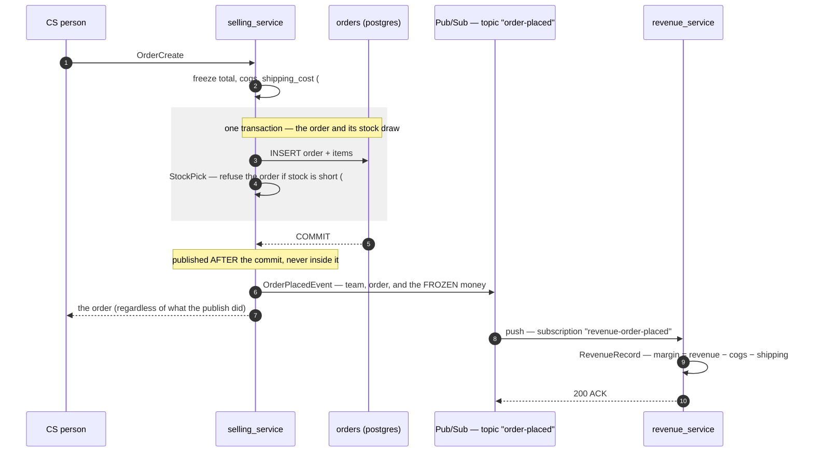

# revenue_service — RPC & the order → revenue flow

## What revenue is here

**Per-order margin rows, not a ledger** (owner, §2.4, 2026-07-20). One row per order holding what the
business *expected* to make on it. No per-team receivable/payable, no payouts, no team-to-team fees.

Every figure is **EXPECTED**, never settled. Reconciling against a real marketplace payout is #76, and
it waits until payout data actually reaches this system (§2.3) — the screen says so in a banner,
because an unlabelled money screen is read as cash in the bank.

---

## An order becomes a revenue row (#153)

`RevenueRecord` and the reporting screen existed before this and did nothing: **nothing called it**, so
the table was empty. This is the wiring.

### Why an event, not a call

Revenue is **downstream** of orders. Recording what an order was expected to make must never be able
to fail the order, so a shop keeps selling while revenue or the broker is down. A publish failure is
logged loudly and the order still succeeds.

### Why the event carries the money

It ships `revenue`, `cogs`, `shipping_cost` and `cost_known` rather than just an order id. Those
figures were **frozen onto the order at placement** (#74), so carrying them makes the event a snapshot
of what was expected *at the time* — which is exactly what a revenue record is. A thin event naming
only an order would make revenue read it back later and record whatever it said then, so an edit
between publish and consume would silently rewrite history.

`cost_known` travels as its own field because **0 cogs is ambiguous** once written down: "free" and
"never recorded" look identical. A margin over an unknown cost reads as pure profit, and the row has to
be able to say so.

### After the commit — and what that costs

| | |
| --- | --- |
| **Publish after commit** *(chosen)* | A crash in between leaves an order with **no revenue row**. Repairable: the order still holds every figure the event carries, and `RevenueRecord` refuses duplicates on `order_id`, so a backfill is safe to run at any time. |
| Publish inside the transaction | A rolled-back order that revenue has **already recorded** — a phantom row for an order that never existed, which nothing would ever correct. |

### A redelivery is ACKed, not failed

Pub/Sub delivers **at least once**, so re-seeing a recorded order is normal. Returning the
`AlreadyExists` would NACK it and Pub/Sub would redeliver **forever** — a message that can never
succeed, because the row it wants is already there. A poison loop built out of correct behaviour.

> The subscription still needs a **dead-letter policy**. The handler cannot tell a permanently
> malformed payload from a database that is briefly down, so it NACKs both.

### Locally there is no broker

The development composition root wires a **loopback** (`cmd/app_development/event_sender.go`): the
event is marshalled exactly as Pub/Sub would carry it and handed to the same push handler.

It exercises the **contract and the handler** — real serialisation, real decode, real dispatch by
subscription name. It does **not** exercise the broker: no retries, no redelivery, no dead-lettering,
and it is synchronous where production is not. For those, run the emulator
(`docker compose --profile pubsub up -d`).

---

## Known gap: a cancelled order keeps its revenue row

Cancel is allowed up to SHIPPED (#150), and nothing currently voids the expected-revenue row — so a
cancelled order still counts toward the totals, which overstates them.

Not silently patched: voiding needs a decision about *what* a voided row looks like (deleted? a
reversing row? a flag?) and probably a schema change. It belongs with #76, where "expected vs actual"
is settled.
