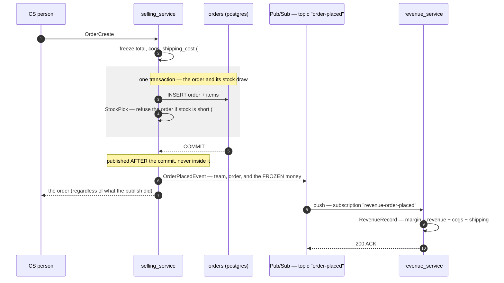
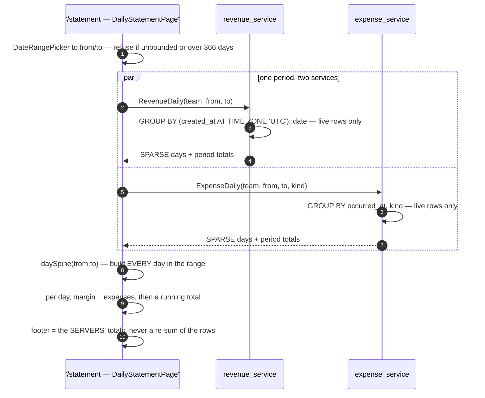

# revenue_service — RPC & the order → revenue flow

## What revenue is here

**Per-order margin rows, not a ledger** (owner, §2.4, 2026-07-20). One row per order holding what the
business *expected* to make on it. No per-team receivable/payable, no payouts, no team-to-team fees.

Every figure is **EXPECTED**, never settled. Reconciling against a real marketplace payout is #76, and
it waits until payout data actually reaches this system (§2.3) — the screen says so in a banner,
because an unlabelled money screen is read as cash in the bank.

---

## An order becomes a revenue row (#153)

`RevenueRecord` and the reporting screen existed before this and did nothing: **nothing called it**, so
the table was empty. This is the wiring.

```mermaid
sequenceDiagram
    autonumber
    participant CS as CS person
    participant S as selling_service
    participant DB as orders (postgres)
    participant PS as Pub/Sub — topic "order-placed"
    participant R as revenue_service

    CS->>S: OrderCreate
    S->>S: freeze total, cogs, shipping_cost (#74)

    rect rgb(240, 240, 240)
        Note over S,DB: one transaction — the order and its stock draw
        S->>DB: INSERT order + items
        S->>S: StockPick — refuse the order if stock is short (#149)
    end

    DB-->>S: COMMIT

    Note over S: published AFTER the commit, never inside it
    S->>PS: OrderPlacedEvent — team, order, and the FROZEN money
    S-->>CS: the order (regardless of what the publish did)

    PS->>R: push — subscription "revenue-order-placed"
    R->>R: RevenueRecord — margin = revenue − cogs − shipping
    R-->>PS: 200 ACK
```

### Why an event, not a call

Revenue is **downstream** of orders. Recording what an order was expected to make must never be able
to fail the order, so a shop keeps selling while revenue or the broker is down. A publish failure is
logged loudly and the order still succeeds.

### Why the event carries the money

It ships `revenue`, `cogs`, `shipping_cost` and `cost_known` rather than just an order id. Those
figures were **frozen onto the order at placement** (#74), so carrying them makes the event a snapshot
of what was expected *at the time* — which is exactly what a revenue record is. A thin event naming
only an order would make revenue read it back later and record whatever it said then, so an edit
between publish and consume would silently rewrite history.

`cost_known` travels as its own field because **0 cogs is ambiguous** once written down: "free" and
"never recorded" look identical. A margin over an unknown cost reads as pure profit, and the row has to
be able to say so.

### After the commit — and what that costs

| | |
| --- | --- |
| **Publish after commit** *(chosen)* | A crash in between leaves an order with **no revenue row**. Repairable: the order still holds every figure the event carries, and `RevenueRecord` refuses duplicates on `order_id`, so a backfill is safe to run at any time. |
| Publish inside the transaction | A rolled-back order that revenue has **already recorded** — a phantom row for an order that never existed, which nothing would ever correct. |

### A redelivery is ACKed, not failed

Pub/Sub delivers **at least once**, so re-seeing a recorded order is normal. Returning the
`AlreadyExists` would NACK it and Pub/Sub would redeliver **forever** — a message that can never
succeed, because the row it wants is already there. A poison loop built out of correct behaviour.

> The subscription still needs a **dead-letter policy**. The handler cannot tell a permanently
> malformed payload from a database that is briefly down, so it NACKs both.

### Locally there is no broker

The development composition root wires a **loopback** (`cmd/app_development/event_sender.go`): the
event is marshalled exactly as Pub/Sub would carry it and handed to the same push handler.

It exercises the **contract and the handler** — real serialisation, real decode, real dispatch by
subscription name. It does **not** exercise the broker: no retries, no redelivery, no dead-lettering,
and it is synchronous where production is not. For those, run the emulator
(`docker compose --profile pubsub up -d`).

---

## The daily statement — `RevenueDaily` + `ExpenseDaily`

`RevenueList` answers *"what did this period make"*. Nothing answered *"which **day** did it"* — and a
month is not a thing that goes wrong. A Tuesday is.

**The statement is assembled on the CLIENT**, from two independent services. Neither owns it, because
neither holds the other's numbers (HARD RULE 3) — the same call the profit screen already made.

> This RPC is the **selling team's** income half. A WAREHOUSE reads the same screen with
> [`SettlementDaily`](../settlement_service/rpc.md#settlementdaily--a-warehouses-income-half-of-the-daily-statement)
> in this one's place, because it has no orders and therefore no rows in this service at all. The
> expenses half is shared.

```mermaid
sequenceDiagram
    autonumber
    participant UI as "/statement — DailyStatementPage"
    participant R as revenue_service
    participant E as expense_service

    UI->>UI: DateRangePicker to from/to — refuse if unbounded or over 366 days

    par one period, two services
        UI->>R: RevenueDaily(team, from, to)
        R->>R: GROUP BY (created_at AT TIME ZONE 'UTC')::date — live rows only
        R-->>UI: SPARSE days + period totals
    and
        UI->>E: ExpenseDaily(team, from, to, kind)
        E->>E: GROUP BY occurred_at, kind — live rows only
        E-->>UI: SPARSE days + period totals
    end

    UI->>UI: daySpine(from,to) — build EVERY day in the range
    UI->>UI: per day, margin − expenses, then a running total
    UI->>UI: footer = the SERVERS' totals, never a re-sum of the rows
```

### The period IS the pagination

Neither RPC takes a page cursor, and that does not breach HARD RULE 9. The rule guards a `repeated`
whose length grows **with the data**. These grow with `to − from`, which the caller states:

| | |
| --- | --- |
| Both bounds **required** | an open end is the unbounded read the rule is about |
| Span **capped at 366 days** | `InvalidArgument` beyond it — refused, never clamped |
| Result | ten years of orders and one year of orders return the same 366 rows |

The same bargain `SearchUser`'s capped typeahead makes. The cap lives in **four** places that must agree:
`maxPeriodDays` in revenue, expense and settlement, and `MAX_PERIOD_DAYS` in
[frontend/src/lib/period.ts](../../../frontend/src/lib/period.ts) — the client knows it so it can explain
a refusal without spending a round trip on an error it could predict.

### Sparse series, one calendar

Both services **omit** days that hold nothing. The client builds the date spine, because it has to
build one anyway to line the two series up — and a server that also emitted empty days would be a
second calendar, free to disagree about what February contains.

A quiet day is still **rendered**, dimmed. A missing row cannot tell a reader "nothing was sold" apart
from "that day did not load".

### The two halves bucket differently, on purpose

| | Bucketed by | Why |
| --- | --- | --- |
| Revenue | `created_at`, cast **in UTC** | the moment the order was placed |
| Expense | `occurred_at` (a DATE) | the day a person said the money **belongs** to — payroll paid on the 5th is last month's |

> ⚠ **The revenue side is bucketed in UTC while the business is UTC+7.** An order placed before 07:00
> local lands on the previous day in this series. It is deliberate *consistency*, not a fresh decision:
> the period filter has always parsed its bounds as UTC midnight, so bucketing in Asia/Jakarta would
> produce daily rows that do not add up to the period total sitting beside them on the same screen.
> Fixing it properly means giving the service a timezone, which is an owner decision, not this RPC's.

### The footer is the server's total, not the rows

Both responses carry the period totals `RevenueList`/`ExpenseList` already report. The screen prints
those rather than summing its own rows — so the statement's footer and the Revenue and Expenses screens
are **one number**, not two that happen to match today. It also means the footer stays whole-period when
"hide days with no activity" is filtering the table, which is the honest reading: hiding empty rows must
not look like it changed the money.

---

## A cancelled order is VOIDED, not left standing (#164)

A row is written when the order is placed, and an order can be cancelled right up to SHIPPED (#150).
Until #164 nothing told revenue, so **the report counted money from orders that fell through**.

`OrderCancel` now publishes an `OrderCancelledEvent` on the same machinery as the placement, and
revenue voids the row.

**Voided, not deleted** (owner, 2026-07-21). A deleted row cannot tell you an order was placed and then
cancelled, and that is exactly what somebody looking at the money wants to see. It mirrors the stock
ledger, which keeps a cancelled order's PICK rows and nets them (#154) rather than erasing them.

So the split matters:

| | |
| --- | --- |
| The **list** | shows voided rows, greyed and flagged — the history is visible |
| The **totals** | exclude them — a cancelled order earned nothing |

Hiding the row from the list would make it as invisible as deleting it, which is the option that was
not chosen.

`RevenueVoid` is **idempotent**, and a missing row is **success**. Both matter for the same reason the
record path ACKs duplicates: Pub/Sub delivers at least once, and an order placed before #153 has no row
to void. Refusing either would NACK a message that can never succeed, and Pub/Sub would redeliver it
forever.
