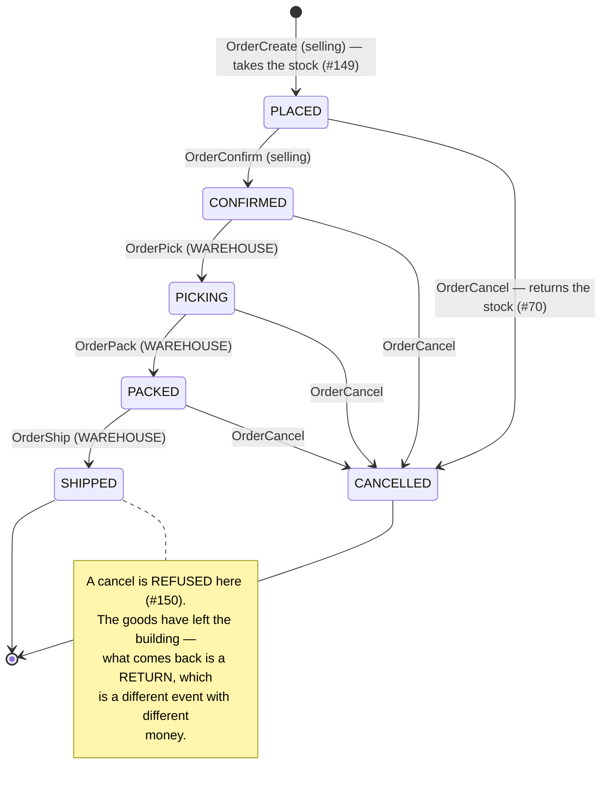

# selling_service — RPC & order lifecycle

## The order lifecycle (#67, #91, #149, #70, #150)

An order is owned by a SELLING team but **fulfilled by a WAREHOUSE**, and the lifecycle is split along
exactly that line: the selling side decides *whether* an order stands, the warehouse side records
*what has physically been done to it*.

### Who may move it, and why the scope differs

| Step | Scoped to | Because |
| --- | --- | --- |
| Create / Confirm / Cancel | the **selling team** | the team that owns the order decides whether it stands |
| Pick / Pack / Ship | the **order's warehouse** (#72) | the crew doing the work holds no role in the selling team |

**This asymmetry is the design, not an inconsistency.** Scoping the fulfilment steps to the selling
team would deny every real caller — a picker is a member of the warehouse, not of the shop whose order
they are packing. So `OrderPick`/`Pack`/`Ship` carry the **warehouse** as their `use_scope` field and
find the order by `(order_id, warehouse_id)`. Another warehouse's order reads as **NotFound**, never
PermissionDenied, so a crew cannot discover that an id belongs to someone else's building.

It mirrors `RestockRequestFulfill`, where the warehouse also acts on a record a selling team created.

### Forward only, one step at a time

Each step names the state it must find and refuses anything else with **FailedPrecondition**. You
cannot pack what was never picked: a skipped state means somebody is guessing at what happened.

The row is locked and the state re-checked **inside** the transaction, so two crew members hitting the
same button at once cannot both see `CONFIRMED` and both advance it — the loser finds the state already
moved.

### Picking does NOT move stock

The stock was deducted when the order was **placed** (#149, "deduct at placement" — the choice that
makes oversell impossible). Picking records that a person is collecting what the system already
committed. **There is no inventory call in `OrderPick` and there must not be one** — a second deduction
would take the goods twice.

### The cancel window (#70/#150)

Cancel is allowed while the goods are still in the building, and returns the stock **exactly where it
came from** — same shelves, same split, because `StockReturn` reverses the movements it recorded rather
than trusting quantities.

It is **refused once SHIPPED**. Putting the stock back then would book goods onto a shelf while they
are on a courier's van; the count would say something untrue until a human noticed. What comes back
after shipping is a **return** — a different event, with different money — and calling it a cancel
would hide that rather than record it.

> A cancel mid-pick leaves physical goods in a picker's hands that the books have already returned to
> their shelves. Re-shelving them is `StockMove`'s job (#136). The books are right; the shelf needs a
> person.
