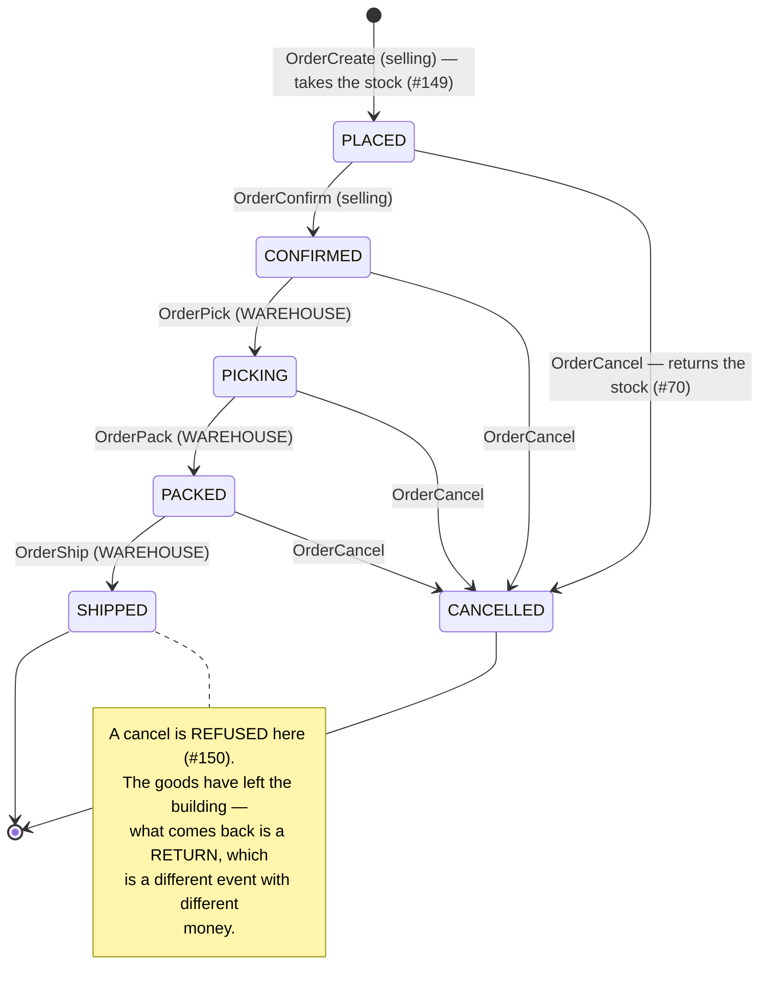
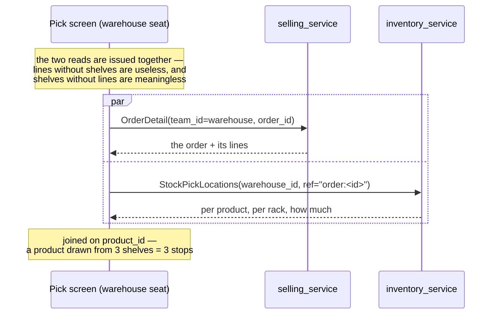
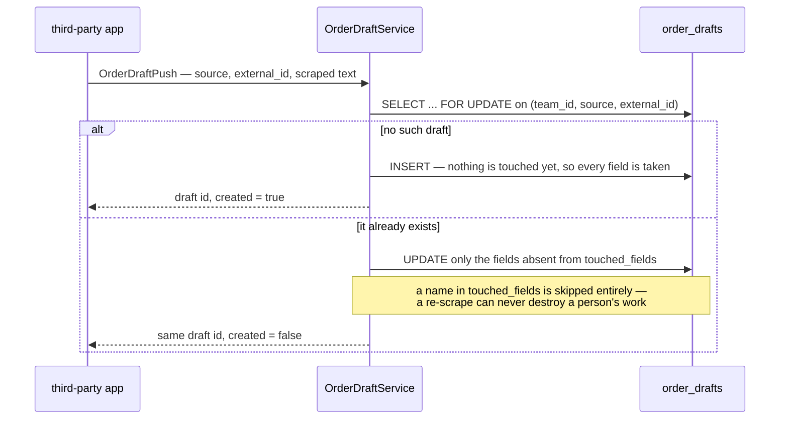

# selling_service — RPC & order lifecycle

## The order lifecycle (#67, #91, #149, #70, #150)

An order is owned by a SELLING team but **fulfilled by a WAREHOUSE**, and the lifecycle is split along
exactly that line: the selling side decides *whether* an order stands, the warehouse side records
*what has physically been done to it*.



### Who may move it, and why the scope differs

| Step | Scoped to | Because |
| --- | --- | --- |
| Create / Confirm / Cancel | the **selling team** | the team that owns the order decides whether it stands |
| Pick / Pack / Ship | the **order's warehouse** (#72) | the crew doing the work holds no role in the selling team |

**This asymmetry is the design, not an inconsistency.** Scoping the fulfilment steps to the selling
team would deny every real caller — a picker is a member of the warehouse, not of the shop whose order
they are packing. So `OrderPick`/`Pack`/`Ship` carry the **warehouse** as their `use_scope` field and
find the order by `(order_id, warehouse_id)`. Another warehouse's order reads as **NotFound**, never
PermissionDenied, so a crew cannot discover that an id belongs to someone else's building.

It mirrors `RestockRequestFulfill`, where the warehouse also acts on a record a selling team created.

### Forward only, one step at a time

Each step names the state it must find and refuses anything else with **FailedPrecondition**. You
cannot pack what was never picked: a skipped state means somebody is guessing at what happened.

The row is locked and the state re-checked **inside** the transaction, so two crew members hitting the
same button at once cannot both see `CONFIRMED` and both advance it — the loser finds the state already
moved.

### Picking does NOT move stock

The stock was deducted when the order was **placed** (#149, "deduct at placement" — the choice that
makes oversell impossible). Picking records that a person is collecting what the system already
committed. **There is no inventory call in `OrderPick` and there must not be one** — a second deduction
would take the goods twice.

### The cancel window (#70/#150)

Cancel is allowed while the goods are still in the building, and returns the stock **exactly where it
came from** — same shelves, same split, because `StockReturn` reverses the movements it recorded rather
than trusting quantities.

It is **refused once SHIPPED**. Putting the stock back then would book goods onto a shelf while they
are on a courier's van; the count would say something untrue until a human noticed. What comes back
after shipping is a **return** — a different event, with different money — and calling it a cancel
would hide that rather than record it.

> A cancel mid-pick leaves physical goods in a picker's hands that the books have already returned to
> their shelves. Re-shelving them is `StockMove`'s job (#136). The books are right; the shelf needs a
> person.

---

## The pick screen's reads (#151)

The crew's screen is a join of things that already existed — but two of the reads it needs were
**selling-scoped only**, so the warehouse could not perform its own work.

### Both ends of an order

`OrderList` and `OrderDetail` matched `team_id` alone. The write side landed in #150 (`OrderPick` /
`OrderPack` / `OrderShip`, all scoped to the **warehouse**) without the read side following, so a crew
could record work on an order it was not allowed to look at.

Both now match **either end**, and `team_id` means *"the team you hold a role in"* rather than *"the
team whose orders you get"*:

```sql
WHERE (team_id = ? OR warehouse_id = ?)
```

`OrderList` also takes a **status filter**, which is what makes it a queue rather than a list.
Server-side, because the list is paginated: a client-side filter narrows the loaded page only and
still reports the unfiltered total.

### Which shelf to walk to — `StockPickLocations`

The screen's one hard question: a product can sit on several racks (#135), so which does the picker
walk to? Answered by **inventory_service**, from the **ledger**:



**From the ledger, not from stock levels — this is the whole design.** The goods were drawn at
placement (#149) and `StockPick` recorded, per rack, exactly how much it took under `ref =
order:<id>`. Those movements are what the order *holds*. Current levels answer a question whose answer
keeps moving — another order draws from the same shelf, a stock-take shifts goods — and a picker sent
by current levels can arrive at a shelf whose stock is spoken for.

`PICK` and `RETURN` rows are **netted**, and only a positive remainder is a stop on the walk. Reading
`PICK` alone looks right and is not: the ledger is append-only, so a cancelled order's `PICK` rows
survive its return and the screen would send a picker after goods that are back on the shelf.

The walk is ordered as `StockPick` drained it (#149) — the unplaced pile first, then shelves by label —
so it reads as the route the system already planned.

> A product on two shelves appears **twice**, each with its own quantity. #151 asked for "a shelf, or
> all of them with quantities, rather than silently picking one"; when the goods genuinely are in two
> places, listing both is the only honest answer. `rack_id = 0` is the **unplaced pile** — a real place
> (#135), named in words on screen, never a blank cell.

---

## Placing an order announces it (#153)

After `OrderCreate` commits, selling_service publishes an **`OrderPlacedEvent`** carrying the frozen
money. `revenue_service` consumes it and writes the order's expected-margin row.

Published **after** the commit and **never inside** it, and a publish failure does **not** fail the
order — revenue is downstream, and a shop must keep selling while it is down.

selling_service does not know revenue is listening. It names no topic either: the event declares its
own (`warehouse.event_base.v1.event_config`), so a publisher cannot send it to the wrong one.

> The full flow, the delivery trade-off, and why the event carries the money rather than just an order
> id are in [revenue_service/rpc.md](../revenue_service/rpc.md).

## Draft orders — `OrderDraftPush` and the blanks-only merge (#190, #191)

A **draft** is an incomplete order pushed in by a **third-party app**, which a person here finishes
and promotes. It lives in `order_drafts` / `order_draft_items`, not in `orders` — see
[database-schema.md](../../database-schema.md) for why, and
`plans/selling_service/brainstorming.md` §6 for the design.

`OrderDraftPush` is worth documenting because it is not the CRUD it looks like: it is a
**create-or-update keyed on `(team_id, source, external_id)` that writes untouched fields only**.



**Why the RPC name carries the rule.** The app and the person authenticate as the **same user** — the
app logs in as one, because there is no machine identity in this system — so *identity cannot tell
them apart*. `OrderDraftPush` yields to a human; `OrderDraftUpdate` (#193) always wins and marks what
it wrote. Merging the two into one handler would erase the only thing distinguishing them.

Four details that are decisions rather than implementation:

- **It is "untouched fields only", NOT "empty fields only".** An untouched field the app has changed
  its mind about *is* updated — the app remains the authority on everything nobody here has claimed.
- **The address is one touched field, not ten columns.** Somebody who corrects a kecamatan has
  corrected the address, and rewriting the nine columns around their fix would leave a hybrid address
  that was never true anywhere.
- **`items` is one touched field too.** Once a person has edited any line, the app stops rewriting
  the lines altogether. Per-line merging would need a per-line touched mark; the rule that matters —
  a re-scrape never destroys a mapping — holds without one. While untouched, the lines are replaced
  **wholesale**, so a line the app no longer sees disappears rather than lingering.
- **`product_id` is ignored on push.** The app does not know our catalogue ids, and a client matching
  titles against our catalogue on its own would guess wrong silently. Mapping is a human act. This is
  the same instinct as `OrderItem.unit_cost`, which `OrderCreate` also refuses from the client.

**The author follows the push.** A draft is personal, and a colleague cannot pick one up — so
re-pushing under the right person's login is the only way to hand a draft over. That makes
reassignment the escape hatch "personal" leans on rather than an accident.

**A draft publishes nothing.** `OrderCreatedEvent` fires at placement (#153) and revenue consumes it
(#75). A draft that published would put an unfinished scrape into the month's margin — promote (#194)
is the only door into revenue.
