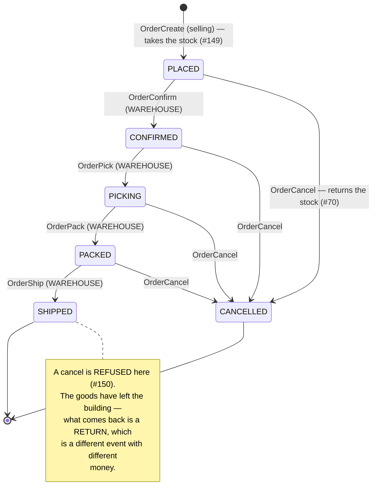
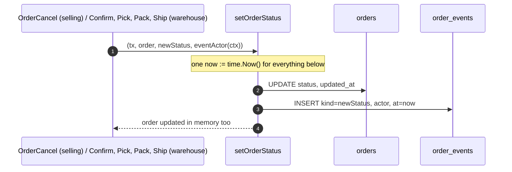
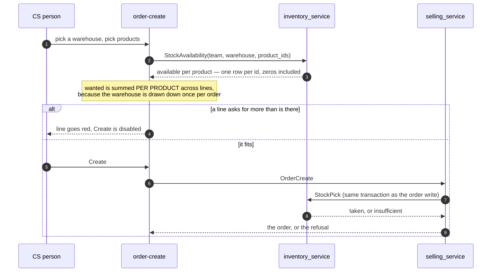
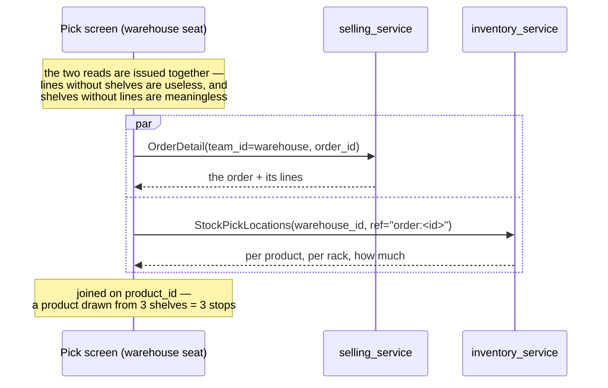
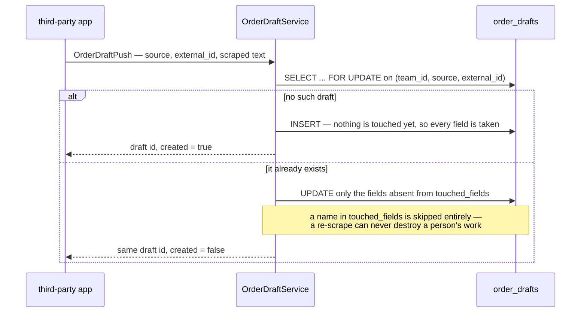
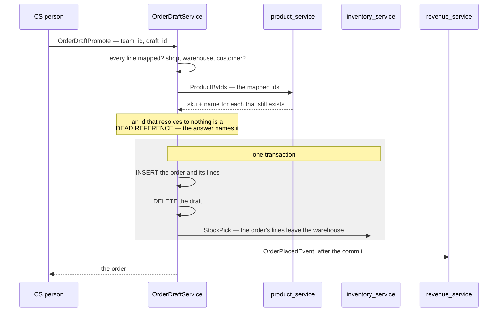

# selling_service — RPC & order lifecycle

## The order lifecycle (#67, #91, #149, #70, #150)

An order is owned by a SELLING team but **fulfilled by a WAREHOUSE**, and the lifecycle is split along
exactly that line: the selling side decides *whether* an order stands, the warehouse side records
*what has physically been done to it*.

> ⚠ **CONFIRM MOVED** (owner). It was the selling team's click (#91) and is now the WAREHOUSE's first
> step — the building accepting the job. The team that TYPED an order in has nothing left to decide
> about it, so its confirm asserted nothing; the warehouse's means the goods are there and the work is
> taken on. A PLACED order is therefore waiting on the **warehouse**, not on the seller.


```mermaid
stateDiagram-v2
    [*] --> PLACED: OrderCreate (selling) — takes the stock (#149)
    PLACED --> CONFIRMED: OrderConfirm (WAREHOUSE)
    CONFIRMED --> PICKING: OrderPick (WAREHOUSE)
    PICKING --> PACKED: OrderPack (WAREHOUSE)
    PACKED --> SHIPPED: OrderShip (WAREHOUSE)
    SHIPPED --> [*]

    PLACED --> CANCELLED: OrderCancel — returns the stock (#70)
    CONFIRMED --> CANCELLED: OrderCancel
    PICKING --> CANCELLED: OrderCancel
    PACKED --> CANCELLED: OrderCancel
    CANCELLED --> [*]

    note right of SHIPPED
        A cancel is REFUSED here (#150).
        The goods have left the building —
        what comes back is a RETURN, which
        is a different event with different
        money.
    end note
```

### Who may move it, and why the scope differs

| Step | Scoped to | Because |
| --- | --- | --- |
| Create / Cancel | the **selling team** | the team that owns the order decides whether it stands |
| **Confirm** / Pick / Pack / Ship | the **order's warehouse** (#72) | the crew doing the work holds no role in the selling team |

**This asymmetry is the design, not an inconsistency.** Scoping the fulfilment steps to the selling
team would deny every real caller — a picker is a member of the warehouse, not of the shop whose order
they are packing. So `OrderPick`/`Pack`/`Ship` carry the **warehouse** as their `use_scope` field and
find the order by `(order_id, warehouse_id)`. Another warehouse's order reads as **NotFound**, never
PermissionDenied, so a crew cannot discover that an id belongs to someone else's building.

It mirrors `RestockRequestFulfill`, where the warehouse also acts on a record a selling team created.

### Forward only, one step at a time

Each step names the state it must find and refuses anything else with **FailedPrecondition**. You
cannot pack what was never picked: a skipped state means somebody is guessing at what happened.

The row is locked and the state re-checked **inside** the transaction, so two crew members hitting the
same button at once cannot both see `CONFIRMED` and both advance it — the loser finds the state already
moved.

### Every move leaves a step — the order's history (`order_events`)

The lifecycle above is drawn as states, but a state is a fact about *now*. Nothing in `orders` could
say **when** an order was confirmed, **how long** it then sat before the crew picked it, or **who** did
either — the row carries `status`, `created_at` and `updated_at`, and no actor at all. So each
transition appends a row to `order_events`, and the detail page's **Timeline** tab reads those.

**The append happens at the single choke point**, not in the handlers:


```mermaid
sequenceDiagram
    autonumber
    participant H as OrderCancel (selling) / Confirm, Pick, Pack, Ship (warehouse)
    participant S as setOrderStatus
    participant O as orders
    participant E as order_events

    H->>S: (tx, order, newStatus, eventActor(ctx))
    Note over S: one now := time.Now() for everything below
    S->>O: UPDATE status, updated_at
    S->>E: INSERT kind=newStatus, actor, at=now
    S-->>H: order updated in memory too
```

- **One clock, one moment.** The status stamp, the event's `at` and the domain event a caller may
  publish afterwards all read the same `now`. Two clock reads for one fact would file a midnight
  transition on different days depending on who looked.
- **`placeOrder` appends its own `placed` step**, so an order typed into the form and one promoted from
  a draft start the same history — the two doors cannot differ.
- **The actor is `eventActor(ctx)` — 0 when unidentifiable, and that never fails the call.** This is a
  deliberate contrast with `draftAuthor`, which refuses the request outright: a draft is personal, so an
  unidentifiable caller has no correct answer to receive, whereas an event is a byproduct and the
  record-keeping must not be able to veto the work.
- **`OrderDetail` is the only RPC that returns them**, preloaded ordered by `at` — never by `id`, since
  the 00011 backfill inserted every order's `placed` row before any later one. `OrderList` stays a
  summary: a page of 20 orders carrying 20 whole lifecycles is a list that grows with history.

See [database-schema.md](../../database-schema.md) for the table, the backfill's honest two-event
ceiling, and why the status column is kept beside the events rather than replaced by them.

### Picking does NOT move stock

The stock was deducted when the order was **placed** (#149, "deduct at placement" — the choice that
makes oversell impossible). Picking records that a person is collecting what the system already
committed. **There is no inventory call in `OrderPick` and there must not be one** — a second deduction
would take the goods twice.

### The cancel window (#70/#150)

Cancel is allowed while the goods are still in the building, and returns the stock **exactly where it
came from** — same shelves, same split, because `StockReturn` reverses the movements it recorded rather
than trusting quantities.

It is **refused once SHIPPED**. Putting the stock back then would book goods onto a shelf while they
are on a courier's van; the count would say something untrue until a human noticed. What comes back
after shipping is a **return** — a different event, with different money — and calling it a cancel
would hide that rather than record it.

> A cancel mid-pick leaves physical goods in a picker's hands that the books have already returned to
> their shelves. Re-shelving them is `StockMove`'s job (#136). The books are right; the shelf needs a
> person.

---

## The create form asks before it takes — `StockAvailability` (#90)

`OrderCreate` draws the goods in the same transaction that writes the order, so **not enough stock is
not a warning — it is a failed order**. Before this, the person typing found that out from a red error
after filling in the customer, the address and every line.

The form now reads `inventory.v1.InventoryService/StockAvailability` for the products on it, whenever a
warehouse is chosen, and marks any line the warehouse cannot fill.


```mermaid
sequenceDiagram
    autonumber
    participant CS as CS person
    participant UI as order-create
    participant INV as inventory_service
    participant SELL as selling_service

    CS->>UI: pick a warehouse, pick products
    UI->>INV: StockAvailability(team, warehouse, product_ids)
    INV-->>UI: available per product — one row per id, zeros included
    Note over UI: wanted is summed PER PRODUCT across lines,<br/>because the warehouse is drawn down once per order
    alt a line asks for more than is there
        UI-->>CS: line goes red, Create is disabled
    else it fits
        CS->>UI: Create
        UI->>SELL: OrderCreate
        SELL->>INV: StockPick (same transaction as the order write)
        INV-->>SELL: taken, or insufficient
        SELL-->>UI: the order, or the refusal
    end
```

**The check is ADVISORY. `StockPick` remains the authority** — two people can place orders against one
shelf in the same second, so anything read beforehand is already historical. The pre-check exists to
stop somebody wasting five minutes of typing, not to guarantee the pick.

### Why not `OwnerStockByIds`

That RPC derives ownership from the restock a unit arrived on
(`stock_shelf_batches → stock_batches → restock_request_items → restock_requests.requesting_team_id`).
Stock that reached a shelf any other way — a direct receive, an adjustment, a transfer — belongs to
nobody by that chain and reads as **0**, while a pick would take it happily.

Gating a Create button on that number refuses orders the warehouse can plainly fill, which is a worse
lie than showing nothing. `StockAvailability` reads the rows `pickOneLine` actually drains, and carries
`StockPick`'s policy and scoping exactly — the selling team's roles, scoped to their own team, with the
warehouse as an ordinary parameter.

## The pick screen's reads (#151)

The crew's screen is a join of things that already existed — but two of the reads it needs were
**selling-scoped only**, so the warehouse could not perform its own work.

### Both ends of an order

`OrderList` and `OrderDetail` matched `team_id` alone. The write side landed in #150 (`OrderPick` /
`OrderPack` / `OrderShip`, all scoped to the **warehouse**) without the read side following, so a crew
could record work on an order it was not allowed to look at.

Both now match **either end**, and `team_id` means *"the team you hold a role in"* rather than *"the
team whose orders you get"*:

```sql
WHERE (team_id = ? OR warehouse_id = ?)
```

`OrderList` also takes a **status filter**, which is what makes it a queue rather than a list.
Server-side, because the list is paginated: a client-side filter narrows the loaded page only and
still reports the unfiltered total.

### Which shelf to walk to — `StockPickLocations`

The screen's one hard question: a product can sit on several racks (#135), so which does the picker
walk to? Answered by **inventory_service**, from the **ledger**:


```mermaid
sequenceDiagram
    participant UI as Pick screen (warehouse seat)
    participant S as selling_service
    participant I as inventory_service

    Note over UI: the two reads are issued together —<br/>lines without shelves are useless, and<br/>shelves without lines are meaningless
    par
        UI->>S: OrderDetail(team_id=warehouse, order_id)
        S-->>UI: the order + its lines
    and
        UI->>I: StockPickLocations(warehouse_id, ref="order:<id>")
        I-->>UI: per product, per rack, how much
    end

    Note over UI: joined on product_id —<br/>a product drawn from 3 shelves = 3 stops
```

**From the ledger, not from stock levels — this is the whole design.** The goods were drawn at
placement (#149) and `StockPick` recorded, per rack, exactly how much it took under `ref =
order:<id>`. Those movements are what the order *holds*. Current levels answer a question whose answer
keeps moving — another order draws from the same shelf, a stock-take shifts goods — and a picker sent
by current levels can arrive at a shelf whose stock is spoken for.

`PICK` and `RETURN` rows are **netted**, and only a positive remainder is a stop on the walk. Reading
`PICK` alone looks right and is not: the ledger is append-only, so a cancelled order's `PICK` rows
survive its return and the screen would send a picker after goods that are back on the shelf.

The walk is ordered as `StockPick` drained it (#149) — the unplaced pile first, then shelves by label —
so it reads as the route the system already planned.

> A product on two shelves appears **twice**, each with its own quantity. #151 asked for "a shelf, or
> all of them with quantities, rather than silently picking one"; when the goods genuinely are in two
> places, listing both is the only honest answer. `rack_id = 0` is the **unplaced pile** — a real place
> (#135), named in words on screen, never a blank cell.

---

## Placing an order announces it (#153)

After `OrderCreate` commits, selling_service publishes an **`OrderPlacedEvent`** carrying the frozen
money. `revenue_service` consumes it and writes the order's expected-margin row.

Published **after** the commit and **never inside** it, and a publish failure does **not** fail the
order — revenue is downstream, and a shop must keep selling while it is down.

selling_service does not know revenue is listening. It names no topic either: the event declares its
own (`warehouse.event_base.v1.event_config`), so a publisher cannot send it to the wrong one.

> The full flow, the delivery trade-off, and why the event carries the money rather than just an order
> id are in [revenue_service/rpc.md](../revenue_service/rpc.md).

## Draft orders — `OrderDraftPush` and the blanks-only merge (#190, #191)

A **draft** is an incomplete order pushed in by a **third-party app**, which a person here finishes
and promotes. It lives in `order_drafts` / `order_draft_items`, not in `orders` — see
[database-schema.md](../../database-schema.md) for why, and
`plans/selling_service/brainstorming.md` §6 for the design.

`OrderDraftPush` is worth documenting because it is not the CRUD it looks like: it is a
**create-or-update keyed on `(team_id, source, external_id)` that writes untouched fields only**.


```mermaid
sequenceDiagram
    participant App as third-party app
    participant D as OrderDraftService
    participant DB as order_drafts

    App->>D: OrderDraftPush — source, external_id, scraped text
    D->>DB: SELECT ... FOR UPDATE on (team_id, source, external_id)
    alt no such draft
        D->>DB: INSERT — nothing is touched yet, so every field is taken
        D-->>App: draft id, created = true
    else it already exists
        D->>DB: UPDATE only the fields absent from touched_fields
        Note over D,DB: a name in touched_fields is skipped entirely —<br/>a re-scrape can never destroy a person's work
        D-->>App: same draft id, created = false
    end
```

**Why the RPC name carries the rule.** The app and the person authenticate as the **same user** — the
app logs in as one, because there is no machine identity in this system — so *identity cannot tell
them apart*. `OrderDraftPush` yields to a human; `OrderDraftUpdate` (#193) always wins and marks what
it wrote. Merging the two into one handler would erase the only thing distinguishing them.

Four details that are decisions rather than implementation:

- **It is "untouched fields only", NOT "empty fields only".** An untouched field the app has changed
  its mind about *is* updated — the app remains the authority on everything nobody here has claimed.
- **The address is one touched field, not ten columns.** Somebody who corrects a kecamatan has
  corrected the address, and rewriting the nine columns around their fix would leave a hybrid address
  that was never true anywhere.
- **`items` is one touched field too.** Once a person has edited any line, the app stops rewriting
  the lines altogether. Per-line merging would need a per-line touched mark; the rule that matters —
  a re-scrape never destroys a mapping — holds without one. While untouched, the lines are replaced
  **wholesale**, so a line the app no longer sees disappears rather than lingering.
- **`product_id` is ignored on push.** The app does not know our catalogue ids, and a client matching
  titles against our catalogue on its own would guess wrong silently. Mapping is a human act. This is
  the same instinct as `OrderItem.unit_cost`, which `OrderCreate` also refuses from the client.

**The author follows the push.** A draft is personal, and a colleague cannot pick one up — so
re-pushing under the right person's login is the only way to hand a draft over. That makes
reassignment the escape hatch "personal" leans on rather than an accident.

**A draft publishes nothing.** `OrderCreatedEvent` fires at placement (#153) and revenue consumes it
(#75). A draft that published would put an unfinished scrape into the month's margin — promote (#194)
is the only door into revenue.

### Reading drafts — two narrowings, not one (#192)

`OrderDraftList` and `OrderDraftDetail` both apply **two** restrictions, and they are different kinds
of thing:

| | What it is | Enforced by |
| --- | --- | --- |
| `team_id` | the authorization **scope** (`use_scope`) | the access interceptor |
| `author_user_id` | a **handler filter** — a draft is personal working state | the query itself |

⚠ **The scope is not optional just because the list is personal.** A team-level role policy on a
message with no `use_scope` field is evaluated against the *root team*, where almost nobody is a
member — so "simplifying" this to author-only would leave a policy that authorizes nobody.

A colleague's draft reads as **NotFound**, not PermissionDenied: the caller holds a perfectly good
role in the team, and "exists but is not yours" would leak that a given external ref has already been
scraped by somebody else.

**The list carries counts, not lines.** `item_count` and `unmapped_item_count` are aggregated in one
`GROUP BY` for the whole page — they are the only thing on the list screen (#195) that says how much
work is left on a draft, and computing them client-side would mean loading every draft's lines to
render one page of a list. A non-zero `unmapped_item_count` is exactly what makes a draft still a
draft.

### The human edit path — `OrderDraftUpdate` (#193)

The other half of the merge rule. `OrderDraftUpdate` **always wins** and **marks every field it
writes as touched**; `OrderDraftPush` then refuses to overwrite anything carrying that mark. Neither
handler makes sense read alone.

**Presence decides what was edited, not emptiness.** Every field is `optional`, so a field left unset
is neither written nor marked. If "unset" and "set to empty" were indistinguishable, the first save
anybody made would mark every field touched and freeze the whole draft against the app forever — and
clearing a wrongly-scraped phone number would stop being expressible at all.

**The lines are sent as the complete desired set** (`items`, a wrapper message so it has presence —
absent means "leave the lines alone", present-and-empty means "this draft has no lines"). An id edits
an existing line, `id = 0` adds one, and an omitted line is **deleted**: a buyer who cancels one line
of three must be able to say so, or the draft stays unpromotable forever over a line nobody wants.

⚠ **The edit cannot carry the scraped text.** `external_sku` / `external_name` are absent from
`OrderDraftLineEdit` by design — a request that could rewrite them could quietly make the evidence
agree with a wrong mapping, which is the one failure that keeping both halves on the line was meant
to catch. A hand-added line has empty external text, which truthfully says nobody scraped it.

### Pruning — `OrderDraftDelete` (#193)

**Bulk, and a hard delete.** Nothing expires (§6.7), so this is the only thing between the list and a
graveyard, and an app pushing continuously fills that list faster than a person deletes one at a
time. Hard rather than soft because a draft is working state that was never an order — a soft-deleted
draft would be a row every future reader has to remember to exclude, which is precisely the trap the
separate table was built to avoid. The lines go with it via `ON DELETE CASCADE`.

**Fewer deleted than asked for is a normal answer.** An id already gone, or never the caller's, is
skipped rather than failing the batch: deleting is idempotent by nature, and refusing over one stale
id would make a bulk prune unusable exactly when the list is long enough to need one. The scope and
the author are in the `WHERE` rather than checked beforehand, so there is no window in which the ids
stop being the caller's.

### A draft becomes an order — `OrderDraftPromote` (#194)


```mermaid
sequenceDiagram
    participant CS as CS person
    participant D as OrderDraftService
    participant P as product_service
    participant I as inventory_service
    participant R as revenue_service

    CS->>D: OrderDraftPromote — team_id, draft_id
    D->>D: every line mapped? shop, warehouse, customer?
    D->>P: ProductByIds — the mapped ids
    P-->>D: sku + name for each that still exists
    Note over D: an id that resolves to nothing is a<br/>DEAD REFERENCE — the answer names it
    rect rgb(240, 240, 240)
        Note over D,I: one transaction
        D->>D: INSERT the order and its lines
        D->>D: DELETE the draft
        D->>I: StockPick — the order's lines leave the warehouse
    end
    D->>R: OrderPlacedEvent, after the commit
    D-->>CS: the order
```

**It runs the same code path `OrderCreate` runs**, not a copy of it — `placeOrder` in
[order_place.go](../../../backend/services/selling_service/selling_v1/order_place.go). That is the
payoff the separate drafts table was chosen for: what counts as a placeable order is defined once, so
the draft door cannot quietly accept an order the form would refuse. `placeOrder` re-checks the field
rules that proto validation covers for `OrderCreate`, because promote's request carries only a draft
id and none of those rules ran.

**One transaction, not two.** `orders` and `order_drafts` are the same service in the same database,
so the order is written and the draft deleted together. A refused promote leaves the draft intact to
be fixed — which is the behaviour that makes retrying safe.

**The money is recomputed from the mapped lines**, not carried over. A draft's totals are whatever the
marketplace page said, and the lines somebody actually mapped may not add up to that — a line removed,
a quantity corrected. An order's totals must agree with its own lines, because margin comes from them.

**The line freezes the CATALOGUE's label, not the scrape.** `external_name` is what the buyer clicked
on; `sku`/`name` on the order line say what we shipped. They come from `ProductByIds` because
promote's request names a draft, not a basket — there is nowhere honest for them to come from except
the catalogue. (`OrderCreate` takes them from the request because the person typing has the catalogue
open in front of them.)

**Stale references are named, not lumped together.** A draft names products by id with no FK, so one
can be deleted between the mapping and the promote. Every dead id is reported at once — somebody who
must re-map three lines should learn that in one attempt, not by promoting three times. The `shop_id`
check falls out of `placeOrder`'s existing shop lookup.

> ⚠ **The warehouse id is NOT re-checked.** `team_service` has no by-id existence RPC selling_service
> could call, and inventing one for this was out of scope. A warehouse deleted underneath a draft
> surfaces as the stock pick failing, which is late and reads as a stock problem. Worth fixing when
> something else needs that lookup.

**This is where `OrderPlacedEvent` fires, and the only place a draft ever reaches revenue.** Pushing
and editing publish nothing at all — there is a test asserting exactly that, because "a draft must
never publish" is the kind of rule that is only ever violated by accident.
