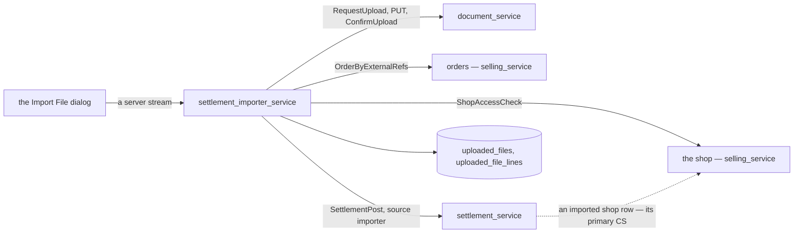
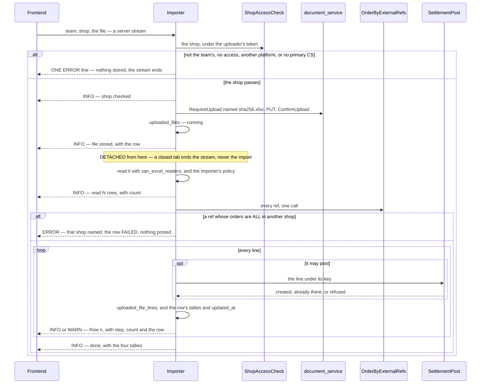
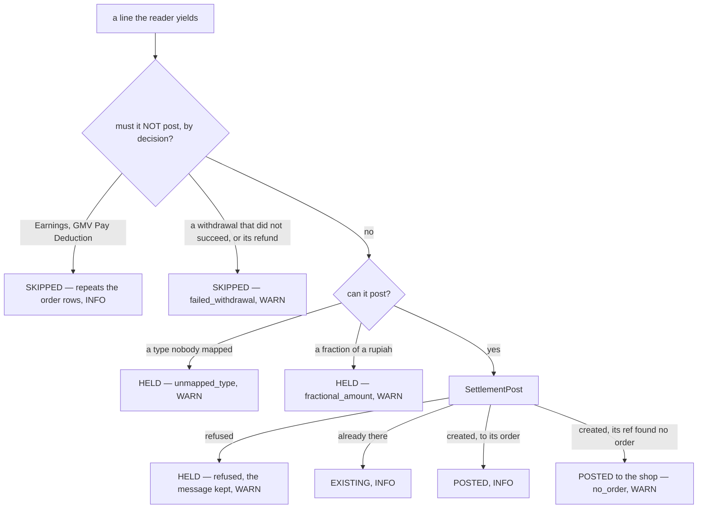

# settlement_importer_service — RPC flows

A platform statement, uploaded as a file and posted to the settlement ledger line by line
([settlement_importer.md](../../business/settlement/settlement_importer.md) · decided:
[settlement_importer_decision.md](../../business/settlement/settlement_importer_decision.md)).

| RPC | what it is |
| --- | --- |
| `ShopeeSettlementImport` · `TiktokSettlementImport` | one import, **server-streamed** — `level`, `message`, `step`, `count`, `file` |
| `UploadedFileList` | the import screen — a team's uploads, newest first, filtered by shop, platform, status |
| `UploadedFileByIds` | one file's page reads its own row |
| `UploadedFileLineList` | one file's lines by outcome — held · skipped · posted to the shop |

**It owns no ledger and calls four services**, each through an interface it declares and a Connect client
the composition root builds ([settlement_importer_deps.go](../../../backend/cmd/app_development/settlement_importer_deps.go)),
forwarding the **uploader's own token** (`san_auth.ForwardBearer`) — so every call is authorized as the
uploader, and every row posted is theirs.

---

## One import

[the-import-is-one-streamed-call](../../business/settlement/settlement_importer_decision.md#the-import-is-one-streamed-call).
The access interceptor has checked the request's team before the handler runs
([a-server-stream-is-authorized-on-its-request](../../business/settlement/settlement_importer_decision.md#a-server-stream-is-authorized-on-its-request));
the handler reads `team_id` off its own request, since a stream's ctx carries no scope.

| | |
| --- | --- |
| **a refusal** | always an `ERROR` line and a normal end of stream, never a connect error. Before the file is stored there is no row; after, the row reads `failed` — the screen tells the two apart by whether a file came with it |
| **the shop check** | not the team's → *"not one of your team's shops"* · no access (a grant, or the team's owner or admin — [a-write-needs-a-grant-or-a-manager](../../business/shop/context_decision.md#a-write-needs-a-grant-or-a-manager)) · the shop's marketplace is not the RPC's · no primary CS → *"… has no primary CS — choose a primary CS first"* ([a-shop-with-no-primary-cs-cannot-import](../../business/settlement/settlement_importer_decision.md#a-shop-with-no-primary-cs-cannot-import)) |
| **the file** | stored FIRST, named `<sha256>.xlsx` ([the-file-is-named-by-its-content-hash](../../business/settlement/settlement_importer_decision.md#the-file-is-named-by-its-content-hash)), resource type `SETTLEMENT_STATEMENT` (private) — so a file the reader refuses is still kept |
| **the file check** | a ref whose orders are ALL in another shop fails the file, naming the shop holding the most such refs; a ref the chosen shop also has counts as its own ([a-file-with-another-shops-orders-is-refused](../../business/settlement/settlement_importer_decision.md#a-file-with-another-shops-orders-is-refused)) |
| **the detach** | `context.WithoutCancel` — the uploader's identity and token ride on, only the cancellation is dropped. The stream is a window (`streamSink`): the handler detaches it before it returns, and a send after the viewer left is noted once in the server log. `Service.Wait` lets a shutdown finish running imports while the server still serves |
| **a server stopped mid-file** | the row stays `running`, its `updated_at` stops, and after two minutes it reads `interrupted` — the same file again finishes it, every posted line answering *already there* |
| **the log** | the long-task guideline's slog binding, as a `slog.Handler`: each record's LEVEL becomes `level`, the attributes `step` · `count` · `file` become fields, everything also reaches the server log |
| **the size** | the file is held to 10 MB by the request's `max_len`; the handler reads at most 15 MB, since the browser's JSON carries 10 MB as ~13.4 MB of base64 |

## What a line becomes

| platform | the ref | key | the importer's policy |
| --- | --- | --- | --- |
| Shopee `Rincian Transaksi` | `No. Pesanan` | `shopee:rincian_transaksi:<hash>` | a `Penarikan Dana` posts only when `Status` is `Transaksi Selesai` AND money left ([only-a-successful-withdrawal-is-recorded](../../business/settlement/settlement_importer_decision.md#only-a-successful-withdrawal-is-recorded)) — the status is read off the reader's detail, never the hashed item |
| TikTok `Order details` | `Related order ID` ([a-tiktok-row-finds-its-order-by-related-order-id](../../business/settlement/settlement_importer_decision.md#a-tiktok-row-finds-its-order-by-related-order-id)) | `tiktok:order_details:<hash>` | an `Order` row's `Affiliate …` columns post as their own `affiliate_fee` row, key `…:affiliate_fee`, and the `fund` carries the payout before them ([tiktok-affiliate-commission-posts-as-affiliate-fee](../../business/settlement/settlement_importer_decision.md#tiktok-affiliate-commission-posts-as-affiliate-fee)) — a fund held holds its commission with it. A file with no `Affiliate` column is refused, and so is one not in IDR |
| TikTok `Withdrawal records` | none — the shop | `tiktok:withdrawal_records:<hash>` | `Withdrawal` posts only when `Transferred`; `Earnings` and `GMV Pay Deduction` are skipped |

Every posting line goes to settlement as source `importer`, with the order's creator when its ref finds
the order — stamped on the account if the post opens it — and to the shop otherwise, where settlement
itself asks the shop for the primary CS the row counts for
([settlement-asks-the-shop-for-its-primary-cs](../../business/settlement/settlement_importer_decision.md#settlement-asks-the-shop-for-its-primary-cs)).
The order a ref finds, among several in the shop: a live one before a cancelled one, then the newest.

## The reads

| RPC | shape | scope |
| --- | --- | --- |
| `UploadedFileList` | the guideline List — `ids`, `GENERAL` (name = the statement's range) and `FILE` slices, paged; newest first, or by `period_to` | the team's rows only; the status filter draws RUNNING and INTERRUPTED on the same two-minute line |
| `UploadedFileByIds` | the guideline ByIds — id → its slices | another team's file is absent |
| `UploadedFileLineList` | the guideline List over one file's lines, filtered by outcomes AND reasons — the file page asks HELD, SKIPPED, and POSTED + NO_ORDER | another team's file is `NotFound` |

Code: [backend/services/settlement_importer_service/settlement_importer_v1/](../../../backend/services/settlement_importer_service/settlement_importer_v1/).
