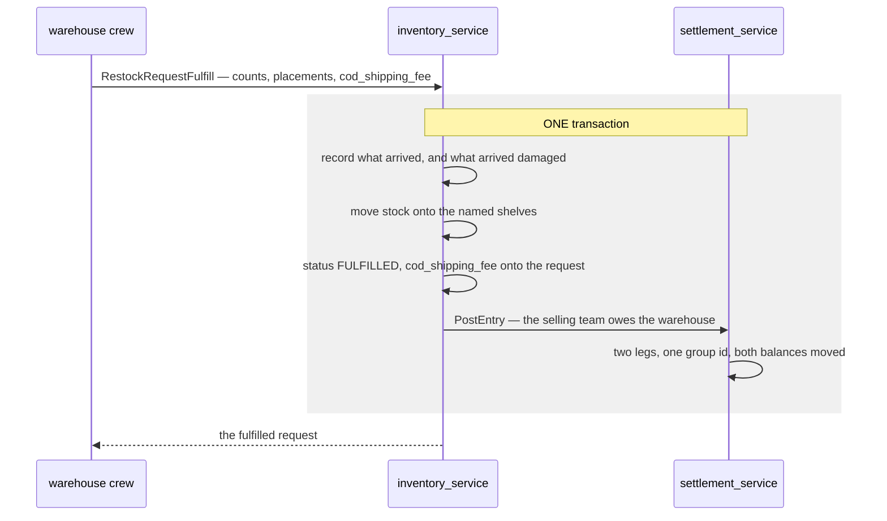
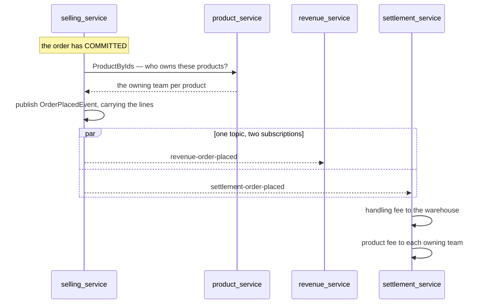

# settlement_service — the ledger of what teams owe each other

Design: [plans/settlement_service/brainstorming.md](../../../plans/settlement_service/brainstorming.md).
Tables: [database-schema.md](../../database-schema.md#settlement_service).

## The first writer — a COD restock (#184)

An obligation this system already creates and never recorded: a warehouse **accepts** a restock that
arrived COD, paying the courier at the door for goods it does not own.

**Why in the transaction and not after it.** If the stock movement commits and the obligation does
not, the warehouse is out of pocket with no record — which is *exactly* the situation this service
was built to fix, reproduced by the code meant to fix it. A test rolls the posting back and asserts
the goods never reach a shelf.

⚠ **This does not change what COD does today.** The fee still flows into HPP and into the order's
COGS (#155) — that is *costing*, and it stays. Settlement adds the missing half: who is owed it, and
has it been repaid. The same rupiah answers two different questions, and there is a test asserting
the costing column still holds the number, because a change like this is exactly where one of the two
quietly disappears.

**A fee of 0 posts nothing.** Most deliveries are not COD, and an entry of zero would be a ledger row
saying nothing happened — worse than no row, because it reads as a debt of nothing rather than the
absence of one.

## How the two services are joined

`inventory_service` declares `SettlementPoster` in its own terms and imports nothing from settlement;
the adapter lives in
[cmd/app_development/settlement_poster.go](../../../backend/cmd/app_development/settlement_poster.go).
Same shape as `StockPicker` and `ProductCatalog`, with **one deliberate difference**:

| | Atomic? | Failure handling |
| --- | --- | --- |
| selling → inventory (`StockPicker`) | ❌ another service's commit | takes the stock, **compensates** if the order then fails |
| inventory → settlement (`SettlementPoster`) | ✅ same database | one transaction, **nothing to compensate** |

The cost is named rather than buried: passing a transaction across a service boundary means the two
are not independently deployable while this call is in-process. The day settlement moves to its own
database this becomes an event, the atomicity argument has to be re-made, and the reconciliation
report (#187) is what covers the gap.

## The write path has no wire surface

`PostEntry` is a **domain function, not an RPC**, and deliberately so: nothing outside this system may
assert that one team owes another. Every posting originates from a real event inside it — a restock
accepted, an order placed, a payment confirmed. The proto's RPCs are reads plus the payment flow;
there is no "post an entry" endpoint and there should not be one.

It is also **policy-free**. It records; it never refuses. The credit check (#189) is an explicit
pre-check in the order flow, never a guard inside the posting path — a ledger that sometimes declines
to record reality is how books stop matching the world.

## Idempotency, and why a duplicate is a normal answer

`ErrAlreadyPosted` is returned when the movement is already on the books, and callers **swallow it**.

The order fees (#186) arrive on Pub/Sub, which delivers **at least once**: a redelivered order is
expected, not an error. A consumer that NACKed a duplicate would make Pub/Sub redeliver a message
that can never succeed — a poison loop built entirely out of correct behaviour. The unique index
`(team_id, counterparty_id, source_type, source_id, reversal)` is what makes ACKing safe.

`reversal` is in that key because a compensating entry shares the other four columns with the entry
it undoes; without it, a cancellation would be swallowed as a duplicate of the fee it was cancelling.

## The order-driven fees, on order events (#186)

Two more obligations, both driven by `OrderPlacedEvent` and both reversed by `OrderCancelledEvent`.

**The owner is resolved AT PLACEMENT and rides on the event.** Same choice the money already makes,
and for the same reason: a product moved to another team next month must not rewrite who was owed for
a sale that happened today. A consumer reading the catalogue at consume time would do exactly that.
A failed lookup does not fail the order — the order is already committed, the owner rides as `0`, and
settlement reads that as "nobody to pay".

**Two subscriptions on one topic.** `revenue-order-placed` and `settlement-order-placed` are separate
subscriptions, each with its own delivery state, so settlement falling behind never delays a revenue
row. The dev-server loopback models this fan-out explicitly — it delivered to one subscription per
topic until settlement became a second consumer.

### The two fees default differently, and that is deliberate

| | Default with no configuration | Because |
| --- | --- | --- |
| **Handling fee** | **charge nothing** | It is a **price** the warehouse sets. A warehouse that has configured nothing must not be silently billing anybody. |
| **Product fee** | **charge cost, markup 0** | It is a **cost transfer**. The goods left the owner's stock and do not come back (§2.2 — "money from the first moment"), so the owner is owed what they cost whether or not anybody configured anything. The **markup** is the optional part. |

Defaulting the product fee to zero as well would mean one team's goods walk out of another team's
warehouse free, which is the one outcome §2.2 explicitly rejects.

**The anchor is the frozen `unit_cost`, never the buyer-paid price.** A markup on what the buyer paid
is a commission model wearing a sale's clothes: on goods that cost 60.000 and sold for 100.000 at
20%, cost+markup owes the owner 72.000 while buyer-paid+markup owes 20.000 — the owner loses 40.000
on their own stock.

**One fee per owning team, not per line.** Two lines of the same team's goods are one debt, and the
idempotency key is `(source_type, source_id, counterparty)` — per-line postings would collide and the
second line would silently vanish.

⚠ **An unknown cost charges nothing and is not refused** (Q10). A product received straight into
stock has no recorded cost, so cost+markup computes zero. The sale is not blocked over a bookkeeping
gap. Nothing is written, because a zero-amount entry would consume that pair's idempotency key for
that order and block the real fee forever — so the gap is visible as a **missing** entry, which is
exactly what the reconciliation report (#187) looks for.

### Cancelling reads back what was charged

`ReverseOrder` does not recompute fees — it reads its own entries for that order and posts their
opposites. The cancel event carries only ids and needs no more: **the ledger already knows what it
charged.** Re-deriving from rates would disagree with the original the moment a rate changed between
placement and cancellation.

It reverses only `handling_fee` and `product_fee`. ⚠ **The COD obligation is left alone** — that debt
is for goods the warehouse paid for at the door, and an order falling through does not give the
warehouse its money back.

Only the **debtor's legs** are read. Both sides of every movement are stored, so reading every row
for the order would find each fee twice and reverse it twice — refused as a duplicate, but by luck
rather than by intent.
