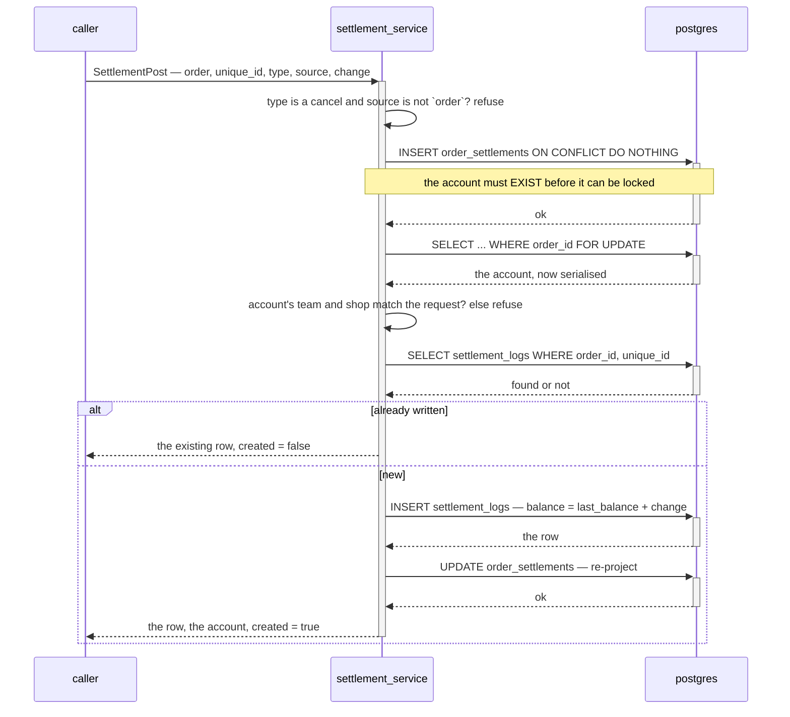
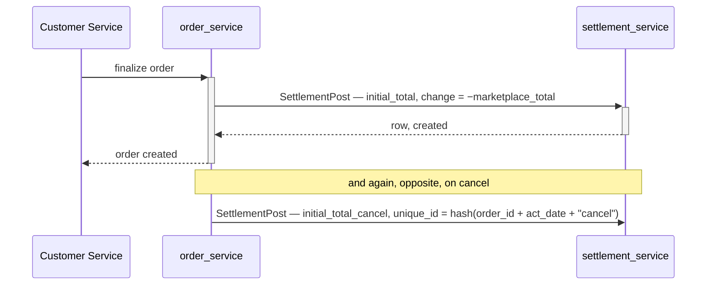

# settlement_service — RPC flows

The ledger of **what the marketplace pays us** for an order.

> ⚠ **Not [liability_service](../liability_service/rpc.md)**, which is what TEAMS OWE EACH OTHER. That
> service held this name until 2026-08-28. Both are order-aware ledgers with a state projection; only
> this one is **allowed to never balance**.

| service | RPC | what it is |
| --- | --- | --- |
| `SettlementService` | `OrderSettlementList` | the list screen — one row per order, ranked by loss |
| `SettlementService` | `OrderSettlementDetail` | the panel on the order detail page — one account plus its whole log |
| `SettlementWriteService` | `SettlementPost` | append one row. **Idempotent** on `(order_id, unique_id)` |

**Why two proto services.** A service is mounted whole — the generated handler interface demands every
RPC, and mounting also puts it in reflection — so splitting reads from writes is what lets either ship
without the other advertising a contract the build cannot honour. Both are mounted today.

---

## SettlementPost — the only write

**One RPC for three writers**, and that is deliberate. They differ only in `source_type`, and all three
retry: the exporter re-imports an overlapping statement, a person double-submits the form, and
`order_service` retries across a network timeout. A per-writer RPC would be three copies of one
idempotent upsert — which is how two of the three end up subtly wrong.

```mermaid
sequenceDiagram
  participant C as caller
  participant S as settlement_service
  participant DB as postgres

  C->>+S: SettlementPost — order, unique_id, type, source, change
  S->>S: type is a cancel and source is not `order`? refuse
  S->>+DB: INSERT order_settlements ON CONFLICT DO NOTHING
  Note over S,DB: the account must EXIST before it can be locked
  DB-->>-S: ok
  S->>+DB: SELECT ... WHERE order_id FOR UPDATE
  DB-->>-S: the account, now serialised
  S->>S: account's team and shop match the request? else refuse
  S->>+DB: SELECT settlement_logs WHERE order_id, unique_id
  DB-->>-S: found or not
  alt already written
    S-->>C: the existing row, created = false
  else new
    S->>+DB: INSERT settlement_logs — balance = last_balance + change
    DB-->>-S: the row
    S->>+DB: UPDATE order_settlements — re-project
    DB-->>-S: ok
    S-->>-C: the row, the account, created = true
  end
```

### Why the account is inserted before it is locked

`SELECT ... FOR UPDATE` cannot lock a row that does not exist. Two concurrent first-postings against a
new order would both find nothing, both insert, and one update would be lost — so the account is
**created first with `ON CONFLICT DO NOTHING`**, which makes the very first post a database-level race
that Postgres settles, and every subsequent one a plain row lock.

### `created` — why the response says whether it wrote

An idempotent write is otherwise indistinguishable from a silent no-op. A caller whose `unique_id`
recipe is broken would simply stop recording, and nothing anywhere would say so. That matters most for
`order_service`, which follows a **prescribed** recipe — a bug in it looks exactly like correct
de-duplication.

### The one rule enforced by the data

`initial_total_cancel` requires `source_type = order`. A hand-posted cancel would zero the sale of an
order the order service still believes is live, and the two systems would disagree with nothing on any
screen showing it. Having `order` as a source of its own is what makes this a **check** rather than a
convention.

### Errors

| code | when |
| --- | --- |
| `PermissionDenied` | a cancel from a non-`order` source · the account belongs to another team |
| `InvalidArgument` | unknown type or source · a bad `occurred_on` · a shop that disagrees with the account · `reverses_id` naming no entry on this order |
| `Internal` | the database |

---

## order_service → settlement_service (cross-service)

`order_service` **CALLS** settlement synchronously on create and on cancel — it does not subscribe to
an event. That puts settlement on the critical path of order creation, which is a cost the owner
accepted in exchange for the account existing the moment the order does.

```mermaid
sequenceDiagram
  participant CS as Customer Service
  participant O as order_service
  participant S as settlement_service

  CS->>+O: finalize order
  O->>+S: SettlementPost — initial_total, change = −marketplace_total
  S-->>-O: row, created
  O-->>-CS: order created

  Note over O,S: and again, opposite, on cancel
  O->>S: SettlementPost — initial_total_cancel, unique_id = hash(order_id + act_date + "cancel")
```

⚠ **The cancel's key is prescribed, not free.** `hash(order_id + act_date + "cancel")`, where
`act_date` is **when the cancel happened** — a fact carried in the payload, not our clock at call time.
A server-stamped date is safe only until a retry crosses midnight, at which point it produces a new key
and **credits the account twice**.

⚠ **`order_service` must pass the marketplace's cancel date through.** If it has no such date, this
recipe is not implementable and the decision reopens.

⚠ **What a FAILED call does to the order is still OPEN** — see
[the clarify](../../business/settlement/context_clarify.md#question) and
[biggest_question.md](../../biggest_question.md) #2. The recommendation on the table is that the order
still commits, with a visible *"account not opened"* state, because a missing account is repairable
where a lost order is not.

---

## The reads

`OrderSettlementList` follows the guideline's list shape — `ids` carries the ranking, map-slices carry
the data. Two things are worth knowing:

- **Sorted worst-loss-first by DEFAULT.** Unspecified lands there too, because that is the question the
  screen exists to answer. The direction is `last_balance ASC`, which looks wrong until you remember a
  loss is a *negative* balance.
- **The totals are the WHOLE FILTERED SET, not the page.** A take-rate card that changed as you turned
  pages would be reporting the page, which nobody asked about.

`OrderSettlementDetail` returns the log **oldest first and unpaginated**. HARD RULE 9 governs lists that
grow with the DATA; this one grows with a single order's settlement activity. The panel also draws a
running balance downward, which a page boundary would cut in half.

⚠ **An order with no account is `NotFound`, deliberately.** Never settled is a different statement from
settled to zero, and a zeroed row would render as a settlement nobody performed.
