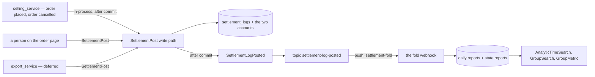
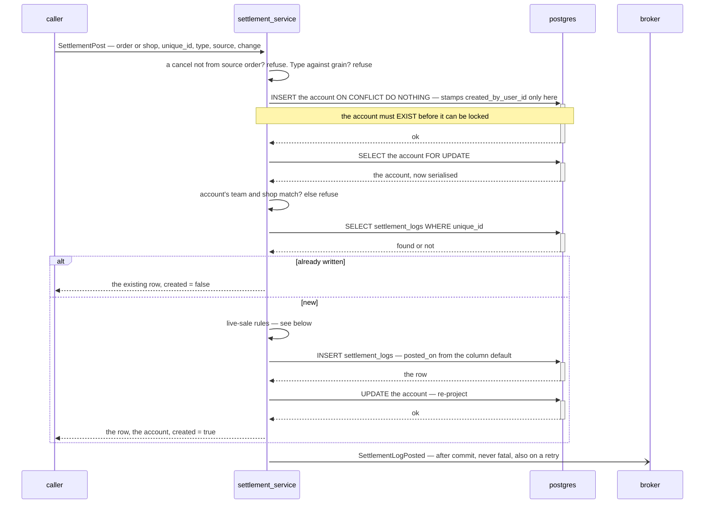
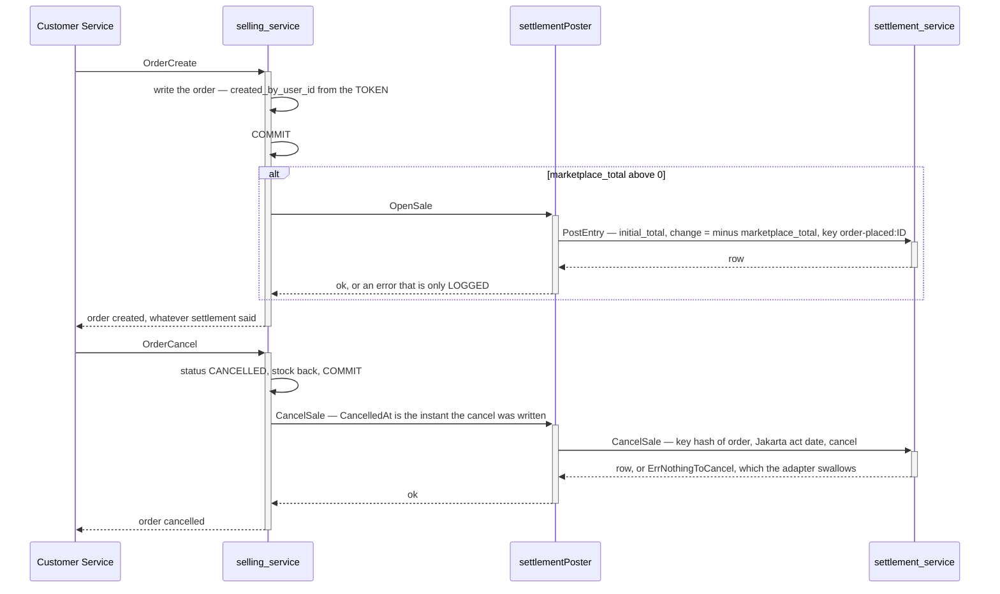
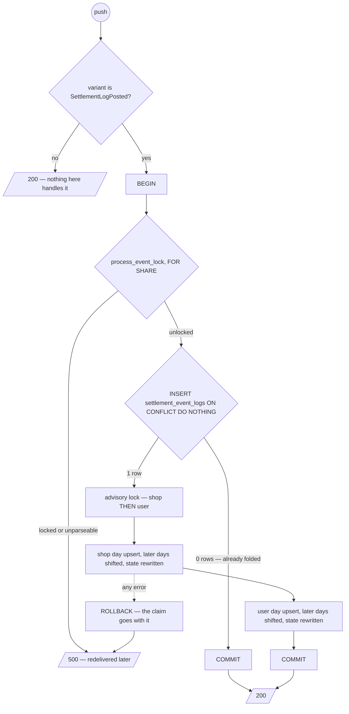
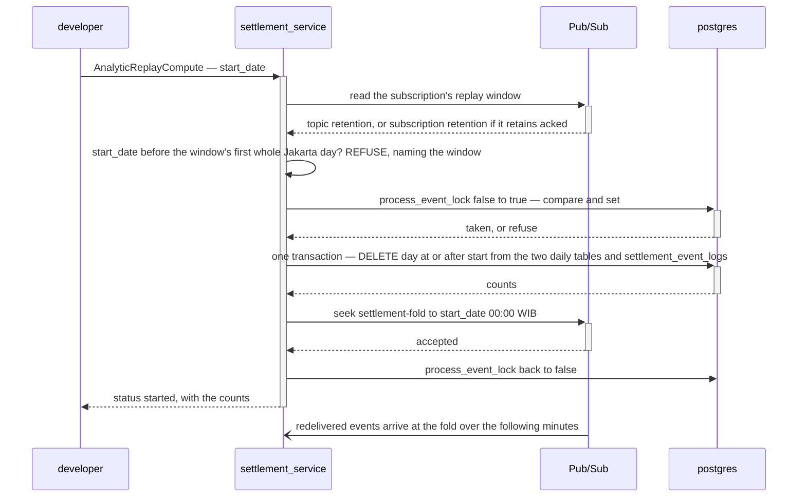

# settlement_service — RPC flows

The ledger of **what the marketplace pays us** for an order, and the reports folded from it.

> ⚠ **Not [liability_service](../liability_service/rpc.md)**, which is what TEAMS OWE EACH OTHER. That
> service held this name until 2026-08-28. Both are order-aware ledgers with a state projection; only
> this one is **allowed to never balance**.

| service | RPC | what it is |
| --- | --- | --- |
| `SettlementService` | `OrderSettlementList` | the list screen — one row per order, ranked by loss |
| `SettlementService` | `OrderSettlementDetail` | the ledger tab on the order page — one account plus its whole log |
| `SettlementWriteService` | `SettlementPost` | append one row. **Idempotent** on `unique_id`, global |
| `SettlementAnalyticService` | `AnalyticTimeSearch` | a metric series — daily, monthly or yearly |
| `SettlementAnalyticService` | `AnalyticGroupSearch` | rank teams, shops or users over a window — ids only |
| `SettlementAnalyticService` | `AnalyticGroupMetric` | fill a ranked page with its metrics |
| `SettlementAnalyticMaintenanceService` | `AnalyticReplayCompute` | rebuild the reports from a date by seeking the broker |
| `SettlementAnalyticMaintenanceService` | `AnalyticMaintenanceRun` | prune the dedup table |
| *(push route)* | `/event/settlement-fold/push` | the fold — `SettlementLogPosted` into the report tables |

**Why four proto services.** A service is mounted whole, so reads, the write, the reports and the
maintenance each got their own: the maintenance pair is `[ROOT, ADMIN]` only, and splitting it keeps
that policy from sitting beside team-scoped reads.

```mermaid
flowchart LR
  O["selling_service — order placed, order cancelled"] -->|"in-process, after commit"| W["SettlementPost write path"]
  P["a person on the order page"] -->|"SettlementPost"| W
  X["export_service — deferred"] -->|"SettlementPost"| W
  W --> L[("settlement_logs + the two accounts")]
  W -->|"after commit"| E["SettlementLogPosted"]
  E --> T["topic settlement-log-posted"]
  T -->|"push, settlement-fold"| F["the fold webhook"]
  F --> R[("daily reports + state reports")]
  R --> A["AnalyticTimeSearch, GroupSearch, GroupMetric"]
```

---

## SettlementPost — the only write

**One write path for three writers**, differing only in `source_type`. All three retry: the exporter
re-imports an overlapping statement, a person double-submits, and `order_service` retries across a
timeout. `PostEntry` and `CancelSale` are the same path called in-process.

```mermaid
sequenceDiagram
  participant C as caller
  participant S as settlement_service
  participant DB as postgres
  participant B as broker

  C->>+S: SettlementPost — order or shop, unique_id, type, source, change
  S->>S: a cancel not from source order? refuse. Type against grain? refuse
  S->>+DB: INSERT the account ON CONFLICT DO NOTHING — stamps created_by_user_id only here
  Note over S,DB: the account must EXIST before it can be locked
  DB-->>-S: ok
  S->>+DB: SELECT the account FOR UPDATE
  DB-->>-S: the account, now serialised
  S->>S: account's team and shop match? else refuse
  S->>+DB: SELECT settlement_logs WHERE unique_id
  DB-->>-S: found or not
  alt already written
    S-->>C: the existing row, created = false
  else new
    S->>S: live-sale rules — see below
    S->>+DB: INSERT settlement_logs — posted_on from the column default
    DB-->>-S: the row
    S->>+DB: UPDATE the account — re-project
    DB-->>-S: ok
    S-->>C: the row, the account, created = true
  end
  S-)B: SettlementLogPosted — after commit, never fatal, also on a retry
```

### The live-sale rules — read under the account's lock

| rule | why |
| --- | --- |
| a second `initial_total` is **refused** while one is live — unless it carries `reverses_id` | a second sale ADDS rather than replaces, and manual posting is the repair path ([a-missing-account-is-fixed-by-hand](../../business/settlement/context_decision.md#a-missing-account-is-fixed-by-hand)). Reverse first, then repost |
| an `initial_total_cancel` may never exceed the live sale | the live sale would go negative and every screen would read a sale of less than nothing |
| `CancelSale` takes its amount FROM the live sale | a person may have corrected the sale since placement — cancelling the order's original figure would cancel the wrong number |
| the idempotency check runs BEFORE these rules | a retried cancel finds its own row, instead of being refused because the sale is now zero |

### The event

`SettlementLogPosted` carries the **whole row** plus `order_created_by_user_id`. `event_id` is
`settlement-log:<log_id>`, so a retried publish collides in every consumer's dedup. A publish failure is
logged and never fails the post; re-posting the same `unique_id` republishes it.

### Errors

| code | when |
| --- | --- |
| `PermissionDenied` | a cancel from a non-`order` source · the account belongs to another team |
| `FailedPrecondition` | a second live sale · a cancel exceeding the live sale · `CancelSale` with nothing live (`ErrNothingToCancel`) |
| `InvalidArgument` | unknown type or source · a bad date · a shop that disagrees with the account · `reverses_id` naming nothing on this account · a sale with no order · a `system_adjustment` on an order · a `unique_id` already used on another account |
| `Internal` | the database |

---

## order_service → settlement_service (cross-service)

`selling_service` **calls** settlement through the composition root's `settlementPoster` — an interface
selling owns, so neither service imports the other.

```mermaid
sequenceDiagram
  participant CS as Customer Service
  participant O as selling_service
  participant A as settlementPoster
  participant S as settlement_service

  CS->>+O: OrderCreate
  O->>O: write the order — created_by_user_id from the TOKEN
  O->>O: COMMIT
  alt marketplace_total above 0
    O->>+A: OpenSale
    A->>+S: PostEntry — initial_total, change = minus marketplace_total, key order-placed:ID
    S-->>-A: row
    A-->>-O: ok, or an error that is only LOGGED
  end
  O-->>-CS: order created, whatever settlement said

  CS->>+O: OrderCancel
  O->>O: status CANCELLED, stock back, COMMIT
  O->>+A: CancelSale — CancelledAt is the instant the cancel was written
  A->>+S: CancelSale — key hash of order, Jakarta act date, cancel
  S-->>-A: row, or ErrNothingToCancel, which the adapter swallows
  A-->>-O: ok
  O-->>-CS: order cancelled
```

| | |
| --- | --- |
| **after the commit, never fatal** | [the-order-commits-without-settlement](../../business/settlement/context_decision.md#the-order-commits-without-settlement) — the buyer already paid; a missing account is repaired by hand from the order page |
| **`marketplace_total = 0` opens nothing** | 0 means NOT RECORDED — a phone order has no marketplace sale |
| **the cancel's key is the ACT's date** | [the-cancel-key-is-order-plus-act-date](../../business/settlement/context_decision.md#the-cancel-key-is-order-plus-act-date) — the date comes from the order row the cancel wrote, so a retry after midnight produces the same key |
| **the creator** | `orders.created_by_user_id` from `san_auth.GetIdentity` at placement, copied onto the account by the opening post and never again |

---

## The fold — `/event/settlement-fold/push`

One HTTP push route, mounted directly (not a Connect RPC). ⚠ It authenticates nobody, by decision
([the-event-webhook-is-open](../../business/settlement/context_decision.md#the-event-webhook-is-open)) — a
forged event can only corrupt a projection the replay rebuilds. Restrict the path at the ingress.

```mermaid
flowchart TD
  s(("push")) --> v{"variant is SettlementLogPosted?"}
  v -->|"no"| ack[/"200 — nothing here handles it"/]
  v -->|"yes"| tx["BEGIN"]
  tx --> lock{"process_event_lock, FOR SHARE"}
  lock -->|"locked or unparseable"| e5[/"500 — redelivered later"/]
  lock -->|"unlocked"| claim{"INSERT settlement_event_logs ON CONFLICT DO NOTHING"}
  claim -->|"0 rows — already folded"| c1["COMMIT"] --> ok[/"200"/]
  claim -->|"1 row"| adv["advisory lock — shop THEN user"]
  adv --> sd["shop day upsert, later days shifted, state rewritten"]
  sd --> ud["user day upsert, later days shifted, state rewritten"]
  ud --> c2["COMMIT"] --> ok
  sd -.->|"any error"| rb["ROLLBACK — the claim goes with it"] --> e5
```

| | |
| --- | --- |
| **the day** | the event's `posted_on`, as stored — never re-derived from an instant |
| **the user** | the order's creator for an order row, the actor for a shop row |
| **the lock order** | shop then user, always — one event touches both tables and a mixed order deadlocks under load |
| **an unknown settlement_type** | returns an error, so it dead-letters where a person sees it, rather than being dropped |

---

## AnalyticReplayCompute — `[ROOT, ADMIN]`

```mermaid
sequenceDiagram
  participant D as developer
  participant S as settlement_service
  participant G as Pub/Sub
  participant DB as postgres

  D->>+S: AnalyticReplayCompute — start_date
  S->>+G: read the subscription's replay window
  G-->>-S: topic retention, or subscription retention if it retains acked
  S->>S: start_date before the window's first whole Jakarta day? REFUSE, naming the window
  S->>+DB: process_event_lock false to true — compare and set
  DB-->>-S: taken, or refuse
  S->>+DB: one transaction — DELETE day at or after start from the two daily tables and settlement_event_logs
  DB-->>-S: counts
  S->>+G: seek settlement-fold to start_date 00:00 WIB
  G-->>-S: accepted
  S->>DB: process_event_lock back to false
  S-->>-D: status started, with the counts
  G-)S: redelivered events arrive at the fold over the following minutes
```

| refused when | |
| --- | --- |
| the window cannot be read | a guard that guesses deletes days nothing can rebuild — [the-replay-is-bounded-by-the-subscription-retention](../../business/settlement/context_decision.md#the-replay-is-bounded-by-the-subscription-retention) |
| the window is zero | a seek would deliver nothing, and the replay would only delete |
| `start_date` is older than the window | older damage is repaired with a `system_adjustment` |
| the lock is already held | another replay, or a developer's maintenance |

⚠ **"started", never "done"** — the seek is asynchronous. ⚠ The state tables are not in the delete: they
are derived from the newest daily row on every fold, so each redelivered event re-derives them.

## AnalyticMaintenanceRun — `[ROOT, ADMIN]`

Deletes dedup rows **received** more than 45 days ago. It does **not** take the lock: it deletes old rows
while a live fold inserts a new one, and the two cannot conflict.

---

## The reads

`OrderSettlementList` follows the guideline's list shape — `ids` carries the ranking, map-slices carry
the data. **Sorted worst-loss-first by default**, and the totals are the **whole filtered set**, not the
page. `OrderSettlementDetail` returns the log **oldest first and unpaginated** — it grows with one order's
activity — and an order with no account is **`NotFound`**, never a zeroed row.

### The reports

| | `AnalyticTimeSearch` | `AnalyticGroupSearch` / `AnalyticGroupMetric` |
| --- | --- | --- |
| source | the daily tables, rolled up at read | the daily tables |
| points | EVERY bucket of the window, quiet ones included | every group holding a position at the window's end |
| movement | Σ over the bucket | Σ over the window |
| `close_balance` | Σ over positions of each one's latest close at or before the bucket's end | the same, at the window's end |
| `open_balance` | `close − change`, exact | the same |
| span cap | 366 days · 60 months · 20 years | — |
| scope | the team, or ALL teams from the ROOT team | the same — so `TEAM` grouping crosses teams only for ROOT and ADMIN |

The ranking and the metric read **one** SQL definition, so the order on screen and the numbers beside it
cannot disagree. A user series cannot also filter by shop — the user table has no shop dimension.
