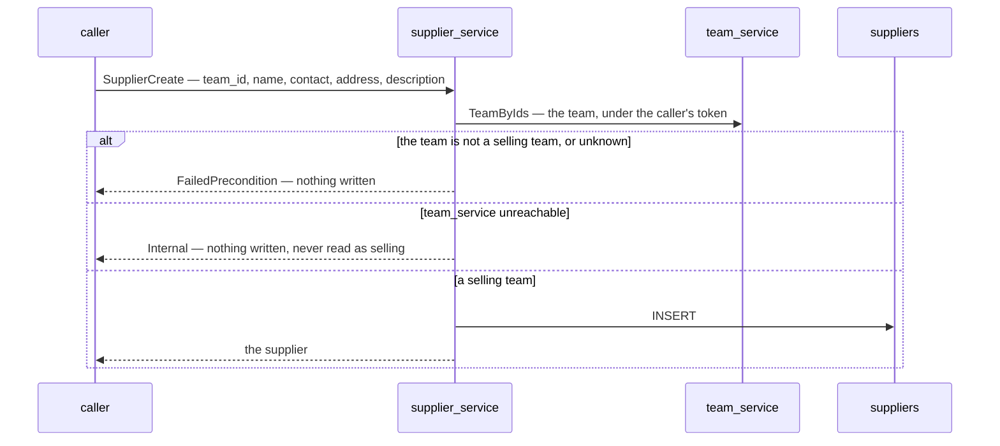
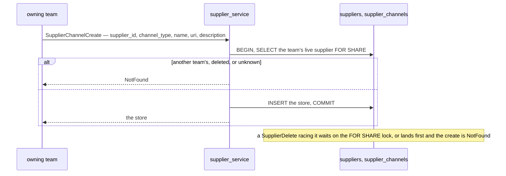
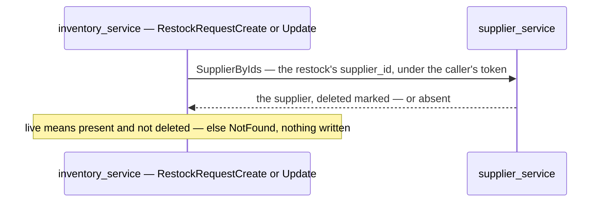
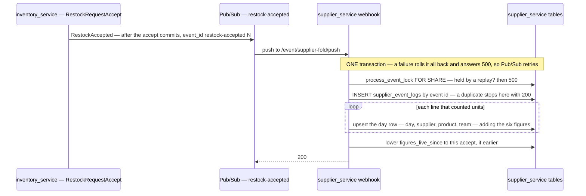
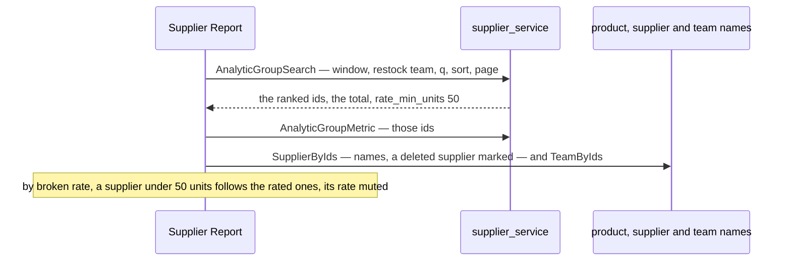
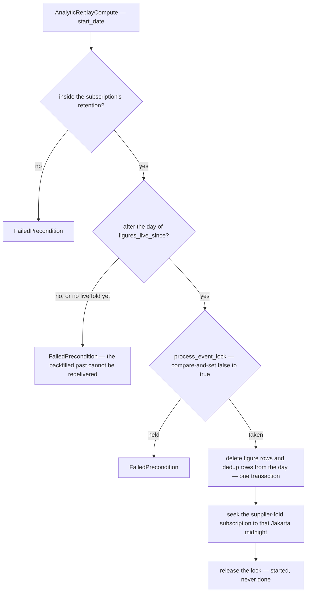

# supplier_service — RPC flows

The suppliers a selling team buys stock from, and the online stores each one sells through
([context_decision.md](../../business/supplier/context_decision.md)). Moved out of
[inventory_service](../inventory_service/rpc.md) by
[the-supplier-gets-its-own-service](../../business/supplier/context_decision.md#the-supplier-gets-its-own-service).

| service | RPC | what it is |
| --- | --- | --- |
| `SupplierService` | `SupplierCreate` | a supplier in the scoped team — **refused unless it is a SELLING team** (asks team_service) |
| | `SupplierUpdate` · `SupplierDelete` | the owning team's own; delete is **soft** |
| | `SupplierList` | `OWN` (My Supplier) or `EVERY_TEAM` (Discover Supplier), searched, filtered by store type and by the team that keeps it (`owner_team_id`, 0 = any), paged · the `CHANNELS` slice brings each supplier's stores |
| | `SupplierDetail` | **any** team's live supplier |
| | `SupplierByIds` | ids a caller holds — any team's, **deleted ones included, marked** |
| `SupplierChannelService` | `SupplierChannelList` | any team's live supplier's live stores, searched, filtered by type, paged |
| | `SupplierChannelCreate` · `Update` · `Delete` | the owning team's own; delete is **soft** |
| `SupplierAnalyticService` | `AnalyticTimeSearch` | one supplier's six figures by day, month or year — every bucket of the window — and the window's total |
| | `AnalyticProductSearch` | one supplier's figures per restocking team's product — Product Grouped |
| | `AnalyticGroupSearch` · `AnalyticGroupMetric` | suppliers ranked by restocked value or broken rate, searched, one restocking team or all — then a page's figures |
| `SupplierAnalyticMaintenanceService` | `AnalyticReplayCompute` · `AnalyticMaintenanceRun` | Root and the Administrator — rebuild the figures from a day; prune the dedup table |
| *(webhook)* | `/event/supplier-fold/push` | the fold — *Restock Accepted* into `supplier_product_daily_reports` |

**Reads cross teams, writes do not**
([another-team-sees-everything-of-a-supplier](../../business/supplier/context_decision.md#another-team-sees-everything-of-a-supplier)) —
`team_id` is always the caller's scope, so a write puts `team_id = ?` in its `WHERE` and a read does not.
**Delete is soft** on both tables
([a-deleted-supplier-is-kept-for-its-figures](../../business/supplier/context_decision.md#a-deleted-supplier-is-kept-for-its-figures),
[a-store-delete-is-soft-too](../../business/supplier/context_decision.md#a-store-delete-is-soft-too)).

## SupplierCreate — asks team_service first

Only a selling team keeps suppliers
([only-a-selling-team-has-suppliers](../../business/supplier/context_decision.md#only-a-selling-team-has-suppliers)).
The request policy keeps a warehouse's own people out, but Root and the Administrator bypass the scope — so the
handler asks.

`supplier_deps.go` in the composition root answers the question; with nothing wired, every create is refused.

## SupplierChannelCreate — a store never lands on a deleted supplier

## Who asks the supplier

`restock_requests.supplier_id` is an opaque id into this service since inventory's `00023` — any selling team's
live supplier is accepted
([a-team-restocks-from-another-teams-supplier](../../business/supplier/context_decision.md#a-team-restocks-from-another-teams-supplier)).
The frontend's restock and batch screens read a supplier's name with `SupplierByIds` too, so a deleted
supplier still names a past delivery.

## The move — not an RPC

`san supplier move` copies inventory_service's legacy rows in, ids kept
([existing-suppliers-move-with-their-ids](../../business/supplier/context_decision.md#existing-suppliers-move-with-their-ids)).
See [san.md](../../tools/san.md#supplier-move).

## The figures — a fold of Restock Accepted

A supplier's six figures are folded from the restock's accept, the way settlement's reports are folded from its ledger
([the-report-is-processed-like-settlement](../../business/supplier/context_decision.md#the-report-is-processed-like-settlement),
[the-figures-screens-are-accepted](../../business/supplier/context_decision.md#the-figures-screens-are-accepted)).
inventory_service publishes after the accept commits ([its doc](../inventory_service/rpc.md)); this service's webhook
folds.

| | |
| --- | --- |
| the supplier | the RESTOCK's — every line counts for it until lines name a store ([the-supplier-comes-from-the-restock-until-lines-name-a-store](../../business/supplier/context_decision.md#the-supplier-comes-from-the-restock-until-lines-name-a-store)). A restock with none folds nothing and is acked |
| a figure's value | units × the line's total ÷ ordered — never a rounded unit price, so a line adds back to what it cost |
| the day | the event's `accepted_on`, the accept's Jakarta day — read, never re-derived |
| ⚠ lag | a figure lags the accept by the broker's delivery. In dev and e2e the subscriptions are PULL and nothing pulls, so the live fold does not run there unless `pubsub ensure` is given a `--push-base-url` — the backfill and the tests call the fold directly |

## The reads

Every read is `listQuery` on the screen and reads the folded table only. **Every selling team reads every team's
figures** ([every-selling-team-sees-every-teams-figures](../../business/supplier/context_decision.md#every-selling-team-sees-every-teams-figures)) —
`restock_team_id` narrows to one restocking team, 0 is all
([the-team-filter-picks-any-selling-team](../../business/supplier/context_decision.md#the-team-filter-picks-any-selling-team)).

| read | queries | note |
| --- | --- | --- |
| `AnalyticTimeSearch` | 2 — the buckets with figures, grouped by `date_trunc`; the window's total | every bucket is a point; spans capped 366 days, 60 months, 20 years |
| `AnalyticProductSearch` | 2 — the count, the page | grouped by (product, team), the largest value first |
| `AnalyticGroupSearch` | 2 — the count and total, the ranked page | `q` joins `suppliers` and its live stores — a deleted supplier with figures is ranked; by rate, units ≥ 50 first ([rate-ranking-needs-50-units](../../business/supplier/context_decision.md#rate-ranking-needs-50-units)) |
| `AnalyticGroupMetric` | 1 | an id with nothing in the window gets an all-zero metric |

## AnalyticReplayCompute — never into the backfilled past

Settlement's replay, with one more refusal: figures folded by the backfill were never on the broker, so a replay must
start AFTER the live fold's first day.

`AnalyticMaintenanceRun` prunes `supplier_event_logs` received more than 45 days ago — longer than the broker's 31-day
retention, so a redeliverable message always finds its claim. It takes no lock.

## The backfill — not an RPC

`san supplier backfill-figures` folds the restocks accepted before the event existed, once
([past-accepts-are-backfilled-once](../../business/supplier/context_decision.md#past-accepts-are-backfilled-once)).
See [san.md](../../tools/san.md#supplier-backfill-figures).
