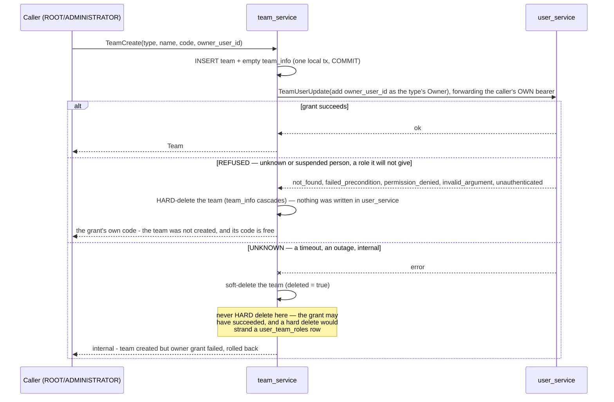

# team_service — complex RPC flows

Only RPCs with a non-trivial flow or a cross-service dependency are documented here (HARD RULE 3).
The plain reads/writes (`TeamList`, `TeamDetail`, `TeamByIds`, `TeamUpdate`, `TeamDelete`,
`TeamInfoUpdate`) are single-table and need no diagram.

## TeamCreate — a saga across two services

`TeamCreate` must do two things that live in **two different services' databases**: create the team
row (team_service) and grant the person the form NAMES (`owner_user_id`) the team type's Owner role
(user_service). The caller is **not** made a member — Root and the Administrator reach every team
([the-create-team-form-names-the-first-owner](../../business/user/context_decision.md#the-create-team-form-names-the-first-owner)).
There is no distributed transaction, so it runs as a saga with a compensating action — and the
compensation depends on whether the grant can have happened.

**Why these choices:**
- **Blocking RPC, not an event.** Only ROOT/ADMINISTRATOR create teams, it is rare, and the exposure window
  is one round-trip. A synchronous grant means the caller learns immediately whether the Owner was
  granted, and the compensation keeps the two stores consistent.
- **The caller's own bearer is forwarded** to `TeamUserUpdate`, never a service credential — so
  user_service applies the *caller's* permissions, not team_service's. A service calling another
  with its own privileges is a confused deputy.
- **A refusal hard-deletes, so the code stays free.** `team_code` is unique across deleted teams too, so a
  soft delete would burn it: the next Create with that code would be told it is taken, by a team nobody
  can see. Each refusal code is returned before user_service writes anything.
- **An unknown outcome soft-deletes.** If the grant call times out it may actually have succeeded;
  soft-delete leaves the team recoverable and never dangles a role pointing at a vanished team. The
  one state a human must look at — grant failed *and* compensation failed — is logged at
  `slog.Error`. That code stays taken.
- The owner role depends on team type: `warehouse` → `ROLE_WAREHOUSE_OWNER`, `admin` →
  `ROLE_ADMIN_OWNER`, `selling` → `ROLE_SELLING_OWNER` (see `ownerRoleFor` in `team_v1/mapper.go`). An
  admin team used to get the selling Owner, and with it every selling RPC inside itself
  ([the-admin-team-roles-are-added-first](../../business/user/context_decision.md#the-admin-team-roles-are-added-first)).
- Concurrency: no row lock; two creates with one code are settled by the unique index, and two refused
  creates leave no team — [the lock-order matrix](../../../audits/services/team_service/concurrency/lock-order.md).

Code: `backend/services/team_service/team_v1/team_create.go`.
