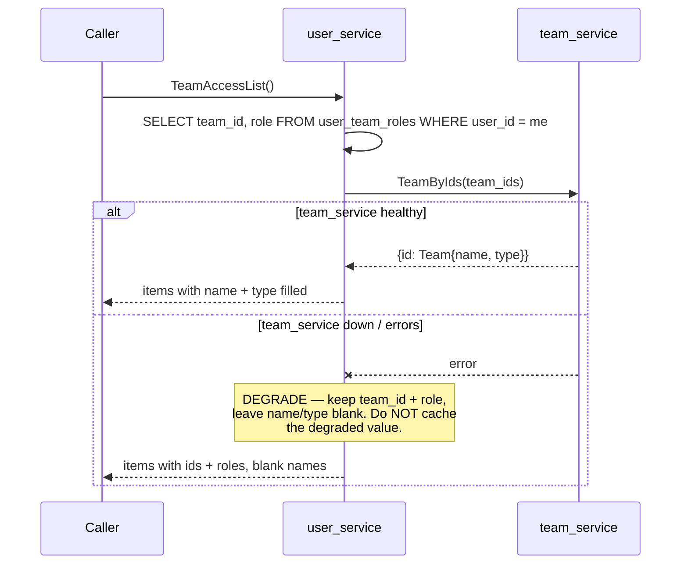
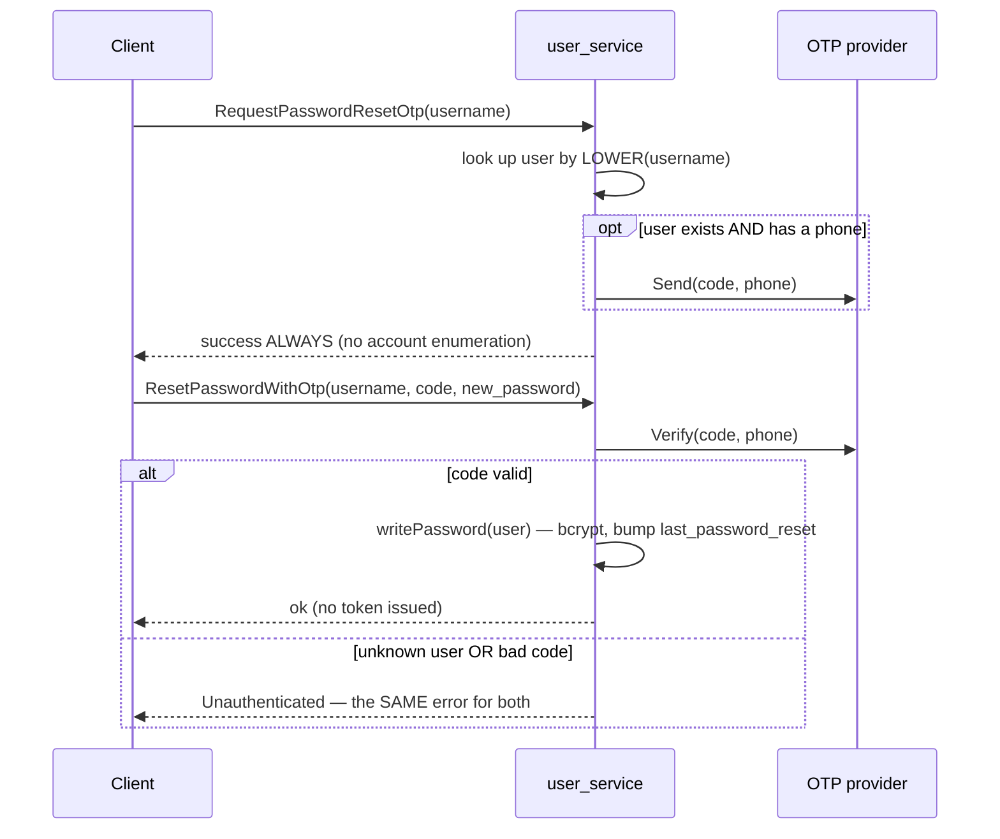

# user_service — complex RPC flows

Only RPCs with a non-trivial flow or a cross-service dependency are here (HARD RULE 3). The plain
CRUD (`CreateUser`, `UpdateUser`, `SuspendUser`, `DeleteUser`, `UserList`, `SearchUser`, …) is
single-table and needs no diagram.

## TeamAccessList — a cross-service read that DEGRADES, never fails

`TeamAccessList` returns the teams the caller belongs to, each with a display name and type. The
memberships live in user_service (`user_team_roles`); the **name and type live in team_service**.
So it must reach across the service boundary — and if team_service is down, it degrades rather than
failing the whole call.

**Why:** authorization never depends on this call — roles come straight from `user_team_roles`, and
the interceptor resolves them without ever reading team names. So a team_service outage must not
lock users out; it should only blank the display label. The frontend falls back to `Team #<id>`
when the name is empty. The degraded result is **never cached**, or a brief outage would poison the
cache with blank names past the outage.

`UserTeams` is the **same flow pointed at another user**: instead of the token holder, it takes a
`user_id` and returns that user (as a `PublicUser`) plus their memberships. It is **root/admin only**
(unscoped roles-policy) — it backs the admin user-detail view, where an admin inspects which teams a
given user has joined. It reuses `teamResolver` and degrades to blank names identically; an unknown
`user_id` is `NotFound`.

## The forgot-password flow (RequestPasswordResetOtp → ResetPasswordWithOtp)

Two RPCs that together reset a password via a one-time code, using an external OTP provider
(`san_verification`, Twilio in prod / mock in dev).

**Why:** `RequestPasswordResetOtp` always returns success and is a no-op for an unknown user or one
with no phone, so it can't be used to enumerate accounts. `ResetPasswordWithOtp` returns the *same*
`Unauthenticated` error for "no such user" and "wrong code", for the same reason. It issues no token
— the user logs in fresh.

Code: `backend/services/user_service/user_v1/{team_access_list,user_teams,request_password_reset_otp,reset_password_with_otp}.go`.
