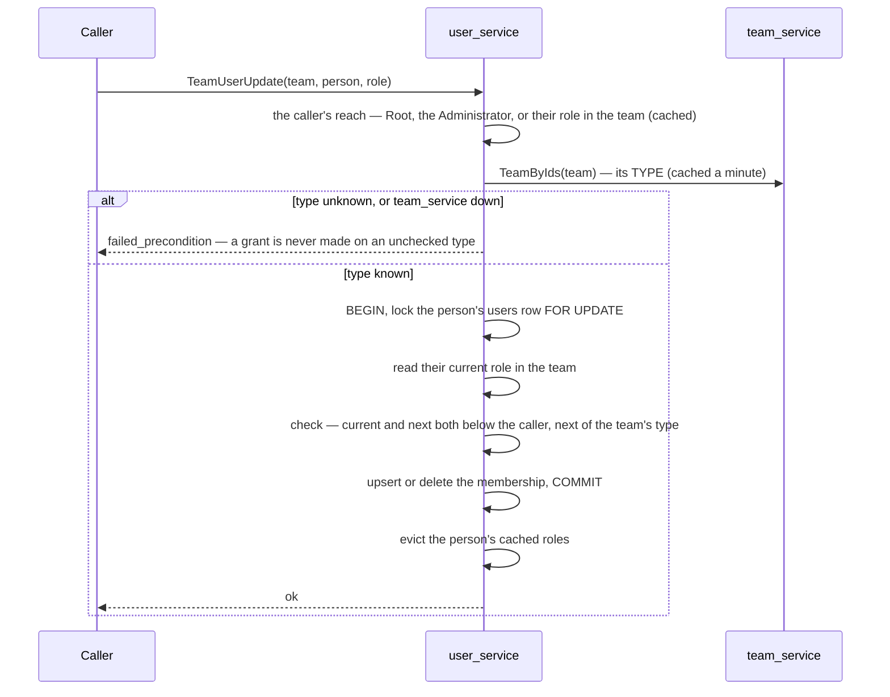
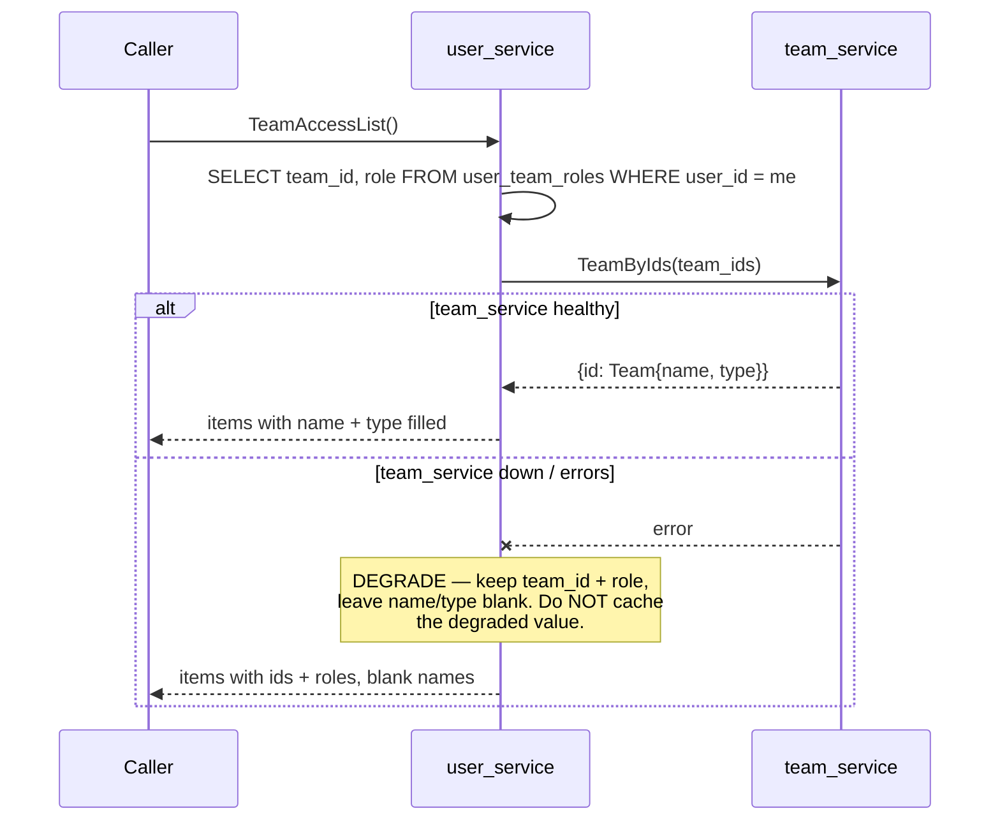
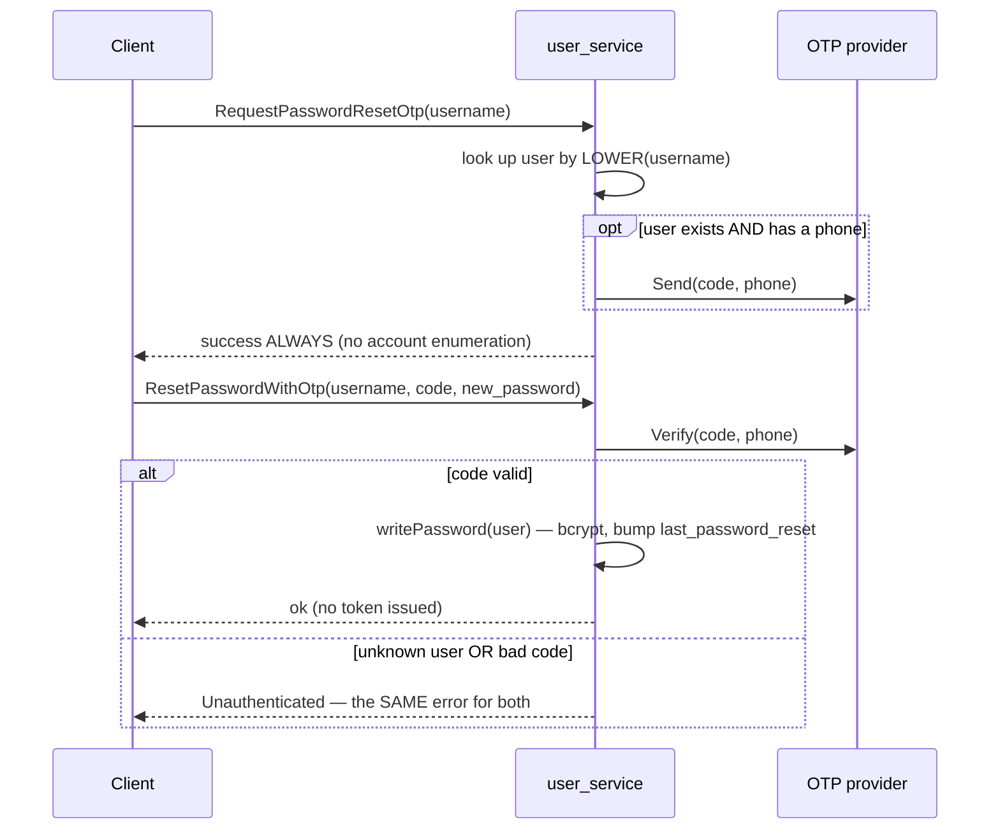

# user_service — complex RPC flows

Only RPCs with a non-trivial flow or a cross-service dependency are here (HARD RULE 3). The plain
CRUD (`UpdateUser`, `UserList`, `SearchUser`, …) is single-table and needs no diagram. There is no
`DeleteUser`: a user is never deleted (docs/business/user/context_decision.md — `a-user-is-never-deleted`).

## TeamUserUpdate, CreateUser, SuspendUser — a grant is CHECKED, and fails CLOSED

Giving, changing or taking a role, and suspending an account, pass the decided rules in
[`member_rules.go`](../../../backend/services/user_service/user_v1/member_rules.go): never Root, the
Administrator only by Root, otherwise only below the caller's own role, and a role only of its team's type
(docs/business/user/context_decision.md — `change-role-only-below-your-own`,
`an-owner-never-makes-another-owner`, `no-admin-makes-another-admin`, `root-is-granted-only-through-san`,
`root-grants-the-administrator`, `only-root-and-the-administrator-suspend`, `every-role-has-a-code-name`).

```mermaid
sequenceDiagram
    participant C as Caller
    participant U as user_service
    participant T as team_service
    C->>U: TeamUserUpdate(team, person, role)
    U->>U: the caller's reach — Root, the Administrator, or their role in the team (cached)
    U->>T: TeamByIds(team) — its TYPE (cached a minute)
    alt type unknown, or team_service down
        U-->>C: failed_precondition — a grant is never made on an unchecked type
    else type known
        U->>U: BEGIN, lock the person's users row FOR UPDATE
        U->>U: read their current role in the team
        U->>U: check — current and next both below the caller, next of the team's type
        U->>U: upsert or delete the membership, COMMIT
        U->>U: evict the person's cached roles
        U-->>C: ok
    end
```

- **The opposite of `TeamAccessList` below.** A name may degrade to blank. A grant that cannot check the
  team's type is **refused** — a selling team must not end up holding an admin-team role.
- **The team type is fetched BEFORE the transaction**, so no lock is held across the network call.
- **The lock is on the person, not the membership.** Every membership write and every suspend for one
  person queues on their `users` row, so a role read under it cannot be overtaken — proved in
  [the lock-order matrix](../../../audits/services/user_service/concurrency/lock-order.md).
- **`TeamCreate` calls this** with the creator's token to grant the new team's Owner. That is why Root
  and the Administrator may add **themselves** to a team they are not in, while nobody changes a
  membership they already hold.
- `CreateUser` checks the new person's role the same way (a new person holds none), and `SuspendUser`
  locks the same row and judges the target by its **root-team role**, never its id.

## TeamAccessList — a cross-service read that DEGRADES, never fails

`TeamAccessList` returns the teams the caller belongs to, each with a display name and type. The
memberships live in user_service (`user_team_roles`); the **name and type live in team_service**.
So it must reach across the service boundary — and if team_service is down, it degrades rather than
failing the whole call.

```mermaid
sequenceDiagram
    participant C as Caller
    participant U as user_service
    participant T as team_service
    C->>U: TeamAccessList()
    U->>U: SELECT team_id, role FROM user_team_roles WHERE user_id = me
    U->>T: TeamByIds(team_ids)
    alt team_service healthy
        T-->>U: {id: Team{name, type}}
        U-->>C: items with name + type filled
    else team_service down / errors
        T--xU: error
        Note over U: DEGRADE — keep team_id + role,<br/>leave name/type blank. Do NOT cache<br/>the degraded value.
        U-->>C: items with ids + roles, blank names
    end
```

**Why:** authorization never depends on this call — roles come straight from `user_team_roles`, and
the interceptor resolves them without ever reading team names. So a team_service outage must not
lock users out; it should only blank the display label. The frontend falls back to `Team #<id>`
when the name is empty. The degraded result is **never cached**, or a brief outage would poison the
cache with blank names past the outage.

`UserTeams` is the **same flow pointed at another user**: instead of the token holder, it takes a
`user_id` and returns that user (as a `PublicUser`) plus their memberships. It is **root/admin only**
(unscoped roles-policy) — it backs the admin user-detail view, where an admin inspects which teams a
given user has joined. It reuses `teamResolver` and degrades to blank names identically; an unknown
`user_id` is `NotFound`.

## The forgot-password flow (RequestPasswordResetOtp → ResetPasswordWithOtp)

Two RPCs that together reset a password via a one-time code, using an external OTP provider
(`san_verification`, Twilio in prod / mock in dev).

```mermaid
sequenceDiagram
    participant C as Client
    participant U as user_service
    participant O as OTP provider
    C->>U: RequestPasswordResetOtp(username)
    U->>U: look up user by LOWER(username)
    opt user exists AND has a phone
        U->>O: Send(code, phone)
    end
    U-->>C: success ALWAYS (no account enumeration)
    C->>U: ResetPasswordWithOtp(username, code, new_password)
    U->>O: Verify(code, phone)
    alt code valid
        U->>U: writePassword(user) — bcrypt, bump last_password_reset
        U-->>C: ok (no token issued)
    else unknown user OR bad code
        U-->>C: Unauthenticated — the SAME error for both
    end
```

**Why:** `RequestPasswordResetOtp` always returns success and is a no-op for an unknown user or one
with no phone, so it can't be used to enumerate accounts. `ResetPasswordWithOtp` returns the *same*
`Unauthenticated` error for "no such user" and "wrong code", for the same reason. It issues no token
— the user logs in fresh.

Code: `backend/services/user_service/user_v1/{team_access_list,user_teams,request_password_reset_otp,reset_password_with_otp}.go`.
