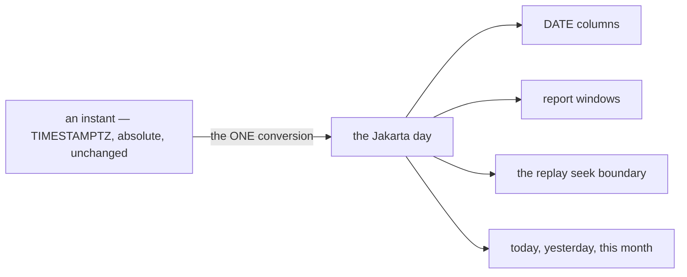

# Decisions — `architecture_context.md`

What the owner settled about the system as a whole, recorded before it is acted on. **Append-only** — a
decision that is later reversed is renamed and its references grepped (RULE 12), never quietly edited
away.

| decision | what it decided |
| --- | --- |
| [the-system-runs-on-jakarta-time](#the-system-runs-on-jakarta-time) | one calendar for the whole system — WIB (UTC+7). Every `DATE`, every day boundary, every report window |

---

## the-system-runs-on-jakarta-time

> Owner, in chat (2026-09-02) — *"we work on jakarta time, and make it standard"*, answering
> [settlement analytic Q1](../../business/settlement/analytic_context_clarify.md#question): must the
> fold's `day` be Jakarta?
>
> **Raised in settlement, decided for the system.** Recorded here rather than in one service's log,
> because a calendar that is a standard in one service and unstated in the others is not a standard.

**The verdict.** **WIB (UTC+7)** is the system's calendar. Every `DATE` column, every day boundary, every
report window and every "today" means the Jakarta day. Instants stay `TIMESTAMPTZ` — this decides how an
instant becomes a **day**, not how it is stored.

### Why it is safe here, and it is a property of the zone rather than a hope

**WIB has no daylight saving and has not changed offset since 1988.** So a Jakarta day is always exactly
24 hours, date arithmetic never meets a 23- or 25-hour day, and `day + 1` is unambiguous. Most
single-timezone standards carry a DST caveat; this one does not.

### The spec

| | |
| --- | --- |
| **storage of instants** | unchanged — `TIMESTAMPTZ`, absolute. A timezone changes rendering and date casts, never the stored instant |
| **the conversion happens ONCE** | at the database session, via **`TimeZone=Asia/Jakarta` in the DSN**. Then `CURRENT_DATE`, `now()::date` and every `timestamptz → date` cast are already Jakarta, and no handler converts anything |
| **in Go** | never `time.Local` — it is whatever the host is set to, and a container is UTC. Where a date is needed explicitly, use a loaded `Asia/Jakarta` location |
| **`DATE` columns** | are Jakarta dates **by definition**, and the column comment should say so |
| **the frontend** | native date inputs produce the browser's local date. Sent as a date string it is already the user's Jakarta day for users in Indonesia — ⚠ and is **not** for anyone elsewhere, which is worth a line rather than a surprise |

### ⚠ DEFERRED — decided, not applied

> Owner, in chat (2026-09-02) — *"note to fix that later"*. **Nothing below has been done**, and the
> system is on UTC until it is. The ordered change list, the gotchas and the one thing to decide first
> live in [development_state/architecture](../../development_state/architecture/context.md) so the next
> agent finds it without re-reading this log.

### ⚠ What is wrong today, checked in code — and it is cheap now

| | |
| --- | --- |
| ⛔ **the DSN sets no timezone** | [`san_dbtarget/target.go:49`](backend/pkgs/san_dbtarget/target.go#L49) builds `host=… port=… user=… password=… dbname=… sslmode=disable` with **no `TimeZone=`**, so the session inherits the server default — **UTC** in the Postgres image. **→ One line, and it is the whole standard for every service at once.** ⚠ Add it to `ProductionDSN` too, and to `san_testdb`, or tests pass on a different calendar than production |
| ⛔ **`settlement_logs.posted_on`** | `DATE NOT NULL DEFAULT CURRENT_DATE` ([migration:62](backend/services/settlement_service/db_migrations/00001_create_settlement_ledger.sql#L62)) — today the **UTC** date. It is the column every settlement report buckets on |
| ⚠ **`expense_records.occurred_at`** | `DATE NOT NULL` — the only other `DATE` in the system, so **there are exactly two columns to get right**, and that is the argument for doing it now |
| ⚠ **~40 `time.Now()` calls in handlers** | each yields host-local time. Harmless for a `TIMESTAMPTZ`, wrong for anything cast to a date. With the DSN set, the cast is Jakarta and these stay correct — which is why the DSN is the fix and 40 edits are not |
| ✅ **nothing depends on UTC on purpose** | one `.UTC().Format(time.RFC3339)` in [inventory_service/service.go:265](backend/services/inventory_service/inventory_v1/service.go#L265), which is an RFC3339 wire value and correct as it is |

### What it closes

| | |
| --- | --- |
| ✅ **settlement's bucket day** | `posted_on`, the fold's `day`, `start_date` and the replay's seek instant become four names for one calendar — [the contradiction](../../business/settlement/analytic_context_clarify.md#contradiction) it was recorded as is resolved by this |
| ✅ **the replay boundary** | a Jakarta seek against a Jakarta bucket. The residual is only the commit-to-publish straddle, handled by the run filter rather than by clock precision |
| ✅ **every future report** | *"which day is this in"* stops being a per-service decision |

⚠ **What it does NOT decide**: whether a *user* in another timezone sees their own day or Jakarta's. The
system's calendar is Jakarta; the presentation question is separate and not raised by anything yet.
