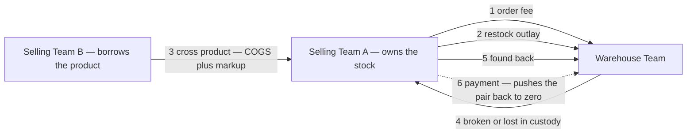
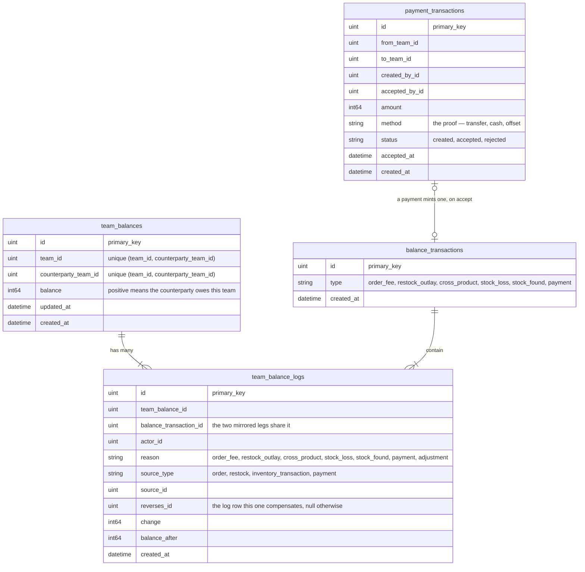
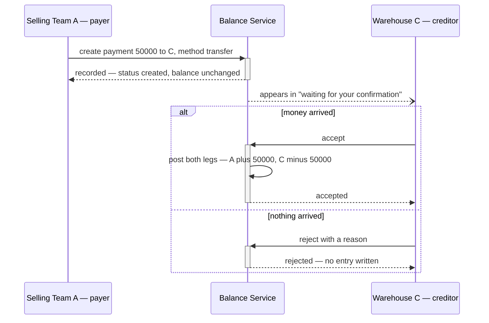
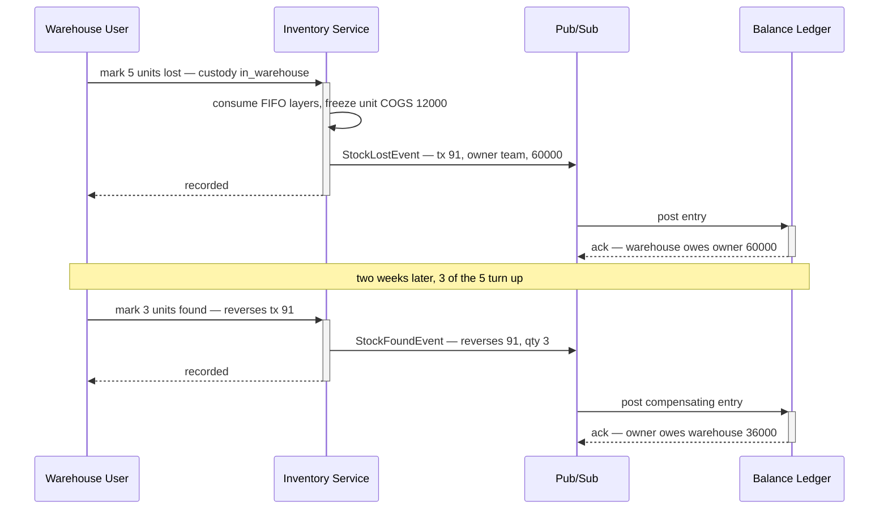

# Clarity — `team_balance_desgin.md`

Critique, questions and a proposed shape for [team_balance_desgin.md](./team_balance_design.md) — still
one heading — read against [balance_context.md](../../business/balance/context.md),
[business_level.md](../../business/business_level.md) and
[product_context.md](../../business/product/context.md). Those docs are yours; this one is mine.
Answered points are **deleted**, so this is always the current open set.

> **Re-routed:** the requirement docs now have their own clarity files. **Business-level** questions
> about this ledger — who may charge whom, when a balance must be settled, whether it blocks anything,
> whether an operating cost ever moves it — are asked in
> [`disscuss/requirements/balance_context_clarity.md`](../../business/balance/context_clarify.md), and
> the causes-list contradiction is recorded in
> [`business_level_clarity.md`](../../business/business_level_clarify.md#the-balance-causes-list-is-written-twice-and-the-two-copies-differ).
> What stays here is the **design**: grain, mirror invariant, idempotency, lock order, reversal mechanics.

> **Re-examined against your latest update.** Closed and deleted from here: **item 6 gives the balance a
> way back to zero**, and *"Create / Accepting"* is the two-phase shape — the payer records, the creditor
> accepts · **the grain is settled** (between two teams, signed, **two mirrored rows**) · and pulling the
> old per-team `Ledger A` diagram out of `business_level.md` **closes the shape contradiction** — one
> stored truth for this money again. What the mirror now *obliges* is below, and one of the obligations
> is new ([Critique #8](#critique)).
>
> **`product_context.md` `## Pricing Behavior` closes item 3.** The cross charge *is* the borrowing team's
> COGS — so the money movement and the borrower's cost accounting are one number — and `COGS = UnitPrice
> + fee` is now written as a formula, which kills the 10× reading the prose alone allowed. Moving
> `### Cross/Shared Fee Markup` out of `business_level.md` removed the second copy of it, same fix as the
> `Ledger A` diagram. **The markup stays a float percent** (owner) — which is safe here because the rate
> is not the stored money: the *rounded* `fee` is.
>
> **Still the load-bearing thing in the doc:** items 4 and 5 make the warehouse a **debtor**, so this
> ledger is signed and bidirectional rather than "what selling teams owe".

---

# Proposed Design

## The six movements, typed

`nature` is not decoration — it is what lets the warehouse's own P&L tell **fee income** from **money it
merely fronted**. Both raise the same balance in the same direction, so nothing else distinguishes them.

| # | context item | trigger | who owes whom | amount | reversed by | nature |
| --- | --- | --- | --- | --- | --- | --- |
| **1** | Warehouse order fee | order created | selling → warehouse | the rate, frozen | order cancelled | earned |
| **2** | Cost to receive a restock | restock accepted | stock owner → warehouse | what the warehouse paid out | accept cancelled | passthrough |
| **3** | Cross / shared product | order consumes another team's stock | borrowing → owning team | ✅ `COGS = UnitPrice + fee` | order cancelled | earned |
| **4** | Broken or lost **in custody** | inventory tx `broken` / `lost` | **warehouse → owning team** | COGS of the layers consumed | item 5 | reimbursement |
| **5** | Found back | inventory tx `found` | owning team → warehouse | the frozen amount of the #4 entry, pro-rata per unit | — | reversal |
| **6** | Payment | creditor **accepts** it | debtor → creditor, **toward zero** | what was actually transferred | a reversal entry, never a delete | discharge |

Items 1–5 are posted by the **system, from events**. Item 6 is the only one a **person types** — which is
why it is the only one that needs a two-party handshake, and it is what the doc already says with
*"Create / Accepting"*.

## Grain: one row per ORDERED pair, mirrored

✅ **Both halves are yours now** — `## General` puts the balance *between* two teams and signs it
(`Rp. -50.000`), and item 2 says **two mirrored rows**. So the grain is `(team_id,
counterparty_team_id)`, one row per direction. Nothing below is a proposal about the grain; it is what
that choice obliges.

- **One measure, `balance` — `int64` rupiah, positive means "the counterparty owes me".** Between one
  pair the two directions net, so payable and receivable are the same column with a sign.
- **The mirror is why authorization works.** `use_scope` pins exactly one field. With a mirror a team
  reads its own rows with `team_id` as the scope, and the counterparty is never trusted input.
- **⚠ The mirror is only true if something checks it.** `balance(A,B) == -balance(B,A)` is now an
  invariant the database does not enforce — one code path writing a single leg breaks it silently, and
  the two sides then argue with the same system backing both. **One posting function writes both legs,
  in one transaction, and nothing else may write these tables** — plus the nightly check, which is one
  query.
- **`## Why This Exists` is satisfied by a rollup, not by storage.** *"cover receivable & payable across
  the team"* is `receivable = sum(balance) where balance > 0` and `payable = -sum(balance) where balance
  < 0` over that team's rows — one query, always consistent with the pairs it came from. Storing the two
  totals as columns is a second copy that can disagree with them.
- **`(team_id, counterparty_team_id)` unique, in the first migration** — the ledger's `ON CONFLICT`
  target. Two concurrent first-postings for a new pair both find nothing, both insert, one is lost.

- **`balance_transactions` is the template's `transaction`, and the mirror is what makes it load-bearing.**
  Every movement is now **two** log rows, so *"show me both sides of this posting"* is only answerable by
  matching amount, opposite sign and a near timestamp — a heuristic that fails exactly when two similar
  postings land together. The group id makes it a join. It also gives the reconcile its second rule:
  `sum(change) == 0` per `balance_transaction_id`, always.
- **`(source_type, source_id, team_id, counterparty_team_id, reason)` unique.** One order posts several
  entries at once — a warehouse fee plus one cross-product entry per owning team — so `source_id` alone
  is not a key. This constraint is what makes a redelivered event safe instead of a double charge.
- **`reverses_id`, not a boolean.** Items 4/5 are a pair, and so is every cancellation. "What did this
  undo, and how much of it is left" must be a join, not a guess from amount and timestamp.

## Item 6 — a payment posts on ACCEPT, never on create

| step | who | what it writes |
| --- | --- | --- |
| create | the **payer** | a `payment_transactions` row, `status = created`. **No ledger entry.** |
| accept | the **creditor** | both mirrored log rows, `reason = payment`, `status = accepted` |
| reject | the **creditor** | `status = rejected` and a reason. Still no ledger entry, and the row stays. |

**Posting on create would let a debtor clear their own debt by typing a number** — the money has not
arrived, and only the creditor can know that it has. This is the same rule as Critique #3: nobody moves
the other side's balance alone.

- **A payment is NOT allocated to particular entries.** It moves the pair's running position, which is
  what your `## General` diagram already draws. No invoice matching, no FIFO application of cash.
- **Over-payment flips the sign, and that is correct** — the creditor now owes the payer, which the
  signed pair represents natively and an "amount outstanding" column could not.
- **A wrong acceptance is corrected by a compensating entry, never by un-accepting.** Same rule as every
  other reversal here.

## Where the amount comes from — and why item 5 never recomputes it

| entry | priced from |
| --- | --- |
| #1 | the warehouse's rate at the moment the order is created, **frozen onto the entry** |
| #2 | the sum of the cost lines entered at accept — [Q1](#question) |
| #3 | `UnitPrice + fee`, per consumed layer, with **`fee` rounded to whole rupiah on each line, half-up** — the float rate is an input, never a stored amount. **Keep the two components on the entry, not just their sum** — `unit_price` is what makes the owner whole, `fee` is what they *earned*, and only the second is the owner's revenue. And `product_context.md` prices per FIFO layer, so a cross order spanning two layers is a sum of two lines, never one average. |
| #4 | the COGS of the layers the loss consumed |
| #5 | **read back off the #4 entry it reverses.** Never recomputed. |
| #6 | the payer states it, the creditor's acceptance is what makes it true |

A re-average or a FIFO turnover between the loss and the find makes a recomputed reversal a different
number from the charge — and that difference is silent money that stops the pair netting to zero.

---

# Contradiction

## The same list now exists twice, and the copy is already two short

> `balance_context.md`: **six** things affect the balance
> `business_level.md` §6: *"the balance is used in: sharing stock · cost of stock broken or lost · cover
> shipping fee · cover warehouse order processing fee"* — **four**, missing *found back* and *payment*

Not wrong yet, just stale — the two new items landed in one file and not the other, which is what a
restated list does every time. It is the same failure that produced the `Ledger A` diagram you just
removed, arriving one heading lower.

**→ Recommend** `business_level.md` §6 keep the *why* (*"provide balance management in team level"*) and
**link** to `balance_context.md` instead of re-listing the causes. One place to edit, so it cannot
drift again.

## COGS is `float64` and money is `int64` — items 4 and 5 are where they meet

Two positions settled elsewhere collide here for the first time:

> `stock_design.md`: *"stock valuation → that be `float64`"*
> `cost_design_clarity.md` #3 and the settlement plan's invariant 2: money is `int64` rupiah

Items 3, 4 and 5 price a money entry **out of the stock ledger**. Whatever the stock side stores, a
balance entry is an exact rupiah amount owed by one team to another, and `sum(change)` must reconcile to
zero without a tolerance.

**→ Recommend** the conversion happens **once**, at the posting boundary, half-up, on the **entry total**
and never on the unit — and the rounded number is the frozen one item 5 reads back. If the stock side
becomes `int64` (recommended in two clarity files already), this collapses to nothing.

## ✅ The markup is a FLOAT percent (owner)

**What the decision obliges here, and it is small:** a float **rate** is fine because it is never the
stored money — see [Where the amount comes from](#where-the-amount-comes-from--and-why-item-5-never-recomputes-it).
`fee` is rounded to `int64` rupiah **per consumed layer**, half-up, and the *rounded* number is what the
entry freezes. The float never reaches the ledger, so it can never drift a balance.

## "Broken or lost in warehouse" is flat here and conditional in `business_level.md`

> `balance_context.md` item 4: *"Broken or Lost goods in warehouse."*
> `business_level.md` warehouse #6: *"warehouse dont have responsbility every broken/lost goods at
> receiving restock or return goods from the returning orders."*

So a loss posts to the balance or does not, depending on **which phase the goods were in** — and
`inventory_transactions.type` in `stock_design.md` carries `broken` / `lost` with no phase at all. As
drawn, the posting cannot decide, and the two readings differ by real money.

**→ Recommend a `custody` field on the loss transaction** — `in_warehouse` (posts) · `at_receiving`
(does not) · `return_inspection` (does not). It decides whether a movement exists at all, so it cannot
be inferred later from a note.

---

# Critique

| | Problem | → Recommend |
| --- | --- | --- |
| **1** | **Item 6 is the only movement with no event behind it, so it is the only one that can double-post from a double-click.** Items 1–5 are idempotent through `(source_type, source_id, …)` because an order or an inventory transaction already exists to key on. An accept has no such natural key, and two accepts of one payment — two tabs, a retry, a slow response — post twice. | Guard the state change, not the handler: `UPDATE payment_transactions SET status='accepted' WHERE id=? AND status='created'`, and post **only if it changed one row**, inside the same transaction as the entries. The unique key then falls out for free — `source_type='payment'`, `source_id=payment_transaction_id`. |
| **2** | **Item 2 is unbounded — "additional cost" is whatever someone types.** It is one number today (`cod_shipping_fee`), and the phrasing invites unloading, transport, repacking. An open text amount charged to another team is an unauditable claim on them. | A **closed enum of cost kinds**, each line typed and frozen at accept, the entry being their sum. And the warehouse's **own ops fee is `earned`, not `passthrough`** — same direction, different nature, so it must not ride the same line even though it lands on the same balance. |
| **3** | **Item 5 asserts a debt on the OTHER team, and has no handshake.** Item 6 got one — *"Create / Accepting"*. Item 4 needs none: the warehouse is typing a debt **against itself**, which nobody does by accident. Item 5 is the mirror of it — the warehouse types *"found it"* and the owning team owes money back, on the warehouse's word alone, possibly weeks later. | Same shape as item 6: the found-back entry is **visible to the owner and acknowledged**, or at minimum notified and reversible by them. And no free-form manual `adjustment` posting in v1 — every other entry comes from an event, which is what keeps the ledger something neither side can write alone. |
| **4** | **One movement, three services, no shared transaction.** The order is in `selling_service`, the COGS in `inventory_service`, the balance here. HARD RULE 3 forbids the shared transaction that would make the posting atomic. | The road already paved in this repo: **transactional outbox** on the writing side, event consumed here, idempotency from the unique key above, plus a **dead-letter policy** — a malformed message is redelivered forever otherwise. Name the eventual-consistency window rather than pretending it is not there. |
| **5** | **Item 5 has three cases one line does not cover.** Partial find (3 of 5) · the batch fully consumed and gone · found **after** the loss was already paid in cash. | Pro-rata per unit off the frozen entry, as drawn · the money reversal needs no live batch, but the *stock* side does — that question belongs in [`stock_design_clarity.md`](../stock/design_clarify.md) and is asked there, not here · a paid-then-found loss is simply a credit in the other direction, which the signed pair handles natively. |
| **6** | **Reversal after the fact needs the same refusal rule as stock.** `stock_design_clarity.md` proposes refusing a restock-accept cancellation once the batch has been touched. Item 2's reversal is that same event on the money side. | One rule, stated once: whatever refuses the stock reversal refuses the balance reversal, because they are one transaction. |
| **7** | **No `actor_id` on the log would repeat the stock ledger's gap.** *"Who wrote this"* is the first question a disputed balance raises, and here the two sides are effectively different businesses. | It is in the ERD above. Keep it non-null. |

| **8** | **Two mirrored rows means every posting locks TWO rows — and a deadlock is now available between one pair.** A warehouse fee posts on `(A,W)` then `(W,A)`. In the same second a broken-goods reimbursement posts on `(W,A)` then `(A,W)`. Each holds what the other wants and Postgres kills one. This is not exotic here: your teams work in pairs on one stock level all day, and items 1–3 and item 4 genuinely point in opposite directions. | **Lock the two legs in a fixed order — always ascending `team_id`, never "mine first".** Costs one `if`, and it is the whole fix. Worth proving with [`san_race`](../../../backend/pkgs/san_race) once the RPC exists, per the `audit-sql` skill — a deadlock this cheap to introduce is exactly what that harness is for. |

✅ **Reimbursement at COGS is settled, and it is the right measure** — `business_level.md` warehouse #5.
The owner loses the goods, not the sale, so COGS makes them whole without the warehouse insuring a margin
it has no control over. No action — recorded so it is not re-litigated.

---

# Question

1. **Item 2 — everything the warehouse laid out, or only the COD at the door?** And does the warehouse's own
   ops fee post on the same entry? **→ I recommend a typed cost-line enum, with the ops fee separated by nature.**
2. **Which service owns this ledger?** `settlement_service` already ships a team-to-team money ledger
   ([rpc.md](../../services/settlement_service/rpc.md), `settlement_entries`), and
   [`cost_design.md`](../cost/design.md) is a second ledger keyed by `team_id`. **→ I recommend ONE ledger — this design, in `settlement_service`** —
   three services holding team money is three that can disagree. `cost_design.md` stays separate only if a cost
   never moves a balance ([its clarity Q2](../cost/design_clarify.md) asks the same thing and is still open).
3. **Item 6 — can the creditor REJECT, and is `offset` a payment method?** Accepting is in the doc, refusing is
   not, and a claimed payment that never arrived has to end somewhere. **→ I recommend `created / accepted /
   rejected` with a reason**, the row kept either way. And if a warehouse ever settles by *cancelling out* what
   it owes a team against what that team owes it, that is a payment with `method = offset` and no cash — say
   whether that is allowed, because it is the one form the pair grain makes tempting.
4. **Does the balance GATE anything** — does a debtor over its limit stop being able to create orders or request
   restocks? **→ I recommend yes, read-only and outside the posting path** — the ledger records, it does not police.
5. **After a reimbursement, who owns the goods if they are found?** The warehouse paid COGS for them. Item 5 as
   written returns them to the owner and reverses the money. **→ I recommend exactly that** — it matches what
   physically happened — but the alternative (the warehouse keeps them, no reversal) is defensible and it is your call.
6. **Which side is `positive`?** The mirror decides the row but not the convention, and it reaches the API.
   **→ I recommend `balance > 0` means "the counterparty owes me"** — so a creditor reads its own receivables
   as positive numbers. State it once, and never return `abs()` in one field beside the raw value in another.

---

# Awaiting

- **The doc says what moves the balance, not what the ledger IS** — no state/log tables, no flow, no ERD
  yet. Everything above is a proposal *for* those, not a reading of them.
- **Nothing says where the RATES live.** Items 1 and 3 both need a number before they can post — the
  warehouse's order fee and the product's cross markup. Who sets each, is it per warehouse or per pair,
  and does changing it affect entries already written? (It must not — every entry above freezes its
  amount, which is the half this doc can settle on its own.)
- **Filename: `desgin` → `design`.** Cheapest now, before anything links to it — `cost_design_clarity.md`
  raised this and it is still unfixed. This file gets renamed with it.
