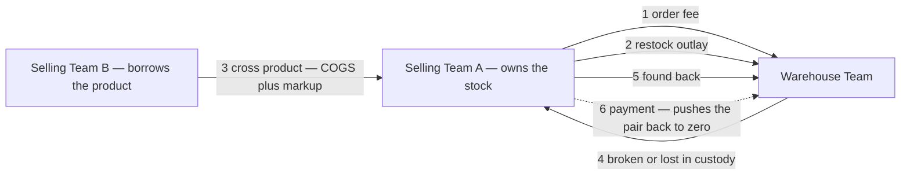
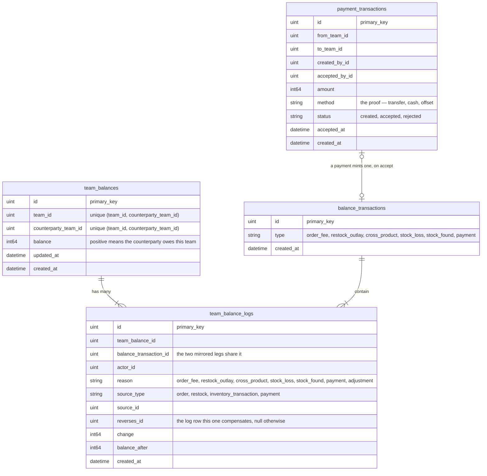
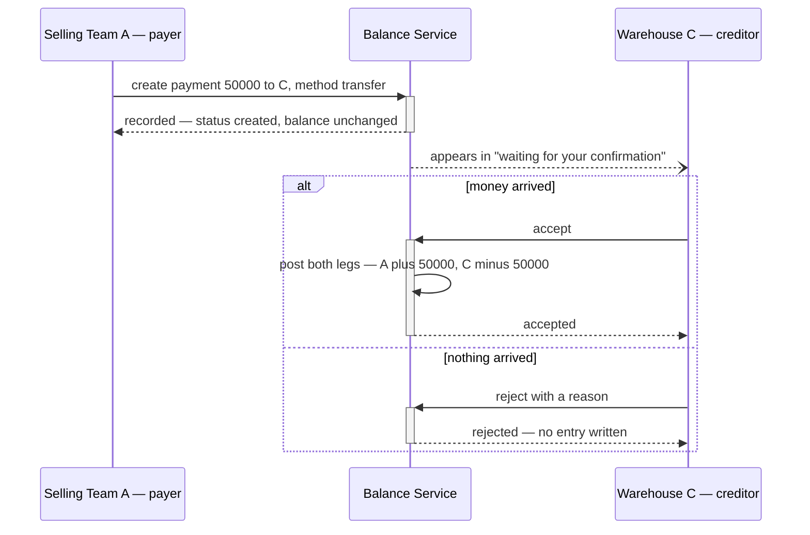
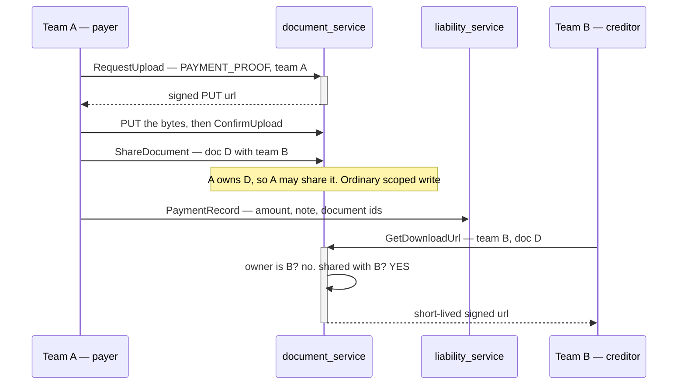
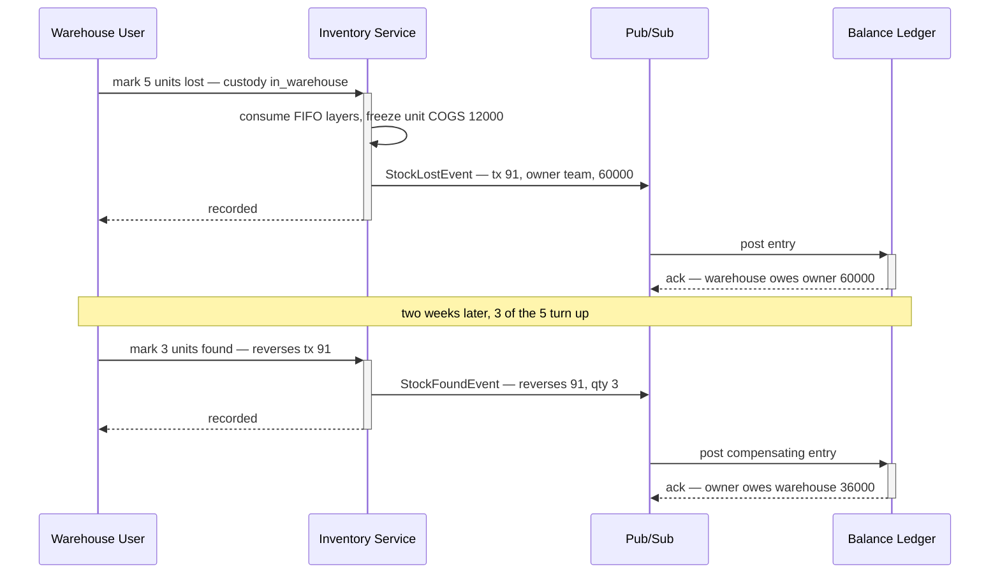
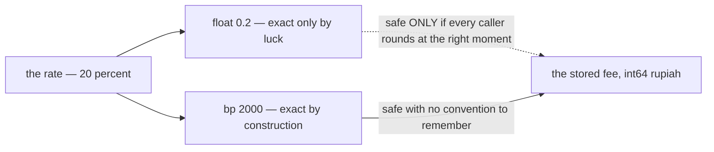

# Clarity — `team_balance_design.md`

Critique, questions and a proposed shape for [team_balance_design.md](./team_balance_design.md) — still
one heading, while the ledger it describes has SHIPPED — read against [balance_context.md](../../business/balance/context.md),
[business_level.md](../../business/business_level.md) and
[product_context.md](../../business/product/context.md). Those docs are yours; this one is mine.
Answered points are **deleted**, so this is always the current open set.

> **Re-routed:** the requirement docs now have their own clarity files. **Business-level** questions
> about this ledger — who may charge whom, when a balance must be settled, whether it blocks anything,
> whether an operating cost ever moves it — are asked in
> [`business/balance/context_clarify.md`](../../business/balance/context_clarify.md), and
> the causes-list contradiction is recorded in
> [`business_level_clarity.md`](../../business/business_level_clarify.md#the-balance-causes-list-is-written-twice-and-the-two-copies-differ).
> What stays here is the **design**: grain, mirror invariant, idempotency, lock order, reversal mechanics.

> **Re-examined against your latest update.** Closed and deleted from here: **item 6 gives the balance a
> way back to zero**, and *"Create / Accepting"* is the two-phase shape — the payer records, the creditor
> accepts · **the grain is settled** (between two teams, signed, **two mirrored rows**) · and pulling the
> old per-team `Ledger A` diagram out of `business_level.md` **closes the shape contradiction** — one
> stored truth for this money again. What the mirror now *obliges* is below, and one of the obligations
> is new ([Critique #8](#critique)).
>
> **`product_context.md` `## Pricing Behavior` closes item 3.** The cross charge *is* the borrowing team's
> COGS — so the money movement and the borrower's cost accounting are one number — and `COGS = UnitPrice
> + fee` is now written as a formula, which kills the 10× reading the prose alone allowed. Moving
> `### Cross/Shared Fee Markup` out of `business_level.md` removed the second copy of it, same fix as the
> `Ledger A` diagram. **The markup stays a float percent** (owner) — which is safe here because the rate
> is not the stored money: the *rounded* `fee` is.
>
> **Still the load-bearing thing in the doc:** items 4 and 5 make the warehouse a **debtor**, so this
> ledger is signed and bidirectional rather than "what selling teams owe".

> # ⚠ Re-examined against `liability_service`, which has SHIPPED
>
> **This file argued a design that now exists in code.** [team_balance_design.md](./team_balance_design.md)
> is still **one heading, 21 bytes** — so by RULE 8b.11 the design is *not written down* — but
> `backend/services/liability_service/` ships `liability_entries`, `liability_balances`,
> `liability_payments` and `liability_terms`, and **all six causes post**. The gap is no longer
> *"nothing is designed"*; it is *"the design exists only as code"*.
>
> ✅ **Six things this file asked for were built, and built the way it recommended.** Deleted from here:
>
> | asked | shipped |
> | --- | --- |
> | Q2 · which service owns this ledger? | **`liability_service`** — one ledger, as recommended. Not `cost_design`, not two |
> | Q4 · does the balance GATE anything? | **yes, and outside the posting path** — `CheckCredit` is a pre-check; `PostEntry` never refuses. Exactly the recommendation, with the reason written into the code |
> | Q6 · which side is positive? | **positive = they owe you**, stated once in the migration and the model |
> | the mirror invariant | two legs, one transaction, sharing `group_id` from `liability_group_seq` |
> | the idempotency key | `UNIQUE (team_id, counterparty_id, source_type, source_id, reversal)` |
> | the pair unique index **in the first migration** | `liability_balances_pair_idx`, with the lost-update reasoning in a comment |
>
> ⚠ **Four things were built DIFFERENTLY, and three of them are still open questions** — they are
> [Critique 9–11](#critique) and the [markup contradiction](#the-markup-is-recorded-as-a-float-percent-and-shipped-as-basis-points).
> The lock-order deadlock ([Critique 8](#critique)) is **unverified**, not closed: `payment_confirm_race_test.go`
> exists, no other write path has a race test.
>
> ✅ **The FRONTEND is implemented too** — `pages/liability-list` (280 lines) and
> `pages/liability-detail` (631), plus `features/liability/`. It answers Q6 better than this file did:
> **direction is WORDS, never a sign** (`direction.ts`) — nothing renders a bare negative, payable and
> receivable are two columns, and colour supports the sentence rather than replacing it.
> `oldest_unsettled_at` is on screen as an ageing stat with a colour ramp. Record payment and confirm
> payment both exist.
>
> ⚠ **But the frontend does not COMPILE, and three gaps show on screen** —
> [Critique 12–14](#critique).

> ⚠ **Two columns exist in the code and in no doc**: `liability_balances.oldest_unsettled_at` (ageing)
> and `liability_terms.product_markup_bp` / `handling_fee` (**where the rates live** — the Awaiting item
> below, answered by code). ✅ **The ageing column's question is now CLOSED**:
> [no-overdue-only-the-threshold](../../business/balance/context_decision.md#no-overdue-only-the-threshold)
> says a balance is never due, so `oldest_unsettled_at` is information that triggers nothing — which is
> exactly what the code does. Code and doc agree.

> # ⚠ Re-examined after §Payment Flow — Q5 is ANSWERED and C14 half INVERTS
>
> `balance_context.md` §Payment Flow specifies the payment lifecycle in two diagrams. ✅ **This
> file's [§Item 6](#item-6--a-payment-posts-on-accept-never-on-create) proposal was right in every
> part it stated** — the payer creates, the creditor decides, a claim posts nothing, reject is
> terminal and writes no entry. Recorded as
> [the-debtor-claims-the-creditor-decides](../../business/balance/context_decision.md#the-debtor-claims-the-creditor-decides).
>
> ⛔ **[Q5](#question) closes: the creditor MAY reject.** It is **build work** now and none of it
> exists — see [§Reject, as built work](#reject-as-build-work) below.
>
> 🆕 **One requirement is new, and it is not small: PROOF.** *"bring image/doc/screenshot Proof of
> bank transfer"*. A payment carries a 500-char `note` and no document, and the creditor could not
> read the file if it had one — [Critique 19](#critique).
>
> ⚠ **[C14](#critique)'s reverse half INVERTS.** It called *"`PaymentReverse` has no screen"* a gap.
> A terminal `accept` says that RPC is a path the design does not ask for — so the question is no
> longer *"where is its screen"* but *"should it exist"*
> ([business Q11](../../business/balance/context_clarify.md#question)). Its sibling — no terms
> screen — is untouched and still stands.
> # ⚠ Re-examined after §Detail Pair Team Balance — and Q6 is ANSWERED
>
> Three lines, and they close the question this file asked last round. *"The Change Log"* was **two
> logs**, not one, and you have now named them separately:
>
> | §Detail Pair Team Balance | |
> | --- | --- |
> | 1. Its show general summarize | ✅ the pair's position, already there as two directions |
> | 2. Its show change **limit** history log | 🆕 **built this pass** — a fifth tab |
> | 3. its show change **balance** log | ✅ the four entry / payment tabs |
>
> ⛔ **Q6 is DELETED**, recorded as
> [the-pair-detail-shows-both-logs](./team_balance_design_decision.md#the-pair-detail-shows-both-logs).
> ⚠ It closes **against** this file's recommendation: I proposed reading item 3 as *one* of the two
> logs and you answered *both*. Worth noting, because the reasoning I offered for picking one — *the
> entries are already there, so naming a log must mean the other* — was a decent argument and still
> wrong. Naming a thing that already exists is how a requirement doc says it is REQUIRED, not new.
>
> ✅ **Built, and previewable**: a fifth tab on `/liability/:counterpartyId`, three stories, and
> `ChangeLogPanel` promoted from `pages/liability-terms/components/` to `features/liability/` —
> the moment a second page imported it, it stopped being one page's component (CLAUDE.md).
>
> ```mermaid
> flowchart LR
>   P["pair detail"] --> S["1. summarize"]
>   P --> L["2. LIMIT history — a rule that changed"]
>   P --> B["3. BALANCE log — money that moved"]
>   L -.->|"different grain — never merged"| B
> ```
>
> ⚠ **Q7 survives and is NARROWED.** Showing the limit history here says nothing about where a limit
> is **written**, and Credit Terms is still not in §Frontend Requirements. It still blocks
> `design_accept`.

> # ⚠ Re-examined after the doc's FIRST CONTENT — three frontend requirements
>
> `team_balance_design.md` is no longer empty. It leads with **§Frontend Requirements**, which is the
> right order (HARD RULE 6) and the first time this design has been stated as *screens* rather than
> recovered from migrations.
>
> | your requirement | what exists today |
> | --- | --- |
> | 1. Summarize All Balance | the four stat tiles at the top of `/liability`. ⚠ **They summarise the LOADED PAGE, not all balances** — [Critique 16](#critique) |
> | 2. List Of Pair Team Balance page | ✅ `/liability` — one row per counterparty, both directions in two columns |
> | 3. Detail Pair Team Balance and The Change Log | ✅ `/liability/:counterpartyId` — four tabs of entries and payments. ⚠ **"The Change Log" has two readings** — [Critique 17](#critique) |
>
> ⚠ **Three requirements, and a FOURTH screen was built last week.** Credit Terms
> (`/liability/terms`) is not in your list. It is where the credit limit, the handling fee, the
> markup and the **terms change log** live — and if your item 3's change log means that log, it is
> currently on the wrong page. [Critique 18](#critique), and it is the one I would settle first
> because a prototype is already sitting at `design_accept` on the answer.
>
> ```mermaid
> flowchart TB
>   R1["1. Summarize All Balance"] --> T["the 4 tiles on /liability"]
>   T -.->|"computed over ONE PAGE of 20"| W["wrong once a team has 21 counterparties"]
>   R2["2. List of pair balances"] --> L["/liability"]
>   R3["3. Detail + The Change Log"] --> D["/liability/:counterpartyId"]
>   R3 --> Q{"WHICH log?"}
>   Q -->|"the ledger entries"| D
>   Q -->|"the limit history"| X["/liability/terms — a page you have not named"]
> ```
>
> ✅ **Nothing below is closed by this update** — the doc states screens, and the five open questions
> are about the ledger's shape. What it adds is three new ones.
>
> **The backend half is still unwritten**, which under RULE 8b.11 means *not designed yet* rather
> than an open question. The design does exist — as four migrations and twelve handlers — so the gap
> is the writing-down, not the deciding. A proposal for it is [below](#proposed-design).

> # ⚠ Re-verified against the tree at `0d4cbc4` — three critiques STAND, one is WITHDRAWN
>
> Every claim this file makes about shipped code was re-checked line by line. **Nothing was closed by
> the settlement work**, and one of my own findings turned out to be stale.
>
> | | verdict |
> | --- | --- |
> | [C9](#critique) `liability_entries` has no actor | ✅ **stands** — none of the four migrations adds one |
> | [C11](#critique) no `rejected` payment state | ✅ **stands** — the proto has `RECORDED` · `CONFIRMED` · `REVERSED` and nothing else |
> | [C15](#critique) the statement reads a source type nothing posts | ✅ **stands, and it is in THREE files** — `queries.ts`, `StatementSummary.tsx` and `StatementTable.tsx` all read `COD_FEE`, while `RESTOCK_OUTLAY` appears in no column at all |
> | [C12](#critique) the frontend has no generated liability client | ⛔ **WITHDRAWN** — `liability_pb.ts` and `liability.connect.go` are committed and `npm run typecheck` exits **0** |
>
> ⚠ **The report this ledger serves lost half its input in the same commit.** `revenue_service` was
> removed, so the daily statement is warehouse-only and a selling team is refused. That is a business
> question, not a design one — asked as
> [balance Q8](../../business/balance/context_clarify.md#question).
>
> ⚠ **And one order's fee is unaskable.** [`order_fees.go:165`](../../../backend/services/liability_service/liability_v1/order_fees.go)
> writes `SourceID = orderID`, so the ledger knows which order each fee belongs to — but
> `LiabilityEntryListFilter` accepts `counterparty_id` and nothing else, so no caller can ask. One
> filter field, and it is [balance Q9](../../business/balance/context_clarify.md#question).

---

# Proposed Design

## The six movements, typed

`nature` is not decoration — it is what lets the warehouse's own P&L tell **fee income** from **money it
merely fronted**. Both raise the same balance in the same direction, so nothing else distinguishes them.

| # | context item | trigger | who owes whom | amount | reversed by | nature |
| --- | --- | --- | --- | --- | --- | --- |
| **1** | Warehouse order fee | order created | selling → warehouse | the rate, frozen | order cancelled | earned |
| **2** | Cost to receive a restock | restock accepted | stock owner → warehouse | what the warehouse paid out | accept cancelled | passthrough |
| **3** | Cross / shared product | order consumes another team's stock | borrowing → owning team | ✅ `COGS = UnitPrice + fee` | order cancelled | earned |
| **4** | Broken or lost **in custody** | inventory tx `broken` / `lost` | **warehouse → owning team** | COGS of the layers consumed | item 5 | reimbursement |
| **5** | Found back | inventory tx `found` | owning team → warehouse | the frozen amount of the #4 entry, pro-rata per unit | — | reversal |
| **6** | Payment | creditor **accepts** it | debtor → creditor, **toward zero** | what was actually transferred | a reversal entry, never a delete | discharge |

Items 1–5 are posted by the **system, from events**. Item 6 is the only one a **person types** — which is
why it is the only one that needs a two-party handshake, and it is what the doc already says with
*"Create / Accepting"*.



## Grain: one row per ORDERED pair, mirrored

✅ **Both halves are yours now** — `## General` puts the balance *between* two teams and signs it
(`Rp. -50.000`), and item 2 says **two mirrored rows**. So the grain is `(team_id,
counterparty_team_id)`, one row per direction. Nothing below is a proposal about the grain; it is what
that choice obliges.

- **One measure, `balance` — `int64` rupiah, positive means "the counterparty owes me".** Between one
  pair the two directions net, so payable and receivable are the same column with a sign.
- **The mirror is why authorization works.** `use_scope` pins exactly one field. With a mirror a team
  reads its own rows with `team_id` as the scope, and the counterparty is never trusted input.
- **⚠ The mirror is only true if something checks it.** `balance(A,B) == -balance(B,A)` is now an
  invariant the database does not enforce — one code path writing a single leg breaks it silently, and
  the two sides then argue with the same system backing both. **One posting function writes both legs,
  in one transaction, and nothing else may write these tables** — plus the nightly check, which is one
  query.
- **`## Why This Exists` is satisfied by a rollup, not by storage.** *"cover receivable & payable across
  the team"* is `receivable = sum(balance) where balance > 0` and `payable = -sum(balance) where balance
  < 0` over that team's rows — one query, always consistent with the pairs it came from. Storing the two
  totals as columns is a second copy that can disagree with them.
- **`(team_id, counterparty_team_id)` unique, in the first migration** — the ledger's `ON CONFLICT`
  target. Two concurrent first-postings for a new pair both find nothing, both insert, one is lost.



### ⚠ What actually SHIPPED — the ERD above is the proposal, not the tables

Read this before building anything against the diagram: **four of its five table names do not exist.**
The argument above still stands; the names and four columns do not.

| the proposal | shipped in `liability_service` | verdict |
| --- | --- | --- |
| `team_balances` | **`liability_balances`** — plus `oldest_unsettled_at` | ✅ same shape, one extra column nothing asked for |
| `team_balance_logs` | **`liability_entries`** | ⚠ **no `actor_id`** ([C9](#critique)) · `reverses_id` shipped as a **boolean `reversal`** ([C10](#critique)) · `reason` folded into `source_type` |
| `balance_transactions` | **`liability_group_seq`** — a SEQUENCE, no table | ⚠ defensible (the leg carries `source_type`), but it leaves **nowhere to hang the actor**, which is half of C9 |
| `payment_transactions` | **`liability_payments`** — `recorded` / `confirmed` / `reversed` | ⚠ **no `rejected`** ([C11](#critique)); `method` shipped as free-text `note` |
| — | **`liability_terms`** — `handling_fee`, `product_markup_bp`, `credit_limit` | ✅ this is where the RATES live, and it was in no doc |

**The six causes map onto `source_type` like this**, so the numbered list above is not orphaned:

| # | cause | `source_type` |
| --- | --- | --- |
| 1 | warehouse order fee | `handling_fee` |
| 2 | restock receiving outlay | `restock_outlay` *(supersedes `cod_fee`, which nothing posts any more)* |
| 3 | cross / shared product | `product_fee` |
| 4 | broken or lost in custody | `stock_damage` |
| 5 | found back | `stock_damage` with `reversal = true` — ⚠ under the FIND's movement id, not the loss's ([C10](#critique)) |
| 6 | payment | `payment` |

- **`balance_transactions` is the template's `transaction`, and the mirror is what makes it load-bearing.**
  Every movement is now **two** log rows, so *"show me both sides of this posting"* is only answerable by
  matching amount, opposite sign and a near timestamp — a heuristic that fails exactly when two similar
  postings land together. The group id makes it a join. It also gives the reconcile its second rule:
  `sum(change) == 0` per `balance_transaction_id`, always.
- **`(source_type, source_id, team_id, counterparty_team_id, reason)` unique.** One order posts several
  entries at once — a warehouse fee plus one cross-product entry per owning team — so `source_id` alone
  is not a key. This constraint is what makes a redelivered event safe instead of a double charge.
- **`reverses_id`, not a boolean.** Items 4/5 are a pair, and so is every cancellation. "What did this
  undo, and how much of it is left" must be a join, not a guess from amount and timestamp.

## Item 6 — a payment posts on ACCEPT, never on create

| step | who | what it writes |
| --- | --- | --- |
| create | the **payer** | a `payment_transactions` row, `status = created`. **No ledger entry.** |
| accept | the **creditor** | both mirrored log rows, `reason = payment`, `status = accepted` |
| reject | the **creditor** | `status = rejected` and a reason. Still no ledger entry, and the row stays. |

**Posting on create would let a debtor clear their own debt by typing a number** — the money has not
arrived, and only the creditor can know that it has. This is the same rule as Critique #3: nobody moves
the other side's balance alone.



- **A payment is NOT allocated to particular entries.** It moves the pair's running position, which is
  what your `## General` diagram already draws. No invoice matching, no FIFO application of cash.
- **Over-payment flips the sign, and that is correct** — the creditor now owes the payer, which the
  signed pair represents natively and an "amount outstanding" column could not.
- **A wrong acceptance is corrected by a compensating entry, never by un-accepting.** Same rule as every
  other reversal here. ⚠ Shipped code goes further and flips the payment's own status to `REVERSED` —
  which your lifecycle does not have. [business Q11](../../business/balance/context_clarify.md#question).

## Reject, as build work

🆕 Answered by §Payment Flow. Nothing below exists; all of it is small.

| | |
| --- | --- |
| proto | `LIABILITY_PAYMENT_STATUS_REJECTED = 4`, and a `LiabilityPaymentReject` RPC scoped to the **creditor** with a required reason |
| model | `Status = "rejected"` — the column is text, so **no migration for the status itself** |
| the reason column | `liability_payments.reversal_reason` is the wrong name once two acts write it. **→ Rename to `reason`** — the status already says which act filled it, so two columns would leave one always null |
| the ledger | **nothing posts.** That is the entire point of the state |
| the screen | a second action on an awaiting-confirmation row. Terminal and not undoable, so a `ConfirmDialog` with the reason field in it |
| what stays untouched | `REVERSED`, whatever [business Q11](../../business/balance/context_clarify.md#question) decides. Refusing a claim and undoing a confirmation are different failures and must not share a path |

## The proof, and the cross-team read

🆕 The hard-looking half of §Payment Flow — and it is **cheaper than it first reads**.
`document_service` can hold the file today; what it cannot do is let the creditor see it, because
[`get_download_url.go`](../../../backend/services/document_service/document_v1/get_download_url.go)
filters `id = ? AND team_id = ?` and the proof belongs to the **payer's** team.

⚠ **I first proposed `LiabilityPaymentProofUrl`** — balance vouches for the creditor and has
`document_service` sign the key. It works, and it needs an **internal, non-team-scoped signing
path**. That is a permanent liability: one bug in balance's relation check leaks every private file
in the system. **The payer granting the share themselves avoids it entirely**, and every call below
is an ordinary team-scoped write in the payer's own session.



| the decision | |
| --- | --- |
| **who authorizes** | `document_service`, from a **share row it owns**. It learns *"shared with team X"* — never *"this is a payment proof"* |
| **the new table** | `document_shares(document_id, team_id, granted_by, created_at)`. `GetDownloadUrl` gains one clause: **owner OR shared-with** |
| **the new RPC** | `ShareDocument`, scoped to the document's **owning** team. Nothing privileged about it |
| **what liability gains** | a `repeated string document_ids` on `PaymentRecordRequest`, and the payment row keeps them. **No new RPC, no cross-service call** |
| **also needed** | `DOCUMENT_RESOURCE_TYPE_PAYMENT_PROOF` (**private** — a transfer slip names an account number) |
| ✅ **the invariant that survives** | *there is no way to read a document without a row saying you may.* Vouching would have replaced it with *"trust liability_service"* |
| ⚠ **two rules it needs** | a shared document **cannot be hard-deleted**, and a share is **permanent** — the creditor acted on that evidence. And a share must NOT put the file in B's document **list**, only make a read by id succeed |
| **what it does NOT need** | a service-to-service trust path, an internal signing endpoint, or an `rpc.md` cross-service flow — there is no cross-service call left to draw |

## Where the amount comes from — and why item 5 never recomputes it

| entry | priced from |
| --- | --- |
| #1 | the warehouse's rate at the moment the order is created, **frozen onto the entry** |
| #2 | the sum of the cost lines entered at accept — [Q1](#question) |
| #3 | `UnitPrice + fee`, per consumed layer, with **`fee` rounded to whole rupiah on each line, half-up** — the float rate is an input, never a stored amount. **Keep the two components on the entry, not just their sum** — `unit_price` is what makes the owner whole, `fee` is what they *earned*, and only the second is the owner's revenue. And `product_context.md` prices per FIFO layer, so a cross order spanning two layers is a sum of two lines, never one average. |
| #4 | the COGS of the layers the loss consumed |
| #5 | **read back off the #4 entry it reverses.** Never recomputed. |
| #6 | the payer states it, the creditor's acceptance is what makes it true |

A re-average or a FIFO turnover between the loss and the find makes a recomputed reversal a different
number from the charge — and that difference is silent money that stops the pair netting to zero.



---

# Contradiction

## The same list now exists twice, and the copy is already two short

> `balance_context.md`: **six** things affect the balance
> `business_level.md` §6: *"the balance is used in: sharing stock · cost of stock broken or lost · cover
> shipping fee · cover warehouse order processing fee"* — **four**, missing *found back* and *payment*

Not wrong yet, just stale — the two new items landed in one file and not the other, which is what a
restated list does every time. It is the same failure that produced the `Ledger A` diagram you just
removed, arriving one heading lower.

**→ Recommend** `business_level.md` §6 keep the *why* (*"provide balance management in team level"*) and
**link** to `balance_context.md` instead of re-listing the causes. One place to edit, so it cannot
drift again.

## the markup is recorded as a FLOAT percent and shipped as BASIS POINTS

> This file, above: *"✅ **The markup is a FLOAT percent** (owner) — which is safe here because the rate
> is not the stored money: the *rounded* `fee` is."*
>
> `liability_terms.product_markup_bp int64` — *"Basis points rather than a float for the same reason
> money is int64."*

**Which one I think is wrong: the recorded decision, and the code is right.** My own argument for
tolerating a float was that the rate never becomes stored money — true, but it makes correctness depend
on every future caller rounding at the right moment. Basis points removes the question: `2000` is 20%
exactly, it compares and sums exactly, and there is no moment at which somebody can forget to round.

⚠ **But it is a recorded owner decision, so I am not treating the code as having settled it.** If the
percent is the shape you want in the UI, that is a display concern and basis points still serve it
(`bp / 100`). If you want the stored rate to be a float, the code has to change — and I would argue
against it.

**→ RECOMMEND** confirm basis points and let the decision be renamed with its verdict (RULE 12) —
`markup-is-a-float-percent` → `markup-is-basis-points`. What stops this recurring: **a decision about a
NUMBER'S TYPE is only settled once it names the stored column type, not the mental model.**



## COGS is `float64` and money is `int64` — items 4 and 5 are where they meet

Two positions settled elsewhere collide here for the first time:

> `stock_design.md`: *"stock valuation → that be `float64`"*
> `cost_design_clarity.md` #3 and the settlement plan's invariant 2: money is `int64` rupiah

Items 3, 4 and 5 price a money entry **out of the stock ledger**. Whatever the stock side stores, a
balance entry is an exact rupiah amount owed by one team to another, and `sum(change)` must reconcile to
zero without a tolerance.

**→ Recommend** the conversion happens **once**, at the posting boundary, half-up, on the **entry total**
and never on the unit — and the rounded number is the frozen one item 5 reads back. If the stock side
becomes `int64` (recommended in two clarity files already), this collapses to nothing.

## ✅ The markup is a FLOAT percent (owner)

**What the decision obliges here, and it is small:** a float **rate** is fine because it is never the
stored money — see [Where the amount comes from](#where-the-amount-comes-from--and-why-item-5-never-recomputes-it).
`fee` is rounded to `int64` rupiah **per consumed layer**, half-up, and the *rounded* number is what the
entry freezes. The float never reaches the ledger, so it can never drift a balance.

## "Broken or lost in warehouse" is flat here and conditional in `business_level.md`

> `balance_context.md` item 4: *"Broken or Lost goods in warehouse."*
> `business_level.md` warehouse #6: *"warehouse dont have responsbility every broken/lost goods at
> receiving restock or return goods from the returning orders."*

So a loss posts to the balance or does not, depending on **which phase the goods were in** — and
`inventory_transactions.type` in `stock_design.md` carries `broken` / `lost` with no phase at all. As
drawn, the posting cannot decide, and the two readings differ by real money.

**→ Recommend a `custody` field on the loss transaction** — `in_warehouse` (posts) · `at_receiving`
(does not) · `return_inspection` (does not). It decides whether a movement exists at all, so it cannot
be inferred later from a note.

---

# Critique

| | Problem | → Recommend |
| --- | --- | --- |
| **1** | **Item 6 is the only movement with no event behind it, so it is the only one that can double-post from a double-click.** Items 1–5 are idempotent through `(source_type, source_id, …)` because an order or an inventory transaction already exists to key on. An accept has no such natural key, and two accepts of one payment — two tabs, a retry, a slow response — post twice. | Guard the state change, not the handler: `UPDATE payment_transactions SET status='accepted' WHERE id=? AND status='created'`, and post **only if it changed one row**, inside the same transaction as the entries. The unique key then falls out for free — `source_type='payment'`, `source_id=payment_transaction_id`. |
| **2** | **Item 2 is unbounded — "additional cost" is whatever someone types.** It is one number today (`cod_shipping_fee`), and the phrasing invites unloading, transport, repacking. An open text amount charged to another team is an unauditable claim on them. | A **closed enum of cost kinds**, each line typed and frozen at accept, the entry being their sum. And the warehouse's **own ops fee is `earned`, not `passthrough`** — same direction, different nature, so it must not ride the same line even though it lands on the same balance. |
| **3** | **Item 5 asserts a debt on the OTHER team, and has no handshake.** Item 6 got one — *"Create / Accepting"*. Item 4 needs none: the warehouse is typing a debt **against itself**, which nobody does by accident. Item 5 is the mirror of it — the warehouse types *"found it"* and the owning team owes money back, on the warehouse's word alone, possibly weeks later. | Same shape as item 6: the found-back entry is **visible to the owner and acknowledged**, or at minimum notified and reversible by them. And no free-form manual `adjustment` posting in v1 — every other entry comes from an event, which is what keeps the ledger something neither side can write alone. |
| **4** | **One movement, three services, no shared transaction.** The order is in `selling_service`, the COGS in `inventory_service`, the balance here. HARD RULE 3 forbids the shared transaction that would make the posting atomic. | The road already paved in this repo: **transactional outbox** on the writing side, event consumed here, idempotency from the unique key above, plus a **dead-letter policy** — a malformed message is redelivered forever otherwise. Name the eventual-consistency window rather than pretending it is not there. |
| **5** | **Item 5 has three cases one line does not cover.** Partial find (3 of 5) · the batch fully consumed and gone · found **after** the loss was already paid in cash. | Pro-rata per unit off the frozen entry, as drawn · the money reversal needs no live batch, but the *stock* side does — that question belongs in [`stock_design_clarity.md`](../stock/design_clarify.md) and is asked there, not here · a paid-then-found loss is simply a credit in the other direction, which the signed pair handles natively. |
| **6** | **Reversal after the fact needs the same refusal rule as stock.** `stock_design_clarity.md` proposes refusing a restock-accept cancellation once the batch has been touched. Item 2's reversal is that same event on the money side. | One rule, stated once: whatever refuses the stock reversal refuses the balance reversal, because they are one transaction. |
| **7** | **No `actor_id` on the log would repeat the stock ledger's gap.** *"Who wrote this"* is the first question a disputed balance raises, and here the two sides are effectively different businesses. | It is in the ERD above. Keep it non-null. |

| **8** | **Two mirrored rows means every posting locks TWO rows — and a deadlock is now available between one pair.** A warehouse fee posts on `(A,W)` then `(W,A)`. In the same second a broken-goods reimbursement posts on `(W,A)` then `(A,W)`. Each holds what the other wants and Postgres kills one. This is not exotic here: your teams work in pairs on one stock level all day, and items 1–3 and item 4 genuinely point in opposite directions. | **Lock the two legs in a fixed order — always ascending `team_id`, never "mine first".** Costs one `if`, and it is the whole fix. Worth proving with [`san_race`](../../../backend/pkgs/san_race) once the RPC exists, per the `audit-sql` skill — a deadlock this cheap to introduce is exactly what that harness is for. |

| | Problem *(found by re-examining against the shipped code)* | → Recommend |
| --- | --- | --- |
| **9** | **`liability_entries` has NO ACTOR COLUMN.** Critique 7 asked for `actor_id`, non-null; the table has `team_id`, `counterparty_id`, `amount`, `source_type`, `source_id`, `reversal`, `group_id`, `balance_after`, `created_at` — and nothing else. Only `liability_payments` carries `recorded_by` / `confirmed_by`, so **cause 6 knows who acted and causes 1–5 do not.** *"Who wrote this charge"* is the first question a disputed balance raises, and the two sides here are effectively different businesses. It is also a **business** requirement already: [balance Critique 8](../../business/balance/context_clarify.md#critique) asks that every movement name its actor, and [business_level Critique 1](../../business/business_level_clarify.md#critique) makes it the test for *"transparency accounting"*. | **Add `actor_id` to `liability_entries` in a new migration.** ⚠ It cannot be back-filled — the entries are immutable and nobody recorded who posted them — so it is nullable for history and non-null-by-convention going forward, or a second column recording *which service* posted when no human did. **The longer this waits the more unattributable rows exist**, and that is the whole cost of the delay. |
| **10** | **`reversal` is a BOOLEAN, and the entry it reverses is not recorded anywhere.** This file argued *"`reverses_id`, not a boolean"* and it shipped as a flag. The consequence is sharper than the style point: cause 5 posts under the **find's own `movement_id`**, not the loss's, so a partial find works (no idempotency collision ✅) but **nothing ties it back to the loss it repays.** *"Loss #91 was 60.000 — how much of it is still outstanding?"* is unanswerable from the ledger; you can only sum `stock_damage` entries for the pair and hope no other loss overlaps. | **Add `reverses_group_id`** (nullable, pointing at the `group_id` of the movement being undone). It keeps the current idempotency key untouched — the key uses `reversal`, which stays — and makes *"what is left of this loss"* one join. ⚠ Also rename the concept in the doc: `reversal` today means *"this is a giving-back movement"*, not *"this reverses entry X"*, and the two readings differ. |
| ~~**11**~~ | ✅ **RESOLVED — §Payment Flow names `reject`.** Recorded as [the-debtor-claims-the-creditor-decides](../../business/balance/context_decision.md#the-debtor-claims-the-creditor-decides); the spec is [§Reject, as build work](#reject-as-build-work). Kept one round because the shape recurs: **a state machine drawn in a proto is a design nobody agreed to.** Original: **A claimed payment that never arrived has NO TERMINAL STATE.** [Q3](#question) asked whether the creditor may REJECT. Shipped statuses are `recorded` · `confirmed` · `reversed` — **there is no `rejected`.** So a creditor faced with a payment that did not land can only leave it at `recorded` forever, or **confirm it and then reverse it** — which posts two real ledger movements for money that never moved, and leaves the pair's history telling a story that did not happen. | **Add `rejected`, with a reason, posting nothing** — a terminal state that writes no entry, which is what `recorded` → `rejected` should have been from the start. `reversed` stays for its real job: undoing a confirmation that was made in error. Two different failures, and today they share one path. |

| | Problem *(found by re-examining after §Frontend Requirements)* | → Recommend |
| --- | --- | --- |
| **16** | **"Summarize All Balance" summarises ONE PAGE, and it looks right when it is wrong.** [liability-list](../../../frontend/src/pages/liability-list/index.tsx) computes `totalPayable`, `totalReceivable` and the oldest-unsettled tile by reducing `rows` — which is `positions` after a **client-side** search and type filter, and `positions` is one page of **20**. A creditor with 21 counterparties gets a headline total that silently omits the 21st, and turning to page 2 changes the "total". ⚠ Your requirement is *"Summarize **All** Balance"*, which is exactly the thing this cannot do. | **The summary comes from the SERVER, never from the loaded page.** → I recommend adding the totals to `LiabilityPositionListResponse` beside `awaiting_confirmation` — already a whole-set number computed server-side, so the shape exists and the precedent is yours. A separate `LiabilitySummary` RPC is the alternative and I would not: a second round trip for a number the list query already touches every row of. ⚠ The client-side search must then stop narrowing the tiles, or the summary and the filter disagree in a new way. |
| ~~**17**~~ | ✅ **RESOLVED — it was BOTH.** §Detail Pair Team Balance now names them separately, recorded as [the-pair-detail-shows-both-logs](./team_balance_design_decision.md#the-pair-detail-shows-both-logs), and the limit log is built as a fifth tab. Kept one round as a record, because the lesson is worth more than the incident: I read *"the entries are already on that page, so naming a log must mean the other one"* as decisive, and it was not — **a requirement doc names what already exists, because that is how it says the thing is REQUIRED rather than incidental.** ⚠ The two logs must never merge: one is a rule changing, one is money moving, and only the second is a ledger. Original wording: **"The Change Log" has two readings and they live on different pages.** Item 3 pairs it with the pair detail. It could mean **(a)** the ledger entries for that pair — every fee, reimbursement and payment, which the detail page already shows in four tabs — or **(b)** the history of the CREDIT LIMIT for that pair, which is what [a-limit-change-is-recorded](../../business/balance/context_decision.md#a-limit-change-is-recorded) settled and what `LiabilityTermsHistoryList` was declared for. Different logs, different grains: (a) is money that moved, (b) is a rule that changed. | **Name which one, and I would put BOTH on the detail page.** → I recommend reading item 3 as **(b)**, because (a) is already there and would not have needed naming — and then the pair detail grows a fifth tab, *Limit changes*, reading `LiabilityTermsHistoryList` filtered to that counterparty. Smaller than it sounds: the panel is built and takes a `counterpartyId` already. |
| **18** | **Credit Terms is a fourth screen and your list has three.** `/liability/terms` is where the limit, the handling fee and the markup are SET — the only place §Balance Policy's threshold is configurable outside the database. It is not in §Frontend Requirements, which reads either as "not needed" or as "I did not list it". ⚠ It is at `design_accept` now, so this is live rather than bookkeeping. | **Say whether it is a screen or a section.** → I recommend **a screen, kept**, because the DEFAULT row (`counterparty_id = 0`) is terms for *every team without their own* and has no pair detail page to live on — that alone forces a list. Then item 3's log is the per-pair *view* of what that screen *writes*. The alternative — terms as a section of the pair detail — cannot express the default row at all. |

| | Problem *(found by re-examining the implemented frontend)* | → Recommend |
| --- | --- | --- |
| ~~**12**~~ | ⛔ **WITHDRAWN — and the toolchain behind it is FIXED.** This said `frontend/src/gen/warehouse/liability/` was missing after the `settlement` → `liability` rename. Commit `0d4cbc4` committed `liability_pb.ts` and `liability.connect.go`, and `npm run typecheck` exits **0**. ✅ **The destructive-command warning is also resolved** (2026-08-29): every plugin is now `local:` and pinned — `protoc-gen-go` / `protoc-gen-connect-go` as `tool` directives in the root go.mod, `protoc-gen-es` as a frontend devDependency — so `cd proto && buf generate` needs **no BSR token**. Verified by running it: 51 files regenerated, `go build`/`go vet`/`tsc` all clean. | No action. ⚠ The prerequisite is now `cd frontend && npm install`, and it is written into the [Commands table](../../../CLAUDE.md) and [docs/faq/contract.md](../../faq/contract.md). `clean: true` still empties both trees on a failed run — `git checkout -- backend/gen frontend/src/gen`. |
| **13** | **`STOCK_DAMAGE` rendered as "Unknown".** `causeKey` in `liability-detail` switched on five source types and the proto has six — so **every broken-or-lost reimbursement and every found-back reversal** displayed as *"Unknown #123"* on the counterparty ledger. That is cause 4, the one the business doc spends the most words on, and the one where the WAREHOUSE is the debtor. ✅ **Fixed in this pass** — the case and `causeStockDamage` in both locales. | Kept here because the shape recurs: **an enum switch with a `default` that renders "unknown" cannot fail loudly**, so a new `source_type` reaches production as a blank label. Worth a story asserting every `LiabilitySourceType` maps to a real key. |
| **14** | ⚠ **HALF INVERTED by §Payment Flow — the reverse may not belong at all.** `PaymentReverse` exists in `liability_service` and **nothing in the frontend calls it**. This row called that a gap; a terminal `accept` says it is instead an **unasked-for path**, and the question moved to [business Q11](../../business/balance/context_clarify.md#question). ⚠ The other half stands untouched. Original: `PaymentReverse` exists and nothing calls it — so a confirmation made in error cannot be undone by anyone. `TermsSet` / `TermsList` / `TermsDelete` ship, and **no screen sets a credit limit or a markup** — so the debt threshold your §Balance Policy requires is configurable only by direct database access. | ⚠ **Do not build the reverse screen until [Q11](../../business/balance/context_clarify.md#question) answers** — it was the cheap half of this row and it is now the uncertain one. **The terms screen is the bigger gap**, and it is where [Q6](#question)'s override recording would live — build them together, since "who may change this limit, and is it recorded" is the same screen's question. |
| **15** | **The daily statement reads a source type NOTHING POSTS, so a stated responsibility under-reports.** [queries.ts:81](../../../frontend/src/pages/daily-statement/queries.ts) reads `LiabilitySourceType.COD_FEE`, and [mapper.go:28](../../../backend/services/liability_service/liability_v1/mapper.go) says `SourceTypeRestockOutlay` *"supersedes SourceTypeCODFee, which nothing posts under any more"*. So the statement's COD column is **permanently zero** and `RESTOCK_OUTLAY` appears in **no column at all** — while `HANDLING_FEE` is the only thing counted as income. ⚠ Sharper since [balance-manages-reports-and-takes-payments](../../business/balance/context_decision.md#balance-manages-reports-and-takes-payments) made *"serve the daily report"* one of balance's **three** stated jobs. ⚠ **The obvious fix is now the WRONG ONE.** *"Read `RESTOCK_OUTLAY` where the screen reads `COD_FEE`"* was this critique's recommendation until [the-warehouse-receivable-is-order-fee-cod-fee-and-found](../../business/balance/context_decision.md#the-warehouse-receivable-is-order-fee-cod-fee-and-found) named the business movement **`cod_fee`** — siding with the name the ledger abandoned, and with the screen. **Rename the ledger's source type back to `cod_fee` and the screen needs no change at all.** That is [business Q6](../../business/balance/context_clarify.md#question), and it travels with the same migration that splits `STOCK_DAMAGE` into `broken_good` / `lost_good` / `found`. Same failure shape as [Critique 13](#critique): a source type was renamed and one of its two readers followed. ⚠ **Hold until Q2 and Q6 land** — Q2 decides whether `RESTOCK_COST_KIND_OTHER` survives, and a rename to `cod_fee` while the posting still charges every cost line would put a name on the column that the amount does not match. |

✅ **Reimbursement at COGS is settled, and it is the right measure** — `business_level.md` warehouse #5.
The owner loses the goods, not the sale, so COGS makes them whole without the warehouse insuring a margin
it has no control over. No action — recorded so it is not re-litigated.

---
| **19** | **🆕 The proof cannot be read by the person who has to read it, and no single service can fix that.** §Payment Flow's middle step is *"Team B check manually"*, and today there is nothing to check: a payment carries `note` and no document. Attaching one is easy; **showing it to the creditor is not.** [`get_download_url.go`](../../../backend/services/document_service/document_v1/get_download_url.go) filters `id = ? AND team_id = ?`, so the payer's file is NotFound to the creditor — deliberately, and that ACL is right. `document_service` cannot widen without opening every private file, and it cannot special-case payments without learning what a payment is. | ⚠ **REVISED, and it is much smaller than I first said.** I proposed `LiabilityPaymentProofUrl` — balance vouches, `document_service` signs — which needs an internal non-team-scoped signing path and makes one bug in balance's relation check a leak of every private file. **The payer can grant the share themselves**, in their own scope: a `document_shares` row, a `ShareDocument` RPC scoped to the owner, and one extra clause in `GetDownloadUrl`. No service asks another for permission, and `document_service` keeps its invariant. Full design in [§The proof and the cross-team read](#the-proof-and-the-cross-team-read). **→ There is no architecture decision left here** — only whether proof is required ([business Q10](../../business/balance/context_clarify.md#question)). |

# Question

**Three are deleted** — Q2 (which service), Q4 (does it gate), Q6 (which side is positive) are answered
by `liability_service` as shipped, and it answered all three the way this file recommended. **Three are
new**, and all three come from re-reading the code rather than the docs.

1. **Item 2 — everything the warehouse laid out, or only the COD at the door?** And does the warehouse's
   own ops fee post on the same entry?
   ⚠ **Sharper now that it ships:** `SourceTypeCODFee` is superseded and posts nothing;
   `SourceTypeRestockOutlay` posts **the sum of the restock's cost lines, one call per delivery**. So the
   breadth question moved into `restock_cost_lines` — whatever may be entered there is chargeable.
   **→ I recommend a typed cost-line enum, with the ops fee separated by nature** — the ledger has one
   `restock_outlay` line and cannot tell *fronted* from *earned*, which is [Critique 2](#critique) landing
   in shipped code.
2. **Item 6 — is `offset` a payment method?** The reject half is now [Critique 11](#critique), because the
   shipped statuses answer it with *"no"* rather than leaving it open. What is still genuinely undecided
   is whether a warehouse may settle by **cancelling out** what it owes a team against what that team owes
   it. **→ I recommend allowing it as `method = offset` with no cash** — the pair grain makes it the
   natural move, and forbidding it just means two fake transfers.
3. **After a reimbursement, who owns the goods if they are found?** The warehouse paid COGS for them. Item
   5 as written returns them to the owner and reverses the money.
   **→ I recommend exactly that** — it matches what physically happened — but the alternative (the
   warehouse keeps them, no reversal) is defensible and it is your call. ⚠ The code has already taken the
   first option: `PostStockDamage(..., reversal: true)`.
4. **🆕 Should `liability_entries` carry an ACTOR, and what fills it for machine postings?**
   ([Critique 9](#critique)) Five of the six causes post from events, so the honest answer for those may be
   *"the service, not a person"*.
   **→ I recommend `actor_id` non-null going forward, with a reserved id meaning "posted by the system"**
   — a null actor and a system actor look identical in a query, and only one of them is a gap.
> ⛔ **Q5 is DELETED — and the answer was the one this file recommended.**
> §Payment Flow gives the creditor `reject`, terminal, posting nothing:
> [the-debtor-claims-the-creditor-decides](../../business/balance/context_decision.md#the-debtor-claims-the-creditor-decides).
> ⚠ **The numbers below are NOT renumbered** — `context_decision.md` is append-only and already cites
> *technical Q5* and *Q6*. Renumbering would silently repoint them, which is the exact cost RULE 12
> names in ordinals.
> ⛔ **Q6 is DELETED — and the answer was BOTH.**
> [the-pair-detail-shows-both-logs](./team_balance_design_decision.md#the-pair-detail-shows-both-logs):
> the pair detail carries a summary, the **limit** history and the **balance** log, as three separate
> things. Built — a fifth tab, with `ChangeLogPanel` promoted to `features/liability/`.

6. **Is Credit Terms a screen of its own, or a section of the pair detail?** ([Critique 18](#critique))
   ⛔ **Still blocking**: the prototype is at `design_accept` waiting on the answer.
   ⚠ **Narrowed by [the-pair-detail-shows-both-logs](./team_balance_design_decision.md#the-pair-detail-shows-both-logs)**,
   not answered by it — the pair detail now READS the limit history, which says nothing about where a
   limit is WRITTEN. §Frontend Requirements still names three screens and this is a fourth.
   **→ I recommend a screen.** The default row (`counterparty_id = 0`) is terms for every team without
   their own, and it has no pair detail page to live on.
7. **Does "Summarize All Balance" mean a SEPARATE screen, or the tiles on the list page?**
   ([Critique 16](#critique)) You listed it as its own item, before the list — which reads as a
   separate screen, and today it is four tiles on top of the list.
   **→ I recommend the tiles, fixed rather than replaced** — a summary one scroll from the rows it
   summarises beats a screen you have to leave to act. What must change either way is where the
   numbers come from.
> ⛔ **Q6 is DELETED — the override recording is ANSWERED.**
> [a-limit-change-is-recorded](../../business/balance/context_decision.md#a-limit-change-is-recorded)
> settles it: `actor_id` on every write, a `reason` when the actor is outside the creditor team, and a
> **change log** whose logged limit is **nullable** — `NULL`, `0` and a number being three different
> acts. Nothing about it is still open. ⚠ **It is BUILD work now**, and none of it exists: a migration
> on `liability_terms`, and a screen — `liabilityTermsClient` still has **zero callers**.

---

# Awaiting

- ⚠ **The design exists as CODE and not as a document.** [team_balance_design.md](./team_balance_design.md)
  is one heading; `liability_service` is four tables, 20 handlers and the reasoning written into SQL
  comments. That is backwards from HARD RULE 6, and the practical cost is this file: I re-derived a
  proposal that was already built, and the differences only surfaced by reading the migrations.
  **Nothing for you to decide — a note that the doc is the thing missing, not the design.**
- **The lock-order deadlock ([Critique 8](#critique)) is still unproven.** `payment_confirm_race_test.go`
  is the only `raceaudit` test in the service; `PostEntry` and the order-fee path have none, and they are
  the two that post **two legs in opposite directions**. Per the `audit-sql` skill this is exactly what
  `san_race` is for.
- ✅ **`liability_balances.oldest_unsettled_at` is RATIFIED, and it is decoration.**
  [no-overdue-only-the-threshold](../../business/balance/context_decision.md#no-overdue-only-the-threshold)
  settles that a balance is never due, so the column's *"never, but we will show you how old it is"* is now
  the design rather than a position the code took alone. **Nothing may be built on it** — no job, no gate,
  no escalation — because ageing triggers nothing by decision. ⚠ Its reset rule (a **full** payment clears
  the clock, a partial does not) is now the only thing it says, and it says it to a human who may act or
  ignore it.
