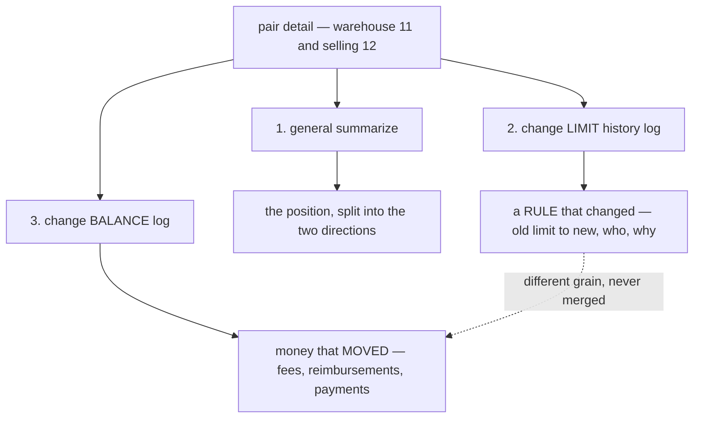

# Decisions — `team_balance_design.md`

What the owner settled, recorded before it is acted on. **Append-only** — a decision that is later
reversed is renamed and its references grepped (RULE 12), never quietly edited away.

| decision | what it decided |
| --- | --- |
| [the-pair-detail-shows-both-logs](#the-pair-detail-shows-both-logs) | the pair detail page carries a summary AND **two separate logs** — the limit history and the balance history. They are never merged |

---

## the-pair-detail-shows-both-logs

> `team_balance_design.md` §Detail Pair Team Balance — *"1. Its show general summarize · 2. Its show
> change limit history log · 3. its show change balance log"*

**The verdict.** *"The Change Log"* in §Frontend Requirements 3 was **two logs, not one**, and the
owner has now named them separately. The pair detail page carries three things: the pair's summary,
the **credit-limit history**, and the **balance history**.

This closes the clarify's Q6 — *"which log does item 3 mean, the entries or the limit history?"* — and
it closes it against that file's recommendation of picking one. The answer was both.

### Why they must not merge

They answer different questions and only one of them is a ledger.

| | the limit log | the balance log |
| --- | --- | --- |
| what it records | a **rule** changing | **money** moving |
| grain | one row per limit change | one row per posted entry |
| immutable? | yes, but it describes configuration | yes, and it *is* the account |
| who writes it | a person, deliberately | an event — an order placed, a restock accepted |
| what it answers | *"why is this team blocked, and who allowed it"* | *"what do we owe each other, and from what"* |

Merging them into one stream would put a configuration change in a column headed *Amount*, and would
make the running balance meaningless on the rows that moved no money.

### Why BOTH belong on this page

The question a person actually arrives with is *"why is this team blocked?"* — and answering it needs
both halves at once: what they owe, **and** what they were allowed. Splitting them across two screens
makes the reader hold one number in their head while they go and find the other.

### The spec

| | |
| --- | --- |
| 1. general summarize | the pair's position, rendered as **two directions**, never a bare signed number |
| 2. limit history | `LiabilityTermsHistoryList`, filtered to this counterparty. ⚠ **Both limits nullable** — `absent`, `0` and a number are three different acts |
| 3. balance log | `LiabilityEntryList` for the pair, in its four cuts — receivable, payable, my payments, their payments |
| paging | **three independent page numbers.** One shared number would turn to page 2 of a log the reader is not looking at |
| the panel | `features/liability/ChangeLogPanel` — a DOMAIN component, because two pages now read it |

### What it does NOT settle

⚠ **Where a limit is WRITTEN.** Showing the history here says nothing about which screen sets the
limit, and the Credit Terms screen (`/liability/terms`) is still not named in §Frontend Requirements.
That is [Q7 in the clarify](./team_balance_design_clarify.md#question), and it still blocks
`design_accept` on a finished prototype.
