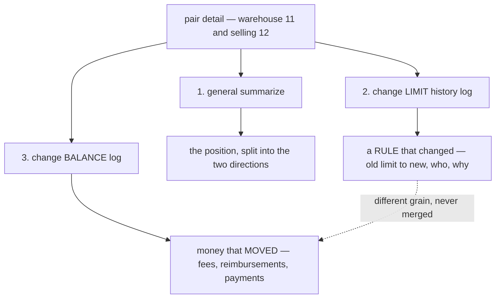
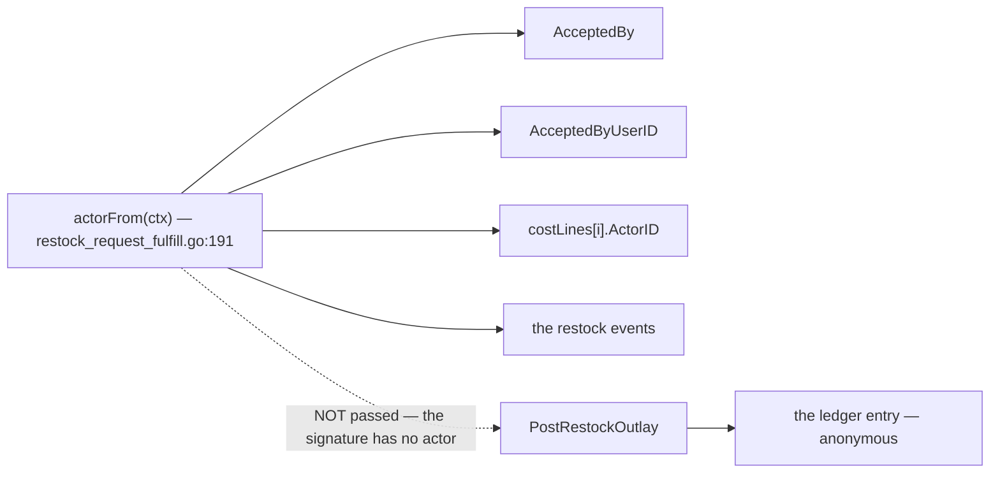
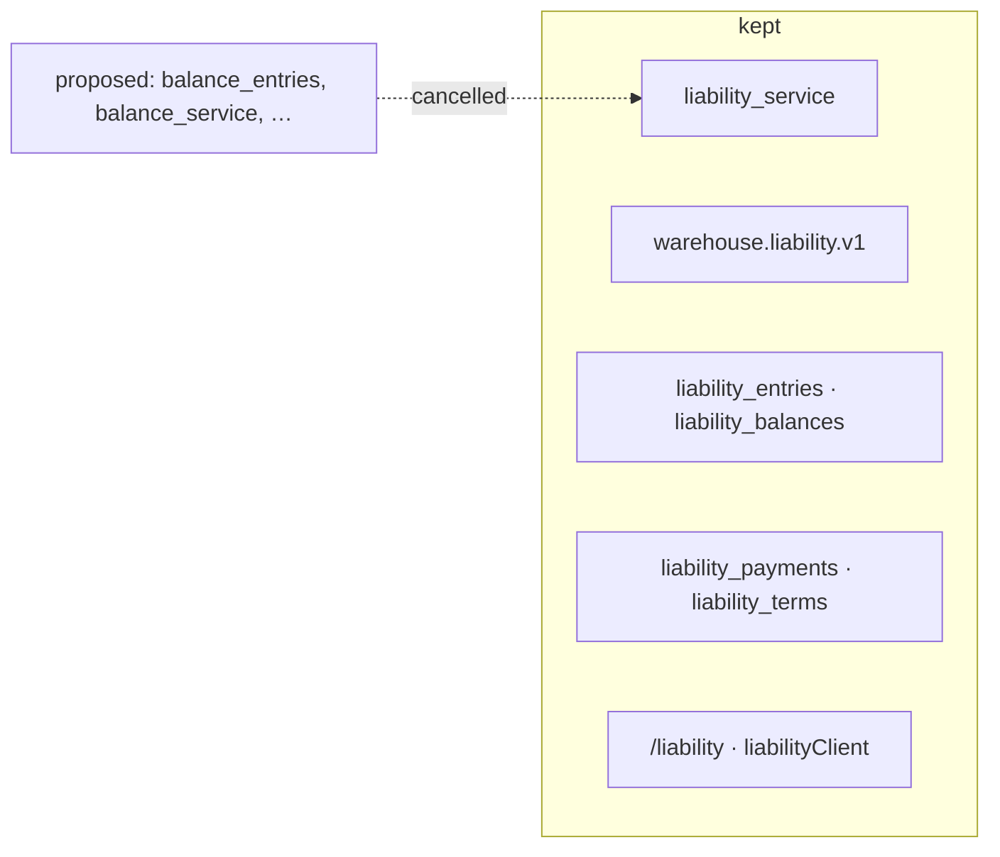
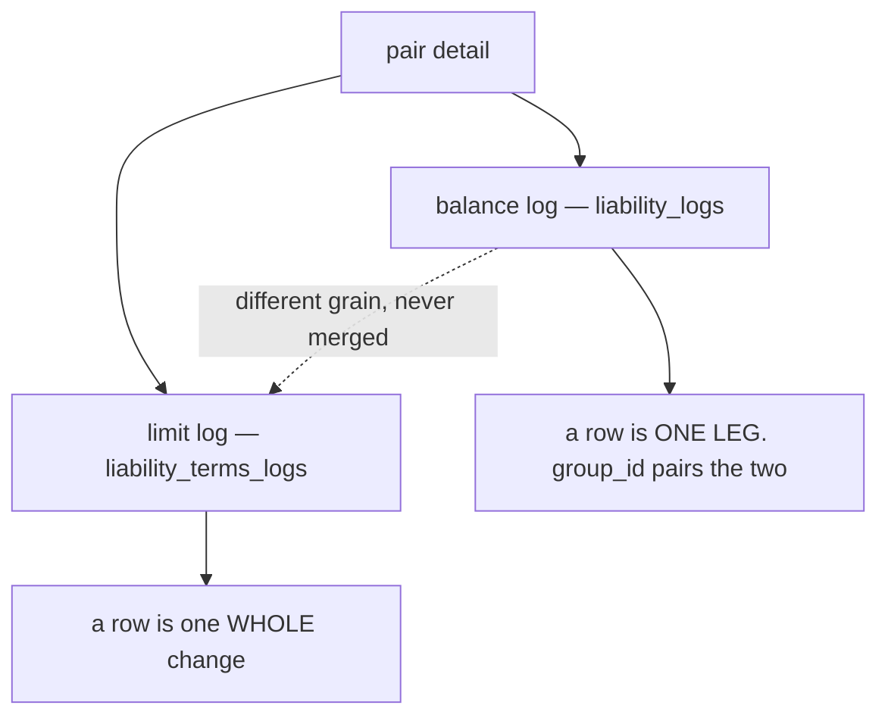
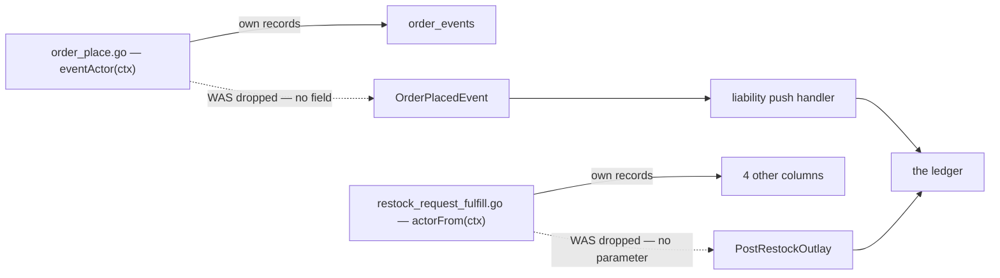

# Decisions — `team_balance_design.md`

What the owner settled, recorded before it is acted on. **Append-only** — a decision that is later
reversed is renamed and its references grepped (RULE 12), never quietly edited away.

| decision | what it decided |
| --- | --- |
| [the-pair-detail-shows-both-logs](#the-pair-detail-shows-both-logs) | the pair detail page carries a summary AND **two separate logs** — the limit history and the balance history. They are never merged |

---

## the-pair-detail-shows-both-logs

> `team_balance_design.md` §Detail Pair Team Balance — *"1. Its show general summarize · 2. Its show
> change limit history log · 3. its show change balance log"*

**The verdict.** *"The Change Log"* in §Frontend Requirements 3 was **two logs, not one**, and the
owner has now named them separately. The pair detail page carries three things: the pair's summary,
the **credit-limit history**, and the **balance history**.

This closes the clarify's Q6 — *"which log does item 3 mean, the entries or the limit history?"* — and
it closes it against that file's recommendation of picking one. The answer was both.

### Why they must not merge

They answer different questions and only one of them is a ledger.

| | the limit log | the balance log |
| --- | --- | --- |
| what it records | a **rule** changing | **money** moving |
| grain | one row per limit change | one row per posted entry |
| immutable? | yes, but it describes configuration | yes, and it *is* the account |
| who writes it | a person, deliberately | an event — an order placed, a restock accepted |
| what it answers | *"why is this team blocked, and who allowed it"* | *"what do we owe each other, and from what"* |

Merging them into one stream would put a configuration change in a column headed *Amount*, and would
make the running balance meaningless on the rows that moved no money.

### Why BOTH belong on this page

The question a person actually arrives with is *"why is this team blocked?"* — and answering it needs
both halves at once: what they owe, **and** what they were allowed. Splitting them across two screens
makes the reader hold one number in their head while they go and find the other.

### The spec

| | |
| --- | --- |
| 1. general summarize | the pair's position, rendered as **two directions**, never a bare signed number |
| 2. limit history | `LiabilityTermsHistoryList`, filtered to this counterparty. ⚠ **Both limits nullable** — `absent`, `0` and a number are three different acts |
| 3. balance log | `LiabilityEntryList` for the pair, in its four cuts — receivable, payable, my payments, their payments |
| paging | **three independent page numbers.** One shared number would turn to page 2 of a log the reader is not looking at |
| the panel | `features/liability/ChangeLogPanel` — a DOMAIN component, because two pages now read it |

### What it does NOT settle

⚠ **Where a limit is WRITTEN.** Showing the history here says nothing about which screen sets the
limit, and the Credit Terms screen (`/liability/terms`) is still not named in §Frontend Requirements.
That is [Q7 in the clarify](./team_balance_design_clarify.md#question), and it still blocks
`design_accept` on a finished prototype.

---

## every-entry-names-who-posted-it

> The owner, in chat — *"yes"*, answering [Q4](./team_balance_design_clarify.md#question):
> should `liability_entries` carry an actor?

**The verdict.** Every ledger entry records **the person who caused it**. Not the service, not the
event — the human whose act produced the money movement.

⚠ **This closes the first half of Q4 and REVERSES my recommendation on the second.** I proposed a
reserved id meaning *"posted by the system"* for causes 1–5, on the reasoning that five of the six
post from events so *"the service, not a person"* was the honest answer. **The code says otherwise:**
the person is already at hand and is dropped at the boundary.

A column reading *"system"* for five of six causes would cost a migration and answer nothing:
[business Critique 8](../../business/balance/context_clarify.md#critique) — *a team disputing a
charge must see who recorded it* — would still be unanswerable, and the threshold makes that acute,
because a charge nobody can explain can now stop a team trading.

### The spec

| | |
| --- | --- |
| the column | `actor_id` on `liability_entries`, **NOT NULL** |
| what fills it | the **human** who acted — the person who accepted the restock, cancelled the order, recorded the damage |
| how it gets there | **two more parameters**, on `PostRestockOutlay` and `PostStockDamage`. The value already exists at both call sites |
| `0` | reserved for a genuinely unattended posting — a scheduled job. **Today nothing qualifies** |
| backfill | ⚠ **impossible.** Rows written before this cannot be attributed, and there is no source to recover it from. Every day of trading adds more |

### ⚠ One sentinel, two meanings — fix it in the same pass

`liability_payments.recorded_by` / `confirmed_by` are documented as *"0 when unknown"*. If entries
use `0` for *the system*, one value means two things inside one service. A payment is **always** a
person's act, so `0` there is not a state worth having:

| | today | should be |
| --- | --- | --- |
| `liability_entries.actor_id` | — | `0` = the system, and nothing writes it yet |
| `liability_payments.recorded_by` | `0` = unknown | never `0` |
| `liability_payments.confirmed_by` | `0` = unknown | never `0` while confirmed |

### It rides with a migration that is already approved

[the-ledger-speaks-the-business-words](../../business/balance/context_decision.md#the-ledger-speaks-the-business-words)
is decided and unrun, and touches this same table. Adding `actor_id` in that migration costs one
pass instead of two.

---

## liability-stays

> The owner, in chat — *"just keep liability as before i ask change name to balance log"*, after
> floating `balance_logs` and reading what a whole-context rename would cost.

**The verdict.** The service, the proto package, the tables and the frontend route **keep the
`liability` name**. The rename is **cancelled**, not deferred.

### ⚠ The known cost, ACCEPTED — do not re-raise it

The objection was real and it is being accepted, not refuted. Recording it here so the next reader
does not spend the argument again:

| | |
| --- | --- |
| the objection | every posting is a **mirrored pair**, so one side's liability is the other's **receivable**. The table name describes one leg, and half its rows are named after the wrong side |
| what settles it anyway | a whole-context rename is **141 files and 2350 occurrences**, and it forces awkward names on two tables — `balance_balances` is absurd, and `balance_terms` describes a credit limit as if it were a balance |
| what stays true | the code's own comments already say the direction lives in the two team columns, not in the table's name |

### What this does NOT decide

| | |
| --- | --- |
| **the UI label** | *"Change Log"* was never in question — that is what a person reads, and `team_balance_design.md` §Detail Pair Team Balance names it |
| **the source-type words** | [the-ledger-speaks-the-business-words](../../business/balance/context_decision.md#the-ledger-speaks-the-business-words) is untouched. The **values** still become `order_fee` · `incidental_fee` · `broken_good` · `lost_good` · `found` — that migration is about what the rows SAY, not what the table is CALLED |
| **the service split** | `architecture/context.md:7` names a `balance_service`, and [architecture Q10](../architecture/context_clarify.md#question) asks whether the gate half is called that or `liability_service`. ⚠ This is **evidence** for keeping `liability` there too, not an answer — a split creates a new service, which is a different act from renaming an existing one |

### ✅ What it simplifies

The next migration carries **two** approved changes, not three: the source-type vocabulary and
[every-entry-names-who-posted-it](#every-entry-names-who-posted-it). Both land on
`liability_entries`, which keeps its name.

---

## two-logs-two-names

> The owner, in chat — *"liability_logs + liability_terms_logs, yes"*.

**The verdict.** The ledger table is **`liability_logs`**, and the credit-limit history — which does
not exist yet — is **`liability_terms_logs`**. Both names say *what they log*; neither takes the bare
word, in a design where [the-pair-detail-shows-both-logs](#the-pair-detail-shows-both-logs) put two of
them on one screen and said they must never merge.

⚠ **They are not the same shape**, which is why both names are qualified: a balance row is **half** a
movement, a limit row is a **whole** change.

### The spec

| renames | to |
| --- | --- |
| table `liability_entries` | **`liability_logs`** |
| model `LiabilityEntry` · `liability_entry.go` | `LiabilityLog` · `liability_log.go` |
| proto `LiabilityEntry` · `LiabilityEntryList*` | `LiabilityLog` · `LiabilityLogList*` |
| rpc `LiabilityEntryList` | `LiabilityLogList` |
| handler `entry_list.go` | `log_list.go` |
| frontend `useLiabilityEntries` | `useLiabilityLogs` |
| the unbuilt limit history | **`liability_terms_logs`** — named now because there is one moment to make the pair consistent, and it is before the table exists |

⚠ **The API renames with the table.** Leaving the RPC saying `Entry` over a table called
`liability_logs` is the half-rename that was argued against when the whole-context rename was on the
table. It is breaking, and there is no external consumer — one `buf generate` moves both sides.

| does NOT change | |
| --- | --- |
| the `liability` prefix | [liability-stays](#liability-stays) — this decision is about the suffix |
| `liability_balances` · `liability_payments` · `liability_terms` | untouched |
| the source-type **values** | a separate decision — [the-ledger-speaks-the-business-words](../../business/balance/context_decision.md#the-ledger-speaks-the-business-words) renames what the rows SAY |
| the *"Change Log"* UI label | never in question |

### ⚠ What was traded, recorded once

**"Entry" means one side of a double-entry posting** — which is exactly what a row is, and the
model's own comment says so (*"ONE LEG of one movement"*). **"Log" says "a record of something that
happened"**, and a leg is not a thing that happened; the movement is. That precision is given up
deliberately, in exchange for the schema speaking the words the design docs use.

⚠ **The objection that was WITHDRAWN, so it is not re-raised**: *log* was argued to invite treating a
row as standing alone and breaking *two legs are one posting*. It does not, because the invariant is
held by code rather than by a noun — `group_id` ships (*"Shared by both legs of one movement"*) and
`post_entry.go` is the single construction site, writing both legs in one transaction.

### It rides the pending migration

Third and last rider on the same pass, with
[the-ledger-speaks-the-business-words](../../business/balance/context_decision.md#the-ledger-speaks-the-business-words)
and [every-entry-names-who-posted-it](#every-entry-names-who-posted-it). All three touch this one
table and this one proto. **Nothing gates them now.**

---

## the-actor-was-dropped-at-every-boundary

> A correction to [every-entry-names-who-posted-it](#every-entry-names-who-posted-it), found while
> building it. This log is append-only, so the earlier entry stands as written and this one is the
> amendment.

**What that entry claimed.** *"The person is already at hand and is dropped at the boundary"* — true
of the restock path, which is the one I checked.

**What is actually true.** It is dropped at **every** boundary, and for the two highest-volume causes
there was no channel to carry it at all.

| cause | the actor was… |
| --- | --- |
| `order_fee` · `product_fee` | ⛔ **not available.** `OrderPlacedEvent` had no actor field. `order_place.go` computes one for its own records and the event dropped it |
| `incidental_fee` | ✅ computed in `restock_request_fulfill.go`, dropped by the poster signature |
| `broken_good` · `lost_good` · `found` | ✅ computed in `stock_adjust.go`, dropped by the poster signature |
| `payment` | ✅ on the request |

⚠ **So the fix was bigger than two parameters**: `OrderPlacedEvent` and `OrderCancelledEvent` each
gained an `actor_id`, and selling_service populates both from the `eventActor(ctx)` it was already
computing. Had this not been caught, the column would have read 0 for the two causes that produce
the most rows — which is precisely the shrug the decision said it must not become.

### ⚠ The cancel carries its OWN actor

`OrderCancelledEvent.actor_id` is whoever cancelled, not whoever placed. A reversal is a second act
and often a second person, and the ledger records who caused **each** movement — not who caused the
one being undone.
