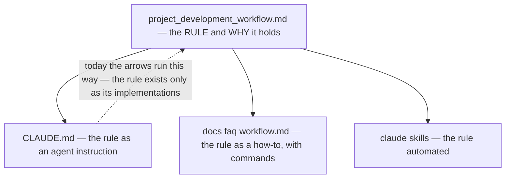
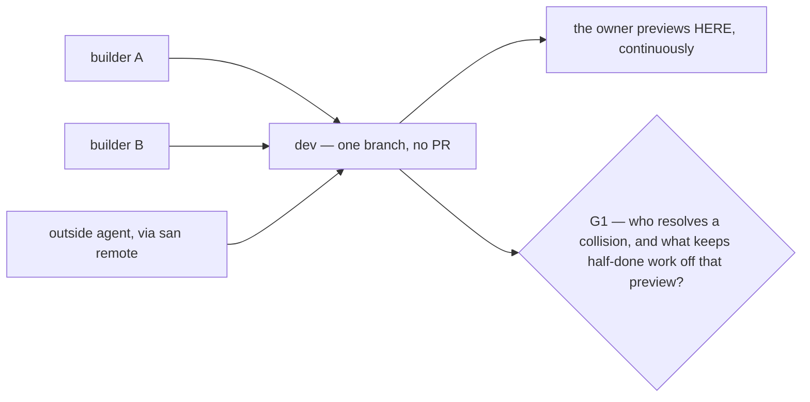
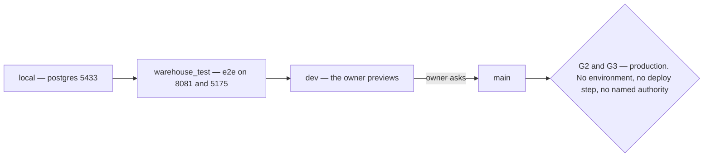
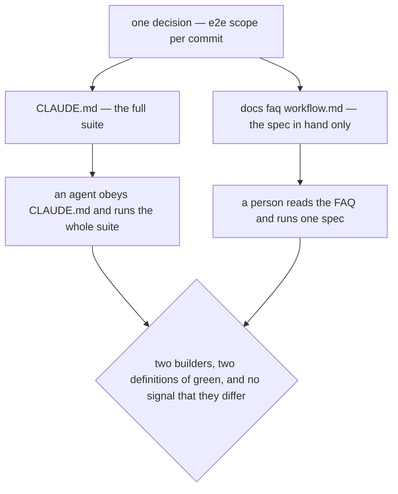

# Clarity — `project_development_workflow.md`

[project_development_workflow.md](./workflow.md) is **one
heading and nothing else**. **That doc is yours — this one is mine.** Answered points are **deleted**, so
this file is always the current open set.

> **The finding is not "it is empty".** It is that **the workflow is already written down in three other
> places**, none of which is a requirements doc — so the useful question is not *what goes in here* but
> *what does this layer hold that the other three must be derived FROM*. Answer that first and the doc
> writes itself. Answer it second and this becomes a fourth source of truth that drifts against the
> other three.

Siblings: [development_level](./level.md) (its nearest neighbour, and
[the overlap is real](#critique)) · [architectures/architecture_context](../architecture/context_clarify.md).

---

## Proposed Design

### Where process lives today — four homes, one subject

| home | holds | authority |
| --- | --- | --- |
| `CLAUDE.md` § Git workflow | the rule as an **agent instruction** — branch, board, issue comments, Priority field | enforced on every session |
| [docs/faq/workflow.md](../../faq/workflow.md) | the same rule as a **how-to**, with the `gh` commands | explains, never decides |
| `.claude/skills/` (the audits, `faq-create`, `run-warehouse-revamp`) | the rule **automated** | executes |
| **this doc** | ??? | undefined |

### requirements-state-the-rule

**This doc states what must be TRUE and why. The other three state how it is done.**

| this doc says | `CLAUDE.md` / FAQ say |
| --- | --- |
| *every change is traceable to an issue whose thread is its spec* | `gh api repos/…/issues/N/comments --jq last` |
| *the owner must be able to preview the running app at any moment* | commit straight to `dev`, no per-issue branch |
| *nobody but the owner declares work done* | stop at **In review**, never close the issue |

**→ Recommend one line at the top of the doc saying exactly that**, before any content lands. It is the
same recommendation I made for [`architectures/`](../architecture/context_clarify.md) and for the
same reason: with four plausible homes and no stated rule, the next process rule lands in whichever file
is open.

### What is genuinely MISSING — not covered by any of the four

These are the rows worth writing, because no existing doc answers them.

| # | Requirement that has no home | why it bites |
| --- | --- | --- |
| **G1** | **Several people and agents build on ONE branch with no PR.** `business_level` says several people build this, `san remote` hands a shell to an outside agent, and the workflow is *commit straight to `dev`, no branch, no PR*. Nothing says who resolves a collision, or how half-finished work is kept off the owner's preview. | This is the workflow's single largest unstated assumption, and it fails silently — as a broken preview, not as an error |
| **G2** | **Promotion and environments.** `main` is promoted *"when the owner asks"*. There is no staging, no named production database beyond `PRODUCTION_DATABASE_URL`, and no deploy step — while `development_level.md` lists **deploy** as a tool requirement | The tool is required to do a thing the workflow never describes |
| **G3** | **Who may act on production.** `san` guards it with a typed confirmation — a guard against a *slip*, not a statement of *authority* | A confirmation prompt is not a permission model |
| **G4** | **What "Done" means as a check, not as a person.** The board says the owner flips it — nothing says what they are checking | "Reviewed" and "previewed" are different bars |
| **G5** | **What must be green** — see [Contradiction](#contradiction), where the two existing homes already disagree | |

---

## Critique

| | Problem | → Recommend |
| --- | --- | --- |
| **1** | **A fourth home for a subject three files already cover.** Unless the derivation direction is stated, the failure mode is not confusion — it is a *correct* rule in this doc and a *stale* one in `CLAUDE.md`, with nothing marking which is authoritative. `CLAUDE.md` is the one an agent actually obeys, so this doc losing a race is silent. | [requirements-state-the-rule](#requirements-state-the-rule), plus **one line naming `CLAUDE.md` as the enforced projection of it** — so a change here is known to be incomplete until `CLAUDE.md` follows in the same commit. That is the rule the repo already applies to schema changes and `docs/tools/san.md`. |
| **2** | **The filename matches neither ladder.** Six docs are `<x>_context.md`, one is `<x>_level.md` — this is `project_development_workflow.md`, a third pattern. `development_level.md` is its nearest neighbour and already holds *tooling* requirements (unified `san`, MCP), which is the same layer viewed from a different angle. | Either **`workflow_context.md`** as a seventh context doc, or **fold it into `development_level.md`** as a second section. → **I recommend folding.** `development_level.md` is 53 lines about how this project is built, this is more of the same, and two thin sibling docs at one layer is how a reader stops knowing which to open. |
| **3** | **The riskiest gap is [G1](#what-is-genuinely-missing--not-covered-by-any-of-the-four), and it is a consequence of a rule you already decided.** No-branch-no-PR is right for a single builder with an owner previewing continuously — that is precisely the case where a branch is pure friction. It has no answer at all for two. | State the assumption explicitly — *"one builder at a time on `dev`, concurrent work coordinated out of band"* — **or** name the smallest escape hatch. → **I recommend stating the assumption**, not adding branches. Naming a constraint is free, and it stops the workflow reading as though it had been designed for a case it was not. |
| **4** | ⚠ **Do not let this doc name services, folders or commands.** The pull will be strong, because all three existing homes are concrete. The moment it carries a shell command it has become a second FAQ, and it will be the wrong one within a month. | Keep every line testable as *true / not true*, never as *done / not done*. |

---

## Question

1. **Fold into [development_level.md](./level.md), or keep separate?**
   ([Critique 2](#critique)) **→ I recommend folding — same layer, same subject, 53 lines.**
2. **Is `CLAUDE.md` the derived projection of this doc, and must it be updated in the same commit?**
   ([Critique 1](#critique)) **→ I recommend yes, stated in one line. It is the same rule a schema change
   already carries.**
3. **How many people build on `dev` at once?** ([G1](#what-is-genuinely-missing--not-covered-by-any-of-the-four)) **→ I recommend writing down whatever the
   answer is today, even if it is "one". The workflow is only sound under an assumption nothing states.**
4. **Does production exist yet as an environment?** ([G2, G3](#what-is-genuinely-missing--not-covered-by-any-of-the-four)) **→ If not, "there is no production
   yet" is a complete and useful answer — and it explains why `deploy` is a tool requirement with no
   workflow behind it.**

---

# Contradiction

## What must be green before a commit — the two homes already disagree

**The example, quoted:**

| source | says |
| --- | --- |
| `CLAUDE.md` § Git workflow | *"Keep `dev` green: `buf lint`, `go build/vet/test`, frontend typecheck, **and the Playwright e2e** should pass at each commit."* |
| [docs/faq/workflow.md](../../faq/workflow.md) | *"Plus the Playwright spec **for the work in hand — not the whole suite**, CI covers the rest."* |

**Which one I think is wrong: `CLAUDE.md`.** The FAQ's version is the one actually practised and the one
that survives a growing suite — a full e2e run per commit stops being paid for long before it stops being
written down. This is **reported, not fixed**: the line lives in your `CLAUDE.md`.

**→ RECOMMEND** — the workflow doc carries **one** definition of green ([G5](#what-is-genuinely-missing--not-covered-by-any-of-the-four)), and the other two
homes cite it rather than restating it. Restating is the cause here, not carelessness: the same list is
written out in full in two places, so one decision has to be applied twice and only ever gets applied once.

⚠ **This is the argument for [requirements-state-the-rule](#requirements-state-the-rule) in one concrete
case** — the contradiction exists because no layer owns the rule, only two layers that describe it.

---

# Awaiting

- **The entire document.** Everything above is a proposal for one, not a reading of one.
- **[Question 4](#question) gates [G2 and G3](#what-is-genuinely-missing--not-covered-by-any-of-the-four)** — if production does not exist yet, two of the five
  gaps close as "not yet", and the doc gets shorter rather than longer.
