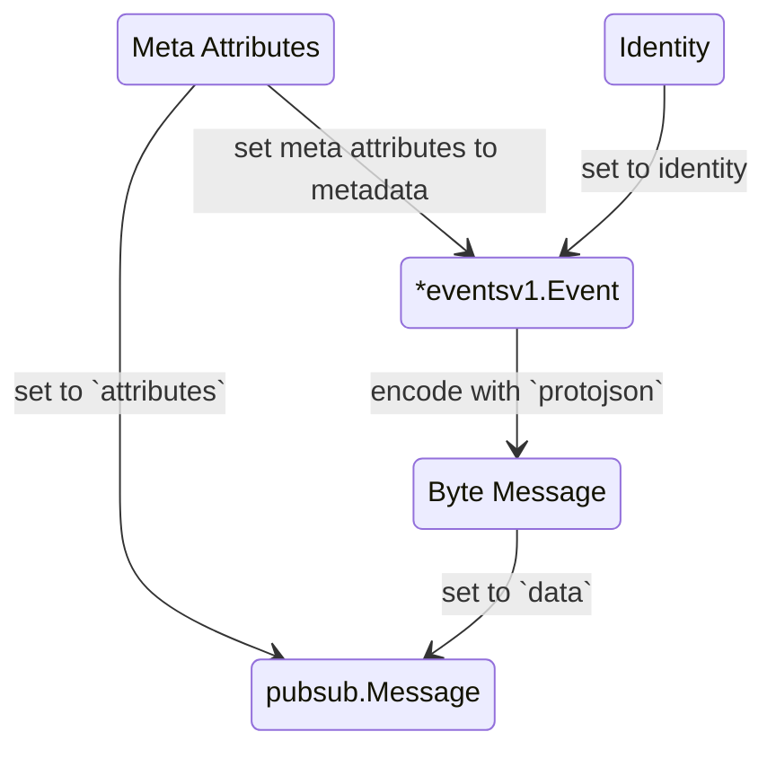

# Event Architecture Context.
**This Architecture proposed by Heri, (Toni maybe have another)**

## General Brief
1. We use Goole Pub/Sub.
2. This architecture design used by:
    - [settlement service](../../business/settlement/context.md)
3. Implementation library placed in `backend/pkgs/san_event`


## Responsbility
1. Provide library that any service can use it to publish event.
2. Function that ensure event setup related properly.


## Event Sender Contract.
1. Send event contract.
    ```go
    type EventSender func(ctx context.Context, identity role_basev1.Identity, event *eventsv1.Event) error
    ```
2. `Event` is from proto definition.
3. event function in produced by 
    ```go
    func NewEventSender(client pubsub.Client, ...) EventSender
    ```
    note: `pubsub.Client` is not real codename, its just pseudo
    

## How Ensure Event Setup Related Properly
we should have function:
```go
func InitializeTopic(...) error
func InitializeSubscriber(...) error
```


## Event Proto Definition
1. Make event is a shared definition that define in `warehouse.events.v1`
2. It's contain:
    - settlement event definition
3. in `warehouse.events.v1` have custom message options.
    ```proto

    message EventConfig {
        string topic
    }

    extend google.protobuf.MessageOptions {
        EventConfig event_config
    }


    ```
4. All type wrapped in one definition.
    ```proto

    message OrderCreated { // this is example
        option (event_config) = {
            topics: "order"
        };
        ... 
    }

    message OrderCancel { // this is example
        option (event_config) = {
            topics: "order"
        };
        ...
    }

    message Event {
        map<string, string> metadata
        role_base.v1.Identity identity // its from rolebase

        oneof message {
            OrderCreated    order_created
            OrderCancel     order_cancel
        }
    }

    ```
5. Every event message must have topic
    ```proto
    message OrderCreated { // this is example
        option (event_config) = {
            topics: ["stock", "order"]
        };
        ... 
    }
    ```

## How Event Encode and Decode.
### How Encode to PubSub Event.

### How Decode to PubSub Event.
1. we just decode `*eventsv1.Event` field data with `protojson`

## How Event Received / Subscribed.
### Webhook (Google PubSub Push Subscriber).
#### In Library
1. library have interface
    ```go
    type EventPushHandler func(ctx context.Context, event Event) error
    ```
2. library have function factory to create `http.HandlerFunc`
    ```go
    func NewMuxPushHttpHandler(handler PushHandler) http.HandlerFunc {
        // implementation
    }
    ```
#### what need to be impelemented in service that adopt this design
for example we use settlement service.

1. aliasing `EventPushHandler`
    ```go
    type SettlementEventPushHandler san_event.EventPushHandler
    ```
2. create function factory for `SettlementEventPushHandler`
    ```go
    func NewSettlementEventPushHandler(...) SettlementEventPushHandler
    ```
3. create function factory to create http handler
    ```go
    func NewSettlementEventPushHttpHandler(handler SettlementEventPushHandler) http.HandlerFunc {
        return san_event.NewMuxPushHttpHandler(san_event.EventPushHandler(handler))
    }
    ```
    so service can register `http.HandlerFunc` hook freely 

### Pull (Google PubSub Push Subscriber)
#### In Library
1. library have interface
    ```go
    type EventPullHandler func(ctx context.Context, event Event) error
    ```
2. library have implementation
    ```go
    func ListenSubscriber(..., subid string, handler EventPullHandler) error {
        // implementation
    }
    ```
#### what need to be impelemented in service that adopt this design
1. service just simple define `EventPullHandler` and use function `ListenSubscriber`