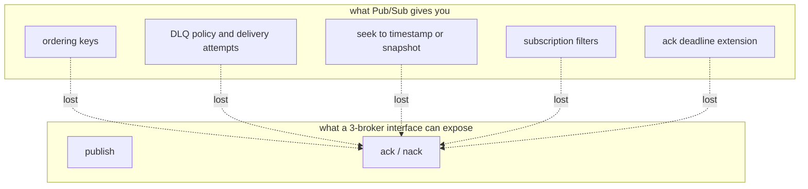
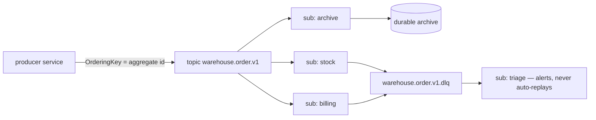

# Clarity — `context.md`

Critique, questions and warnings about [context.md](./context.md). That doc is yours; this one is
mine. Answered points are **deleted**, so this is always the current open set.

> The doc is three lines and one decision — *"We use Google Pub/Sub"*. Everything below is about
> what that line commits you to and does not yet say, plus the one place it disagrees with
> [`event/library.md`](../event/library.md).

---

# Contradiction

## The broker is decided twice, and the two decisions are not the same decision

| doc | says |
| --- | --- |
| [`event/library.md`](../event/library.md) §3 | *"Message Broker are supported is: Google Pub/Sub, local sqlite"* — plus a `NewRabbitMqEventSender` constructor, deferred |
| `context.md` §1 | *"We use Google Pub/Sub"* |

One reads as **an abstraction over brokers**, the other as **a choice of broker**. They lead to
different libraries, so this has to resolve before either is built further.

The cost of the abstraction is not the interface — it is that **a portable API can only expose the
intersection of its brokers**, and the intersection is where everything valuable lives:

**→ Recommend: say it here as "Pub/Sub is the only production broker. sqlite is a development
fake, not a supported broker."** One real implementation plus one fake is a testing seam and is
right. Three named brokers is a portability promise nobody will maintain, and it will quietly
prevent you from using ordering keys and DLQ policy — the two features this design most needs. The
RabbitMQ constructor should then come out of `library.md` rather than sit there as a deferred
promise.

---

# Critique

## One line, seven consequences — and a doc that states none of them

Each of these is decided *by* choosing Pub/Sub, whether or not it gets written down. Undocumented,
each becomes a surprise at a different, worse moment.

| what Pub/Sub does | why it must be in this doc | **→ Recommend** |
| --- | --- | --- |
| **retention caps at 31 days** (topic max, subscription default 7) | it means Pub/Sub **cannot be your log of record** — there is no "replay from the beginning" | state it, and add one archive subscription per topic writing raw messages to durable storage. Added later, it starts at *now* and the earlier months do not exist |
| **subscription filters are immutable** | changing a filter means delete plus recreate, and a new subscription only gets messages published after it exists — so a filter change is a **data gap** | dispatch on event type in handler code, not in the filter. Filters only for coarse, stable, extreme-volume cuts |
| **ordering is opt-in, and the key cannot be backfilled** | turning ordering on later is a subscription flag, but only works if the publisher was setting `OrderingKey` all along | set `OrderingKey` to the aggregate id on the **first** publish, even if no subscription orders yet. It is free and it is the one thing you cannot retrofit |
| **ordering implies per-key head-of-line blocking** | a message that keeps nacking blocks *that aggregate's* stream until the DLQ threshold — silently, forever, if there is no DLQ | the DLQ stops being a nicety and becomes the thing that unblocks the stream. Mandatory per subscription |
| **DLQ needs an IAM grant on the Pub/Sub service agent** | without `subscriber` on the source sub and `publisher` on the DLQ topic, nothing dead-letters — it just redelivers forever, with no error anywhere | provision the grant with the topic, never by hand afterwards |
| **push vs pull is a deployment decision** | push needs a public HTTPS endpoint and has no flow control, pull needs a long-lived process. `library.md` designs *both* without saying where either runs | decide where consumers run first. It determines which half of `library.md` is real |
| **1 KB minimum billed per message** | thin events save far less than expected, which weakens the case for them | do not shrink events for cost below 1 KB — shrink them for coupling or not at all |

## `deadletter` as one shared topic loses the thing you need from it

`library.md` reserves a single topic named `deadletter` for the whole system.

⚠ Pub/Sub's own dead-letter mechanism is **per-subscription** — it counts delivery attempts and
routes automatically. A hand-published shared `deadletter` topic is a different mechanism that does
not do that, so a poison message still redelivers on its source subscription forever, and the
per-key block above never clears.

A shared topic also merges every service's failures into one stream with no `delivery_attempt`, no
source subscription, and nothing to replay *back* to.

**→ Recommend: one DLQ topic per source topic** (`<topic>.dlq`), wired as Pub/Sub's native
`dead_letter_policy`, each with its own triage subscription created in the same change. A DLQ topic
with no subscription retains nothing — the messages land and expire.

---

# Proposed Design

What I think `context.md` should say, concretely.

| decision | value |
| --- | --- |
| broker | Google Pub/Sub, sole production broker. sqlite is a dev fake |
| topic grain | one per aggregate stream — the ordering and retention boundary, not a routing category |
| topic name | **equal to the proto package** — `warehouse.order.v1`. Dots are legal in Pub/Sub names, so the topic is derivable and there is no mapping table to drift |
| envelope | one message type per topic, `meta` plus `oneof` — already the shape in `library.md` |
| ordering key | the aggregate id, set on every publish from day one |
| attributes | `event_type`, `event_id`, trace context — **derived by the shared publisher**, never set at a call site, or they drift from the body |
| dedup key | your own `meta.event_id`, never Pub/Sub's `message_id` — a publisher retry produces a new `message_id` for the same fact |
| DLQ | native `dead_letter_policy` per subscription to `<topic>.dlq`, each with a triage subscription |
| archive | one subscription per topic to durable storage, from day one |
| environments | **separate GCP projects**, not name prefixes — the boundary should be IAM, not a string convention |

⚠ **Exactly-once delivery does not remove the dedup table.** It is pull-only and covers redelivery,
not publish retries — the same fact published twice is two messages with two `message_id`s. The
inbox stays.

---

# Question

1. **One broker, or an abstraction over several?** The contradiction above. I recommend one — it is
   what lets you use ordering keys and DLQ policy at all.
2. **Where do consumers run?** Cloud Run pushes you to push subscriptions — scale-to-zero, but no
   flow control and a hard request timeout. A long-lived process lets you use streaming pull, which
   is better on throughput, latency and backpressure. `library.md` designs both halves without this
   answer, so half of it is currently speculative.
3. **Archive subscription now, or accept no history before the day you add it?**
4. **Does this doc supersede [`event/library.md`](../event/library.md), or sit above it?** Two
   sibling directories in one tree describe the same subject right now, and
   [`library_clarify.md`](../event/library_clarify.md) still has four open contradictions against it
   — including the option-number one (`san_event` at 50099 vs the shipped `event_config` at 50001,
   where the reader silently finds no topic). I need to know which file those get answered in.

---

# Awaiting

- **Everything after line 3.** Topics, subscriptions, ordering, retention, DLQ, environments,
  who publishes what — none of it is written yet.
- **`Goole` → `Google`** in §1.
