# Clarity — `context.md`

Critique, questions and warnings about [context.md](./context.md). That doc is yours; this one is
mine. Answered points are **deleted**, so this is always the current open set.

> 🆕 **Q14 elaborated** into four parts ([here](#q14-part-by-part)), each checked against the code. The new finding
> is **14b**: the identity chain breaks at the FIRST consumer — user 57's order becomes liability's `SYSTEM` ledger
> event, and the answer was on the incoming event all along. One line in the adopter checklist keeps it. **14a** also
> turned out smaller than it looked: under `protojson` the field NUMBER is not on the wire, so the permanent choice
> is the word `identity`. No question opened or closed.
>
> ✅ 🆕 **Q6 IS CLOSED** — *"i choose one map"* settles its last part: ⛔ [event-metadata-is-copied-into-the-attributes](./context_decision.md#event-metadata-is-copied-into-the-attributes),
> against my recommendation of two. `Event.metadata` and the message attributes hold the same keys after a send.
> **The cost to write into your doc is not the size cap** — it is that the caller and the library now share one key
> namespace, so a producer writing `metadata["event_type"]` breaks the subscription filter or is silently
> overwritten. Two more recorded: a legal body value can lose the event to the attributes' 1024-byte cap, and
> `event_id` now exists three times. **→ One free guard:** mirror Pub/Sub's caps as `buf.validate` map rules — they
> can never reject what the broker accepted, because they ARE the broker's limits. **−1: two questions left, Q14 and
> Q15.**
>
> ✅ 🆕 **No batch** — *"we dont take batch"*, recorded as [handlers-take-one-event-not-a-batch](./context_decision.md#handlers-take-one-event-not-a-batch). It closes the last gap
> between the shipped receive path and the contract you had already decided: the slice goes, the **generic goes with
> it** (with one envelope `T` was always `Event`), and the **`tx` goes** too, because rule 4 says the handler opens
> its own. The signature is line 98's exactly. ✅ It is also better, not just smaller — a failing batch redelivers
> every message in it, and a push delivers one per request anyway, so batching was only ever available on the pull
> side. ⚠ What it accepts: N transactions where a batch had one. **→ Recommend one line in `context.md`** — the event
> is a DOORBELL, not a delivery, so a bulk fold is a separate pass over the producer's own table. No question opened
> or closed.
>
> ✅ 🆕 **Q15 IS CLOSED, and the change is APPLIED** — [ci-runs-on-dev-and-checks-breaking](./context_decision.md#ci-runs-on-dev-and-checks-breaking): CI now runs on
> every push to `dev`, with the expensive `test` job held to `main` and PRs, and `buf breaking` added to the fast
> job against `HEAD~1`. **This doc now has NO open questions.** ⛔ What still blocks the first event is a
> [contradiction](#contradiction), not a question — the shipped library cannot publish the decided envelope, and
> `context.md` lags its own decisions. **−1.**
>
> 🆕 **15c elaborated into the actual change**, and running it revised my own recommendation twice
> ([here](#15c--buf-breaking-in-ci-and-why)). ⛔ **`--against main` is already RED on this repo** — the RPC guideline
> migration, on `dev` and not on `main` — so a `main` baseline is red for the whole gap between a change landing and
> a promotion. **`--against '.git#ref=HEAD~1'` is clean today** and trips exactly on the commit that renames
> something, which also softens the "land the removal first" ordering. ⚠ Two mechanical details or it will not run:
> from the **repo root**, and `fetch-depth: 2`. And the `dev` trigger wants an `if:` on the `test` job — Postgres,
> Redis and a Playwright browser on every commit is the real cost. ✅ It starts green. No question opened or closed.
>
> ✅ 🆕 **Q14 IS CLOSED — all four parts**, recorded as [identity-is-a-record-never-a-credential](./context_decision.md#identity-is-a-record-never-a-credential), as
> recommended: `identity = 5` (and under `protojson` the permanent choice is the NAME, not the digit) · a caller with
> none passes a shared `SystemIdentity(agent)` · the sender clears `expired_at` · and no consumer authorises from it —
> which is now a **fifth rule** on [one-contract-for-both-handler-types](./context_decision.md#one-contract-for-both-handler-types). ⚠ **What it accepts, recorded:**
> `SystemIdentity()` is the easy thing to reach for, and a call site inside a real request that reaches for it
> anyway loses the user with nothing detecting it — hence the required `agent` argument. ⚠ **The adopter checklist
> has now grown by three this session** and is worth one restating pass rather than three footnotes. **−1: one
> question left, Q15.**
>
> ✅ 🆕 **Breaking the old shape is accepted** — *"its okay breaking old, we follow this new design"*, recorded as
> [breaking-the-old-protos-is-accepted](./context_decision.md#breaking-the-old-protos-is-accepted). It answers my *"not yet"* objection to 15c: the one `buf breaking`
> failure is expected, so what is left is a commit ORDER — land [event-base-v1-is-removed](./context_decision.md#event-base-v1-is-removed) first, then add
> the CI step, and nothing is ever overridden. ⛔ **It also withdraws my dual-publishing recommendation.** What it
> accepts, recorded: messages in flight at the cutover have no consumer. **→ Recommend a consumer-first cutover** —
> liability reads both old and new for one deploy — which removes that window and costs less than the bridge.
> **Q15 is now only: add `buf breaking`, and add `dev` to CI's triggers?**
>
> ✅ 🆕 **15b decided — [the-library-has-one-decoder](./context_decision.md#the-library-has-one-decoder)**: one decoder in the new library,
> `DiscardUnknown` then validate, and `event_source`'s `DecodeEvent` goes. ⚠ Read as *the new library's codec is
> the one decoder* — if *"we have new"* meant new OPTIONS too, the entry says which line to correct. The
> two-decoder [contradiction](#the-repo-has-two-protojson-decoders-that-disagree) is settled by decision.
> 🆕 **And *"why breaking?"* is answered** ([here](#15c--buf-breaking-in-ci-and-why)) — it is the only check that
> compares the proto to its PREVIOUS SELF, and under `protojson` a rename is a wire change nothing else can see.
> 🔄 **But I have revised my timing recommendation to NOT YET**: verified, it fails today on
> [event-base-v1-is-removed](./context_decision.md#event-base-v1-is-removed), and a check that is routinely overridden teaches people to override
> it. **Q15 narrows to 15c.**
>
> ✅ 🆕 **15a decided — [the-event-oneof-is-required](./context_decision.md#the-event-oneof-is-required)**, as recommended: an `Event` with no
> variant set fails validation, so a renamed or unregenerated arm is recorded and ACKed instead of arriving as a
> valid envelope with no body. It fires at BOTH ends — the sender validates too, so an empty envelope never enters
> the system. **This is what makes keeping `DiscardUnknown` safe (15b).** ⚠ **Re-examined (RULE 11): no
> contradiction**, but one thing becomes load-bearing — the `event_type` subscription filter is what removes 15a's
> only cost, and a filter is **immutable**: [setup-ensures-safe-defaults-never-deletes](./context_decision.md#setup-ensures-safe-defaults-never-deletes) refuses to change
> one. So it has to be right at creation. **→ Recommend it becomes a required step of the adopter checklist.**
> **Q15 narrows to 15b · 15c.**
>
> 🆕 **Q15 elaborated** into three parts ([here](#q15-part-by-part)), each verified by running it — the
> `required` oneof rule against the protovalidate protos this repo pins, and `buf breaking` against this repo with a
> field renamed. Two findings beyond the question: **15a's cost is removed by the `event_type` subscription filter**,
> which promotes that filter from a nicety to a requirement · and ⛔ **CI never runs on `dev`** (`push: [main]` +
> `pull_request`, and work goes straight to `dev` with no PR), so 15c needs `dev` added to the triggers to mean
> anything — which would also catch line 20's by-value `identity` on the commit that introduces it. No question
> opened or closed.
>
> 🔄 🆕 **You changed line 20 — identity is now a PARAMETER**, recorded as [identity-is-a-sender-parameter](./context_decision.md#identity-is-a-sender-parameter),
> which **reverses** [superseded-the-sender-reads-identity-from-ctx](./context_decision.md#superseded-the-sender-reads-identity-from-ctx) from earlier today.
> ✅ **And it is the better shape**: a `ctx` value is invisible in a signature, a parameter cannot be omitted, and the
> causation chain is now visible in the code. ⛔ **But it does not compile as written** — `identity role_basev1.Identity`
> passes a proto message BY VALUE, and `go vet` (which CI runs) refuses it. Verified, not inferred. Your event
> parameter is already a pointer, so this is the same cause at a third site — the by-value contradiction is renamed
> and widened ([here](#a-proto-message-written-by-value)). ⚠ What it moves: the no-identity case is now every CALL
> SITE's, not the library's, so [Q14](#question) 14b lands in the adopter checklist instead. No question opened or
> closed.
>
> ✅ 🆕 **Identity comes from `ctx`** — the value, at least: the caller reads it there. **Q6 · 6f elaborated**
> ([here](#6f--which-values-ride-on-ctx)) and its last half is settled — the meta attributes are ONE map,
> [spelled out as literal output](#-the-meta-half--one-bag-or-two-spelled-out). ⚠ One thing it surfaces: `GetIdentity` **errors** when
> nothing set it, and the only place in the repo that sets it is the access interceptor — so a pull worker, a push
> handler, `tools/san` and every backfill publish with no identity. **Q14** narrows to the number, that case,
> `expired_at` and the trust rule.
>
> 🆕 ⛔ **You added §How Event Encode and Decode — 6e is decided the other way.** `protojson`, recorded as
> [events-are-encoded-with-protojson](./context_decision.md#events-are-encoded-with-protojson), and the encode fork as
> [meta-rides-in-the-body-and-the-attributes](./context_decision.md#meta-rides-in-the-body-and-the-attributes). What it accepts is recorded: the wire identity is the
> field NAME, so renaming a `oneof` arm drops the WHOLE body to an unset oneof — silently, and CI never runs the
> `buf breaking` that would catch it. **New [Q15](#question)**, and **Q6 narrows to 6f**, reshaped: your encode
> diagram has three inputs where line 20 has two parameters. Your diagram parses (376). **Re-examined (RULE 11):**
> the guideline's *"Protobuf, binary encoding"* is a nineteenth stale site, and the repo's two decoders are now a
> [contradiction](#the-repo-has-two-protojson-decoders-that-disagree).
>
> 🆕 **The setup functions are a developer's tool** — recorded as
> [setup-functions-are-a-developer-tool](./context_decision.md#setup-functions-are-a-developer-tool). ✅ It removes the admin-at-boot risk: a service needs
> only publisher and subscriber. ⚠ It opens one gap — a push route whose subscription nobody has created yet
> receives nothing and says nothing — ⛔ and you declined a boot-time check for it, recorded as
> [services-do-not-verify-setup-at-boot](./context_decision.md#services-do-not-verify-setup-at-boot), against my recommendation. Recommend the tool lives
> in `tools/san`. No question opened or closed.
>
> 🆕 **You gave `EventSender` a `ctx`** — line 20, recorded as [the-sender-takes-ctx](./context_decision.md#the-sender-takes-ctx).
> Half of Q6, as recommended; it also hands Q14 the `ctx` its identity is filled from. **Q6 narrows** to the
> pointer, the meaning of `nil`, the detach, and the cleanup. ⚠ Line 20 still passes `event Event` by value
> ([Awaiting](#awaiting)). No question opened or closed.
>
> 🆕 **You added `identity` to `Event`** — line 74, `role_base.v1.Identity identity`, recorded as [event-carries-the-callers-identity](./context_decision.md#event-carries-the-callers-identity). ✅ Reusing the token's
> `Identity` is right. Three things it leaves unsaid, each silent — who fills it, whether a consumer may trust
> it, and the token expiry it carries ([critique](#identity-on-event--who-caused-it-and-three-ways-it-goes-wrong-silently)) →
> **new [Q14](#question)**. Re-examined: the guideline's `string actor = 5` is a seventeenth stale site · every line
> reference below 73 shifted by one, updated here.
>
> ✅ **Q4 decided — [no-archive-events-live-31-days](./context_decision.md#no-archive-events-live-31-days)**: no archive, no BigQuery, no Cloud Storage dump — an event
> lives 31 days. Its section here is deleted. **Re-examined (RULE 11):** one thing becomes unrecoverable —
> settlement's `order_created_by_user_id`, carried on the event and stored on no table, so the unbuilt
> [the-creator-is-stamped-on-the-state-row](../../business/settlement/context_decision.md#the-creator-is-stamped-on-the-state-row)
> is now its only protection, and settlement's clarify says so.
>
> ✅ **Q3 decided — [dev-runs-the-emulator](./context_decision.md#dev-runs-the-emulator)**, as recommended: the emulator in dev, Pub/Sub in
> production, no sqlite broker — and the dev binary's in-process **loopback is retired**. ⚠ What a developer
> inherits: the `pubsub` profile must be up, the setup tool re-run after every emulator restart (it keeps
> nothing), and a dev PUSH endpoint is `host.docker.internal:8080`, not `localhost` — pull needs no route.
> An eighteenth guideline site goes stale.
>
> ⛔ **6d decided — [publisher-and-client-shutdown-is-the-services](./context_decision.md#publisher-and-client-shutdown-is-the-services)**, against my recommendation: `NewEventSender`
> returns only the sender, and stopping publishers and closing the client are the service's. What it accepts is
> recorded: a send still retrying at a deploy is lost with no log line. Two recommendations left for the service
> side ([6d](#6d--one-publisher-per-topic-and-a-cleanup)). **Q6 narrows** to 6e · 6f.
>
> 🆕 **Your line 25 now takes the client** — `NewEventSender(client pubsub.Client, ...) EventSender`, with a note
> that the type is pseudocode (the real one is `*pubsub.Client`). ✅ The client is handed in, not made inside —
> as 6d's sketch has it. ⚠ **It still returns only `EventSender`**, so 6d's cleanup and its construction error
> have nowhere to go — [6d](#6d--one-publisher-per-topic-and-a-cleanup). Your new note shifted every line below it
> by one; every reference here is updated.
>
> 🆕 **6d elaborated** ([here](#6d--one-publisher-per-topic-and-a-cleanup)) — ⚠ **with a correction**: the shipped sender's
> per-event publishers are not a goroutine leak in v2.6.1. What 6d fixes is narrower and real — no batching, no
> ordering key ever possible, and at a deploy during a Pub/Sub slowdown, batched events die with the process
> with no log line. It also means `InitializeApp` returns a cleanup.
>
> ⛔ **6b decided — [sender-returns-the-client-error-as-is](./context_decision.md#sender-returns-the-client-error-as-is)**, against my recommendation: the sender returns the
> Pub/Sub client's error unwrapped — no `event_id`, no sentinels. So the caller's log line carries the `event_id`.
> The three caller rules move to [a recommendation](#and-one-rule-for-every-producer) — not a question. **Q6
> narrows** to 6d · 6e · 6f.
>
> ✅ **6c decided — [sender-ctx-carries-values-not-cancel](./context_decision.md#sender-ctx-carries-values-not-cancel)**: the sender's `ctx` carries values, custom and optional,
> and never cancels the publish. 🆕 It opens **6f** — Go's own rule keeps optional PARAMETERS off `ctx`, and your
> `Event.metadata` map is where a per-event option already fits ([6f](#6f--which-values-ride-on-ctx)).
>
> 🆕 **Q6 elaborated again, part by part** ([here](#q6-part-by-part)) — and one of my claims corrected: under the
> shipped codec a renamed field does not fail, it **silently reads as zero**. Two findings in code: push.go and
> codec.go decode `protojson` differently, and `buf breaking` is configured but never run in CI.
>
> 🆕 **Your line 20 takes `*eventsv1.Event`** — recorded as [the-sender-takes-a-pointer](./context_decision.md#the-sender-takes-a-pointer), part 6a of Q6 as
> recommended. ⚠ One new contradiction: the push and pull handler types (lines 98, 129) still take `Event` by
> value ([below](#a-proto-message-written-by-value)). **Q6 narrows** to 6b–6e — what an error means, the
> detached wait, one publisher per topic with a cleanup (line 25 still returns none), binary encoding.
>
> 🆕 **Q6 elaborated** — [the sender, spelled out](#proposed--the-sender-for-q6), checked against the v2.6.1
> client. It found that the client SENDS on its own background `ctx`, so today a client disconnect returns an
> error for an event that is still sent. Q6 is now five parts, 6a–6e; the by-value and encoding items moved
> into it from Awaiting. Still open.
>
> ✅ **Q5 decided — [setup-ensures-safe-defaults-never-deletes](./context_decision.md#setup-ensures-safe-defaults-never-deletes)**, as recommended: the two functions ENSURE —
> create with six defaults built in (DLQ and its grants, no expiry, ordering on, the triage sub, 10 s → 600 s
> backoff, a 60 s push deadline), update what may change, refuse and never delete what cannot — plus `Redrive`
> to bring dead-lettered events back. Its critique, proposal and walkthrough are deleted here; the decision
> carries all three. One correction on the way: an undecodable message is recorded and ACKed, never
> dead-lettered ([reject-never-nacks](../../../guidelines/architectures/event_library.md#reject-never-nacks)).
>
> 🆕 **Q2 decided — [no-outbox-the-publish-is-trusted](./context_decision.md#no-outbox-the-publish-is-trusted)**,
> ⛔ against my recommendation: no outbox, the publish is assumed to succeed, and delivery is Pub/Sub's.
> *The outbox* and *the commit-to-publish gap* sections are deleted. **Re-examined (RULE 11):** three sibling
> clarifies recommended an outbox — stock critique 3, ledger critique 5, balance critique 4 — each now carries a
> pointer · order Q14's event leg gets one too, its question unchanged · no guideline mentions an outbox.
> Your doc needs no line — it never proposed one.
>
> 🆕 **You renamed the field — line 46 now reads `string topic`**, recorded as
> [the-option-field-is-topic](./context_decision.md#the-option-field-is-topic). It closes the naming point
> Q9's decision left open. ⚠ Your three examples (lines 60, 67, 87) still write `topics:`
> ([contradiction](#the-examples-still-write-topics)). No question opened or closed.
>
> ✅ **Q9 decided — [event-base-v1-is-removed](./context_decision.md#event-base-v1-is-removed)**, ⛔ against
> my recommendation: `warehouse.event_base.v1` is removed, and the topic option lives in `warehouse.events.v1`.
> ⚠ **Not deleted from the code yet** — selling's two live events and `TopicName()` compile against it, so the
> delete must land in the SAME change that adds the new option and moves them; the decision lists every site.
> Re-examined: two more guideline sites ([contradiction](#the-guideline-still-describes-the-shapes-this-pass-replaced)),
> and **no proto question is left** — what blocks the first event is now the library, not the contract.
>
> 🆕 **You cancelled multi-topic** — recorded as
> [one-event-one-topic-per-variant](./context_decision.md#one-event-one-topic-per-variant): the global `Event`
> stays, and each variant names ONE topic. The old entry is renamed
> [superseded-one-event-many-topics](./context_decision.md#superseded-one-event-many-topics) and every link to it
> re-pointed. ✅ **Two costs leave with it** — a non-atomic fan-out and the producer knowing its consumers —
> so Q2 is back to being about a LOST event only. ⚠ One new contradiction: item 5 still lists two topics
> (since narrowed — [below](#the-examples-still-write-topics)).
>
> ✅ **Q8 decided — [ordering-is-each-services-job](./context_decision.md#ordering-is-each-services-job)**,
> ⛔ against my recommendation: no ordering key for now, and a race between events is the consuming
> service's to handle. Its section here is deleted. **Re-examined (RULE 11):** settlement already meets it —
> every write is a delta, and the cascade shifts later days · ⚠ liability does not — a cancel that arrives
> first lets the late placement charge a cancelled order · three more guideline sites
> ([contradiction](#the-guideline-still-describes-the-shapes-this-pass-replaced)) · six places in this file
> that assumed a key, rewritten.
>
> ✅ **Five decided before it, four as recommended.** Their sections here are deleted — each decision
> carries its own spec and diagram:
>
> | Q | decision |
> | --- | --- |
> | 7 | [typed-fields-for-what-the-library-reads](./context_decision.md#typed-fields-for-what-the-library-reads) — `event_id`, `occurred_at`, `aggregate_id` typed on `Event`, your map beside them |
> | 10 | [one-contract-for-both-handler-types](./context_decision.md#one-contract-for-both-handler-types) — four rules, written once above both |
> | 11 | ⛔ [push-routes-are-open-by-default](./context_decision.md#push-routes-are-open-by-default) — **against my recommendation**: no token check, for every adopter |
> | 12 | [one-adopter-checklist-for-both-drivers](./context_decision.md#one-adopter-checklist-for-both-drivers) — seven steps, whichever driver |
> | 13 | [pull-worker-is-bounded-and-fails-loudly](./context_decision.md#pull-worker-is-bounded-and-fails-loudly) — returns only on cancel, bounded concurrency |
>
> ⚠ **Re-examined for ripples (RULE 11) — three found.** `context.md` still reads as before them at six
> places ([contradiction](#contextmd-lags-five-decisions)) · the guideline nests the metadata in
> `EventMetadata meta = 1`, four more stale sites ([contradiction](#the-guideline-still-describes-the-shapes-this-pass-replaced)) ·
> latent, in code: liability's *"the ledger's write path has no wire surface"* holds only while liability
> has no push route ([push-routes-are-open-by-default](./context_decision.md#push-routes-are-open-by-default)).
>
> ✅ Earlier this pass, both against my recommendation:
> [superseded-one-event-many-topics](./context_decision.md#superseded-one-event-many-topics) (since narrowed — above) and
> [initialize-topic-is-a-function-not-a-flow](./context_decision.md#initialize-topic-is-a-function-not-a-flow).

---

# Contradiction

## The guideline still describes the shapes this pass replaced

[`event_library.md`](../../../guidelines/architectures/event_library.md) predates this pass's decisions,
and [the-library-doc-is-absorbed](./context_decision.md#the-library-doc-is-absorbed) makes this doc the
upstream one. One cause, nineteen sites:

| guideline | says | decided now |
| --- | --- | --- |
| [topic-per-context](../../../guidelines/architectures/event_library.md#topic-per-context) | one topic per bounded context | one topic per VARIANT, and a context's variants may share it — [one-event-one-topic-per-variant](./context_decision.md#one-event-one-topic-per-variant). 🆕 Closer than before: `order` for both order variants is per-context in practice |
| [envelope-per-context](../../../guidelines/architectures/event_library.md#envelope-per-context) · §10 | *"Never a global `WarehouseEvent`"* | one global `Event` |
| §4 | *"The option goes on the envelope, never on the inner variants"* | on the variants |
| §12 | migrate by dual-publishing to `selling-events` | the target is `Event` variants |
| [breaking-against-dev](../../../guidelines/architectures/event_library.md#breaking-against-dev) | a CI test: *"any `event_topic` value is not in the list **Terraform** actually creates"* | no Terraform exists, and provisioning is a library function — [initialize-topic-is-a-function-not-a-flow](./context_decision.md#initialize-topic-is-a-function-not-a-flow) |
| [topic-per-context](../../../guidelines/architectures/event_library.md#topic-per-context) | a topic costs *"a Terraform change and a subscription"* | a variant's topic, and whatever flow its caller runs |
| [§3](../../../guidelines/architectures/event_library.md#3-shared-metadata) · [meta-at-one-payload-at-hundred](../../../guidelines/architectures/event_library.md#meta-at-one-payload-at-hundred) | an `EventMetadata` message in `event_base.v1`, at `meta = 1` | typed fields at 1–3 on `Event`, your map at 4 — [typed-fields-for-what-the-library-reads](./context_decision.md#typed-fields-for-what-the-library-reads) |
| [breaking-against-dev](../../../guidelines/architectures/event_library.md#breaking-against-dev) | the build fails when *"any envelope's `meta` field is absent or not at tag 1"* | `event_id` at tag 1 |
| [§12](../../../guidelines/architectures/event_library.md#12-what-this-changes-in-the-code) | `san_event.Event` becomes `GetMeta()`, and *"a nil `meta` must be rejected"* | `GetEventId()` on the envelope, as shipped — an empty id is rejected instead |
| [§7](../../../guidelines/architectures/event_library.md#7-consuming) · §4's example | `meta.event_id` · `ordering_key_field: "meta.aggregate_id"` | `event_id` · no key |
| the intro | transport in `event_source`, receiving in `san_event` | one library, `san_event` — your §General Brief |
| [topic-per-context](../../../guidelines/architectures/event_library.md#topic-per-context) | its reason is ordering — *"One topic plus an ordering key makes that sequence impossible"* | no key: the sequence is possible, and each service handles it — [ordering-is-each-services-job](./context_decision.md#ordering-is-each-services-job) |
| [reuse-event-config-50001](../../../guidelines/architectures/event_library.md#reuse-event-config-50001) | `ordering_key_field = 2`, new | not added |
| [§6 Publishing](../../../guidelines/architectures/event_library.md#6-publishing) | the ordering key is derived, and its absence is an **error** | no key is set |
| 🆕 [reuse-event-config-50001](../../../guidelines/architectures/event_library.md#reuse-event-config-50001) | keep the option in `event_base.v1` — *"adding fields to the existing nested message satisfies the same intent"* | the option moves to `warehouse.events.v1`, the old one deleted — [event-base-v1-is-removed](./context_decision.md#event-base-v1-is-removed) |
| 🆕 [§3](../../../guidelines/architectures/event_library.md#3-shared-metadata) | `string actor = 5`, inside `EventMetadata` | a typed `role_base.v1.Identity identity` on `Event` — your line 74, ✅ at 5 ([identity-is-a-record-never-a-credential](./context_decision.md#identity-is-a-record-never-a-credential)), so the NUMBER survives and the type and home change |
| 🆕 [filter-subset-portable](../../../guidelines/architectures/event_library.md#filter-subset-portable) | the filter grammar is capped *"because the **sqlite dev broker** must implement the same filter"* | no sqlite broker is built — dev runs the emulator, [dev-runs-the-emulator](./context_decision.md#dev-runs-the-emulator) |
| 🆕 [§3](../../../guidelines/architectures/event_library.md#3-shared-metadata) | *"Lives in `warehouse.event_base.v1` — the event-contract package that already owns the option"* | that package is removed |
| 🆕 [its summary table](../../../guidelines/architectures/event_library.md) | *"Format · Protobuf, binary encoding"* | `protojson`, both ways — [events-are-encoded-with-protojson](./context_decision.md#events-are-encoded-with-protojson), and your §How Event Encode and Decode |

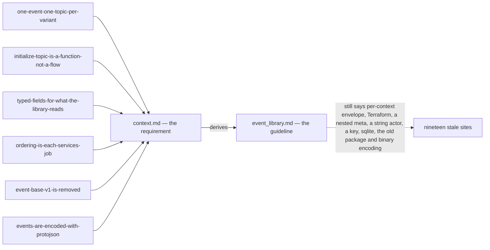

**→ Recommend:** update the guideline in one pass, keeping its CI test with one phrase changed — *"the
list the provisioning function derives"* — because derivation can still miss a context whose Go package
the calling binary never imports. It is programmer-authoritative, so this is reported, not edited: **say
the word and I will make that pass.**

## The decided envelope cannot be published by the shipped library

Re-checked against [one-event-one-topic-per-variant](./context_decision.md#one-event-one-topic-per-variant): the
shipped library can publish none of it — but the gap is now two changes, not three.

| | decided | shipped |
| --- | --- | --- |
| topic | ONE topic on the **variant** | `TopicName()` reads one `event_topic` from `event_base.v1.event_config` off the message **published** — `Event` carries no option, so every publish fails *"declares no event_topic"* ([event_source.go:55](../../../backend/pkgs/event_source/event_source.go#L55)) |
| fan-out | ✅ one publish per event | one `Publish` per call — already the same |
| metadata | `event_id`, `occurred_at`, `aggregate_id` typed on `Event` — [typed-fields-for-what-the-library-reads](./context_decision.md#typed-fields-for-what-the-library-reads) | `san_event.Event` demands `GetEventId()` + `GetOccurredAtUnix()` on the published message ([event.go](../../../backend/pkgs/san_event/event.go)) |

**→ Recommend: the library moves, in two changes.**

1. `TopicName(event)` unwraps the `oneof` and reads the SET VARIANT's option instead of the envelope's.
   Empty is an error — §5 made executable — and a descriptor test walking every variant fails it in CI
   before any runtime does. It reads `warehouse.events.v1.event_config` — `event_base.v1` is removed in the
   same change ([event-base-v1-is-removed](./context_decision.md#event-base-v1-is-removed)).
2. `san_event.Event` reads the envelope's own fields — `GetEventId()` as shipped, `occurred_at` as a
   `Timestamp`.

✅ **Dispatch has dropped off this list.** Your `EventPushHandler` takes the whole `Event` and switches on
the variant itself, so `Register[T]` keying on the decoded type
([receive.go:113](../../../backend/pkgs/san_event/receive.go)) is no longer wrong — `T` is `Event` for every
handler, by design.

⚠ A programmer's call more than yours — but until it lands, no event in the decided shape can be sent.

## The push factory takes the shipped raw type

| line | says |
| --- | --- |
| 98 | `type EventPushHandler func(ctx context.Context, event Event) error` |
| 102 | `func NewMuxPushHttpHandler(handler PushHandler) http.HandlerFunc` |
| 120 | `return san_event.NewMuxPushHttpHandler(san_event.EventPushHandler(handler))` |

`PushHandler` is not an undefined name — it is the **shipped** type,
`func(ctx context.Context, msg *PushRequest) error` ([push.go:20](../../../backend/pkgs/event_source/push.go#L20)):
the raw push body, the one that makes every consumer parse bytes, and the one
[the receive half](#the-receive-half-is-built-twice-and-wired-once) retires. Read literally, line 102
builds the new factory on the old type, and line 120 does not compile against it.

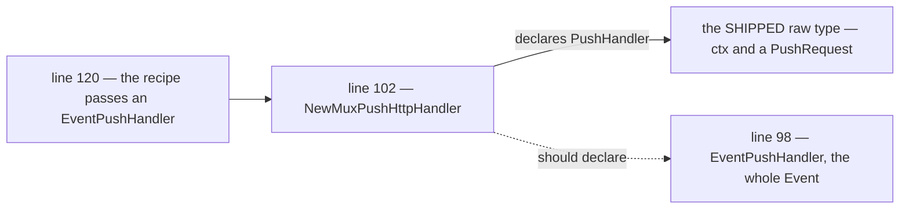

**→ Recommend:** line 102 is the wrong one — `NewMuxPushHttpHandler(handler EventPushHandler)`. Line 120
already assumes it.

## The examples still write `topics`

🆕 Narrowed by your line-46 edit — recorded as
[the-option-field-is-topic](./context_decision.md#the-option-field-is-topic). The definition moved and the
three examples did not:

| line | says | against line 46's `string topic` |
| --- | --- | --- |
| 46 — item 3 | `string topic` | ✅ the definition |
| 60 · 67 — item 4 | `topics: "order"` | a field `EventConfig` does not declare |
| 87 — item 5 | `topics: ["stock", "order"]` | the wrong name AND a list — left behind by [one-event-one-topic-per-variant](./context_decision.md#one-event-one-topic-per-variant) |

`protoc` rejects both — an option can only set a field its message declares. Line 87 is item 5's example of
*"every event message must have topic"*, so it reads as the rule itself.

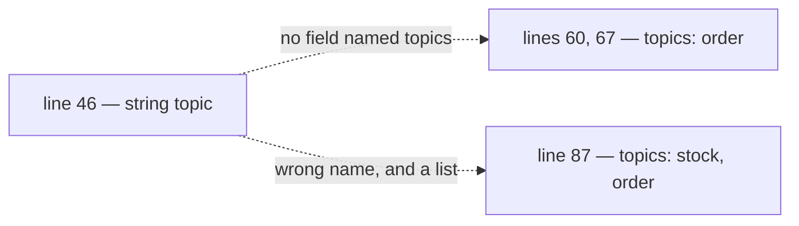

**→ Recommend:** all three become `topic: "order"`. Line 46 is the one you moved on purpose.

## A proto message written BY VALUE

🆕 **Renamed and widened — your new `identity` parameter is a third site of the same cause.** A generated proto
struct embeds `protoimpl.MessageState`, which contains a `sync.Mutex`, so passing one by value is a copied
lock. This is not a style point: **`go vet` fails, and CI runs `go vet ./...`.**

| line | says | |
| --- | --- | --- |
| 🆕 20 — the sender's new parameter | `identity role_basev1.Identity` | ⛔ by value |
| 20 — the sender's event | `event *eventsv1.Event` | ✅ fixed already — [the-sender-takes-a-pointer](./context_decision.md#the-sender-takes-a-pointer) |
| 98 — `EventPushHandler` | `event Event` | ⛔ by value |
| 129 — `EventPullHandler` | `event Event` | ⛔ by value |

Verified, not inferred — the exact signature from line 20, vetted:

```
call of send copies lock value:
  …/role_base/v1.Identity contains …/protoimpl.MessageState contains sync.Mutex
```

`san_auth.GetIdentity(ctx)` returns `*role_basev1.Identity` too, so the caller would have to dereference it to
match line 20 — which is the line `go vet` rejects. The adopter recipe
([one-adopter-checklist-for-both-drivers](./context_decision.md#one-adopter-checklist-for-both-drivers)) already writes `event *eventsv1.Event`.

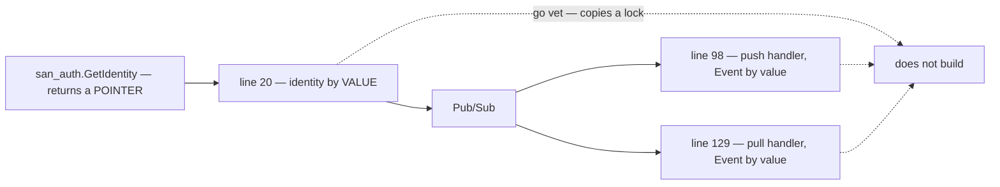

**→ Recommend:** every one of them takes a pointer — line 20's `identity *role_basev1.Identity` (which is
also what `GetIdentity` hands you, so nothing needs dereferencing), and lines 98 and 129 `event *eventsv1.Event`.

## `context.md` lags five decisions

🆕 One cause — five decisions taken on 2026-09-11 — and six places in your doc that still read as before
them. Nothing to decide; each decision holds the text to copy.

| line | says | decided |
| --- | --- | --- |
| 72–80 | `message Event { map<string, string> metadata … }` | `event_id`, `occurred_at`, `aggregate_id` typed beside the map — [typed-fields-for-what-the-library-reads](./context_decision.md#typed-fields-for-what-the-library-reads) |
| 98 · 129 | two handler types, with no rules beside them | four rules, written once above both — [one-contract-for-both-handler-types](./context_decision.md#one-contract-for-both-handler-types) |
| 109–112 | *"aliasing"* · `SettlementEventPushHandler` | a type DEFINITION, named for the service — `SettlementEventHandler` — [one-adopter-checklist-for-both-drivers](./context_decision.md#one-adopter-checklist-for-both-drivers) |
| 123 | *"register `http.HandlerFunc` hook freely"* | mounted in `register.go` at `/event/<sub_id>/push` — same decision |
| 133 | `ListenSubscriber(..., subid, handler) error` | returns only on cancel, bounded concurrency — [pull-worker-is-bounded-and-fails-loudly](./context_decision.md#pull-worker-is-bounded-and-fails-loudly) |
| 138 | *"just simple define `EventPullHandler` and use function `ListenSubscriber`"* | the same seven steps as push, the worker inside a `Run(ctx)` — [one-adopter-checklist-for-both-drivers](./context_decision.md#one-adopter-checklist-for-both-drivers) |

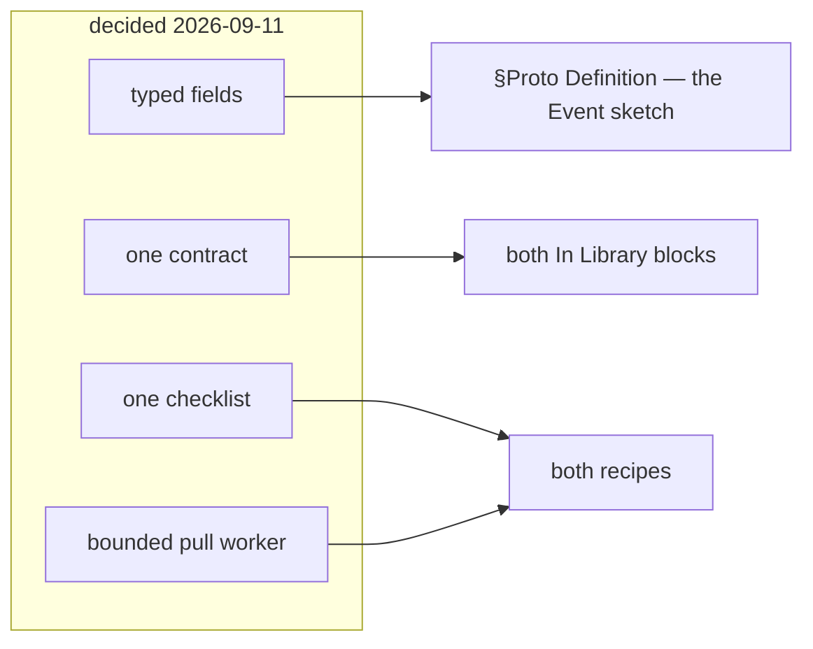

**→ Recommend:** one pass over §Proto Definition and §How Event Received. The Q11 decision needs no line —
the doc never mentioned a token.

---

## The repo has two protojson decoders that disagree

Your §How Event Encode and Decode names ONE decode — *"we just decode `*eventsv1.Event` field data with
`protojson`"*. The repo has two, and they behave differently on the same bytes.

| | [`san_event/codec.go`](../../../backend/pkgs/san_event/codec.go) | [`event_source/push.go`](../../../backend/pkgs/event_source/push.go#L27) |
| --- | --- | --- |
| options | `protojson.UnmarshalOptions{DiscardUnknown: true}` | `protojson.Unmarshal` — strict |
| an arm or field this consumer has not regenerated | dropped, and the decode SUCCEEDS | an error |
| validates after decoding | ✅ `protovalidate` | ❌ never |

`codec.go` argues its case in a comment — DiscardUnknown *"is what lets a publisher ADD a field without
breaking a consumer that has not regenerated yet"* — and for a FIELD that is right. For a `oneof` arm, which
is all the global `Event` is made of, it is not: the arm is dropped and the event arrives **with no body at
all**, valid, and ACKed with nothing written anywhere.

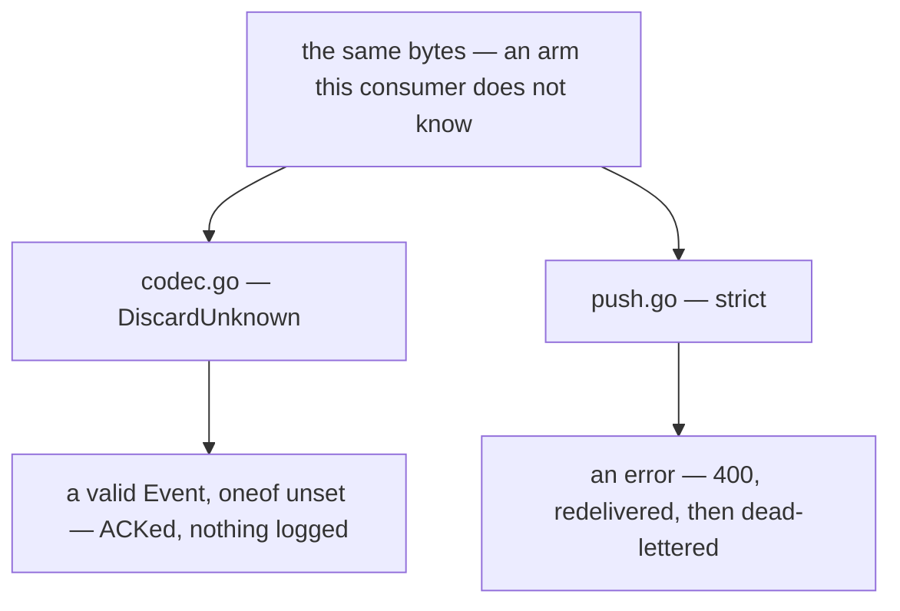

✅ **Decided — [the-library-has-one-decoder](./context_decision.md#the-library-has-one-decoder)**: one decoder in the new `san_event`,
`DiscardUnknown` then validate, and `DecodeEvent` goes. The hole that leniency opens is closed beside it by
[the-event-oneof-is-required](./context_decision.md#the-event-oneof-is-required). **The contradiction is settled by decision — what remains is the code
change**, which lands with the library move ([the receive half](#the-receive-half-is-built-twice-and-wired-once)).

# ⚠ What the removed doc held, and what must not come back with it

⛔ **`library.md` was deleted before its content was moved, so that content is still nowhere.** Recover it
with `git show d54b182:docs/technical/event/library.md` — and do not copy these across as they stand.
Landed in the authoritative doc, a stale line stops being a stale sibling and becomes the instruction.

| in the removed doc | why it must not travel | **→ Recommend** |
| --- | --- | --- |
| `extend MessageOptions { EventOption san_event = 50099; }` | `TopicName()` reads `event_config` at **50001** ([event_source.go:63](../../../backend/pkgs/event_source/event_source.go#L63)), so an event declaring only the doc's option reports **no topic** — present in the `.proto`, invisible to the code | ✅ decided — one option, in `warehouse.events.v1`: [event-base-v1-is-removed](./context_decision.md#event-base-v1-is-removed) |
| `message DataEvent { … occured_at = 1 … }` | replaced by the decided `Event` — [one-event-one-topic-per-variant](./context_decision.md#one-event-one-topic-per-variant). ⚠ `occured_at` misses an `r`, and the same doc says *"don't rename field proto"* | drop it |
| *"every service can use same interface to **send** event"*, attributed to `pkgs/san_event` | `san_event` has **no sender** — publishing is `pkgs/event_source` | ✅ settled — §General Brief places the library in `san_event`, so the shipped sender moves in. Keep what the split was for: no Pub/Sub type in anything a handler sees |
| *"supported is: Google Pub/Sub, local sqlite"* + a deferred `NewRabbitMqEventSender` | an abstraction over brokers, where §1 is a choice of one. A portable interface exposes only the **intersection**, and ordering keys, `dead_letter_policy` and `seek` are all outside it | ✅ decided — Pub/Sub in production, the emulator in dev, and RabbitMQ stays behind: [dev-runs-the-emulator](./context_decision.md#dev-runs-the-emulator) |
| one shared topic named `deadletter`, published to by hand | Pub/Sub dead-letters **per subscription** and counts attempts itself. A hand-published topic does neither, so a poison message still redelivers forever — and every context's failures pool on one topic with one policy | native `dead_letter_policy` per subscription to `<topic>.dlq`, each with a triage subscription |
| `MarkAsDeadletter(ctx, evt Event)` | its trigger is a **parsing** error, and an unparsed payload has no `Event`. And a message that decodes but can **never** succeed (`RepeatedFailure`) has nowhere to go | take the raw message — `IncomingMessage` ([receive.go:14](../../../backend/pkgs/san_event/receive.go)) carries it, keyed on the broker id because `EventID` can be empty |
| sqlite as the dev broker | reproduces neither redelivery, ack deadlines nor out-of-order delivery — tested against Pub/Sub's shape, not its semantics | ✅ decided — never built, dev runs the emulator: [dev-runs-the-emulator](./context_decision.md#dev-runs-the-emulator) |
| `## How Each Service Register Pull Event Worker Function.` — *"incomplete, still thinking"* · push is one line | both arrive unfinished | ✅ overtaken — `### Webhook` and `### Pull` are written fresh in `context.md`, recipes included. Nothing left to recover from these two |
| `NewMuxPushhandler` · an unused `topic string` in the `[ServiceName]` template · two unlabelled `alt`s | typos and diagram defects | ✅ overtaken — your doc names it `NewMuxPushHttpHandler`, and the template is replaced by the recipes |

---

# Critique

## What one global Event costs, and the cheapest answer to each

Decided — [one-event-one-topic-per-variant](./context_decision.md#one-event-one-topic-per-variant) — so not an
argument for reversing it, but what the build has to absorb. ✅ Two costs left with multi-topic: a
non-atomic fan-out, and the producer knowing its consumers.

| cost | **→ Recommend** |
| --- | --- |
| **one `oneof` number space for every context** — two people adding variants in one week collide on the numbers, in a file neither owns | a numbered block per context — settlement `100–199`, selling `200–299`, stock `300–399`. A collision becomes impossible rather than unlikely |
| **every consumer compiles against every domain**, and a topic carries variants a given consumer never handles — `order` carries both order variants to stock's consumer | a subscription filter on `event_type` per consumer, so they are not even delivered — and an unknown variant still ACKs, never NACKs ([reject-never-nacks](../../../guidelines/architectures/event_library.md#reject-never-nacks)) |
| **a second option called `event_config`** — `TopicName()` reads `event_base.v1.event_config` at 50001, and 50002 is `request_policy` | ✅ decided — the old package is removed in the same change the new option lands, so two never coexist ([event-base-v1-is-removed](./context_decision.md#event-base-v1-is-removed)) |

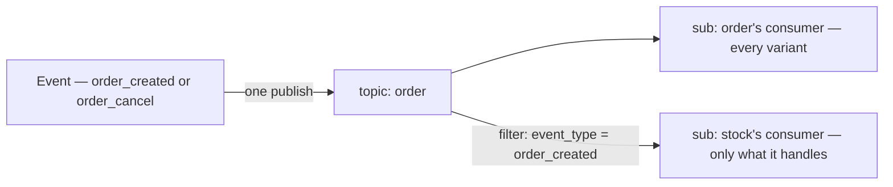

## `identity` on `Event` — who caused it, and three ways it goes wrong silently

🆕 Your line 74: `role_base.v1.Identity identity // its from rolebase`. ✅ **Reusing `Identity` is right** — it
is exactly what [`san_auth.GetIdentity(ctx)`](../../../backend/pkgs/san_auth/identity.go#L166) returns for
every authenticated request, so the publisher copies it and maps nothing. It is also the guideline's
`string actor = 5`, typed. What the line does not say:

| | what goes wrong | **→ Recommend** |
| --- | --- | --- |
| **who fills it** | 🔄 ✅ **decided, and better than what I recommended** — [identity-is-a-sender-parameter](./context_decision.md#identity-is-a-sender-parameter): an explicit parameter, which the compiler will not let a call site omit, where a `ctx` read would have been invisible in the signature. ⚠ What is left is that a caller with **no** identity still has to pass something — `GetIdentity` errors wherever the interceptor never ran | a shared `SystemIdentity()` helper named in the adopter checklist, so no call site invents its own zero value → [14b](#14b--when-ctx-has-no-identity-and-the-chain-that-breaks) |
| **what a consumer may do with it** | push routes are open ([push-routes-are-open-by-default](./context_decision.md#push-routes-are-open-by-default)), so anyone who reaches one can POST an `Event` claiming `IDENTITY_TYPE_SYSTEM` or any user id. A consumer that authorizes from it — or puts it in `ctx` with `san_auth.WithIdentity` — hands the forger an authenticated caller, and a handler called directly gets no interceptor to stop it | **a RECORD, never a CREDENTIAL.** No consumer authorizes from it, and `WithIdentity(event.identity)` is forbidden — one line added to [one-contract-for-both-handler-types](./context_decision.md#one-contract-for-both-handler-types)'s rules |
| **`expired_at`** | it is the TOKEN's expiry, stamped on a fact kept forever — a consumer that checks it rejects every replayed event as expired | **the sender clears it.** `agent` and `agent_version` stay — *"made from the scanner app, v1.4"* is real audit |

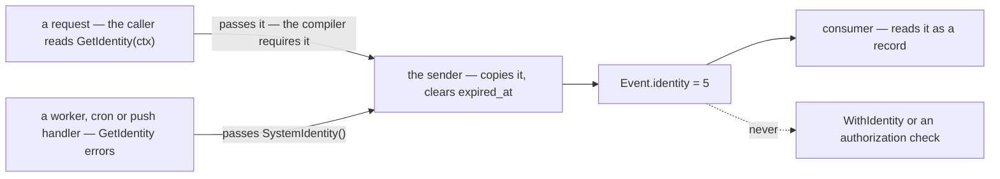

⚠ **The envelope's identity is not the payload's actor.** Settlement's variant carries `actor_id` from its
stored row ([the settlement event](../../business/settlement/analytic_context_clarify.md#proposed-design--the-settlement-event)).
The two agree when the request that wrote the row publishes it, and part when a backfill or an operator
re-publishes an old row — the envelope then names the operator, the row still names who posted.
**→ Recommend:** the payload keeps every stored column, the fact whole · the envelope says who caused THIS
publish · a consumer folding the fact reads the payload. → [Question 14](#question)

### Q14, part by part

✅ **All four decided — [identity-is-a-record-never-a-credential](./context_decision.md#identity-is-a-record-never-a-credential).** Kept for the reasoning, and because
links land here. 🆕 Elaborated on request, each part against the code. ✅ Two things are already settled and shape the rest:
the CALL SITE supplies it, having read `ctx` itself ([identity-is-a-sender-parameter](./context_decision.md#identity-is-a-sender-parameter)), and the type is the
token's own `Identity` ([event-carries-the-callers-identity](./context_decision.md#event-carries-the-callers-identity)).

#### 14a — the number, and the thing that actually matters

| | |
| --- | --- |
| the envelope's numbering | `event_id` 1 · `occurred_at` 2 · `aggregate_id` 3 · `metadata` 4 · **5–99 growth** · variants 100+ in blocks — [typed-fields-for-what-the-library-reads](./context_decision.md#typed-fields-for-what-the-library-reads) |
| so 5 is | the first free number, and the number the guideline already gave the actor (`string actor = 5`) — taking it turns that [stale site](#the-guideline-still-describes-the-shapes-this-pass-replaced) into a type change rather than a renumber |

⚠ **But under `protojson` the number is not on the wire — the NAME is** ([events-are-encoded-with-protojson](./context_decision.md#events-are-encoded-with-protojson)).
So the choice that is permanent here is the word `identity`, not the digit 5. Renaming the field later drops it
from every retained event, silently. Renumbering it would cost nothing today and everything the day the encoding
ever moves to binary.

**→ Recommend 5**, and treat `identity` as the permanent part.

#### 14b — when `ctx` has no identity, and the chain that breaks

⚠ [`GetIdentity`](../../../backend/pkgs/san_auth/identity.go#L166) **errors** — it does not return `nil` — and
the access interceptor is the only setter in the repo ([the list](#6f--which-values-ride-on-ctx)).

🔄 **And with [identity-is-a-sender-parameter](./context_decision.md#identity-is-a-sender-parameter) this is now every CALL SITE's decision, not the
library's** — so it stops being one rule and becomes a rule each adopter has to follow.

| what a caller with no identity passes | what it costs |
| --- | --- |
| the error, up | ⛔ every event published outside a request fails — the pull worker, every push handler, `tools/san`, every backfill |
| `nil` | *"nobody"* and *"this call site lost it"* are the same value, so a real bug reads as normal |
| **an `IDENTITY_TYPE_SYSTEM` identity** | a positive statement, the enum value already exists, and a publish never fails for it |

**→ Recommend the SYSTEM identity, and put it where it cannot be forgotten**: one exported helper —
`san_event.SystemIdentity(agent string)` — named in [one-adopter-checklist-for-both-drivers](./context_decision.md#one-adopter-checklist-for-both-drivers), so twelve call sites cannot
each invent their own zero value. It is a function, not policy: nothing forces a caller to use it.

Two places should say more than *"the system"*:

**`tools/san`** sets an identity on its own `ctx` before calling a handler (HARD RULE 3b: the CLI calls the
handler). `Identity` has `agent` and `agent_version` for exactly this, so an operator's action stops being
indistinguishable from a cron's.

⚠ **And the causation chain breaks at the first consumer** — which is the first real flow, not an edge:

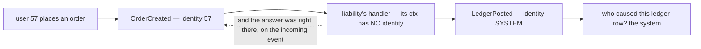

**→ Recommend one line in the adopter checklist** ([one-adopter-checklist-for-both-drivers](./context_decision.md#one-adopter-checklist-for-both-drivers)): a handler that
publishes a downstream event passes the INCOMING event's identity — `send(ctx, in.GetIdentity(), out)`. 🔄 **The
parameter makes this strictly better than it was**: under a `ctx` read the fix was an invisible
`WithIdentity` call that a reviewer had to remember to look for — now the identity is an argument, so whether
causation was propagated is visible at the call site. ⚠ It only works because of 14d: what is propagated is a
record, and nothing authorises from it.

#### 14c — `expired_at`

The token's expiry, stamped on a fact that outlives it. A consumer that checks it rejects every replayed event
as expired. **→ Recommend the sender clears it.** Everything else stays: `agent` and `agent_version` are real
audit, and `username` is deliberately a SNAPSHOT — who they were when it happened, not a lookup that changes
when they are renamed.

#### 14d — a record, never a credential

The concrete failure, not a principle: push routes are open ([push-routes-are-open-by-default](./context_decision.md#push-routes-are-open-by-default)), so anyone who can
reach `/event/<sub_id>/push` can POST an `Event` claiming any `identity_id` or `IDENTITY_TYPE_SYSTEM`. A handler
that branches on it — or calls `san_auth.WithIdentity(ctx, event.Identity)` and passes that `ctx` on — has handed
the forger an authenticated caller, and a handler called directly gets no interceptor to stop it.

✅ **Your own proto already argues it**: *"Identity is what a token carries. It carries NO role: roles are read
from the database on every request"*. It cannot authorise anything by construction — the rule just says so out loud.

**→ Recommend a fifth rule** on [one-contract-for-both-handler-types](./context_decision.md#one-contract-for-both-handler-types): *"`event.identity` is a record. No handler
authorises from it, and `WithIdentity(event.identity)` is forbidden."*

⚠ **It is also not settlement's `order_created_by_user_id`.** That column is who created the ORDER, read from a
stored row; `Event.identity` is who caused THIS publish. They agree on the first hop and part on a backfill. And
neither survives [no-archive-events-live-31-days](./context_decision.md#no-archive-events-live-31-days) — the state-row stamp is still the only protection.

## The receive half is built twice and wired once

For `## How Event Received / Subscribed.` — what its `### Webhook` and `### Pull` inherit. [`san_event`](../../../backend/pkgs/san_event/receive.go)
already has the right receive design, one inbound edge for push and pull alike: dedup claimed in the
handler's own transaction, rejections recorded before the ACK, a repeated-failure layer. **Nothing calls
it.** The only wired path is the bare `event_source.PushHandler`, which has none of that.

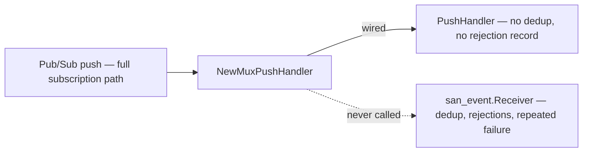

| | the defect | **→ Recommend** |
| --- | --- | --- |
| **two receive paths** | the library's receive design protects no event today, and the path that runs protects nothing | one path: a push driver and a pull worker that both build `IncomingMessage` and call `Receiver.Receive`. The bare `PushHandler` retires |
| **the subscription name** | a real push carries *"subscription": "projects/…/subscriptions/…"* — the full path. `liability_service` matches short constants, so every event falls to `default:` and is **ACKed and dropped**. `san_event`'s registry finds no handler and NACKs forever. The dev loopback passes the short name, which is why nothing has failed yet — and it is retired now that dev runs the emulator ([dev-runs-the-emulator](./context_decision.md#dev-runs-the-emulator)), so a real full path is what dev delivers | ✅ decided — the route carries the short id, `/event/<sub_id>/push` ([one-adopter-checklist-for-both-drivers](./context_decision.md#one-adopter-checklist-for-both-drivers)). Left: a test that feeds a full path |
| 🆕 **the handler took a BATCH** | `Handler[T] func(ctx, tx, events []T) error` — a slice, a generic and a `tx`, none of which line 98 has. A failing batch redelivers every message in it, including the ones that succeeded | ✅ **decided — [handlers-take-one-event-not-a-batch](./context_decision.md#handlers-take-one-event-not-a-batch)**: one event, no generic, no `tx`. The receiver keeps its own `*gorm.DB` for the rejection record, which is written before the ACK and outside any handler transaction |
| **the delivery attempt** | a push sends `deliveryAttempt` at the top level, and `PushRequest` has no field for it. Pub/Sub sets it only on a subscription with a dead-letter policy — *"If a DeadLetterPolicy is not set on the subscription, this will be 0"* — so the repeated-failure layer can never fire | the push driver reads it · the subscription function always sets the DLQ policy (✅ [setup-ensures-safe-defaults-never-deletes](./context_decision.md#setup-ensures-safe-defaults-never-deletes)) — the receiver's detector depends on it |

## `EventSender` — the doc's contract and the shipped one each get one thing right

| | `context.md` | [shipped](../../../backend/pkgs/event_source/sender.go#L19) | **→ Recommend** |
| --- | --- | --- | --- |
| context | ✅ `ctx context.Context` — your line 20, [the-sender-takes-ctx](./context_decision.md#the-sender-takes-ctx) | `ctx context.Context` | ✅ settled. Left: detach *inside* the implementation (`context.WithoutCancel` + a timeout): handed the request's `ctx`, a disconnect cancels the **wait**, not the send, and the caller logs *"not published"* for an event that was |
| returns | `error` | `(string, error)` — the broker's message id | **the doc is right.** Nothing may key on that id ([event-id-is-derived](../../../guidelines/architectures/event_library.md#event-id-is-derived)), and two of the three shipped senders already return `""` |
| takes | `Event` — the global message | `proto.Message` | **the doc is right now**: with one global `Event` the sender takes `*eventsv1.Event` itself. A request cannot compile, and no interface is needed |
| `nil` means | unstated | the broker acknowledged it | **write it in**: the broker accepted it — never *"sitting in a client buffer"*. One topic per event, so there is no partial send to define |

⚠ **And `NewEventSender(...)` returns something with no lifecycle.** The Pub/Sub client's own doc: a
`Publisher` starts goroutines that *"need to be stopped by calling t.Stop()"* — *"avoid creating many
Publisher instances"*. The shipped sender calls `client.Publisher(topic)` **per event**
([sender.go:63](../../../backend/pkgs/event_source/sender.go#L63)) and stops none. ⚠ *Corrected below*: in
v2.6.1 that is not a goroutine leak — [6d in depth](#6d--one-publisher-per-topic-and-a-cleanup). Ordering needs one long-lived publisher per topic anyway: a failed publish **pauses
its key** until `ResumePublish`, so every later event for that aggregate fails too.

⛔ **Decided the other way** — [publisher-and-client-shutdown-is-the-services](./context_decision.md#publisher-and-client-shutdown-is-the-services): `NewEventSender` returns only the
sender, and stopping publishers and closing the client are the service's.

### Proposed — the sender, for Q6

✅ **Q6 IS CLOSED — all six parts decided.** This is the resulting spec, kept because it is what `context.md`
owes a reader, not because anything is open.

| | decided | |
| --- | --- | --- |
| **6a** · the event | `*eventsv1.Event`, `ctx` first | [the-sender-takes-ctx](./context_decision.md#the-sender-takes-ctx) · [the-sender-takes-a-pointer](./context_decision.md#the-sender-takes-a-pointer) |
| **6b** · what the error means | the client's error, as it is | [sender-returns-the-client-error-as-is](./context_decision.md#sender-returns-the-client-error-as-is) |
| **6c** · whose cancel | `ctx` carries values, never the publish's cancel | [sender-ctx-carries-values-not-cancel](./context_decision.md#sender-ctx-carries-values-not-cancel) |
| **6d** · the publisher | ⛔ the service stops publishers and closes the client | [publisher-and-client-shutdown-is-the-services](./context_decision.md#publisher-and-client-shutdown-is-the-services) |
| **6e** · the encoding | ⛔ `protojson`, both ways | [events-are-encoded-with-protojson](./context_decision.md#events-are-encoded-with-protojson) |
| **6f** · what rides on `ctx` | 🔄 the identity moved OFF `ctx` and into a parameter · ⛔ ONE map, copied to the body and the attributes | [identity-is-a-sender-parameter](./context_decision.md#identity-is-a-sender-parameter) · [event-metadata-is-copied-into-the-attributes](./context_decision.md#event-metadata-is-copied-into-the-attributes) |

```go
// your line 20 — ⛔ but a POINTER: go vet refuses a proto message by value
type EventSender func(ctx context.Context, identity *role_basev1.Identity, event *eventsv1.Event) error

// your line 25 — the client handed in, only the sender back: publisher-and-client-shutdown-is-the-services
func NewEventSender(client *pubsub.Client, ...) EventSender

// the heart of it — error checks elided
// the CALLER did the GetIdentity — the sender just copies it
event.Identity = identity                                    // 🔄 a parameter now, not a ctx read

otel.GetTextMapPropagator().Inject(ctx, mapCarrier(event.Metadata))  // ⛔ 6f — ONE map
attributes := event.Metadata                                 // ⛔ 6f — the same map, both places

topic, err := san_event.TopicName(event)                     // the SET variant's topic
data, err := protojson.Marshal(event)                        // ⛔ 6e, decided
result := publisherFor(topic).Publish(ctx, &pubsub.Message{Data: data, Attributes: attributes})

waitCtx, cancel := context.WithTimeout(context.WithoutCancel(ctx), 60*time.Second) // ✅ 6c
defer cancel()

_, err = result.Get(waitCtx) // nil = the broker stored it
return err
```

**Three recommendations survive Q6's closing**, none of them a question:

| | why | **→ Recommend** |
| --- | --- | --- |
| **name the reserved keys** | one map means the caller and the library share a namespace: a producer writing `metadata["event_type"]` breaks the filter or is silently overwritten | the library names what it sets — `event_type`, `event_id`, `aggregate_id`, `traceparent` — and `context.md` says a producer must not use them |
| **mirror the caps in the proto** | the map is uncapped in the body and capped four ways in the attributes, so a legal body value loses the event to a broker error that names nothing | `buf.validate` map rules — `max_pairs: 100`, keys `max_bytes: 256`, values `max_bytes: 1024` ([the decision](./context_decision.md#event-metadata-is-copied-into-the-attributes) has the snippet). They can never reject what the broker accepted, because they ARE the broker's limits |
| **the service's shutdown** | a send still retrying when the process exits is lost with no log line. The dev binary drains for 10 s ([app.go:11](../../../backend/cmd/app_development/app.go#L11)) — the client retries for 60 | a service that wants the deploy window closed sets its grace to at least 60 s |

### Q6, part by part

✅ **Every part is decided.** The sub-headings below stay so the links to them still land.

#### 6d — one publisher per topic, and a cleanup

⛔ [publisher-and-client-shutdown-is-the-services](./context_decision.md#publisher-and-client-shutdown-is-the-services) — the library returns only the sender.
Keep the shipped per-call publisher: in v2.6.1 it is garbage once its send returns, so there is nothing to stop.

#### 6e — the encoding

⛔ [events-are-encoded-with-protojson](./context_decision.md#events-are-encoded-with-protojson) — `protojson`, both ways. ⚠ The wire identity is
the field NAME, so renaming a `oneof` arm drops the whole body to an unset oneof, silently, and CI never runs
the `buf breaking` that would catch it → [Q15](#question).

#### 6f — which values ride on `ctx`

🔄 [identity-is-a-sender-parameter](./context_decision.md#identity-is-a-sender-parameter) — the identity is a PARAMETER now, so the sender reads only
the trace from `ctx` and the CALLER calls `san_auth.GetIdentity(ctx)`. ⚠ It **errors** when nothing set it, and the
access interceptor is the only setter in the repo, so a pull worker, a push handler, `tools/san` and every backfill
must each decide what to pass → [Q14](#question) 14b.

⛔ [event-metadata-is-copied-into-the-attributes](./context_decision.md#event-metadata-is-copied-into-the-attributes) — ONE map: `Event.metadata` and the message
attributes hold the same keys after a send. Its three costs are recorded there, and the first is the one to
write into `context.md`: **the caller and the library now share a key namespace.**

### Q15, part by part

✅ **All three decided**, the last as [ci-runs-on-dev-and-checks-breaking](./context_decision.md#ci-runs-on-dev-and-checks-breaking) and **applied** to
[ci.yml](../../../.github/workflows/ci.yml). Kept for the reasoning, and because links land here. 🆕 Everything
below was verified by running it, not inferred.

**They are not three independent guards — 15a is what makes 15b's leniency safe:**

| what a producer does | `DiscardUnknown` ALONE | with 15a as well |
| --- | --- | --- |
| ADDS a field | dropped, the decode succeeds — ✅ exactly the point of it | unchanged ✅ |
| adds a VARIANT, or renames one | the arm is dropped → a valid `Event` with no body → **silently ACKed** | ✅ decided — validation fails, recorded and ACKed with a row a human can read: [the-event-oneof-is-required](./context_decision.md#the-event-oneof-is-required) |

#### 15a — require the `oneof`

✅ **Decided** — [the-event-oneof-is-required](./context_decision.md#the-event-oneof-is-required). One line in the proto, firing at both ends: the
sender validates before it marshals, and `codec.go` validates on every decode, so the failure is recorded and
ACKed with a row a human can read. The heading keeps its name so links to it hold.

⚠ **One thing it makes load-bearing, and it is not reversible.** 15a's only cost — a rejection recorded on every
consumer that has not regenerated, for every instance of a new variant on a shared topic — is removed entirely by
the `event_type` filter. But a subscription's `filter` is **immutable**, and
[setup-ensures-safe-defaults-never-deletes](./context_decision.md#setup-ensures-safe-defaults-never-deletes) **refuses** to change one rather than deleting and
recreating. Get it wrong at creation and the only repair is by hand.

**→ Recommend** the filter becomes a REQUIRED step of [one-adopter-checklist-for-both-drivers](./context_decision.md#one-adopter-checklist-for-both-drivers), not an
optional field on the declaration.

#### 15b — one decoder

✅ **Decided** — [the-library-has-one-decoder](./context_decision.md#the-library-has-one-decoder): one decoder in the new `san_event`, `DiscardUnknown`
then validate, and `event_source`'s `DecodeEvent` goes. It can go because the envelope makes it unnecessary —
your line 98 hands the handler a whole decoded `Event`. The heading keeps its name so links to it hold.

⚠ Strict decoding was the alternative and it is worse: it turns a field a producer merely **ADDED** into a 400, a
redelivery and a dead-letter — punishing consumers for a change meant to be compatible. What makes the lenient
choice safe is [the-event-oneof-is-required](./context_decision.md#the-event-oneof-is-required), decided beside it.

#### 15c — `buf breaking` in CI, and why

🆕 **Answering *"why breaking?"*** — because it is the only check in the pipeline that compares the proto to its
**previous self**. Everything else compares it to the code beside it, and a rename moves both in step.

| the check | on a renamed field | what it actually compares |
| --- | --- | --- |
| `buf lint` | ✅ passes | the proto against a style guide |
| `buf generate` drift | ✅ passes | the proto against the generated code — both moved together |
| `go build` | ⛔ fails, and then you fix it | your Go against the new generated names. **This is the trap**: renaming the field and updating the Go in one commit is the natural thing to do, and it goes green |
| `go test` | ✅ passes | behaviour, on freshly built messages |
| **`buf breaking`** | ⛔ **fails, and names it** | **the proto against the proto that was there yesterday** |

The compiler tells you the name changed **in your code**. Nothing tells you it changed **on the wire**, where 31
days of messages still carry the old one — and under
[events-are-encoded-with-protojson](./context_decision.md#events-are-encoded-with-protojson) the wire identity IS the name. `buf breaking` is
the only voice in the build that speaks about the wire, and it says the exact thing:

```
Field "98" with name "evt_id" on message "OrderPlacedEvent"
  changed option "json_name" from "eventId" to "evtId".
```

**→ Recommend it. ✅ The timing objection I raised is answered** — [breaking-the-old-protos-is-accepted](./context_decision.md#breaking-the-old-protos-is-accepted):
breaking the old shape is accepted, so the one failure below is expected rather than a problem to solve. What
falls out is a commit ORDER, not a policy: **land the removal first, then add the CI step**, and the baseline is
clean from that point with nothing ever overridden.

Verified — [event-base-v1-is-removed](./context_decision.md#event-base-v1-is-removed) deletes `warehouse/event_base/v1/event.proto`, and
`buf breaking` says so —

```
Previously present file "warehouse/event_base/v1/event.proto" was deleted.
```

✅ Expected, and accepted. A check that is routinely overridden teaches people to override it — which is exactly
why the ORDER matters and a waiver does not: after the removal lands there is nothing left to override.

⛔ **And separately, CI never runs on `dev`.** Verified in [ci.yml](../../../.github/workflows/ci.yml): the
triggers are `push: branches: [main]` and `pull_request:`, and work goes straight to `dev` with no PR (CLAUDE.md,
Git workflow). **Every check** fires at the merge to `main` and not before.

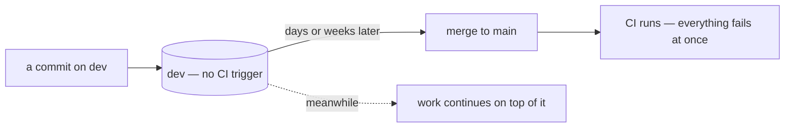

**→ Recommend adding `dev` to the push triggers**, independently of `buf breaking` — it is worth more on its own:
`go vet` would catch line 20's by-value `identity` ([contradiction](#a-proto-message-written-by-value)) on the commit
that introduces it rather than at a merge.

##### 🆕 What the change actually is — two lines, two very different costs

The workflow has **two jobs**, and they run in parallel (neither `needs:` the other), so adding `dev` turns both on
for every commit to the branch you push to constantly:

| job | runs | cost |
| --- | --- | --- |
| `build` | `buf lint` · the generate-drift check · `go build + vet` · frontend typecheck + build | cheap — no services, no browsers |
| `test` | Postgres + Redis containers · `go test` · a Playwright browser download · the story suite · e2e | expensive, per commit |

**→ Recommend scoping it** — `dev` in the triggers, and one `if:` keeping the expensive half on `main` and PRs:

```yaml
on:
  push:
    branches: [main, dev]
  pull_request:

jobs:
  test:
    if: github.ref == 'refs/heads/main' || github.event_name == 'pull_request'
```

✅ **It starts green.** Verified just now: `go build ./...`, `go vet ./...` and `buf lint` all pass on `dev` today.

##### 🆕 The baseline — 🔄 revising what I suggested

I suggested `--against '.git#branch=main'`. **Run against this repo it is already RED, and nothing to do with
events:**

```
team.proto:304: Field "1" on message "TeamListRequest" changed name from "q" to "filter".
team.proto:305: ... changed option "json_name" from "teamType" to "sort".
```

That is the RPC guideline migration, already on `dev` and not yet on `main`. **A `main` baseline is red for the
whole gap between a change landing and a promotion — which on this workflow is the normal state.**

| baseline | today | red when |
| --- | --- | --- |
| `.git#branch=main` | ⛔ already red | from a change landing on `dev` until the next promotion |
| **`.git#ref=HEAD~1`** | ✅ **clean** | exactly the commit that breaks something, and green on the next |

`HEAD~1` is the right shape: a per-commit tripwire, which is precisely the question *"did I just rename
something on the wire?"*. ⚠ It also **softens the ordering recommendation above** — a deliberate break trips one
commit and clears, so the removal no longer has to land before the step.

⚠ **Two mechanical details, or it will not run at all:**

| | |
| --- | --- |
| it runs from the **repo root** | not `working-directory: proto` like `buf lint` does — `.git` resolves against the working directory, and `proto/.git` does not exist. Verified: it fails with *"does not appear to be a git repository"* |
| the checkout must be **`fetch-depth: 2`** | `actions/checkout@v4` clones shallow, so `HEAD~1` is not there |

```yaml
- name: buf breaking
  run: buf breaking proto --against '.git#ref=HEAD~1,subdir=proto'
```

## Five consequences of *"We use Google Pub/Sub"* the doc does not state

Each is decided *by* choosing Pub/Sub whether or not it is written down.

| what Pub/Sub does | why it belongs in this doc | **→ Recommend** |
| --- | --- | --- |
| **retention caps at 31 days** | Pub/Sub **cannot be your log of record** — there is no replay from the beginning | ✅ accepted, and no archive: [no-archive-events-live-31-days](./context_decision.md#no-archive-events-live-31-days). What follows is a rule — an event carries nothing its producer cannot re-derive |
| **ordering is opt-in at both ends** | the subscription flag is fixed at creation, and works only if the publisher set `OrderingKey` all along | ✅ decided — no key for now, [ordering-is-each-services-job](./context_decision.md#ordering-is-each-services-job). ⚠ What stays true: a key added later orders only what is published after it |
| **a message that can never succeed redelivers forever** | with no key there is no head-of-line blocking — but a poison message still comes back on every retry, with no end | the DLQ is what ends it. Mandatory per subscription |
| **push vs pull is a deployment decision** | the doc now ships both, so each consumer makes it: push needs a public HTTPS endpoint and has no flow control, pull a long-lived process | say in each sub-section which kind of consumer it suits. 🆕 One line follows from [push-routes-are-open-by-default](./context_decision.md#push-routes-are-open-by-default): a consumer whose handler writes a source of truth uses **pull**, which has no inbound route to forge |
| **1 KB minimum billed per message** | thin events save far less than expected | shrink events for coupling, never for cost |

---

# Proposed Design

The envelope and its routing are **decided** — [one-event-one-topic-per-variant](./context_decision.md#one-event-one-topic-per-variant).
Below is the rest of what `context.md` owes a reader, built on it.

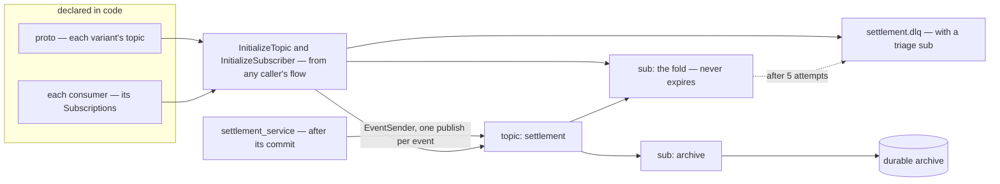

| decision | value |
| --- | --- |
| envelope | `warehouse.events.v1.Event` — one `oneof`, every variant naming its ONE topic ([one-event-one-topic-per-variant](./context_decision.md#one-event-one-topic-per-variant)) |
| topic option | ✅ `warehouse.events.v1.event_config`, one `string topic` ([the-option-field-is-topic](./context_decision.md#the-option-field-is-topic)) · `event_base.v1` removed in the same change that moves selling's two events and `TopicName()` — [event-base-v1-is-removed](./context_decision.md#event-base-v1-is-removed) |
| identity | ✅ `role_base.v1.Identity identity = 5` — your line 74 · a SENDER PARAMETER supplied by the call site ([identity-is-a-sender-parameter](./context_decision.md#identity-is-a-sender-parameter)), ⛔ **as a pointer**: the value form fails `go vet` ([contradiction](#a-proto-message-written-by-value)) · `SystemIdentity(agent)` when a caller has none · `expired_at` cleared · a record, never a credential — [identity-is-a-record-never-a-credential](./context_decision.md#identity-is-a-record-never-a-credential) |
| metadata | ✅ `event_id` 1 · `occurred_at` 2 · `aggregate_id` 3 typed, your `metadata` map 4, `5–99` growth — [typed-fields-for-what-the-library-reads](./context_decision.md#typed-fields-for-what-the-library-reads). ⛔ The map is ONE map, copied to the attributes — [event-metadata-is-copied-into-the-attributes](./context_decision.md#event-metadata-is-copied-into-the-attributes) · **→ Recommend** `buf.validate` mirrors Pub/Sub's caps on it |
| the envelope's `oneof` | ✅ **required** — `option (buf.validate.oneof).required = true`: an `Event` with no variant set is refused at publish and recorded at consume, never silently accepted — [the-event-oneof-is-required](./context_decision.md#the-event-oneof-is-required) |
| encoding | ⛔ `protojson`, both ways — [events-are-encoded-with-protojson](./context_decision.md#events-are-encoded-with-protojson). ⚠ The wire identity is the field NAME: rename a `oneof` arm and the whole body is gone, silently → [Q15](#question) |
| numbering | variants in a **block per context** — settlement `100–199`, selling `200–299`, stock `300–399` |
| broker | ✅ Google Pub/Sub in production, the emulator in dev, no second broker and no loopback — [dev-runs-the-emulator](./context_decision.md#dev-runs-the-emulator) |
| library | `backend/pkgs/san_event` — ✅ your §General Brief. Sends, receives, dedups and provisions; the shipped sender moves in from `event_source` |
| handler contract | ✅ `func(ctx context.Context, event *eventsv1.Event) error` — your line 98, one event and no `tx`: [handlers-take-one-event-not-a-batch](./context_decision.md#handlers-take-one-event-not-a-batch) · ✅ five rules, written once above both handler types — [one-contract-for-both-handler-types](./context_decision.md#one-contract-for-both-handler-types) |
| adopting service | ✅ seven steps, whichever driver — [one-adopter-checklist-for-both-drivers](./context_decision.md#one-adopter-checklist-for-both-drivers) |
| push route | ✅ `/event/<sub_id>/push` in the service's `register.go`, open — [push-routes-are-open-by-default](./context_decision.md#push-routes-are-open-by-default). A consumer that writes a source of truth uses pull |
| pull worker | ✅ the service's `Run(ctx)` · returns only when cancelled · concurrency sized to the pool — [pull-worker-is-bounded-and-fails-loudly](./context_decision.md#pull-worker-is-bounded-and-fails-loudly) |
| sender contract | ✅ `func(ctx, *eventsv1.Event) error`, built by `NewEventSender(client, ...) EventSender` · the client's error as is · waits on a detached `ctx` · the service stops publishers and closes the client — [publisher-and-client-shutdown-is-the-services](./context_decision.md#publisher-and-client-shutdown-is-the-services) · ⛔ `protojson` — [events-are-encoded-with-protojson](./context_decision.md#events-are-encoded-with-protojson) · what rides on `ctx` → [Q6](#question) |
| durability | ✅ no outbox — the producer publishes after its commit, the client retries up to 60 s, and delivery from there is Pub/Sub's — [no-outbox-the-publish-is-trusted](./context_decision.md#no-outbox-the-publish-is-trusted) |
| provisioning | ✅ `InitializeTopic`, `InitializeSubscriber` and `Redrive` — a developer's tool ([setup-functions-are-a-developer-tool](./context_decision.md#setup-functions-are-a-developer-tool)) that ensures: create, update, refuse, never delete — [setup-ensures-safe-defaults-never-deletes](./context_decision.md#setup-ensures-safe-defaults-never-deletes). Topics from the proto, subscriptions from each consumer's declaration. → Recommend it runs as `go run ./tools/san pubsub ensure` |
| every topic | ✅ retention **31 days**, set at creation and billed as storage — the reach [the-replay-reaches-31-days-and-that-is-accepted](../../business/settlement/context_decision.md#the-replay-reaches-31-days-and-that-is-accepted) already assumes, and it lets a subscription made later seek back too |
| every subscription | ✅ ordering on · `expiration_policy` with no `ttl` · `dead_letter_policy` to `<topic>.dlq`, 5 attempts, its grants with it · retry backoff 10 s → 600 s · push deadline 60 s — [setup-ensures-safe-defaults-never-deletes](./context_decision.md#setup-ensures-safe-defaults-never-deletes) · ⚠ **a filter on `event_type` — now REQUIRED, not optional** ([the-event-oneof-is-required](./context_decision.md#the-event-oneof-is-required) makes it what stops rejection noise, and a filter is immutable so it cannot be added later), from the guideline's [portable subset](../../../guidelines/architectures/event_library.md#filter-subset-portable) |
| ordering key | ✅ none, for now — [ordering-is-each-services-job](./context_decision.md#ordering-is-each-services-job). Every consumer tolerates any arrival order |
| attributes | ⛔ **the same map as `Event.metadata`**, copied — [event-metadata-is-copied-into-the-attributes](./context_decision.md#event-metadata-is-copied-into-the-attributes), against my recommendation of two. The sender adds `event_type` and the trace to it. ⚠ Its four caps are the broker's: 100 keys · a 256-byte key not starting with `goog` · a 1024-byte value. **→ Recommend** the library NAMES the keys it sets, and `context.md` says a producer must not use them |
| dedup key | `event_id`, derived from the causing row — **the same on every topic's copy**. **Never** the transport's `message_id`: a publisher retry mints a new one for the same fact |
| DLQ | ✅ one per source topic, each with a triage subscription that never expires, and `Redrive` to bring its messages back — [setup-ensures-safe-defaults-never-deletes](./context_decision.md#setup-ensures-safe-defaults-never-deletes) |
| archive | ✅ none — an event lives 31 days and is gone: [no-archive-events-live-31-days](./context_decision.md#no-archive-events-live-31-days). ⚠ So an event must carry nothing its producer cannot re-derive |
| environments | **separate GCP projects**, not name prefixes — the boundary should be IAM, not a string convention |

⚠ **Exactly-once delivery does not remove the dedup table.** It is pull-only and covers redelivery, not
publish retries — the same fact published twice is two messages with two `message_id`s. The inbox stays.

## Four rules that belong HERE, not in each context's doc

[one-event-one-topic-per-variant](./context_decision.md#one-event-one-topic-per-variant) settled the *shape* of the envelope.
These four decide what goes **in** it, and each is the kind of choice a context will get wrong in
isolation and cannot cheaply reverse.

| rule | why it is architectural, not local |
| --- | --- |
| **A `oneof` variant is a different KIND OF FACT — never an enum value** | if a payload differs only by a field, it is one variant with that field. Splitting an existing enum into variants turns *"add a value"* into *"add a variant plus a handler arm"*, in every consumer, forever — and each context will make that call differently unless the rule is written once |
| **Every consumer tolerates any arrival order** | decided — [ordering-is-each-services-job](./context_decision.md#ordering-is-each-services-job). Nothing orders delivery, so a handler that assumes placed-before-cancelled is wrong on the first retry that lands late — and nothing fails, it just writes the wrong thing. How is each service's call: a fold that sums the same in any order, or a later state recorded so an earlier event checks for it. Worth one line in `context.md`, beside the handler rules |
| **`event_id` is derived from the causing row — never the transport's message id** | the guideline requires it (`event-id-is-derived`) and the reason is a **money bug, not tidiness**. A publish is **retried** — by the client itself, for up to 60 s ([no-outbox-the-publish-is-trusted](./context_decision.md#no-outbox-the-publish-is-trusted)) — and a retry can mint a **new** broker message id for the same fact. A consumer deduplicating on that id sees something new and folds the same row **twice**. A derived id collides, which is the entire point of dedup |
| **An event carries the fact WHOLE, never a pointer to it** | a thin event forces the consumer to read the producer's table back, so a **replay folds current state instead of the historical fact** — the one thing a rebuild must not do. It also re-couples the consumer to tables it does not own, across a HARD RULE 3 boundary. ⚠ And it saves nothing: Pub/Sub bills a **1 KB minimum per delivery**, so most events are free to be fat |

### And one rule for every PRODUCER

🆕 Left over from 6b — [sender-returns-the-client-error-as-is](./context_decision.md#sender-returns-the-client-error-as-is) hands the error to the caller unchanged, so what the
caller does with it is the adopter's to get right. Each is already true of
[order_place.go](../../../backend/services/selling_service/selling_v1/order_place.go#L312):

| rule | why |
| --- | --- |
| **after the commit, a send error never becomes the RPC's error** | the row exists. Answer *"failed"* and the person at the shelf taps again — a second order, a second stock movement |
| **log it once, with the `event_id` — never retry in a loop** | the client already retried for 60 s, and the error no longer names the event — the log line must |
| **the repair is a backfill from the row** | the `event_id` is derived from the row, so a re-publish collides in every consumer's `Claim` |

**→ Recommend:** one line in `context.md`, beside the sender contract — *"a send error after the commit is
logged with its `event_id` and never fails the request"*.

⚠ **A stored date travels as a stored date.** Where a fact is bucketed by a `DATE` column, the event
carries that column, not a timestamp for the consumer to re-derive — a re-derivation is a second
timezone decision, made by whoever wrote the consumer.

### ⚠ The architecture has no position on a service consuming its OWN events

The first real consumer of the first real topic is the service that publishes it — about to become the
template, so this doc should have an opinion on it.

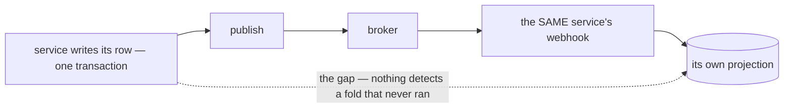

The decoupling is real and a replay genuinely needs the broker. The cost is that the commit-to-publish gap
now sits **between a row and its own report**, inside one service.

**→ Recommend the doc state that an event is a DOORBELL, not a delivery** — a self-consuming service folds
in-process on the fast path, keeps the broker path for convergence and replay, and the dedup claim lets
the two overlap: whichever arrives first wins, the other acks as a duplicate. **That makes the broker
optional to correctness rather than load-bearing** — losing an event then costs a delay, not a
permanently wrong number. ⚠ Under [no-outbox-the-publish-is-trusted](./context_decision.md#no-outbox-the-publish-is-trusted)
it is the only thing between a publish that never happened and a report that stays short.

> ➡ **Settlement's own event — its payload, its variant — is specified in
> [`analytic_context_clarify.md`](../../business/settlement/analytic_context_clarify.md#proposed-design--the-settlement-event),
> not here**, re-shaped for [one-event-one-topic-per-variant](./context_decision.md#one-event-one-topic-per-variant).
> `analytic_context.md` §Events is the doc that can answer what a settlement event carries (RULE 7b).
> This doc supplies the rules it is built from.

---

# Question

✅ **None open.** Every question this doc raised is decided — the numbers are kept so every link to them still
lands, and each points at its decision. ⛔ **What still blocks the first event is not a question but a
[contradiction](#contradiction)**: the shipped library cannot publish the decided envelope, and `context.md`
lags its own decisions. Both are listed there, with what each needs.

Each was phrased so that **"yes" accepts the recommendation**. Closed: ✅ Q1 in the doc itself — push AND pull · ✅ Q2 and Q7–Q13 decided on 2026-09-11 —
[the banner](#clarity--contextmd) lists them.

✅ Q2 → [no-outbox-the-publish-is-trusted](./context_decision.md#no-outbox-the-publish-is-trusted)

✅ Q3 → [dev-runs-the-emulator](./context_decision.md#dev-runs-the-emulator)

✅ Q4 → [no-archive-events-live-31-days](./context_decision.md#no-archive-events-live-31-days)

✅ Q5 → [setup-ensures-safe-defaults-never-deletes](./context_decision.md#setup-ensures-safe-defaults-never-deletes)

✅ Q6 → six parts, all decided — [the-sender-takes-ctx](./context_decision.md#the-sender-takes-ctx) ·
[the-sender-takes-a-pointer](./context_decision.md#the-sender-takes-a-pointer) ·
[sender-returns-the-client-error-as-is](./context_decision.md#sender-returns-the-client-error-as-is) ·
[sender-ctx-carries-values-not-cancel](./context_decision.md#sender-ctx-carries-values-not-cancel) ·
[publisher-and-client-shutdown-is-the-services](./context_decision.md#publisher-and-client-shutdown-is-the-services) ·
[events-are-encoded-with-protojson](./context_decision.md#events-are-encoded-with-protojson) ·
[identity-is-a-sender-parameter](./context_decision.md#identity-is-a-sender-parameter) · [event-metadata-is-copied-into-the-attributes](./context_decision.md#event-metadata-is-copied-into-the-attributes).
🔄 6f was answered twice — [superseded-the-sender-reads-identity-from-ctx](./context_decision.md#superseded-the-sender-reads-identity-from-ctx) then reversed by the parameter. The resulting spec is [here](#proposed--the-sender-for-q6).

✅ Q7 → [typed-fields-for-what-the-library-reads](./context_decision.md#typed-fields-for-what-the-library-reads) ·
✅ Q8 → [ordering-is-each-services-job](./context_decision.md#ordering-is-each-services-job) ·
✅ Q9 → [event-base-v1-is-removed](./context_decision.md#event-base-v1-is-removed)

✅ Q14 → all four parts — [identity-is-a-record-never-a-credential](./context_decision.md#identity-is-a-record-never-a-credential): at 5 (and under `protojson` the NAME is the
permanent part) · `SystemIdentity(agent)` when a caller has none · the sender clears `expired_at` · a record, never a
credential. Its [part-by-part working](#q14-part-by-part) stays for the reasoning.

✅ Q15 → all three parts — [the-event-oneof-is-required](./context_decision.md#the-event-oneof-is-required) ·
[the-library-has-one-decoder](./context_decision.md#the-library-has-one-decoder) · [ci-runs-on-dev-and-checks-breaking](./context_decision.md#ci-runs-on-dev-and-checks-breaking),
**applied** to [ci.yml](../../../.github/workflows/ci.yml). Its [part-by-part working](#q15-part-by-part) stays for the
reasoning — including why the baseline is `HEAD~1` and not `main`.

---

# Awaiting

- ➡ **`Event` passed BY VALUE** — ✅ fixed on line 20, still on lines 98 and 129 ([contradiction](#a-proto-message-written-by-value)) ·
  ✅ **the encoding** — decided, [events-are-encoded-with-protojson](./context_decision.md#events-are-encoded-with-protojson).
- ⚠ `### Pull (Google PubSub Push Subscriber)` — *Push*, presumably meant as *Pull*.
- **Still unwritten**: environments, who publishes what. ✅ Subscription settings, retention and the DLQ are
  decided — [setup-ensures-safe-defaults-never-deletes](./context_decision.md#setup-ensures-safe-defaults-never-deletes) — and worth a line in your doc.
- **§2 names one user, *"settlement service"*,** and omits the two that exist: `selling_service` is the
  only live producer and `liability_service` the only live consumer. I would move them first, because they prove
  the library before settlement depends on it. ⛔ **My dual-publishing recommendation is WITHDRAWN** — [breaking-the-old-protos-is-accepted](./context_decision.md#breaking-the-old-protos-is-accepted).
  **→ Recommend instead a consumer-first cutover**, which costs less than the bridge it replaces: liability reads
  BOTH old and new for one deploy, then the producer switches, then the old subscriptions are deleted once empty.
  No shim, and no window of orphaned messages.
- **The proto sketch has no field numbers.** The variants' are what the block-per-context proposal is for
  ([costs](#what-one-global-event-costs-and-the-cheapest-answer-to-each)). The extension's: 50001 frees up when
  `event_base.v1` goes, and I would reuse it ([event-base-v1-is-removed](./context_decision.md#event-base-v1-is-removed)).
- **`Goole` → `Google`** in §1, **`Responsbility`** in its heading, and **`impelemented`** in both recipe
  headings.
- **The header names a second proposal.** If it comes, the [Proposed Design](#proposed-design) table is the
  surface to compare on — an alternative that says which rows it changes can be decided row by row.
- **Two guidelines cited by shipped code do not exist** — and `codec.go` cites a *"No format tag"* section
  `event_library.md` does not have: `san_event/event.go` cites
  `guidelines/event-guideline.md` and `guidelines/architectures/data_pipeline.md`, and warns against a
  `disscuss/` folder that is gone. Only `architectures/event_library.md` is there.
