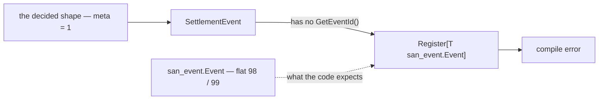
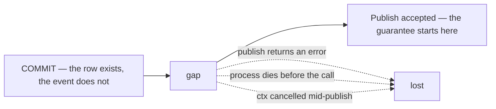
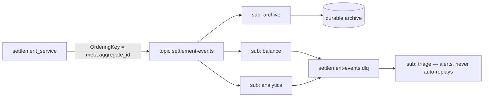
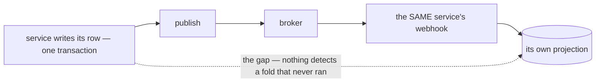

# Clarity — `context.md`

Critique, questions and warnings about [context.md](./context.md). That doc is yours; this one is
mine. Answered points are **deleted**, so this is always the current open set.

> ✅ **Two decisions this round.**
> [no-global-event-envelope](./context_decision.md#no-global-event-envelope) — one envelope per
> context, no shared `warehouse.events.v1`.
> [the-library-doc-is-absorbed](./context_decision.md#the-library-doc-is-absorbed) — `event/library.md`
> is removed and its content moves here. ✅ **The removal is done**: that file and its clarify are
> deleted and `docs/technical/event/` is gone.
>
> ⛔ **Neither unblocked the first event.** The contradiction below is what does.
>
> ⛔ **And the delete ran BEFORE the merge**, so what that doc described is in git and nowhere else —
> see [what the removed doc held](#-what-the-removed-doc-held-and-what-must-not-come-back-with-it).
>
> ➡ **`library_clarify.md` was folded into this file** before it was deleted. Its live points are
> below, rewritten against `context.md`, because it is now the doc that can answer them (RULE 7b).
> Nothing there was answered — only re-routed.

---

# Contradiction

## The decided envelope cannot be published by the shipped library

The shape settled by [no-global-event-envelope](./context_decision.md#no-global-event-envelope)
comes from [`event_library.md`](../../../guidelines/architectures/event_library.md), and **it does
not compile against the code that would publish it**:

| | the guideline | shipped code |
| --- | --- | --- |
| metadata | `EventMetadata meta = 1` (`event_id`, `occurred_at`, `aggregate_id`) | `san_event.Event` demands flat `GetEventId()` + `GetOccurredAtUnix()` ([event.go:33](../../../backend/pkgs/san_event/event.go)) |
| ordering | `event_config.ordering_key_field = 2` | `MessageEventConfig` has **only** `event_topic` ([event.proto](../../../proto/warehouse/event_base/v1/event.proto)) |

`EventMetadata` does not exist in `proto/` at all. A `SettlementEvent` written to the decided shape
fails `Register[T Event]` at **compile time**, and the guideline's own snippet does not compile
against the shipped option either.



**→ Recommend: the guideline wins and the code moves.** `meta` is the better shape — one metadata
block, and `aggregate_id` present, which flat 98/99 has nowhere to put and which the ordering key
reads. Three changes, all in one place:

1. `EventMetadata` lands in `proto/warehouse/event_base/v1/metadata.proto`.
2. `MessageEventConfig` gains `ordering_key_field = 2`.
3. `san_event.Event` becomes `GetMeta() *EventMetadata` instead of the two flat getters.

A one-package change today, a rewrite of every event later. ⚠ A programmer decision rather than
yours — but it blocks settlement, so it belongs in view.

## An envelope per context makes `Register[T]` dispatch on the wrong thing

`Register[T Event]` and `Handler[T Event]` dispatch by **concrete decoded type**
([receive.go:113](../../../backend/pkgs/san_event/receive.go)). With an envelope per context the wire
type is always `SettlementEvent`, never `SettlementPostedEvent` — so every handler registers for the
envelope and switches on the `oneof` itself, losing exactly the type safety the generics exist for.

⚠ This was a trade-off before [no-global-event-envelope](./context_decision.md#no-global-event-envelope);
it is now unavoidable, and it is **library work that does not exist yet**.

**→ Recommend: the library unwraps the `oneof` and dispatches on the set field.** It keeps
`Register[SettlementPostedEvent](…)` working and confines the envelope to the wire, which is what an
envelope is for. ⚠ The `meta` decision above interacts: after unwrapping, the handler needs the
envelope's `meta` alongside the variant, so the signature becomes
`func(ctx, tx, meta, []T)` — settle the two together or the library is rewritten twice.

## The broker is decided twice, and the two decisions are not the same decision

| doc | says |
| --- | --- |
| the removed `library.md` §3 | *"Message Broker are supported is: Google Pub/Sub, local sqlite"* — plus a deferred `NewRabbitMqEventSender` |
| `context.md` §1 | *"We use Google Pub/Sub"* |

One reads as **an abstraction over brokers**, the other as **a choice of broker**. The cost of the
abstraction is not the interface — a portable API can only expose the **intersection**, and the
intersection is where everything valuable lives: ordering keys, dead-letter policy, seek, filters,
ack-deadline extension. All of them are Pub/Sub-only.

⚠ [no-global-event-envelope](./context_decision.md#no-global-event-envelope) sharpens this: it made
the **topic** the boundary for retention, dead-lettering and ordering — three features a portable
interface cannot expose.

**→ Recommend: the merge is the moment to resolve it.** Write *"Pub/Sub is the only production
broker — sqlite is a development fake, not a supported broker"*, and leave the RabbitMQ constructor
behind rather than carrying it across.

---

# ⚠ What the removed doc held, and what must not come back with it

⛔ **`library.md` was deleted before its content was moved, so that content is currently nowhere.**
The push and pull flows, the `EventSender` interface, the dead-letter design and the per-service
registration rules are not in `context.md` yet. Recover them with:

```sh
git show d54b182:docs/technical/event/library.md
```

The merge is then a copy — and **three things in that file are wrong today**. Copied into the
authoritative doc, they stop being a stale sibling and become the instruction.

| in the removed doc | why it must not travel |
| --- | --- |
| `extend MessageOptions { EventOption san_event = 50099; }` | **the shipped reader will not see it.** `TopicName()` reads `event_config` at **50001** ([event_source.go:63](../../../backend/pkgs/event_source/event_source.go)), so an event declaring only `(san_event).topic` has `HasExtension` return false and reports **no topic** — present in the `.proto`, invisible to the code. The failure CLAUDE.md already names: *it reads as a logic bug, it is a linking bug*. **→ Use `event_config` at 50001**, as the guideline's `reuse-event-config-50001` already requires |
| `message DataEvent { … occured_at = 1 … }` | superseded by [no-global-event-envelope](./context_decision.md#no-global-event-envelope) — the envelope is `<Context>Event` with `meta = 1` and variants from 100. ⚠ `occured_at` is also missing an `r`, and the same doc says *"don't rename field proto"*, so the typo becomes permanent the moment an event ships |
| *"every service can use same interface to **send** event"* attributed to `pkgs/san_event` | `san_event` has **no sender**. Publishing lives in `pkgs/event_source`, which is also what the push-webhook template imports. **→ Say which package owns sending**, or describe both — the split is deliberate (a service handler never sees a Pub/Sub type) and the doc should state it rather than blur it |

---

# Critique

## One line, seven consequences — and a doc that states none of them

Each is decided *by* choosing Pub/Sub whether or not it is written down. Undocumented, each becomes
a surprise at a worse moment.

| what Pub/Sub does | why it belongs in this doc | **→ Recommend** |
| --- | --- | --- |
| **retention caps at 31 days** | Pub/Sub **cannot be your log of record** — there is no replay-from-the-beginning | one archive subscription per topic to durable storage. Added later it starts at *now*, and the earlier months never existed |
| **subscription filters are immutable** | changing one means delete + recreate, and a new subscription only sees messages published after it exists — a filter change is a **data gap** | dispatch on `event_type` in handler code. Filters only for coarse, stable, high-volume cuts |
| **ordering is opt-in and cannot be backfilled** | the flag is on the subscription, but only works if the publisher set `OrderingKey` all along | set it to `meta.aggregate_id` on the **first** publish. Free, and the one thing not retrofittable |
| **ordering means per-key head-of-line blocking** | a message that keeps nacking blocks that aggregate's stream — silently, forever, with no DLQ | the DLQ stops being a nicety and becomes what unblocks the stream. Mandatory per subscription |
| **DLQ needs an IAM grant on the Pub/Sub service agent** | without it nothing dead-letters — it redelivers forever, with no error anywhere | provision the grant with the topic, never by hand afterwards |
| **push vs pull is a deployment decision** | push needs a public HTTPS endpoint and has no flow control, pull needs a long-lived process. The removed doc designs **both** without saying where either runs | decide where consumers run first — it determines which half of it is worth carrying across |
| **1 KB minimum billed per message** | thin events save far less than expected | shrink events for coupling, never for cost |

## The commit-to-publish gap is where events are lost, and *"the broker is responsible"* does not cover it

Once Pub/Sub **accepts** a message it guarantees at-least-once, and the library should not
reimplement that. The risk is getting there.



Three ways the gap is not crossed, none reachable by a broker that never heard of the event — and
the removed doc's *"we don't mind of that"* leaves nobody handling the first of them, which is why
the signature has an error at all.

⚠ Settlement's fold reads events to build a report the ledger is reconciled against. A lost event
there is a report that silently disagrees with the log — the exact failure the reconcile exists to
catch and cannot repair, because the log is already right.

**→ Recommend: an outbox, as a decorator** — `NewOutboxSender(db, inner)`, one implementation, every
broker inherits it, and the publish becomes part of the transaction that produced the fact. The
alternative is to state that reconcile is the recovery, which makes it load-bearing rather than a
safety net and requires it to rebuild every affected figure from the log alone. Neither is written
down.

## The publish inherits the caller's cancellation

A publish handed the *request's* context dies when the client disconnects — and the row it was
announcing is already committed. Same class as above, but with a one-line fix.

**→ Recommend: detach inside the implementation, not at the call sites** —
`context.WithoutCancel(ctx)` plus a publish timeout. Keeps trace values, drops the caller's
cancellation, fixes every publisher at once.

## `deadletter` as one shared topic loses the thing you need from it

The removed doc reserves a single topic named `deadletter` for the whole system.

⚠ Pub/Sub's dead-letter mechanism is **per-subscription** — it counts delivery attempts and routes
automatically. A hand-published shared topic is a *different* mechanism that does not do that, so a
poison message still redelivers on its source subscription forever and the per-key block above never
clears. A shared topic also merges every service's failures into one stream with no
`delivery_attempt`, no source subscription, and nothing to replay back to.

⚠ **It is also the same mistake [no-global-event-envelope](./context_decision.md#no-global-event-envelope)
just rejected**, one layer down: one topic for every context's failures, with no way to give them
different policies.

**→ Recommend: one DLQ topic per source topic** (`<topic>.dlq`), wired as the native
`dead_letter_policy`, each with a triage subscription created in the same change. A DLQ topic with
no subscription retains nothing — the messages land and expire.

## `MarkAsDeadletter(ctx, evt Event)` cannot represent the case it exists for

Its trigger is a **parsing error** — and if the payload failed to parse there is no `Event`. The
signature requires the thing whose absence caused the call.

**→ Recommend: take the raw message.** `san_event` already has it — `IncomingMessage`
([receive.go:14](../../../backend/pkgs/san_event/receive.go)), carried on `Rejection` with `Reason`,
`Err`, `Subscription`, `Attempt`. The code notes why: **`EventID` can be empty**, because decoding
can fail before the id is readable, so a rejection keys on the broker's `MessageID`.

⚠ **And only parsing errors are routed.** A message that decodes fine but can **never** succeed — a
referenced row that will never arrive, a rule that cannot pass — has nowhere to go. That is
`RepeatedFailure`, and it is the case *"redelivery forever"* is actually about.

---

# Proposed Design

The envelope, the package, the topic grain and the field numbering are **settled** —
[no-global-event-envelope](./context_decision.md#no-global-event-envelope) carries the proto and the
spec. Below is the rest of what `context.md` owes a reader once the merge lands.



| decision | value |
| --- | --- |
| broker | Google Pub/Sub, sole production broker. sqlite is a dev fake |
| publishing | owned by `pkgs/event_source`. `pkgs/san_event` owns receiving and dedup — say both |
| durability | an outbox decorator around the sender, so the publish rides the producing transaction |
| ordering key | `meta.aggregate_id`, set on every publish from day one |
| attributes | `event_type`, `event_id`, `aggregate_id`, trace context — **derived by the shared publisher**, never at a call site, or they drift from the body |
| dedup key | `meta.event_id`, derived from the causing row. **Never** the transport's `message_id` — a publisher retry mints a new one for the same fact |
| DLQ | native `dead_letter_policy` per subscription to `<topic>.dlq`, each with a triage subscription |
| archive | one subscription per topic to durable storage, from day one |
| environments | **separate GCP projects**, not name prefixes — the boundary should be IAM, not a string convention |

⚠ **Exactly-once delivery does not remove the dedup table.** It is pull-only and covers redelivery,
not publish retries — the same fact published twice is two messages with two `message_id`s. The
inbox stays.

## Four rules that belong HERE, not in each context's doc

[no-global-event-envelope](./context_decision.md#no-global-event-envelope) settled the *shape* of an
envelope. These four decide what goes **in** one, and each is the kind of choice a context will get
wrong in isolation and cannot cheaply reverse.

| rule | why it is architectural, not local |
| --- | --- |
| **A `oneof` variant is a different KIND OF FACT — never an enum value** | if a payload differs only by a field, it is one variant with that field. Splitting an existing enum into variants turns *"add a value"* into *"add a variant plus a handler arm"*, in every consumer, forever — and each context will make that call differently unless the rule is written once |
| **The ordering key names the aggregate the CONSUMER is keyed on** | ordering is per key, so the key must be whatever must not reorder *downstream* — which is frequently **not** the id the producer thinks in. Get it wrong and nothing fails: messages simply interleave, and a reader that carries state across them reads a value that was about to change. ⚠ And it **cannot be backfilled** (see the table above), so it is chosen before the first publish or never |
| **`event_id` is derived from the causing row — never the transport's message id** | the guideline requires it (`event-id-is-derived`) and the reason is a **money bug, not tidiness**. The commit-to-publish gap above is crossed by **retrying** the publish, and a retry mints a **new** broker message id for the same fact. A consumer deduplicating on that id sees something new and folds the same row **twice**. A derived id collides, which is the entire point of dedup |
| **An event carries the fact WHOLE, never a pointer to it** | a thin event forces the consumer to read the producer's table back, so a **replay folds current state instead of the historical fact** — the one thing a rebuild must not do. It also re-couples the consumer to tables it does not own, across a HARD RULE 3 boundary. ⚠ And it saves nothing: Pub/Sub bills a **1 KB minimum per delivery**, so most events are free to be fat |

⚠ **A stored date travels as a stored date.** Where a fact is bucketed by a `DATE` column, the event
carries that column, not a timestamp for the consumer to re-derive — a re-derivation is a second
timezone decision, made by whoever wrote the consumer.

### ⚠ The architecture has no position on a service consuming its OWN events

The first real consumer of the first real topic is the service that publishes it. That is a shape
this doc should have an opinion on, because it is about to become the template.



The decoupling is real and a replay genuinely needs the broker, so this is not an argument against
it. The cost is that the commit-to-publish gap above now sits **between a row and its own report**,
inside one service.

**→ Recommend the doc state that an event is a DOORBELL, not a delivery** — a self-consuming service
folds in-process on the fast path, keeps the broker path for convergence and replay, and lets the
dedup claim make the two overlap safely: whichever arrives first wins, the other acks as a duplicate.
**That makes the broker optional to correctness rather than load-bearing**, which is the difference
between losing an event costing a delay and costing a permanently wrong number. It is also the
cheapest answer to Question 2.

> ➡ **Settlement's own event — its payload, its ordering key, its variants — is specified in
> [`analytic_context_clarify.md`](../../business/settlement/analytic_context_clarify.md#proposed-design--the-settlement-event),
> not here.** `analytic_context.md` §Events is the doc that can answer what a settlement event
> carries (RULE 7b). This doc supplies the rules it is built from.

---

# Question

1. **Where do consumers run?** Cloud Run pushes you to push subscriptions — scale-to-zero, no flow
   control, a hard request timeout. A long-lived process gets streaming pull, better on throughput,
   latency and backpressure. The removed doc designs both halves without this answer, so **half of
   what is about to be copied across is speculative** — this is the cheapest moment to answer it.
2. **Outbox, or reconcile-as-recovery?** The commit-to-publish gap above. The same question
   [`stock/design_clarify.md`](../stock/design_clarify.md) asks of the three stock flows — one answer
   settles both. I recommend the outbox: it is one decorator, and it makes the broker optional to
   correctness rather than load-bearing.
3. **One broker, or an abstraction over several?**
4. **Archive subscription now, or accept no history before the day it is added?**

---

# Awaiting

- **Everything after the proto sketch.** Topics, subscriptions, ordering, retention, DLQ,
  environments, who publishes what — none of it is written yet, and the merge is what fills it.
- **§2 lists one entry** — *"settlement event definition"*. Which settlement facts are events, and
  who consumes them, is what sizes `SettlementEvent`'s `oneof`.
- **§Proto Definition now describes something decided against.** Items 1 and 3 —
  *"`warehouse.events.v1`"* and *"all type wrapped in one definition"* — are superseded by
  [no-global-event-envelope](./context_decision.md#no-global-event-envelope). Yours to rewrite; I am
  reporting it, not editing it (RULE 7b).
- **`Goole` → `Google`** in §1.
- **`## How Each Service Register Pull Event Worker Function.` is *"incomplete, still thinking"***,
  and `## Pub/Sub Push (Http Push) implementation.` is one line in. Both arrive here unfinished.
- **Three defects in the text being copied**: `NewMuxPushhandler` is misspelled
  (`NewMuxPushHandler`, [push.go:41](../../../backend/pkgs/event_source/push.go)) · the
  `[ServiceName]` template declares `topic string` and never uses it · both sequence-diagram `alt`s
  are unlabelled while their `else` branches are named, and the push `alt` deactivates only on the
  success arrow, leaving a dangling activation bar on the error path.
- **sqlite as a dev broker** beats a loopback, but reproduces neither redelivery, ack deadlines nor
  out-of-order delivery — a handler green against sqlite has been tested against Pub/Sub's shape,
  not its semantics.
- **Two guidelines referenced by shipped code do not exist**: `san_event/event.go` cites
  `guidelines/event-guideline.md` and `guidelines/architectures/data_pipeline.md`. Only
  `architectures/event_library.md` is there.
