# Clarity — `context.md`

Critique, questions and warnings about [context.md](./context.md). That doc is yours; this one is
mine. Answered points are **deleted**, so this is always the current open set.

> 🆕 **The setup functions are a developer's tool** — recorded as
> [setup-functions-are-a-developer-tool](./context_decision.md#setup-functions-are-a-developer-tool). ✅ It removes the admin-at-boot risk: a service needs
> only publisher and subscriber. ⚠ It opens one gap — a push route whose subscription nobody has created yet
> receives nothing and says nothing — ⛔ and you declined a boot-time check for it, recorded as
> [services-do-not-verify-setup-at-boot](./context_decision.md#services-do-not-verify-setup-at-boot), against my recommendation. Recommend the tool lives
> in `tools/san`. No question opened or closed.
>
> 🆕 **You gave `EventSender` a `ctx`** — line 20, recorded as [the-sender-takes-ctx](./context_decision.md#the-sender-takes-ctx).
> Half of Q6, as recommended; it also hands Q14 the `ctx` its identity is filled from. **Q6 narrows** to the
> pointer, the meaning of `nil`, the detach, and the cleanup. ⚠ Line 20 still passes `event Event` by value
> ([Awaiting](#awaiting)). No question opened or closed.
>
> 🆕 **You added `identity` to `Event`** — line 74, `role_base.v1.Identity identity`, recorded as [event-carries-the-callers-identity](./context_decision.md#event-carries-the-callers-identity). ✅ Reusing the token's
> `Identity` is right. Three things it leaves unsaid, each silent — who fills it, whether a consumer may trust
> it, and the token expiry it carries ([critique](#identity-on-event--who-caused-it-and-three-ways-it-goes-wrong-silently)) →
> **new [Q14](#question)**. Re-examined: the guideline's `string actor = 5` is a seventeenth stale site · every line
> reference below 73 shifted by one, updated here.
>
> ⛔ **6d decided — [publisher-and-client-shutdown-is-the-services](./context_decision.md#publisher-and-client-shutdown-is-the-services)**, against my recommendation: `NewEventSender`
> returns only the sender, and stopping publishers and closing the client are the service's. What it accepts is
> recorded: a send still retrying at a deploy is lost with no log line. Two recommendations left for the service
> side ([6d](#6d--one-publisher-per-topic-and-a-cleanup)). **Q6 narrows** to 6e · 6f.
>
> 🆕 **Your line 25 now takes the client** — `NewEventSender(client pubsub.Client, ...) EventSender`, with a note
> that the type is pseudocode (the real one is `*pubsub.Client`). ✅ The client is handed in, not made inside —
> as 6d's sketch has it. ⚠ **It still returns only `EventSender`**, so 6d's cleanup and its construction error
> have nowhere to go — [6d](#6d--one-publisher-per-topic-and-a-cleanup). Your new note shifted every line below it
> by one; every reference here is updated.
>
> 🆕 **6d elaborated** ([here](#6d--one-publisher-per-topic-and-a-cleanup)) — ⚠ **with a correction**: the shipped sender's
> per-event publishers are not a goroutine leak in v2.6.1. What 6d fixes is narrower and real — no batching, no
> ordering key ever possible, and at a deploy during a Pub/Sub slowdown, batched events die with the process
> with no log line. It also means `InitializeApp` returns a cleanup.
>
> ⛔ **6b decided — [sender-returns-the-client-error-as-is](./context_decision.md#sender-returns-the-client-error-as-is)**, against my recommendation: the sender returns the
> Pub/Sub client's error unwrapped — no `event_id`, no sentinels. So the caller's log line carries the `event_id`.
> The three caller rules move to [a recommendation](#and-one-rule-for-every-producer) — not a question. **Q6
> narrows** to 6d · 6e · 6f.
>
> ✅ **6c decided — [sender-ctx-carries-values-not-cancel](./context_decision.md#sender-ctx-carries-values-not-cancel)**: the sender's `ctx` carries values, custom and optional,
> and never cancels the publish. 🆕 It opens **6f** — Go's own rule keeps optional PARAMETERS off `ctx`, and your
> `Event.metadata` map is where a per-event option already fits ([6f](#6f--which-values-ride-on-ctx)).
>
> 🆕 **Q6 elaborated again, part by part** ([here](#q6-part-by-part)) — and one of my claims corrected: under the
> shipped codec a renamed field does not fail, it **silently reads as zero**. Two findings in code: push.go and
> codec.go decode `protojson` differently, and `buf breaking` is configured but never run in CI.
>
> 🆕 **Your line 20 takes `*eventsv1.Event`** — recorded as [the-sender-takes-a-pointer](./context_decision.md#the-sender-takes-a-pointer), part 6a of Q6 as
> recommended. ⚠ One new contradiction: the push and pull handler types (lines 98, 129) still take `Event` by
> value ([below](#the-handlers-still-take-event-by-value)). **Q6 narrows** to 6b–6e — what an error means, the
> detached wait, one publisher per topic with a cleanup (line 25 still returns none), binary encoding.
>
> 🆕 **Q6 elaborated** — [the sender, spelled out](#proposed--the-sender-for-q6), checked against the v2.6.1
> client. It found that the client SENDS on its own background `ctx`, so today a client disconnect returns an
> error for an event that is still sent. Q6 is now five parts, 6a–6e; the by-value and encoding items moved
> into it from Awaiting. Still open.
>
> ✅ **Q5 decided — [setup-ensures-safe-defaults-never-deletes](./context_decision.md#setup-ensures-safe-defaults-never-deletes)**, as recommended: the two functions ENSURE —
> create with six defaults built in (DLQ and its grants, no expiry, ordering on, the triage sub, 10 s → 600 s
> backoff, a 60 s push deadline), update what may change, refuse and never delete what cannot — plus `Redrive`
> to bring dead-lettered events back. Its critique, proposal and walkthrough are deleted here; the decision
> carries all three. One correction on the way: an undecodable message is recorded and ACKed, never
> dead-lettered ([reject-never-nacks](../../../guidelines/architectures/event_library.md#reject-never-nacks)).
>
> 🆕 **Q2 decided — [no-outbox-the-publish-is-trusted](./context_decision.md#no-outbox-the-publish-is-trusted)**,
> ⛔ against my recommendation: no outbox, the publish is assumed to succeed, and delivery is Pub/Sub's.
> *The outbox* and *the commit-to-publish gap* sections are deleted. **Re-examined (RULE 11):** three sibling
> clarifies recommended an outbox — stock critique 3, ledger critique 5, balance critique 4 — each now carries a
> pointer · order Q14's event leg gets one too, its question unchanged · no guideline mentions an outbox.
> Your doc needs no line — it never proposed one.
>
> 🆕 **You renamed the field — line 46 now reads `string topic`**, recorded as
> [the-option-field-is-topic](./context_decision.md#the-option-field-is-topic). It closes the naming point
> Q9's decision left open. ⚠ Your three examples (lines 60, 67, 87) still write `topics:`
> ([contradiction](#the-examples-still-write-topics)). No question opened or closed.
>
> ✅ **Q9 decided — [event-base-v1-is-removed](./context_decision.md#event-base-v1-is-removed)**, ⛔ against
> my recommendation: `warehouse.event_base.v1` is removed, and the topic option lives in `warehouse.events.v1`.
> ⚠ **Not deleted from the code yet** — selling's two live events and `TopicName()` compile against it, so the
> delete must land in the SAME change that adds the new option and moves them; the decision lists every site.
> Re-examined: two more guideline sites ([contradiction](#the-guideline-still-describes-the-shapes-this-pass-replaced)),
> and **no proto question is left** — what blocks the first event is now the library, not the contract.
>
> 🆕 **You cancelled multi-topic** — recorded as
> [one-event-one-topic-per-variant](./context_decision.md#one-event-one-topic-per-variant): the global `Event`
> stays, and each variant names ONE topic. The old entry is renamed
> [superseded-one-event-many-topics](./context_decision.md#superseded-one-event-many-topics) and every link to it
> re-pointed. ✅ **Two costs leave with it** — a non-atomic fan-out and the producer knowing its consumers —
> so Q2 is back to being about a LOST event only. ⚠ One new contradiction: item 5 still lists two topics
> (since narrowed — [below](#the-examples-still-write-topics)).
>
> ✅ **Q8 decided — [ordering-is-each-services-job](./context_decision.md#ordering-is-each-services-job)**,
> ⛔ against my recommendation: no ordering key for now, and a race between events is the consuming
> service's to handle. Its section here is deleted. **Re-examined (RULE 11):** settlement already meets it —
> every write is a delta, and the cascade shifts later days · ⚠ liability does not — a cancel that arrives
> first lets the late placement charge a cancelled order · three more guideline sites
> ([contradiction](#the-guideline-still-describes-the-shapes-this-pass-replaced)) · six places in this file
> that assumed a key, rewritten.
>
> ✅ **Five decided before it, four as recommended.** Their sections here are deleted — each decision
> carries its own spec and diagram:
>
> | Q | decision |
> | --- | --- |
> | 7 | [typed-fields-for-what-the-library-reads](./context_decision.md#typed-fields-for-what-the-library-reads) — `event_id`, `occurred_at`, `aggregate_id` typed on `Event`, your map beside them |
> | 10 | [one-contract-for-both-handler-types](./context_decision.md#one-contract-for-both-handler-types) — four rules, written once above both |
> | 11 | ⛔ [push-routes-are-open-by-default](./context_decision.md#push-routes-are-open-by-default) — **against my recommendation**: no token check, for every adopter |
> | 12 | [one-adopter-checklist-for-both-drivers](./context_decision.md#one-adopter-checklist-for-both-drivers) — seven steps, whichever driver |
> | 13 | [pull-worker-is-bounded-and-fails-loudly](./context_decision.md#pull-worker-is-bounded-and-fails-loudly) — returns only on cancel, bounded concurrency |
>
> ⚠ **Re-examined for ripples (RULE 11) — three found.** `context.md` still reads as before them at six
> places ([contradiction](#contextmd-lags-five-decisions)) · the guideline nests the metadata in
> `EventMetadata meta = 1`, four more stale sites ([contradiction](#the-guideline-still-describes-the-shapes-this-pass-replaced)) ·
> latent, in code: liability's *"the ledger's write path has no wire surface"* holds only while liability
> has no push route ([push-routes-are-open-by-default](./context_decision.md#push-routes-are-open-by-default)).
>
> ✅ Earlier this pass, both against my recommendation:
> [superseded-one-event-many-topics](./context_decision.md#superseded-one-event-many-topics) (since narrowed — above) and
> [initialize-topic-is-a-function-not-a-flow](./context_decision.md#initialize-topic-is-a-function-not-a-flow).

---

# Contradiction

## The guideline still describes the shapes this pass replaced

[`event_library.md`](../../../guidelines/architectures/event_library.md) predates this pass's decisions,
and [the-library-doc-is-absorbed](./context_decision.md#the-library-doc-is-absorbed) makes this doc the
upstream one. One cause, seventeen sites:

| guideline | says | decided now |
| --- | --- | --- |
| [topic-per-context](../../../guidelines/architectures/event_library.md#topic-per-context) | one topic per bounded context | one topic per VARIANT, and a context's variants may share it — [one-event-one-topic-per-variant](./context_decision.md#one-event-one-topic-per-variant). 🆕 Closer than before: `order` for both order variants is per-context in practice |
| [envelope-per-context](../../../guidelines/architectures/event_library.md#envelope-per-context) · §10 | *"Never a global `WarehouseEvent`"* | one global `Event` |
| §4 | *"The option goes on the envelope, never on the inner variants"* | on the variants |
| §12 | migrate by dual-publishing to `selling-events` | the target is `Event` variants |
| [breaking-against-dev](../../../guidelines/architectures/event_library.md#breaking-against-dev) | a CI test: *"any `event_topic` value is not in the list **Terraform** actually creates"* | no Terraform exists, and provisioning is a library function — [initialize-topic-is-a-function-not-a-flow](./context_decision.md#initialize-topic-is-a-function-not-a-flow) |
| [topic-per-context](../../../guidelines/architectures/event_library.md#topic-per-context) | a topic costs *"a Terraform change and a subscription"* | a variant's topic, and whatever flow its caller runs |
| [§3](../../../guidelines/architectures/event_library.md#3-shared-metadata) · [meta-at-one-payload-at-hundred](../../../guidelines/architectures/event_library.md#meta-at-one-payload-at-hundred) | an `EventMetadata` message in `event_base.v1`, at `meta = 1` | typed fields at 1–3 on `Event`, your map at 4 — [typed-fields-for-what-the-library-reads](./context_decision.md#typed-fields-for-what-the-library-reads) |
| [breaking-against-dev](../../../guidelines/architectures/event_library.md#breaking-against-dev) | the build fails when *"any envelope's `meta` field is absent or not at tag 1"* | `event_id` at tag 1 |
| [§12](../../../guidelines/architectures/event_library.md#12-what-this-changes-in-the-code) | `san_event.Event` becomes `GetMeta()`, and *"a nil `meta` must be rejected"* | `GetEventId()` on the envelope, as shipped — an empty id is rejected instead |
| [§7](../../../guidelines/architectures/event_library.md#7-consuming) · §4's example | `meta.event_id` · `ordering_key_field: "meta.aggregate_id"` | `event_id` · no key |
| the intro | transport in `event_source`, receiving in `san_event` | one library, `san_event` — your §General Brief |
| [topic-per-context](../../../guidelines/architectures/event_library.md#topic-per-context) | its reason is ordering — *"One topic plus an ordering key makes that sequence impossible"* | no key: the sequence is possible, and each service handles it — [ordering-is-each-services-job](./context_decision.md#ordering-is-each-services-job) |
| [reuse-event-config-50001](../../../guidelines/architectures/event_library.md#reuse-event-config-50001) | `ordering_key_field = 2`, new | not added |
| [§6 Publishing](../../../guidelines/architectures/event_library.md#6-publishing) | the ordering key is derived, and its absence is an **error** | no key is set |
| 🆕 [reuse-event-config-50001](../../../guidelines/architectures/event_library.md#reuse-event-config-50001) | keep the option in `event_base.v1` — *"adding fields to the existing nested message satisfies the same intent"* | the option moves to `warehouse.events.v1`, the old one deleted — [event-base-v1-is-removed](./context_decision.md#event-base-v1-is-removed) |
| 🆕 [§3](../../../guidelines/architectures/event_library.md#3-shared-metadata) | `string actor = 5`, inside `EventMetadata` | a typed `role_base.v1.Identity identity` on `Event` — your line 74. At 5 if [Q14](#question) says yes, so the number survives |
| 🆕 [§3](../../../guidelines/architectures/event_library.md#3-shared-metadata) | *"Lives in `warehouse.event_base.v1` — the event-contract package that already owns the option"* | that package is removed |

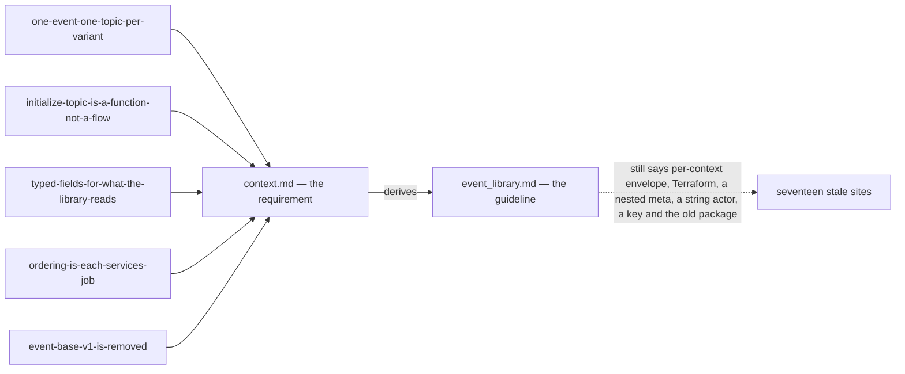

**→ Recommend:** update the guideline in one pass, keeping its CI test with one phrase changed — *"the
list the provisioning function derives"* — because derivation can still miss a context whose Go package
the calling binary never imports. It is programmer-authoritative, so this is reported, not edited: **say
the word and I will make that pass.**

## The decided envelope cannot be published by the shipped library

Re-checked against [one-event-one-topic-per-variant](./context_decision.md#one-event-one-topic-per-variant): the
shipped library can publish none of it — but the gap is now two changes, not three.

| | decided | shipped |
| --- | --- | --- |
| topic | ONE topic on the **variant** | `TopicName()` reads one `event_topic` from `event_base.v1.event_config` off the message **published** — `Event` carries no option, so every publish fails *"declares no event_topic"* ([event_source.go:55](../../../backend/pkgs/event_source/event_source.go#L55)) |
| fan-out | ✅ one publish per event | one `Publish` per call — already the same |
| metadata | `event_id`, `occurred_at`, `aggregate_id` typed on `Event` — [typed-fields-for-what-the-library-reads](./context_decision.md#typed-fields-for-what-the-library-reads) | `san_event.Event` demands `GetEventId()` + `GetOccurredAtUnix()` on the published message ([event.go](../../../backend/pkgs/san_event/event.go)) |

**→ Recommend: the library moves, in two changes.**

1. `TopicName(event)` unwraps the `oneof` and reads the SET VARIANT's option instead of the envelope's.
   Empty is an error — §5 made executable — and a descriptor test walking every variant fails it in CI
   before any runtime does. It reads `warehouse.events.v1.event_config` — `event_base.v1` is removed in the
   same change ([event-base-v1-is-removed](./context_decision.md#event-base-v1-is-removed)).
2. `san_event.Event` reads the envelope's own fields — `GetEventId()` as shipped, `occurred_at` as a
   `Timestamp`.

✅ **Dispatch has dropped off this list.** Your `EventPushHandler` takes the whole `Event` and switches on
the variant itself, so `Register[T]` keying on the decoded type
([receive.go:113](../../../backend/pkgs/san_event/receive.go)) is no longer wrong — `T` is `Event` for every
handler, by design.

⚠ A programmer's call more than yours — but until it lands, no event in the decided shape can be sent.

## The push factory takes the shipped raw type

| line | says |
| --- | --- |
| 98 | `type EventPushHandler func(ctx context.Context, event Event) error` |
| 102 | `func NewMuxPushHttpHandler(handler PushHandler) http.HandlerFunc` |
| 120 | `return san_event.NewMuxPushHttpHandler(san_event.EventPushHandler(handler))` |

`PushHandler` is not an undefined name — it is the **shipped** type,
`func(ctx context.Context, msg *PushRequest) error` ([push.go:20](../../../backend/pkgs/event_source/push.go#L20)):
the raw push body, the one that makes every consumer parse bytes, and the one
[the receive half](#the-receive-half-is-built-twice-and-wired-once) retires. Read literally, line 102
builds the new factory on the old type, and line 120 does not compile against it.

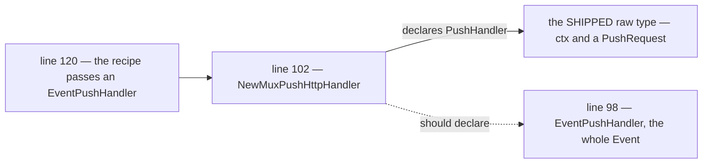

**→ Recommend:** line 102 is the wrong one — `NewMuxPushHttpHandler(handler EventPushHandler)`. Line 120
already assumes it.

## The examples still write `topics`

🆕 Narrowed by your line-46 edit — recorded as
[the-option-field-is-topic](./context_decision.md#the-option-field-is-topic). The definition moved and the
three examples did not:

| line | says | against line 46's `string topic` |
| --- | --- | --- |
| 46 — item 3 | `string topic` | ✅ the definition |
| 60 · 67 — item 4 | `topics: "order"` | a field `EventConfig` does not declare |
| 87 — item 5 | `topics: ["stock", "order"]` | the wrong name AND a list — left behind by [one-event-one-topic-per-variant](./context_decision.md#one-event-one-topic-per-variant) |

`protoc` rejects both — an option can only set a field its message declares. Line 87 is item 5's example of
*"every event message must have topic"*, so it reads as the rule itself.

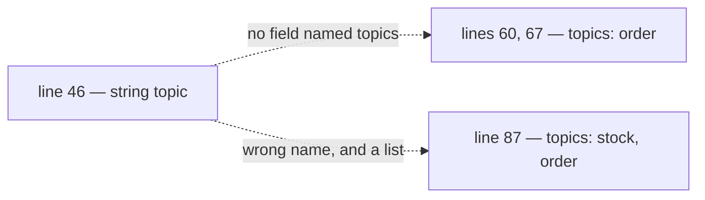

**→ Recommend:** all three become `topic: "order"`. Line 46 is the one you moved on purpose.

## The handlers still take `Event` by value

🆕 Left behind by your line-20 edit — [the-sender-takes-a-pointer](./context_decision.md#the-sender-takes-a-pointer):

| line | says |
| --- | --- |
| 20 — the sender | `event *eventsv1.Event` |
| 98 — `EventPushHandler` | `event Event` |
| 129 — `EventPullHandler` | `event Event` |

The same `Event` crosses all three, and the handler side is the one that fails: a value is not a
`proto.Message`, so the library's decoder cannot hand one over without a copy `go vet` rejects. The adopter
recipe — [one-adopter-checklist-for-both-drivers](./context_decision.md#one-adopter-checklist-for-both-drivers) — already writes
`event *eventsv1.Event`.

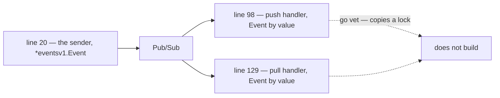

**→ Recommend:** lines 98 and 129 become `event *eventsv1.Event` — the same type line 20 now has.

## `context.md` lags five decisions

🆕 One cause — five decisions taken on 2026-09-11 — and six places in your doc that still read as before
them. Nothing to decide; each decision holds the text to copy.

| line | says | decided |
| --- | --- | --- |
| 72–80 | `message Event { map<string, string> metadata … }` | `event_id`, `occurred_at`, `aggregate_id` typed beside the map — [typed-fields-for-what-the-library-reads](./context_decision.md#typed-fields-for-what-the-library-reads) |
| 98 · 129 | two handler types, with no rules beside them | four rules, written once above both — [one-contract-for-both-handler-types](./context_decision.md#one-contract-for-both-handler-types) |
| 109–112 | *"aliasing"* · `SettlementEventPushHandler` | a type DEFINITION, named for the service — `SettlementEventHandler` — [one-adopter-checklist-for-both-drivers](./context_decision.md#one-adopter-checklist-for-both-drivers) |
| 123 | *"register `http.HandlerFunc` hook freely"* | mounted in `register.go` at `/event/<sub_id>/push` — same decision |
| 133 | `ListenSubscriber(..., subid, handler) error` | returns only on cancel, bounded concurrency — [pull-worker-is-bounded-and-fails-loudly](./context_decision.md#pull-worker-is-bounded-and-fails-loudly) |
| 138 | *"just simple define `EventPullHandler` and use function `ListenSubscriber`"* | the same seven steps as push, the worker inside a `Run(ctx)` — [one-adopter-checklist-for-both-drivers](./context_decision.md#one-adopter-checklist-for-both-drivers) |

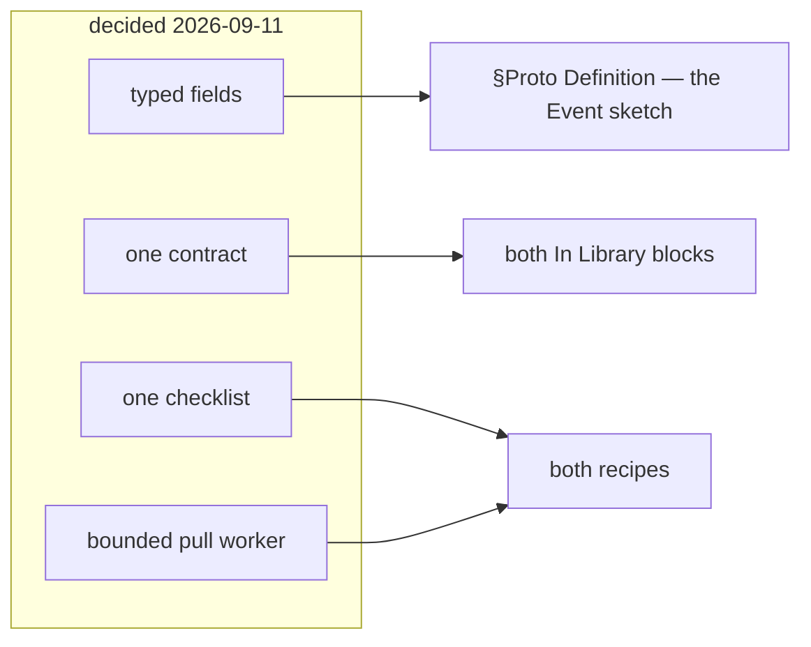

**→ Recommend:** one pass over §Proto Definition and §How Event Received. The Q11 decision needs no line —
the doc never mentioned a token.

---

# ⚠ What the removed doc held, and what must not come back with it

⛔ **`library.md` was deleted before its content was moved, so that content is still nowhere.** Recover it
with `git show d54b182:docs/technical/event/library.md` — and do not copy these across as they stand.
Landed in the authoritative doc, a stale line stops being a stale sibling and becomes the instruction.

| in the removed doc | why it must not travel | **→ Recommend** |
| --- | --- | --- |
| `extend MessageOptions { EventOption san_event = 50099; }` | `TopicName()` reads `event_config` at **50001** ([event_source.go:63](../../../backend/pkgs/event_source/event_source.go#L63)), so an event declaring only the doc's option reports **no topic** — present in the `.proto`, invisible to the code | ✅ decided — one option, in `warehouse.events.v1`: [event-base-v1-is-removed](./context_decision.md#event-base-v1-is-removed) |
| `message DataEvent { … occured_at = 1 … }` | replaced by the decided `Event` — [one-event-one-topic-per-variant](./context_decision.md#one-event-one-topic-per-variant). ⚠ `occured_at` misses an `r`, and the same doc says *"don't rename field proto"* | drop it |
| *"every service can use same interface to **send** event"*, attributed to `pkgs/san_event` | `san_event` has **no sender** — publishing is `pkgs/event_source` | ✅ settled — §General Brief places the library in `san_event`, so the shipped sender moves in. Keep what the split was for: no Pub/Sub type in anything a handler sees |
| *"supported is: Google Pub/Sub, local sqlite"* + a deferred `NewRabbitMqEventSender` | an abstraction over brokers, where §1 is a choice of one. A portable interface exposes only the **intersection**, and ordering keys, `dead_letter_policy` and `seek` are all outside it | *"Pub/Sub is the only production broker"*, and RabbitMQ stays behind → [Question 3](#question) |
| one shared topic named `deadletter`, published to by hand | Pub/Sub dead-letters **per subscription** and counts attempts itself. A hand-published topic does neither, so a poison message still redelivers forever — and every context's failures pool on one topic with one policy | native `dead_letter_policy` per subscription to `<topic>.dlq`, each with a triage subscription |
| `MarkAsDeadletter(ctx, evt Event)` | its trigger is a **parsing** error, and an unparsed payload has no `Event`. And a message that decodes but can **never** succeed (`RepeatedFailure`) has nowhere to go | take the raw message — `IncomingMessage` ([receive.go:14](../../../backend/pkgs/san_event/receive.go)) carries it, keyed on the broker id because `EventID` can be empty |
| sqlite as the dev broker | reproduces neither redelivery, ack deadlines nor out-of-order delivery — tested against Pub/Sub's shape, not its semantics | [Question 3](#question) — three dev brokers are in play |
| `## How Each Service Register Pull Event Worker Function.` — *"incomplete, still thinking"* · push is one line | both arrive unfinished | ✅ overtaken — `### Webhook` and `### Pull` are written fresh in `context.md`, recipes included. Nothing left to recover from these two |
| `NewMuxPushhandler` · an unused `topic string` in the `[ServiceName]` template · two unlabelled `alt`s | typos and diagram defects | ✅ overtaken — your doc names it `NewMuxPushHttpHandler`, and the template is replaced by the recipes |

---

# Critique

## What one global Event costs, and the cheapest answer to each

Decided — [one-event-one-topic-per-variant](./context_decision.md#one-event-one-topic-per-variant) — so not an
argument for reversing it, but what the build has to absorb. ✅ Two costs left with multi-topic: a
non-atomic fan-out, and the producer knowing its consumers.

| cost | **→ Recommend** |
| --- | --- |
| **one `oneof` number space for every context** — two people adding variants in one week collide on the numbers, in a file neither owns | a numbered block per context — settlement `100–199`, selling `200–299`, stock `300–399`. A collision becomes impossible rather than unlikely |
| **every consumer compiles against every domain**, and a topic carries variants a given consumer never handles — `order` carries both order variants to stock's consumer | a subscription filter on `event_type` per consumer, so they are not even delivered — and an unknown variant still ACKs, never NACKs ([reject-never-nacks](../../../guidelines/architectures/event_library.md#reject-never-nacks)) |
| **a second option called `event_config`** — `TopicName()` reads `event_base.v1.event_config` at 50001, and 50002 is `request_policy` | ✅ decided — the old package is removed in the same change the new option lands, so two never coexist ([event-base-v1-is-removed](./context_decision.md#event-base-v1-is-removed)) |

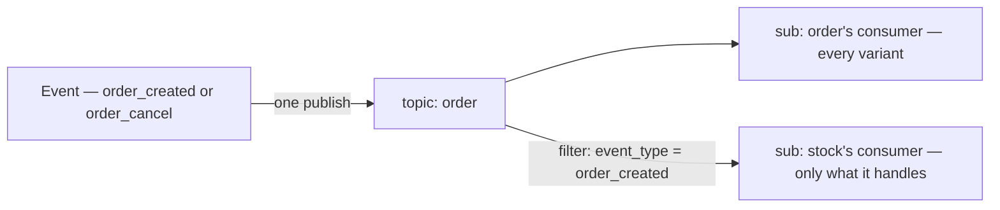

## `identity` on `Event` — who caused it, and three ways it goes wrong silently

🆕 Your line 74: `role_base.v1.Identity identity // its from rolebase`. ✅ **Reusing `Identity` is right** — it
is exactly what [`san_auth.GetIdentity(ctx)`](../../../backend/pkgs/san_auth/identity.go#L166) returns for
every authenticated request, so the publisher copies it and maps nothing. It is also the guideline's
`string actor = 5`, typed. What the line does not say:

| | what goes wrong | **→ Recommend** |
| --- | --- | --- |
| **who fills it** | typed at each call site, one forgets and it reads empty. And a worker, a cron, or a push handler publishing a follow-on event has **no identity in `ctx`** — `GetIdentity` errors wherever the interceptor never ran | **the sender fills it from `ctx`**, never a call site. None in `ctx` → an explicit `IDENTITY_TYPE_SYSTEM`. ✅ Your line 20 now gives the sender that `ctx` — [the-sender-takes-ctx](./context_decision.md#the-sender-takes-ctx) |
| **what a consumer may do with it** | push routes are open ([push-routes-are-open-by-default](./context_decision.md#push-routes-are-open-by-default)), so anyone who reaches one can POST an `Event` claiming `IDENTITY_TYPE_SYSTEM` or any user id. A consumer that authorizes from it — or puts it in `ctx` with `san_auth.WithIdentity` — hands the forger an authenticated caller, and a handler called directly gets no interceptor to stop it | **a RECORD, never a CREDENTIAL.** No consumer authorizes from it, and `WithIdentity(event.identity)` is forbidden — one line added to [one-contract-for-both-handler-types](./context_decision.md#one-contract-for-both-handler-types)'s rules |
| **`expired_at`** | it is the TOKEN's expiry, stamped on a fact kept forever — a consumer that checks it rejects every replayed event as expired | **the sender clears it.** `agent` and `agent_version` stay — *"made from the scanner app, v1.4"* is real audit |

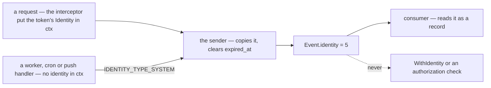

⚠ **The envelope's identity is not the payload's actor.** Settlement's variant carries `actor_id` from its
stored row ([the settlement event](../../business/settlement/analytic_context_clarify.md#proposed-design--the-settlement-event)).
The two agree when the request that wrote the row publishes it, and part when a backfill or an operator
re-publishes an old row — the envelope then names the operator, the row still names who posted.
**→ Recommend:** the payload keeps every stored column, the fact whole · the envelope says who caused THIS
publish · a consumer folding the fact reads the payload. → [Question 14](#question)

## The receive half is built twice and wired once

For `## How Event Received / Subscribed.` — what its `### Webhook` and `### Pull` inherit. [`san_event`](../../../backend/pkgs/san_event/receive.go)
already has the right receive design, one inbound edge for push and pull alike: dedup claimed in the
handler's own transaction, rejections recorded before the ACK, a repeated-failure layer. **Nothing calls
it.** The only wired path is the bare `event_source.PushHandler`, which has none of that.

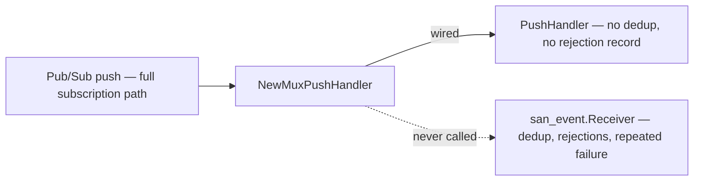

| | the defect | **→ Recommend** |
| --- | --- | --- |
| **two receive paths** | the library's receive design protects no event today, and the path that runs protects nothing | one path: a push driver and a pull worker that both build `IncomingMessage` and call `Receiver.Receive`. The bare `PushHandler` retires |
| **the subscription name** | a real push carries *"subscription": "projects/…/subscriptions/…"* — the full path. `liability_service` matches short constants, so every event falls to `default:` and is **ACKed and dropped**. `san_event`'s registry finds no handler and NACKs forever. The dev loopback passes the short name, which is why nothing has failed yet | ✅ decided — the route carries the short id, `/event/<sub_id>/push` ([one-adopter-checklist-for-both-drivers](./context_decision.md#one-adopter-checklist-for-both-drivers)). Left: a test that feeds a full path |
| **the delivery attempt** | a push sends `deliveryAttempt` at the top level, and `PushRequest` has no field for it. Pub/Sub sets it only on a subscription with a dead-letter policy — *"If a DeadLetterPolicy is not set on the subscription, this will be 0"* — so the repeated-failure layer can never fire | the push driver reads it · the subscription function always sets the DLQ policy (✅ [setup-ensures-safe-defaults-never-deletes](./context_decision.md#setup-ensures-safe-defaults-never-deletes)) — the receiver's detector depends on it |

## `EventSender` — the doc's contract and the shipped one each get one thing right

| | `context.md` | [shipped](../../../backend/pkgs/event_source/sender.go#L19) | **→ Recommend** |
| --- | --- | --- | --- |
| context | ✅ `ctx context.Context` — your line 20, [the-sender-takes-ctx](./context_decision.md#the-sender-takes-ctx) | `ctx context.Context` | ✅ settled. Left: detach *inside* the implementation (`context.WithoutCancel` + a timeout): handed the request's `ctx`, a disconnect cancels the **wait**, not the send, and the caller logs *"not published"* for an event that was |
| returns | `error` | `(string, error)` — the broker's message id | **the doc is right.** Nothing may key on that id ([event-id-is-derived](../../../guidelines/architectures/event_library.md#event-id-is-derived)), and two of the three shipped senders already return `""` |
| takes | `Event` — the global message | `proto.Message` | **the doc is right now**: with one global `Event` the sender takes `*eventsv1.Event` itself. A request cannot compile, and no interface is needed |
| `nil` means | unstated | the broker acknowledged it | **write it in**: the broker accepted it — never *"sitting in a client buffer"*. One topic per event, so there is no partial send to define |

⚠ **And `NewEventSender(...)` returns something with no lifecycle.** The Pub/Sub client's own doc: a
`Publisher` starts goroutines that *"need to be stopped by calling t.Stop()"* — *"avoid creating many
Publisher instances"*. The shipped sender calls `client.Publisher(topic)` **per event**
([sender.go:63](../../../backend/pkgs/event_source/sender.go#L63)) and stops none. ⚠ *Corrected below*: in
v2.6.1 that is not a goroutine leak — [6d in depth](#6d--one-publisher-per-topic-and-a-cleanup). Ordering needs one long-lived publisher per topic anyway: a failed publish **pauses
its key** until `ResumePublish`, so every later event for that aggregate fails too.

⛔ **Decided the other way** — [publisher-and-client-shutdown-is-the-services](./context_decision.md#publisher-and-client-shutdown-is-the-services): `NewEventSender` returns only the
sender, and stopping publishers and closing the client are the service's.

### Proposed — the sender, for Q6

🆕 Elaborated on request, checked against the v2.6.1 client. ✅ `ctx` first and the pointer are yours
([the-sender-takes-ctx](./context_decision.md#the-sender-takes-ctx) · [the-sender-takes-a-pointer](./context_decision.md#the-sender-takes-a-pointer)), and so are 6b — [sender-returns-the-client-error-as-is](./context_decision.md#sender-returns-the-client-error-as-is) — 6c — [sender-ctx-carries-values-not-cancel](./context_decision.md#sender-ctx-carries-values-not-cancel) — and 6d — [publisher-and-client-shutdown-is-the-services](./context_decision.md#publisher-and-client-shutdown-is-the-services). Two parts are left: 6e, 6f:

| | today — your line 20, or the shipped sender | **→ Recommend** |
| --- | --- | --- |
| **6a** · the event | ✅ the sender takes `*eventsv1.Event` — [the-sender-takes-a-pointer](./context_decision.md#the-sender-takes-a-pointer) · ⚠ the handler types still take it by value ([contradiction](#the-handlers-still-take-event-by-value)) | lines 98 and 129 follow line 20 |
| **6b** · what the error means | ✅ decided — the client's error, as it is: [sender-returns-the-client-error-as-is](./context_decision.md#sender-returns-the-client-error-as-is) | — |
| **6c** · whose cancel | ✅ decided — the `ctx` carries values, never the publish's cancel: [sender-ctx-carries-values-not-cancel](./context_decision.md#sender-ctx-carries-values-not-cancel) | — |
| **6d** · the publisher | ⛔ decided — the service stops publishers and closes the client: [publisher-and-client-shutdown-is-the-services](./context_decision.md#publisher-and-client-shutdown-is-the-services) | — |
| **6e** · the encoding | the shipped code uses `protojson` — deliberately, for legibility ([codec.go](../../../backend/pkgs/san_event/codec.go)); the guideline says *"Protobuf, binary encoding"* | **binary protobuf**, per the guideline — [6e in depth](#6e--the-encoding) |
| 🆕 **6f** · which values ride on `ctx` | *"custom and optional value if needed"* — anything | request-scoped data only — trace, identity. A per-call option goes in `Event.metadata` — [6f in depth](#6f--which-values-ride-on-ctx) |

```go
type EventSender func(ctx context.Context, event *eventsv1.Event) error

// your line 25 — the client handed in, only the sender back: publisher-and-client-shutdown-is-the-services
func NewEventSender(client *pubsub.Client, ...) EventSender

// the heart of it — error checks elided
topic, err := san_event.TopicName(event)                     // the SET variant's topic
data, err := proto.Marshal(event)                            // binary, 6e
result := publisherFor(topic).Publish(ctx, &pubsub.Message{Data: data, Attributes: attributes})

waitCtx, cancel := context.WithTimeout(context.WithoutCancel(ctx), 60*time.Second) // ✅ 6c, decided
defer cancel()

_, err = result.Get(waitCtx) // nil = the broker stored it
return err
```

**What the sender returns** — ✅ [sender-returns-the-client-error-as-is](./context_decision.md#sender-returns-the-client-error-as-is).

### Q6, part by part

🆕 Elaborated a second time, each part against the shipped code.

✅ **6b is decided** — [sender-returns-the-client-error-as-is](./context_decision.md#sender-returns-the-client-error-as-is): the client's error, as it is. The caller's log line
carries the `event_id`; what the caller does with the error is [recommended below](#and-one-rule-for-every-producer).

✅ **6c is decided** — [sender-ctx-carries-values-not-cancel](./context_decision.md#sender-ctx-carries-values-not-cancel): the `ctx` carries values, and the publish waits on
`context.WithoutCancel(ctx)` bounded by 60 s.

#### 6d — one publisher per topic, and a cleanup

⛔ **Decided** — [publisher-and-client-shutdown-is-the-services](./context_decision.md#publisher-and-client-shutdown-is-the-services): the library returns only the sender; stopping publishers and
closing the client are the service's. The heading keeps its name so links to it hold.

**Two things follow, both recommendations, neither a question:**

| | why | **→ Recommend** |
| --- | --- | --- |
| **inside the sender** | a publisher held per topic inside the sender is one the service has no handle on, so it could never be stopped | keep the shipped per-call publisher — in v2.6.1 it is garbage once its send returns, so there is nothing to stop. Cost: no batching, and no ordering key later |
| **the service's shutdown** | a send still retrying when the process exits is lost with no log line. The dev binary drains for 10 s ([app.go:11](../../../backend/cmd/app_development/app.go#L11)); the client retries up to 60 s | a service that wants the deploy window closed sets its grace to at least 60 s |

#### 6e — the encoding

⚠ **A correction to my earlier row.** I said a renamed field makes retained messages undecodable. Under
`san_event`'s codec it is worse: `DiscardUnknown: true` drops the old name, and **the field silently reads as
zero**. Rename settlement's `change` to `amount`, and every retained event folds `0` into a money report.

| | binary — the guideline | `protojson` — the shipped code |
| --- | --- | --- |
| a field renamed | safe — read by number | ⛔ silently zero in [codec.go](../../../backend/pkgs/san_event/codec.go) · undecodable in [push.go](../../../backend/pkgs/event_source/push.go#L27) |
| a field or variant added | kept as unknown · an unset variant returns `nil`, as decided | dropped in codec.go · ⛔ an error in push.go, which decodes strictly |
| readable in the console, the DLQ, a log | ❌ — needs a tool | ✅ — codec.go's whole case, and a real one |
| size | 3–5× smaller, by codec.go's own measure | — |

Two things hold whichever wins:

- **The shipped code has two decoders that disagree** — push.go strict, codec.go lenient. One must go.
- **Nothing stops a rename today.** `proto/buf.yaml` configures `breaking: FILE`, which catches one, but CI
  never runs `buf breaking`.

**→ Recommend binary, per the guideline**, with the tool the guideline itself calls *"the highest-value tool
here"* — a CLI that prints any message as `protojson` — and `buf breaking` in CI either way. ⚠ **Decide it now:**
no event in the decided shape has been published, so the choice is free today and permanent after the first
one — there is no format tag on a payload to switch on later.

#### 6f — which values ride on `ctx`

🆕 From your answer to 6c — *"ctx its used for bring custom and optional value if needed"*. The carrying half
is decided. What is left is **which** values, because Go's `context` package draws the line itself:
*"Use context Values only for request-scoped data that transits processes and APIs, not for passing optional
parameters to functions."*

| a value | request-scoped? | where it rides |
| --- | --- | --- |
| the trace | ✅ — it transits every hop | `ctx` — the sender publishes it as attributes |
| the caller's identity | ✅ — the interceptor put it there | `ctx` — the sender fills `Event.identity` ([Q14](#question)) |
| a per-event option — *"tag this one"*, an extra attribute, a key if one is ever added | ❌ — it belongs to the event, not the request | **`Event.metadata`** — your own `map<string, string>`, already on `Event` |

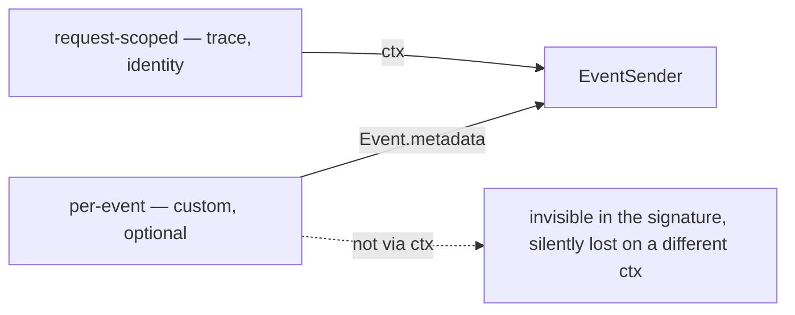

A value on `ctx` is invisible in the signature: set it on a different `ctx`, or misspell its key, and the
sender reads nothing — **no error, no compile failure**. A value in `Event.metadata` travels in the body, is
visible to every consumer, survives a replay and a `Redrive`, and is what your map is for.

**→ Recommend:** the sender reads exactly two values from `ctx` — the trace and the identity — and anything
per-event goes in `Event.metadata`. The library names the keys it reads, so a caller never guesses.

## Five consequences of *"We use Google Pub/Sub"* the doc does not state

Each is decided *by* choosing Pub/Sub whether or not it is written down.

| what Pub/Sub does | why it belongs in this doc | **→ Recommend** |
| --- | --- | --- |
| **retention caps at 31 days** | Pub/Sub **cannot be your log of record** — there is no replay from the beginning | one archive subscription per topic to durable storage. Added later it starts at *now* |
| **ordering is opt-in at both ends** | the subscription flag is fixed at creation, and works only if the publisher set `OrderingKey` all along | ✅ decided — no key for now, [ordering-is-each-services-job](./context_decision.md#ordering-is-each-services-job). ⚠ What stays true: a key added later orders only what is published after it |
| **a message that can never succeed redelivers forever** | with no key there is no head-of-line blocking — but a poison message still comes back on every retry, with no end | the DLQ is what ends it. Mandatory per subscription |
| **push vs pull is a deployment decision** | the doc now ships both, so each consumer makes it: push needs a public HTTPS endpoint and has no flow control, pull a long-lived process | say in each sub-section which kind of consumer it suits. 🆕 One line follows from [push-routes-are-open-by-default](./context_decision.md#push-routes-are-open-by-default): a consumer whose handler writes a source of truth uses **pull**, which has no inbound route to forge |
| **1 KB minimum billed per message** | thin events save far less than expected | shrink events for coupling, never for cost |

---

# Proposed Design

The envelope and its routing are **decided** — [one-event-one-topic-per-variant](./context_decision.md#one-event-one-topic-per-variant).
Below is the rest of what `context.md` owes a reader, built on it.

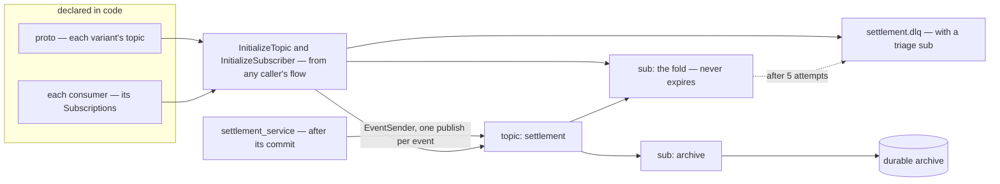

| decision | value |
| --- | --- |
| envelope | `warehouse.events.v1.Event` — one `oneof`, every variant naming its ONE topic ([one-event-one-topic-per-variant](./context_decision.md#one-event-one-topic-per-variant)) |
| topic option | ✅ `warehouse.events.v1.event_config`, one `string topic` ([the-option-field-is-topic](./context_decision.md#the-option-field-is-topic)) · `event_base.v1` removed in the same change that moves selling's two events and `TopicName()` — [event-base-v1-is-removed](./context_decision.md#event-base-v1-is-removed) |
| identity | `role_base.v1.Identity identity = 5` — your line 74 · filled by the sender from `ctx`, `IDENTITY_TYPE_SYSTEM` when none, `expired_at` cleared · a record, never a credential → [Q14](#question) |
| metadata | ✅ `event_id` 1 · `occurred_at` 2 · `aggregate_id` 3 typed, your `metadata` map 4, `5–99` growth — [typed-fields-for-what-the-library-reads](./context_decision.md#typed-fields-for-what-the-library-reads) |
| numbering | variants in a **block per context** — settlement `100–199`, selling `200–299`, stock `300–399` |
| broker | Google Pub/Sub, the sole production broker → [Question 3](#question) |
| library | `backend/pkgs/san_event` — ✅ your §General Brief. Sends, receives, dedups and provisions; the shipped sender moves in from `event_source` |
| handler contract | ✅ four rules, written once above both handler types — [one-contract-for-both-handler-types](./context_decision.md#one-contract-for-both-handler-types) |
| adopting service | ✅ seven steps, whichever driver — [one-adopter-checklist-for-both-drivers](./context_decision.md#one-adopter-checklist-for-both-drivers) |
| push route | ✅ `/event/<sub_id>/push` in the service's `register.go`, open — [push-routes-are-open-by-default](./context_decision.md#push-routes-are-open-by-default). A consumer that writes a source of truth uses pull |
| pull worker | ✅ the service's `Run(ctx)` · returns only when cancelled · concurrency sized to the pool — [pull-worker-is-bounded-and-fails-loudly](./context_decision.md#pull-worker-is-bounded-and-fails-loudly) |
| sender contract | ✅ `func(ctx, *eventsv1.Event) error`, built by `NewEventSender(client, ...) EventSender` · the client's error as is · waits on a detached `ctx` · the service stops publishers and closes the client — [publisher-and-client-shutdown-is-the-services](./context_decision.md#publisher-and-client-shutdown-is-the-services) · binary protobuf → [Q6](#question) |
| durability | ✅ no outbox — the producer publishes after its commit, the client retries up to 60 s, and delivery from there is Pub/Sub's — [no-outbox-the-publish-is-trusted](./context_decision.md#no-outbox-the-publish-is-trusted) |
| provisioning | ✅ `InitializeTopic`, `InitializeSubscriber` and `Redrive` — a developer's tool ([setup-functions-are-a-developer-tool](./context_decision.md#setup-functions-are-a-developer-tool)) that ensures: create, update, refuse, never delete — [setup-ensures-safe-defaults-never-deletes](./context_decision.md#setup-ensures-safe-defaults-never-deletes). Topics from the proto, subscriptions from each consumer's declaration. → Recommend it runs as `go run ./tools/san pubsub ensure` |
| every topic | ✅ retention **31 days**, set at creation and billed as storage — the reach [the-replay-reaches-31-days-and-that-is-accepted](../../business/settlement/context_decision.md#the-replay-reaches-31-days-and-that-is-accepted) already assumes, and it lets a subscription made later seek back too |
| every subscription | ✅ ordering on · `expiration_policy` with no `ttl` · `dead_letter_policy` to `<topic>.dlq`, 5 attempts, its grants with it · retry backoff 10 s → 600 s · push deadline 60 s — [setup-ensures-safe-defaults-never-deletes](./context_decision.md#setup-ensures-safe-defaults-never-deletes) · a filter on `event_type` from the guideline's [portable subset](../../../guidelines/architectures/event_library.md#filter-subset-portable) |
| ordering key | ✅ none, for now — [ordering-is-each-services-job](./context_decision.md#ordering-is-each-services-job). Every consumer tolerates any arrival order |
| attributes | `event_type` (the variant's full name), `event_id`, `aggregate_id`, trace context — **derived by the shared publisher**, never at a call site, or they drift from the body |
| dedup key | `event_id`, derived from the causing row — **the same on every topic's copy**. **Never** the transport's `message_id`: a publisher retry mints a new one for the same fact |
| DLQ | ✅ one per source topic, each with a triage subscription that never expires, and `Redrive` to bring its messages back — [setup-ensures-safe-defaults-never-deletes](./context_decision.md#setup-ensures-safe-defaults-never-deletes) |
| archive | one subscription per topic to durable storage, from day one |
| environments | **separate GCP projects**, not name prefixes — the boundary should be IAM, not a string convention |

⚠ **Exactly-once delivery does not remove the dedup table.** It is pull-only and covers redelivery, not
publish retries — the same fact published twice is two messages with two `message_id`s. The inbox stays.

## Four rules that belong HERE, not in each context's doc

[one-event-one-topic-per-variant](./context_decision.md#one-event-one-topic-per-variant) settled the *shape* of the envelope.
These four decide what goes **in** it, and each is the kind of choice a context will get wrong in
isolation and cannot cheaply reverse.

| rule | why it is architectural, not local |
| --- | --- |
| **A `oneof` variant is a different KIND OF FACT — never an enum value** | if a payload differs only by a field, it is one variant with that field. Splitting an existing enum into variants turns *"add a value"* into *"add a variant plus a handler arm"*, in every consumer, forever — and each context will make that call differently unless the rule is written once |
| **Every consumer tolerates any arrival order** | decided — [ordering-is-each-services-job](./context_decision.md#ordering-is-each-services-job). Nothing orders delivery, so a handler that assumes placed-before-cancelled is wrong on the first retry that lands late — and nothing fails, it just writes the wrong thing. How is each service's call: a fold that sums the same in any order, or a later state recorded so an earlier event checks for it. Worth one line in `context.md`, beside the handler rules |
| **`event_id` is derived from the causing row — never the transport's message id** | the guideline requires it (`event-id-is-derived`) and the reason is a **money bug, not tidiness**. A publish is **retried** — by the client itself, for up to 60 s ([no-outbox-the-publish-is-trusted](./context_decision.md#no-outbox-the-publish-is-trusted)) — and a retry can mint a **new** broker message id for the same fact. A consumer deduplicating on that id sees something new and folds the same row **twice**. A derived id collides, which is the entire point of dedup |
| **An event carries the fact WHOLE, never a pointer to it** | a thin event forces the consumer to read the producer's table back, so a **replay folds current state instead of the historical fact** — the one thing a rebuild must not do. It also re-couples the consumer to tables it does not own, across a HARD RULE 3 boundary. ⚠ And it saves nothing: Pub/Sub bills a **1 KB minimum per delivery**, so most events are free to be fat |

### And one rule for every PRODUCER

🆕 Left over from 6b — [sender-returns-the-client-error-as-is](./context_decision.md#sender-returns-the-client-error-as-is) hands the error to the caller unchanged, so what the
caller does with it is the adopter's to get right. Each is already true of
[order_place.go](../../../backend/services/selling_service/selling_v1/order_place.go#L312):

| rule | why |
| --- | --- |
| **after the commit, a send error never becomes the RPC's error** | the row exists. Answer *"failed"* and the person at the shelf taps again — a second order, a second stock movement |
| **log it once, with the `event_id` — never retry in a loop** | the client already retried for 60 s, and the error no longer names the event — the log line must |
| **the repair is a backfill from the row** | the `event_id` is derived from the row, so a re-publish collides in every consumer's `Claim` |

**→ Recommend:** one line in `context.md`, beside the sender contract — *"a send error after the commit is
logged with its `event_id` and never fails the request"*.

⚠ **A stored date travels as a stored date.** Where a fact is bucketed by a `DATE` column, the event
carries that column, not a timestamp for the consumer to re-derive — a re-derivation is a second
timezone decision, made by whoever wrote the consumer.

### ⚠ The architecture has no position on a service consuming its OWN events

The first real consumer of the first real topic is the service that publishes it — about to become the
template, so this doc should have an opinion on it.

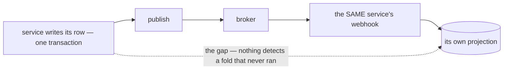

The decoupling is real and a replay genuinely needs the broker. The cost is that the commit-to-publish gap
now sits **between a row and its own report**, inside one service.

**→ Recommend the doc state that an event is a DOORBELL, not a delivery** — a self-consuming service folds
in-process on the fast path, keeps the broker path for convergence and replay, and the dedup claim lets
the two overlap: whichever arrives first wins, the other acks as a duplicate. **That makes the broker
optional to correctness rather than load-bearing** — losing an event then costs a delay, not a
permanently wrong number. ⚠ Under [no-outbox-the-publish-is-trusted](./context_decision.md#no-outbox-the-publish-is-trusted)
it is the only thing between a publish that never happened and a report that stays short.

> ➡ **Settlement's own event — its payload, its variant — is specified in
> [`analytic_context_clarify.md`](../../business/settlement/analytic_context_clarify.md#proposed-design--the-settlement-event),
> not here**, re-shaped for [one-event-one-topic-per-variant](./context_decision.md#one-event-one-topic-per-variant).
> `analytic_context.md` §Events is the doc that can answer what a settlement event carries (RULE 7b).
> This doc supplies the rules it is built from.

---

# Question

Each is phrased so that **"yes" accepts the recommendation**. Closed, with the numbers kept so every link
to them still lands: ✅ Q1 in the doc itself — push AND pull · ✅ Q2 and Q7–Q13 decided on 2026-09-11 —
[the banner](#clarity--contextmd) lists them.

✅ Q2 → [no-outbox-the-publish-is-trusted](./context_decision.md#no-outbox-the-publish-is-trusted)

3. **Pub/Sub as the only production broker, and in dev the loopback plus the emulator?** Three dev brokers
   are in play: the loopback that ships, the emulator `docker-compose` runs, and the sqlite broker the
   guideline's [filter-subset-portable](../../../guidelines/architectures/event_library.md#filter-subset-portable)
   assumes. The loopback should read the same consumer declaration and apply the filter subset the guideline
   asks of sqlite; the emulator covers broker semantics; sqlite would be a third behaviour to keep in step.
4. **Add an archive subscription per topic now?** Added later it starts at *now*, and the months before it
   never existed.

✅ Q5 → [setup-ensures-safe-defaults-never-deletes](./context_decision.md#setup-ensures-safe-defaults-never-deletes)

6. **Publish binary protobuf (6e), and keep `ctx` to request-scoped values — trace and identity — with per-event options in
   `Event.metadata` (6f)?** ✅ 6b decided — [sender-returns-the-client-error-as-is](./context_decision.md#sender-returns-the-client-error-as-is) · ✅ 6c decided —
   [sender-ctx-carries-values-not-cancel](./context_decision.md#sender-ctx-carries-values-not-cancel) · ⛔ 6d decided —
   [publisher-and-client-shutdown-is-the-services](./context_decision.md#publisher-and-client-shutdown-is-the-services). ✅ `ctx` and the pointer (6a) are in your line 20 —
   [the-sender-takes-ctx](./context_decision.md#the-sender-takes-ctx) · [the-sender-takes-a-pointer](./context_decision.md#the-sender-takes-a-pointer). 🆕 [The sender, spelled out](#proposed--the-sender-for-q6):
   a field rename under `protojson` silently zeroes it on every retained message ([part by part](#q6-part-by-part)). Under
   [no-outbox-the-publish-is-trusted](./context_decision.md#no-outbox-the-publish-is-trusted) the sender's
   return value is the whole guarantee.

✅ Q7 → [typed-fields-for-what-the-library-reads](./context_decision.md#typed-fields-for-what-the-library-reads) ·
✅ Q8 → [ordering-is-each-services-job](./context_decision.md#ordering-is-each-services-job) ·
✅ Q9 → [event-base-v1-is-removed](./context_decision.md#event-base-v1-is-removed)

14. 🆕 **Put `identity` at 5, filled by the sender from `ctx` — `IDENTITY_TYPE_SYSTEM` when there is none,
    `expired_at` cleared — and add to the handler contract that it is a record, never a credential?** Your line
    73 adds it with no number and no rule. Filled at call sites it is forgotten; trusted by a consumer it is
    forgeable through every open push route; its token expiry makes a replayed event look expired
    ([critique](#identity-on-event--who-caused-it-and-three-ways-it-goes-wrong-silently)). ✅ The `ctx` to
    fill it from is in your line 20 — [the-sender-takes-ctx](./context_decision.md#the-sender-takes-ctx).

---

# Awaiting

- ➡ **`Event` passed BY VALUE** — ✅ fixed on line 20, still on lines 98 and 129 ([contradiction](#the-handlers-still-take-event-by-value)) ·
  **the encoding** — moved into [Q6](#question) as 6e.
- ⚠ `### Pull (Google PubSub Push Subscriber)` — *Push*, presumably meant as *Pull*.
- **Still unwritten**: environments, who publishes what. ✅ Subscription settings, retention and the DLQ are
  decided — [setup-ensures-safe-defaults-never-deletes](./context_decision.md#setup-ensures-safe-defaults-never-deletes) — and worth a line in your doc.
- **§2 names one user, *"settlement service"*,** and omits the two that exist: `selling_service` is the
  only live producer and `liability_service` the only live consumer. I would move them first —
  dual-publishing old and new topics until liability switches — because they prove the library before
  settlement depends on it.
- **The proto sketch has no field numbers.** The variants' are what the block-per-context proposal is for
  ([costs](#what-one-global-event-costs-and-the-cheapest-answer-to-each)). The extension's: 50001 frees up when
  `event_base.v1` goes, and I would reuse it ([event-base-v1-is-removed](./context_decision.md#event-base-v1-is-removed)).
- **`Goole` → `Google`** in §1, **`Responsbility`** in its heading, and **`impelemented`** in both recipe
  headings.
- **The header names a second proposal.** If it comes, the [Proposed Design](#proposed-design) table is the
  surface to compare on — an alternative that says which rows it changes can be decided row by row.
- **Two guidelines cited by shipped code do not exist** — and `codec.go` cites a *"No format tag"* section
  `event_library.md` does not have: `san_event/event.go` cites
  `guidelines/event-guideline.md` and `guidelines/architectures/data_pipeline.md`, and warns against a
  `disscuss/` folder that is gone. Only `architectures/event_library.md` is there.
