# Decisions — `context.md`

What the owner decided about [context.md](./context.md), recorded before it is acted on.

> **Append-only.** A decision is added, never rewritten. If one reverses, the entry stays and is
> annotated, and the reversing entry gets its own section with a new name (RULE 12).

---

## superseded-no-global-event-envelope

> ⛔ **SUPERSEDED (2026-09-11) by [superseded-one-event-many-topics](#superseded-one-event-many-topics)** — itself
> narrowed the same day to [one-event-one-topic-per-variant](#one-event-one-topic-per-variant). There IS one global
> `Event` in `warehouse.events.v1` now, and every variant names its own topics. The objection below —
> one `Event`, therefore one topic — is exactly what the reversal answered, by moving the option onto
> the variants. The other three reasons (one shared `oneof` number space, every consumer compiling every
> domain, a variant change touching every decoder) were accepted as costs. ⚠ And the *"no override note
> is owed"* below no longer holds — the reversal overrides the guideline this entry ratified. Kept,
> renamed rather than deleted (RULE 12).

**One envelope per context. There is no shared `warehouse.events.v1` and no global `Event`.**
(owner, 2026-09-10)

An event definition lives in its own context's proto directory, beside that context's RPC contract,
in that context's package. The envelope is named `<Context>Event` and carries the topic option.

This **ratifies** [`guidelines/architectures/event_library.md`](../../../guidelines/architectures/event_library.md)'s
[`envelope-per-context`](../../../guidelines/architectures/event_library.md#envelope-per-context) rather
than overriding it, so **no override note is owed** — the guideline and the requirement tree now agree.

### Why

The proposal in `context.md` §Proto Definition was *"a shared definition … all type wrapped in one
definition"*. The argument against it is not style: `event_config` extends `MessageOptions` and
[`TopicName()`](../../../backend/pkgs/event_source/event_source.go) reads it off **the message being
published**, so one `Event` message carries one option — and therefore the whole warehouse would have
had exactly **one topic**.

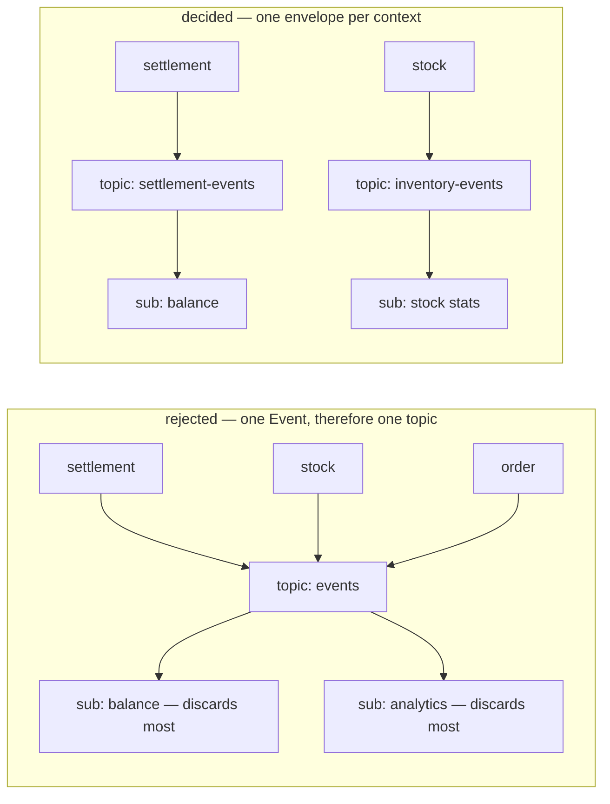

A topic is the boundary for **retention, dead-lettering and ordering** all three. One topic means
settlement and stock can never have different ones. It also puts every domain's variants in one
`oneof` field-number space, makes any variant change a change to the type every service decodes, and
forces every consumer to compile against every domain — the coupling the guideline names.

### The spec

```protobuf
// proto/warehouse/settlement/v1/events.proto — beside settlement.proto, same package
package warehouse.settlement.v1;

message SettlementEvent {
  option (warehouse.event_base.v1.event_config) = {
    event_topic: "settlement-events"          // LOGICAL name — a resolver adds the project
    ordering_key_field: "meta.aggregate_id"
  };

  warehouse.event_base.v1.EventMetadata meta = 1 [(buf.validate.field).required = true];

  oneof payload {
    SettlementPostedEvent    posted    = 100;
    SettlementCancelledEvent cancelled = 101;
  }
}
```

| | |
| --- | --- |
| file | `proto/warehouse/<context>/v1/events.proto` |
| package | `warehouse.<context>.v1` — the same package as that context's RPC contract |
| envelope | `<Context>Event`, one per context |
| topic | one per context, `<context>-events`. A **logical** name only, never a resource path |
| option | the existing `event_config` at 50001. Never a second extension |
| numbering | `meta` at 1, metadata growth reserved to 99, `oneof` variants from 100 |
| dispatch | a typed switch on the `oneof`. A removed variant is `reserved`, never reused |
| first one to build | `SettlementEvent` — it is the context `context.md` §2 names |

### What this does NOT settle

⛔ **The first event still cannot be written**, and this decision does not unblock it. The
authoritative envelope above **does not compile** against the shipped library:

| | guideline | shipped code |
| --- | --- | --- |
| metadata | `EventMetadata meta = 1` | `san_event.Event` demands flat `GetEventId()` + `GetOccurredAtUnix()` ([event.go:33](../../../backend/pkgs/san_event/event.go)) |
| ordering | `event_config.ordering_key_field = 2` | `MessageEventConfig` has only `event_topic` |

`EventMetadata` does not exist in `proto/` at all. That remains open in
[`context_clarify.md`](./context_clarify.md#the-decided-envelope-cannot-be-published-by-the-shipped-library).

Also untouched by this decision, and still open: the broker abstraction, where consumers run (push
vs pull), the archive subscription, and the per-topic DLQ.

---

## the-library-doc-is-absorbed

**`docs/technical/event/library.md` is removed and its content moves into
[`context.md`](./context.md). `event_architecture/` is the one requirement doc for events.**
(owner, 2026-09-10 — *"im plan to remove event/library.md and move to this context"*, then
*"remove event/library.md first"*)

✅ **Done.** `library.md` and `library_clarify.md` are deleted and `docs/technical/event/` is gone.

> ⛔ **The delete came BEFORE the merge, so the content is currently nowhere.** The push and pull
> flows, the `EventSender` interface, the dead-letter design and the per-service registration rules
> are not yet in `context.md`. **Recover them from git** — the last commit holding the file is
> **`d54b182`**:
>
> ```sh
> git show d54b182:docs/technical/event/library.md
> ```
>
> ⚠ Read [`context_clarify.md`](./context_clarify.md#-what-the-removed-doc-held-and-what-must-not-come-back-with-it)
> before copying any of it across — three things in that file are wrong today, and the worst
> (`san_event = 50099`) becomes the instruction the moment it lands in the authoritative doc.

### Why

Three files described the same subject, and they had already disagreed twice in one round — the
broker (an abstraction over three vs a choice of one) and the option number (`san_event` at 50099 vs
the shipped `event_config` at 50001). A reader had no way to know which was current, and a question
had no obvious home.

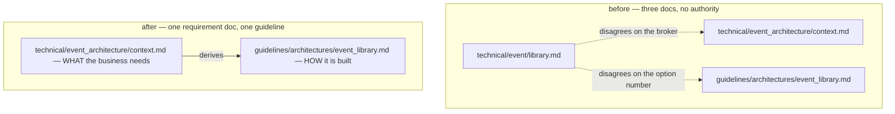

### What this settles, and what it does not

| | |
| --- | --- |
| ✅ authoritative requirement doc | `docs/technical/event_architecture/context.md` — the only one |
| ✅ `event/library.md` and its clarify | deleted. `docs/technical/event/` no longer exists |
| ⚠ **the guideline STAYS** | [`guidelines/architectures/event_library.md`](../../../guidelines/architectures/event_library.md) is a different lane, not a fourth copy — HARD RULE 7 puts the requirement in `docs/technical/`, and `guidelines/` holds the programmer-authoritative build rules derived from it. [superseded-no-global-event-envelope](#superseded-no-global-event-envelope) is the shape of that relationship: the requirement doc ratified the guideline — and [superseded-one-event-many-topics](#superseded-one-event-many-topics) is its other face, the requirement doc overriding it |
| ⛔ what still has to be WRITTEN | the push and pull flows, `EventSender`, the dead-letter design, the per-service registration rules. Deleted, not yet moved — recover from `d54b182` |

⚠ **The removal was not free of content.** `library.md` carried four open contradictions and four
critiques that no longer had a doc to be asked against. They were re-routed into
[`context_clarify.md`](./context_clarify.md) *before* the delete (RULE 7b), so nothing was lost with
the file — but nothing there was **answered** either. It only changed which doc answers it.

⚠ **One inbound link is now broken and it is the owner's to fix**:
[`ledger/mutation_and_ledger.md:154`](../ledger/mutation_and_ledger.md) says *"we rely
`[event_library](../event/library.md)` for processing event"*. Reported in
[`mutation_and_ledger_clarify.md`](../ledger/mutation_and_ledger_clarify.md), never edited (RULE 7b).

---

## superseded-one-event-many-topics

> ⛔ **SUPERSEDED IN PART (2026-09-11) by [one-event-one-topic-per-variant](#one-event-one-topic-per-variant).**
> The owner cancelled multi-topic: each variant names ONE topic. The global `Event` half below still stands;
> the topics-LIST half does not — and with it go the fan-out cost and *"the producer must know its
> consumers"*. Kept as the record, per the header.

**One global `Event` in `warehouse.events.v1`, and every variant names its own topics.** (owner,
2026-09-11 — *"for question 1, yes"*: yes, `context.md` §Proto Definition 3–5 reverses
[superseded-no-global-event-envelope](#superseded-no-global-event-envelope))

⚠ **Against my recommendation**, and it reverses a decision taken the day before. It also **overrides**
the guideline that decision had ratified — so the override note it said was not owed is owed now
([below](#the-guideline-this-overrides)).

### Why

The reversed decision rested on one objection: `event_config` is read off the message being published,
so one `Event` could carry one option and the whole warehouse would have had **one topic**. Putting the
option on the **variants**, as a list, answers it — each fact routes itself. No further reason was given
in chat; the design in `context.md` §Proto Definition is the argument. ⚠ The one thing only this shape
can do — hand a consumer ONE ordered stream across two producers — is the case to cite if it is ever
questioned again.

### The spec

As written in `context.md` §Proto Definition — sketched, so field numbers are not decided yet:

```protobuf
// ONE shared definition for every context (§1 · §3)
package warehouse.events.v1;

message EventConfig {
  repeated string topics;
}

extend google.protobuf.MessageOptions {
  EventConfig event_config;              // number OPEN — 50001 and 50002 are taken
}

message OrderCreated {                   // the owner's example
  option (event_config) = { topics: ["stock", "order"] };    // MANDATORY on every variant (§5)
}

message Event {                          // §4 — all types wrapped in one definition
  oneof message {
    OrderCreated order_created;
    OrderCancel  order_cancel;
  }
}
```

| | |
| --- | --- |
| package | `warehouse.events.v1` — one definition for every context |
| envelope | `Event`, one `oneof` across every context |
| routing | `EventConfig.topics` on each **variant**, never on `Event` |
| topics | named for the stream, not the producer — `["stock", "order"]`; one fact may go to several |
| mandatory | *"Every event message must have topic"* (§5) — a variant with no `topics` is a defect |
| first user | settlement (§2) |

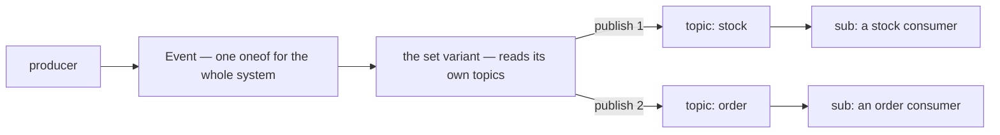

### What it costs — accepted with it

| cost | who carries it |
| --- | --- |
| every context's variants share one `oneof` number space | whoever adds a variant — a block per context is proposed in the clarify |
| every consumer compiles against every domain | every consumer — softened by `event_type` filters, and an unknown variant is ACKed, never NACKed |
| a new consuming domain is an edit to the producer's variant | the producer, which now knows its consumers |
| fan-out is one publish per topic, so it is no longer atomic | the sender — an outbox row per (event, topic) is what makes it converge ([Q2](./context_clarify.md#question)). ✅ Since moot — one topic per variant, and no outbox: [no-outbox-the-publish-is-trusted](#no-outbox-the-publish-is-trusted) |

### What this does NOT settle

- where the metadata lives — `event_id`, `occurred_at`, `aggregate_id` ([Q7](./context_clarify.md#question))
- each topic's ordering key — `repeated string topics` names destinations, not keys ([Q8](./context_clarify.md#question)).
  ✅ Since decided — no key at all, for now: [ordering-is-each-services-job](#ordering-is-each-services-job)
- one `event_config` or two — the shipped `warehouse.event_base.v1.event_config` (50001) is what
  `TopicName()` reads ([Q9](./context_clarify.md#question))
- ⛔ the shipped library can publish none of it yet —
  [the contradiction](./context_clarify.md#the-decided-envelope-cannot-be-published-by-the-shipped-library)

### The guideline this overrides

[`event_library.md`](../../../guidelines/architectures/event_library.md) is programmer-authoritative and
is **not edited here**. Per [the-library-doc-is-absorbed](#the-library-doc-is-absorbed) the requirement doc
is the upstream one, so these sites are stale until someone updates it:

| guideline rule | says | now |
| --- | --- | --- |
| [topic-per-context](../../../guidelines/architectures/event_library.md#topic-per-context) | one topic per bounded context | topics per variant, named for the stream |
| [envelope-per-context](../../../guidelines/architectures/event_library.md#envelope-per-context) | *"Never a global `WarehouseEvent`"* | one global `Event` |
| §4 envelope shape | *"The option goes on the envelope, never on the inner variants"* | the option goes on the variants |
| §10 never do | *"❌ A global `WarehouseEvent` covering every domain"* | it is the design |
| §12 migration | dual-publish to `selling-events` | the target is `Event` variants |

⚠ [reuse-event-config-50001](../../../guidelines/architectures/event_library.md#reuse-event-config-50001)
is at risk, not yet broken — it breaks only if `EventConfig` is minted as a second option
([Q9](./context_clarify.md#question)). The guideline's own rule applies: *"deviating requires a note in the
commit saying which rule and why"* — the commit that records this decision carries it.

---

## initialize-topic-is-a-function-not-a-flow

**`InitializeTopic` is a library function, and nothing more. When and where it runs — app boot, a deploy
step, a CLI, a test — is the caller's flow to build.** (owner, 2026-09-11 — *"its just function, other
person can build their own flow, we just write implementation function"*, answering
[Q5](./context_clarify.md#question))

⚠ **Against my recommendation** of a `tools/san` command run at deploy — **withdrawn** as a library
requirement. It survives only as one flow a caller may choose.

### Why

The library's job is the implementation. Orchestration differs per caller — a service at boot, an operator
at deploy, a test against the emulator — and a library that owned one flow would force it on all of them.

### The spec

| | |
| --- | --- |
| the library ships | `InitializeTopic(...) error` — an implementation, callable from anywhere |
| the library does NOT ship | a boot hook, a deploy step, a CLI command, a schedule |
| a caller | decides when it runs, and with which credentials |

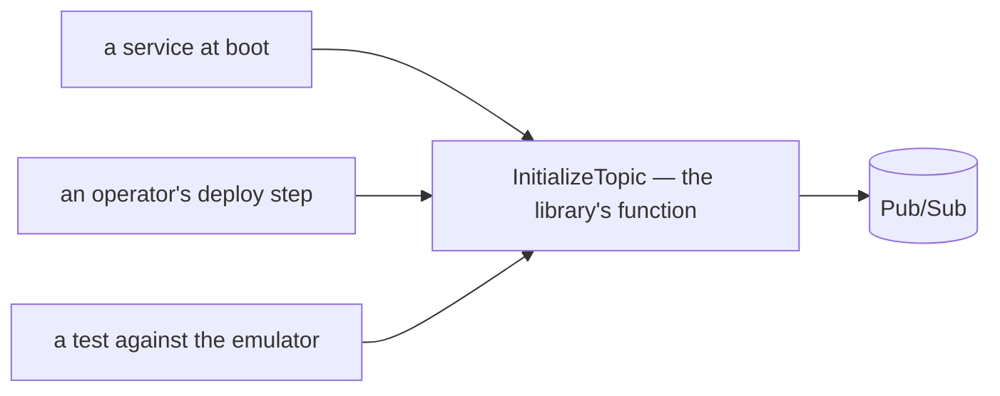

### What this does NOT settle

- **what the function covers and guarantees** — topics only, or subscriptions too, and what it does to a
  resource that already exists with different settings. Narrowed and still open as
  [Q5](./context_clarify.md#question). ✅ Since decided — [setup-ensures-safe-defaults-never-deletes](#setup-ensures-safe-defaults-never-deletes).
- ⚠ A caller who runs it at boot gives every running instance admin rights on Pub/Sub. That is now the
  caller's choice to make — so the function should state the permissions it needs, and the choice is made
  knowingly rather than by accident. ✅ Since narrowed — the caller is a developer, never a running service:
  [setup-functions-are-a-developer-tool](#setup-functions-are-a-developer-tool).

---

## typed-fields-for-what-the-library-reads

**`Event` carries three typed fields for what the library READS — `event_id`, `occurred_at`,
`aggregate_id` — and the owner's `map<string, string> metadata` beside them, for what it only carries.**
(owner, 2026-09-11 — *"for q7, yes"*, answering [Q7](./context_clarify.md#question))

✅ As recommended. Placement was the owner's own — `context.md` §Proto Definition 4 had already put the
metadata on `Event` as a map. The types are this decision.

### Why

A string map cannot mark a key required. `metadata["eventId"]` compiles and reads `""`, so every event
after the first dedups as a duplicate and is ACKed — silently. The three keys the library reads are the
three whose absence fails without an error. Everything else the library only copies, and a map suits that.

### The spec

```protobuf
package warehouse.events.v1;

message Event {
  string event_id = 1 [(buf.validate.field).string.min_len = 1];                     // "settlement-log:8241" — the dedup key
  google.protobuf.Timestamp occurred_at = 2 [(buf.validate.field).required = true];  // when it HAPPENED
  string aggregate_id = 3 [(buf.validate.field).string.min_len = 1];                 // "shop:5" — the default ordering key
  map<string, string> metadata = 4;                                                  // the owner's — copied to attributes, never read
  // 5–99 reserved for metadata growth

  oneof message {
    option (buf.validate.oneof).required = true;                                     // an Event with no variant has no topics
    // variants from 100 — how that range is split between contexts is not decided here
  }
}
```

| field | the library reads it for | rule |
| --- | --- | --- |
| `event_id` | every consumer's `Claim` | names the FACT, not the row — `<kind>:<id of the row that records it>`, plus a version for a mutable row (`order-updated:8891:v3`). Never the transport's message id |
| `occurred_at` | the dedup row | when it happened — not when it was published, or retried |
| `aggregate_id` | the ordering key, by default | a topic may key elsewhere if [Q8](./context_clarify.md#question) is accepted. ⚠ Since [ordering-is-each-services-job](#ordering-is-each-services-job) no key is set — the field stays required, and unread for now |
| `metadata` | nothing — copied to the message attributes | never the trace context: the propagator writes that to the attributes itself |

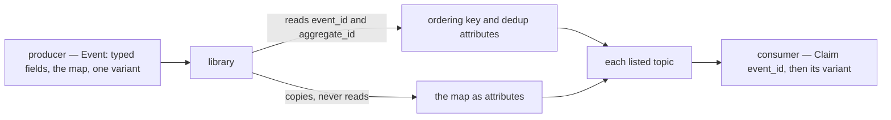

### What it changes in code

- `san_event.Event` reads the envelope: `GetEventId()` as shipped · `occurred_at` becomes a `Timestamp`,
  so `GetOccurredAtUnix()` and the dedup column change with it.
- selling's two live events carry `event_id = 98` and `occurred_at_unix = 99` on themselves. When they
  become variants both move to the envelope, and the old numbers are `reserved`.
- ⚠ An empty `event_id` still dedups everything against `""`: `min_len` rejects it at send, and the
  receiver treats an empty id as `Invalid`. Both are load-bearing.

### The guideline sites it overrides

[`event_library.md`](../../../guidelines/architectures/event_library.md) nests the metadata in a shared
`EventMetadata meta = 1`. With ONE envelope there is nothing to share it with, so the fields sit on `Event`
itself. Reported, not edited — like [superseded-one-event-many-topics's](#the-guideline-this-overrides):

| guideline | says | now |
| --- | --- | --- |
| [§3 Shared metadata](../../../guidelines/architectures/event_library.md#3-shared-metadata) · [meta-at-one-payload-at-hundred](../../../guidelines/architectures/event_library.md#meta-at-one-payload-at-hundred) | an `EventMetadata` message in `event_base.v1`, at `meta = 1` | typed fields at 1–3 on `Event`, the map at 4 |
| [breaking-against-dev](../../../guidelines/architectures/event_library.md#breaking-against-dev) | the build fails when *"any envelope's `meta` field is absent or not at tag 1"* | `event_id` at tag 1 |
| [§12](../../../guidelines/architectures/event_library.md#12-what-this-changes-in-the-code) | `san_event.Event` becomes `GetMeta()`, and *"a nil `meta` must be rejected"* | `GetEventId()` on the envelope — the shipped method — and an empty id is rejected instead |
| [§7 Consuming](../../../guidelines/architectures/event_library.md#7-consuming) · §4's example | `meta.event_id` · `ordering_key_field: "meta.aggregate_id"` | `event_id` · `aggregate_id` |

The commit that records this decision names `meta-at-one-payload-at-hundred` in its override note.

---

## one-contract-for-both-handler-types

**`EventPushHandler` and `EventPullHandler` share one contract, written ONCE above both: `nil` ACKs · an
error retries · a variant the handler does not handle returns `nil` · it claims `event_id` inside its own
transaction.** (owner, 2026-09-11 — *"for q10 yes"*, answering [Q10](./context_clarify.md#question))

✅ As recommended. The two type names are the owner's (`context.md` §How Event Received) and stay — one
signature, so a service's handler converts to either.

### Why

The drivers differ only in how a message arrives. A rule stated beside one type is a rule the other
type's adopters never read — and the last two rules fail silently when unstated.

### The spec

| # | the handler | the driver then | without the rule |
| --- | --- | --- | --- |
| 1 | returns `nil` | ACKs | — |
| 2 | returns an error | NACKs — redelivered, and dead-lettered after 5 attempts once the subscription has its DLQ ([Q5](./context_clarify.md#question) — ✅ since decided, [setup-ensures-safe-defaults-never-deletes](#setup-ensures-safe-defaults-never-deletes)) | — |
| 3 | meets a variant it does not handle, and returns `nil` | ACKs | an error retries a message nothing here will ever handle — other producers' events, forever |
| 4 | calls `Claim(event_id)` in its OWN transaction, beside its write | — | claimed apart from the write, a crash between them either suppresses work that never committed or repeats work that did |

Rule 4 is [dedup-and-compute-share-one-transaction](../../business/settlement/context_decision.md#dedup-and-compute-share-one-transaction)
made general: the library ships `Claim`, the handler builds the flow. Rules 2–4 agree with the guideline's
[reject-never-nacks](../../../guidelines/architectures/event_library.md#reject-never-nacks) — this ratifies it.

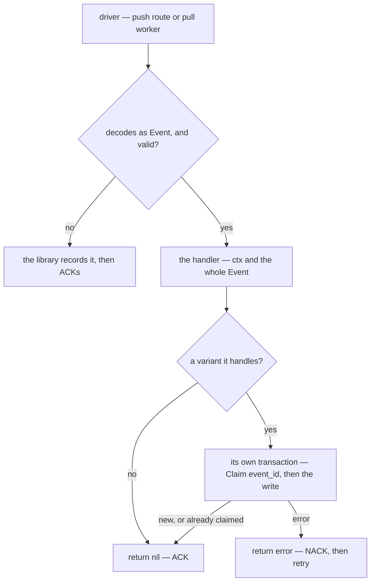

### What this does NOT settle

- the library's receive path — one route through `san_event.Receiver` for both drivers, with the rejection
  record and the repeated-failure layer — a programmer's call
  ([the receive half](./context_clarify.md#the-receive-half-is-built-twice-and-wired-once))
- the attempt count — 5 is the default [Q5](./context_clarify.md#question) proposes. ✅ Since decided — [setup-ensures-safe-defaults-never-deletes](#setup-ensures-safe-defaults-never-deletes)

---

## push-routes-are-open-by-default

**`NewMuxPushHttpHandler` verifies no token. Any caller that can reach a service's push route can POST an
event, and its handler processes it.** (owner, 2026-09-11 — *"for q11 no"*, answering
[Q11](./context_clarify.md#question): *verify the push token by default, with an opt-out settlement
passes?*)

⛔ **Against my recommendation.** It extends
[the-event-webhook-is-open](../../business/settlement/context_decision.md#the-event-webhook-is-open) from
settlement to every service that adopts the push recipe.

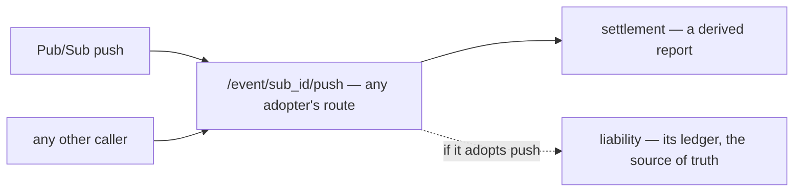

### What this accepts, recorded so it is a decision rather than a discovery

| adopter | what a forged POST writes | repair |
| --- | --- | --- |
| settlement | a derived report | `AnalyticReplayCompute` rebuilds it from the log |
| a service whose handler writes a source of truth — liability's `ChargeOrder` today | the truth itself | none — there is nothing to rebuild it from |

⚠ **One sentence in shipped code holds only while liability has no push route.**
[`liability_service/register.go`](../../../backend/services/liability_service/register.go): *"THE LEDGER'S
WRITE PATH HAS NO WIRE SURFACE AT ALL … nothing outside this system may assert that one team owes
another."* A push route under this decision is that wire surface.

### Still free, and changing nothing decided

- **the ingress** — a platform rule that admits only Pub/Sub, the mitigation
  [the-event-webhook-is-open](../../business/settlement/context_decision.md#the-event-webhook-is-open)
  already recommends
- **pull** — a pull worker has no inbound route to forge, so a consumer that writes a source of truth keeps
  the sentence above true by consuming through `ListenSubscriber`

Not settled, and not asked: whether the library offers verification as an OPT-IN. Nothing needs it today.

---

## one-adopter-checklist-for-both-drivers

**A service adopts events through ONE checklist, whichever driver it picks: a named handler type for the
service, its Wire provider, a push route in `register.go` at `/event/<sub_id>/push` or a pull worker in a
`Run(ctx)`, its subscriptions declared once, its own dedup table, and a test per variant it handles.**
(owner, 2026-09-11 — *"for q12 yes"*, answering [Q12](./context_clarify.md#question))

✅ As recommended. It completes the owner's two *"what need to be impelemented in service that adopt
this design"* recipes rather than replacing them.

### The spec

| # | step | the owner's recipe | completed |
| --- | --- | --- | --- |
| 1 | a named handler type | `type SettlementEventPushHandler san_event.EventPushHandler` | a DEFINITION, never `=` — Wire tells services apart by type. Named for the service, not the driver: `SettlementEventHandler` |
| 2 | its Wire provider | `NewSettlementEventPushHandler(...)` | returns the named type |
| 3 | the push route | `NewSettlementEventPushHttpHandler` — *"register freely"* | mounted in the service's `register.go` at `/event/<sub_id>/push`, never listed in `wire.Build` — a bare `http.HandlerFunc` collides there on the second adopter |
| 4 | the pull worker | `ListenSubscriber(..., subid, handler)` | inside the service's `Run(ctx) error` — [pull-worker-is-bounded-and-fails-loudly](#pull-worker-is-bounded-and-fails-loudly) |
| 5 | its subscriptions | — | declared ONCE, beside the handler — the route, the worker and `InitializeSubscriber` all read it |
| 6 | its dedup table | — | a migration in its own `db_migrations/` (HARD RULE 3) — `event_id` unique, `occurred_at`, `received_at` — then `NewDedup(table)` |
| 7 | a test per variant it handles | — | calls the handler with a built `Event`, on `san_testdb` — no HTTP, no broker |

The route is half of the push subscription's endpoint and must match it character for character — drift
loses every event with nothing failing. A route carrying the SHORT subscription id also fixes the
full-path defect: a real push names its subscription `projects/…/subscriptions/…`.

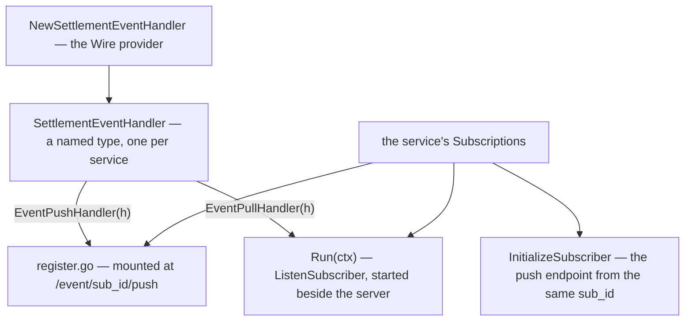

```go
// settlement_service — steps 1, 2 and 5
type SettlementEventHandler san_event.EventPushHandler // a DEFINITION, never `=`

var Subscriptions = []san_event.Subscription{{
	ID:    "settlement-fold", // the route, InitializeSubscriber and ListenSubscriber all read this
	Topic: "settlement",      // must be a topic some variant lists — checked at startup, never trusted
}}

func NewSettlementEventHandler(db *gorm.DB, dedup san_event.EventDedup) SettlementEventHandler {
	return func(ctx context.Context, event *eventsv1.Event) error {
		posted := event.GetSettlementLogPosted()
		if posted == nil {
			return nil // another producer's variant — ACK it
		}

		return db.Transaction(func(tx *gorm.DB) error {
			isNew, err := dedup.Claim(ctx, tx, event) // the SAME transaction as the fold
			if err != nil || !isNew {
				return err
			}

			return fold(ctx, tx, posted)
		})
	}
}
```

### What it changes in shipped code

| site | today | under this decision |
| --- | --- | --- |
| [`inventory_service/register.go:30`](../../../backend/services/inventory_service/register.go#L30) | `/events/inventory`, serving a handler that ACKs everything | `/event/<sub_id>/push` |
| [`liability_service/push_handler.go`](../../../backend/services/liability_service/push_handler.go) | switches on subscription-name constants — a real push's full path matches none, and `default:` ACKs | switches on the variant · its subscriptions declared once |
| [`cmd/app_development/event_sender.go`](../../../backend/cmd/app_development/event_sender.go) | the topic → subscription → handler map, typed again by hand | reads the services' declarations |
| every consuming service | no dedup table | step 6 |

### What this does NOT settle

- the declaration's exact type — `Subscription{ID, Topic}` is a sketch. A filter is immutable once created,
  so whether one belongs in it is the programmer's call
- which driver a service uses — [push-routes-are-open-by-default](#push-routes-are-open-by-default) is why
  a consumer that writes a source of truth may prefer pull

---

## pull-worker-is-bounded-and-fails-loudly

**`ListenSubscriber` returns only when its ctx is cancelled — any other return ends the process — and it
runs a bounded number of handlers at once, with a small default.** (owner, 2026-09-11 — *"for q13 yes"*,
answering [Q13](./context_clarify.md#question))

✅ As recommended.

### Why

Pub/Sub's `Receive` *"blocks until ctx is done, or the service returns a non-retryable error"*. A missing
subscription or a revoked permission returns ONCE, and a service that logs it and carries on has stopped
consuming while `/healthz` stays green. And the client *"will spawn new goroutines for incoming messages,
limited by MaxOutstandingMessages"* — **1000** by default (v2.6.1), each handler opening a transaction.

### The spec

| | |
| --- | --- |
| returns `nil` | only when ctx is cancelled — after in-flight handlers finish, which `Receive` already waits for |
| returns an error | the process exits non-zero, so the platform restarts it and the failure shows |
| who runs it | the service's `Run(ctx) error`, started by the binary beside the HTTP server, cancelled on shutdown |
| concurrency | a parameter with a small default, sized to the database pool — never the client's 1000 |

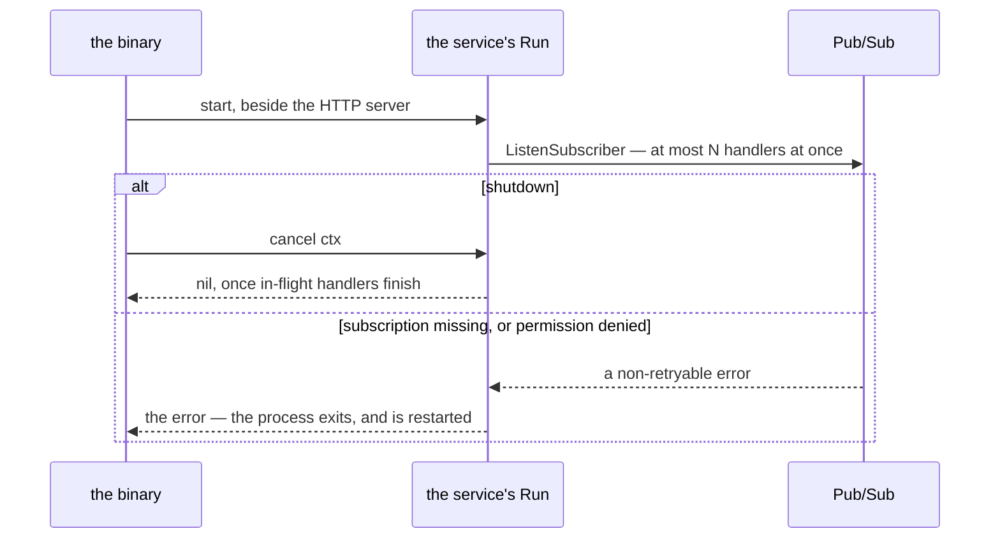

### What this does NOT settle

- the number — a tuning value, the programmer's call. The rule is *sized to the pool*
- ⚠ the pool itself is unbounded: `NewDatabase` never calls `SetMaxOpenConns`
  ([deps.go](../../../backend/cmd/app_development/deps.go)), so the API alone can exhaust Postgres's 100
  connections too. A separate fix, not an event question

---

## ordering-is-each-services-job

**For now the library sets no ordering key. A race between events — a cancel delivered before its
placement — is the consuming service's to handle. The library's job is functions that publish and
subscribe.** (owner, 2026-09-11 — *"for now there is no order key, for race condition, its service
responsbility, we focus on provide function that can publish and subscribe event"*, answering
[Q8](./context_clarify.md#question))

⛔ **Against my recommendation** of a key per topic. It follows the line of
[initialize-topic-is-a-function-not-a-flow](#initialize-topic-is-a-function-not-a-flow): the library ships
functions, and policy belongs to the service that calls them.

### The spec

| | |
| --- | --- |
| the sender | publishes with no `OrderingKey` — every topic, every event |
| delivery | in any order: two events about one order can arrive cancelled, then placed |
| every consumer | tolerates any arrival order. How is its own call |
| *"for now"* | a key added later orders only what is published after it |

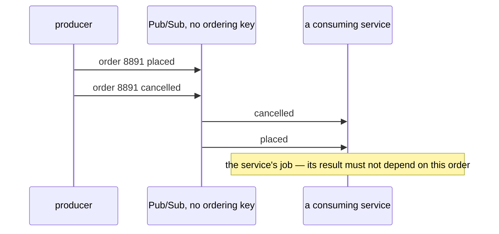

Two shapes a service can take — both its own call:

| its handler | how order stops mattering | example |
| --- | --- | --- |
| adds and subtracts | a sum is the same in any order | settlement — every write is a delta, and the cascade shifts every later day when a row arrives late |
| moves a state | record the later state, and have the earlier event check for it | a cancel that arrives first is recorded, so a late placement does not charge |

### What it changes

- `aggregate_id` ([typed-fields-for-what-the-library-reads](#typed-fields-for-what-the-library-reads)) was
  typed as the default ordering key, and now has no library reader. It stays required — so a key added
  later is a change to the publisher, not a new field on every event.
- `InitializeSubscriber`'s *"ordering on"* ([Q5](./context_clarify.md#question), open — ✅ since decided, [setup-ensures-safe-defaults-never-deletes](#setup-ensures-safe-defaults-never-deletes)) orders nothing while no
  message has a key. The flag is fixed at creation, though, so on is what lets a later key take effect
  without recreating subscriptions.
- the outbox ([Q2](./context_clarify.md#question), open) is no longer a fix for reordering — only for loss and
  a partial fan-out. ✅ Since decided — no outbox: [no-outbox-the-publish-is-trusted](#no-outbox-the-publish-is-trusted).

### What it leaves — one consumer does not meet it yet

⚠ **Liability charges a cancelled order when the cancel arrives first.**
[`ReverseOrder`](../../../backend/services/liability_service/liability_v1/order_fees.go#L196) reverses the fees
it finds charged; with none charged yet it reverses nothing and ACKs, and the late placement then charges
in full — permanently. Latent today: liability receives only through the in-process dev loopback. Under
this decision it is liability's to fix before it reads from a real subscription.

### The guideline sites it overrides

| guideline | says | now |
| --- | --- | --- |
| [topic-per-context](../../../guidelines/architectures/event_library.md#topic-per-context) | its reason is ordering — *"One topic plus an ordering key makes that sequence impossible"* | no key: the sequence is possible, and each service handles it |
| [reuse-event-config-50001](../../../guidelines/architectures/event_library.md#reuse-event-config-50001) | `ordering_key_field = 2`, new | not added |
| [§6 Publishing](../../../guidelines/architectures/event_library.md#6-publishing) | the ordering key is derived from `ordering_key_field`, and its absence is an **error** | no key is set |

[no-sequence-field](../../../guidelines/architectures/event_library.md#no-sequence-field) is untouched — it
forbids an envelope sequence for gap detection, not a service's own version field. The commit that records
this decision names the three rules above in its override note.

---

## one-event-one-topic-per-variant

**One global `Event` in `warehouse.events.v1` stays — and each variant names exactly ONE topic.** (owner,
2026-09-11 — *"im change ## Event Proto Definition section and cancel multi topic"*: `context.md` §Event
Proto Definition 3–4 now read `EventConfig { string topics }` and `topics: "order"`)

✅ **Closer to my original recommendation** — a topic per stream, and a second consumer is a second
subscription. It reverses the topics-LIST half of
[superseded-one-event-many-topics](#superseded-one-event-many-topics); that entry's global-`Event` half
stands.

### The spec

```protobuf
package warehouse.events.v1;

message EventConfig {
  string topics;                          // ONE topic — since renamed `topic`: the-option-field-is-topic
}

extend google.protobuf.MessageOptions {
  EventConfig event_config;               // number open — Q9
}

message OrderCreated { option (event_config) = { topics: "order" }; }   // the owner's example
message OrderCancel  { option (event_config) = { topics: "order" }; }

message Event {
  map<string, string> metadata;           // + the typed fields of typed-fields-for-what-the-library-reads
  oneof message {
    OrderCreated order_created;
    OrderCancel  order_cancel;
  }
}
```

| | |
| --- | --- |
| envelope | one global `Event` — unchanged |
| routing | ONE topic per variant, read off the set variant |
| publish | ONE per event — the broker fans out, to one subscription per consumer, atomically |
| a second consumer | a second subscription on the same topic, filtered on `event_type` to the variants it handles — no change to the producer |
| mandatory | every variant names its topic (§5) |

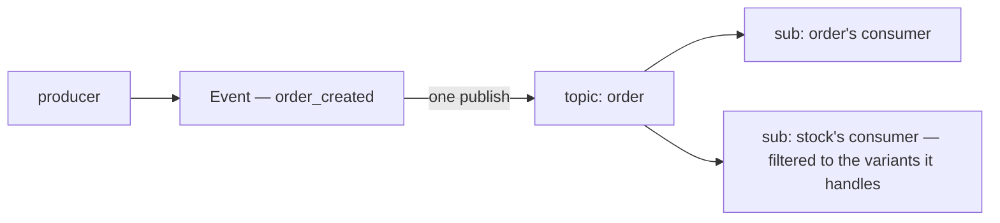

### What it removes, and what stays

| a cost of the multi-topic shape | now |
| --- | --- |
| fan-out is one publish per topic, so it is not atomic | ✅ gone — one publish, and the broker's fan-out to subscriptions is atomic |
| the producer must know its consumers | ✅ gone — a new consumer subscribes, and the producer does not change |
| one message carries one ordering key, and each topic wants its own | ✅ moot — and no key is set anyway ([ordering-is-each-services-job](#ordering-is-each-services-job)) |
| one `oneof` number space for every context | ⚠ stays — it comes with the global `Event` |
| every consumer compiles against every domain | ⚠ stays — the same |
| a second option called `event_config` | ⚠ stays open as [Q9](./context_clarify.md#question) — and simpler now: the shipped `event_config` at 50001 already carries ONE `event_topic` string. ✅ Since decided: [event-base-v1-is-removed](#event-base-v1-is-removed) |

### What this does NOT settle

- ⚠ §Event Proto Definition item 5 still shows `topics: ["stock", "order"]` — a list, against item 3's
  `string topics`. Reported in the clarify's
  [Contradiction](./context_clarify.md#contradiction), not resolved here
- which option carries the topic — [Q9](./context_clarify.md#question)
- the outbox — [Q2](./context_clarify.md#question), now a fix for a lost event only. ✅ Since decided — no
  outbox: [no-outbox-the-publish-is-trusted](#no-outbox-the-publish-is-trusted)

### The guideline

This moves back TOWARD the guideline:
[reuse-event-config-50001](../../../guidelines/architectures/event_library.md#reuse-event-config-50001) already
specifies one `event_topic` string at 50001. Of
[superseded-one-event-many-topics's override note](#the-guideline-this-overrides), the envelope rows still hold
(a global `Event`, the option on the variants); the topic rows now read *one topic per variant* rather than
*a list* — and variants of one context may share it, as `order` does, which is close to
[topic-per-context](../../../guidelines/architectures/event_library.md#topic-per-context) in practice.

---

## event-base-v1-is-removed

**`warehouse.event_base.v1` is removed, and nothing uses it going forward. The topic option lives in
`warehouse.events.v1`, as `context.md` §Event Proto Definition 3 already says.** (owner, 2026-09-11 —
*"remove warehouse.event_base.v1, its not used for further"*, answering [Q9](./context_clarify.md#question))

⛔ **Against my recommendation** of reusing the shipped option. It was platform scaffolding from the first
commit (`8c8b91b`, 2026-07-13), never designed through the requirement docs — the shape matching was a
coincidence, not a reason.

### The spec

| | |
| --- | --- |
| the option | `warehouse.events.v1.event_config` — `EventConfig { string topics }`, the owner's sketch. ✅ Since renamed `topic` — [the-option-field-is-topic](#the-option-field-is-topic) |
| the old package | `proto/warehouse/event_base/v1/` deleted — `MessageEventConfig`, its extension at 50001, and `HelloExampleEvent` |
| at no point | do both options exist at once — the delete and the move are ONE change, or some events carry an option `TopicName()` never reads |

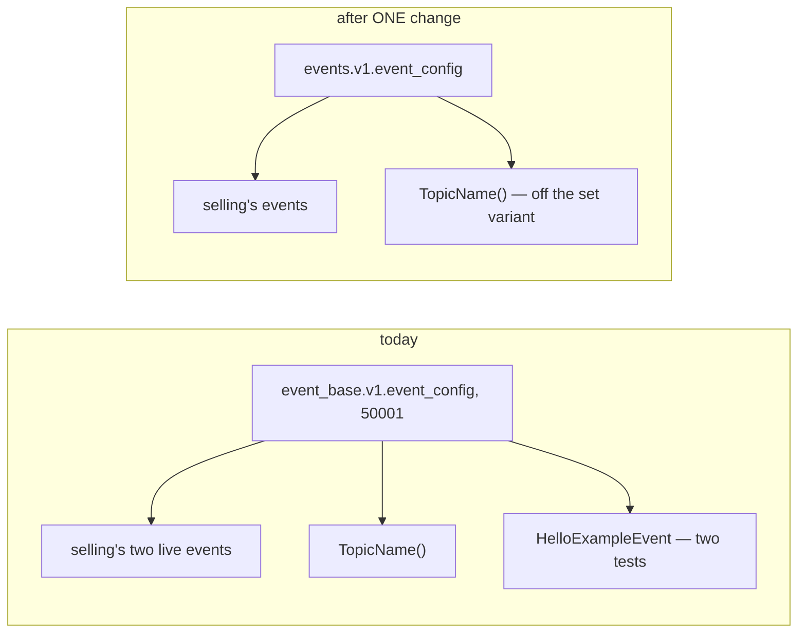

### What the removal change must carry, or the build breaks

| site | today | in the same change |
| --- | --- | --- |
| [`selling/v1/events.proto`](../../../proto/warehouse/selling/v1/events.proto) lines 35 and 125 | `(warehouse.event_base.v1.event_config).event_topic` = `order-placed` · `order-cancelled` | the new option |
| [`event_source.go`](../../../backend/pkgs/event_source/event_source.go) lines 63–67 | `TopicName()` reads `event_basev1.E_EventConfig` | reads the new extension |
| `event_source_test.go` · `san_caches_test.go` | `HelloExampleEvent` as a fixture | another message |
| `backend/gen/…/event_base` · `frontend/src/gen/…/event_base` | generated | gone after `buf generate` |
| `CLAUDE.md` §Proto options carry policy, and its Events example · [`docs/faq/contract.md`](../../faq/contract.md) | name `event_base.v1.event_config` at 50001 | the new option |

### What this does NOT settle

- **the new extension's number.** 50001 frees up in the same change, and I would reuse it: `CLAUDE.md`'s
  table keeps its number, and 50002 (`request_policy`, planned) is never crossed. Options are read at
  compile time, so reusing the number strands nothing.
- **the field's name** — `topics` holds one string
  ([the contradiction](./context_clarify.md#the-examples-still-write-topics)).
  ✅ Since decided — `topic` ([the-option-field-is-topic](#the-option-field-is-topic)).

### The guideline sites it overrides

| guideline | says | now |
| --- | --- | --- |
| [reuse-event-config-50001](../../../guidelines/architectures/event_library.md#reuse-event-config-50001) | keep the option in `event_base.v1` — *"adding fields to the existing nested message satisfies the same intent"* | the option moves to `warehouse.events.v1`, and the old one is deleted |
| [§3 Shared metadata](../../../guidelines/architectures/event_library.md#3-shared-metadata) | *"Lives in `warehouse.event_base.v1` — the event-contract package that already owns the option"* | that package is removed |

The commit that records this decision names `reuse-event-config-50001` in its override note.

---

## the-option-field-is-topic

**`EventConfig`'s field is `topic`, singular — one string, named for what it holds.** (owner, 2026-09-11 —
`context.md` §Event Proto Definition 3, line 45, edited from `string topics` to `string topic`)

It closes the field-name point [event-base-v1-is-removed](#event-base-v1-is-removed) left open, and matches
[one-event-one-topic-per-variant](#one-event-one-topic-per-variant): a variant names ONE topic, so the field
holds one.

### The spec

```proto
// proto/warehouse/events/v1/ — the option the removal change creates
message EventConfig {
  string topic = 1;                          // ONE topic; empty is a defect (§5)
}

extend google.protobuf.MessageOptions {
  EventConfig event_config = 50001;          // the number is still open — reuse is recommended
}

message OrderCreated { option (event_config) = { topic: "order" }; }
message OrderCancel  { option (event_config) = { topic: "order" }; }
```

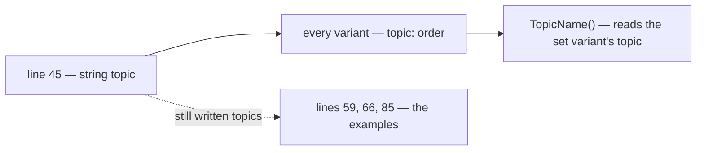

⚠ **The doc's examples still write `topics:`** — lines 59, 66 and 85 — and `protoc` rejects a field name the
message does not declare. Reported in the clarify as
[the examples still write topics](./context_clarify.md#the-examples-still-write-topics), not edited.

### What it changes in the removal change

The option the [event-base-v1-is-removed](#event-base-v1-is-removed) change creates is `EventConfig { string topic = 1; }`,
and selling's two events move from `event_topic` to `topic`. Nothing else in that change's site list moves.

---

## no-outbox-the-publish-is-trusted

**No outbox. A producer publishes after its commit through `EventSender`, and the architecture assumes the
publish succeeds; from there, delivery is Pub/Sub's responsibility.** (owner, 2026-09-11 — *"for q2, we assume
publisher is always publish message properly, and its pubsub responsbility"*, answering
[Q2](./context_clarify.md#question))

⛔ **Against my recommendation** of an opt-in `Enqueue` + `RunRelay` pair. The library ships neither, and no
service carries an `event_outbox` table.

### The spec

| | |
| --- | --- |
| the producer | commits, then calls `EventSender` — the shape `order_place.go` already has |
| retrying a failed publish | the Pub/Sub client's own — it retries a bundle for up to `PublishSettings.Timeout`, **60 s** by default (v2.6.1 `DefaultPublishSettings`). The library adds no retry of its own |
| after the broker accepts | at-least-once delivery, Pub/Sub's — and the consumers' `Claim` on `event_id` ([one-contract-for-both-handler-types](#one-contract-for-both-handler-types)) absorbs the duplicates |
| the library | ships no `Enqueue`, no relay, no outbox migration |

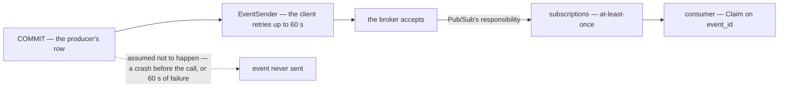

### What it accepts, stated once

The one path this decision does not cover — a process that dies between `COMMIT` and the call, or a publish
that still fails after the client's retries — leaves a committed row whose event was never sent, with no
record of it beyond a log line. That is accepted as the cost; it is written here so a later incident is read
as this trade-off, not as a surprise.

Two existing proposals already survive it without an outbox, and are unchanged by it:

- **settlement / analytic** — [log-is-the-source-broker-is-the-trigger](../../business/analytic/context_clarify.md#log-is-the-source-broker-is-the-trigger)
  (proposed): the event only wakes a worker that folds from the log by cursor, so a lost event delays a
  number rather than losing it.
- **order** — [order Q14](../../business/order/context_clarify.md#question) (open): a finder over committed
  orders whose follow-on never happened, owned by `order_service`.

### Ripples — sites that recommended an outbox

| site | now |
| --- | --- |
| this clarify — *the commit-to-publish gap*, *the outbox for Q2*, the Proposed Design's durability row | deleted or rewritten |
| [stock critique 3](../stock/design_clarify.md#critique) — a transactional outbox for the three stock flows | annotated: decided the other way here |
| [ledger critique 5](../ledger/mutation_and_ledger_clarify.md#critique) — an outbox, or reconcile as recovery | annotated |
| [balance critique 4](../balance/team_balance_design_clarify.md#critique) — *"the road already paved: transactional outbox"* | annotated — the road is not paved |
| [order Q14](../../business/order/context_clarify.md#question) — its event leg | unchanged question; a pointer to this decision beside the leg |

No guideline rule mentions an outbox, so none is overridden.

---

## the-sender-takes-ctx

**`EventSender` takes a `context.Context` first: `type EventSender func(ctx context.Context, event Event) error`.**
(owner, 2026-09-11 — `context.md` §Event Sender Contract 1, line 20, edited from `func(event Event) error`,
taking the `ctx` half of [Q6](./context_clarify.md#question))

✅ As recommended, for that half. All three contracts in the doc — the sender and both handler types — now
take `ctx`.

### What it carries

| rides on `ctx` | why the sender needs it |
| --- | --- |
| the trace | published as message attributes, so a consumer's span links back to the request that caused the event |
| the caller's identity | what `san_auth.GetIdentity(ctx)` returns — the sender can fill `Event.identity` from it instead of every call site ([Q14](./context_clarify.md#question)) |
| cancellation | ⚠ the request's — see below |

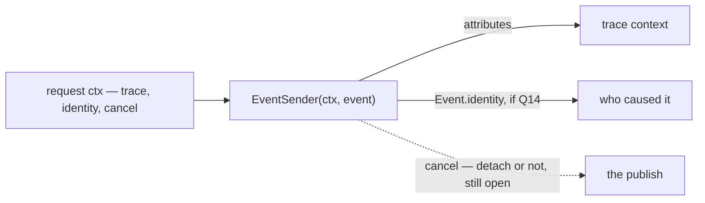

### What this does NOT settle — still [Q6](./context_clarify.md#question)

- **`Event` by value** — line 20 still passes `event Event`, which `go vet` rejects for a generated message;
  `*eventsv1.Event` is recommended. ✅ Since changed on line 20 — [the-sender-takes-a-pointer](#the-sender-takes-a-pointer).
- **what `nil` means** — recommended: the broker accepted it. Under
  [no-outbox-the-publish-is-trusted](#no-outbox-the-publish-is-trusted) that is the whole guarantee.
- **whose cancellation the publish obeys** — recommended: detach inside (`context.WithoutCancel` plus a
  timeout), so a client disconnect cancels the WAIT, never the send.
- **a cleanup from `NewEventSender`** — ✅ since decided, none: [publisher-and-client-shutdown-is-the-services](#publisher-and-client-shutdown-is-the-services) — the shipped sender opens a publisher per event and stops none
  ([sender.go:63](../../../backend/pkgs/event_source/sender.go#L63)).

---

## setup-functions-are-a-developer-tool

**`InitializeTopic` and `InitializeSubscriber` are a DEVELOPER's tool — run to set up topics and
subscriptions and ensure they exist and are configured properly. A service does not run them at boot.**
(owner, 2026-09-11 — *"that 2 function its for tool for developer to setup & ensure topic and subscriber
exists and configure properly"*)

It narrows [initialize-topic-is-a-function-not-a-flow](#initialize-topic-is-a-function-not-a-flow): the
functions stay library functions, and their intended caller is now named — a developer, not a running
service.

### The spec

| | |
| --- | --- |
| who runs them | a developer, against the emulator locally or a real project — with the developer's own credentials |
| what they do | **ensure**: create what is missing, and configure what exists to the declared settings — re-runnable, so running twice changes nothing the second time |
| a running service | publishes and subscribes only — it needs `roles/pubsub.publisher` and `roles/pubsub.subscriber`, **never admin** |

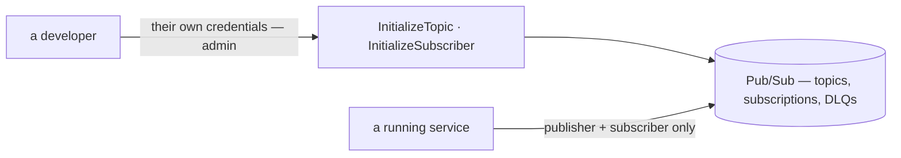

### What it settles

- ✅ **the admin-at-boot risk** [initialize-topic-is-a-function-not-a-flow](#initialize-topic-is-a-function-not-a-flow)
  flagged is gone: no running instance holds `setIamPolicy`.
- ✅ *"ensure … configure properly"* is the compare-and-update half of [Q5](./context_clarify.md#question):
  what exists is brought to the declared settings, not only created when missing.

### What it does NOT settle — still [Q5](./context_clarify.md#question)

✅ Since decided, except where the tool lives — [setup-ensures-safe-defaults-never-deletes](#setup-ensures-safe-defaults-never-deletes).

- **the defaults** that *"properly"* means, and what happens to a setting Pub/Sub cannot change after
  creation (topic, filter, ordering) — recommended: refuse, never delete.
- **what a service does when the developer has not run it yet** — a push route with no subscription
  receives nothing and reports nothing. ✅ Since decided — nothing: [services-do-not-verify-setup-at-boot](#services-do-not-verify-setup-at-boot).
- **where the tool lives** — recommended: a `tools/san` command, HARD RULE 3b's one CLI.

---

## services-do-not-verify-setup-at-boot

**A service does not check, at boot, that its topics and subscriptions exist. Setting them up is the
developer's job, done with the setup tool — [setup-functions-are-a-developer-tool](#setup-functions-are-a-developer-tool).**
(owner, 2026-09-11 — *"no need verify subscriber in boot"*, answering part 5e of [Q5](./context_clarify.md#question))

⛔ **Against my recommendation** of a read-only `VerifySubscriber` called at boot. The library ships no
such function.

### What it accepts, stated once

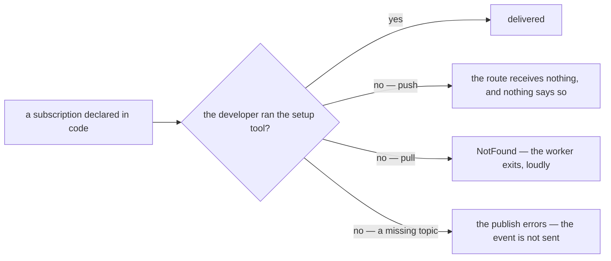

| driver | when the tool was not run |
| --- | --- |
| push | **silent** — the route is mounted and never called. Found when someone notices the numbers have not moved |
| pull | loud — `ListenSubscriber` returns and the process exits ([pull-worker-is-bounded-and-fails-loudly](#pull-worker-is-bounded-and-fails-loudly)) |
| publish | an error at the call — under [no-outbox-the-publish-is-trusted](#no-outbox-the-publish-is-trusted), a lost event |

Accepted as the cost: running the setup tool is part of shipping a new subscription or topic, like running a
migration is part of shipping a new table.

---

## setup-ensures-safe-defaults-never-deletes

**`InitializeTopic` and `InitializeSubscriber` ENSURE: create what is missing with safe defaults built in,
update what may change, and refuse — never delete — what Pub/Sub cannot change. A third function,
`Redrive`, brings dead-lettered events back.** (owner, 2026-09-11 — *"its clear for this question"*,
confirmed as *"accept all of Q5"*, answering [Q5](./context_clarify.md#question) parts 5a–5d)

✅ As recommended. Run by a developer ([setup-functions-are-a-developer-tool](#setup-functions-are-a-developer-tool)),
never checked at boot ([services-do-not-verify-setup-at-boot](#services-do-not-verify-setup-at-boot)).

### The spec

```go
// InitializeTopic makes every topic the PROTO declares exist — the set of every Event variant's
// event_config.topic, walked from the descriptor, so no caller passes a list it could get wrong. Each topic
// gets 31-day retention, a <topic>.dlq, and a <topic>.dlq.triage subscription that never expires.
func InitializeTopic(ctx context.Context, client *pubsub.Client, opts TopicOptions) error

// InitializeSubscriber makes ONE service's declared subscriptions exist, with the safe defaults built in.
// It never creates a topic: a subscription whose topic is missing is an error — run InitializeTopic first.
func InitializeSubscriber(ctx context.Context, client *pubsub.Client, subs []Subscription, opts SubscriberOptions) error

// Redrive pulls every message from <topic>.dlq.triage, re-publishes it to <topic> unchanged, and acks it.
// Safe to run twice — every consumer Claims on event_id. Run by a person once the cause is fixed, never on
// a schedule, which would loop a message that still fails.
func Redrive(ctx context.Context, client *pubsub.Client, topic string) error

type Subscription struct { // the adopter checklist's declaration, one filter field added
	ID     string // "settlement-fold" — the route, InitializeSubscriber and ListenSubscriber all read it
	Topic  string // must be a topic some variant names — checked, never trusted
	Filter string // optional, IMMUTABLE once created
}

type SubscriberOptions struct {
	PushBaseURL         string // "" = a pull subscription · else <PushBaseURL>/event/<ID>/push
	ProjectNumber       int64  // names the Pub/Sub service agent the DLQ grants go to
	MaxDeliveryAttempts int32  // 5 — Pub/Sub's floor and default, and the guideline's
	PushAckDeadline     int32  // 60 s — for push it is also the HTTP timeout; Pub/Sub's default is 10
}
```

**What each finds, and what it does:**

| setting | missing | exists, same | exists, different |
| --- | --- | --- | --- |
| topic · retention · DLQ · triage sub | create | nothing | update retention |
| subscription | create, with every default below | nothing | per row |
| its topic · `filter` · `enable_message_ordering` | — | — | ⛔ **refuse**, naming the subscription and the field — Pub/Sub cannot change them |
| `dead_letter_policy` · `expiration_policy` · push endpoint · ack deadline · retry policy | — | — | update |
| a subscription that exists but is NOT declared | — | — | leave it, log it — **never delete** |

**The defaults, built in:**

| default | what it prevents, silently otherwise |
| --- | --- |
| `dead_letter_policy` → `<topic>.dlq`, 5 attempts, plus two grants to the service agent — publisher on the DLQ, subscriber on the source sub | a failing message redelivers forever, and every delivery attempt reads `0`. Without the grants nothing dead-letters, and no error says so |
| `expiration_policy` with no `ttl` | deletion after 31 idle days — the triage sub first, quiet exactly when things are healthy |
| `enable_message_ordering` on | fixed at creation; orders nothing while no key is set ([ordering-is-each-services-job](#ordering-is-each-services-job)), and lets a later key work without recreating every subscription |
| the DLQ's triage subscription | *"messages published to a topic with no subscriptions are lost"* |
| `retry_policy` — backoff 10 s → 600 s | unset, Pub/Sub redelivers *"as soon as possible"* — a 30-second outage burns all 5 attempts and dead-letters good events |
| push `ack_deadline_seconds` 60 | for push it is also the HTTP timeout, 10 s by default — a slower fold is cancelled, rolls back, and lands in the DLQ after five tries. Pull is unaffected: its client extends the deadline up to 60 min |

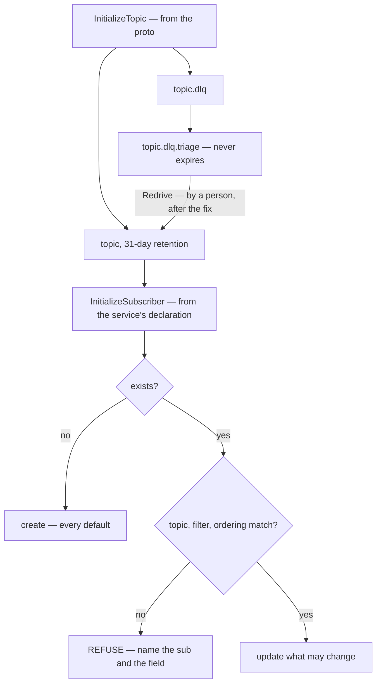

**What reaches the DLQ.** A message whose **handler** keeps returning an error — past 5 attempts. A message
that cannot be decoded or fails validation never gets there: the receiver records it and ACKs
([reject-never-nacks](../../../guidelines/architectures/event_library.md#reject-never-nacks)).

**A refused mismatch is fixed by a NEW id, never a delete.** Declare `settlement-fold-v2`, run the tool — it
seeks back into the topic's 31-day retention — move the handler over, and let a person delete the old one
once its backlog drains.

| permission | who holds it |
| --- | --- |
| create · get · update topics and subscriptions, `setIamPolicy` for the grants — `roles/pubsub.admin` | the developer running the tool |
| publish · consume | a running service — `roles/pubsub.publisher`, `roles/pubsub.subscriber`, never admin |

⚠ **The emulator has no IAM, expiry, configurable retention or `UpdateTopic`**, and keeps nothing across a
restart — so against it the grants are skipped (`PUBSUB_EMULATOR_HOST` set), and a run there proves
create-if-missing and nothing more.

### What this does NOT settle

- **where the tool lives** — recommended: `go run ./tools/san pubsub ensure`, behind `migrate`'s
  Local/Production prompt (HARD RULE 3b). A `tools/san` command also owes a section in `docs/tools/san.md`.

The guideline agrees — *"Every subscription has a dead-letter topic, max 5 delivery attempts"* — so no
guideline rule is overridden.

---

## the-sender-takes-a-pointer

**`EventSender` takes the event by pointer: `type EventSender func(ctx context.Context, event *eventsv1.Event) error`.**
(owner, 2026-09-11 — `context.md` §Event Sender Contract 1, line 20, edited from `event Event`, taking part
6a of [Q6](./context_clarify.md#question))

✅ As recommended. Every generated method is on `*Event`, so only the pointer is a `proto.Message` — the one
thing the sender can validate, marshal and read the topic from — and `go vet` rejects copying the value.

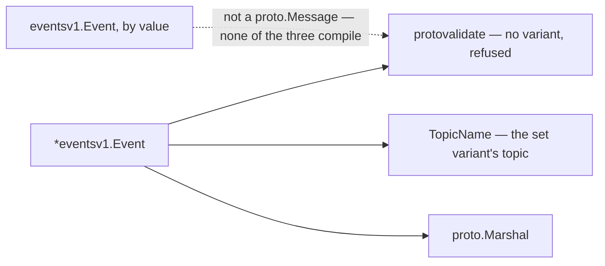

### What this does NOT settle

- ⚠ **the two handler types still take `event Event` by value** — lines 97 and 128. Reported in the clarify as
  [the handlers still take Event by value](./context_clarify.md#the-handlers-still-take-event-by-value).
- the rest of [Q6](./context_clarify.md#question) — 6b what an error means, 6c the detached wait, 6d one
  publisher per topic and a cleanup, 6e binary encoding. Line 25's `NewEventSender(...) EventSender` still
  returns no cleanup. ✅ 6b, 6c, 6d since decided — 6d as [publisher-and-client-shutdown-is-the-services](#publisher-and-client-shutdown-is-the-services).

---

## sender-ctx-carries-values-not-cancel

**The `ctx` an `EventSender` takes is there to CARRY VALUES — custom and optional ones, when a caller needs
them. It does not decide whether, or how long, the publish runs.** (owner, 2026-09-11 — *"6c, ctx its used
for bring custom and optional value if needed"*, answering part 6c of [Q6](./context_clarify.md#question))

✅ Part 6c, on the owner's framing. The sender reads what the `ctx` carries, then waits for the broker on
`context.WithoutCancel(ctx)` — which keeps every value and drops only the cancel and the deadline — bounded
by the client's own 60 s publish timeout.

### The spec

```go
// inside the sender — values in, cancellation out
attributes := MessageAttributeCarrier{}
otel.GetTextMapPropagator().Inject(ctx, attributes) // a value the ctx carries: the trace

waitCtx, cancel := context.WithTimeout(context.WithoutCancel(ctx), 60*time.Second)
defer cancel()

_, err = result.Get(waitCtx) // a client that left mid-request no longer turns a stored event into an error
```

| the `ctx` carries | read by the sender | its cancel or deadline |
| --- | --- | --- |
| the trace | ✅ published as attributes | ignored |
| the caller's identity | ✅ if [Q14](./context_clarify.md#question) says yes | ignored |
| anything else a caller puts there | ✅ if the sender knows its key | ignored |

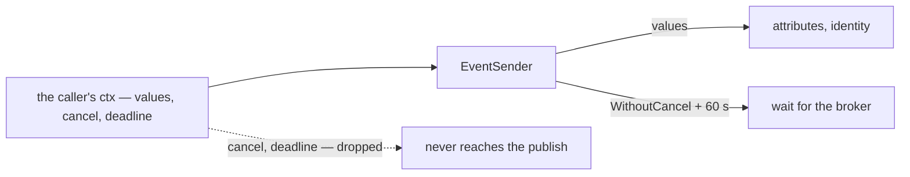

### What this does NOT settle

- **which values belong on the `ctx` at all.** Go's `context` package draws the line: *"Use context Values only
  for request-scoped data that transits processes and APIs, not for passing optional parameters to
  functions."* Reported in the clarify as part 6f of [Q6](./context_clarify.md#question).

---

## sender-returns-the-client-error-as-is

**The sender returns the error the Pub/Sub client returned, as it is — not wrapped, not classified.**
(owner, 2026-09-11 — *"we just care err that return pub sub client, return error as is"*, answering part 6b of
[Q6](./context_clarify.md#question))

⛔ **Against my recommendation** of wrapping every error with its `event_id` and topic, and two sentinels
(`ErrValidate`, `ErrNotStored`). The library adds nothing to an error.

### The spec

```go
_, err = result.Get(waitCtx) // waitCtx — sender-ctx-carries-values-not-cancel
return err                   // as is: nil means the broker stored it, anything else is the client's own error
```

| the caller wants to know | it reads the client's own value |
| --- | --- |
| the topic does not exist — the setup tool was not run | `status.Code(err) == codes.NotFound` |
| the service may not publish | `status.Code(err) == codes.PermissionDenied` |
| the broker never stored it in 60 s | `status.Code(err) == codes.DeadlineExceeded` |
| the event is too big | `errors.Is(err, pubsub.ErrOversizedMessage)` |
| it published during shutdown | `errors.Is(err, pubsub.ErrPublisherStopped)` |

```mermaid
flowchart LR
  G["result.Get"] -->|"nil"| OK["stored"]
  G -->|"err"| R["returned as is"]
  R --> C["the caller — reads status.Code or errors.Is, and logs its own event_id"]
```

A step before the publish — reading the variant's topic, marshalling, the validation the shipped sender runs —
returns its error the same way, unwrapped.

### What it moves to the caller

The error no longer says WHICH event. **The caller's log line carries the `event_id`** — as
[order_place.go](../../../backend/services/selling_service/selling_v1/order_place.go#L312) already logs its
`order_id`.

### What this does NOT settle

- **what a caller does with the error** — recommended in the clarify: after the commit a send error never
  fails the RPC · log it once, never loop · the repair is a backfill from the row. Each is already true of
  `order_place.go`.

---

## publisher-and-client-shutdown-is-the-services

**The library returns only the sender — `NewEventSender(client, ...) EventSender`, no cleanup. Stopping
publishers and closing the Pub/Sub client at shutdown are the SERVICE's responsibility.** (owner, 2026-09-11 —
*"for publishers' cleanup and other, its service responsbility"*, confirmed as *"stop publisher and close the
client"*, answering part 6d of [Q6](./context_clarify.md#question))

⛔ **Against my recommendation** of `NewEventSender(...) (EventSender, func(), error)` with a Wire cleanup that
stops every publisher. `InitializeApp` keeps its signature.

### The spec

| | the library | the service |
| --- | --- | --- |
| `NewEventSender` | returns only `EventSender` — no cleanup, no build-time error | — |
| stopping publishers | never | its responsibility |
| closing the client | never — the client was handed in, and may serve a pull worker too | its responsibility — optional at exit, per the client's own doc, and only after publishing has stopped |
| a send still in flight at a deploy | — | its shutdown has to outlast it |

```mermaid
flowchart LR
  SVC["the service — owns the client and its shutdown"] -->|"hands in"| C["*pubsub.Client"]
  C --> S["NewEventSender — returns EventSender only"]
  SVC -->|"its job"| X["drain requests, stop publishing, close the client"]
  S -.->|"never"| X
```

### What it accepts, stated once

A deploy that lands while Pub/Sub is slow: a `send` still being retried when the process exits is lost, and
its caller never writes the log line. The dev binary drains for 10 s (`shutdownGrace`,
[app.go](../../../backend/cmd/app_development/app.go#L11)); the client retries a publish for up to 60 s.

### What this does NOT settle

- **how a service stops a publisher it has no handle on.** If the sender holds a publisher per topic inside
  it, nothing outside can `Stop()` it. Recommended in the clarify: the sender keeps the shipped per-call
  publisher — in v2.6.1 it is garbage once its send returns, so there is nothing to stop — and a service
  that wants the deploy window closed sets its shutdown grace to at least the 60 s publish timeout.

---

## event-carries-the-callers-identity

**`Event` carries who caused it, as the token's own type: `role_base.v1.Identity identity`.** (owner,
2026-09-11 — `context.md` §Event Proto Definition 4, line 74, *"role_base.v1.Identity identity // its from
rolebase"*)

✅ Reusing `Identity` is what I would have picked: it is exactly what `san_auth.GetIdentity(ctx)` returns for an
authenticated request, so nothing maps one type into another. It is the guideline's `string actor = 5`, typed.

```mermaid
flowchart LR
  T["token — role_base.v1.Identity"] -->|"san_auth.GetIdentity(ctx)"| S["the sender"]
  S --> E["Event.identity"]
  E --> C["every consumer — who caused this event"]
```

### What this does NOT settle — [Q14](./context_clarify.md#question)

- its field number — recommended 5, the first of the 5–99 growth range
- who fills it — recommended the sender, from `ctx`, with `IDENTITY_TYPE_SYSTEM` when there is none
- `expired_at` — the token's, and meaningless on a fact kept for good; recommended cleared
- whether a consumer may trust it — recommended a record, never a credential, since every push route is open
