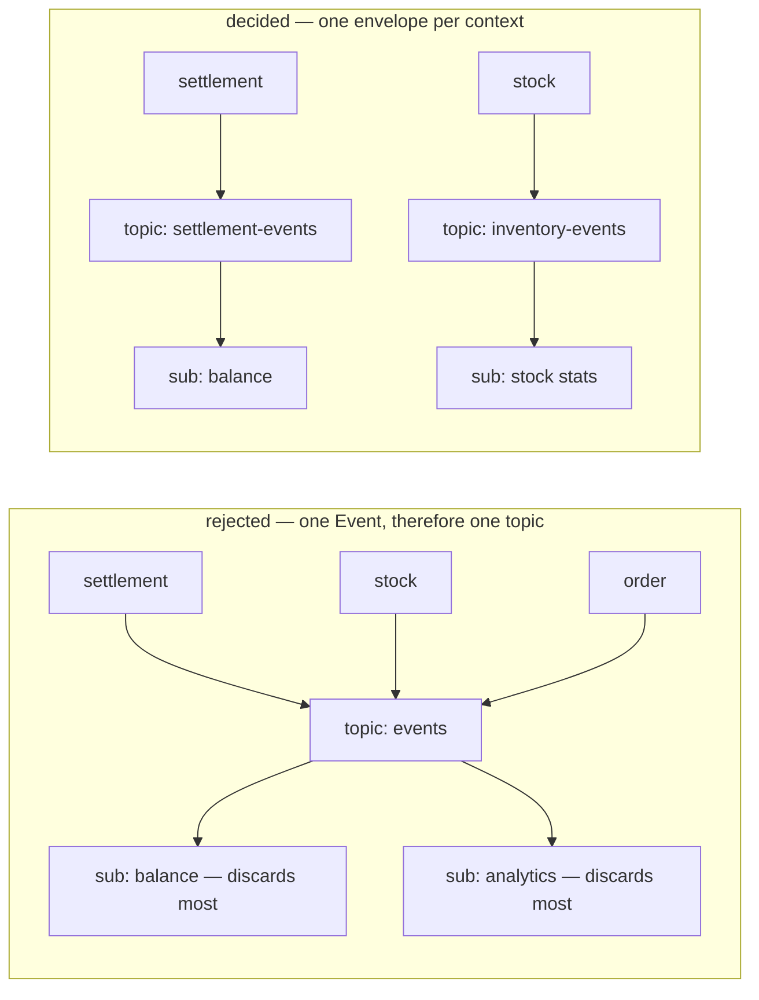
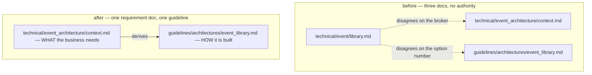

# Decisions — `context.md`

What the owner decided about [context.md](./context.md), recorded before it is acted on.

> **Append-only.** A decision is added, never rewritten. If one reverses, the entry stays and is
> annotated, and the reversing entry gets its own section with a new name (RULE 12).

---

## no-global-event-envelope

**One envelope per context. There is no shared `warehouse.events.v1` and no global `Event`.**
(owner, 2026-09-10)

An event definition lives in its own context's proto directory, beside that context's RPC contract,
in that context's package. The envelope is named `<Context>Event` and carries the topic option.

This **ratifies** [`guidelines/architectures/event_library.md`](../../../guidelines/architectures/event_library.md)'s
[`envelope-per-context`](../../../guidelines/architectures/event_library.md#envelope-per-context) rather
than overriding it, so **no override note is owed** — the guideline and the requirement tree now agree.

### Why

The proposal in `context.md` §Proto Definition was *"a shared definition … all type wrapped in one
definition"*. The argument against it is not style: `event_config` extends `MessageOptions` and
[`TopicName()`](../../../backend/pkgs/event_source/event_source.go) reads it off **the message being
published**, so one `Event` message carries one option — and therefore the whole warehouse would have
had exactly **one topic**.



A topic is the boundary for **retention, dead-lettering and ordering** all three. One topic means
settlement and stock can never have different ones. It also puts every domain's variants in one
`oneof` field-number space, makes any variant change a change to the type every service decodes, and
forces every consumer to compile against every domain — the coupling the guideline names.

### The spec

```protobuf
// proto/warehouse/settlement/v1/events.proto — beside settlement.proto, same package
package warehouse.settlement.v1;

message SettlementEvent {
  option (warehouse.event_base.v1.event_config) = {
    event_topic: "settlement-events"          // LOGICAL name — a resolver adds the project
    ordering_key_field: "meta.aggregate_id"
  };

  warehouse.event_base.v1.EventMetadata meta = 1 [(buf.validate.field).required = true];

  oneof payload {
    SettlementPostedEvent    posted    = 100;
    SettlementCancelledEvent cancelled = 101;
  }
}
```

| | |
| --- | --- |
| file | `proto/warehouse/<context>/v1/events.proto` |
| package | `warehouse.<context>.v1` — the same package as that context's RPC contract |
| envelope | `<Context>Event`, one per context |
| topic | one per context, `<context>-events`. A **logical** name only, never a resource path |
| option | the existing `event_config` at 50001. Never a second extension |
| numbering | `meta` at 1, metadata growth reserved to 99, `oneof` variants from 100 |
| dispatch | a typed switch on the `oneof`. A removed variant is `reserved`, never reused |
| first one to build | `SettlementEvent` — it is the context `context.md` §2 names |

### What this does NOT settle

⛔ **The first event still cannot be written**, and this decision does not unblock it. The
authoritative envelope above **does not compile** against the shipped library:

| | guideline | shipped code |
| --- | --- | --- |
| metadata | `EventMetadata meta = 1` | `san_event.Event` demands flat `GetEventId()` + `GetOccurredAtUnix()` ([event.go:33](../../../backend/pkgs/san_event/event.go)) |
| ordering | `event_config.ordering_key_field = 2` | `MessageEventConfig` has only `event_topic` |

`EventMetadata` does not exist in `proto/` at all. That remains open in
[`context_clarify.md`](./context_clarify.md#the-decided-envelope-cannot-be-published-by-the-shipped-library).

Also untouched by this decision, and still open: the broker abstraction, where consumers run (push
vs pull), the archive subscription, and the per-topic DLQ.

---

## the-library-doc-is-absorbed

**`docs/technical/event/library.md` is removed and its content moves into
[`context.md`](./context.md). `event_architecture/` is the one requirement doc for events.**
(owner, 2026-09-10 — *"im plan to remove event/library.md and move to this context"*, then
*"remove event/library.md first"*)

✅ **Done.** `library.md` and `library_clarify.md` are deleted and `docs/technical/event/` is gone.

> ⛔ **The delete came BEFORE the merge, so the content is currently nowhere.** The push and pull
> flows, the `EventSender` interface, the dead-letter design and the per-service registration rules
> are not yet in `context.md`. **Recover them from git** — the last commit holding the file is
> **`d54b182`**:
>
> ```sh
> git show d54b182:docs/technical/event/library.md
> ```
>
> ⚠ Read [`context_clarify.md`](./context_clarify.md#-what-the-removed-doc-held-and-what-must-not-come-back-with-it)
> before copying any of it across — three things in that file are wrong today, and the worst
> (`san_event = 50099`) becomes the instruction the moment it lands in the authoritative doc.

### Why

Three files described the same subject, and they had already disagreed twice in one round — the
broker (an abstraction over three vs a choice of one) and the option number (`san_event` at 50099 vs
the shipped `event_config` at 50001). A reader had no way to know which was current, and a question
had no obvious home.



### What this settles, and what it does not

| | |
| --- | --- |
| ✅ authoritative requirement doc | `docs/technical/event_architecture/context.md` — the only one |
| ✅ `event/library.md` and its clarify | deleted. `docs/technical/event/` no longer exists |
| ⚠ **the guideline STAYS** | [`guidelines/architectures/event_library.md`](../../../guidelines/architectures/event_library.md) is a different lane, not a fourth copy — HARD RULE 7 puts the requirement in `docs/technical/`, and `guidelines/` holds the programmer-authoritative build rules derived from it. [no-global-event-envelope](#no-global-event-envelope) is the shape of that relationship: the requirement doc ratified the guideline |
| ⛔ what still has to be WRITTEN | the push and pull flows, `EventSender`, the dead-letter design, the per-service registration rules. Deleted, not yet moved — recover from `d54b182` |

⚠ **The removal was not free of content.** `library.md` carried four open contradictions and four
critiques that no longer had a doc to be asked against. They were re-routed into
[`context_clarify.md`](./context_clarify.md) *before* the delete (RULE 7b), so nothing was lost with
the file — but nothing there was **answered** either. It only changed which doc answers it.

⚠ **One inbound link is now broken and it is the owner's to fix**:
[`ledger/mutation_and_ledger.md:154`](../ledger/mutation_and_ledger.md) says *"we rely
`[event_library](../event/library.md)` for processing event"*. Reported in
[`mutation_and_ledger_clarify.md`](../ledger/mutation_and_ledger_clarify.md), never edited (RULE 7b).
