# Decisions — the frontend, every screen

The owner's decisions about how ALL screens behave — the rules a new screen starts from. **Append-only** (RULE 12).
A decision about one screen goes in that screen's own file beside this one (`<page>_decision.md`), and links here
when it applies one of these.

| decision | what it decided | first applied |
| --- | --- | --- |
| [a-list-summary-is-the-order-lists-card-strip](#a-list-summary-is-the-order-lists-card-strip) | a list's figures are the order list's `SummaryStrip` of `SummaryCard`s | [settlement](order_settlement_decision.md#the-settlement-list-summary-is-the-order-lists-cards) |
| [a-date-range-filter-is-the-order-lists-picker](#a-date-range-filter-is-the-order-lists-picker) | a date filter is the order list's `DateRangePicker`, naming which date it filters | [settlement](order_settlement_decision.md#the-settlement-list-filters-what-the-contract-can) |
| [a-table-sorts-from-its-headings](#a-table-sorts-from-its-headings) | a sortable column sorts from its heading — largest first, then flips; two states | [settlement](order_settlement_decision.md#the-settlement-list-sorts-by-its-headings) |
| [the-pager-is-always-on-screen](#the-pager-is-always-on-screen) | the pager stays on screen on one page and on none, per page beside it | [settlement](order_settlement_decision.md#the-settlement-list-always-shows-its-pager) |
| [one-context-per-column-and-never-three-lines](#one-context-per-column-and-never-three-lines) | pairing is only for one fact read twice — it REPLACES the six-paired-cells decision | order screens |
| [the-phone-header-is-one-row](#the-phone-header-is-one-row) | on a phone the sticky block is the number, the stage and `⋯` — plus the section chips | order screens |
| [a-phone-reads-each-line-as-a-block](#a-phone-reads-each-line-as-a-block) | the item table becomes one block per line below `md` | order screens |
| [a-phone-filters-from-a-sheet](#a-phone-filters-from-a-sheet) | on a phone the search stays in the row; every other filter is in a bottom sheet behind a counted Filter button | order screens |
| [a-summary-card-is-at-most-a-fifth](#a-summary-card-is-at-most-a-fifth) | cards fill the row but never exceed 1/5 of it on a large screen — 1/4, 1/3, 1/2 as it narrows | order screens |
| [a-badge-stacks-under-its-text-when-the-table-is-cramped](#a-badge-stacks-under-its-text-when-the-table-is-cramped) | a badge column (an entry's source) sits under its text (the type) when the table would scroll, and on a phone; its own column when there is room | [settlement ledger](order_settlement_decision.md#the-ledger-reads-tanggal-and-its-balance-is-full-strength) |
| [a-summary-card-is-grey-with-a-thin-border](#a-summary-card-is-grey-with-a-thin-border) | every summary card sits on a grey ground with a thin line; one card per strip may lead, in pale blue | [settlement ledger](order_settlement_decision.md#the-ledger-margin-leads-and-says-where-it-comes-from) |
| [a-negative-amount-puts-its-minus-before-rp](#a-negative-amount-puts-its-minus-before-rp) | every negative amount reads **−Rp 10.000**, never *Rp -10.000*; a change or a running balance carries its + too | [settlement ledger](order_settlement_decision.md#the-ledger-reads-tanggal-and-its-balance-is-full-strength) |
| [a-chosen-option-is-in-the-main-tone](#a-chosen-option-is-in-the-main-tone) | a chosen radio and the calendar's chosen day are drawn in the main tone, rose — the form's button colour, never the default near-black | [settlement add entry](order_settlement_decision.md#the-add-entry-form-picks-with-chakra-controls) |
| [chakra-first-whenever-it-has-the-component](#chakra-first-whenever-it-has-the-component) | when Chakra has the component, the screen uses it — its full one, not a native element dressed up | [settlement add entry](order_settlement_decision.md#the-add-entry-form-picks-with-chakra-controls) |
| [a-money-field-shows-0-until-typed](#a-money-field-shows-0-until-typed) | every money field shows a **0** placeholder until something is typed — the placeholder, never the value | every `CurrencyInput` |
| [clear-filters-is-red-and-bold](#clear-filters-is-red-and-bold) | **Hapus filter** is red and bold — on every list, in the row and in the phone's sheet | [financial accounts](financial_accounts_decision.md#the-accounts-list-has-every-filter-the-contract-has) |
| [a-selected-tab-is-in-the-main-tone](#a-selected-tab-is-in-the-main-tone) | the picked tab's text and underline are rose, on every tab row | [financial accounts](financial_accounts_decision.md#the-accounts-type-is-a-tab-row) |
| [a-search-select-reopens-whole](#a-search-select-reopens-whole) | a search select searches only what is typed — opened again after a pick, it shows every option | every search select |
| [a-checked-box-is-in-the-main-tone](#a-checked-box-is-in-the-main-tone) | a ticked checkbox is rose, as a chosen radio is — on every screen | [financial accounts](financial_accounts_decision.md#a-dialog-choice-is-a-radio-pill) |

## a-list-summary-is-the-order-lists-card-strip

> Owner, in chat (2026-10-02): *"aku ingin statistik designnya seperti di order list"*.

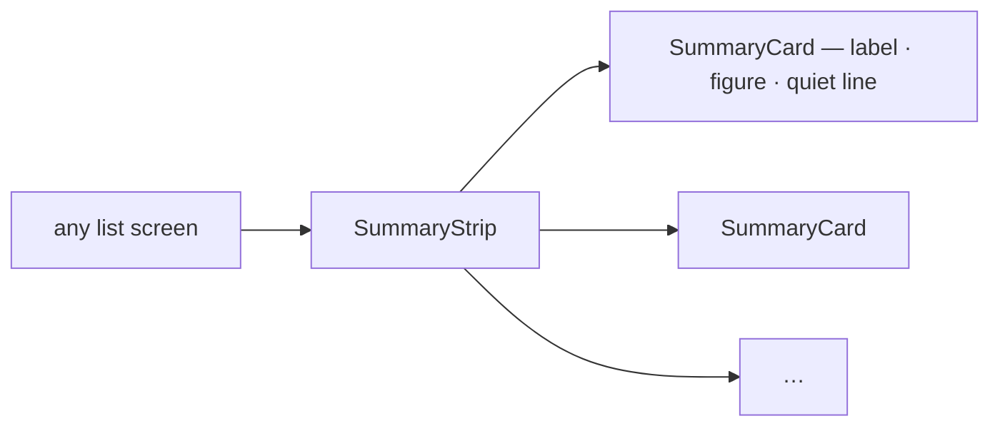

| | |
| --- | --- |
| component | `SummaryStrip` + `SummaryCard` (`features/orders/SummaryCard.tsx`) — never a screen's own stat box |
| a card | a label, ONE figure, one quiet line under it |
| width | the strip fills the row, no card wider than its share (1/5 on a large screen) |
| scope | the figures describe what the list's filters select — never just the page on screen |
| a figure that cannot be computed | not shown — a card is removed rather than filled from the page or left as a dash |

## a-date-range-filter-is-the-order-lists-picker

> Owner, in chat (2026-10-02): *"rentang tanggal gunakan seperti order list"*.

| | |
| --- | --- |
| component | `DateRangePicker` (quick ranges + a calendar), inside the shared `FilterBar` |
| which date | when the list's date is not the obvious one, the picker's field segment NAMES it (e.g. *Last moved*), so it is never read as the order date |
| on a phone | in the filter sheet, full width |
| any change | back to page 1 |

## a-table-sorts-from-its-headings

> Owner, in chat (2026-10-02): *"sort akan lebih baik jika bisa tiap heading"* — and *"cukup bolak-balik"*.

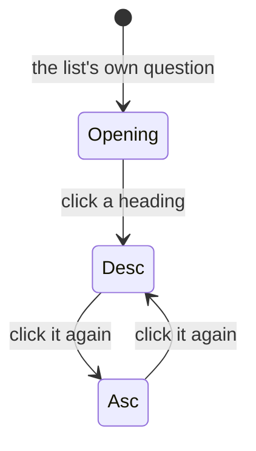

| | |
| --- | --- |
| a click | a new heading starts at **largest first**; the active heading flips — **two states**, never a third back to the default |
| shown | an arrow on the active heading, ⇅ on the others that sort |
| not sortable | a column whose order would mean nothing (a name the server does not hold) |
| who sorts | the server, over the whole set — a page is never re-sorted on the client |
| on a phone | no headings to tap, so the filter sheet carries a *Sort* control with each heading's two directions |

## the-pager-is-always-on-screen

> Owner, in chat (2026-10-02): *"tampilkan saja, selalu"* on the settlement list, then *"+paging selalu tampil"* —
> for every list.

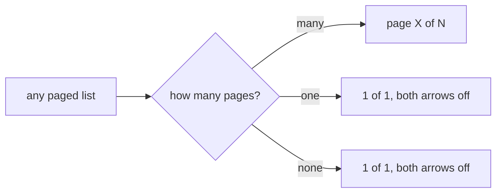

| | |
| --- | --- |
| control | the shared `Pagination` — it no longer hides itself; the opt-in `alwaysShow` it briefly had is gone |
| empty list | reads as one page, never *1 of 0* |
| per page | wherever a list offers sizes, the selector sits beside it on one page too |
| first load | a page may still hold the pager back while its first rows load — that is a spinner, not a list |

It widens [the-settlement-list-always-shows-its-pager](order_settlement_decision.md#the-settlement-list-always-shows-its-pager)
from one list to all of them. A list used to lose its pager when everything fitted, so a short list and a broken
one looked alike — and the per-page choice vanished exactly when somebody wanted fewer rows.

## one-context-per-column-and-never-three-lines

> Owner, in chat (2026-09-28): *"1 line lebih dari 2 baris"* · *"konteks berbeda di satukan (toko dan
> gudang), beli.margin tidak masalah"* · *"tanggal bedakan saja columnnya, status belum kamu bedakan
> jadi tidak lurus kebawah"*.

⚠ **This REPLACES `the-row-is-six-cells-not-twelve-columns`.** That decision paired twelve facts into
six cells and treated pairing as the way to fit a wide table. Two rules replace it:

| | |
| --- | --- |
| **1. No cell is more than two lines** | one row of the table is one row of reading |
| **2. One context per cell** | pairing is for ONE FACT READ TWICE, never for two questions |

**What was wrong with the old pairing** is not that it was dense — it is that it answered two questions
in one place. Toko and Gudang are not one fact; somebody scanning for *which warehouse* had to read past
a shop name to get there.

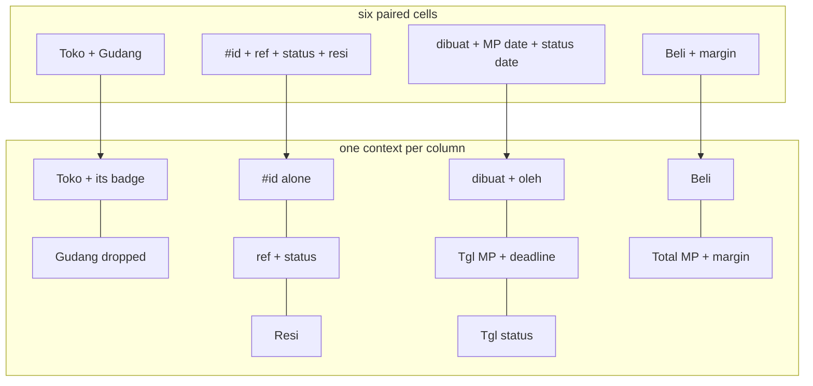

⚠ **THE RULE IS THE TEST, NOT THE PAIRS.** Which facts count as one took several rounds, and every
pairing below had to earn its second line by being the SAME fact read twice — the marketplace's name for
the order and where that order stands; the storefront's order time and the deadline it starts. A pair
that merely had room is what the rule rejects.

**The columns, in order** — nine, and only four carry a second line:

| | column | line 1 | line 2 |
| --- | --- | --- | --- |
| 1 | ID Order | the marketplace's reference, **copyable** | the status badge |
| 2 | Resi | the tracking number, **copyable** | |
| 3 | Toko *or* Tim | the shop's name | its marketplace badge |
| 4 | Dipesan | our date | `oleh <nama>` |
| 5 | Tgl MP | the storefront's order date | **the ship-by deadline** |
| 6 | Tgl `<status>` | **only while a status is filtered** | |
| 7 | Beli | total beli | |
| 8 | Total MP | what the platform paid | **the margin · %** |
| 9 | Aksi | the kebab | |

**What came OFF the row, and why.** Both answer *tell me about this order* rather than *which order do
I want* — which is the test a column has to pass:

| dropped | |
| --- | --- |
| **Penerima** (owner) | the search box already reaches the customer's name, so finding one never needed a column to look at |
| **Gudang** (owner) | a seller's orders nearly all ship from the same building, and the crew reading its own queue would see its own name twenty times |
| **`#id`** (owner) | nothing reads it. The marketplace reference is what a buyer, a shop and a courier all quote; our number survives as the row's link target and its testid, not as a column |

**Where each pair landed, and why it is ONE fact rather than two:**

| pair | why they belong together |
| --- | --- |
| ID Order / status | the marketplace's name for the order, and where that order has got to |
| Toko / marketplace badge | two storefronts often share a name — the pair IS the identifier |
| Tgl MP / deadline | **causal**: the ship-by window runs FROM the storefront's order time |
| Total MP / margin | the margin is `harga MP − total beli`, measured against the figure above it |
| Dipesan / `oleh` | one event: when we wrote it down, and who did |

⚠ **THE STATUS MOVED TWICE, and the second move is not a reversal of the first.** It began on the second
line of the `#id` cell, where the badges did not line up down the page. A column of its own fixed that;
under the marketplace reference it is line 2 on *every* row, so they line up there too — and it costs no
column.

⚠ **THE TWO COPYABLE FIELDS ARE THE TWO THAT LEAVE THE APP.** The marketplace reference is pasted into
the platform's dashboard and the resi into a courier's tracking page or a reply to a buyer. Our `#id` is
quoted across a room, not pasted, so it is not copyable. Both stop the row's navigate — without that,
copying a number would also leave the page and nobody would see it happen.

⚠ **THE DEADLINE SAT UNDER THE RESI FOR ONE ROUND, and moved because the premise was wrong.** The pairing
there assumed a resi appears only at handover, so the two would never coexist — but *"resi pasti ada"*
(owner): the marketplace prints the label at confirmation, which is exactly why the action table offers
*Edit Resi* on `created` and `process`. The resi answers *which parcel*, the deadline *when it has to go*.

⚠ **The price is a wider table, and that is accepted.** The page still never scrolls sideways — the table
scrolls inside its own box (measured at 400px). Five of the nine columns are a single line.

⚠ **One column appears and disappears**: the status date only exists under the tab that asks for it,
because a permanently blank column is one people learn to skip.

## the-phone-header-is-one-row

> Owner, in chat (2026-09-30): *"heading yang sticky top terlalu ramai"*.

Below `md` the sticky block is **one row** (back, the order number, the stage, `⋯`) and the section
chips under it. It was 153px and is now 109px.

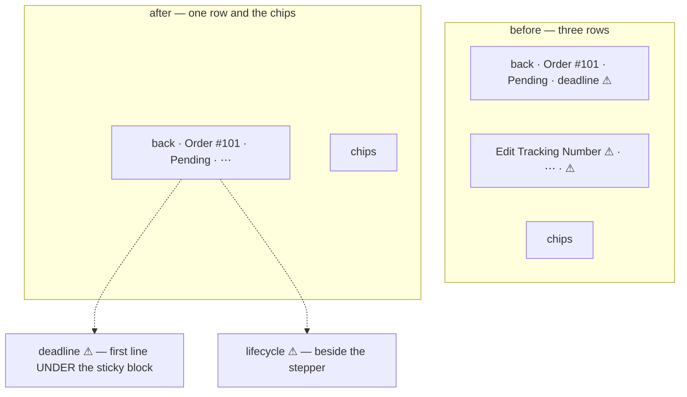

| moved | to | why |
| --- | --- | --- |
| every action | the `⋯` menu, even when it holds only one | a labelled button was what wrapped the header onto a second row. On a phone a menu costs a tap and a button costs the header's height |
| the deadline and its ⚠ | the first line under the header | still the first thing read, but it scrolls away |
| the lifecycle ⚠ | beside the stepper | the steps it is about: retur, selesai, lost |

The desktop header is unchanged.

## a-phone-reads-each-line-as-a-block

> Owner, in chat (2026-09-30): *"product itemsnya kepotong-potong karena terlalu sempit"*.

Below `md` the item table becomes **one block per line**: the marketplace's title, then our product,
then `harga beli × qty · team` on the left and the line total on the right. At 390px the five-column
table clamped both names to a word each, and qty and the line total sat off the edge. The ⚠ for the
picture and the marketplace title move to the section title, since there is no column header on a phone.

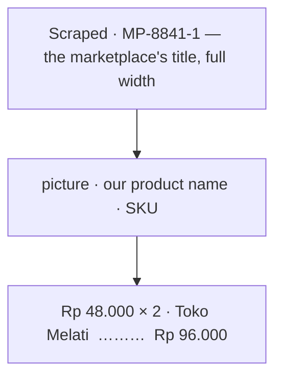

## a-phone-filters-from-a-sheet

> Owner, in chat (2026-09-30): *"bentuk filter di order list cukup berantakan pada tampilan mobile"*.

Below `md`, `FilterBar` draws one row — the search and a **Filter** button — and puts every other control in a
bottom sheet, each at the full width. Desktop is unchanged.

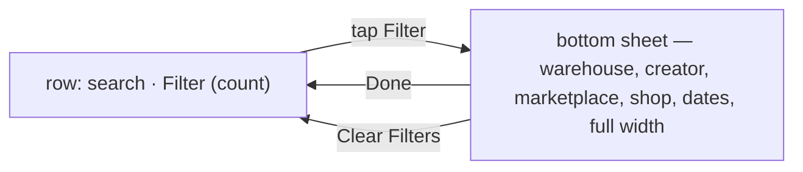

| | before | after |
| --- | --- | --- |
| phone | six controls in six ragged rows (15rem, 13rem, `auto`), ~280px before the tabs | one 36px row |
| Filter button | — | counts what is narrowing the list (search included) |
| Clear | inline, while filtering | in the sheet's footer, beside Done |
| applying | live | still live — Done only closes the sheet, it is not an Apply |

- The search stays out of the sheet because it is the one control used on every visit.
- `FilterBar` finds the search by type, so the order list writes one set of children for both layouts, and a
  `FilterField` becomes a full-width row inside the sheet (its control too — the date button has a minimum
  width of its own).
- A JS breakpoint, never CSS, so every control mounts once.
- The story runner's canvas is phone-width, so the list's filter stories open the sheet first.

## a-summary-card-is-at-most-a-fifth

> Owner, in chat (2026-09-30): *"jadi strech, gini aja, di layar 2k maksimal widthnya 1/5, dan untuk ukuran di
> bawahnya kamu sesuaikan"*.

`SummaryStrip` (in `features/orders/SummaryCard.tsx`) replaces the bare grid on all three strips — the order
list's piles, its measure cards, and the drafts page's cards.

| screen | widest a card may be |
| --- | --- |
| ≥ 1536px (`2xl`, including 2K) | 1/5 |
| ≥ 1024px (`lg`) | 1/4 |
| ≥ 768px (`md`) | 1/3 |
| phone | 1/2 |

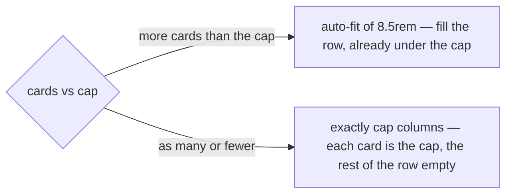

Measured at 2560px: three draft cards at 0.196 of the strip each, seven measure cards at 0.139, the piles
filling the row. At 1440px the draft cards are 1/4. The count decides the layout because CSS grid alone
cannot say *fill the row, but at most 1/5*: `auto-fit` stretched few cards, `auto-fill` shrank many.

## a-badge-stacks-under-its-text-when-the-table-is-cramped

> Owner, in chat (2026-10-03), on the settlement ledger's Type and Source: *"untuk kolom semacam ini rulenya: jika
> tabel terlalu banyak kolom sampai harus buat scroll, taruh badge contoh sumber, di bawah teks/element contoh jenis ·
> jika tabel renggang dan banyak space, pisah saja, tidak masalah · kalau di tampilan mobile gunakan yang atas bawah"*.

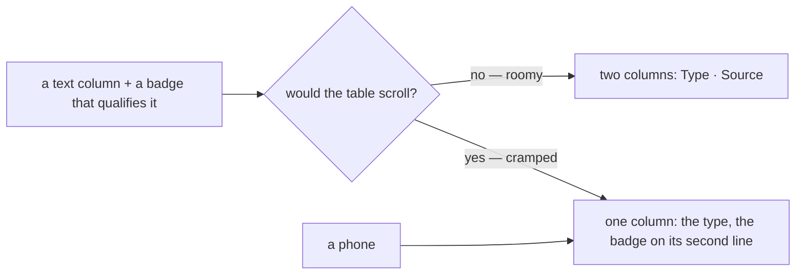

| | |
| --- | --- |
| applies to | a column whose value is qualified by a badge — an entry's type and its source is the first case |
| roomy | separate columns |
| cramped | the badge on the text's second line, and its column is gone — the cell stays at two lines ([one-context-per-column-and-never-three-lines](#one-context-per-column-and-never-three-lines)) |
| a phone | always the stacked form |
| how it is decided | measured, not guessed by screen width: watch the table's scroll container, stack the moment the roomy layout would overflow, unstack only once the container is as wide as the roomy layout needed — so the two cannot flicker at the edge. ⚠ No table uses it today: the ledger, its first user, moved its badge into Detail ([the-ledger-type-column-reads-sumber](order_settlement_decision.md#the-ledger-type-column-reads-sumber)) and its hook went with it |

⚠ Stacking removes ONE column. A table that still does not fit after it — a ledger on a 360px screen — is the
phone's block layout's job ([a-phone-reads-each-line-as-a-block](#a-phone-reads-each-line-as-a-block)), not this rule's.

## a-summary-card-is-grey-with-a-thin-border

> Owner, in chat (2026-10-03), on the ledger's cards: *"summary cards → background subtle / border tipis"*, and
> *"buat margin riil sedikit lebih menonjol"*, then *"true margin bisa full biru saja?"* and *"biru biasa aja, yang agak pudar"*.

| | |
| --- | --- |
| every card | `bg.muted` (a grey ground) and a 1px `border` — `bg.subtle` is white in this theme, the same as the page and the card around it, so a card used to read as an outline only |
| the lead card | `SummaryCard emphasis` — a full PALE BLUE fill (the `lead.*` tokens: Chakra's own blue, 50 / 200 / 700 — not a status, not an eighth tone) and its figure one size up. **One per strip**, or it leads nothing |
| a second quiet line | `note` — how a figure is made, under its line, in a quieter grey; only where it is not obvious |
| where | `SummaryCard` (`features/orders/SummaryCard.tsx`) — so every strip changes at once: the order list, the drafts, the settlement list, the ledger |

It amends the card's look in [a-list-summary-is-the-order-lists-card-strip](#a-list-summary-is-the-order-lists-card-strip);
the shape — a label, one figure, a quiet line — is unchanged.

## a-negative-amount-puts-its-minus-before-rp

> Owner, in chat (2026-10-05), on the ledger: *"saldo formatnya samakan dengan perubahan, di perubahan adalah -Rp … di
> saldo Rp -…, dan format ini berlaku untuk semuanya, buat jadi catatan"*.

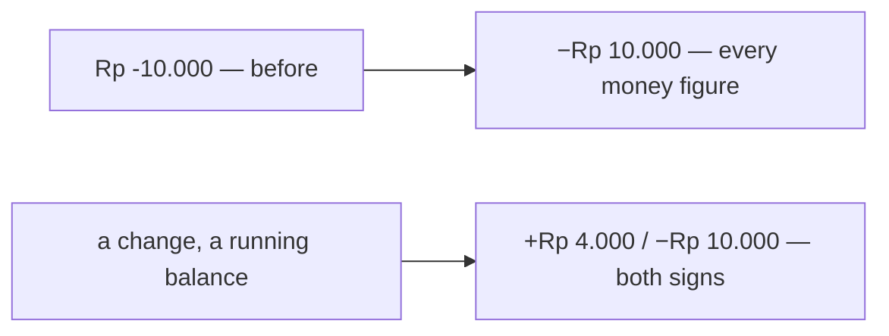

| | |
| --- | --- |
| any negative amount | **−Rp 10.000** — the minus BEFORE the currency, the typographic "−" |
| a change or a running balance | both signs: **+Rp 4.000**, **−Rp 10.000** — its direction is the point |
| any other positive amount | bare: **Rp 120.000** |
| where | `formatRupiah`, `formatRupiahNumber`, `formatRupiahCompact` and `formatSignedRupiah` (`frontend/src/lib/money.ts`) — every money figure goes through them, so the whole app changed at once |

The sign says which way the money went. Written after the currency it was the one character nobody read — and a
ledger showed its change as *−Rp 4.500* beside a balance of *Rp -30.500*, two formats for one kind of number.

## a-chosen-option-is-in-the-main-tone

> Owner, in chat (2026-10-05), on the add-entry dialog: *"select harus cakra, radio select juga, warnanya buat biru
> atau mungkin ada rekomendasi, karena warna utamaku rose, untuk theme tanggalnya juga sesuaikan warnanya"* — then,
> once the submit was rose beside an indigo pick: *"Arah warnanya merah saja kalau gitu, samakan"*.

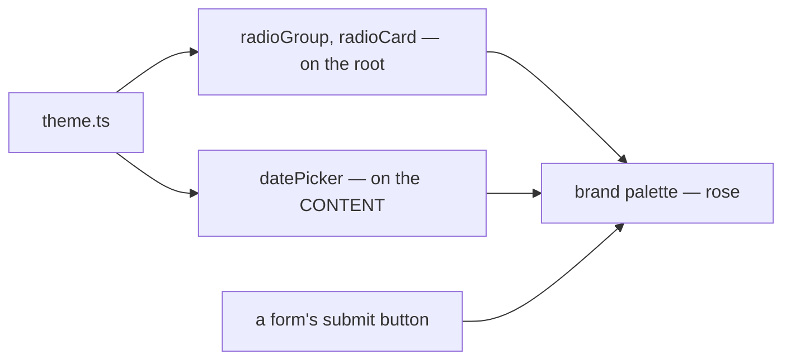

| | |
| --- | --- |
| a chosen radio · radio card | its mark and its card's line in **brand** (rose-600) — the colour of the form's submit beside it |
| the calendar | the chosen day filled in rose; today's underline and a hovered day in its pale steps |
| why | one accent per form: the action and the pick in the same colour. The default palette drew both near-black |
| tried first | indigo (`primary`), recommended to keep rose for actions — reversed the same day: a rose submit beside an indigo pick read as two accents |
| where | `theme.ts` only. ⚠ the calendar's palette is set on its **content**: it opens in a portal, outside the root, and a palette is inherited down the DOM |
| not yet | a checkbox and a switch still use the default palette — not asked |

## chakra-first-whenever-it-has-the-component

> Owner, in chat (2026-10-05), on the add-entry dialog: *"catatan textarea, komponen kalau ada kita akan pakai cakra,
> catat itu saja"*.

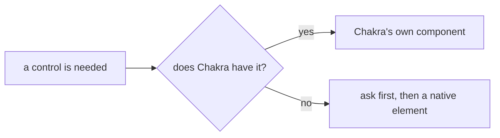

| the need | Chakra's component | not |
| --- | --- | --- |
| pick one of a list | `Select` (composable) — `Combobox` when the set grows | `NativeSelect`, `<select>` |
| one of two or three choices | `RadioCard` / `RadioGroup` | two buttons toggling solid and outline |
| a sentence of text | `Textarea` | a one-line `Input` |
| a date | `DatePicker` (ours, on Chakra's) | `<input type="date">` |

It sharpens what CLAUDE.md already says ("build UI from Chakra UI v3 components"): a Chakra component that only
wraps the native element — `NativeSelect` — does not count when Chakra has the full one.

## a-money-field-shows-0-until-typed

> Owner, in chat (2026-10-05), on the add-entry dialog's amount: *"input price ada placeholder 0 secara default"*.

```
Jumlah
[ Rp  0              ]   ← the placeholder, in the quiet ink — the value is still ""
[ Rp  45.000         ]   ← once typed
```

| | |
| --- | --- |
| where | `CurrencyInput`'s default `placeholder` — so every money field gets it, and a caller may still pass its own |
| the value | stays `""` until a digit is typed: an empty field is a person who has not answered, not a zero |
| was | an empty box on most forms; four forms typed `placeholder="0"` by hand, now removed as the default |

## clear-filters-is-red-and-bold

> Owner, in chat (2026-10-05), on the accounts list's filter strip: *"catatan, hapus filter merah bold"*.

```
[Cari …] [Semua jenis ⌄] [Semua toko ⌄] ☐ Hanya operasional   Hapus filter   ← red, bold
```

| | |
| --- | --- |
| the button | `FilterBar`'s Clear — `colorPalette="error"`, bold, still a ghost button |
| where | every list that uses `FilterBar` — the row on a desktop and the foot of the phone's sheet — set once in the component |
| when | unchanged: only while a filter is narrowing the list |
| why red | it throws away what somebody set, and on a list that looks emptier than expected it is the first thing to find |

## a-selected-tab-is-in-the-main-tone

> Owner, in chat (2026-10-05), on the accounts list's type tabs: *"warna tab warna utama"*.

*The tab's twin of [a-chosen-option-is-in-the-main-tone](#a-chosen-option-is-in-the-main-tone).*

```
[Semua 5]  [Rekening bank 2]  [Kas 1]
 ━━━━━━━━                              ← the picked tab: rose text, rose underline
```

| | |
| --- | --- |
| the picked tab | text `brand.fg`, underline `brand.solid` — rose |
| the others | unchanged — `fg.muted`, no underline |
| where | `theme.ts`, the `line` variant — every tab row in the app, the order list's status tabs and the vertical detail tabs included |
| the count badge | stays grey — the colour is set by token on the trigger, not as a palette the badge would inherit |

## a-search-select-reopens-whole

> Owner, in chat (2026-10-05), on `ShopSelect`: *"ada 1 permasalah, dimana saat sudah select data, ketika panel dibuka
> lagi, dia cuma ada 1 opsi"*.

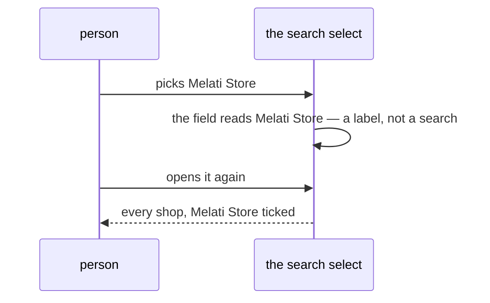

| | |
| --- | --- |
| what searches | a keystroke only — `reason === "input-change"` |
| what starts over | a pick, a blur, a clear, and opening the panel by a click or an arrow key |
| why the open half too | typing *Warehouse Admin* and picking *Warehouse Admin* leaves the field's text unchanged, so no pick-change ever fires — the typed search would stay |
| where | `searchOnlyWhatIsTyped(filter)` in `frontend/src/lib/comboboxSearch.ts`, spread on the `Combobox.Root` of every search select that filters in the browser: Shop, Supplier, Shipping, ShipmentChannel, Team, Role · AddressPicker already did it inline |
| not changed | the server-search ones (User, Product): their list IS the answer to what is typed, and a blank term asks for nothing |

## a-checked-box-is-in-the-main-tone

> Owner, in chat (2026-10-06): *"theme checkbox sesuaikan"*.

*The checkbox's twin of [a-chosen-option-is-in-the-main-tone](#a-chosen-option-is-in-the-main-tone).*

| | |
| --- | --- |
| the box | ticked: filled `brand.solid`, rose — was the default near-black beside rose radios |
| where | `theme.ts`, `checkbox` on its root — every checkbox in the app |

## Recorded elsewhere

The owner's earlier rules for every screen were written into [CLAUDE.md](../../../CLAUDE.md) as it grew, and are
not restated here: Title Case for titles and actions; a detail view is a page, not a dialog; destructive actions
confirm; three or more row actions fold into an overflow menu; a growing set is a search select; a date is
`DatePicker` and a quantity `QuantityInput`; never a card inside a card; a screen built ahead of its backend marks
its gaps, and only Storybook can hide the marks.
