# Decisions — the frontend, every screen

The owner's decisions about how ALL screens behave — the rules a new screen starts from. **Append-only** (RULE 12).
A decision about one screen goes in that screen's own file beside this one (`<page>_decision.md`), and links here
when it applies one of these.

| decision | what it decided | first applied |
| --- | --- | --- |
| [a-list-summary-is-the-order-lists-card-strip](#a-list-summary-is-the-order-lists-card-strip) | a list's figures are the order list's `SummaryStrip` of `SummaryCard`s | [settlement](order_settlement_decision.md#the-settlement-list-summary-is-the-order-lists-cards) |
| [a-date-range-filter-is-the-order-lists-picker](#a-date-range-filter-is-the-order-lists-picker) | a date filter is the order list's `DateRangePicker`, naming which date it filters | [settlement](order_settlement_decision.md#the-settlement-list-filters-what-the-contract-can) |
| [a-table-sorts-from-its-headings](#a-table-sorts-from-its-headings) | a sortable column sorts from its heading — largest first, then flips; two states | [settlement](order_settlement_decision.md#the-settlement-list-sorts-by-its-headings) |
| [the-pager-is-always-on-screen](#the-pager-is-always-on-screen) | the pager stays on screen on one page and on none, per page beside it | [settlement](order_settlement_decision.md#the-settlement-list-always-shows-its-pager) |
| [one-context-per-column-and-never-three-lines](#one-context-per-column-and-never-three-lines) | pairing is only for one fact read twice — it REPLACES the six-paired-cells decision | order screens |
| [the-phone-header-is-one-row](#the-phone-header-is-one-row) | on a phone the sticky block is the number, the stage and `⋯` — plus the section chips | order screens |
| [a-phone-reads-each-line-as-a-block](#a-phone-reads-each-line-as-a-block) | the item table becomes one block per line below `md` | order screens |
| [a-phone-filters-from-a-sheet](#a-phone-filters-from-a-sheet) | on a phone the search stays in the row; every other filter is in a bottom sheet behind a counted Filter button | order screens |
| [a-summary-card-is-at-most-a-fifth](#a-summary-card-is-at-most-a-fifth) | cards fill the row but never exceed 1/5 of it on a large screen — 1/4, 1/3, 1/2 as it narrows | order screens |
| [a-badge-stacks-under-its-text-when-the-table-is-cramped](#a-badge-stacks-under-its-text-when-the-table-is-cramped) | a badge column (an entry's source) sits under its text (the type) when the table would scroll, and on a phone; its own column when there is room | [settlement ledger](order_settlement_decision.md#the-ledger-reads-tanggal-and-its-balance-is-full-strength) |
| [a-summary-card-is-grey-with-a-thin-border](#a-summary-card-is-grey-with-a-thin-border) | every summary card sits on a grey ground with a thin line; one card per strip may lead, in pale blue | [settlement ledger](order_settlement_decision.md#the-ledger-margin-leads-and-says-where-it-comes-from) |
| [a-negative-amount-puts-its-minus-before-rp](#a-negative-amount-puts-its-minus-before-rp) | every negative amount reads **−Rp 10.000**, never *Rp -10.000*; a change or a running balance carries its + too | [settlement ledger](order_settlement_decision.md#the-ledger-reads-tanggal-and-its-balance-is-full-strength) |
| [a-chosen-option-is-in-the-main-tone](#a-chosen-option-is-in-the-main-tone) | a chosen radio and the calendar's chosen day are drawn in the main tone, rose — the form's button colour, never the default near-black | [settlement add entry](order_settlement_decision.md#the-add-entry-form-picks-with-chakra-controls) |
| [chakra-first-whenever-it-has-the-component](#chakra-first-whenever-it-has-the-component) | when Chakra has the component, the screen uses it — its full one, not a native element dressed up | [settlement add entry](order_settlement_decision.md#the-add-entry-form-picks-with-chakra-controls) |
| [a-money-field-shows-0-until-typed](#a-money-field-shows-0-until-typed) | every money field shows a **0** placeholder until something is typed — the placeholder, never the value | every `CurrencyInput` |
| [clear-filters-is-red-and-bold](#clear-filters-is-red-and-bold) | **Hapus filter** is red and bold — on every list, in the row and in the phone's sheet | [financial accounts](financial_accounts_decision.md#the-accounts-list-has-every-filter-the-contract-has) |
| [a-selected-tab-is-in-the-main-tone](#a-selected-tab-is-in-the-main-tone) | the picked tab's text and underline are rose, on every tab row | [financial accounts](financial_accounts_decision.md#the-accounts-type-is-a-tab-row) |
| [a-search-select-reopens-whole](#a-search-select-reopens-whole) | a search select searches only what is typed — opened again after a pick, it shows every option | every search select |
| [a-checked-box-is-in-the-main-tone](#a-checked-box-is-in-the-main-tone) | a ticked checkbox is rose, as a chosen radio is — on every screen | [financial accounts](financial_accounts_decision.md#a-dialog-choice-is-a-radio-pill) |
| [a-segmented-choice-is-in-the-main-tone](#a-segmented-choice-is-in-the-main-tone) | a segmented control is drawn like a field, the chosen segment pale rose with a rose label; the grain picker carries an icon per grain | [financial account report](financial_accounts_decision.md#the-report-is-five-cards-and-one-table) |
| [a-date-speaks-the-apps-language](#a-date-speaks-the-apps-language) | a formatted date and a relative time follow the language picked in the app, not the browser's — *kemarin*, *7 Okt 2026* | every screen through `lib/datetime` |
| [the-desktop-shell-has-no-top-bar](#the-desktop-shell-has-no-top-bar) | the desktop shell has no top bar — no breadcrumb, search or bell; the page starts at the top beside the sidebar | every desktop screen |
| [the-sidebar-is-in-sections](#the-sidebar-is-in-sections) | the desktop menu is in sections — Operasional, Keuangan, Tim; Kewajiban counts the payments awaiting confirmation; Profile is in the user card | every desktop screen |
| [a-submenu-item-has-no-icon](#a-submenu-item-has-no-icon) | ⚠ provisional — a sub-menu item has no icon; the group header and the top-level items keep theirs | the desktop sidebar |
| [the-sidebar-collapses-to-its-icons](#the-sidebar-collapses-to-its-icons) | the desktop sidebar collapses to its icons by « or Ctrl+B, remembered, never automatically; a group opens a flyout on click | the desktop sidebar |
| [the-workspace-opens-under-its-card](#the-workspace-opens-under-its-card) | the team switcher (the workspace) opens as a panel straight under its card — beside the avatar when collapsed; the phone keeps the dialog | the desktop sidebar |
| [the-workspace-searches-one-section](#the-workspace-searches-one-section) | the workspace panel has no search box over both lists — each section heading carries a search icon and searches that section alone; no *Bukan anggota* badge | the workspace panel |
| [the-workspace-search-goes-back-by-a-chevron](#the-workspace-search-goes-back-by-a-chevron) | the section search is an input with its search icon, left by a ‹ chevron on its left; the list rides the panel's right edge | the workspace panel |
| [the-workspace-search-follows-access](#the-workspace-search-follows-access) | a member has one list with the search at its top; the sections and their search icons are Root's and the Administrator's | the workspace panel |
| [the-workspace-search-opens-under-its-heading](#the-workspace-search-opens-under-its-heading) | each section's search opens under its heading, which stays; the icon becomes a ^ that shuts it — for a member and for Root alike | the workspace panel |
| [the-phone-has-no-bell](#the-phone-has-no-bell) | the phone top bar has no notifications bell | the phone shell |
| [the-phone-opens-its-panels-from-the-bottom](#the-phone-opens-its-panels-from-the-bottom) | on a phone the workspace and the More menu open as drawers from the bottom, never the whole screen | the phone shell |
| [the-more-sheet-starts-with-the-account](#the-more-sheet-starts-with-the-account) | the More sheet is headed by the signed-in account; the workspace is not in it | the phone shell |
| [the-phone-team-chip-is-the-whole-box](#the-phone-team-chip-is-the-whole-box) | the phone top bar is one team selector — avatar, team, screen and ⇅ — and a tap anywhere on it opens the workspace | the phone shell |
| [the-more-sheet-switches-theme-and-language](#the-more-sheet-switches-theme-and-language) | in the More sheet, Tema is a sun/moon switch and Bahasa an ID/EN switch | the phone shell |
| [the-switch-is-a-step-past-lg](#the-switch-is-a-step-past-lg) | a `lg` switch is 56×28 — a step past Chakra's 48×24; the More sheet's two switches | the phone shell |
| [the-account-menu-switches-theme-and-language](#the-account-menu-switches-theme-and-language) | the desktop account menu draws Tema and Bahasa as the phone's switches — ☀/☾ and ID/EN — each a row that toggles and keeps the menu open | the desktop sidebar |
| [the-workspace-is-the-tab-bars-centre](#the-workspace-is-the-tab-bars-centre) | on a phone the workspace is a round bubble raised out of the tab bar's centre, the team's name under it; the top bar names the screen only | the phone shell |
| [the-phone-workspace-keeps-its-size](#the-phone-workspace-keeps-its-size) | the phone's workspace drawer is always 75% of the screen, whatever a search leaves in it; a long team name is cut to one line | the phone shell |

## a-list-summary-is-the-order-lists-card-strip

> Owner, in chat (2026-10-02): *"aku ingin statistik designnya seperti di order list"*.

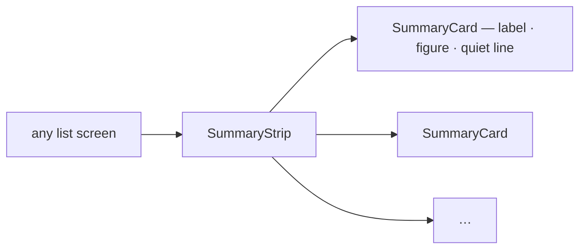

| | |
| --- | --- |
| component | `SummaryStrip` + `SummaryCard` (`features/orders/SummaryCard.tsx`) — never a screen's own stat box |
| a card | a label, ONE figure, one quiet line under it |
| width | the strip fills the row, no card wider than its share (1/5 on a large screen) |
| scope | the figures describe what the list's filters select — never just the page on screen |
| a figure that cannot be computed | not shown — a card is removed rather than filled from the page or left as a dash |

## a-date-range-filter-is-the-order-lists-picker

> Owner, in chat (2026-10-02): *"rentang tanggal gunakan seperti order list"*.

| | |
| --- | --- |
| component | `DateRangePicker` (quick ranges + a calendar), inside the shared `FilterBar` |
| which date | when the list's date is not the obvious one, the picker's field segment NAMES it (e.g. *Last moved*), so it is never read as the order date |
| on a phone | in the filter sheet, full width |
| any change | back to page 1 |

## a-table-sorts-from-its-headings

> Owner, in chat (2026-10-02): *"sort akan lebih baik jika bisa tiap heading"* — and *"cukup bolak-balik"*.

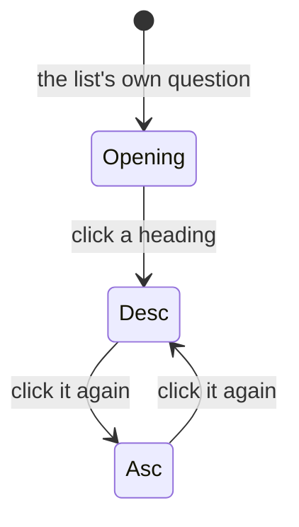

| | |
| --- | --- |
| a click | a new heading starts at **largest first**; the active heading flips — **two states**, never a third back to the default |
| shown | an arrow on the active heading, ⇅ on the others that sort |
| not sortable | a column whose order would mean nothing (a name the server does not hold) |
| who sorts | the server, over the whole set — a page is never re-sorted on the client |
| on a phone | no headings to tap, so the filter sheet carries a *Sort* control with each heading's two directions |

## the-pager-is-always-on-screen

> Owner, in chat (2026-10-02): *"tampilkan saja, selalu"* on the settlement list, then *"+paging selalu tampil"* —
> for every list.

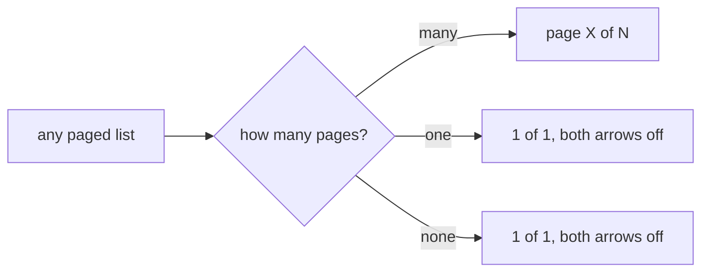

| | |
| --- | --- |
| control | the shared `Pagination` — it no longer hides itself; the opt-in `alwaysShow` it briefly had is gone |
| empty list | reads as one page, never *1 of 0* |
| per page | wherever a list offers sizes, the selector sits beside it on one page too |
| first load | a page may still hold the pager back while its first rows load — that is a spinner, not a list |

It widens [the-settlement-list-always-shows-its-pager](order_settlement_decision.md#the-settlement-list-always-shows-its-pager)
from one list to all of them. A list used to lose its pager when everything fitted, so a short list and a broken
one looked alike — and the per-page choice vanished exactly when somebody wanted fewer rows.

## one-context-per-column-and-never-three-lines

> Owner, in chat (2026-09-28): *"1 line lebih dari 2 baris"* · *"konteks berbeda di satukan (toko dan
> gudang), beli.margin tidak masalah"* · *"tanggal bedakan saja columnnya, status belum kamu bedakan
> jadi tidak lurus kebawah"*.

⚠ **This REPLACES `the-row-is-six-cells-not-twelve-columns`.** That decision paired twelve facts into
six cells and treated pairing as the way to fit a wide table. Two rules replace it:

| | |
| --- | --- |
| **1. No cell is more than two lines** | one row of the table is one row of reading |
| **2. One context per cell** | pairing is for ONE FACT READ TWICE, never for two questions |

**What was wrong with the old pairing** is not that it was dense — it is that it answered two questions
in one place. Toko and Gudang are not one fact; somebody scanning for *which warehouse* had to read past
a shop name to get there.

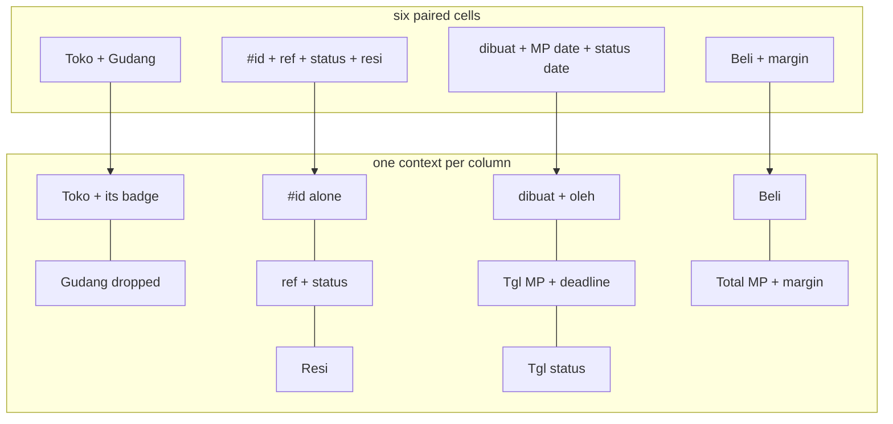

⚠ **THE RULE IS THE TEST, NOT THE PAIRS.** Which facts count as one took several rounds, and every
pairing below had to earn its second line by being the SAME fact read twice — the marketplace's name for
the order and where that order stands; the storefront's order time and the deadline it starts. A pair
that merely had room is what the rule rejects.

**The columns, in order** — nine, and only four carry a second line:

| | column | line 1 | line 2 |
| --- | --- | --- | --- |
| 1 | ID Order | the marketplace's reference, **copyable** | the status badge |
| 2 | Resi | the tracking number, **copyable** | |
| 3 | Toko *or* Tim | the shop's name | its marketplace badge |
| 4 | Dipesan | our date | `oleh <nama>` |
| 5 | Tgl MP | the storefront's order date | **the ship-by deadline** |
| 6 | Tgl `<status>` | **only while a status is filtered** | |
| 7 | Beli | total beli | |
| 8 | Total MP | what the platform paid | **the margin · %** |
| 9 | Aksi | the kebab | |

**What came OFF the row, and why.** Both answer *tell me about this order* rather than *which order do
I want* — which is the test a column has to pass:

| dropped | |
| --- | --- |
| **Penerima** (owner) | the search box already reaches the customer's name, so finding one never needed a column to look at |
| **Gudang** (owner) | a seller's orders nearly all ship from the same building, and the crew reading its own queue would see its own name twenty times |
| **`#id`** (owner) | nothing reads it. The marketplace reference is what a buyer, a shop and a courier all quote; our number survives as the row's link target and its testid, not as a column |

**Where each pair landed, and why it is ONE fact rather than two:**

| pair | why they belong together |
| --- | --- |
| ID Order / status | the marketplace's name for the order, and where that order has got to |
| Toko / marketplace badge | two storefronts often share a name — the pair IS the identifier |
| Tgl MP / deadline | **causal**: the ship-by window runs FROM the storefront's order time |
| Total MP / margin | the margin is `harga MP − total beli`, measured against the figure above it |
| Dipesan / `oleh` | one event: when we wrote it down, and who did |

⚠ **THE STATUS MOVED TWICE, and the second move is not a reversal of the first.** It began on the second
line of the `#id` cell, where the badges did not line up down the page. A column of its own fixed that;
under the marketplace reference it is line 2 on *every* row, so they line up there too — and it costs no
column.

⚠ **THE TWO COPYABLE FIELDS ARE THE TWO THAT LEAVE THE APP.** The marketplace reference is pasted into
the platform's dashboard and the resi into a courier's tracking page or a reply to a buyer. Our `#id` is
quoted across a room, not pasted, so it is not copyable. Both stop the row's navigate — without that,
copying a number would also leave the page and nobody would see it happen.

⚠ **THE DEADLINE SAT UNDER THE RESI FOR ONE ROUND, and moved because the premise was wrong.** The pairing
there assumed a resi appears only at handover, so the two would never coexist — but *"resi pasti ada"*
(owner): the marketplace prints the label at confirmation, which is exactly why the action table offers
*Edit Resi* on `created` and `process`. The resi answers *which parcel*, the deadline *when it has to go*.

⚠ **The price is a wider table, and that is accepted.** The page still never scrolls sideways — the table
scrolls inside its own box (measured at 400px). Five of the nine columns are a single line.

⚠ **One column appears and disappears**: the status date only exists under the tab that asks for it,
because a permanently blank column is one people learn to skip.

## the-phone-header-is-one-row

> Owner, in chat (2026-09-30): *"heading yang sticky top terlalu ramai"*.

Below `md` the sticky block is **one row** (back, the order number, the stage, `⋯`) and the section
chips under it. It was 153px and is now 109px.

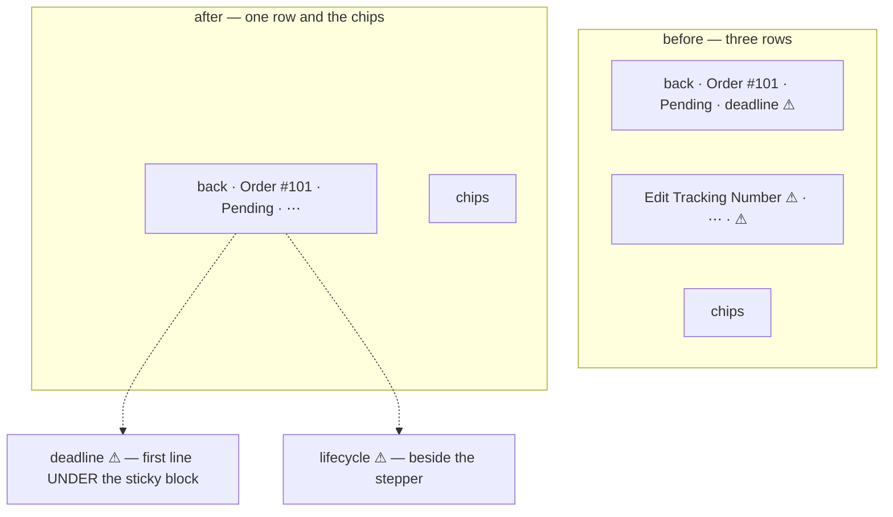

| moved | to | why |
| --- | --- | --- |
| every action | the `⋯` menu, even when it holds only one | a labelled button was what wrapped the header onto a second row. On a phone a menu costs a tap and a button costs the header's height |
| the deadline and its ⚠ | the first line under the header | still the first thing read, but it scrolls away |
| the lifecycle ⚠ | beside the stepper | the steps it is about: retur, selesai, lost |

The desktop header is unchanged.

## a-phone-reads-each-line-as-a-block

> Owner, in chat (2026-09-30): *"product itemsnya kepotong-potong karena terlalu sempit"*.

Below `md` the item table becomes **one block per line**: the marketplace's title, then our product,
then `harga beli × qty · team` on the left and the line total on the right. At 390px the five-column
table clamped both names to a word each, and qty and the line total sat off the edge. The ⚠ for the
picture and the marketplace title move to the section title, since there is no column header on a phone.

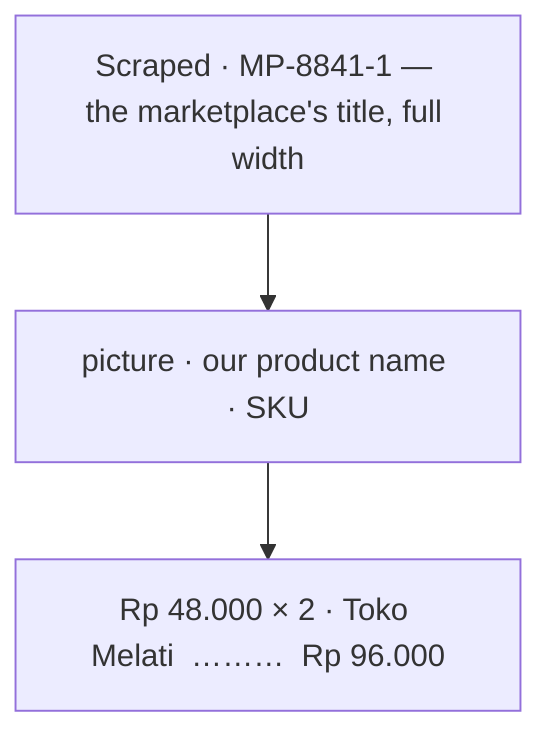

## a-phone-filters-from-a-sheet

> Owner, in chat (2026-09-30): *"bentuk filter di order list cukup berantakan pada tampilan mobile"*.

Below `md`, `FilterBar` draws one row — the search and a **Filter** button — and puts every other control in a
bottom sheet, each at the full width. Desktop is unchanged.

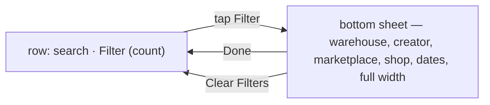

| | before | after |
| --- | --- | --- |
| phone | six controls in six ragged rows (15rem, 13rem, `auto`), ~280px before the tabs | one 36px row |
| Filter button | — | counts what is narrowing the list (search included) |
| Clear | inline, while filtering | in the sheet's footer, beside Done |
| applying | live | still live — Done only closes the sheet, it is not an Apply |

- The search stays out of the sheet because it is the one control used on every visit.
- `FilterBar` finds the search by type, so the order list writes one set of children for both layouts, and a
  `FilterField` becomes a full-width row inside the sheet (its control too — the date button has a minimum
  width of its own).
- A JS breakpoint, never CSS, so every control mounts once.
- The story runner's canvas is phone-width, so the list's filter stories open the sheet first.

## a-summary-card-is-at-most-a-fifth

> Owner, in chat (2026-09-30): *"jadi strech, gini aja, di layar 2k maksimal widthnya 1/5, dan untuk ukuran di
> bawahnya kamu sesuaikan"*.

`SummaryStrip` (in `features/orders/SummaryCard.tsx`) replaces the bare grid on all three strips — the order
list's piles, its measure cards, and the drafts page's cards.

| screen | widest a card may be |
| --- | --- |
| ≥ 1536px (`2xl`, including 2K) | 1/5 |
| ≥ 1024px (`lg`) | 1/4 |
| ≥ 768px (`md`) | 1/3 |
| phone | 1/2 |

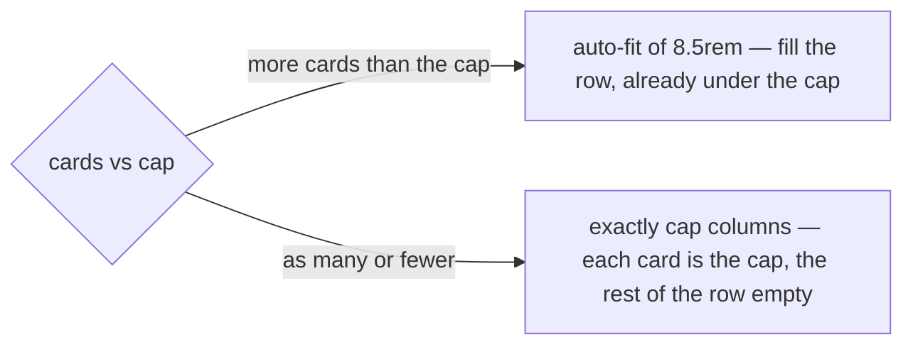

Measured at 2560px: three draft cards at 0.196 of the strip each, seven measure cards at 0.139, the piles
filling the row. At 1440px the draft cards are 1/4. The count decides the layout because CSS grid alone
cannot say *fill the row, but at most 1/5*: `auto-fit` stretched few cards, `auto-fill` shrank many.

## a-badge-stacks-under-its-text-when-the-table-is-cramped

> Owner, in chat (2026-10-03), on the settlement ledger's Type and Source: *"untuk kolom semacam ini rulenya: jika
> tabel terlalu banyak kolom sampai harus buat scroll, taruh badge contoh sumber, di bawah teks/element contoh jenis ·
> jika tabel renggang dan banyak space, pisah saja, tidak masalah · kalau di tampilan mobile gunakan yang atas bawah"*.

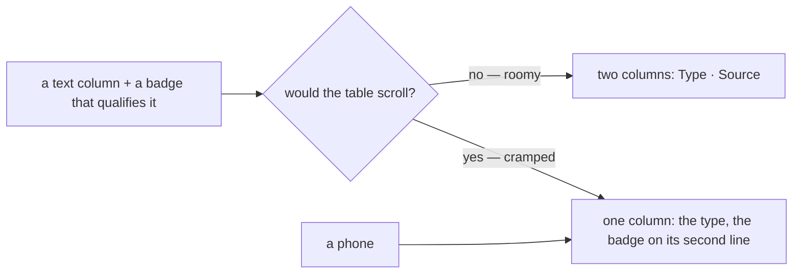

| | |
| --- | --- |
| applies to | a column whose value is qualified by a badge — an entry's type and its source is the first case |
| roomy | separate columns |
| cramped | the badge on the text's second line, and its column is gone — the cell stays at two lines ([one-context-per-column-and-never-three-lines](#one-context-per-column-and-never-three-lines)) |
| a phone | always the stacked form |
| how it is decided | measured, not guessed by screen width: watch the table's scroll container, stack the moment the roomy layout would overflow, unstack only once the container is as wide as the roomy layout needed — so the two cannot flicker at the edge. ⚠ No table uses it today: the ledger, its first user, moved its badge into Detail ([the-ledger-type-column-reads-sumber](order_settlement_decision.md#the-ledger-type-column-reads-sumber)) and its hook went with it |

⚠ Stacking removes ONE column. A table that still does not fit after it — a ledger on a 360px screen — is the
phone's block layout's job ([a-phone-reads-each-line-as-a-block](#a-phone-reads-each-line-as-a-block)), not this rule's.

## a-summary-card-is-grey-with-a-thin-border

> Owner, in chat (2026-10-03), on the ledger's cards: *"summary cards → background subtle / border tipis"*, and
> *"buat margin riil sedikit lebih menonjol"*, then *"true margin bisa full biru saja?"* and *"biru biasa aja, yang agak pudar"*.

| | |
| --- | --- |
| every card | `bg.muted` (a grey ground) and a 1px `border` — `bg.subtle` is white in this theme, the same as the page and the card around it, so a card used to read as an outline only |
| the lead card | `SummaryCard emphasis` — a full PALE BLUE fill (the `lead.*` tokens: Chakra's own blue, 50 / 200 / 700 — not a status, not an eighth tone) and its figure one size up. **One per strip**, or it leads nothing |
| a second quiet line | `note` — how a figure is made, under its line, in a quieter grey; only where it is not obvious |
| where | `SummaryCard` (`features/orders/SummaryCard.tsx`) — so every strip changes at once: the order list, the drafts, the settlement list, the ledger |

It amends the card's look in [a-list-summary-is-the-order-lists-card-strip](#a-list-summary-is-the-order-lists-card-strip);
the shape — a label, one figure, a quiet line — is unchanged.

## a-negative-amount-puts-its-minus-before-rp

> Owner, in chat (2026-10-05), on the ledger: *"saldo formatnya samakan dengan perubahan, di perubahan adalah -Rp … di
> saldo Rp -…, dan format ini berlaku untuk semuanya, buat jadi catatan"*.

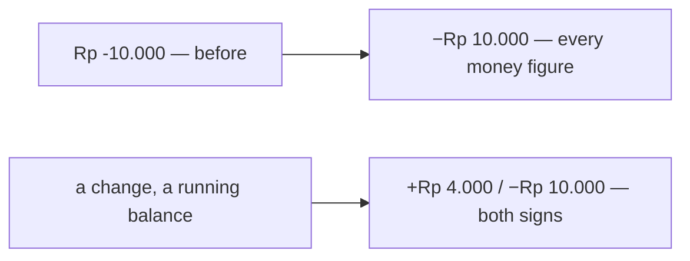

| | |
| --- | --- |
| any negative amount | **−Rp 10.000** — the minus BEFORE the currency, the typographic "−" |
| a change or a running balance | both signs: **+Rp 4.000**, **−Rp 10.000** — its direction is the point |
| any other positive amount | bare: **Rp 120.000** |
| where | `formatRupiah`, `formatRupiahNumber`, `formatRupiahCompact` and `formatSignedRupiah` (`frontend/src/lib/money.ts`) — every money figure goes through them, so the whole app changed at once |

The sign says which way the money went. Written after the currency it was the one character nobody read — and a
ledger showed its change as *−Rp 4.500* beside a balance of *Rp -30.500*, two formats for one kind of number.

## a-chosen-option-is-in-the-main-tone

> Owner, in chat (2026-10-05), on the add-entry dialog: *"select harus cakra, radio select juga, warnanya buat biru
> atau mungkin ada rekomendasi, karena warna utamaku rose, untuk theme tanggalnya juga sesuaikan warnanya"* — then,
> once the submit was rose beside an indigo pick: *"Arah warnanya merah saja kalau gitu, samakan"*.

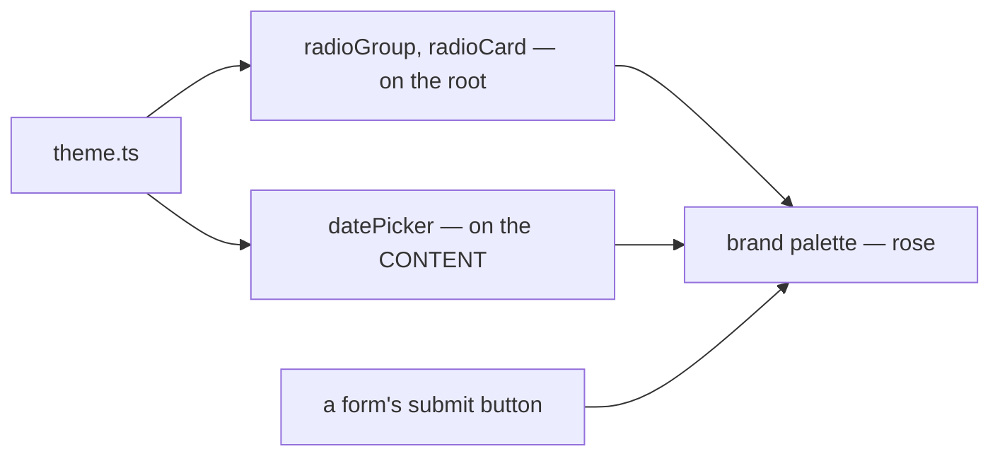

| | |
| --- | --- |
| a chosen radio · radio card | its mark and its card's line in **brand** (rose-600) — the colour of the form's submit beside it |
| the calendar | the chosen day filled in rose; today's underline and a hovered day in its pale steps |
| why | one accent per form: the action and the pick in the same colour. The default palette drew both near-black |
| tried first | indigo (`primary`), recommended to keep rose for actions — reversed the same day: a rose submit beside an indigo pick read as two accents |
| where | `theme.ts` only. ⚠ the calendar's palette is set on its **content**: it opens in a portal, outside the root, and a palette is inherited down the DOM |
| not yet | a checkbox and a switch still use the default palette — not asked |

## chakra-first-whenever-it-has-the-component

> Owner, in chat (2026-10-05), on the add-entry dialog: *"catatan textarea, komponen kalau ada kita akan pakai cakra,
> catat itu saja"*.

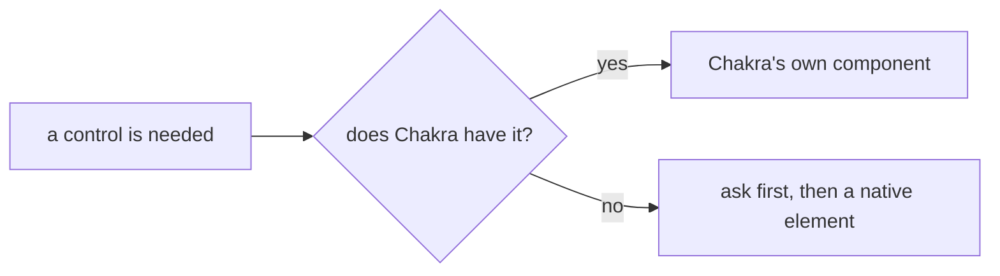

| the need | Chakra's component | not |
| --- | --- | --- |
| pick one of a list | `Select` (composable) — `Combobox` when the set grows | `NativeSelect`, `<select>` |
| one of two or three choices | `RadioCard` / `RadioGroup` | two buttons toggling solid and outline |
| a sentence of text | `Textarea` | a one-line `Input` |
| a date | `DatePicker` (ours, on Chakra's) | `<input type="date">` |

It sharpens what CLAUDE.md already says ("build UI from Chakra UI v3 components"): a Chakra component that only
wraps the native element — `NativeSelect` — does not count when Chakra has the full one.

## a-money-field-shows-0-until-typed

> Owner, in chat (2026-10-05), on the add-entry dialog's amount: *"input price ada placeholder 0 secara default"*.

```
Jumlah
[ Rp  0              ]   ← the placeholder, in the quiet ink — the value is still ""
[ Rp  45.000         ]   ← once typed
```

| | |
| --- | --- |
| where | `CurrencyInput`'s default `placeholder` — so every money field gets it, and a caller may still pass its own |
| the value | stays `""` until a digit is typed: an empty field is a person who has not answered, not a zero |
| was | an empty box on most forms; four forms typed `placeholder="0"` by hand, now removed as the default |

## clear-filters-is-red-and-bold

> Owner, in chat (2026-10-05), on the accounts list's filter strip: *"catatan, hapus filter merah bold"*.

```
[Cari …] [Semua jenis ⌄] [Semua toko ⌄] ☐ Hanya operasional   Hapus filter   ← red, bold
```

| | |
| --- | --- |
| the button | `FilterBar`'s Clear — `colorPalette="error"`, bold, still a ghost button |
| where | every list that uses `FilterBar` — the row on a desktop and the foot of the phone's sheet — set once in the component |
| when | unchanged: only while a filter is narrowing the list |
| why red | it throws away what somebody set, and on a list that looks emptier than expected it is the first thing to find |

## a-selected-tab-is-in-the-main-tone

> Owner, in chat (2026-10-05), on the accounts list's type tabs: *"warna tab warna utama"*.

*The tab's twin of [a-chosen-option-is-in-the-main-tone](#a-chosen-option-is-in-the-main-tone).*

```
[Semua 5]  [Rekening bank 2]  [Kas 1]
 ━━━━━━━━                              ← the picked tab: rose text, rose underline
```

| | |
| --- | --- |
| the picked tab | text `brand.fg`, underline `brand.solid` — rose |
| the others | unchanged — `fg.muted`, no underline |
| where | `theme.ts`, the `line` variant — every tab row in the app, the order list's status tabs and the vertical detail tabs included |
| the count badge | stays grey — the colour is set by token on the trigger, not as a palette the badge would inherit |

## a-search-select-reopens-whole

> Owner, in chat (2026-10-05), on `ShopSelect`: *"ada 1 permasalah, dimana saat sudah select data, ketika panel dibuka
> lagi, dia cuma ada 1 opsi"*.

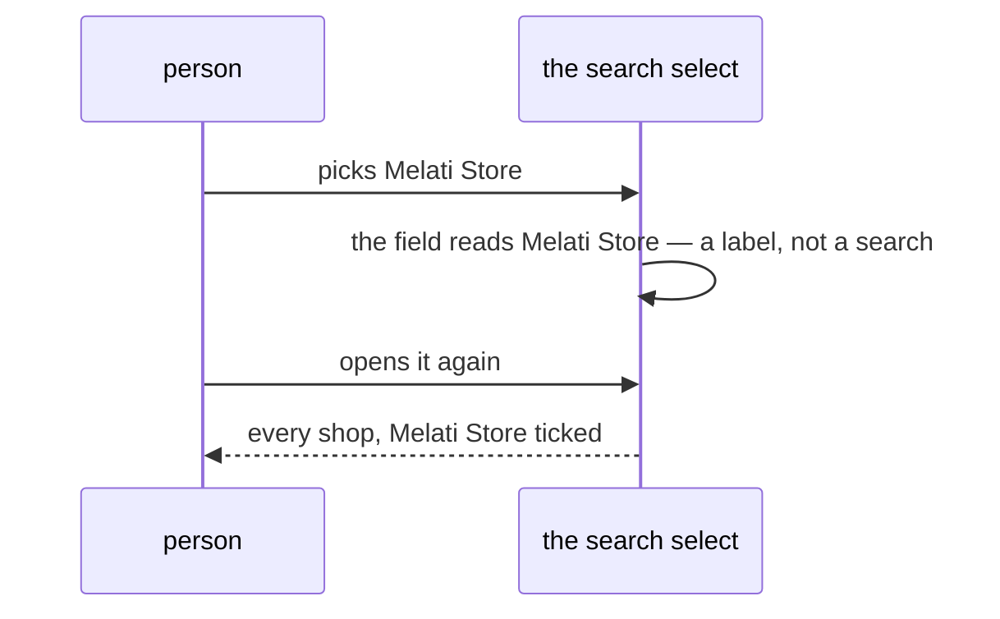

| | |
| --- | --- |
| what searches | a keystroke only — `reason === "input-change"` |
| what starts over | a pick, a blur, a clear, and opening the panel by a click or an arrow key |
| why the open half too | typing *Warehouse Admin* and picking *Warehouse Admin* leaves the field's text unchanged, so no pick-change ever fires — the typed search would stay |
| where | `searchOnlyWhatIsTyped(filter)` in `frontend/src/lib/comboboxSearch.ts`, spread on the `Combobox.Root` of every search select that filters in the browser: Shop, Supplier, Shipping, ShipmentChannel, Team, Role · AddressPicker already did it inline |
| not changed | the server-search ones (User, Product): their list IS the answer to what is typed, and a blank term asks for nothing |

## a-checked-box-is-in-the-main-tone

> Owner, in chat (2026-10-06): *"theme checkbox sesuaikan"*.

*The checkbox's twin of [a-chosen-option-is-in-the-main-tone](#a-chosen-option-is-in-the-main-tone).*

| | |
| --- | --- |
| the box | ticked: filled `brand.solid`, rose — was the default near-black beside rose radios |
| where | `theme.ts`, `checkbox` on its root — every checkbox in the app |

## a-segmented-choice-is-in-the-main-tone

> Owner, in chat (2026-10-07), on the account report: *"pill harian bulanan tahunan kurang bagus dan sesuai
> temaku, mungkin ditambah icon juga lebih bagus"*.

*The segmented control's twin of [a-chosen-option-is-in-the-main-tone](#a-chosen-option-is-in-the-main-tone) and
[a-selected-tab-is-in-the-main-tone](#a-selected-tab-is-in-the-main-tone).*

```
before   ░[ Harian ]░  Bulanan  ░  Tahunan ░     grey trough, a white raised chip, a size taller than a field
after    │[▣ Harian]  ▦ Bulanan │ ▤ Tahunan │      a field's box; the pick pale rose, its label rose
```

| | |
| --- | --- |
| the box | white, a thin `border`, 36px — the height of a field at `sm`, so it lines up with the filters beside it |
| the pick | filled `brand.subtle`, its label `brand.fg`; the others `fg.muted` — colour only, no bold, so the words do not shift as the pick moves |
| hover | rose too, the chosen segment included — never black (owner, same day: *"activenya saat hover bukan hitam"*) |
| the grain picker | an icon per grain — `Calendar1` a day, `CalendarDays` a month, `CalendarRange` a year — in `PeriodGrainPicker` |
| where | `theme.ts`, `segmentGroup` — every segmented control: the grain picker (account report, settlement report, daily statement), the phone menu's theme and language switches, the order draft's rows, the pick queue, the restock labels |

## a-date-speaks-the-apps-language

> Owner, in chat (2026-10-08), on an account's *Terakhir dicek*: *"yesterday tidak ikut i18n?"*.

| | |
| --- | --- |
| the bug | `lib/datetime`'s formatters passed `undefined` as the locale — the BROWSER's — so an English browser printed *yesterday* and *Oct 7, 2026* on a screen switched to Bahasa Indonesia |
| now | `formatUnixDate`, `formatUnixDateTime`, `formatRfc3339DateTime` and `formatUnixRelative` read i18next's current language on every call: *kemarin*, *7 Okt 2026* |
| pinned | the account page's `DatesFollowTheAppsLanguage` story, under the Indonesian locale |
| still open | seven pages keep a local copy of the date formatter with `undefined` (balance, batch-detail, batch-receipt, batches, restock-accept, restock-labels, warehouse-product) — the same bug, not touched yet |

## the-desktop-shell-has-no-top-bar

> Owner, in chat (2026-10-08): *"di app shell, kita tidak perlu heading yang ada breadcrumbnya"*.

```
before                                          now
┌──────────┬────────────────────────────────┐   ┌──────────┬────────────────────────────────┐
│ sidebar  │ Toko Melati › Orders  🔍  🔔    │   │ sidebar  │ the page, from the top          │
│          ├────────────────────────────────┤   │          │                                │
│          │ the page                        │   │          │                                │
└──────────┴────────────────────────────────┘   └──────────┴────────────────────────────────┘
```

| | |
| --- | --- |
| gone | the desktop top bar, whole: the breadcrumb (team › screen), the search box and the notifications bell — neither was wired to a service, and the bell carried a dot that announced nothing |
| why it is not missed | the team is the sidebar's switcher, the screen its lit item — the breadcrumb said both a second time |
| gone with it | the hamburger and the sidebar's off-canvas drawer and backdrop. The desktop shell mounts only at 768px and wider, where the hamburger was hidden — the drawer could not be opened |
| stays | the sidebar, the non-member strip ([a-non-member-root-acts-under-a-strip](../../business/user/context_decision.md#a-non-member-root-acts-under-a-strip)), the page canvas chosen by route |
| the phone | unchanged — its compact top bar (team chip, screen name, notifications) is not a breadcrumb |
| a page with no heading of its own | **Produk** (`products`) and **Restok** (`restock-selling`) leaned on the breadcrumb for their name, and now have none on a desktop — not changed here |

## the-sidebar-is-in-sections

> Owner, in chat (2026-10-08), after asking what a sidebar usually holds and seeing it drawn: *"oke, kita coba"*.

```
selling team                     warehouse team
▌Beranda                         ▌Beranda
OPERASIONAL                      OPERASIONAL
  Produk ›  Inventaris ›           Produk  Pesanan
  Pemasok ›  Toko  Pesanan         Inventaris ›        ← up from under the money
KEUANGAN                         KEUANGAN
  Biaya  Kewajiban (3)             Laporan  Kewajiban (1)
  Penyelesaian …  Akun Keuangan    Akun Keuangan
TIM                              TIM
  Pengguna  Pengaturan             Pengguna  Pengaturan
(A) ani ⇅ → Profil · Tema · Bahasa · Keluar
```

| | |
| --- | --- |
| the sections | Home first, no heading · **Operasional** — the team's work · **Keuangan** — its money · **Tim** — its people. A section with nothing in it for this team and role is not drawn, heading and all |
| the heading | small, bold, uppercase, `fg.subtle`, at the items' left edge — a label, never a control |
| where | `menuSectionsFor` in `nav.ts`; `menuFor` is the same sections as one list, for "where am I", the phone's sheet and the bottom bar |
| the count | **Kewajiban** carries the payments waiting for this team to confirm — `LiabilityPositionList`'s whole-set `awaiting_confirmation`, read on a one-row page. Never a 0. Asked again on every navigation, since the sidebar never remounts; a payment recorded, confirmed or rejected refreshes it too |
| Profile | out of the menu, into the user card's menu, above Tema — it is the person's page, not the team's. Still in `menuFor`, so `/profile` is matched and named |
| a warehouse | **Inventaris** moves up into Operasional, beside Pesanan — it sat below the money while the menu was one column |
| the phone | unchanged for now: the More sheet draws `menuFor` as before — its groups are already open, uppercase sections, so a second heading level is not added there |

## a-submenu-item-has-no-icon

> Owner, in chat (2026-10-08): *"submenu tidak perlu icon, ini keputusan sementara, mungkin bisa ditampilkan di sama
> depan"*. ⚠ **Provisional** — the owner's own word; read as: the icon belongs to the front level.

```
  ▣ Produk               ⌄     ← the group header keeps its icon
  │  Produk Saya               ← a child is its name alone, under the rail
  │  Temukan Produk
  ▣ Toko                       ← a top-level item keeps its icon
```

| | |
| --- | --- |
| a sub-menu item | no icon — its name under the group's rail, starting where the group's own name starts |
| the front level | unchanged: a top-level item and a group header each keep their icon |
| a collapsed sidebar | if one ever comes back, a child shows its icon there — with no names, it would be empty otherwise |
| the phone | unchanged for now — the More sheet's rows keep their icons |

## the-sidebar-collapses-to-its-icons

> Owner, in chat (2026-10-08), after the references and the drawing: *"tidak, kerjakan"* — build it, and **no**
> automatic collapse on a small laptop screen.

```
open, 258px                      collapsed, 64px            a group, clicked
┌──────────────────────────┐     ┌──────┐                   ┌──────┐ ┌────────────────┐
│ ⌂ PDC Warehouse       «  │     │  ⌂   │                   │ ▣·  ◄┼─┤ INVENTARIS     │
│ [GP Gudang Pusat     ⇅]  │     │  »   │                   └──────┘ │ Restok         │
│ ▌Beranda                 │     │ (GP) │                            │ Retur  Rak …   │
│ OPERASIONAL              │     │ [▣]  │                            └────────────────┘
│  ▣ Inventaris         ›  │     │ ──── │  ← a heading is a line
│ KEUANGAN                 │     │  ▣·  │  ← a group: icon and a dot
│  ▣ Kewajiban        (1)  │     │  ▣①  │  ← the count on the icon's corner
│ (A) ani               ⇅  │     │ (A)  │
└──────────────────────────┘     └──────┘
```

| | |
| --- | --- |
| the toggle | `«` at the right of the logo row; `»` under the mark when collapsed — one button, its name and **Ctrl+B** (⌘B) in its tooltip. Ctrl+B is ignored while typing in a field |
| remembered | in this browser (`wh-sidebar-collapsed`); **open by default**; never collapsed automatically, whatever the width |
| an item | its icon, centred; its name in a tooltip to the right and as the link's accessible name |
| a heading | a thin line |
| a group | its icon and a small dot; tinted while you are inside it. **A click** opens a flyout to its right — the group's name, then its children by name (no icons, [a-submenu-item-has-no-icon](#a-submenu-item-has-no-icon)). Never a hover. Escape, an outside click or going somewhere shuts it; a shut flyout is unmounted |
| the count | a small figure on Kewajiban's icon; the tooltip reads *Kewajiban · 1 menunggu konfirmasi Anda* |
| the team and the user | the team's avatar opens the same switcher; the user's avatar the same menu (to its right) |
| the page | gains the width — 258px → 64px |
| the phone | unchanged — it has its own shell |

**Supersedes** the *a collapsed sidebar* row of [a-submenu-item-has-no-icon](#a-submenu-item-has-no-icon): a child is
never drawn as an icon on the rail — it is reached through its group's flyout, by name.

## the-workspace-opens-under-its-card

> Owner, in chat (2026-10-08): *"pilih user atau disini aku istilahkan workspace, di panel aja langsung di
> bawahnya"* — the team switcher, which the owner calls the **workspace**.

```
open sidebar                         collapsed sidebar
┌──────────────────────────┐         ┌──────┐ ┌─────────────────────────┐
│ [GP Gudang Pusat      ⇅] │         │ (GP)◄┼─┤ [Cari tim             ] │
│ ┌──────────────────────┐ │         │      │ │ GP Gudang Pusat       ✓ │
│ │ [Cari tim          ] │ │  ← 6px  │      │ │ TM Toko Melati          │
│ │ GP Gudang Pusat    ✓ │ │    under└──────┘ └─────────────────────────┘
│ │ TM Toko Melati       │ │
│ └──────────────────────┘ │  ← the card's own width
```

| | |
| --- | --- |
| the open sidebar | a panel **straight under the card**, as wide as it — the card opening, not a window arriving; no backdrop |
| the collapsed sidebar | the same panel to the right of the team's avatar, beside the rail |
| its content | unchanged: the search, then the teams (and *All teams* for Root and the Administrator), the current one ✓ |
| closing | a pick (which reloads the app into that team, as before), Escape, or a click outside. The card reads as pressed while its panel hangs from it |
| the phone | unchanged — the centred dialog; a dropdown under the top bar's chip is a small target for a thumb |
| where | `TeamSwitcher`'s `panel`: `"below"`, `"right"`, or `"dialog"` (the default) |

## the-workspace-searches-one-section

> Owner, in chat (2026-10-09): *"tim saya aman, tidak ada perubahan · semua tim masih tampil berdasarkan access tadi ·
> bukan anggota badge tidak perlu · pencarian ditrigger lewat icon search … di paling kanan kasih icon itu, ketika klik
> nanti fokus ke tim saya atau semua tim, dan pencarian akan dilakukan disitu, alih-alih kita mencari keduanya
> langsung"*.

```
at rest                              searching All teams
Tim saya                 ⌕           [Cari di Semua tim          ×]
 RT Root                             TK Toko Kenanga          ← the server's answer for "ken"
Semua tim                ⌕           (Tim saya steps aside)
 GP Gudang Pusat
 TM Toko Melati          ✓
```

| | |
| --- | --- |
| My teams | unchanged — the memberships, the current one ✓ |
| All teams | unchanged — Root and the System Administrator only, every team they are not in |
| the badge | **gone** — no *Bukan anggota* on a row; the section says it, and the strip says it on every page |
| the search | **no box over both lists.** Each section's heading carries a search icon at its right; a click turns that heading into the field (*Cari di Tim saya* / *Cari di Semua tim*), the other section steps aside, and the typing narrows that section alone — My teams in the browser, All teams on the server |
| leaving it | the × beside the field, or Escape — which leaves the search first; a second Escape closes the panel |
| a member | sees the *Tim saya* heading and its icon too — it was headless, and the icon needs a heading to sit on |
| the phone | the same, inside its dialog |

**Supersedes** [the-switcher-offers-every-team](../../business/user/context_decision.md#the-switcher-offers-every-team)'s
presentation: the *not a member* mark on a row, and the one search over both sections.

## the-workspace-search-goes-back-by-a-chevron

> Owner, in chat (2026-10-09), on the first build: *"masih ada padding atau margin right kurang ke kanan · searchnya
> harusnya input dengan icon search seperti sebelumnya, alih-alih x kasih aja chevron di kiri"*.

```
Tim saya                 ⌕      ← the icon 21px from the panel's edge, as the label is 20px from the other
‹ [⌕ Cari di Tim saya      ]    ← back on the left; the field carries its search icon
```

| | |
| --- | --- |
| the field | an input with the **search icon inside it**, at its start, as the top search box had |
| leaving it | a **‹ chevron on the left** (*Kembali*) — the × at the right is gone. Escape still leaves the search first |
| the right edge | the list is pulled out through the panel's right padding (theme `scrollList`: the bar rides the panel's edge), so a heading's search icon and a row's ✓ sit ~21px from the edge — matching the 20px on the left. It was ~45px |

**Supersedes** the *leaving it* row of [the-workspace-searches-one-section](#the-workspace-searches-one-section).

## the-workspace-search-follows-access

> Owner, in chat (2026-10-09): *"kalau cuma ada tim saya, atas sendiri langsung aja pencarian … jadi berdasarkan
> access"*.

```
a member — one list                  Root / the System Administrator — two
[⌕ Cari tim               ]          Tim saya                 ⌕
 GP Gudang Pusat         ✓            RT Root
 TM Toko Melati                      Semua tim                ⌕
                                      GP Gudang Pusat
```

| | |
| --- | --- |
| a member | **one list, no heading**: the search field (*Cari tim*, its search icon inside) straight at the top, always there, and it stays put while the list scrolls. Escape closes the panel |
| Root and the System Administrator | unchanged — [the-workspace-searches-one-section](#the-workspace-searches-one-section): each heading its search icon, one section searched at a time, left by the ‹ ([the-workspace-search-goes-back-by-a-chevron](#the-workspace-search-goes-back-by-a-chevron)) |
| decided by | the same access that decides *Semua tim*: ROOT or ADMINISTRATOR held in the root team |

**Supersedes** the *a member* row of [the-workspace-searches-one-section](#the-workspace-searches-one-section) — a member
no longer gets the *Tim saya* heading.

## the-workspace-search-opens-under-its-heading

> Owner, in chat (2026-10-09), with two screenshots of a sidebar's *Top repositories* — its heading with a search icon,
> and the same heading with a ^ and a search field under it: *"atau gini aja sih"*.

```
at rest                          a section searched
Tim saya                 ⌕       Tim saya                 ^    ← the heading stays; the icon shuts the search
 GP Gudang Pusat         ✓       [⌕ Cari di Tim saya       ]   ← the field opens UNDER the heading
 TM Toko Melati                   TM Toko Melati
```

| | |
| --- | --- |
| the heading | **stays** while its section is searched; its icon turns from the search icon into **^** (*Tutup pencarian*), which shuts the search and clears it |
| the field | opens **under** the heading — an input with its search icon inside, *Cari di Tim saya* / *Cari di Semua tim* |
| one at a time | while a section is searched, the other steps aside (Root and the Administrator) |
| a member | the same pattern: one section, *Tim saya*, its heading and its icon — the always-open field at the top is gone |
| Escape | leaves the search first; a second Escape closes the panel |

**Supersedes** [the-workspace-search-goes-back-by-a-chevron](#the-workspace-search-goes-back-by-a-chevron) (the ‹ on the
left — the heading no longer gives way to the field) and the *a member* row of
[the-workspace-search-follows-access](#the-workspace-search-follows-access) (a member searches from the heading too;
access still decides how many sections there are).

## the-phone-has-no-bell

> Owner, in chat (2026-10-09), opening the phone's turn: *"notifikasi tidak ada"*.

```
before                              now
┌──────────────────────────────┐    ┌──────────────────────────────┐
│ (TM) Toko Melati         🔔• │    │ (TM) Toko Melati              │
│      Beranda                 │    │      Beranda                  │
└──────────────────────────────┘    └──────────────────────────────┘
```

| | |
| --- | --- |
| gone | the phone top bar's bell and its dot — nothing sends a notification, and a dot that never clears tells the person something false. The desktop lost its bell with its top bar ([the-desktop-shell-has-no-top-bar](#the-desktop-shell-has-no-top-bar)) |
| the top bar | the team chip, then the team and the screen, stacked |

## the-phone-opens-its-panels-from-the-bottom

> Owner, in chat (2026-10-09): *"pilih workspace dan menu lainnya pakai drawer dari bawah"*.

```
┌──────────────────────────────┐
│ (GP) Gudang Pusat             │
│      Beranda                  │
│ ░░░░░░░░ the page, dimmed ░░░ │
╭──────────────────────────────╮  ← rounded at the top, never the whole screen
│ Ganti Tim                  × │
│ Tim saya                   ⌕ │
│  GP Gudang Pusat           ✓ │
│  TM Toko Melati              │
╰──────────────────────────────╯
```

| | |
| --- | --- |
| the workspace | the top bar's team chip opens it in a **drawer from the bottom** — `TeamSwitcher`'s `panel="drawer"`, its phone variant (it was a centred dialog). Its content is the desktop panel's: the sections, each searched from its heading |
| the More menu | the same kind of drawer — it was the whole screen; now the page stays visible above it, up to 90% of the height |
| both | rounded at the top, closed by ×, a tap on the dimmed page, or Escape |

## the-more-sheet-starts-with-the-account

> Owner, in chat (2026-10-09): *"menu lainnya jangan ada pilih workspace, paling atas nama akunnya"*.

```
╭──────────────────────────────╮
│ (A) ani                    × │  ← the account heads the sheet
│     Warehouse Admin          │
│ ▌Beranda                     │
│  …the menu…                  │
├──────────────────────────────┤
│ Tema    [Terang|Gelap]       │
│ Bahasa  [ID|EN]              │
│ [Keluar]                     │
╰──────────────────────────────╯
```

| | |
| --- | --- |
| the header | the signed-in person — avatar, name, and their role in this team |
| the workspace | **not in this sheet** — the top bar's team chip is the one place a phone switches team |
| the foot | Tema, Bahasa, Keluar — the name moved up from here |

## the-phone-team-chip-is-the-whole-box

> Owner, in chat (2026-10-09): *"yang select tim, pakai selector saja, semua box jadi trigger bukan hanya gambar"*.

```
before — only the picture opened it      now — one selector, all of it opens it
┌────┐ Toko Melati                       ┌──────────────────────────────────┐
│(TM)│ Beranda                           │ (TM) Toko Melati               ⇅ │
└────┘                                   │      Beranda                     │
                                         └──────────────────────────────────┘
```

| | |
| --- | --- |
| the control | the phone top bar is **one selector** across the bar: the team's avatar, the team's name, the screen's name under it, and ⇅ — drawn as the sidebar's card is (thin border, the field's hover) |
| a tap | anywhere on it opens the workspace drawer ([the-phone-opens-its-panels-from-the-bottom](#the-phone-opens-its-panels-from-the-bottom)) — the picture alone was a small target |
| the order | unchanged — the team, then the screen, stacked |
| where | `TeamSwitcher`'s `screen` prop: the screen's name in place of the team type line |

## the-more-sheet-switches-theme-and-language

> Owner, in chat (2026-10-09): *"di tema klik lainnya, buat jadi switch icon matahari bulan, untuk bahasa switch ID dan
> EN"*.

```
light, Indonesian                 dark, English
Tema     [(☀)      ]              Theme     [      (☾)]   ← rose track when on
Bahasa   [(ID)     ]              Language  [      (EN)]
[        Keluar        ]          [       Sign Out      ]
```

| | |
| --- | --- |
| Tema | a **switch** — off is light, on is dark; the thumb carries ☀ or ☾ (lucide `Sun` / `Moon`) |
| Bahasa | a **switch** — off is Indonesian, on is English; the thumb carries **ID** or **EN** |
| the look | Chakra `Switch`, `lg` for a thumb, the track rose when on ([a-checked-box-is-in-the-main-tone](#a-checked-box-is-in-the-main-tone)) |
| ⚠ the thumb's marks | fixed tones — `gray.600` off, `brand.solid` on — because the thumb is white in both modes, and a mode-following tone turns pale on it in the dark |
| was | two segmented controls: *Terang · Gelap*, *Bahasa Indonesia · English* |
| the desktop | unchanged — Tema and Bahasa stay radio groups in the user card's menu |

## the-switch-is-a-step-past-lg

> Owner, in chat (2026-10-09), on the More sheet's two switches: *"switch tema dan bahasa kurang besar dikit"*.

```
before  [(☀)    ]  48×24        now  [ (☀)      ]  56×28
```

| | |
| --- | --- |
| the size | `lg` is **56×28** — set once, in theme.ts's `switch` recipe; Chakra's own `lg` is 48×24 |
| who it reaches | only the More sheet's Tema and Bahasa — no other switch in the app is `lg` |
| the thumb's marks | ☀ / ☾ at 16px, ID / EN at `xs` — grown with the thumb |

## the-account-menu-switches-theme-and-language

> Owner, in chat (2026-10-09), after the phone's switches: *"di desktop sekalian kasih icon saja sama huruf ID EN"*.

```
before                            now
Tema                              ◐ Tema       [(☀)    ]   ← a row; its switch shows the state
 ○ Terang  ● Gelap                ⟨A⟩ Bahasa   [(ID)   ]
Bahasa
 ● Bahasa Indonesia  ○ English
```

| | |
| --- | --- |
| the rows | **Tema** and **Bahasa**, each a menu item with a leading icon (`SunMoon`, `Languages`) and, at its right, the phone sheet's switch — ☀ or ☾, ID or EN ([the-more-sheet-switches-theme-and-language](#the-more-sheet-switches-theme-and-language)) |
| a click | on the ROW — or Enter — toggles it; the switch is a picture of the state, taking no pointer and no focus of its own. The menu **stays open** to show the change |
| one component | `layouts/PreferenceSwitches.tsx` — `ThemeSwitch` and `LanguageSwitch`, `lg` on the phone, `md` here — so the two shells cannot draw them two ways |
| was | two radio groups, *Terang · Gelap* and *Bahasa Indonesia · English* |

## the-workspace-is-the-tab-bars-centre

> Owner, in chat (2026-10-09): *"di mobile, apa bisa yang select workspace itu di tengah menu, bulat besar dan sedikit
> offset ke atas"* — then *"ya begitu saja"* to the drawing, and *"heading timnya tidak butuh, kasih saja nama di bawah
> selectnya"*.

```
┌──────────────────────────────────┐
│ Beranda                          │  ← the top bar: the screen, and only that
│                                  │
│             (the page)           │
├────────────╮ ╭────╮ ╭────────────┤
│  ⌂     🛒  │ │ TM │ │  📦     ☰  │  ← the team's avatar, 56px, risen ~26px out of the bar
│ Beranda Pesanan ╰────╯ Produk Lainnya │
│            Toko Melati           │  ← its name where a tab carries its label
└──────────────────────────────────┘
```

| | |
| --- | --- |
| the bubble | the current team's avatar (its type's colour), round, 56px, ringed in the bar's colour, raised out of the middle of the tab bar — `TeamSwitcher`'s `bubble` |
| its name | under it, where a tab has its label, on the same line as theirs. Bubble and name are one button, named *Ganti Tim: Toko Melati* |
| the bar | five columns — Beranda, Pesanan, [the team], Produk, Lainnya — the bubble in the middle; it is not a tab, never lit. The bar stays a tab's height (the bubble is pulled up, not the bar pushed taller) |
| a tap | opens the workspace drawer from the bottom ([the-phone-opens-its-panels-from-the-bottom](#the-phone-opens-its-panels-from-the-bottom)) — still the ONE place a phone switches team; picking a team is a second, deliberate tap |
| the top bar | **the screen's name only** — no team name, no control |
| ⚠ the centre's cost | the middle of a tab bar is where a primary action usually lives — a Scan, for the warehouse crew. Taken by the workspace while no such action exists; reopen this when one does |

**Supersedes** [the-phone-team-chip-is-the-whole-box](#the-phone-team-chip-is-the-whole-box): the top bar is no longer the
selector.

## the-phone-workspace-keeps-its-size

> Owner, in chat (2026-10-09), asking for a long-name story: *"sama untuk ukuran ganti timnya kamu fixkan, soalnya
> kalau tiba-tiba berubah menyusahkan"* — then *"yang di menu mobile"*: the phone's, not the desktop's.

```
opened                         searched "zzz" — the same height
╭──────────────────────────╮   ╭──────────────────────────╮
│ Ganti Tim              × │   │ Ganti Tim              × │
│ Tim saya               ⌕ │   │ Tim saya               ^ │
│  GU Gudang Pusat Dist…  ✓│   │ [⌕ zzz                 ] │
│  TM Toko Melati          │   │ Tidak ada tim.           │
│  …                       │   │                          │
│                          │   │                          │  ← nothing shrinks under the thumb
╰──────────────────────────╯   ╰──────────────────────────╯
```

| | |
| --- | --- |
| the phone's drawer | **75% of the screen's height, always** — whatever it holds; the list fills it and scrolls inside it |
| why | a search narrowing the list, or a section stepping aside, made the drawer shrink and jump under the thumb |
| the desktop panel | unchanged — it follows its content, up to 400px |
| a long team name | one line, cut with … — under the tab bar's bubble (in a tab's width) and in the switcher's rows; the full name is the bubble's accessible name. Storybook: *Layouts/Mobile/AppShell › A Long Team Name* |

## Recorded elsewhere

The owner's earlier rules for every screen were written into [CLAUDE.md](../../../CLAUDE.md) as it grew, and are
not restated here: Title Case for titles and actions; a detail view is a page, not a dialog; destructive actions
confirm; three or more row actions fold into an overflow menu; a growing set is a search select; a date is
`DatePicker` and a quantity `QuantityInput`; never a card inside a card; a screen built ahead of its backend marks
its gaps, and only Storybook can hide the marks.
