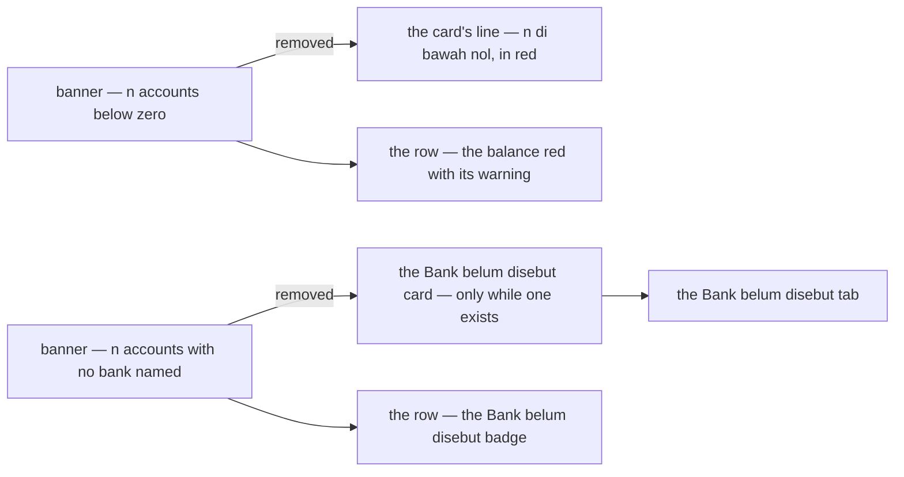
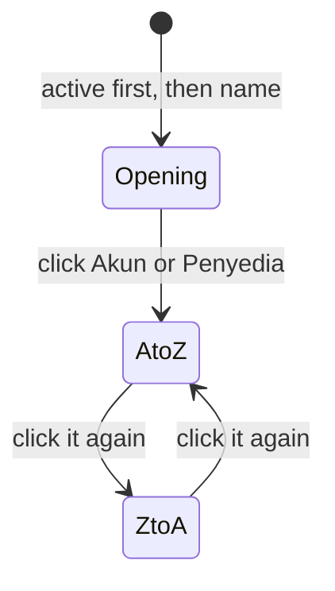
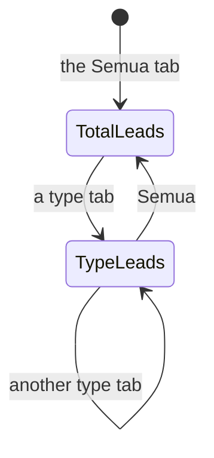

# Decisions — the financial account screens

The owner's decisions about **`/financial-accounts`** (the accounts list), an account's page and the report.
**Append-only** (RULE 12): a reversed decision is renamed and its references grepped.

The rules every screen follows are in [context_decision.md](context_decision.md); the financial account *business*
decisions stay in [financial_account/context_decision.md](../../business/financial_account/context_decision.md), where
the prototype these screens grew from was accepted
([the-prototype-and-its-contract-are-accepted](../../business/financial_account/context_decision.md#the-prototype-and-its-contract-are-accepted)).

| decision | what it decided |
| --- | --- |
| [the-accounts-subtitle-sits-under-the-title](#the-accounts-subtitle-sits-under-the-title) | the accounts page's subtitle sits directly under its title, one block, the actions beside it |
| [the-accounts-totals-are-the-order-lists-cards](#the-accounts-totals-are-the-order-lists-cards) | the totals by type are the order list's card strip — a label, one figure, a quiet line |
| [the-accounts-page-has-no-banners](#the-accounts-page-has-no-banners) | no below-zero or unknown-account banner — the cards and the rows already say it, the below-zero count in red |
| [the-accounts-type-is-a-tab-row](#the-accounts-type-is-a-tab-row) | the type is a **tab row** over the table — *Semua* and each type the team holds, with counts (was a Select, the same day) |
| [the-total-leads-until-a-type-is-picked](#the-total-leads-until-a-type-is-picked) | **Total saldo** (was *Total tim*) leads in pale blue; a picked type's card takes the lead |
| [the-total-saldo-comes-first](#the-total-saldo-comes-first) | **Total saldo** is the strip's first card, left of the types |
| [a-balance-below-zero-says-to-check-the-bank](#a-balance-below-zero-says-to-check-the-bank) | under a balance below zero, a small red line with the ⚠: *Di bawah nol · cocokkan dengan bank* · the figures right-aligned |
| [the-accounts-list-has-every-filter-the-contract-has](#the-accounts-list-has-every-filter-the-contract-has) | search · type · shop · operational only · archived, in the shared `FilterBar` — a sheet on a phone |
| [the-accounts-table-sorts-from-its-headings](#the-accounts-table-sorts-from-its-headings) | **Akun** and **Penyedia** sort from their headings, A to Z first, then flip |

## the-accounts-subtitle-sits-under-the-title

> Owner, in chat (2026-10-05), on `/financial-accounts`: *"subjudul lebih baik di bawah judul langsung"* — and *"tombol
> laporan teksnya tidak dapat"*.

```
Akun Keuangan [Tim A]                                   [Laporan] [+ Akun Baru]
Uang yang dipegang tim, dan di mana. …
```

| | |
| --- | --- |
| the block | the title, the team badge and the subtitle in one stack (`gap 1`); **Laporan** and **Akun Baru** to its right |
| was | the subtitle a section's gap below the title row, reading as a separate paragraph |
| **Laporan** | its own label, `financialAccounts.openReport` — it pointed at `financialAccounts.report`, the report page's whole namespace, and rendered i18next's *returned an object instead of string* |

## the-accounts-totals-are-the-order-lists-cards

> Owner, in chat (2026-10-05): *"format statistic ubah jadi seperti sebelumnya"*.

*Applies [a-list-summary-is-the-order-lists-card-strip](context_decision.md#a-list-summary-is-the-order-lists-card-strip)
and [a-summary-card-is-grey-with-a-thin-border](context_decision.md#a-summary-card-is-grey-with-a-thin-border).*

```
┌ Rekening bank ┐ ┌ Dompet digital ┐ ┌ Kas ──────┐ ┌ Bank belum disebut ┐ ┌ Total tim ────┐
│ Rp 12.043.500 │ │ −Rp 150.000    │ │ Rp 800.000│ │ Rp 4.200.000       │ │ Rp 16.093.500 │
│ 2 akun        │ │ 1 akun · 1 di… │ │ 1 akun    │ │ 1 akun             │ │ 5 akun        │
└───────────────┘ └────────────────┘ └───────────┘ └────────────────────┘ └───────────────┘
```

| | |
| --- | --- |
| the cards | `SummaryStrip` of `SummaryCard` — one per type the team holds money in, then **Total saldo** |
| a card | the type's label · its balance · *n akun*, and *· n di bawah nol* when any is |
| below zero | the figure stays red — [below-zero-is-warned-never-refused](../../business/financial_account/context_decision.md#below-zero-is-warned-never-refused) |
| which types | only those with an active account — the server's `TYPE_TOTAL` returns no empty type, so *Bank belum disebut* appears only while an unknown account exists |
| was | one bordered box of blocks, each value in `BalanceText` |
| unchanged | the figures — asked of the server over every active account, never summed from the visible page |

## the-accounts-page-has-no-banners

> Owner, in chat (2026-10-05): *"alert terlalu memakan space, aku ingin dengar pendapatmu dulu"* — then, to the
> recommendation to drop both and let the cards and rows carry them: *"4 oke"*.



| | |
| --- | --- |
| below zero | the card's *· n di bawah nol* in `fg.error` · the row's balance red with ⚠ — unchanged |
| unknown | the **Bank belum disebut** card (the server returns it only while such an account exists) · the row's badge · its tab finds them all |
| what went with the banners | *"Itu boleh, cocokkan dengan bank"* and *"pilih Akun Yang Mana Ini?"* — both still said on the account's own page |
| not a card click | a card does not filter — `SummaryCard` is not a control; the filter is the way to the list |

## the-accounts-type-is-a-tab-row

> Owner, in chat (2026-10-05): *"4 oke"* — a type filter beside the search — then, the same day: *"filter jenis jadi
> tab atau radio, mana yang lebih bagus?"* — tabs, as recommended.

```
[Semua 5] [Rekening bank 2] [Dompet digital 1] [Kas 1] [Bank belum disebut 1]
```

| | |
| --- | --- |
| the control | a Chakra `Tabs` row, right over the table — between the filter strip and the rows it narrows |
| the tabs | **Semua**, then each type the team holds an active account in, in the totals' order and words · each with its count of active accounts |
| why tabs, not radios | it is a view of one list, not a value on a form — read like the order list's status tabs, counts included; radios would read as a field to fill |
| a type with no account | no tab, as it has no card — unless it is the one picked |
| a change | back to page 1 · Clear leaves it — a tab is not a filter |
| was | a `Select` in the filter strip (*Semua jenis* · …), the same day |

## a-balance-below-zero-says-to-check-the-bank

> Owner, in chat (2026-10-05), after [the-accounts-page-has-no-banners](#the-accounts-page-has-no-banners): *"warningnya
> tadi di bawah saldo, kasih keterangan dikit"* — then *"angkanya juga tidak right"* and *"iconnya di bawah saja"*.

```
                                Saldo
                          −Rp 150.000
⚠ Di bawah nol · cocokkan dengan bank
```

| | |
| --- | --- |
| where | the **Saldo** cell of an account whose balance is below zero |
| the figure | alone, red, right-aligned — no ⚠ beside it |
| the line under it | ⚠ *Di bawah nol · cocokkan dengan bank* (EN *Below zero · check it against the bank*), `xs`, `fg.error`, one line — `BalanceText`'s `hint` |
| why there | the banner's message, kept, next to the one number it is about — allowed, and what to do ([below-zero-is-warned-never-refused](../../business/financial_account/context_decision.md#below-zero-is-warned-never-refused)) |
| a balance at or above zero | no line |
| right-aligned | `BalanceText` is inline now, so a cell's `textAlign="end"` reaches it — it was a block flex row that sat at the cell's left under a right-aligned heading. The fix reaches every table that uses it: the account's statement and the report |

## the-accounts-list-has-every-filter-the-contract-has

> Owner, in chat (2026-10-05), after reading what `FinancialAccountList` can filter: *"oke kasih semua filternya, sort
> langsung di tabel aja"*.

```
[Cari nama, atas nama, atau nomor] [Semua toko ⌄] ☐ Hanya operasional ☐ Tampilkan yang diarsipkan  Hapus filter
```

| filter | the contract's field | the control |
| --- | --- | --- |
| search | `q` — name, holder, number | `FilterSearch` |
| type | `types` — one at a time | the tab row over the table ([the-accounts-type-is-a-tab-row](#the-accounts-type-is-a-tab-row)) |
| shop | `shop_id` — the account the shop withdraws into, so at most one row ([a-shop-has-one-account](../../business/financial_account/context_decision.md#a-shop-has-one-account)) | `ShopSelect`, *Semua toko* · shown only where the team runs shops |
| operational only | `operational_only` | a checkbox |
| archived | `include_archived` | a checkbox — unchanged |
| the strip | the shared [`FilterBar`](../../../frontend/src/components/chrome/FilterBar.tsx) — Clear while anything is set, and on a phone the search in the row and the rest in a bottom sheet ([a-phone-filters-from-a-sheet](context_decision.md#a-phone-filters-from-a-sheet)) — closing the ⚠ of [the-accounts-type-is-a-tab-row](#the-accounts-type-is-a-tab-row) |
| a change | back to page 1 |

## the-accounts-table-sorts-from-its-headings

> The same answer — *"sort langsung di tabel aja"*.

*Applies [a-table-sorts-from-its-headings](context_decision.md#a-table-sorts-from-its-headings).*



| | |
| --- | --- |
| sortable | **Akun** (`NAME`) and **Penyedia** (`PROVIDER`) — the two columns the contract orders by |
| first click | **A to Z** — a name reads alphabetically; *largest first* is for a measure, and these are words |
| not sortable | **Saldo** and **Terakhir dicek** come from `FinancialAccountOverview`, so the server cannot order a page by them · **Nomor**, **Dipakai untuk** — the contract does not order by them |
| the opening order | the list's own: active before archived, then by name — no heading marked |
| ⚠ Penyedia's order | the server orders the stored word — bca, bni, cash, jago, shopeepay, unknown — so *Kas* sits between BNI and Jago |
| on a phone | the sheet's **Urutkan** — the four sorts and the opening order |
| the heading | the shared [`SortableHeader`](../../../frontend/src/components/chrome/SortableHeader.tsx) — the settlement list's heading moved into `components/chrome/` so the two lists share one |
| `CREATED_AT` | the contract can sort by it, but no column shows the date — not offered |

## the-total-leads-until-a-type-is-picked

> Owner, in chat (2026-10-05): *"total tim jadi total saja atau total apa gitu, defaultnya highlight biru pudar … ketika
> filter jenis ada, highlight statistic pindah sesuai jenisnya"*.

*Applies [a-summary-card-is-grey-with-a-thin-border](context_decision.md#a-summary-card-is-grey-with-a-thin-border) —
one card per strip may lead, in pale blue.*



| | |
| --- | --- |
| the name | **Total saldo** (EN *Total balance*) — was *Total tim*: the strip is the team's already, the word says what is added |
| on Semua | **Total saldo** leads — `SummaryCard emphasis`, the `lead.*` pale blue |
| on a type tab | that type's card leads, the total goes back to grey — the strip says which pile the table holds |
| a picked type with no card | nothing leads |
| still not a control | a card does not pick a tab — the tabs are the control, the lead is its echo |

## the-total-saldo-comes-first

> Owner, in chat (2026-10-05): *"total saldo paling kiri"*.

```
┌ Total saldo ──┐ ┌ Rekening bank ┐ ┌ Dompet digital ┐ ┌ Kas ──────┐ ┌ Bank belum disebut ┐
│ Rp 16.443.500 │ │ Rp 12.043.500 │ │ −Rp 150.000    │ │ Rp 350.000│ │ Rp 4.200.000       │
└───────────────┘ └───────────────┘ └────────────────┘ └───────────┘ └────────────────────┘
```

| | |
| --- | --- |
| the order | **Total saldo**, then bank · wallet · cash · bank not named — the whole, then what it is made of |
| was | the total last, after the types |
| the lead | unchanged — [the-total-leads-until-a-type-is-picked](#the-total-leads-until-a-type-is-picked) |
