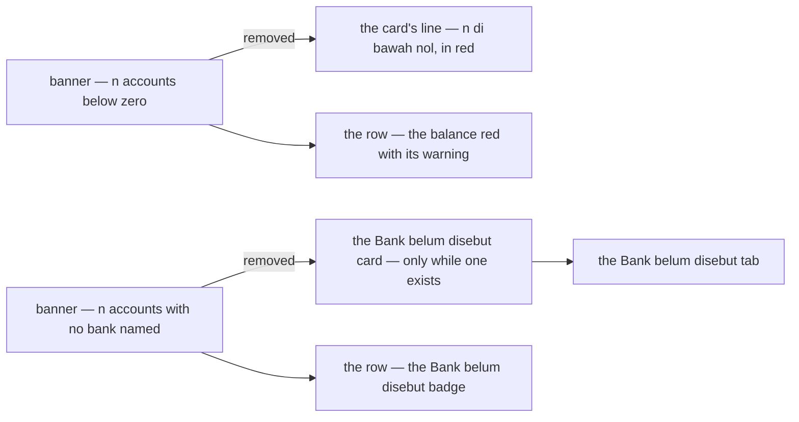
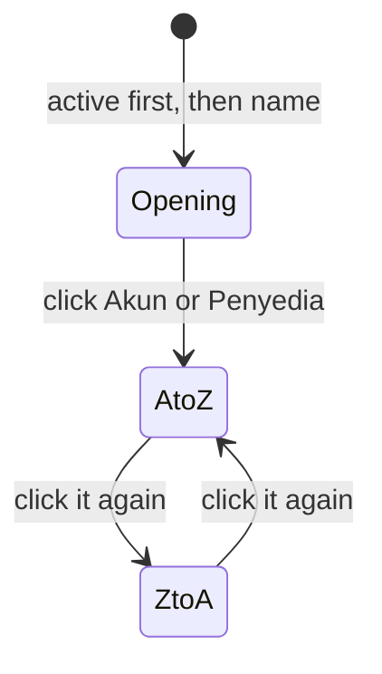
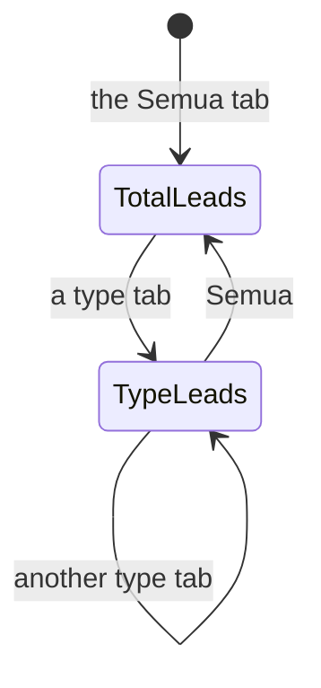
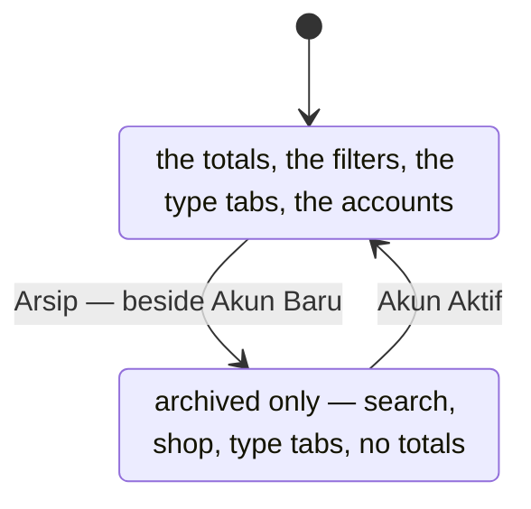
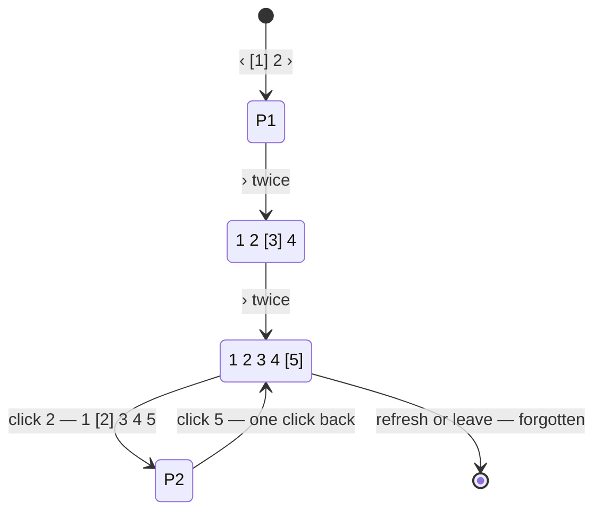

# Decisions — the financial account screens

The owner's decisions about **`/financial-accounts`** (the accounts list), an account's page and the report.
**Append-only** (RULE 12): a reversed decision is renamed and its references grepped.

The rules every screen follows are in [context_decision.md](context_decision.md); the financial account *business*
decisions stay in [financial_account/context_decision.md](../../business/financial_account/context_decision.md), where
the prototype these screens grew from was accepted
([the-prototype-and-its-contract-are-accepted](../../business/financial_account/context_decision.md#the-prototype-and-its-contract-are-accepted)).

| decision | what it decided |
| --- | --- |
| [the-accounts-subtitle-sits-under-the-title](#the-accounts-subtitle-sits-under-the-title) | the accounts page's subtitle sits directly under its title, one block, the actions beside it |
| [the-accounts-totals-are-the-order-lists-cards](#the-accounts-totals-are-the-order-lists-cards) | the totals by type are the order list's card strip — a label, one figure, a quiet line |
| [the-accounts-page-has-no-banners](#the-accounts-page-has-no-banners) | no below-zero or unknown-account banner — the cards and the rows already say it, the below-zero count in red |
| [the-accounts-type-is-a-tab-row](#the-accounts-type-is-a-tab-row) | the type is a **tab row** over the table — *Semua* and each type the team holds, with counts (was a Select, the same day) |
| [the-total-leads-until-a-type-is-picked](#the-total-leads-until-a-type-is-picked) | **Total saldo** (was *Total tim*) leads in pale blue; a picked type's card takes the lead |
| [the-total-saldo-comes-first](#the-total-saldo-comes-first) | **Total saldo** is the strip's first card, left of the types |
| [the-provider-cell-carries-the-number](#the-provider-cell-carries-the-number) | **Penyedia** and **Nomor** are one column — the badge, the number under it; it sorts by the provider |
| [a-balance-is-bold](#a-balance-is-bold) | the list's **Saldo** figure is bold |
| [the-unknown-account-reads-lainnya](#the-unknown-account-reads-lainnya) | an unknown account is **Lainnya** (EN *Other*) and shown by its shop's name — no *Unknown —*, no badge |
| [the-linked-column-shows-three-then-more](#the-linked-column-shows-three-then-more) | **Terhubung ke** (was *Dipakai untuk*): three badges at most, then **+N** opening them all in a dialog |
| [transfer-and-reconcile-sit-on-the-row](#transfer-and-reconcile-sit-on-the-row) | **Transfer** and **Rekonsiliasi** are buttons on the row; the rest stay in `⋯`, never twice |
| [operational-and-archived-share-one-filter-panel](#operational-and-archived-share-one-filter-panel) | *Hanya operasional* and *Tampilkan yang diarsipkan* sit in one panel behind a **Filter** trigger |
| [the-unknown-row-warns-and-sets-from-the-menu](#the-unknown-row-warns-and-sets-from-the-menu) | a Lainnya row says *⚠ Rekening belum ditentukan* under its name; **Tentukan Rekening** (was *Akun yang Mana Ini?*) is in `⋯` |
| [the-archive-is-its-own-view](#the-archive-is-its-own-view) | **Arsip** beside *Akun Baru* turns the screen into the archived list — no totals, search + shop + type tabs; archived-only is marked unimplemented |
| [the-accounts-pager-grows-with-the-pages-opened](#the-accounts-pager-grows-with-the-pages-opened) | the accounts list's pager needs no total: every page opened keeps its number until the screen is left (`GrowingPager`) |
| [reconcile-reads-cocokkan-saldo](#reconcile-reads-cocokkan-saldo) | the action is **Cocokkan Saldo**; *rekonsiliasi* is its dialog's description |
| [capital-reads-setor-tarik-modal](#capital-reads-setor-tarik-modal) | the action is **Setor / Tarik Modal**, its choice *Setor modal* · *Tarik modal* |
| [a-dialog-choice-is-a-radio-pill](#a-dialog-choice-is-a-radio-pill) | a dialog's either/or is radio pills (`RadioPills`), not a segmented switch |
| [operational-asks-before-it-changes](#operational-asks-before-it-changes) | marking or unmarking operational confirms first, saying what it changes |
| [an-account-note-is-a-textarea](#an-account-note-is-a-textarea) | every note in the account dialogs is a three-row textarea, and every field carries a placeholder |
| [lainnya-is-offered-with-a-warning](#lainnya-is-offered-with-a-warning) | provider **Lainnya** is in the picker, marked unimplemented, with a warning once picked |
| [the-wallet-reads-dompet-digital](#the-wallet-reads-dompet-digital) | the wallet type reads **Dompet digital** everywhere, not *Dompet* |
| [the-form-asks-the-type-first](#the-form-asks-the-type-first) | New Account's type pills include **Lainnya**; the provider field follows the type — a picker of its own options, or the provider it sets, said in words |
| [kas-and-lainnya-ask-no-provider](#kas-and-lainnya-ask-no-provider) | Kas and Lainnya show no provider field at all; a bank and a wallet keep their picker |
| [a-balance-below-zero-says-to-check-the-bank](#a-balance-below-zero-says-to-check-the-bank) | under a balance below zero, a small red line with the ⚠: *Di bawah nol · cocokkan dengan bank* · the figures right-aligned |
| [the-accounts-list-has-every-filter-the-contract-has](#the-accounts-list-has-every-filter-the-contract-has) | search · type · shop · operational only · archived, in the shared `FilterBar` — a sheet on a phone |
| [the-accounts-table-sorts-from-its-headings](#the-accounts-table-sorts-from-its-headings) | **Akun** and **Penyedia** sort from their headings, A to Z first, then flip |

## the-accounts-subtitle-sits-under-the-title

> Owner, in chat (2026-10-05), on `/financial-accounts`: *"subjudul lebih baik di bawah judul langsung"* — and *"tombol
> laporan teksnya tidak dapat"*.

```
Akun Keuangan [Tim A]                                   [Laporan] [+ Akun Baru]
Uang yang dipegang tim, dan di mana. …
```

| | |
| --- | --- |
| the block | the title, the team badge and the subtitle in one stack (`gap 1`); **Laporan** and **Akun Baru** to its right |
| was | the subtitle a section's gap below the title row, reading as a separate paragraph |
| **Laporan** | its own label, `financialAccounts.openReport` — it pointed at `financialAccounts.report`, the report page's whole namespace, and rendered i18next's *returned an object instead of string* |

## the-accounts-totals-are-the-order-lists-cards

> Owner, in chat (2026-10-05): *"format statistic ubah jadi seperti sebelumnya"*.

*Applies [a-list-summary-is-the-order-lists-card-strip](context_decision.md#a-list-summary-is-the-order-lists-card-strip)
and [a-summary-card-is-grey-with-a-thin-border](context_decision.md#a-summary-card-is-grey-with-a-thin-border).*

```
┌ Rekening bank ┐ ┌ Dompet digital ┐ ┌ Kas ──────┐ ┌ Bank belum disebut ┐ ┌ Total tim ────┐
│ Rp 12.043.500 │ │ −Rp 150.000    │ │ Rp 800.000│ │ Rp 4.200.000       │ │ Rp 16.093.500 │
│ 2 akun        │ │ 1 akun · 1 di… │ │ 1 akun    │ │ 1 akun             │ │ 5 akun        │
└───────────────┘ └────────────────┘ └───────────┘ └────────────────────┘ └───────────────┘
```

| | |
| --- | --- |
| the cards | `SummaryStrip` of `SummaryCard` — one per type the team holds money in, then **Total saldo** |
| a card | the type's label · its balance · *n akun*, and *· n di bawah nol* when any is |
| below zero | the figure stays red — [below-zero-is-warned-never-refused](../../business/financial_account/context_decision.md#below-zero-is-warned-never-refused) |
| which types | only those with an active account — the server's `TYPE_TOTAL` returns no empty type, so *Bank belum disebut* appears only while an unknown account exists |
| was | one bordered box of blocks, each value in `BalanceText` |
| unchanged | the figures — asked of the server over every active account, never summed from the visible page |

## the-accounts-page-has-no-banners

> Owner, in chat (2026-10-05): *"alert terlalu memakan space, aku ingin dengar pendapatmu dulu"* — then, to the
> recommendation to drop both and let the cards and rows carry them: *"4 oke"*.



| | |
| --- | --- |
| below zero | the card's *· n di bawah nol* in `fg.error` · the row's balance red with ⚠ — unchanged |
| unknown | the **Bank belum disebut** card (the server returns it only while such an account exists) · the row's badge · its tab finds them all |
| what went with the banners | *"Itu boleh, cocokkan dengan bank"* and *"pilih Akun Yang Mana Ini?"* — both still said on the account's own page |
| not a card click | a card does not filter — `SummaryCard` is not a control; the filter is the way to the list |

## the-accounts-type-is-a-tab-row

> Owner, in chat (2026-10-05): *"4 oke"* — a type filter beside the search — then, the same day: *"filter jenis jadi
> tab atau radio, mana yang lebih bagus?"* — tabs, as recommended.

```
[Semua 5] [Rekening bank 2] [Dompet digital 1] [Kas 1] [Bank belum disebut 1]
```

| | |
| --- | --- |
| the control | a Chakra `Tabs` row, right over the table — between the filter strip and the rows it narrows |
| the tabs | **Semua**, then each type the team holds an active account in, in the totals' order and words · each with its count of active accounts |
| why tabs, not radios | it is a view of one list, not a value on a form — read like the order list's status tabs, counts included; radios would read as a field to fill |
| a type with no account | no tab, as it has no card — unless it is the one picked |
| a change | back to page 1 · Clear leaves it — a tab is not a filter |
| was | a `Select` in the filter strip (*Semua jenis* · …), the same day |

## a-balance-below-zero-says-to-check-the-bank

> Owner, in chat (2026-10-05), after [the-accounts-page-has-no-banners](#the-accounts-page-has-no-banners): *"warningnya
> tadi di bawah saldo, kasih keterangan dikit"* — then *"angkanya juga tidak right"* and *"iconnya di bawah saja"*.

```
                                Saldo
                          −Rp 150.000
⚠ Di bawah nol · cocokkan dengan bank
```

| | |
| --- | --- |
| where | the **Saldo** cell of an account whose balance is below zero |
| the figure | alone, red, right-aligned — no ⚠ beside it |
| the line under it | ⚠ *Di bawah nol · cocokkan dengan bank* (EN *Below zero · check it against the bank*), `xs`, `fg.error`, one line — `BalanceText`'s `hint` |
| why there | the banner's message, kept, next to the one number it is about — allowed, and what to do ([below-zero-is-warned-never-refused](../../business/financial_account/context_decision.md#below-zero-is-warned-never-refused)) |
| a balance at or above zero | no line |
| right-aligned | `BalanceText` is inline now, so a cell's `textAlign="end"` reaches it — it was a block flex row that sat at the cell's left under a right-aligned heading. The fix reaches every table that uses it: the account's statement and the report |

## the-accounts-list-has-every-filter-the-contract-has

> Owner, in chat (2026-10-05), after reading what `FinancialAccountList` can filter: *"oke kasih semua filternya, sort
> langsung di tabel aja"*.

```
[Cari nama, atas nama, atau nomor] [Semua toko ⌄] ☐ Hanya operasional ☐ Tampilkan yang diarsipkan  Hapus filter
```

| filter | the contract's field | the control |
| --- | --- | --- |
| search | `q` — name, holder, number | `FilterSearch` |
| type | `types` — one at a time | the tab row over the table ([the-accounts-type-is-a-tab-row](#the-accounts-type-is-a-tab-row)) |
| shop | `shop_id` — the account the shop withdraws into, so at most one row ([a-shop-has-one-account](../../business/financial_account/context_decision.md#a-shop-has-one-account)) | `ShopSelect`, *Semua toko* · shown only where the team runs shops |
| operational only | `operational_only` | a checkbox |
| archived | `include_archived` | a checkbox — unchanged |
| the strip | the shared [`FilterBar`](../../../frontend/src/components/chrome/FilterBar.tsx) — Clear while anything is set, and on a phone the search in the row and the rest in a bottom sheet ([a-phone-filters-from-a-sheet](context_decision.md#a-phone-filters-from-a-sheet)) — closing the ⚠ of [the-accounts-type-is-a-tab-row](#the-accounts-type-is-a-tab-row) |
| a change | back to page 1 |

## the-accounts-table-sorts-from-its-headings

> The same answer — *"sort langsung di tabel aja"*.

*Applies [a-table-sorts-from-its-headings](context_decision.md#a-table-sorts-from-its-headings).*



| | |
| --- | --- |
| sortable | **Akun** (`NAME`) and **Penyedia** (`PROVIDER`) — the two columns the contract orders by |
| first click | **A to Z** — a name reads alphabetically; *largest first* is for a measure, and these are words |
| not sortable | **Saldo** and **Terakhir dicek** come from `FinancialAccountOverview`, so the server cannot order a page by them · **Nomor**, **Dipakai untuk** — the contract does not order by them |
| the opening order | the list's own: active before archived, then by name — no heading marked |
| ⚠ Penyedia's order | the server orders the stored word — bca, bni, cash, jago, shopeepay, unknown — so *Kas* sits between BNI and Jago |
| on a phone | the sheet's **Urutkan** — the four sorts and the opening order |
| the heading | the shared [`SortableHeader`](../../../frontend/src/components/chrome/SortableHeader.tsx) — the settlement list's heading moved into `components/chrome/` so the two lists share one |
| `CREATED_AT` | the contract can sort by it, but no column shows the date — not offered |

## the-total-leads-until-a-type-is-picked

> Owner, in chat (2026-10-05): *"total tim jadi total saja atau total apa gitu, defaultnya highlight biru pudar … ketika
> filter jenis ada, highlight statistic pindah sesuai jenisnya"*.

*Applies [a-summary-card-is-grey-with-a-thin-border](context_decision.md#a-summary-card-is-grey-with-a-thin-border) —
one card per strip may lead, in pale blue.*



| | |
| --- | --- |
| the name | **Total saldo** (EN *Total balance*) — was *Total tim*: the strip is the team's already, the word says what is added |
| on Semua | **Total saldo** leads — `SummaryCard emphasis`, the `lead.*` pale blue |
| on a type tab | that type's card leads, the total goes back to grey — the strip says which pile the table holds |
| a picked type with no card | nothing leads |
| still not a control | a card does not pick a tab — the tabs are the control, the lead is its echo |

## the-total-saldo-comes-first

> Owner, in chat (2026-10-05): *"total saldo paling kiri"*.

```
┌ Total saldo ──┐ ┌ Rekening bank ┐ ┌ Dompet digital ┐ ┌ Kas ──────┐ ┌ Bank belum disebut ┐
│ Rp 16.443.500 │ │ Rp 12.043.500 │ │ −Rp 150.000    │ │ Rp 350.000│ │ Rp 4.200.000       │
└───────────────┘ └───────────────┘ └────────────────┘ └───────────┘ └────────────────────┘
```

| | |
| --- | --- |
| the order | **Total saldo**, then bank · wallet · cash · bank not named — the whole, then what it is made of |
| was | the total last, after the types |
| the lead | unchanged — [the-total-leads-until-a-type-is-picked](#the-total-leads-until-a-type-is-picked) |

## the-provider-cell-carries-the-number

> Owner, in chat (2026-10-05): *"penyedia dan nomor jadikan 1, sort by penyedia, saldo bold"*.

```
Akun                   Penyedia ⇅      Saldo
BCA Operasional        [BCA]           Rp 11.443.500
PT Melati Sejahtera    1234567890
Kas Melati             [Kas]           Rp 350.000
```

| | |
| --- | --- |
| the column | **Penyedia** — the `ProviderBadge`, and the number under it in quiet mono (`xs`, `fg.muted`) |
| no number | a cash box or an unknown account — the badge alone, one line |
| the sort | the heading sorts by the provider ([the-accounts-table-sorts-from-its-headings](#the-accounts-table-sorts-from-its-headings)) — the badge leads the cell because it is what the column is ordered by |
| was | two columns, **Penyedia** · **Nomor** |
| why badge first here | [a-badge-stacks-under-its-text-when-the-table-is-cramped](context_decision.md#a-badge-stacks-under-its-text-when-the-table-is-cramped) puts a QUALIFYING badge under its text; here the badge is the value itself and the number qualifies it |

## a-balance-is-bold

> The same message — *"saldo bold"*.

| | |
| --- | --- |
| where | the accounts list's **Saldo** cell — `BalanceText bold` |
| below zero | bold and red, the ⚠ line under it unchanged ([a-balance-below-zero-says-to-check-the-bank](#a-balance-below-zero-says-to-check-the-bank)) |
| elsewhere | unchanged — the statement's *Saldo setelah* and the report keep their weight |

## the-unknown-account-reads-lainnya

> Owner, in chat (2026-10-06), on `/financial-accounts`: *"Bank no named bukan nama yang bagus … yang unknown tidak
> perlu ada badge bank belum disebut dan unknown di depannya … dipakai untuk mungkin dipakai oleh atau istilah lain …
> badgenya maksimal 3 … aksi utama … keluarkan 2 … filter operasional dan tampilkan arsip jadikan dalam 1 panel"*.

After three rounds of names (*Belum teridentifikasi*, *Tanpa bank*, *Belum terdaftar* and others), the owner chose the
direction: *"semacam lainnya atau semacamnya"*.

```
Akun              Penyedia      Saldo
Melati TikTok     [Lainnya]     Rp 4.200.000      [Akun yang Mana Ini?] [Transfer Keluar] ⋯
```

| | |
| --- | --- |
| the word | **Lainnya** (EN *Other*) — the card, the tab and the provider badge; it replaces *Bank belum disebut* |
| the row's name | the shop it holds withdrawals for — *Melati TikTok* — not the server's *Unknown — shop #25*; `accountName` in `features/financialAccount/vocab.ts`, on the list, the account's page, the report and the shop dialog |
| no badge | the orange *Bank belum disebut* badge is gone — the provider badge already says it |
| still shown | the action that fixes it — **Akun yang Mana Ini?** — on the row ([transfer-and-reconcile-sit-on-the-row](#transfer-and-reconcile-sit-on-the-row)) |
| the server | unchanged — it still names the account *Unknown — shop #25*; the screens choose how to show it |

⚠ It changes the words of [the-accounts-page-has-no-banners](#the-accounts-page-has-no-banners),
[the-accounts-type-is-a-tab-row](#the-accounts-type-is-a-tab-row) and
[the-accounts-totals-are-the-order-lists-cards](#the-accounts-totals-are-the-order-lists-cards): read their
*Bank belum disebut* as **Lainnya**, and the row badge they mention as gone.

## the-linked-column-shows-three-then-more

> The same message — *"dipakai untuk mungkin dipakai oleh atau istilah lain, soalnya ada operasional di situ, badgenya
> maksimal 3, lalu ada tanda + kalau lebih … dan bisa didetailkan dengan modal"* — and the heading picked: **Terhubung ke**.

```
Terhubung ke
[Operasional] [Melati Official] [Melati Store] [+1]   ← +1 opens every link in a dialog
```

| | |
| --- | --- |
| the heading | **Terhubung ke** (EN *Linked to*) — was *Dipakai untuk*; it fits both kinds: Operasional and the shops that withdraw in |
| the badges | Operasional first, then the shops — **three** at most |
| more than three | a small **+N** button; it opens a dialog with the account's name, Operasional with what it allows, and every shop as a `ShopItem` |
| the row | the +N and the dialog stop the click — the row does not open the account's page underneath |
| where | `AccountLinks`, `pages/financial-accounts/components/` |

## transfer-and-reconcile-sit-on-the-row

> The same message — *"aksi utama, atau yang mungkin sering dipakai keluarkan 2 dan sisanya tetap ..."* — and the
> pair picked: **Transfer + Rekonsiliasi**.

| state | on the row | in `⋯` |
| --- | --- | --- |
| active | **Transfer** · **Rekonsiliasi** | Modal · Ubah · Tandai / Hapus Tanda Operasional · Arsipkan |
| Lainnya (unknown) | **Akun yang Mana Ini?** · **Transfer Keluar** | Arsipkan |
| archived | **Pulihkan** | no `⋯` — nothing else to do |

| | |
| --- | --- |
| never twice | a button is not repeated in the menu — on the list and on the account's page alike (`AccountActions buttons`) |
| labels | Title Case, as every button and menu item — *Transfer Keluar*, *Modal Masuk / Keluar*, *Tandai Operasional*, *Akun yang Mana Ini?* were sentence case and are fixed with it |

## operational-and-archived-share-one-filter-panel

> The same message — *"filter operasional dan tampilkan arsip jadikan dalam 1 panel dengan 1 filter trigger sendiri"*.

```
[Cari …] [Semua toko ⌄] [⚙ Filter 1]  Hapus filter
                         ┌───────────────────────────┐
                         │ ☑ Hanya operasional        │
                         │ ☐ Tampilkan yang diarsipkan│
                         └───────────────────────────┘
```

| | |
| --- | --- |
| the trigger | **Filter**, the sliders icon, and a count of the options that are on (`AccountOptionsFilter`) |
| the panel | a popover with the two checkboxes — they apply as they change |
| on a phone | the FilterBar's sheet already holds every control, so the two checkboxes stand in it directly — no panel inside a panel |
| Clear | unchanged — both still count as filters ([the-accounts-list-has-every-filter-the-contract-has](#the-accounts-list-has-every-filter-the-contract-has)) |

## the-unknown-row-warns-and-sets-from-the-menu

> Owner, in chat (2026-10-06), on what *Akun yang Mana Ini?* means and whether the context makes it mandatory: *"kasih
> warning tapi dimana enaknya?"* — then *"oke posisi di situ seperti itu, lalu untuk akun yang mana ini, taruh saja di
> ..., tapi nama actionnya bukan akun yang mana ini"* — and the name picked: **Tentukan Rekening**.

```
Akun                              Penyedia     …   Aksi
Melati TikTok                     [Lainnya]        [Transfer Keluar] ⋯  → Tentukan Rekening · Arsipkan
⚠ Rekening belum ditentukan
```

| | |
| --- | --- |
| the warning | *⚠ Rekening belum ditentukan* (EN *No account set yet*), `xs`, `fg.warning`, on the Akun cell's second line — where the holder is, and where the type only repeated the provider badge |
| why warn | not mandatory — nothing in the context sets a deadline ([a-shop-with-no-account-gets-an-unknown-one](../../business/financial_account/context_decision.md#a-shop-with-no-account-gets-an-unknown-one)) — but every later withdrawal from the shop lands in Lainnya until it is set, and reconciling the real bank first posts the same money as an adjustment, counting it twice |
| the action | **Tentukan Rekening** (EN *Set Account*) — was *Akun yang Mana Ini?* — the same dialog, fill in or move in ([an-unknown-account-is-filled-in-or-moved-in](../../business/financial_account/context_decision.md#an-unknown-account-is-filled-in-or-moved-in)); its title says the same |
| where | the row's `⋯`, above Arsipkan — on the list and on the account's page; the row keeps **Transfer Keluar** |

⚠ It changes [transfer-and-reconcile-sit-on-the-row](#transfer-and-reconcile-sit-on-the-row)'s Lainnya row — one
button, *Transfer Keluar*, not two — and [the-unknown-account-reads-lainnya](#the-unknown-account-reads-lainnya)'s
*still shown … on the row*: the action is in `⋯`, the warning is on the row.

## the-archive-is-its-own-view

> Owner, in chat (2026-10-06): *"apa yang kuinginkan untuk arsip adalah apinya bisa filter arsip saja, bukan tampilkan
> sekalian arsip, tapi aku tidak akan mengubah be nya jadi kasih saja warning unimplemented, lalu untuk melihat arsip
> klik button di atas, satu deret dengan buat akun, tampilannya tetap di sini saja, cuma ada tab status dan filter cari
> dan toko maybe, stat tidak ada"*.



| | |
| --- | --- |
| the way in | **Arsip** (EN *Archive*), an outline button in the header row: *Laporan* · *Arsip* · *Akun Baru* |
| the view | the same screen at `?view=archived` — title **Arsip Akun**, a subtitle saying they were closed at zero, **Akun Aktif** to go back |
| on it | the search, the shop and the type tabs (their counts of the archived) · the table, each row offering **Pulihkan** only |
| not on it | the totals — every archived account holds zero — and the Filter panel |
| the panel | *Tampilkan yang diarsipkan* left it; it holds *Hanya operasional* alone ([operational-and-archived-share-one-filter-panel](#operational-and-archived-share-one-filter-panel)) |
| ⚠ unimplemented | the contract's `include_archived` only ADDS the archived to the active. The view asks for the first 200 with them included, keeps the archived on screen, and counts and pages there — a `derived` pending mark beside the title and the strip at the top say so (`pages/financial-accounts/pending.ts`). The backend is not changed |
| "tab status" | read as the existing type tabs — the archive has one status, so a status tab would hold one option |

## the-accounts-pager-grows-with-the-pages-opened

> Owner, in chat (2026-10-06): *"aku ingin desain paginasi yang baru"* — *"page kebanyakan tidak punya total, cuma next
> dan prev"* — *"halaman yang punya angka tambahan lebih bagus … ada menyimpan statenya sementara jadi paginasi halamannya
> nanti tidak perlu kembali dari awal lagi kalau mau akses last page yang pernah diakses, tapi cuma bertahan sampai
> halaman belum refresh atau belum navigasi"* — the growing numbers picked, on the accounts page first.



| | |
| --- | --- |
| what it needs | only whether a page AFTER this one exists — no total. This contract has one, so it is exact here; for one without, "this page came back full" |
| the numbers | every page from 1 to the furthest opened, and one more while that furthest had a next · Chakra's ellipsis keeps a long trail short: `1 … 7 [8] 9 … 15` |
| › | opens the next new page; off on the last known number once the data has ended |
| the current page | filled rose, `brand.solid` ([a-chosen-option-is-in-the-main-tone](context_decision.md#a-chosen-option-is-in-the-main-tone)) |
| the memory | component state — kept while the screen is open, forgotten on a refresh or on leaving it; a new filter, tab, sort, page size or the archive view starts it over |
| one page | `‹ [1] ›`, both arrows off — always on screen ([the-pager-is-always-on-screen](context_decision.md#the-pager-is-always-on-screen)) |
| per page | the selector on the left, 10 / 20 / 50, as before |
| where | `GrowingPager`, `components/chrome/` — on the accounts list only; every other list keeps `Pagination` until the owner decides |

### the pager's look — one row of equal boxes

> Owner, in chat (2026-10-06): *"kurang serasi antara page dan perpage"*.

```
                                  Per halaman [20⌄]   [‹] [1] [2] [3] [›]
```

| | |
| --- | --- |
| placement | the per-page selector and the page buttons together on the right — was the selector far left, the pages far right |
| size | everything `xs`, 32px — the page buttons were 36px |
| style | the page buttons outlined like the selector's box, one radius, `xs` type; the current page filled rose, its border with it |

## reconcile-reads-cocokkan-saldo

> Owner, in chat (2026-10-06): *"theme checkbox sesuaikan · rekonsiliasi jadikan deskripsi di modalnya, untuk nama
> aksinya ganti dengan yang lebih familiar · modal masuk keluar bisa diganti namanya · pill di modal form ganti jadi
> radio pill · set operasional kasih confirm dulu · catatan tolong textarea · dan sebisa mungkin form ada
> placeholdernya"* — the names picked: **Cocokkan Saldo** and **Setor / Tarik Modal**.

```
[Transfer] [Cocokkan Saldo] ⋯

┌ Cocokkan Saldo — BCA Operasional ─────────────────────────────────┐
│ Rekonsiliasi: cocokkan pembukuan dengan yang tampil di aplikasi    │
│ bank, atau hasil hitung kas. Selisihnya dicatat sebagai penyesuaian.│
```

| | |
| --- | --- |
| the action | **Cocokkan Saldo** (EN *Match Balance*) — was *Rekonsiliasi*: the word a person uses, for a bank and a cash box alike |
| the dialog | titled *Cocokkan Saldo — {name}*, with *Rekonsiliasi: …* as its description (`FormDialog description`) · its button **Cocokkan** |
| unchanged | what it does — [adjustment-is-for-reconciling-only](../../business/financial_account/context_decision.md#adjustment-is-for-reconciling-only) |

⚠ Earlier entries' *Rekonsiliasi* — [transfer-and-reconcile-sit-on-the-row](#transfer-and-reconcile-sit-on-the-row) — reads **Cocokkan Saldo** now.

## capital-reads-setor-tarik-modal

The same message — *"modal masuk keluar bisa diganti namanya"*.

| | |
| --- | --- |
| the action | **Setor / Tarik Modal** (EN *Add / Withdraw Capital*) — was *Modal Masuk / Keluar* |
| the dialog | *Setor / Tarik Modal — {name}*, the direction as radio pills **Setor modal** · **Tarik modal** (were *Uang masuk* · *Uang keluar*) |
| unchanged | [capital-joins-the-types](../../business/financial_account/context_decision.md#capital-joins-the-types) — the owner's own money, a direction and a positive amount |

## a-dialog-choice-is-a-radio-pill

The same message — *"pill di modal form ganti jadi radio pill"*.

```
Arah     ( ◉ Setor modal )  ( ○ Tarik modal )
Jenis    ( ◉ Rekening bank )  ( ○ Dompet )  ( ○ Kas )
```

| | |
| --- | --- |
| the control | `RadioPills` (`components/inputs/`) — rounded pills, each with its radio mark and label, sized to its words, the chosen one rose (`radioCard` in theme.ts) |
| where | Setor / Tarik Modal's direction · New Account's and Tentukan Rekening's type · Tentukan Rekening's *isi data* / *pindahkan* |
| was | Chakra's `SegmentGroup` — a segmented switch, which reads as a view toggle, not a field to answer |

## operational-asks-before-it-changes

The same message — *"set operasional kasih confirm dulu"*.

| | |
| --- | --- |
| mark | `ConfirmDialog` *Tandai {name} sebagai Operasional* — *{name} akan bisa dipilih untuk membayar restock dan biaya.* |
| unmark | *Hapus Tanda Operasional {name}* — *{name} tidak lagi bisa dipilih untuk membayar restock dan biaya.* |
| why | it changes what everybody on the team is offered as *Paid from* — it was one click, unannounced |
| not destructive | the confirm button stays the plain action, not red — the mark can be set back |

## an-account-note-is-a-textarea

The same message — *"catatan tolong textarea · dan sebisa mungkin form ada placeholdernya"*. Applies
[chakra-first-whenever-it-has-the-component](context_decision.md#chakra-first-whenever-it-has-the-component).

| | |
| --- | --- |
| the notes | Transfer's *Catatan*, Setor / Tarik Modal's *Catatan* and Cocokkan Saldo's *Kenapa berbeda?* — a `Textarea`, three rows, resizable downwards; New Account's *Keterangan* the same |
| placeholders | every typed field: name *mis. BCA Operasional* · number *mis. 1234567890* · holder *mis. PT Melati Sejahtera* · description, notes, Tentukan Rekening's name · the shop picker *Pilih toko* (it read the English default) · money fields *0* and dates *Pilih tanggal* already had theirs |

## lainnya-is-offered-with-a-warning

> Owner, in chat (2026-10-06): *"oke buat dengan warning saja"* — the business side is
> [another-bank-is-provider-lainnya](../../business/financial_account/context_decision.md#another-bank-is-provider-lainnya).

```
Penyedia   [Lainnya ⚠2 ⌄]
⚠ Server belum menerima penyedia Lainnya — menyimpan akun ini akan ditolak.
```

| | |
| --- | --- |
| the picker | `ProviderPicker` offers **Lainnya** last, its option carrying the pending mark `⚠2` |
| once picked | a warning under the field, on New Account and on Tentukan Rekening |
| the list | `features/financialAccount/pending.ts` — the domain's, since the dialogs open on more than one page; *the archive list* is 1, *provider Lainnya* 2 · the accounts page shows its summary strip on both views now |
| the demo | Storybook's stub ACCEPTS provider Lainnya, and the book has *Mandiri Usaha* (provider Lainnya, a bank account) — owner: *"untuk lainnya buat aja dulu demonya saja … kita tidak akan mengubah api apapun"*. No API changes; the real server still refuses it, and the mark and the warning stay |

## the-wallet-reads-dompet-digital

> Owner, in chat (2026-10-06): *"dompet itu dompet digital"*.

| | |
| --- | --- |
| the word | **Dompet digital** (EN *Digital wallet*, plural *Digital wallets*) — the type's label on the forms' radio pills, the account's identity line and the card — was *Dompet* on the forms |

## the-form-asks-the-type-first

> The business side is [the-type-decides-the-provider](../../business/financial_account/context_decision.md#the-type-decides-the-provider).

```
Jenis      ( ◉ Rekening bank )  ( ○ Dompet digital )  ( ○ Kas )  ( ○ Lainnya )
Penyedia   [Pilih bank atau dompet ⌄]   ← BCA · BNI · Jago

Jenis      ( ○ … )  ( ◉ Kas )
Penyedia   Kas — otomatis dari jenisnya   (no number field)

Jenis      ( ○ … )  ( ◉ Lainnya )
⚠2 Server belum menerima jenis Lainnya — menyimpan akun ini akan ditolak.
Penyedia   Lainnya — otomatis dari jenisnya
Nomor rekening (tidak wajib)
```

| | |
| --- | --- |
| the type pills | Rekening bank · Dompet digital · Kas · **Lainnya** on New Account; Tentukan Rekening keeps the three real ones (`IDENTIFIABLE_TYPES`) |
| the provider field | a picker of the type's own options (`PROVIDERS_BY_TYPE`) — the only option pre-picked — or, for Kas and Lainnya, the provider in words, *… — otomatis dari jenisnya* |
| switching the type | keeps the provider if the new type offers it, else resets it (`providerFor`) |
| the number | required for a bank and a wallet · optional for Lainnya · none for Kas |
| the mark | `⚠2` moved from the provider option to the type: *Jenis Lainnya* (`otherType`) |
| the row | a Lainnya account a person opened shows its holder under its name — the *Rekening belum ditentukan* warning only where a shop's withdrawals land |
| the demo | *Mandiri Usaha* is type Lainnya now · creating one saves in Storybook, without a number |

⚠ It replaces [lainnya-is-offered-with-a-warning](#lainnya-is-offered-with-a-warning) — Lainnya is no longer a provider
option on a bank account.

## kas-and-lainnya-ask-no-provider

> Owner, in chat (2026-10-06): *"yang tidak perlu pilih penyedia kecuali dompet, hilangkan saja field penyedianya"*.

```
Jenis  ( ◉ Kas )           → no Penyedia field, no number
Jenis  ( ◉ Lainnya )       → no Penyedia field, number optional
Jenis  ( ◉ Dompet digital ) → Penyedia [ShopeePay ⌄]  — kept, though it is the only one
```

| | |
| --- | --- |
| Kas, Lainnya | no provider field — the type sets it; the line *… — otomatis dari jenisnya* that stood there is gone |
| digital wallet | the picker stays, ShopeePay pre-picked — more wallets will join it |
| bank account | the picker, BCA · BNI · Jago |
| where | New Account and Tentukan Rekening alike |

It narrows [the-form-asks-the-type-first](#the-form-asks-the-type-first)'s *the provider in words*.
