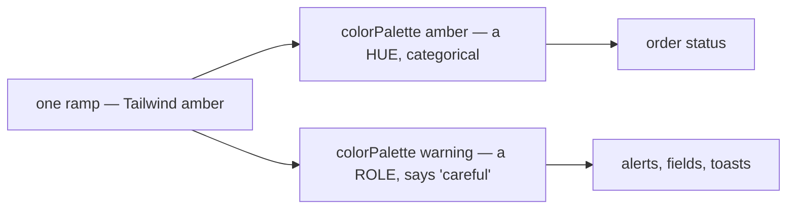
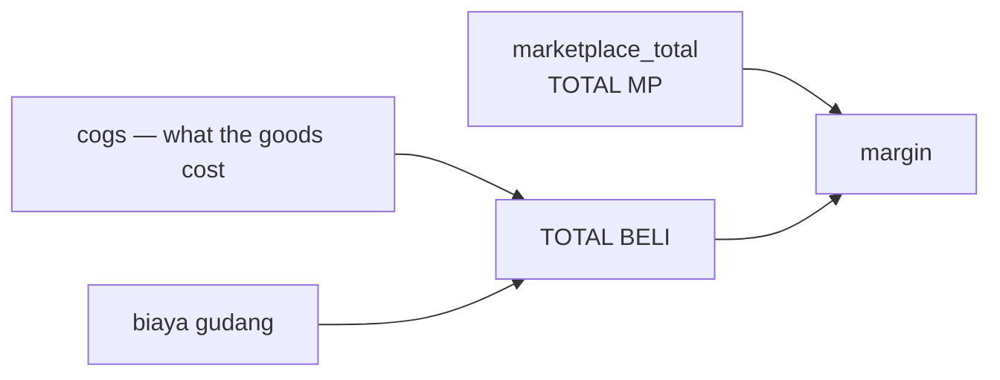
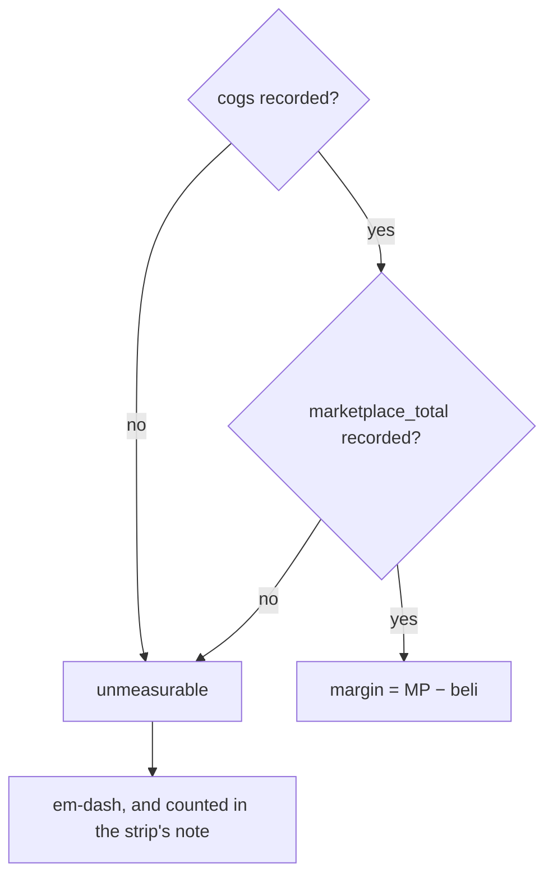
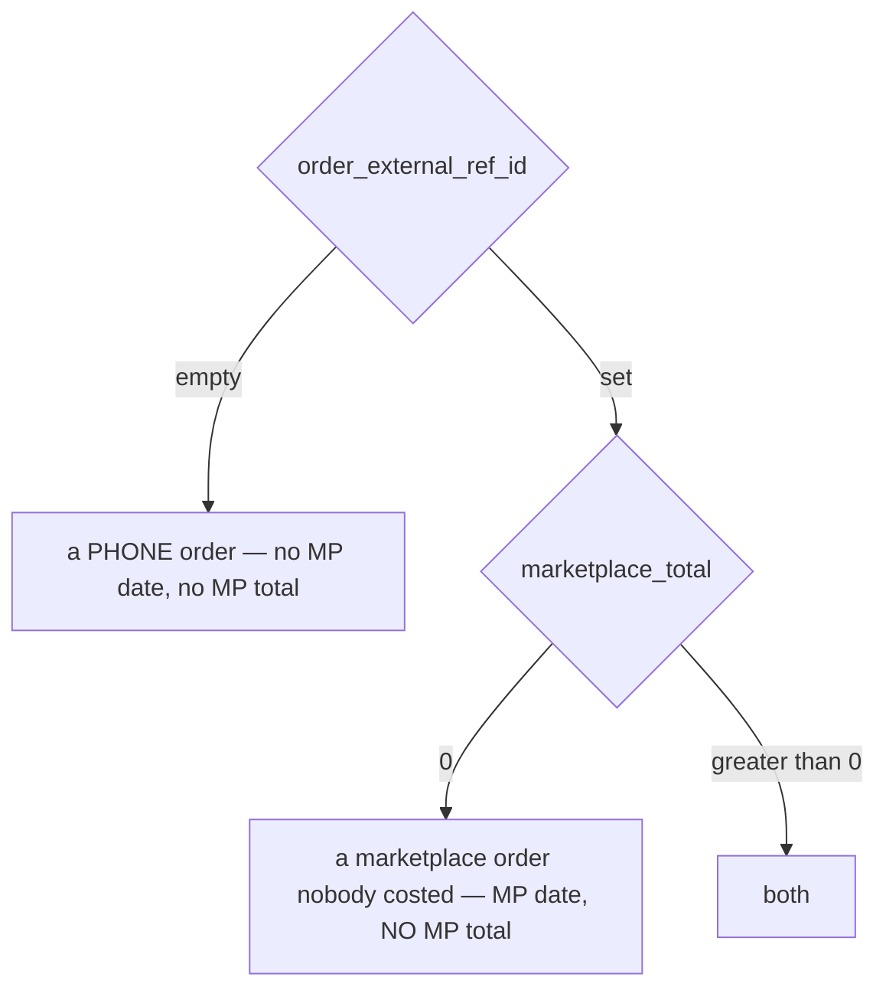
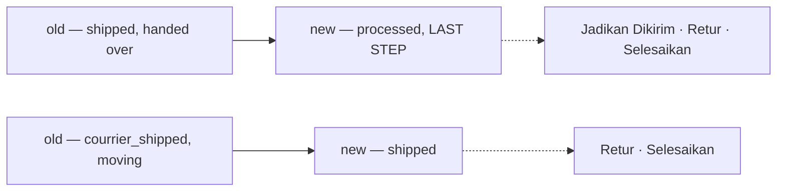
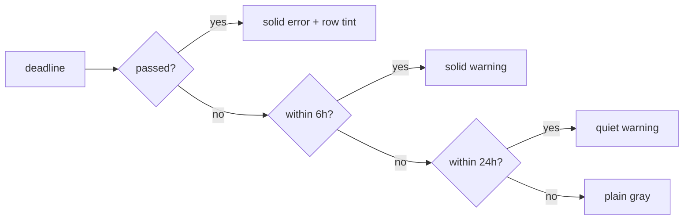
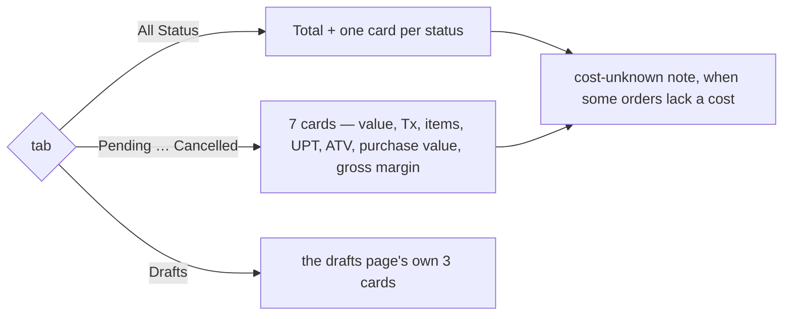

# Decisions — the order list

The owner's decisions about the selling team's **order list** (`/orders`) — its row, its tabs and its summary. **Append-only** (RULE 12): a reversed decision is renamed and its references grepped.

The rules every screen follows are in [context_decision.md](context_decision.md). These were recorded in
[technical/order/design_decision.md](../order/design_decision.md) first and moved here on 2026-10-02;
each old heading there now points here.

| decision | what it settles |
| --- | --- |
| [status-colours-are-carried-over-verbatim](#status-colours-are-carried-over-verbatim) | every status keeps the hue it had, collisions included |
| [the-row-shows-total-beli-and-total-mp](#the-row-shows-total-beli-and-total-mp) | two totals: what it cost us, and what the platform paid — it REPLACES an-order-total-is-goods-plus-fulfilment |
| [the-margin-is-mp-minus-total-beli](#the-margin-is-mp-minus-total-beli) | margin and its percentage are both measured against the MARKETPLACE price |
| [every-date-gets-its-own-column](#every-date-gets-its-own-column) | three dates, three columns — it REPLACES two-dates-and-two-totals-with-ours-leading |
| [a-filtered-status-shows-its-own-date](#a-filtered-status-shows-its-own-date) | the third date appears only under the tab it answers |
| [harga-beli-team-and-gudang-are-on-the-row](#harga-beli-team-and-gudang-are-on-the-row) | all three earn a place, none of them a column of its own |
| [the-action-menu-is-a-table-keyed-by-status](#the-action-menu-is-a-table-keyed-by-status) | what you can do to an order, per state, in one place |
| [a-deadline-is-loud-or-it-is-nothing](#a-deadline-is-loud-or-it-is-nothing) | four urgency bands, and an overdue order tints its whole row |
| [the-preview-became-the-order-list](#the-preview-became-the-order-list) | a seller's `/orders` IS this screen now — the preview page is gone |
| [the-summary-follows-the-tab](#the-summary-follows-the-tab) | All Status shows the piles; a status tab shows its own figures as cards; the measure line is gone. The cards fill the row again |

## status-colours-are-carried-over-verbatim

> Owner, in chat (2026-09-24): the old system's thirteen statuses with their colours, then — on each
> of the three collisions raised — *keep it*.

**The verdict.** The eight statuses take the old system's hues, folded the same way the statuses
were. Nothing was re-picked.

| status | hue | from |
| --- | --- | --- |
| `pending` | **amber** | `created` — Menunggu Diproses |
| `processed` | **sky** | `process` — Diproses Gudang, the umbrella |
| `shipped` | **blue** | `courrier_shipped` — Dikirim |
| `completed` | **green** | `completed` — Selesai |
| `problem` | **purple** | `problem` — Bermasalah |
| `lost` | **purple** | `return_problem` — Lost |
| `return` | **pink** | `return_completed` — Retur Diterima |
| `cancel` | **rose** | `cancel` — Batal |

**Why verbatim.** People have been reading these colours for years. A fresh palette would spend that
recognition to buy consistency nobody asked for.

### The three collisions, raised and accepted

Recorded so they are not "fixed" later by somebody who sees them as mistakes:

| | accepted because |
| --- | --- |
| `problem` and `lost` are **the same purple** | both say *something is not right*; the label carries which. ⚠ Two badges side by side in a table are not distinguishable by colour alone |
| `cancel` is **rose — the app's own accent**, worn by every primary button | the tone is shared, the step is not: a badge sits at `rose.100`, a button at `rose.600`. ⚠ A Cancelled badge beside a primary button reads as one family |
| `processed` (sky) and `shipped` (blue) are **adjacent pale blues** | they ARE adjacent — in the warehouse, then on the road. The same reasoning `OrderStatusBadge` already uses for picking and packed sharing orange |

### What had to change in the theme to write this honestly

`amber`, `sky`, `indigo` and `rose` were reachable only through `warning`, `info`, `primary` and
`brand`. CLAUDE.md says a status is written as a **hue** (an order's lifecycle step is its own example
of categorical colour) and never as a **role** — but the only spelling available was the role, so
colouring a status amber meant writing `warning`, and the day the warning tone moved a status nobody
thought was a warning would have moved with it.

The four ramps are now registered under their own names in
[theme.ts](../../../frontend/src/theme.ts) as well. Same ramps, no new colours —
`colorPalette="amber"` is a statement about the hue and `colorPalette="warning"` one about the role,
and they can no longer be confused.



---

## the-row-shows-total-beli-and-total-mp

> Owner, in chat (2026-09-28): *"sistem lama total itu ada 2, total dari beli yang dimaksud adalah
> subtotal produk + biaya dan total dari mp"*.

⚠ **This REPLACES `an-order-total-is-goods-plus-fulfilment`.** That one read the earlier instruction
as *selling subtotal + fee* — a third figure that is neither of the owner's two totals, and the one a
margin cannot be taken from. There are **two** totals and they are opposite sides of the trade:

| | | in the contract |
| --- | --- | --- |
| **total beli** | `subtotal produk` (what the goods COST) `+ biaya` (the warehouse's fee) | `cogs` + a fee nothing carries |
| **total MP** | what the buyer paid the platform | `marketplace_total` |



⚠ **`Order.total` is on neither side.** It is `subtotal + shipping_cost` — our own quote plus postage
— and the row never reads it. See [the contradiction](../order/design_clarify.md#contradiction) for the four
sites that decision touched.

⚠ **The `biaya` half is a SAMPLE.** Nothing carries a warehouse fee per order: it is a liability row
keyed by `source_id = order id`, and `LiabilityLogListFilter` takes a counterparty and nothing else
(balance Q9). The cost half is real `cogs`; the fee is invented and the column carries a mark.

⚠ **A `cogs` of 0 makes the whole cell refuse.** It is UNKNOWN, not free (`order.proto`), so total
beli is an em-dash rather than a fee-only figure that would read as a suspiciously cheap order.

## the-margin-is-mp-minus-total-beli

> Owner, same message: *"persentase adalah dari margin ke harga mp, margin adalah harga mp - total
> beli"*.

```
margin     = harga MP − total beli
persentase = margin ÷ harga MP
```

**Three things follow, and each is a trap if it is missed:**

| | |
| --- | --- |
| the revenue is the PLATFORM's figure, not ours | dividing by our `subtotal` would flatter every discounted order |
| the fee is INSIDE the cost | leaving it out overstates every order by the whole warehouse bill |
| the percentage is of the REVENUE | `margin ÷ beli` is a mark-up — a different number that reads the same |

⚠ **It needs TWO facts, so it has TWO ways to be unknown** — and that broke the summary strip the
first time it was rendered. An order missing either one is unmeasurable, and the two absences are
unrelated: fixture 107 has no cost, 108 has no marketplace figure.



**What it changed, beyond the cell:**

| | |
| --- | --- |
| the strip's unknown marker | `cost_unknown` → **`margin_unknown`**: counting only the cost left the strip claiming **Rp 780.384** where the rows beneath summed to **Rp 599.980** |
| the census columns the strip needs | Σ `subtotal` → **Σ `marketplace_total`**, plus **Σ fees** |
| *nilai belanja* on the strip | now total beli (cost + fees), so the strip and the Beli column mean the same thing by the same word |

⚠ **It contradicts the proto's own margin** — `margin = total − cogs − shipping_cost`, which measures
our quote against our cost and never looks at what the platform paid. One formula lives in
`features/orders/margin.ts` and both the strip and the row read it, so they cannot disagree.

⚠ **The strip still lands ~11% above the sum of its rows, and that is now a documented limit rather
than a bug to tune.** The census gives the sample Σ `total` and a count, so an excluded order can only
be charged the pile's average size — and the excluded one here (#108) is the largest of the nine. Only
the server knows the size of what it left out, which is the argument for making these columns real.

## every-date-gets-its-own-column

> Owner, in chat (2026-09-28): *"tanggal bedakan saja columnnya"*.

⚠ **This REPLACES `two-dates-and-two-totals-with-ours-leading`.** The dates and the totals were stacked
two-to-a-cell with ours leading; three dates in one cell was the three-line row the owner rejected, and
each date answers a different question anyway.

| column | what it answers | real? |
| --- | --- | --- |
| **Dibuat** | when WE wrote the row — `created_at_unix`, and `oleh <nama>` under it | the date yes, the author no |
| **Tgl MP** | when the buyer ordered on the storefront | no field at all |
| **Tgl `<status>`** | when it entered the status being filtered | `OrderEvent` has the shape, the list never sends it |

**`oleh` stays paired with the created date** because it is the same event: who wrote it down, and when.
That is one fact read twice, which is exactly what the pairing rule allows.

⚠ **THE TWO ABSENCES ARE DIFFERENT, and the row must not conflate them:**



An empty reference means the order never came from a storefront; a `marketplace_total` of 0 means only
that nobody wrote down what the storefront took (`order.proto` — *0 = not recorded, not "sold for
nothing"*). Keying the DATE off the amount would hide a real order date on the strength of a missing
figure; fixture 108 is that case, kept deliberately.

## a-filtered-status-shows-its-own-date

> Owner: *"jika filter status aktif, akan ada tanggal sesuai perubannya kapan, misal saja dikirim
> selain 2 tanggal di atas ada juga tanggal dikirim"*.

A third line appears in the Dipesan cell **only while a status tab is selected**, reading
`<status> <date>`. "When did this ship" is a question you only ask while looking at shipped orders,
so carrying it on every tab would be a mostly-blank column.

⚠ **The shape exists and the list cannot read it.** `OrderEvent` is already `kind` + `at_unix`,
which is exactly this — but events are populated by `OrderDetail` only. The fix is not a new field,
it is the list carrying the one event the active filter asks about.

## harga-beli-team-and-gudang-are-on-the-row

> Owner, in chat (2026-09-27): *"harga beli, team dan gudang? … 3nya diputuskan untuk ada"*.

All three are on the row, and none of them took a column of its own:

| fact | where it landed |
| --- | --- |
| harga beli | headline of the **Beli · Margin** cell — it IS total beli (cost + fees); the margin and the percent are its second line |
| team | the **first cell's headline** for any reader who is not a SELLING team — a warehouse, root or admin. Only a selling team owns shops, so only there does a shop name tell two rows apart |
| gudang | **its own column**, withheld when it is the reader's own building |

⚠ **A crew does not need its own name twenty times.** A warehouse's rows all ship from itself, so the
whole Gudang COLUMN is absent for that reader — the same rule that puts Tim in the Toko position
there.

⚠ **The row's owner and the shop FILTER are two questions, and they had one answer.** The filter is
offered to anyone but a warehouse (a deliberate earlier call); the COLUMN now follows "is this a
selling team", so root and admin get Team instead of a Shop column that would be blank on every row.

⚠ **"root bisa liat team" is NOT BUILDABLE TODAY.** `scopedOrders` is
`(team_id = ? OR warehouse_id = ?)` with no root bypass, so a reader in the root team matches neither
and sees an empty list — the column would be correct and the table empty. That is a server change,
not a column; it is open in the clarify file.

## the-action-menu-is-a-table-keyed-by-status

> Owner, in chat (2026-09-28) — the per-status action list, given in the OLD status names.

The menu is a rendering of one table, so "what can I do to a returned order" is read rather than
traced through branches. Mapped onto the decided eight:

| stage | actions | built? |
| --- | --- | --- |
| pending | Batalkan Order · Edit Resi | cancel is real |
| processed | Edit Resi — **and at the handover step** — Jadikan Dikirim · Retur Barang · Selesaikan Order | ship is real, warehouse only |
| shipped | Retur Barang · Selesaikan Order | neither |
| completed | Edit Withdrawal | no |
| problem | Selesaikan Sengketa | no |
| return | Jadikan Lost · Selesaikan Order (only when `wd_total` is above zero) | neither, and no `wd_total` |
| lost · cancel | — | the owner listed none, and both are ends |

**Two of the owner's rows fold into one stage**, and this is the only judgement call:



⚠ **The step it needs has no enum value**, so the gate falls back to `PACKED` — the last
representable step before handover. A packed order that has not yet been handed to the courier is
offered "Jadikan Dikirim" one step early until the enum lands. Same cause as the four dead tabs, so
it carries the same mark rather than a new one.

⚠ **Six of the nine items do nothing yet**, and each says so twice: the ⚠ on the item, and a toast
naming the reason when it is pressed. A menu item that silently does nothing reads as a broken app
rather than an unfinished one.

## a-deadline-is-loud-or-it-is-nothing

> Owner, in chat (2026-09-28): *"sama jika order punya deadline aku ingin dia mencolok"*.

A ship-by deadline is not a date to look up — it is the app telling somebody to act, so it is the one
thing on this table allowed to shout.

| band | when | how it reads |
| --- | --- | --- |
| **overdue** | past | SOLID error badge, **and the whole row is tinted** |
| **urgent** | within 6 hours | SOLID warning badge |
| **today** | within 24 hours | quiet warning badge |
| **later** | beyond that | plain text, in the gray of any other date |



- **The row tint is the only whole-row colour on this table**, which is what keeps it meaning one
  specific thing. A badge in one column is visible; a tinted row is unmissable while scanning.
- **The colour is a ROLE, never a hue** — `error` / `warning`, so a palette change reaches it. This is
  also the one cell where those roles are earned: every other cell states a fact, this one raises an
  alarm.
- **It reads in hours under a day and days above it.** "4 hari lagi" is what somebody plans around;
  "97 jam lagi" is a number they would have to divide first.
- **A shipped, completed or cancelled order shows nothing.** The clock stops when the parcel leaves,
  and a column that stayed red on orders already out of the building is a column people learn to
  ignore.

⚠ **NOTHING CARRIES A DEADLINE.** Not `Order`, not `ShipmentChannel` (no lead time), and not
`OrderEvent`, which records what HAPPENED rather than what is due. The real thing this stands in for is
the marketplace's own ship-by clock, which is per storefront — so the field it needs is a deadline ON
the order, written when the order is imported.

⚠ **The two boundaries are a GUESS and should be the owner's** — 6 hours as "not for the next shift",
24 as "today's problem". They are named in one place (`deadlineMock`) so there is a single line to
change.

## the-preview-became-the-order-list

> Owner, in chat (2026-09-29): *"sudah bisa diterapkan ke order list aslinya"*.

The screen was built as `pages/orders-next/`, reachable only from Storybook, so it could be argued over
without touching the running app. It is now **`pages/orders/SellerOrders.tsx`**, on the `/orders` route
for a selling team, and the preview directory is deleted.

⚠ **A WAREHOUSE STILL GETS THE OLD LIST** — see [the-two-ends-are-two-screens](warehouse_order_list_decision.md#the-two-ends-are-two-screens).

| | |
| --- | --- |
| moved | the page as `SellerOrders.tsx` · `components/*` · `pending.ts` · `stages.ts` · `rowActions.ts` · the three mocks |
| kept | the old page as `WarehouseOrders.tsx`, with its `OrderStatRow` — untouched |
| new | `index.tsx`, a picker: team type chooses which |

⚠ **THE OLD SCREEN'S TESTS CAME ACROSS, NOT ITS CODE.** Twenty-five `play()` rules already described
what an order list must do — a warehouse sees another team's order, a tab narrows the table but never
the counts, an empty search says *nothing matched* rather than *no orders*, the drafts tab leaves. Those
are facts about the screen, not about its markup, so they were re-pointed at the new one rather than
rewritten. Eight failed on the move and each failure named a real change:

| failed because | now |
| --- | --- |
| `orders-stat-*` | the strip is `order-summary-row-<stage>` |
| `orders-tab-count-placed` · `orders-tab-packed` · `orders-tab-cancelled` | the owner's eight: `pending` · `processed` · `cancel` |
| `orders-clear-filters` | the shared FilterBar's own `orders-filters-clear` |
| clicking the customer's name to open a row | Penerima is off the row — it clicks the date cell |

⚠ **AND ONE FAILURE WAS NOT A RENAME.** *"The status tab narrows to one stage of the crew's work"*
asserted that choosing Diproses hides the pending orders. It does not, and cannot: the owner folded four
steps into one status while `OrderListFilter.status` takes exactly one enum value. That became
`DiprosesCountsButOnlyAStepCanNarrow` — **the `statusSet` mark written as an assertion**, so the day a
single `PROCESSED` value lands it fails and the step filter's reason for existing is re-read.

⚠ It was written on the warehouse's stories and MOVED to the seller's when the warehouse list reverted.
Worth saying plainly: restoring a file quietly takes its tests with it, and this one was the only thing
holding that gap down.

⚠ **THE PENDING MARKS CAME WITH IT.** Fourteen entries in `pages/orders/pending.ts`, on a screen people
now actually use — which is the point: the marks exist so a live screen can say what it cannot do yet
rather than quietly lying about it.

## the-summary-follows-the-tab

> Owner, in chat (2026-09-30): *"statistik untuk setiap status cuma ada di all status … ukuran statnya sebelumnya
> 9 bisa penuh 1 layar besar, sekarang kok jadi lebih kecil, kalau sudah masuk ke filter status kecuali draft,
> tampilkan statistiknya dengan nilai tx item dsb, jadi yang bawahnya bisa dihilangkan"*.



| | before | after |
| --- | --- | --- |
| All Status | 9 pile cards + a measure line for the total | 9 pile cards |
| a status tab | the same 9 pile cards + a measure line for that status | that status's 7 figures as cards |
| measure line | under the cards, always | **gone** — on a status tab its measures are the cards |
| grid | `auto-fill` (one round) — cards shrank on a large screen | `auto-fit` again — the cards fill the row |

- **It replaces** the rule the code carried as *"nothing appears or disappears when the tab changes"*. What made
  that rule matter — two different layouts — does not recur: both states draw the same `SummaryCard`.
- ⚠ **Reverses half of [the-draft-cards-are-the-order-list-cards](order_draft_decision.md#the-draft-cards-are-the-order-list-cards).**
  With `auto-fit` the drafts page's three cards fill the row, so a draft card is no longer the width of an order
  card. The shape is shared; the width follows how many cards share the row, on every tab alike.
- The cost-unknown note stays, under whichever strip is showing.
