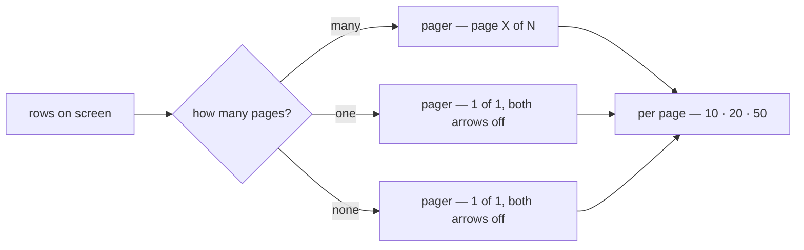
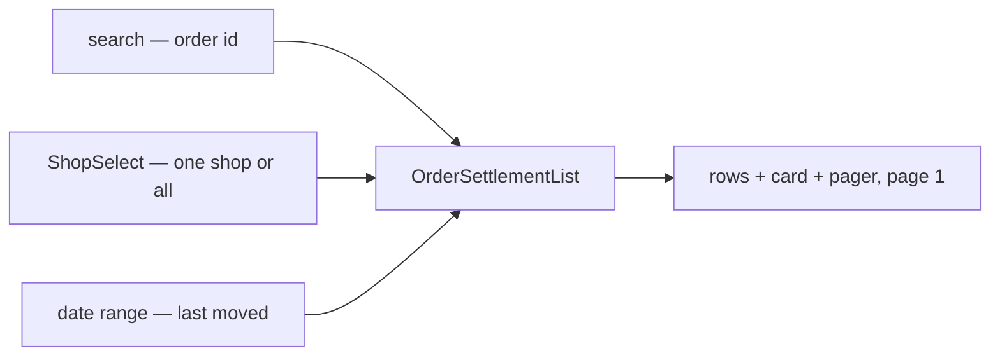
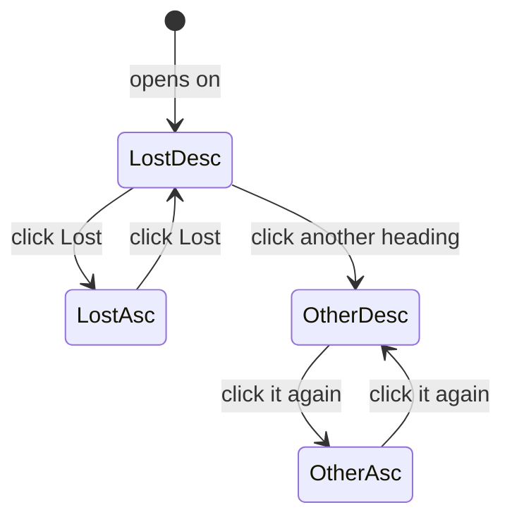
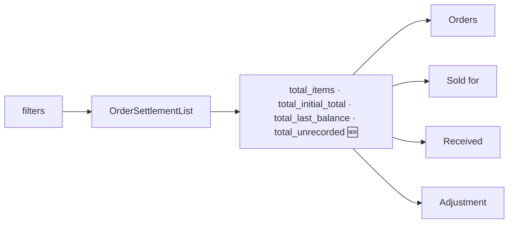
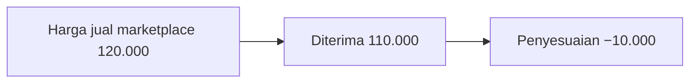
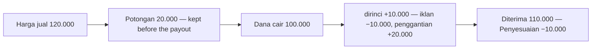
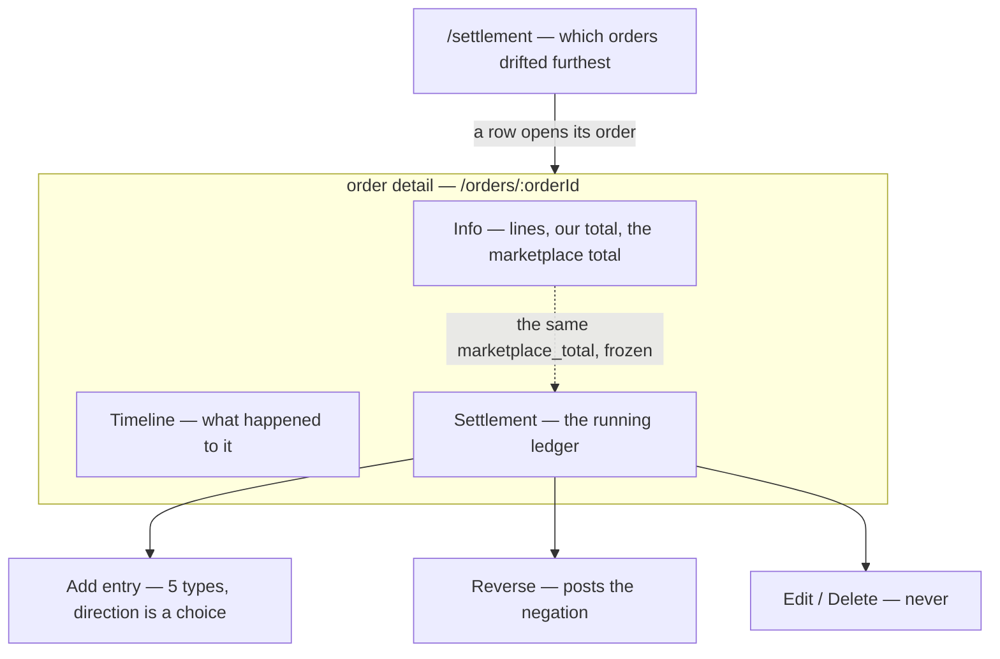
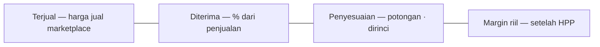
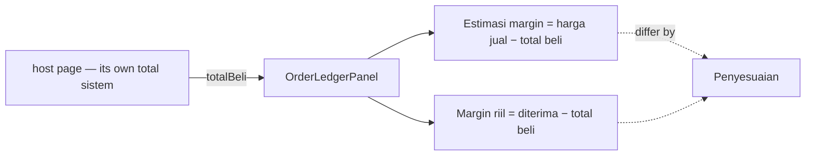
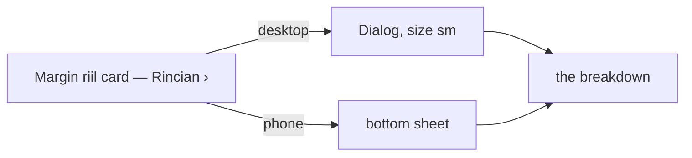

# Decisions — the order settlement screens

The owner's decisions about **`/settlement`** (the order settlement list) and the **settlement ledger** on an order's
detail page. **Append-only** (RULE 12): a reversed decision is renamed and its references grepped.

The rules every screen follows are in [context_decision.md](context_decision.md); the settlement *business* decisions
stay in [settlement/context_decision.md](../../business/settlement/context_decision.md). These were recorded there first
and moved here on 2026-10-02; each old heading there now points here.

| decision | what it decided |
| --- | --- |
| [the-settlement-list-always-shows-its-pager](#the-settlement-list-always-shows-its-pager) | the `/settlement` list keeps its pager AND its per-page selector on screen on one page and on an empty list |
| [the-settlement-list-filters-what-the-contract-can](#the-settlement-list-filters-what-the-contract-can) | the `/settlement` list filters by order id, one shop (`ShopSelect`) and the date the account last moved (the order list's picker) |
| [the-settlement-list-sorts-by-its-headings](#the-settlement-list-sorts-by-its-headings) | Order · Sold for · Received · Adjustment sort from their headings, largest first then flipped; an unrecorded sale always last |
| [the-settlement-list-summary-is-the-order-lists-cards](#the-settlement-list-summary-is-the-order-lists-cards) | the summary is the order list's card strip, over the whole filtered set, an unrecorded sale counted and left out of the sums |
| [the-sale-is-the-marketplace-selling-price](#the-sale-is-the-marketplace-selling-price) | the recorded sale is written **harga jual marketplace** (EN *marketplace selling price*), never "total marketplace" |
| [the-gap-is-an-adjustment](#the-gap-is-an-adjustment) | what reached us less the selling price is **Penyesuaian** (EN *Adjustment*), signed — not *Hilang* / *Lebih* |
| [the-unitemised-take-is-a-deduction](#the-unitemised-take-is-a-deduction) | the selling price less every payout is **Potongan** (EN *Deductions*) — not *Tidak dirinci* |
| [the-source-is-a-badge](#the-source-is-a-badge) | an entry's source — Import · Manual · Order — is a badge in the ledger; the list row shows none |
| [order-detail-manages-the-ledger](#order-detail-manages-the-ledger) | the order page MANAGES settlement — read, add, reverse — as a third tab. ⚠ widens the verbs, not the guarantees: append-only stands |
| [the-ledger-reads-tanggal-and-its-balance-is-full-strength](#the-ledger-reads-tanggal-and-its-balance-is-full-strength) | the ledger's columns are Tanggal · Jenis · Sumber · Detail · Perubahan · Saldo; the balance is never muted; the source stacks when cramped |
| [the-ledger-summary-is-the-order-lists-cards](#the-ledger-summary-is-the-order-lists-cards) | the ledger's four figures are the order list's cards; a margin with no recorded cost is "—" |
| [the-ledger-margin-leads-and-says-where-it-comes-from](#the-ledger-margin-leads-and-says-where-it-comes-from) | the true margin is the lead card, a note under its share naming its formula; a ledger row lights up under the pointer |
| [the-add-action-stays-tambah-entri](#the-add-action-stays-tambah-entri) | the ledger's add action stays **Tambah Entri** — *Tambah Penyesuaian* was tried and reverted |
| [the-ledger-shows-no-note-and-reverses-inline](#the-ledger-shows-no-note-and-reverses-inline) | the ledger drops its Detail column; a reversal is tagged on its type; **Balikkan** is a button on the row, not a `⋯` menu |
| [the-ledger-type-column-reads-sumber](#the-ledger-type-column-reads-sumber) | the type column is headed **Sumber**; **Detail** is the source badge then the note; a reversal names the amount and day it undoes |
| [the-ledger-cards-count-their-entries](#the-ledger-cards-count-their-entries) | Diterima and Penyesuaian say how many entries make them — every row but the sale's own |
| [the-ledger-margins-need-the-hosts-total-beli](#the-ledger-margins-need-the-hosts-total-beli) | the ledger shows Estimasi margin and Margin riil only when its host hands in `totalBeli`, taken as complete |
| [the-ledger-is-blocks-on-a-phone](#the-ledger-is-blocks-on-a-phone) | on a phone each entry is a three-line block, and Margin riil spans the strip |
| [the-sale-reads-harga-jual-everywhere](#the-sale-reads-harga-jual-everywhere) | the sale is labelled **Harga jual** on the list, the ledger and the report — *Terjual* is gone |
| [the-margin-breakdown-opens-from-rincian](#the-margin-breakdown-opens-from-rincian) | **Rincian ›** at the end of Margin riil's label opens how it adds up — a dialog, a bottom sheet on a phone |
| [every-penjualan-reads-harga-jual](#every-penjualan-reads-harga-jual) | a share reads **dari harga jual**, never *dari penjualan*; in the breakdown it sits under the margin |
| [the-add-entry-form-picks-with-chakra-controls](#the-add-entry-form-picks-with-chakra-controls) | the add-entry type is a Chakra `Select`, the direction two radio cards — the pick in rose, like the submit |
| [the-add-entry-note-is-a-textarea](#the-add-entry-note-is-a-textarea) | the add-entry note is a three-row `Textarea`, not a one-line input |
| [the-post-entry-button-is-in-the-main-tone](#the-post-entry-button-is-in-the-main-tone) | **Buat Entri** is filled in the main tone, rose, like every other form's submit |
| [the-direction-drops-uang](#the-direction-drops-uang) | the direction reads **Masuk ke kita** / **Diambil dari kita** — *Uang* in front made both cards run long |

## the-settlement-list-always-shows-its-pager

> Owner, in chat (2026-10-02), on the order settlement list: *"tampilkan saja, selalu"* — asked which it meant, the
> pager on screen. Then: *"perpagenya juga ada untuk tabel 1 halaman seperti ini"* — the per-page selector too.

The `/settlement` list's pager is part of the page, not a control that appears once there is something to page.
Every other list in the app keeps the shared default — it hides when everything fits.

⚠ **Widened the same day** by [the-pager-is-always-on-screen](context_decision.md#the-pager-is-always-on-screen):
every list now keeps its pager, so the sentence above no longer holds.



| | |
| --- | --- |
| control | the shared `Pagination` with `alwaysShow` — no second pager |
| empty list | reads as one page, never *1 of 0* |
| per page | always beside it — `10 · 20 · 50`, default `20`, the app's own choices; changing it returns to page 1 |
| where | under the table, inside the list component, so the design stories show it |
| other lists | unchanged — `alwaysShow` is opt-in |

## the-settlement-list-filters-what-the-contract-can

*Applies [a-date-range-filter-is-the-order-lists-picker](context_decision.md#a-date-range-filter-is-the-order-lists-picker).*

> Owner, in chat (2026-10-02), on the list's filters: *"cari order id, toko aku ingin pakai shop select, rentang
> tanggal gunakan seperti order list"* — and sorting by column heading *"kita diskusikan dulu"*.

The list filters by exactly what `OrderSettlementList` can narrow on — no control the server would ignore.



| control | spec |
| --- | --- |
| search | the shared `FilterSearch`, placeholder *Search order ID* — the server matches `CAST(order_id AS TEXT) LIKE %q%`; settlement never sees the marketplace reference ([settlement-keys-on-our-order-id](../../business/settlement/context_decision.md#settlement-keys-on-our-order-id)) |
| shop | the design system's `ShopSelect` over the team's shops, *All shops* = none |
| date | the order list's `DateRangePicker`, with one field segment reading **Last moved**: the filter is the account's latest entry (`updated_at`), not the order date — a plain picker would read as the order date |
| layout | the shared `FilterBar` — search in the row, the rest in a sheet on a phone, Clear while anything narrows |
| any change | back to page 1 |
| refresh | the overlay dims the card and the table, never the filter bar |

Not filters yet, because the contract cannot narrow on them: marketplace reference, order date, order status,
paid-out or not, manual entries, result (lost · gained · not recorded), creator. Sorting: see
[the-settlement-list-sorts-by-its-headings](#the-settlement-list-sorts-by-its-headings).

## the-settlement-list-sorts-by-its-headings

*Applies [a-table-sorts-from-its-headings](context_decision.md#a-table-sorts-from-its-headings).*

> Owner, in chat (2026-10-02): *"sort akan lebih baik jika bisa tiap heading"*, then — on the recommendation —
> *"gunakan rekomendasi"*: Shop and Never itemised do not sort, and *"cukup bolak-balik"*.



| heading | sorts by | first click |
| --- | --- | --- |
| Order | `ORDER_ID` | highest id first |
| Shop | — | the server holds the id, not the name, so it could not be alphabetical; the filter narrows to one |
| Sold for | `INITIAL_TOTAL` | largest first |
| Received | `RECEIVED` 🆕 — `last_balance + initial_total` | largest first |
| Lost | `LOSS` — **the default, largest loss first** | largest first |
| ~~Never itemised~~ | — | the column is gone — see [the-unitemised-take-is-a-deduction](#the-unitemised-take-is-a-deduction) |

- **Two states, no third** — a click flips the active heading; another heading starts at largest first.
- **The server sorts the whole set**, and the page is not re-sorted on the client. Any new sort returns to page 1.
- **An unrecorded sale sorts last** under every money measure, both directions — its figures are not real.
- **Ties break on `order_id`**, in the sort's direction, so a page boundary cannot fall differently twice.
- **The direction is the named measure's.** `LOSS` used to apply it to the balance, so `ASC` meant the biggest
  loss; now `DESC` is the biggest loss and `UNSPECIFIED` is `DESC`.
- **On a phone** the sheet carries a *Sort* control with each heading's two directions.

## the-settlement-list-summary-is-the-order-lists-cards

*Applies [a-list-summary-is-the-order-lists-card-strip](context_decision.md#a-list-summary-is-the-order-lists-card-strip).*

> Owner, in chat (2026-10-02): *"statistik cuma 3 itu? aku ingin statistik designnya seperti di order list"*.

The summary is the order list's `SummaryStrip` of `SummaryCard`s — a label, one figure, a quiet line — over the
**whole filtered set**, from the server's sums.



| card | figure | line |
| --- | --- | --- |
| Orders | every account the filters match | *n with no marketplace total*, or *every sale recorded* |
| Sold for | Σ sale | *over n orders* (the recorded ones) |
| Received | Σ (sale + balance) | *% of sales* |
| Adjustment | Σ balance, signed — red when short ([the-gap-is-an-adjustment](#the-gap-is-an-adjustment)) | *% of sales* |

- **An unrecorded sale is counted, never summed** — its balance is payout with nothing to measure against, and
  adding it would shrink the loss by money that was never a gain. `total_unrecorded` is new on the wire.
- **No deductions card** (owner: *"potongan bisa dihitung manual? kalau tidak statnya hilangkan saja"*):
  `sale − Σ payout` cannot be summed for the set — the server sums no payouts and the page holds one page of
  rows without their entries — so the card was removed rather than marked or filled from the page.
- ⚠ **It amends [design-accepted](../../business/settlement/context_decision.md#design-accepted)'s "implied take-rate card"**: with no deductions sum there is
  no take rate on the list until the server sums payouts.

## the-sale-is-the-marketplace-selling-price

> Owner, in chat (2026-10-02): *"total marketplace -> harga jual marketplace"*.

`initial_total` — what the buyer paid on the platform — is written **harga jual marketplace** (EN *marketplace
selling price*) wherever a sentence names it: *tanpa harga jual marketplace*, *Harga jual marketplace tidak
tercatat*. It is a fact, not an estimate ([marketplace-total-is-a-fact-not-an-estimate](../../business/settlement/context_decision.md#marketplace-total-is-a-fact-not-an-estimate)).

| | before | now |
| --- | --- | --- |
| a sentence | total marketplace | **harga jual marketplace** |
| the column / card | Terjual | Terjual — unchanged until decided |
| the entry type | Estimasi | Estimasi — unchanged until decided |

## the-gap-is-an-adjustment

> Owner, in chat (2026-10-02), on *Diterima* and *Hilang*: *"untuk konteks order biasanya paling tepat adalah
> adjustment atau penyesuaian"*.



| | before | now |
| --- | --- | --- |
| received less the selling price | *Hilang 10.000* (red), or *Lebih 4.000* (green) — two words | **Penyesuaian**, signed: **−Rp 10.000** red, **+Rp 4.000** green — one word |
| where | list column · summary card · ledger panel | the same three |
| the entry type `marketplace_adjustment` | *Penyesuaian* | **Penyesuaian marketplace** — or one word would mean the total and one entry type |
| the phone's sort | *Biggest loss first* | **Penyesuaian paling minus / paling plus** |

The figure is `last_balance` as it stands — nothing is computed differently, only named and signed.

## the-unitemised-take-is-a-deduction

> Owner, in chat (2026-10-02), on *Tidak dirinci*: *"Potongan saja"*.



`initial_total − Σ fund` is **Potongan** (EN *Deductions*) in the ledger panel's hint (*potongan Rp 20.000 · dirinci +Rp 10.000*). It amends the label half of
[hidden-cost-is-left-in-the-balance](../../business/settlement/context_decision.md#hidden-cost-is-left-in-the-balance) once more. Whether the figure is
always a deduction — it is not, before any payout arrives — is open in the chat that recorded this.

**Not on the list** (owner, 2026-10-02: *"hilangkan potongan karena memang tidak ada"*). A list row carries no
entries, so `sale − Σ fund` read `sale − 0` — the whole sale — on every live row; it was only ever right in
Storybook. The column, its summary card and its ⚠ marks are removed; no column was added to carry the payouts.

## the-source-is-a-badge

> Owner, in chat (2026-10-02), on *has manual entries*: *"sumber buat saja jadi badge"*.

| source | badge | where |
| --- | --- | --- |
| `importer` | **Impor** — teal | the ledger, on every imported entry |
| `manual` | **Manual · \<who typed it\>** — orange | the ledger |
| `order` | **Order** — gray | the ledger, on the order's own posts |

- One component, `SettlementSourceBadge` (`components/badges/`), so both screens draw the same badge.
- **The list row shows no source badge** (owner, 2026-10-02: *"hilangkan sama sekali"*). Whether an order holds a
  hand-typed entry needs its entries, and a list row carries none — the earlier *has manual entries* line was
  only ever right in Storybook, whose sample rows carry their entries. No column was added for it (*"ga perlu"*).

## order-detail-manages-the-ledger

**The order detail page is where an order's settlement is MANAGED — not merely where an entry is
added.** (owner, 2026-08-28)

§What Frontend Expected 1 said *"manually add settlement entry from order detail page"*, which is one
verb. The owner's confirmation is the wider one: **manage**. That settles the seat and the verbs, and
it is what the built prototype already assumes.

### What "manage" covers, and where it stops

| | | |
| --- | --- | --- |
| **read** the running ledger | ✅ | every row, its running balance, and the four derived figures |
| **add** an entry | ✅ | §What Frontend Expected 1, verbatim |
| **reverse** a row | ✅ | confirms the recommendation that was Critique 5 — the negation, same type, linked to the row it undoes |
| **edit** a row | ⛔ | [a-correction-is-a-new-row](../../business/settlement/context_decision.md#a-correction-is-a-new-row). Unchanged — "manage" does not reopen append-only |
| **delete** a row | ⛔ | same |
| **decide WHO may do any of it** | ❓ | still open — [Question 1](../../business/settlement/context_clarify.md#question) |
| **type `initial_total`** | ❓ | still open — [Question 2](../../business/settlement/context_clarify.md#question) |

⚠ **Manage widens the VERBS, not the guarantees.** Append-only survives it intact: reversing posts a
further row rather than removing one, which is why Reverse is a management action and Delete is not.

### Why the order page and not a settlement screen

The ledger's grain IS the order ([superseded-the-grain-is-the-order](../../business/settlement/context_decision.md#superseded-the-grain-is-the-order)), so the order page
is the only screen where the whole account is in scope at once. A person adding a fee is looking at the
order to decide whether the fee is right — the lines, the shipping, what the buyer paid — and none of
that is on a settlement list.



**The two screens are a pair with one direction of travel.** `/settlement` ranks orders by loss and
answers *which order should I look at*; the order page answers *what happened to this one, and what do
I do about it*. Every management verb lives on the second — the list never writes.

### The spec

**A third tab on the order detail page**, after Info and Timeline.

| | |
| --- | --- |
| where | `pages/order-detail/index.tsx`, `Tabs.Trigger value="settlement"` |
| why third | Info is what the order IS and Timeline is what happened to it — both settled by the time money starts arriving. Settlement is the only tab that keeps changing for days afterwards ([a-residual-balance-is-normal](../../business/settlement/context_decision.md#a-residual-balance-is-normal)) |
| what it renders | the ledger table, the four derived figures, **Add entry**, and a per-row **Reverse** behind the row's overflow menu |
| gating | one prop, `canPost`, resolved from the viewer's role — the single place [Question 1](../../business/settlement/context_clarify.md#question)'s answer lands. Reading is never gated: the role gates writing, never looking |

⚠ **Built and previewable now**, but as a SEPARATE shell —
`pages/order-settlement/components/OrderDetailPreview.tsx`, story `Pages/Order Settlement/On Order
Detail`. Info and Timeline in it are the real shipped components; only the settlement tab is invented.
The real page is not touched until `design_accept`, because a fixture-fed ledger on `/orders/:orderId`
would show invented money on real orders. **On acceptance the tab moves into the real page and the
preview shell is deleted.**

---

## the-ledger-reads-tanggal-and-its-balance-is-full-strength

> Owner, in chat (2026-10-03), going through the ledger's columns: *"kapan jadi tanggal saja, jenis oke, sumber pun
> oke, detail oke, change oke, balance itu harusnya tidak pudar warnanya"* — and the column rule for Jenis and Sumber.

*Applies [a-badge-stacks-under-its-text-when-the-table-is-cramped](context_decision.md#a-badge-stacks-under-its-text-when-the-table-is-cramped).*

```
roomy     Tanggal   Jenis                    Sumber          Detail            Perubahan     Saldo        ⋯
          08-01-2026 Penyesuaian marketplace [Manual · Budi] voucher clawback  −Rp 4.500     Rp -30.500

cramped   Tanggal   Jenis                    Detail            Perubahan     Saldo        ⋯
          08-01-2026 Penyesuaian marketplace  voucher clawback  −Rp 4.500     Rp -30.500
                     [Manual · Budi]
```

| column | was | now |
| --- | --- | --- |
| date | *Kapan* | **Tanggal** (EN *Date*); a late entry keeps its *diketahui …* line under it |
| type · source | the badge beside the type, in one cell | its own **Sumber** column while there is room; under the type when cramped, and on a phone |
| detail · change | — | unchanged |
| balance | muted grey | **full strength** — a running figure read down the page, not a footnote |

> Then (2026-10-05): *"aku ingin saldo tabel lebih kuat untuk membedakan dengan perubahan"* — the balance is **bold**
> and the change plain, and the balance is written in the change's format, **−Rp 30.500** / **+Rp 4.000**
> ([a-negative-amount-puts-its-minus-before-rp](context_decision.md#a-negative-amount-puts-its-minus-before-rp)).

## the-ledger-summary-is-the-order-lists-cards

> Owner, in chat (2026-10-03), on the ledger on the order detail: *"perbaiki design statisticnya"*.

*Applies [a-list-summary-is-the-order-lists-card-strip](context_decision.md#a-list-summary-is-the-order-lists-card-strip).*



| card | figure | quiet line |
| --- | --- | --- |
| Terjual | `initial_total` | *harga jual marketplace* |
| Diterima | saldo + terjual | *% dari penjualan* |
| Penyesuaian | the balance, signed — red short, green ahead | **none** |
| Margin riil | diterima − HPP | *% dari penjualan*, like Diterima — and with **no recorded cost** (0) the figure is **"—"**, the line *HPP belum tercatat*: the order list's own rule, a cost of 0 is not free goods |

> Then, the same day: *"penyesuaian dan margin rill tidak perlu subtitle, tapi margin rill mungkin bisa seperti
> diterima, pakai persentase"* — the table above is that answer.

⚠ With the adjustment's line gone, **Potongan is no longer on any screen** — it was shown only there
([the-unitemised-take-is-a-deduction](#the-unitemised-take-is-a-deduction) named that line as its one place).

The figures were a loose row of plain text; they are now the same cards as the order list and the settlement list.

## the-ledger-margin-leads-and-says-where-it-comes-from

> Owner, in chat (2026-10-03): *"buat margin riil sedikit lebih menonjol · margin riil kasih tooltips i, darimana dia
> didapat atau rumus · table hover → background"*.

*Applies [a-summary-card-is-grey-with-a-thin-border](context_decision.md#a-summary-card-is-grey-with-a-thin-border).*

| | |
| --- | --- |
| Margin riil | the strip's lead card (`emphasis`) — unless the cost is unknown, when it is "—" and leads nothing |
| how it is made | a second quiet line under the share (`SummaryCard note`): **diterima − HPP** — no tooltip (owner, 2026-10-05: *"tooltipsnya hilangkan saja, kasih deskripsi singkat nilai didapat dari mana di bawah persentase"*); an ⓘ was tried the same week and removed |
| a ledger row | lights up under the pointer (`Table interactive`) — read across, nothing clicked |

## the-add-action-stays-tambah-entri

> Owner, in chat (2026-10-03): *"tambah entry konteksnya pasti penyesuaian? jadi ganti istilah"* — renamed to *Tambah
> Penyesuaian*; then (2026-10-05): *"tambah penyesuaian ganti dengan tambah entri"*.

| | |
| --- | --- |
| the button | **Tambah Entri** · *Add Entry* |
| the dialog's title | **Tambah Entri Settlement** · *Add Settlement Entry* |
| its confirm | **Buat Entri** · *Post Entry* |

⚠ Recorded as the verdict it ended on, and renamed from *adding-to-the-ledger-is-an-adjustment* (RULE 12) — that
name read as the opposite of what holds.

## the-ledger-shows-no-note-and-reverses-inline

> Owner, in chat (2026-10-05): *"jenis bisa jadi dari saja? · sumber masuk ke detail?"*, then, on the answer: *"kalau
> gitu jadi sumber saja · ya ke detail, kurasa catatan itu bisa dihapus saja dulu · sama actionnya tidak perlu …,
> karena cuma 1, keluarkan saja"*.

```
Tanggal  Jenis                                Sumber           Perubahan     Saldo
08-01    Penyesuaian marketplace · pembalikan [Manual · Budi]  +Rp 45.000    −Rp 26.000
08-01    Penyesuaian marketplace              [Manual · Budi]  −Rp 4.500     −Rp 30.500   ↶ Balikkan
```

| | was | now |
| --- | --- | --- |
| columns | Tanggal · Jenis · Sumber · Detail · Perubahan · Saldo · `⋯` | **Tanggal · Jenis · Sumber · Perubahan · Saldo · Balikkan** |
| the note | the Detail column | **not shown, for now** — the column held only the note once the source took its own column |
| a reversal | *"membalikkan entri sebelumnya"* in Detail | **· pembalikan** after the type, muted — a +45.000 with nothing beside it would read as a fresh adjustment |
| the action | a `⋯` menu with one item | the **Balikkan** button itself (`Undo2` icon) — one action stays inline |
| Sumber | — | its own column; under the type when cramped ([a-badge-stacks-under-its-text-when-the-table-is-cramped](context_decision.md#a-badge-stacks-under-its-text-when-the-table-is-cramped)) |

The word stays **Balikkan** (*Reverse*): it is the bookkeeping word for posting the opposite of a row, and neither
*Batalkan* (reads as deleting) nor *Koreksi* (reads as editing) says what the button does.

## the-ledger-type-column-reads-sumber

> Owner, in chat (2026-10-05), the same day as the entry above: *"Jenis jadi sumber · detail ada sumber atau source badge
> lalu diikuti detail sebelumnya · balikan kasih sedikit tambahan biar jelas apa yang di balikkan"*.

```
Tanggal     Sumber                   Detail                                       Perubahan     Saldo
2026-01-08  Penyesuaian marketplace  [Manual · Budi] voucher clawback             −Rp 45.000    −Rp 71.000
2026-01-08  Penyesuaian marketplace  [Manual · Budi] membalikkan −Rp 45.000 tanggal 2026-01-08   +Rp 45.000   −Rp 26.000
```

| | now |
| --- | --- |
| the type column | headed **Sumber** (EN *Source*) — what the money is: the sale, a payout, a fee. Its content is unchanged |
| Detail | **back**: the source badge first (Order · Impor · Manual · *who*), then the note |
| a reversal | Detail says **which** row it undoes — *membalikkan −Rp 45.000 tanggal 2026-01-08*; the confirm dialog names it too (*… membalikkan Penyesuaian marketplace tanggal 2026-01-08*) |
| the cramped rule | no longer used here — the badge lives in Detail, never in a column of its own |

It supersedes two parts of [the-ledger-shows-no-note-and-reverses-inline](#the-ledger-shows-no-note-and-reverses-inline):
the note is shown again, and the *· pembalikan* tag after the type is replaced by the Detail line. The inline
**Balikkan** button stands.

## the-ledger-cards-count-their-entries

> Owner, in chat (2026-10-05): *"diterima dan penyesuaian kasih keterangan ada berapa entri, kalau diterima berarti di
> bawah persentase"*.

| card | lines |
| --- | --- |
| Diterima | *91,67% dari penjualan* · **dari 3 entri** (the second line, `SummaryCard note`) |
| Penyesuaian | **dari 3 entri** — a note too, so it is the same quieter grey as under Diterima (owner: *"yang entri penyesuaian warnanya sesuaikan"*) |

**What is counted:** every entry but the sale's own row — `initial_total` and its cancel. The sale is the line the
others are measured against, not a movement: Diterima is the sale plus every other row, and Penyesuaian is those rows
alone, so both cards count the same rows. A reversal and the row it undid are two entries, as they are two rows.

## the-ledger-margins-need-the-hosts-total-beli

> Owner, in chat (2026-10-05), after *"margin rill kok diterima − HPP?"*: *"komponen ini menerima props subtotal opsional,
> lalu kita tampilkan estimasi margin dari subtotal jika ada nilainya, margin rill sendiri juga muncul saat subtotalnya
> ada"* — then: the prop is **`totalBeli`**, it *"dianggap sudah include semuanya"*, five cards, and no ⚠.



```
Terjual      Diterima      Penyesuaian    Estimasi margin          Margin riil
Rp 120.000   Rp 110.000    −Rp 10.000     Rp 40.000                Rp 30.000
             91,67% …      dari 3 entri   33,33% dari penjualan    25,00% dari penjualan
             dari 3 entri                 harga jual − total beli  diterima − total beli
```

| | |
| --- | --- |
| the prop | `totalBeli?: bigint` on `OrderLedgerPanel` (and `SettlementTab`) — what the order cost, **everything included**; the panel splits it into nothing |
| who passes it | the seller's order detail: the same *total sistem* its money section shows (`orderSpend(productCost, fees, …)`), so the two pages' margins cannot disagree. The warehouse's detail passes none |
| with it | five cards: Terjual · Diterima · Penyesuaian · **Estimasi margin** · **Margin riil** (the lead card) |
| without it, or 0 | three cards — no margin at all, rather than a payout passed off as earned |
| shares | both margins as a share of the selling price, like the order list's |
| marks | none — the figure is the host's, and marking it is the host's business |

The two margins differ by exactly the Penyesuaian beside them: *margin riil = estimasi margin + penyesuaian*.

⚠ It supersedes the margin of [the-ledger-summary-is-the-order-lists-cards](#the-ledger-summary-is-the-order-lists-cards)
and [the-ledger-margin-leads-and-says-where-it-comes-from](#the-ledger-margin-leads-and-says-where-it-comes-from):
*diterima − HPP*, with HPP alone, left the warehouse fee out — overstating every order by it, the trap
[the-margin-is-mp-minus-total-beli](order_list_decision.md#the-margin-is-mp-minus-total-beli) names.

## the-ledger-is-blocks-on-a-phone

> Owner, in chat (2026-10-05), on the Mobile story's scrolled table and the lead card left alone in half a row:
> *"di on order detail juga, mobile iya"*.

*Applies [a-phone-reads-each-line-as-a-block](context_decision.md#a-phone-reads-each-line-as-a-block).*

```
Penyesuaian marketplace                −Rp 4.500
2026-01-08 · [Manual · Budi]    saldo −Rp 30.500
voucher clawback                      ↶ Balikkan
```

| | |
| --- | --- |
| an entry | line 1 the Sumber (the type) and the change, signed and coloured · line 2 the date (and *diketahui …* when late) with the source badge, and **saldo** bold on the right · line 3 the note or what a reversal undoes, with **Balikkan** on the right |
| a reversed entry | the whole block dimmed, as the row is |
| the cards | two columns; **Margin riil spans the strip** (`SummaryCard wide`) instead of sitting alone in half a row |
| how | `useIsMobile` — a JS breakpoint, never CSS hiding |

The stories carry it: every Ledger Panel and On Order Detail story gets a default `totalBeli` (80.000), one story
on each leaves it out, and each has a **Mobile** story (workbench only — the runner is a desktop viewport). The
On Order Detail preview's tabs go across the top on a phone, so the ledger is not squeezed beside them.

## the-sale-reads-harga-jual-everywhere

> Owner, in chat (2026-10-05), on the margin notes reading *harga jual − total beli* beside a card labelled *Terjual*:
> *"harga jual itu apa terjual? jika iya, sesuaikan saja"*.

It closes what [the-sale-is-the-marketplace-selling-price](#the-sale-is-the-marketplace-selling-price) left *unchanged
until decided*: `initial_total` has ONE name.

| where | was | now |
| --- | --- | --- |
| list column · list card · ledger card | Terjual · *Sold for* | **Harga jual** · *Selling price* |
| the ledger card's line | harga jual marketplace | **dari marketplace** — the label already says *harga jual* |
| the phone's sort | Terjual terbesar / terkecil | **Harga jual terbesar / terkecil** |
| the settlement report | Terjual | **Harga jual** — the same field, summed over the window |

Still open: the entry types *Estimasi* and *Estimasi dibatalkan* name the same figure a third way.

## the-margin-breakdown-opens-from-rincian

> Owner, in chat (2026-10-05): *"margin rill kasih opsi untuk mendetailkannya ke modal"* — and of five previewed
> triggers (an icon beside the label, a formula link, a ghost button, a full-width button, a text link at the end),
> chose **"Text Link At the End"**. An icon beside the label was *"kurang bisa dilihat"*.



```
Dana cair                  +Rp 100.000     ← every entry after the sale, summed per type (count when > 1)
Biaya iklan                 −Rp 10.000
Penyesuaian marketplace     +Rp 20.000
= Diterima                  Rp 110.000
Total beli                  −Rp 80.000
= Margin riil                Rp 30.000   25,00% dari harga jual
- - - - - - - - - - - - - - - - - - - -
Harga jual                  Rp 120.000
Estimasi margin              Rp 40.000
Selisih = penyesuaian       −Rp 10.000
Potongan saat cair           Rp 20.000     ← only once a payout (Dana cair) has arrived
```

| | |
| --- | --- |
| the trigger | **Rincian ›** — bold, `lead.fg`, at the far right of the card's label row (`SummaryCard mark`). Only the word is pressed; the card stays a card |
| when | only when Margin riil is shown — the host handed in a `totalBeli` above 0 ([the-ledger-margins-need-the-hosts-total-beli](#the-ledger-margins-need-the-hosts-total-beli)) |
| desktop · phone | a `Dialog` (`sm`) · a bottom `Drawer` — a modal squeezed to 390px reads as a cramped popup |
| the lines | built FROM THE ENTRIES: every row but the sale's own, summed per type, to **= Diterima**; less total beli, to **= Margin riil** and its share of the selling price |
| the footer | the selling price, Estimasi margin, and their **difference — which is the Penyesuaian card**, so the two margins visibly reconcile |
| Potongan saat cair | harga jual − the payouts, **only beside a real payout**. Before one arrives the gap is money still to come, not a deduction — which is why [the-unitemised-take-is-a-deduction](#the-unitemised-take-is-a-deduction)'s figure left the cards and lives only here |

## every-penjualan-reads-harga-jual

> Owner, in chat (2026-10-05), on the breakdown: *"persentase di bawah nilai margin"* — then *"penjualan itu harga
> jual, sesuaikan semuanya"*.

It finishes [the-sale-reads-harga-jual-everywhere](#the-sale-reads-harga-jual-everywhere): where *penjualan* meant
the `initial_total` figure, it now says so.

| where | was | now |
| --- | --- | --- |
| every share — Diterima, Penyesuaian, both margins, the list's cards, the breakdown | 25,00% dari penjualan · *of sales* | **25,00% dari harga jual** · *of the selling price* |
| the report's take rate | 3,20% dari penjualan | **3,20% dari harga jual** |
| the report's gap hint | Dari penjualan periode ini, … | **Dari harga jual periode ini, …** |
| the *Harga jual* entry's warning | menulis ulang nilai penjualan … | **menulis ulang harga jual …** |
| the breakdown's margin line | the share beside the figure | the share **under** the figure, as on the card |

```
= Margin riil              Rp 30.000
                25,00% dari harga jual
```

Left alone, because there *penjualan* is the act of selling, not the figure: the product's *penjualan terakhir* (its
last sale) and the team page's *Penjualan* tab.

## the-add-entry-form-picks-with-chakra-controls

> Owner, in chat (2026-10-05), on the add-entry dialog: *"select harus cakra, radio select juga, warnanya buat biru
> atau mungkin ada rekomendasi, karena warna utamaku rose, untuk theme tanggalnya juga sesuaikan warnanya"*.

*Applies [a-chosen-option-is-in-the-main-tone](context_decision.md#a-chosen-option-is-in-the-main-tone).*

```
Jenis
[ Penyesuaian marketplace              ⌄ ]      ← Chakra Select, opens a list
Arah
┌──────────────────────────┐ ┌──────────────────────────┐
│ ↙ Masuk ke kita        ○ │ │ ↗ Diambil dari kita      ◉│  ← the chosen card in rose
└──────────────────────────┘ └──────────────────────────┘
```

| | |
| --- | --- |
| the type | Chakra's composable `Select`, not `NativeSelect` — a static, small list, so a plain list rather than a search. Inline, not portalled: inside a modal a portalled list is inert |
| the direction | a `RadioCard` pair, half the width each, an arrow before the words; was two buttons toggling solid and outline |
| the colours | the chosen card, and the chosen day in **Berlaku pada**'s calendar, in the main tone — rose, like **Buat Entri** |
| unchanged | which types are offered (`manualTypesFor`), the amount, the date, the preview line and its warnings |

## the-add-entry-note-is-a-textarea

> Owner, in chat (2026-10-05): *"catatan textarea"*.

*Applies [chakra-first-whenever-it-has-the-component](context_decision.md#chakra-first-whenever-it-has-the-component).*

| | |
| --- | --- |
| **Catatan** | a Chakra `Textarea`, three rows, resizable downwards; still at most 200 characters |
| was | a one-line `Input` — a reason for a fee is a sentence, and one line hid most of it |

## the-post-entry-button-is-in-the-main-tone

> Owner, in chat (2026-10-05): *"button buatnya juga, theme nya"*.

| | |
| --- | --- |
| **Buat Entri** | `colorPalette="brand"` — filled rose, the main tone, as every other dialog's submit already is |
| was | the default palette — a near-black fill, the one submit in the app not in the theme |
| **Batal** | unchanged — outline, plain |
| the colours on the form | the action and the chosen option both in the main tone, rose — [a-chosen-option-is-in-the-main-tone](context_decision.md#a-chosen-option-is-in-the-main-tone) |

## the-direction-drops-uang

> Owner, in chat (2026-10-05): *"Uang di arah tidak perlu, karena membuat terlalu panjang"*.

| | was | now |
| --- | --- | --- |
| in | Uang masuk ke kita · *Money reached us* | **Masuk ke kita** · *Reached us* |
| out | Uang diambil dari kita · *Money taken from us* | **Diambil dari kita** · *Taken from us* |

The field is already labelled **Arah**, and the amount under it is the money — the word said nothing the form did
not, and on a phone it wrapped both cards to two lines.
