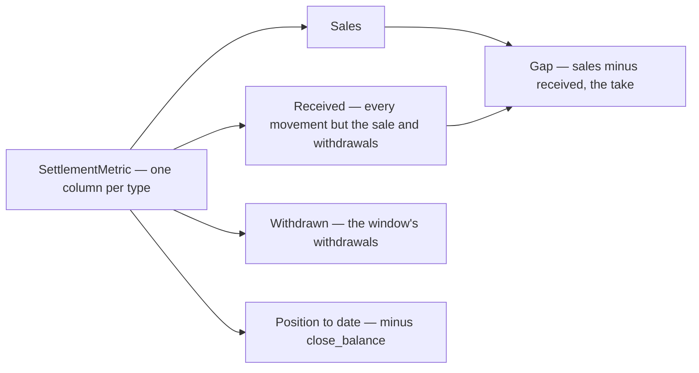

# Decisions — the settlement report

The owner's decisions about the **settlement report** (`/settlement/report`). **Append-only** (RULE 12): a reversed decision is renamed and its references grepped.

The rules every screen follows are in [context_decision.md](context_decision.md). These were recorded in
[settlement/context_decision.md](../../business/settlement/context_decision.md) first and moved here on 2026-10-02; each old heading there now points here.

| decision | what it settles |
| --- | --- |
| [the-report-headline-is-position-to-date](#the-report-headline-is-position-to-date) | the report's running figure is **Position to date**, and **Withdrawn** stands beside Received — *hidden cost* no longer names it |

## the-report-headline-is-position-to-date

> Chat *(owner, 2026-09-29)* — *"Rename + Withdrawn column"*, asked after
> [withdrawal-counts-in-the-position](../../business/settlement/context_decision.md#withdrawal-counts-in-the-position): the report's *Hidden cost to date* would
> read as roughly every sale from the first imported withdrawal.

**The verdict.** The report's running figure is labelled **Position to date** — what buyers paid, less everything the
platform moved, withdrawals included — and **Withdrawn** stands as its own figure beside *Received*. The window's
**Gap** still shows the platform's take. It is my recommendation.

### The spec

| figure | is |
| --- | --- |
| Sales | `−(initial_total + initial_total_cancel)` — unchanged |
| Received | every other type but `withdrawal` — `fund`, the fees, the adjustments, the reimbursements, `marketplace_program`, `other`, `system_adjustment` |
| Withdrawn 🆕 | `−withdrawal` — positive: money that went to the bank in the window |
| Gap · take rate | `sales − received` — unchanged |
| Position to date 🔄 | `−close_balance`, relabelled — was *Hidden cost to date*. Its hint: *what buyers paid, less everything the platform moved — withdrawals included* |

⚠ **It amends the label half of [hidden-cost-is-left-in-the-balance](../../business/settlement/context_decision.md#hidden-cost-is-left-in-the-balance)** — the
unitemised take is still in the balance, but the balance is no longer only that, so the screen stops calling it so.
[the-measure-is-sales-received-and-gap](../../business/settlement/context_decision.md#the-measure-is-sales-received-and-gap) stands: its three figures are
unchanged, and Withdrawn joins them.
