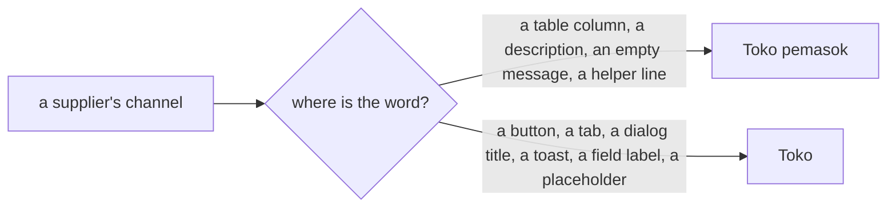

# Decisions — the supplier screens

The owner's decisions about **`/inventories/suppliers`** (the team's own suppliers) and the screens beside it — Discover,
a supplier's page, the report. **Append-only** (RULE 12): a reversed decision is renamed and its references grepped.

The rules every screen follows are in [context_decision.md](context_decision.md); the supplier *business* decisions stay
in [supplier/context_decision.md](../../business/supplier/context_decision.md), where the two lists were decided
([manage-and-discover-are-two-pages](../../business/supplier/context_decision.md#manage-and-discover-are-two-pages),
[discover-searches-every-teams-suppliers](../../business/supplier/context_decision.md#discover-searches-every-teams-suppliers)).

| decision | what it decided |
| --- | --- |
| [the-suppliers-list-follows-the-screen-rules](#the-suppliers-list-follows-the-screen-rules) | the team's supplier list applies the screen rules: Discover's columns minus the team, the shared FilterBar with the store type, the name sorting from its heading, the growing pager; a block per supplier on a phone |
| [a-store-count-sits-in-its-badge](#a-store-count-sits-in-its-badge) | a supplier's store count sits inside its marketplace badge — *Shopee ×3* — on both supplier lists |
| [a-supplier-action-is-labelled](#a-supplier-action-is-labelled) | *Tambah Pemasok* carries its ＋; a row's Ubah and Hapus are labelled buttons — at a phone block's foot |
| [the-add-supplier-form-shows-examples](#the-add-supplier-form-shows-examples) | the add dialog is *Tambah Pemasok*, its button *Tambah*, every field showing an example |
| [a-supplier-row-lights-up](#a-supplier-row-lights-up) | a supplier row lights up under the pointer, every cell of it; a phone block while pressed |
| [the-supplier-is-described-under-its-name](#the-supplier-is-described-under-its-name) | a supplier's page says who it is in a line under its name — contact (copyable) and address with their icons, its note muted — and carries Ubah and Hapus beside the name |
| [a-store-reads-its-name-then-its-type](#a-store-reads-its-name-then-its-type) | in the Saluran tab a store is one cell in two lines — its name bold, its type badge under it |
| [a-channel-action-is-labelled](#a-channel-action-is-labelled) | a store's Ubah and Hapus are labelled buttons, as a supplier row's — at a phone block's foot |
| [toko-in-an-action-toko-pemasok-in-a-table](#toko-in-an-action-toko-pemasok-in-a-table) | a supplier's channel is called *Toko pemasok* in a table or a description and *Toko* in an action — *Saluran* is gone |
| [a-supplier-product-row-says-whose-where-and-when](#a-supplier-product-row-says-whose-where-and-when) | the Produk tab: the product with its picture and SKU, its team, the store it was bought at, the last restock with the first under it — newest first |
| [the-products-tab-filters-by-team-and-store](#the-products-tab-filters-by-team-and-store) | the Produk tab filters by one selling team (the Statistik tab's picker), then by one of the supplier's stores (a search select); one team picked, the Tim column goes |
| [the-statistics-tab-is-two-views](#the-statistics-tab-is-two-views) | the Statistik tab is two views — *Dari Waktu ke Waktu* and *Per Produk*, a tab row over the table, one open at a time; the team and the window carry across, the grain is Over Time's only |
| [the-figures-headline-is-the-card-strip](#the-figures-headline-is-the-card-strip) | a supplier's figures headline is the shared `SummaryStrip` of `SummaryCard`s, not a box of its own — the Statistik tab and the Supplier Report |
| [the-loss-rates-sit-in-their-cards](#the-loss-rates-sit-in-their-cards) | the lost and broken rates sit beside their figures in the Hilang and Rusak cards, in the figure's tone — no Tingkat rusak card |
| [the-grain-sits-right-of-the-window](#the-grain-sits-right-of-the-window) | on the Statistik tab, *Harian · Bulanan · Tahunan* sits right of the date range |
| [a-figures-row-lights-up](#a-figures-row-lights-up) | a row of the Statistik tab's tables lights up under the pointer, every cell |
| [the-total-leads-the-figures](#the-total-leads-the-figures) | a Total card leads the figures — every unit received and its value; a rate reads *1 unit · 0,7% dari total* |
| [the-view-is-picked-over-the-filters](#the-view-is-picked-over-the-filters) | the Statistik tab's *Dari Waktu ke Waktu · Per Produk* row sits first, over the filters |
| [the-loss-rates-are-their-own-columns](#the-loss-rates-are-their-own-columns) | in the figures tables, *Tingkat hilang* follows *Hilang* and *Tingkat rusak* follows *Rusak*, each a column of its own in the figure's tone |
| [a-supplier-tab-row-lights-up](#a-supplier-tab-row-lights-up) | a row of the Toko and Produk tabs lights up under the pointer, every cell |
| [the-add-store-form-shows-examples](#the-add-store-form-shows-examples) | the add-store dialog shows an example in every field, as the add-supplier dialog does |
| [a-phone-figures-block-reads-the-columns](#a-phone-figures-block-reads-the-columns) | on a phone a figures block reads the desktop's columns — *Hilang 1 · 2,3%  Rusak 2 · 4,7%* in their tones; no rate beside the title |
| [a-quiet-period-is-one-line-on-a-phone](#a-quiet-period-is-one-line-on-a-phone) | on a phone a period with nothing restocked is one thin dashed line, *2026-10-10 · tidak ada restok* |
| [a-phone-card-shows-no-note](#a-phone-card-shows-no-note) | on a phone the figures cards drop their note line — label, figure and units only |
| [the-first-restock-has-its-own-line](#the-first-restock-has-its-own-line) | on a phone a product block puts *pertama …* on its own line under *Terakhir dibeli …* |
| [a-figures-product-shows-its-picture](#a-figures-product-shows-its-picture) | Statistik's Per Produk draws a product with its picture, name and SKU — the Produk tab's item |
| [a-phone-supplier-is-its-name-and-stores](#a-phone-supplier-is-its-name-and-stores) | on a phone the supplier list's block is the name and its stores — no contact, no address; no store reads *Belum ada toko pemasok* |
| [discover-filters-team-before-store](#discover-filters-team-before-store) | Discover's filters: the search, then *Tim*, then the store type |
| [discover-is-cards-or-a-table](#discover-is-cards-or-a-table) | Discover shows its suppliers as cards (the default) or as a table, by a switch; a phone always shows cards |
| [a-discover-card-reads-who-whose-where](#a-discover-card-reads-who-whose-where) | a Discover card is the owner's reference card — name and address, a rule, the team and the stores, the contact with ↗ bottom right; four a row on a 2K screen |
| [a-store-type-filter-is-chips](#a-store-type-filter-is-chips) | Discover's store type is a row of chips under the filters — *Semua* then every type, one chosen, in the main tone |

## the-suppliers-list-follows-the-screen-rules

> Owner, in chat (2026-10-09), after reading the supplier context: *"sekarang ke suppliers, coba terapkan keputusan"*.

```
Pemasok  [Toko Melati]                                          [Pemasok Baru]
Pemasok yang dikelola tim ini — vendor tempat tim membeli stoknya.
[Cari pemasok, alamat, atau saluran]  [Semua jenis saluran ⌄]        Hapus filter
Pemasok ⇅                    · Saluran                       · Kontak        Aksi
PT Sumber Makmur               [Shopee] [Tokopedia] [Other]    0812-1111-2222  ✎ 🗑
Jl. Soekarno-Hatta 112, Bandung
                                           Per halaman [20 ⌄]  ‹ [1] ›

on a phone
PT Banyak Toko                                       ✎ 🗑
[Shopee] ×3 [Tokopedia] ×2 [Lazada] …
0811-5555-6666 · Jl. Gatot Subroto 20, Jakarta
```

| rule | applied |
| --- | --- |
| the columns | **Discover's, minus the team** — *Pemasok* (the name bold, the address under it: one context, two lines, as Discover's), *Saluran*, *Kontak*, and Edit and Delete for a selling team. It was Nama · Kontak · Alamat |
| a supplier's stores | `ChannelTypes` — one badge per channel type, *Shopee ×3*, a deleted store not counted ([a-store-delete-is-soft-too](../../business/supplier/context_decision.md#a-store-delete-is-soft-too)). Moved from Discover to `features/suppliers/` — two lists read a supplier's stores the same way now. The list asks `SupplierList` for its CHANNELS slice |
| [a-phone-filters-from-a-sheet](context_decision.md#a-phone-filters-from-a-sheet) · [clear-filters-is-red-and-bold](context_decision.md#clear-filters-is-red-and-bold) | the shared `FilterBar`: the search (debounced, as Discover's) and **the store type** — the contract's `channel_type`, a live store of that type; Clear, red and bold, puts both back; the type in the sheet on a phone |
| [a-table-sorts-from-its-headings](context_decision.md#a-table-sorts-from-its-headings) | **Pemasok** sorts — the one heading the contract orders by (`SupplierRowSort.NAME`), A to Z first, then flips. The list's own order, before any click, is newest first. On a phone the sort is a select in the Filter sheet, with *Terbaru dulu* |
| the pager | `GrowingPager`, 10 / 20 / 50 a page — as the accounts list, the report and an account's statement |
| [a-phone-reads-each-line-as-a-block](context_decision.md#a-phone-reads-each-line-as-a-block) | a supplier is a block: the name, its stores (the line skipped when it has none), the contact and the address; Edit and Delete beside the name |
| the header | the title and the team's badge, the page's purpose under them; the title block takes a basis (`1 1 16rem`) so *Pemasok Baru* wraps under it rather than squeezing it |
| empty | *Tidak ada pemasok ditemukan.* with no filter; *Tidak ada pemasok yang cocok.* when a search or a type narrowed it |
| unchanged | Edit and Delete inline (two actions stay on the row), Delete confirms and keeps the supplier for its figures ([a-deleted-supplier-is-kept-for-its-figures](../../business/supplier/context_decision.md#a-deleted-supplier-is-kept-for-its-figures)); a warehouse team reads why it has none ([only-a-selling-team-has-suppliers](../../business/supplier/context_decision.md#only-a-selling-team-has-suppliers)); a row opens the supplier's page |
| the stub | `SupplierList` in Storybook now sorts by name as the server does — the name, then the id to break a tie |

## a-store-count-sits-in-its-badge

> Owner, in chat (2026-10-09): *"untuk saluran, x2 x3, masuk badge?"* — then *"ya begitu"* to the drawing.

```
before                          now
[Shopee] ×3  [Tokopedia] ×2     [Shopee ×3]  [Tokopedia ×2]  [Lazada]
```

| | |
| --- | --- |
| the count | **inside** the marketplace badge, after the name, a step quieter (70% opacity) — one chip per type, evenly spaced |
| one store | no count — *Lazada*, not *Lazada ×1* |
| where | `MarketplaceBadge`'s new `count` prop (the shared badge extended, not forked); `ChannelTypes` passes it — so the team's list and Discover change together |
| was | the count beside the badge in small muted text — a gap after every *×3* made the row of chips uneven |

## a-supplier-action-is-labelled

> Owner, in chat (2026-10-09): *"pemasok baru jadi tambah pemasok ada iconnya, actionnya kasih label"*.

```
desktop                                                    phone
Pemasok [Toko Melati]                  [＋ Tambah Pemasok]   PT Sumber Makmur
…  PT Sumber Makmur … 0812-…   [✎ Ubah] [🗑 Hapus]          [Shopee] [Tokopedia] [Other]
                                                           0812-1111-2222 · Jl. Soekarno-Hatta 112
                                                                         [✎ Ubah] [🗑 Hapus]
```

| | |
| --- | --- |
| the add button | **Tambah Pemasok** (en *Add Supplier*), its ＋ before it — the accounts list's add button, `xs` and brand. It was *Pemasok Baru*, no icon. The dialog it opens keeps its title, *Pemasok Baru* |
| a row's actions | **labelled** buttons, `xs` outline with their icon — *Ubah*, and *Hapus* in the error tone — as the accounts list's row buttons are. They were bare icons |
| on a phone | the two buttons sit at the block's **foot**, right-aligned: beside the name they squeezed the supplier into a narrow column, its badges wrapping and its address cut |
| unchanged | Hapus still confirms, and the supplier is kept for its figures |

## the-add-supplier-form-shows-examples

> Owner, in chat (2026-10-09): *"kasih placeholder untuk tambah pemasok, titlenya juga tolong diganti"* — and *"buat juga
> jadi tambah"*.

```
┌ Tambah Pemasok ─────────────────────────── × ┐
│ Nama *     [Contoh: PT Sumber Makmur       ] │
│ Kontak     [Contoh: 0812-3456-7890         ] │
│            Nomor telepon atau WhatsApp.      │
│ Alamat     [Contoh: Jl. Soekarno-Hatta 112, Bandung ] │
│ Deskripsi  [Contoh: grosir kain dan benang, minimal order 1 rol ] │
│                              [Batal] [Tambah] │
└──────────────────────────────────────────────┘
```

| | |
| --- | --- |
| the title | **Tambah Pemasok** (en *Add Supplier*) — the button that opens it says the same. It was *Pemasok Baru*. Editing keeps *Ubah Pemasok* |
| the submit | **Tambah** (en *Add*) — it was *Buat*. Editing keeps *Simpan* |
| the placeholders | an example in every field, *Contoh: …* — a name, a phone number, an address, what the supplier sells; sentence case, as every placeholder. Shown only while the field is empty, so editing a filled record shows none |

## a-supplier-row-lights-up

> Owner, in chat (2026-10-09), on the supplier list: *"hoverable"*.

| | |
| --- | --- |
| a desktop row | lights up under the pointer, **every cell** in `bg.muted` — the account statement's rule ([a-statement-row-lights-up](financial_accounts_decision.md#a-statement-row-lights-up)). It was a `bg.subtle` on the row, barely visible |
| a phone block | the same tone under a pointer and **while a thumb presses it** — the block is a control, it opens the supplier |
| a story | drives it with `data-hover`, which Chakra's `_hover` honours — a synthetic pointer sets no CSS `:hover` |

## the-supplier-is-described-under-its-name

> Owner, in chat (2026-10-10), on the supplier's page: *"aku tidak mau detailnya seperti kontak, alamat seperti
> statistik, ada ide?"* — chose a panel beside the tabs, sticky (*"aku pilih B dan dia sticky ya"*), then on seeing it
> built: *"terlalu sedikit ternyata, kalau gitu ganti A"*.

```
← Kembali ke Pemasok
PT Sumber Makmur                                        [✎ Ubah] [🗑 Hapus]   ← ⋯ on a phone
☎ 0812-1111-2222 ⧉    📍 Jl. Soekarno-Hatta 112, Bandung
Grosir kain dan benang, minimal order 1 rol.                ← the supplier's note, muted
⚠ 1 bagian layar ini belum diimplementasi
Saluran | Produk ⚠1 | Statistik
```

| | |
| --- | --- |
| who it is | a line **under the name**: the contact with its phone icon, **copyable** (`CopyText`), and the address with its pin — then the description as a muted line. Its identity, not a figure: no card, no uppercase label over a value |
| an empty field | left out — a supplier with nothing but a name shows its name |
| was | a bordered card of three uppercase-labelled fields — *KONTAK · ALAMAT · DESKRIPSI* — read like the figures' cards |
| tried and dropped | a *Tentang Pemasok* panel beside the tabs, sticky — three short lines were too little to hold a column, and it narrowed the six-column figures table |
| the actions | **Ubah** and **Hapus** beside the name, labelled ([a-supplier-action-is-labelled](#a-supplier-action-is-labelled)) — the page had none, only the list did. Only for the team that keeps the supplier. Hapus confirms and goes back to the list. On a phone both fold into ⋯ and the header stays one row ([the-phone-header-is-one-row](context_decision.md#the-phone-header-is-one-row)) |
| moved | `SupplierFormDialog` to `features/suppliers/` — the list and the page both open it now |


## a-store-reads-its-name-then-its-type

> Owner, in chat (2026-10-10), on the supplier page's Saluran tab: *"saluran type di bawahnya nama toko atau sebaliknya
> sih"* — either order; the name on top was picked by the rule below.

```
before                                   now
[Shopee] Sumber Makmur Official          Sumber Makmur Official
                                         [Shopee]
```

| | |
| --- | --- |
| the cell | **the store's name**, bold, then **its type badge** under it — one context, two lines |
| why this order | a row's status sits UNDER its reference, so the badges line up down the page ([one-context-per-column-and-never-three-lines](context_decision.md#one-context-per-column-and-never-three-lines)); a badge first pushed every name to a different start |
| where | `ChannelBrowser`, so the manage page and the Discover page change together; on a phone the block reads the same — the name, the badge, then the link and the note |

## a-channel-action-is-labelled

> Owner, in chat (2026-10-10): *"di channel, aksi ada namanya"*.

```
desktop                                                      phone
Sumber Makmur Official   https://shopee…   —   [✎ Ubah] [🗑 Hapus]   Sumber Makmur Official
[Shopee]                                                       [Shopee]
                                                               https://shopee.co.id/sumbermakmur
                                                                              [✎ Ubah] [🗑 Hapus]
```

| | |
| --- | --- |
| a store's actions | **labelled** buttons, `xs` outline with their icon — *Ubah*, and *Hapus* in the error tone — the supplier row's pair ([a-supplier-action-is-labelled](#a-supplier-action-is-labelled)). They were bare ghost icons |
| on a phone | at the block's **foot**, right-aligned — beside the name they squeezed it into a narrow column |
| unchanged | only the team that keeps the supplier sees them; Hapus confirms; the Discover page stays read-only |

## toko-in-an-action-toko-pemasok-in-a-table

> Owner, in chat (2026-10-10), asked for other names than *Saluran*, then *"kalau toko saja?"* — then: *"untuk di tabel
> atau keterangan kita pakai Toko pemasok, tapi kalau untuk aksi dsb kita pakai toko, misal tambah saluran jadi tambah
> toko"*.



| where | the word | id | en |
| --- | --- | --- | --- |
| a table column | **Toko pemasok** | *Toko pemasok* — the supplier list, Discover, the Toko tab, the Produk tab | *Supplier store(s)* |
| a description | **Toko pemasok** | the Discover lead, the sample-rows reason, *Belum ada toko pemasok.*, *Tidak ada toko pemasok yang cocok.*, the name field's help | *supplier store* |
| an action and the rest | **Toko** | *Tambah Toko*, *Ubah Toko*, *Hapus Toko*, the tab *Toko*, *Toko "…" dihapus*, *Jenis toko*, *Pilih jenis toko*, *Semua jenis toko*, *Cari pemasok, alamat, atau toko* | *Store* |

| | |
| --- | --- |
| why two | *Toko* alone already means a team's OWN shop — where orders come in — in about ten places (the menu, orders, settlement, accounts). A table or a description is read without the action's context, so it says whose; a button sits inside the supplier's page and does not need to |
| a toast, a placeholder | counted with the actions — each answers or prompts something the person does |
| the code | unchanged — the contract, the keys and the components keep *channel*; only the copy moved |
| earlier entries | drawn with *Saluran* — [a-store-reads-its-name-then-its-type](#a-store-reads-its-name-then-its-type) and the ones before it. Read *Saluran* there as this entry's words |

## a-supplier-product-row-says-whose-where-and-when

> Owner, in chat (2026-10-10), on the Produk tab: asked what data it will carry, then *"tambahkan tim, pertama terakhir
> beli juga, foto kecil juga, tata letak sesuai saranmu"*.

```
Produk                         Tim                  Toko pemasok              Terakhir dibeli
[▦] Kain Katun Jepang 1 rol    [TM] Toko Melati     sumbermakmur.co.id        8 Okt 2026
    KTN-JP-01                       Selling         [Other]                   pertama 8 Sep 2026

on a phone
[▦] Kain Katun Jepang 1 rol
    KTN-JP-01 [Toko Melati]
sumbermakmur.co.id [Other]
Terakhir dibeli 8 Okt 2026 · pertama 8 Sep 2026
```

| column | what it shows | from |
| --- | --- | --- |
| Produk | `ProductListItem` — the small picture (the placeholder when there is none), the name, the SKU under it: the app's one way to draw a product. SKU is no longer its own column | product_service, by the link's `product_id` |
| Tim | `TeamItem` — whose product it is, the team that restocked it; two teams buying one item are two rows ([every-accepted-line-links-its-own-product](../../business/supplier/context_decision.md#every-accepted-line-links-its-own-product)) | the product's `team_id` |
| Toko pemasok | its name, its type under it — the Toko tab's cell ([a-store-reads-its-name-then-its-type](#a-store-reads-its-name-then-its-type)), not bold: here the product is the row's subject | supplier_channels |
| Terakhir dibeli | the last restock, and **pertama …** — the first — muted under it; one fact read twice, so one cell. Bought once, one date | the link's `last_restocked_at` and `created_at` ([a-link-remembers-its-last-restock](../../business/supplier/context_decision.md#a-link-remembers-its-last-restock)) |

| | |
| --- | --- |
| the order | newest restock first — a product a store stopped selling sinks to the bottom |
| on a phone | a block: the product with its team as a badge beside the SKU, the store with its badge, then *Terakhir dibeli … · pertama …* |
| still sample | every row — product, team, picture and dates are invented from the supplier's real stores until the link is built; the tab keeps its `sample` mark. The pictures are flat swatches drawn for the sample |
| no API change | the read behind it does not exist yet; this is the screen it will fill |

## the-products-tab-filters-by-team-and-store

> Owner, in chat (2026-10-10), asked which filters the tabs have — I recommended waiting for the Produk tab's read —
> then: *"oke di produk tambah toko pemasok"*, and *"tim juga"* — and on seeing them: *"tim dulu, lalu toko"*,
> *"select toko, badgenya di bawah"*.

```
desktop
[Cari produk, SKU, atau toko]   [Semua tim ⌄]   [Semua toko ⌄]        Hapus filter
                                                 sumbermakmur.co.id
                                                 [Other]
                                                 Sumber Makmur Store
                                                 [Tokopedia]

on a phone — the search, and the two in the Filter sheet
[Cari produk, SKU, atau toko]  [⚟ Filter]
```

| filter | what | the control |
| --- | --- | --- |
| the search | the product, its SKU, or the store's name — as before | `FilterSearch` |
| **Tim** | one selling team — whose product it is | `RestockTeamFilter`, the Statistik tab's picker — every selling team ([the-team-filter-picks-any-selling-team](../../business/supplier/context_decision.md#the-team-filter-picks-any-selling-team)) |
| **Toko pemasok** | one of **this supplier's** stores — only what was bought there stays | `SupplierStoreSelect` (new, `features/suppliers/`) — a search select, since a supplier's stores have no ceiling; the stores are the page's own read, filtered in the field by name or type; each option its name with its badge **under** it, as in the tables ([a-store-reads-its-name-then-its-type](#a-store-reads-its-name-then-its-type)); clearing emits 0n |

| | |
| --- | --- |
| the order | **Tim, then Toko pemasok** — the order of the table's columns |
| one team picked | the **Tim** column goes, and the team badge on a phone block — it would say one name on every row. The Statistik tab's product table already does this |
| Clear, the pager | Clear puts all three back; any change starts the pager over ([every-list-pages-with-the-growing-pager](context_decision.md#every-list-pages-with-the-growing-pager)) |
| placeholders | *Semua tim*, *Semua toko* — a placeholder is on the action side of [toko-in-an-action-toko-pemasok-in-a-table](#toko-in-an-action-toko-pemasok-in-a-table) |
| still sample | the filters run over the sample rows in the browser; the real read will take a store and a team. The sample's two teams are Storybook's selling teams (*Toko Melati*, *Toko Kenanga*), so the team filter finds them there — in the dev app the real teams have other ids, so picking one finds none until the read exists |

## the-statistics-tab-is-two-views

> Owner, in chat (2026-10-10): *"statistic designnya diubah, dari waktu dan per produk bedakan halamannya"*. Then
> *"bentuknya diubah seperti keputusan sebelumnya"* — which I read as the switch, and moved it to a tab row; the owner
> meant the summary box (*"kotaknya yang diubah"*, [the-figures-headline-is-the-card-strip](#the-figures-headline-is-the-card-strip)).

```
before — two tables stacked                 now — two views, one open
Statistik                                   Statistik
[tim] [Harian|Bulanan|Tahunan] [30 hari]    [tim] [Harian|Bulanan|Tahunan] [30 hari]
headline                                    headline
Dari Waktu ke Waktu                         Dari Waktu ke Waktu | Per Produk    ← a tab row
  table · pager                             ━━━━━━━━━━━━━━━━━━━
Per Produk                                  the view's table · its pager
  table · pager
                                            Per Produk: [tim] [30 hari] — no grain
```

| | |
| --- | --- |
| the switch | a **tab row right over the table**, the line tabs in the main tone — a view of one question, not a value on a form ([the-accounts-type-is-a-tab-row](financial_accounts_decision.md#the-accounts-type-is-a-tab-row), [a-selected-tab-is-in-the-main-tone](context_decision.md#a-selected-tab-is-in-the-main-tone)). Under the filters and the headline, so it never sits against the page's own tab row. *Dari Waktu ke Waktu* opens first |
| first drawn | pill tabs with icons at the top of the tab, over the filters — moved to the tab row on a misreading; the tab row follows the recorded rule, so it stays unless the owner wants the pills back |
| one at a time | only the open view is mounted — its table and its pager; *Per Produk* is read only once it is opened |
| what carries across | **the team and the window** — switching view asks the same question by period or by item. Each view keeps its own page |
| the grain | **Dari Waktu ke Waktu only** — by product the window is one figure per item, so *Harian · Bulanan · Tahunan* would change nothing |
| the headline | on **both** views — the whole window, above the view's table |
| nothing restocked | said once, in place of the open view's table |
| was | both tables stacked under one headline, each with its own heading and pager — the product table sat a scroll below the first one's pager |

## the-figures-headline-is-the-card-strip

> Owner, in chat (2026-10-10), on the Statistik tab: *"bentuknya diubah seperti keputusan sebelumnya"*, then
> *"kotaknya yang diubah"* — the summary box.

```
before — one bordered box, four figures in it        now — the order list's strip of cards
┌─────────────────────────────────────────────┐      ┌ Direstok ────┐ ┌ Hilang di… ─┐ ┌ Rusak di… ──┐ ┌ Tingkat rusak ┐
│ Direstok     Hilang…    Rusak…     Tingkat… │      │ Rp 4.400.000 │ │ Rp 50.000   │ │ Rp 195.000  │ │ 4,4%          │
│ Rp 4.400.000 Rp 50.000  Rp 195.000 4,4%     │      │ 130 unit     │ │ 1 unit      │ │ 6 unit      │ │ rusak ÷ semua…│
└─────────────────────────────────────────────┘      │ unit baik…   │ │ unit yang…  │ │ unit yang…  │ └───────────────┘
```

| | |
| --- | --- |
| the rule | [a-list-summary-is-the-order-lists-card-strip](context_decision.md#a-list-summary-is-the-order-lists-card-strip) — *never a screen's own stat box* — and [a-summary-card-is-grey-with-a-thin-border](context_decision.md#a-summary-card-is-grey-with-a-thin-border). `FiguresSummary` was a stat box of its own |
| a card | the label · the value · **the units** on the quiet line · **how the figure is made** under it, quieter (`note`). Tingkat rusak has no units, only its note |
| tones | lost in `warning.fg`, broken in `error.fg` once there is any — as before |
| width | the strip's own: 1/4 a card on a desktop, 1/5 on a 2K screen, two a row on a phone ([a-summary-card-is-at-most-a-fifth](context_decision.md#a-summary-card-is-at-most-a-fifth)) |
| no lead card | none of the four is `emphasis` — which one leads, if any, is not decided |
| where | `FiguresSummary` (`features/suppliers/FigureParts.tsx`) — so **the Supplier Report's headline changes with it** |
| the cost | a card clamps each line to one, so a long note is cut with … on a narrow card |

## the-loss-rates-sit-in-their-cards

> Owner, in chat (2026-10-10), on the Statistik tab: *"untuk tingkat kerusakan dan hilang kasih saja di card hilang dan
> rusak dengan persentasenya sesuai warna nomornya"* — then *"persentase kasih di sebelah unit, bold"*.

```
┌ Direstok ────┐ ┌ Hilang di pengiriman ┐ ┌ Rusak di pengiriman ┐
│ Rp 4.400.000 │ │ Rp 50.000            │ │ Rp 195.000          │   ← amber, red
│ 130 unit     │ │ 1 unit 0,7%          │ │ 6 unit 4,4%         │   ← the rate bold, in the figure's tone
│ unit baik…   │ │ unit yang kurang…    │ │ unit yang tiba…     │
```

| | |
| --- | --- |
| the rates | **lost ÷ every unit received** in the Hilang card, **broken ÷ every unit received** in the Rusak card — beside the units, bold, in the figure's tone (amber, red) once there is any |
| the Tingkat rusak card | gone — its figure is the Rusak card's percentage now. Supersedes that card in [the-figures-headline-is-the-card-strip](#the-figures-headline-is-the-card-strip) |
| the lost rate | on a desktop too — it was computed for a phone block alone |
| nothing received | no rate, not *0%* |
| where | `FiguresSummary` — so the Supplier Report's headline changes with it |
| unchanged | the tables keep their *Tingkat rusak* column |

## the-grain-sits-right-of-the-window

> Owner, in chat (2026-10-10): *"harian bulanan di kanan tanggal"*.

```
[Semua tim ⌄]  [30 hari terakhir ⌄]  [Harian|Bulanan|Tahunan]
```

The grain follows the window it cuts. Over Time only, as [the-statistics-tab-is-two-views](#the-statistics-tab-is-two-views).

## a-figures-row-lights-up

> Owner, in chat (2026-10-10), on the Statistik tab: *"kasih hoverable"*.

| | |
| --- | --- |
| a row | of either table — Dari Waktu ke Waktu, Per Produk — lights up under the pointer, **every cell** in `bg.muted`, as [a-supplier-row-lights-up](#a-supplier-row-lights-up) |
| a phone block | does not — it opens nothing, so it is not a control |

## the-total-leads-the-figures

> Owner, in chat (2026-10-10), on the cards: *"totalnya tidak ada?"* — then, to a Total card leading the strip: *"iya,
> kasih total, disebelah unit ada . persetase ada keterangan dari total"*.

```
┌ Total ───────┐ ┌ Direstok ────┐ ┌ Hilang di pengiriman ┐ ┌ Rusak di pengiriman ┐
│ Rp 4.645.000 │ │ Rp 4.400.000 │ │ Rp 50.000            │ │ Rp 195.000          │
│ 137 unit     │ │ 130 unit     │ │ 1 unit · 0,7% dari total │ 6 unit · 4,4% dari total
│ semua unit…  │ │ unit baik…   │ │ unit yang kurang…    │ │ unit yang tiba…     │
  ↑ pale blue, the lead
```

| | |
| --- | --- |
| the Total card | **first**, the strip's one lead (`emphasis`, pale blue — [a-summary-card-is-grey-with-a-thin-border](context_decision.md#a-summary-card-is-grey-with-a-thin-border)) · the value of every unit received · **restocked + lost + broken** units on its line · *semua unit yang diterima dari pemasok* |
| why | the percentages are shares of it — without it on screen, *4,4%* had no whole to be read against |
| a rate's line | **units · rate *dari total*** — a dot after the units, the rate bold in the figure's tone ([the-loss-rates-sit-in-their-cards](#the-loss-rates-sit-in-their-cards)), *dari total* plain |
| no API change | the sum of the three figures the reads already return |
| a phone | four cards, two a row — Rusak no longer alone on its row |
| where | `FiguresSummary` — the Supplier Report's headline too |

## the-view-is-picked-over-the-filters

> Owner, in chat (2026-10-10): *"tipe dari waktu ke waktu dan per produk di atas filter"*.

```
Toko | Produk | Statistik
Dari Waktu ke Waktu | Per Produk                         ← first
[Semua tim ⌄] [30 hari terakhir ⌄] [Harian|Bulanan|Tahunan]
Total · Direstok · Hilang · Rusak
the view's table · its pager
```

| | |
| --- | --- |
| the switch | **first in the tab, over the filters** — the view decides which filters there are (Per Produk has no grain), so it is picked before them. Still the line tabs in the main tone |
| supersedes | the switch's place in [the-statistics-tab-is-two-views](#the-statistics-tab-is-two-views) — under the headline, right over the table |

## the-loss-rates-are-their-own-columns

> Owner, in chat (2026-10-10), on the figures tables: *"persentase hilang rusak taruh di columnnya sendiri, bukan kolom
> baru"* — then, before it was seen: *"persentase jadi column beda aja kalau gitu"*.

```
Periode     Direstok      Hilang di pengiriman  Tingkat hilang  Rusak di pengiriman  Tingkat rusak
2026-10-08        40                     1           2,3%                     2           4,7%
           Rp 2.000.000            Rp 50.000                          Rp 100.000
```

| | |
| --- | --- |
| the columns | **Tingkat hilang** right after *Hilang di pengiriman*, **Tingkat rusak** right after *Rusak di pengiriman* — each rate beside the figure it is a share of |
| a rate | the share of the row's units received · amber for lost, red for broken, once there is any · a muted *0%* when none went that way · a dash when nothing arrived |
| the lost rate | a column now — it was a phone block's alone |
| tried first | the rate inside the figure's own cell (*2 · 4,7%*) — reversed by the owner before it was seen |
| where | `FigureHeaders` · `FigureCells` — the Statistik tab's two tables **and the Supplier Report's ranking**; its broken rate keeps its muted grey under 50 units ([rate-ranking-needs-50-units](../../business/supplier/context_decision.md#rate-ranking-needs-50-units)) |
| supersedes | *the tables keep their Tingkat rusak column* in [the-loss-rates-sit-in-their-cards](#the-loss-rates-sit-in-their-cards) |
| a phone | unchanged — the block keeps its broken rate beside the title and the lost rate on its line |

## a-supplier-tab-row-lights-up

> Owner, in chat (2026-10-10): *"toko dan produk hoverable"*.

| | |
| --- | --- |
| a row | of the **Toko** and **Produk** tabs' tables lights up under the pointer, every cell in `bg.muted` — the Statistik tab's [a-figures-row-lights-up](#a-figures-row-lights-up), so every table on the supplier's page now does |
| a phone block | does not — neither opens anything; a store block's buttons are its own controls |
| where | `ChannelBrowser`, `ProductBrowser` — the Discover detail too |

## the-add-store-form-shows-examples

> Owner, in chat (2026-10-10): *"tambah toko kasih placeholder"*.

```
┌ Tambah Toko ───────────────────────────────── × ┐
│ Jenis toko *  [Pilih jenis toko                ⌄] │
│ Nama *        [Contoh: Sumber Makmur Official   ] │
│               Nama toko pemasok di marketplace atau situsnya.
│ Tautan        [Contoh: https://shopee.co.id/sumbermakmur ] │
│ Deskripsi     [Contoh: gratis ongkir di atas 5 rol ] │
│                                  [Batal] [Tambah] │
```

| | |
| --- | --- |
| the placeholders | *Contoh: …* in the name, the link and the description — the add-supplier form's pattern ([the-add-supplier-form-shows-examples](#the-add-supplier-form-shows-examples)). The type keeps *Pilih jenis toko* |
| the link | was a bare *https://* — now a whole example address |
| edit | shows none — a filled field hides its placeholder |

## a-phone-figures-block-reads-the-columns

> Owner, in chat (2026-10-10), reviewing the supplier page on a phone — to *"Statistik: blok per periode masih format
> lama"*: *"diperbaiki"*.

```
before                              now
2026-10-08          4,7% rusak      2026-10-08
Direstok 40 · Rp 2.000.000          Direstok 40 · Rp 2.000.000
Hilang 1 (2,3%) · rusak 2           Hilang 1 · 2,3%    Rusak 2 · 4,7%     ← amber, red
```

| | |
| --- | --- |
| the lines | the title (and its sub-line), **Direstok n · Rp …**, then **Hilang n · rate** and **Rusak n · rate** side by side — the desktop's columns ([the-loss-rates-are-their-own-columns](#the-loss-rates-are-their-own-columns)) read as a line |
| tones | a count and its rate in amber (lost) or red (broken) once there is any; *0* and its *0%* muted; no rate when nothing arrived |
| beside the title | nothing — the broken rate there repeated the line under it |
| a block that opens something | (the Supplier Report's) lights up under a pointer and while pressed, as [a-table-row-lights-up](context_decision.md#a-table-row-lights-up) |
| where | `FigureBlock` — the Statistik tab's two views **and the Supplier Report's phone list**; its muted rate under 50 units stays, on *Rusak* |

## a-quiet-period-is-one-line-on-a-phone

> Owner, in chat (2026-10-10), to *"hari tanpa restok tetap jadi blok penuh"*: *"oke"*.

```
┆ 2026-10-10 · tidak ada restok ┆        ← dashed, muted, one line
┌ 2026-10-08 ───────────────────┐
│ Direstok 40 · Rp 2.000.000    │
│ Hilang 1 · 2,3%  Rusak 2 · 4,7% │
└───────────────────────────────┘
```

| | |
| --- | --- |
| a quiet period | nothing received — one line, *{period} · tidak ada restok*, dashed and muted |
| why it stays | a missing period reads as one that did not load — the series keeps every period |
| was | a full block of zeroes per quiet day — thirty blocks for thirty days |
| a desktop | unchanged — its quiet rows are already one line of muted zeroes |

## a-phone-card-shows-no-note

> Owner, in chat (2026-10-10), to *"keterangan terpotong"*: *"iya"*.

| | |
| --- | --- |
| on a phone | the figures cards show their label, figure and units — **no note** (*semua unit yang diterima …*) |
| why | two cards share a row on a phone and every note was cut to *"unit yang…"* |
| a desktop | keeps its notes |
| where | `FiguresSummary` — the Statistik tab and the Supplier Report |

## the-first-restock-has-its-own-line

> Owner, in chat (2026-10-10), to *"baris tanggal terbelah aneh"*: *"oke"*.

```
before                                        now
Terakhir dibeli 29 Sep 2026 · pertama 13 Agu  Terakhir dibeli 29 Sep 2026
2026                                          pertama 13 Agu 2026
```

On a phone the first restock sits on its own line under the last, as on a desktop — after a dot it wrapped mid-date.

## a-figures-product-shows-its-picture

> Owner, in chat (2026-10-10): *"statistik per produk ada gambar"*.

```
desktop                                                          phone
Produk                          Tim          Direstok  …         [▦] Beras Pandan Wangi 5kg
[▦] Beras Pandan Wangi 5kg      Toko Melati        70            SKU-BERAS-5K [Toko Melati]
    SKU-BERAS-5K                             Rp 3.500.000         Direstok 70 · Rp 3.500.000
[📦] Gula Pasir 1kg             Toko Kenanga       60            Hilang 1 · 1,4%   Rusak 3 · 4,1%
    SKU-GULA-1K
```

| | |
| --- | --- |
| the product | `ProductListItem` — the picture (the thumbnail, else the full image; the placeholder when there is none), the name, the SKU under it — as the Produk tab draws it ([a-supplier-product-row-says-whose-where-and-when](#a-supplier-product-row-says-whose-where-and-when)) |
| on a phone | the same item heads the block, the team as a badge beside the SKU (gone when one team is picked) |
| the data | already in the read — `ProductByIds` returns each product's `default_image_thumbnail_url`; no API change |
| Storybook | product 74 (Beras) now has a drawn picture in the shared fixtures, so a picture path is exercised; the others keep the placeholder |

## a-phone-supplier-is-its-name-and-stores

> Owner, in chat (2026-10-10): *"suppliers mobil tidak perlu kontak dan alamat, tidak ada toko tertaut tulis teks"*.

```
before                                  now
PT Sumber Makmur                        PT Sumber Makmur
[Shopee] [Tokopedia] [Other]            [Shopee] [Tokopedia] [Other]
0812-1111-2222 · Jl. Soekarno-Hatta…                    [✎ Ubah] [🗑 Hapus]
                [✎ Ubah] [🗑 Hapus]
Toko Grosir Sinar                       Toko Grosir Sinar
—                                       Belum ada toko pemasok
```

| | |
| --- | --- |
| the block | the supplier's **name**, then **its stores** (`ChannelTypes`), then Ubah and Hapus at its foot |
| gone | the contact and the address line — the block is for finding the supplier; its page carries both ([the-supplier-is-described-under-its-name](#the-supplier-is-described-under-its-name)) |
| no store | a muted line in words, ***Belum ada toko pemasok*** (en *No supplier stores yet*) — it was a dash, or no line at all |
| a desktop | unchanged — the address under the name, the contact in its column, a store-less row's *Toko pemasok* cell still a dash |

## discover-filters-team-before-store

> Owner, in chat (2026-10-10), on Discover: *"tim sebelum toko untuk filter"*.

```
[Cari pemasok, alamat, atau toko]  [Semua tim ⌄]  [Semua jenis toko ⌄]
```

*Whose* comes before *where it sells* — as on the supplier page's Produk tab ([the-products-tab-filters-by-team-and-store](#the-products-tab-filters-by-team-and-store)).

## discover-is-cards-or-a-table

> Owner, in chat (2026-10-10): *"untuk discover kita bagi 2 mode, yaitu card dan table dan bisa swicth default card"*.

```
Temukan Pemasok
[Cari …] [Semua tim ⌄] [Semua jenis toko ⌄]                    (▦ Kartu | ⊞ Tabel)
┌ PT Sumber Makmur ─────────┐ ┌ CV Cahaya Abadi ───┐ ┌ UD Makmur Jaya ────┐
│ Jl. Soekarno-Hatta 112, … │ │ Jl. Raya Darmo 45… │ │ Jl. Pasar Baru 3…  │
│ [TM] Toko Melati  Selling │ │ [TM] Toko Melati   │ │ [TK] Toko Kenanga  │
│ [Shopee] [Tokopedia] …    │ │ [Other]            │ │ [Shopee] [TikTok]  │
│ ☎ 0812-1111-2222          │ │ ☎ 0812-2222-3333   │ │ ☎ 0813-4444-5555   │
└───────────────────────────┘ └────────────────────┘ └────────────────────┘
```

| | |
| --- | --- |
| the switch | **Kartu · Tabel**, a segmented choice with an icon each ([a-segmented-choice-is-in-the-main-tone](context_decision.md#a-segmented-choice-is-in-the-main-tone)), at the right of the filter row — **Kartu** first |
| a card | the name, the address under it, the team that keeps it (`TeamItem`), its stores (`ChannelTypes`, or *Belum ada toko pemasok*), the contact with its icon · the whole card opens the Discover detail and lights up under a pointer and while pressed |
| the grid | one card a row on a phone, two from `md`, three from `lg` |
| the table | the rows it had — Pemasok (address under) · Tim · Toko pemasok · Kontak |
| what carries across | the filters and the page — the same rows, read two ways |
| a phone | always cards — they are its blocks — so no switch |
| remembered | no — every visit opens on cards |
| with it | the screen rules it had missed: `GrowingPager` ([every-list-pages-with-the-growing-pager](context_decision.md#every-list-pages-with-the-growing-pager)), every cell of a table row lighting up ([a-table-row-lights-up](context_decision.md#a-table-row-lights-up)), a Mobile story right after Default ([every-page-has-a-mobile-story](context_decision.md#every-page-has-a-mobile-story)) |

## a-discover-card-reads-who-whose-where

> Owner, in chat (2026-10-10), sending a reference card (a title, a description, a rule, an owner with a sub-line, tags,
> then *Contact available* and ↗): *"card 4, sama kasih panah itu di bawah kanan"* — then *"cardnya ada 4 di 2k"*.

```
┌──────────────────────────────────┐
│ PT Sumber Makmur                 │   ← Card.Title
│ Jl. Soekarno-Hatta 112, Bandung  │   ← Card.Description — where it is
│ ──────────────────────────────── │
│ [TM] Toko Melati                 │   ← whose it is (TeamItem)
│      Selling                     │
│ [Shopee] [Tokopedia] [Other]     │   ← where it sells — or "Belum ada toko pemasok"
│ 0812-1111-2222                ↗  │   ← Card.Footer: the contact, the arrow bottom right
└──────────────────────────────────┘
```

| the reference | the supplier card |
| --- | --- |
| title | the supplier's **name** |
| description | its **address** (two lines at most) — the supplier's own description stays on its page |
| the rule | a `Separator` |
| the owner, with its sub-line | **the team that keeps it** — `TeamItem`, the app's one way to draw a team (its type a badge, not plain text) |
| tags | **its stores** — `ChannelTypes`, one badge per type with its count |
| *Contact available* | **the contact itself**, small and muted — or *Belum ada kontak* |
| ↗ bottom right | `ArrowUpRight`, muted — the whole card opens the Discover detail |

| | |
| --- | --- |
| the grid | one a row on a phone, two from `md`, three from `lg`, **four from `2xl`** (1536px — a 2K screen) |
| supersedes | the card's content and the grid in [discover-is-cards-or-a-table](#discover-is-cards-or-a-table) |

## a-store-type-filter-is-chips

> Owner, in chat (2026-10-10), on Discover, sending a row of rounded chips (*All · Engineering · Design · Product*):
> *"filter jenis tokonya seperti ini"*.

```
[Cari pemasok, alamat, atau toko]  [Semua tim ⌄]   Hapus Filter          (▦ Kartu | ⊞ Tabel)
(Semua) (Shopee) (Tokopedia) (Lazada) (TikTok) (Blibli) (Bukalapak) (Other)
           ↑ the chosen chip — pale rose, a rose border and label

on a phone
[Cari …]  [⚟ Filter]
(Semua) (Shopee) (Tokopedia) (Lazada) …  → scrolls sideways
```

| | |
| --- | --- |
| the control | `FilterChips` (new, `components/chrome/`) — **Semua** first, then every store type; **one** chosen at a time, in the main tone ([a-chosen-option-is-in-the-main-tone](context_decision.md#a-chosen-option-is-in-the-main-tone)); buttons with `aria-pressed` |
| where | its **own row, right under the filters** — the team filter stays first ([discover-filters-team-before-store](#discover-filters-team-before-store)) |
| on a phone | outside the Filter sheet, one row that **scrolls sideways** — the narrowing reached for most stays one tap away |
| the Filter count | leaves the type out — its chips are on screen; **Hapus Filter** still resets it |
| not RadioPills | that is a field's answer on a form, with a radio mark and two to four options; this is a list's quick narrowing |
| was | a `MarketplaceSelect` dropdown in the filter row |
