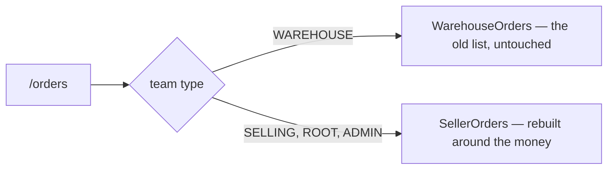
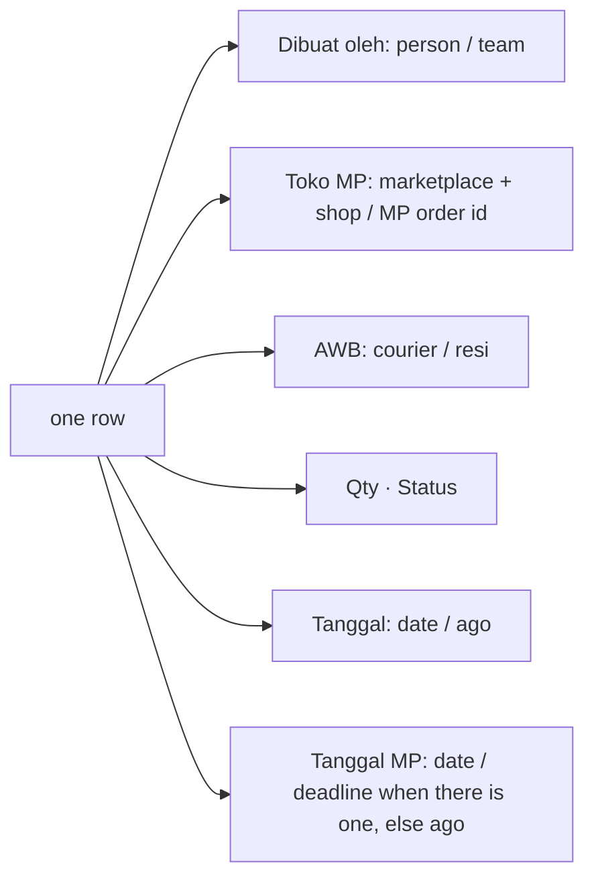
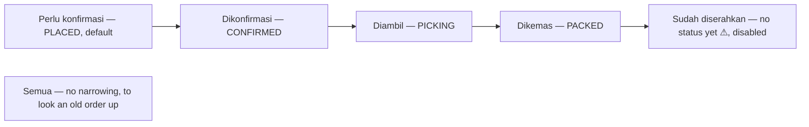
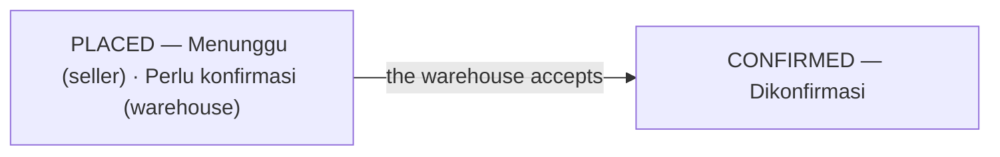
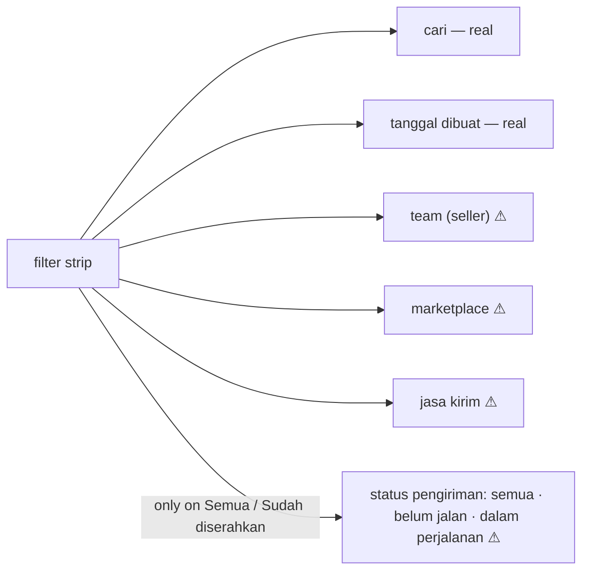
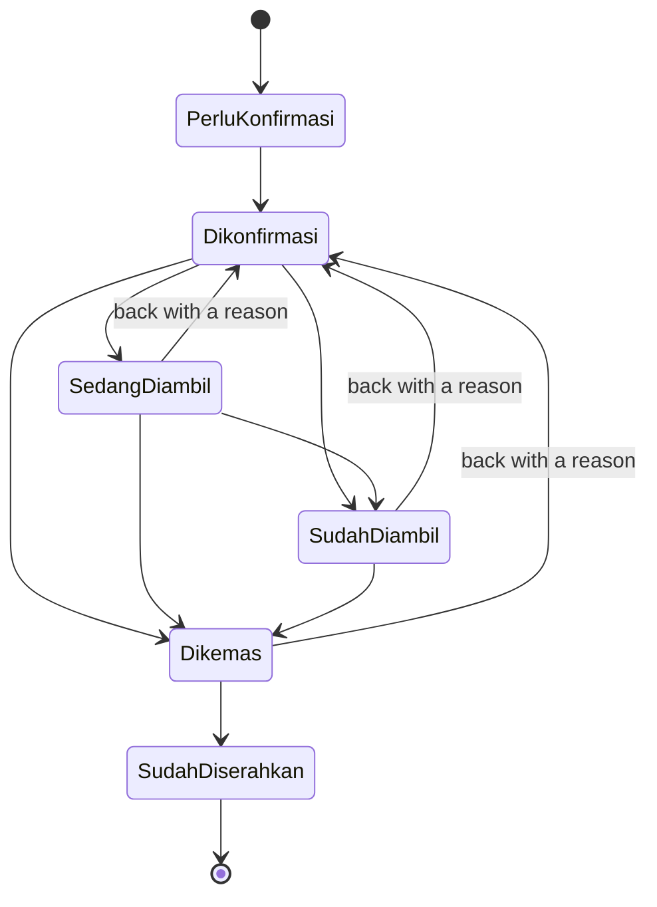
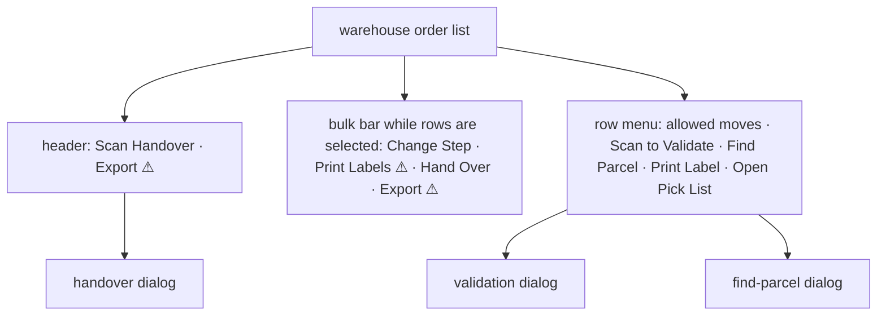
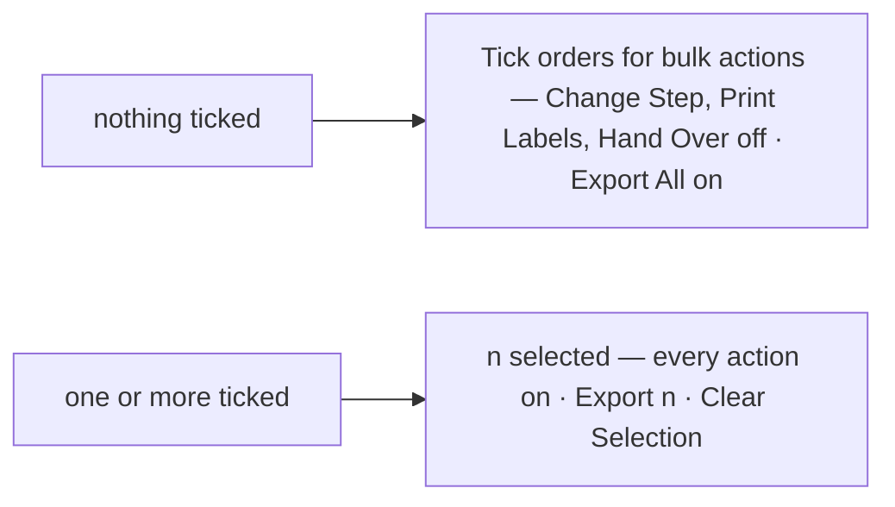

# Decisions — the warehouse order list

The owner's decisions about the **warehouse's order list** — the other end of `/orders`, a preview hidden in Storybook (`Pages/Warehouse/PickQueueNextPage`) until it is routed. **Append-only** (RULE 12): a reversed decision is renamed and its references grepped.

The rules every screen follows are in [context_decision.md](context_decision.md). These were recorded in
[technical/order/design_decision.md](../order/design_decision.md) first and moved here on 2026-10-02;
each old heading there now points here.

| decision | what it settles |
| --- | --- |
| [the-two-ends-are-two-screens](#the-two-ends-are-two-screens) | the warehouse keeps its old list — almost nothing on the seller's row is a fact a picker acts on |
| [the-warehouse-row-is-the-old-systems-columns](#the-warehouse-row-is-the-old-systems-columns) | the warehouse list's row: created by, marketplace shop, AWB, qty, status, date, MP date — the deadline replaces the MP date's "ago" when there is one |
| [the-warehouse-tabs-are-the-processed-steps](#the-warehouse-tabs-are-the-processed-steps) | the warehouse's tabs are Perlu konfirmasi, the four steps of Diproses and Semua — not the order's statuses; a row's badge says its tab's word |
| [the-confirmed-step-reads-dikonfirmasi](#the-confirmed-step-reads-dikonfirmasi) | the CONFIRMED step is named "Dikonfirmasi", not "Perlu konfirmasi" |
| [the-warehouse-filters-by-team-marketplace-and-courier](#the-warehouse-filters-by-team-marketplace-and-courier) | search, date, seller team, marketplace, courier — and the shipment state only where parcels have been handed over |
| [a-warehouse-step-moves-by-the-old-systems-table](#a-warehouse-step-moves-by-the-old-systems-table) | the old system's transition table: skips forward allowed, back only to Dikonfirmasi and with a reason |
| [scanning-is-the-crews-hands](#scanning-is-the-crews-hands) | three scans — handover, find a parcel, validate the items — plus selection, bulk actions, labels and export |
| [the-bulk-actions-are-always-on-screen](#the-bulk-actions-are-always-on-screen) | the action bar shows from the start; tick-only actions are off until a tick, and Export takes the filtered list when nothing is ticked |

## the-two-ends-are-two-screens

> Owner, in chat (2026-09-29): *"warehouse order list page kembalikan, aku belum mau menyentuh itu,
> konteksnya beda soalnya"*.

`/orders` is read from both ends (#151) and was one screen with a few columns swapped. It is now two,
chosen by team type in `pages/orders/index.tsx`.

**And the context really is different**, which is why this is a split and not a flag:

| the seller's row | the warehouse's job |
| --- | --- |
| ID Order · Tgl MP · Total MP · Beli · Margin | what to pick, from which shelf, by when |
| what a shop is owed and what it earned | what a crew is holding |

⚠ **A WAREHOUSE SHOWING ANOTHER TEAM'S MARGIN IS SHOWING IT SOMEBODY ELSE'S BUSINESS.** The list already
spans sellers — a building sees orders from every team that ships through it — so the money columns are
not merely unhelpful there, they are a disclosure.

⚠ **IT IS A JS BRANCH, NOT CSS.** Same rule as the app shell (`layouts/Layout.tsx`): rendering both and
hiding one would mount two tables, two sets of queries and two of every `data-testid` the e2e reach for.

⚠ **THE TEAM TYPE, NOT A ROLE.** Who you are inside a team does not change which list this is — a
warehouse admin and a warehouse picker both read the building's queue. Root and admin fall through to
the seller's screen, which is where the Tim column lives.

⚠ **THE WAREHOUSE'S SCREEN IS NOT DESIGNED YET, only preserved.** It still carries the old stat row and
the old three columns; nothing on this page has been asked of it.

## the-warehouse-row-is-the-old-systems-columns

> Owner, in chat (2026-10-01): *"di sistem gudang lama header ada created by dengan user + team, toko mp + nama +
> orderid, awb isinya kurir + resi, buyer mungkin tidak perlu sekarang, qty, status, tanggal + ago, tanggal mp + ago"* —
> then *"dibuat tetap saja"*, shop, AWB and the rest as proposed, and the deadline *"jika ada"*.

The warehouse's order list (`/warehouse-orders`, the pick queue) carries the old system's row. Preview:
`Pages/Warehouse/PickQueueNextPage` (`pages/pick-queue-next/`), not routed yet. No money on the warehouse side.

| column | line 1 / line 2 | real? |
| --- | --- | --- |
| Dibuat oleh | person / team (the owner's order) | team real · person ⚠ `creator` |
| Toko MP | `[marketplace]` shop / MP order id, copyable | order id real · shop ⚠ `shop` — `ShopList` is scoped to the seller |
| AWB | courier / resi, copyable | courier real · resi ⚠ `receiptCode` |
| Qty | units | ⚠ `quantity` — a list carries no items |
| Status | the step badge | real |
| Tanggal | date / "2 days ago" | real |
| Tanggal MP | date / the **deadline** when the order has one (until shipped), else "ago" | ⚠ `mpDate`, `deadline` |

- The deadline reads as on the seller's list: quiet beyond 24 hours, amber under 24, solid amber under 6, solid red
  when late — and a late order tints its whole row.
- Buyer is left out for now. Ordering is left as it is for now.
- The tabs stay the pick queue's steps and gain counts; search and a date range filter; on a phone each order is a
  block, every invented fact keeping its ⚠ there.

## the-warehouse-tabs-are-the-processed-steps

> Owner, in chat (2026-10-01): *"di gudang tidak pakai status order itu, tapi pakai steps di status processed"* —
> then: a **Perlu konfirmasi** tab in front for orders waiting on the warehouse, and a **Semua** tab at the end.

The warehouse does not read the order's statuses (Menunggu, Diproses, Dikirim, …) — those are the seller's and the
buyer's. Inside the building an order is one of the steps of `processed`
([the-warehouse-steps-are-not-order-statuses](../../business/order/context_decision.md#the-warehouse-steps-are-not-order-statuses)).

| | rule |
| --- | --- |
| the tabs | Perlu konfirmasi · Dikonfirmasi · Diambil · Dikemas · Sudah diserahkan · Semua |
| the four middle names | `PROCESSED_STEPS` — the same names as the seller's step filter under Diproses, so both ends say the same word for a step |
| Perlu konfirmasi | PLACED: the job the warehouse must accept first, so the screen opens on it |
| Sudah diserahkan | the warehouse's last step has no status in the contract — the tab is disabled and carries the ⚠, rather than narrowing nothing |
| Semua | not a status — every order, including shipped and cancelled, for looking one up |
| counts | each tab with a status carries its count; Semua counts every status |
| a row's status | the badge says the tab's word — "Perlu konfirmasi", not "Dibuat" — and an order the warehouse is done with keeps its order status's name (Dikirim, Batal). The colour stays the status's (`OrderStatusBadge` gained a `label`) |

- Replaces the pick queue's own tab names, and the last line of
  [the-warehouse-row-is-the-old-systems-columns](#the-warehouse-row-is-the-old-systems-columns), which said the
  tabs stay the pick queue's steps.
- Tried and reverted in the same pass: the seller's whole stage strip with the step filter under it. The owner's
  correction is that the warehouse does not use the order's statuses at all.

## the-confirmed-step-reads-dikonfirmasi

> Owner, in chat (2026-10-01): picked *"Ganti jadi 'Dikonfirmasi'"*.

The step for `CONFIRMED` was labelled **"Perlu konfirmasi"** ("To confirm") in the seller's step filter. A
CONFIRMED order has already been accepted by the warehouse; the order that needs confirming is PLACED. It reads
**"Dikonfirmasi"** (EN **"Confirmed"**) now — on the seller's step filter and on the warehouse's tab alike, since
both read `orders.step.confirm`.

## the-warehouse-filters-by-team-marketplace-and-courier

> Owner, in chat (2026-10-01): *"filter yang ada adalah cari, filter type, status (bukan status order), status
> pengiriman (dalam perjalanan atau belum jalan), tanggal, team, marketplace dan jasa kirim"* — then *"oke"* to the
> recommendation below.

| filter | rule |
| --- | --- |
| cari | one box, looks everywhere — so no "filter type" choosing which field it searches. ⚠ It does not reach the MP order id or the resi yet ([design_clarify.md](../order/design_clarify.md#question)) |
| status | not built: the warehouse's steps are already the tabs ([the-warehouse-tabs-are-the-processed-steps](#the-warehouse-tabs-are-the-processed-steps)) |
| tanggal | the date the order was written down — the marketplace date has no field |
| team · marketplace · jasa kirim | search selects (team, courier) and the marketplace list, each with a ⚠: `OrderListFilter` has none of the three, so they narrow nothing yet (`dropped`) |
| status pengiriman | a three-way switch shown only on the tabs a handed-over parcel can be listed under; leaving those tabs clears it. ⚠ It belongs to a shipment record that does not exist |

- On a phone everything but the search sits in the Filter sheet, as on the seller's list.
- **Assumed, not asked back:** "filter type" meant choosing the searched field, and "status (bukan status order)"
  meant the warehouse step. If either meant something else, it is a new filter, not a change to these.

## a-warehouse-step-moves-by-the-old-systems-table

> Owner, in chat (2026-10-01): the old system's table — *waiting: picking, picked, packing_completed · picking:
> picked, waiting, packing_completed · picked: packing_completed, waiting · packing_completed: completed, waiting ·
> completed: —* — then *"kalau belum ada bisa ditambahkan"* (the picked step) and *"warning cukup, tetapi pakai alasan
> terdengar masuk akal"* (moving back).

| old system | warehouse step | status in the build |
| --- | --- | --- |
| waiting | Dikonfirmasi | CONFIRMED |
| picking | Sedang diambil | PICKING |
| picked | **Sudah diambil** (new — [picked-is-a-warehouse-step](../../business/order/context_decision.md#picked-is-a-warehouse-step)) | none ⚠ |
| packing_completed | Dikemas | PACKED |
| completed | Sudah diserahkan | none — the build records it as SHIPPED |

- A skip forward is allowed (picked and packed in one go). Going back is only ever to Dikonfirmasi, behind a warning
  with a **required reason**; stock does not move, because the goods were counted out when the order was placed.
- The row menu and the bulk "Change Step" offer only allowed moves; the bulk one offers what EVERY selected order allows.
- ⚠ `stepMove`: the RPCs move one step forward each (confirm, pick, pack, ship). A skip, a move back or a move into
  Sudah diambil does nothing yet but say so. The table belongs on the server.
- The label "Diambil" became **"Sedang diambil"** and the new step is **"Sudah diambil"** — on the seller's step filter
  too, since both screens read `PROCESSED_STEPS`.

## scanning-is-the-crews-hands

> Owner, in chat (2026-10-01): the old page's features — change step, a validation scan while picking, a handover
> scan (only `packing_completed` → `completed`, with a mass option), finding a parcel by scan with no API, printing
> labels in bulk, export — then: a handheld **scanner**; the handover needs no proof; and the find-parcel purpose:
> *"paket yang sudah dikemas biasanya langsung masuk karung … buka dialog ini untuk order yang dicari, lalu scan paket
> di tumpukan sampai ada yang berbunyi cocok"*.

| scan | rules |
| --- | --- |
| **handover** | only a Dikemas parcel; another step is an error with the wrong sound; the same label twice is not added twice, only the fulfilled sound; *Ambil massal* off hands each good scan over at once, on collects them and one button — off while nothing is ready — hands them over; the end state is Sudah diserahkan; no manifest. ⚠ `resiLookup` (looks in the orders the screen loaded), `bulkHandover` (one call per parcel) |
| **find parcel** | opened for ONE order; every scan is compared with that order's resi, MP order id and id, on screen, with no API; a match is the fulfilled sound and a green answer, anything else the wrong sound |
| **validation** | for an order being picked: each item scan counts its line up to the ordered quantity; an unknown item or one too many is an error with the wrong sound; the step moves on only when every line is exact. ⚠ `barcode` — products have no barcode, so the SKU is matched |

- The scanner types the code and presses Enter; the field keeps focus and empties itself for the next one.
- Two sounds made by the browser — a short high "fulfilled" and a low "wrong" — failing silent where audio is unavailable.
- Labels: one prints through the receipt's signed URL; several at once need a merge (⚠ `printMerge`). Export ⚠ `exportFile`.
- Built in the preview `Pages/Warehouse/PickQueueNextPage`.

## the-bulk-actions-are-always-on-screen

> Owner, in chat (2026-10-01): *"aksi yang perlu centang apa tidak bisa muncul dari awal saja?"*

The warehouse list's action bar is on screen from the start, not only once a row is ticked.

- An action that needs a selection is disabled, and the bar says why beside it rather than leaving a grey button
  to be guessed at.
- **Export never waits**: the selection when there is one, else every order the filters show. It moved off the
  header into the bar, so there is one Export, not two.
- Replaces the line in [scanning-is-the-crews-hands](#scanning-is-the-crews-hands) that had the bar appear only
  while rows are selected.
