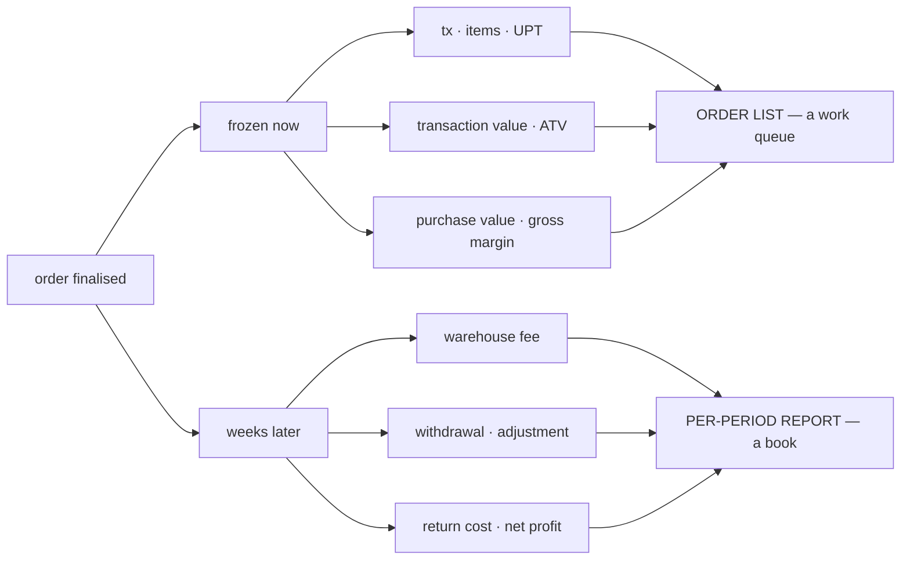
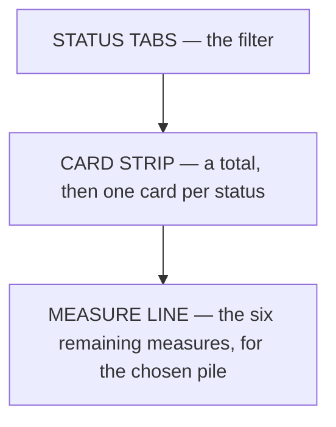
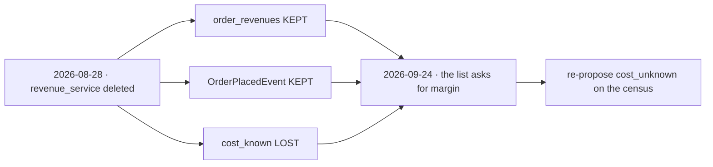
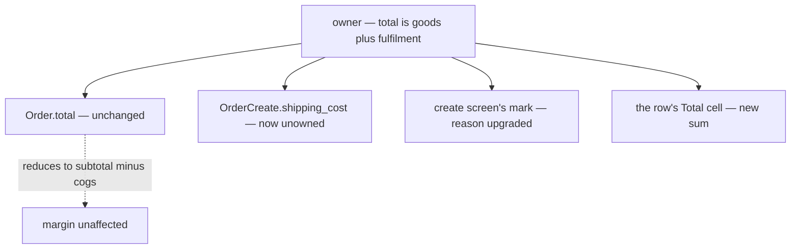
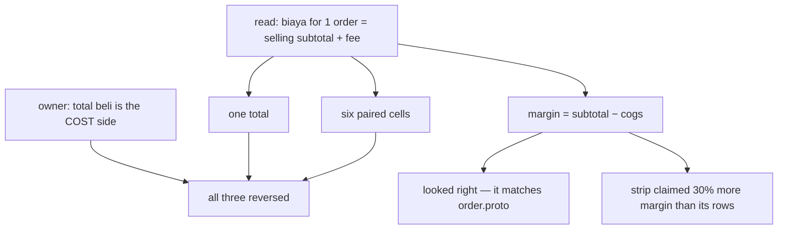

# Clarity — order `design.md`

The owner listed the fifteen figures the old system carried above its order list, and set the rule
for reading them: **by status first** — one status's figures when a status filter is on, a breakdown
per status when it is not.

This file is the response: which of the fifteen belong over a work queue, which move, and — the part
the owner asked for by name — **where the moved ones' facts live today**, so the next pass starts
from a map instead of from this conversation.

---

## Proposed Design

> **The SUMMARY strip is what this section designs.** The table's own columns are settled in
> [one-context-per-column-and-never-three-lines](design_decision.md#one-context-per-column-and-never-three-lines),
> and the status vocabulary in
> [the-warehouse-steps-are-not-order-statuses](../../business/order/context_decision.md#the-warehouse-steps-are-not-order-statuses).
> Neither is repeated here.


### The split, and why it falls there

Everything on the left is frozen the moment the order is finalised
([a-lines-money-is-frozen-at-finalize](../../business/order/context_decision.md#a-lines-money-is-frozen-at-finalize)).
Everything on the right arrives weeks later, from the marketplace. **Two clocks, two screens.**



A margin standing beside a live queue is already the furthest this should go. Putting a figure
there that is not true yet invites reading an estimate as money in the bank.

### The shape



The strip sits **below the status filter** and is **not a control**: no card navigates, filters or
selects, and **none is highlighted**. The tab above chooses the status and already says which pile
the line describes — the cards show every pile, identically, and the line under them carries the
chosen one.

A card is a **headline** — what the pile is worth, how many orders, whether it is earning. The other
measures live on the one line below it, which is the only part that changes when the tab does.

⚠ **Three shapes were tried and rejected, and the reasons are worth keeping** (2026-09-24):

| tried | why it went |
| --- | --- |
| a **table**, one row per status | this screen already ends in a table — a second grid of rows above it reads as orders you can open, and it spent the top of a work screen on forty-two numbers |
| **cards for "All", tiles when filtered** | the two states were different layouts, heights and information, so changing tab redrew the top of the screen instead of updating it |
| **pressable cards** that selected a status | two controls doing one job, directly above each other — the tab strip already selects a status |
| a **highlight** on the active status's card | the active tab sits directly above the strip and already names the pile, so the mark said it twice — and a highlight on something unpressable reads as a control that is broken |

**→ The rules that survive:** a summary above a list must not repeat the list's own shape · nothing
appears or disappears when the filter changes, only the numbers · **a summary is read, not
operated** — and anything that makes it look operable, a press target or a highlight, is the same
mistake in a different costume.

The seven measures, and how far each one is real:

| measure | today |
| --- | --- |
| tx | ✅ `OrderStatusCount.count` |
| transaction value | ✅ `OrderStatusCount.value` — **already on the wire and never read** |
| ATV | ✅ value ÷ tx, client-side |
| items · UPT | ⚠ sample — nothing counts lines server-side |
| purchase value · gross margin · % | ⚠ sample — the census sums `total` and nothing else |

### The contract this derives

```proto
message OrderStatusCount {
  OrderStatus status = 1;
  int64 count = 2;
  int64 value = 3;          // exists, unconsumed — Σ total
  int64 goods_value = 4;    // NEW — Σ subtotal, OVER THE PRICED ORDERS ONLY
  int64 cogs = 5;           // NEW — Σ cogs, over the same orders as goods_value
  int64 cost_unknown = 6;   // NEW — how many of `count` have no cost recorded
  int64 item_count = 7;     // NEW — Σ quantity
}
```

Three things this shape is load-bearing about:

1. **`margin = goods_value − cogs`, never `value − cogs`.** `total` includes `shipping_cost`, which
   is the platform's money
   ([an-order-records-no-shipping-cost](../../business/order/context_decision.md#an-order-records-no-shipping-cost)),
   so taking the margin off it overstates by the whole postage bill.
2. **Both sums cover the SAME population — the orders that carry a cost.** Summing every order's
   goods against only the priced orders' cost inflates the result by an unpriced order's entire
   selling price. Built the wrong way round first, one unpriced order in nine moved a 36% margin to
   48% and printed a status reading **100%**.
3. **`cost_unknown` is `cost_known` coming back**, under a name that says which way it counts. A
   `cogs` of 0 means the goods were never restocked through this system —
   *unknown*, not *free* (`order.proto`). Without the counter the margin reads high and nothing on
   screen says so.

`item_count` follows the precedent the sibling message already set —
`order_draft.proto`'s `item_count`, computed on every read *because the list deliberately returns no
lines*.

### The status tabs — the owner's eight, not the build's six

Decided 2026-09-24: the tabs carry the set from
[the-order-has-eight-statuses](../../business/order/context_decision.md#the-order-has-eight-statuses),
and the warehouse's steps fold into `processed`
([the-warehouse-steps-are-not-order-statuses](../../business/order/context_decision.md#the-warehouse-steps-are-not-order-statuses)).
The alternative — mirroring the six enum values the build happens to have — would put a vocabulary on
screen that the owner's own clarify already records as stale, and the screen would be rebuilt when
the migration lands.

| the owner's eight | what the contract has | on this screen |
| --- | --- | --- |
| `pending` | `PLACED` | a rename, costs nothing |
| `processed` | `CONFIRMED` + `PICKING` + `PACKED` (the fourth step, the handover, has no value) | **counts, cannot filter** — `OrderListFilter.status` takes one status. Selecting it offers the four steps as a filter |
| `shipped` | `SHIPPED` | ✅ |
| `cancel` | `CANCELLED` | a rename |
| `completed` · `problem` · `lost` · `return` | **nothing** | drawn, and every figure is unknown — never `0` |

⚠ **AN UNBACKED PILE IS UNKNOWN, NOT ZERO**, and that includes the COUNT. "0 orders are completed" is
a claim a contract with no `completed` in it cannot make — so those cards read `—` and say *not in the
contract yet*. Same rule as a `cogs` of 0, one level up.

One mark covers all of it (`statusSet`), because there is one cause: the enum has not migrated.

**`processed` gets a STEP FILTER under the tab**, because a count you cannot act on is half a feature:


| | |
| --- | --- |
| it appears only under `processed` | a "Packed" filter hanging over the Shipped tab filters something nobody is looking at |
| it carries **no counts** (owner) | a per-step count line was built and taken out — what a seller does with these is pick one, and the figures that matter about the pile are already the summary's |
| `to confirm` · `picking` · `packed` **really narrow the table** | each is a single enum value, so `OrderListFilter.status` can take it — unlike `processed` itself, which is three at once |
| `handed over` is **disabled** | it has no enum value at all: a control that provably cannot do its job should refuse, not sit there inert. ⚠ It is "handed over", not "ready to hand over" (owner) — the parcel has already changed hands |
| changing tab **forgets the step** | otherwise a filter stays set on a status it cannot apply to, invisibly |

⚠ **The summary does NOT follow the step filter**, and this is worth looking at rather than assuming:
narrowing to Picking leaves the card reading `4 tx` over a table of one row. The card describes the
PILE and the table shows ROWS — the same split the tab counts already have — but it is the kind of
thing a reader notices.

⚠ **The old eleven map onto the eight with three folds**, and the old system's own UI is evidence for
two of them:

| old | folds into |
| --- | --- |
| **diproses gudang** (an umbrella TAB over confirm · picking · packed · sudah diserahkan) | `processed` — the umbrella became the status, and its four steps became a filter under that tab |
| pengiriman | `shipped` — the transit itself belongs to the shipment |
| return processed · return accepted | `return` — the transit belongs to the return record |

---

## The measures that move — where each one's fact lives today

The note the owner asked for. **Four of the seven are not homeless; they are renamed.**

| measure | where the fact is today | state |
| --- | --- | --- |
| nilai penyesuaian | settlement's `marketplace_adjustment` + `system_adjustment`, and `SettlementMetric` aggregates both | ✅ **built**, on `/settlement/report` |
| *(the platform's own payout per order)* | settlement's `fund` — *"what actually arrived from the platform"* | ✅ **built** — ⚠ and **not** what the owner means by withdrawal, see below |
| *(take-rate)* | `OrderSettlementListResponse.total_initial_total` / `total_last_balance` | ✅ **built** |
| biaya gudang | a liability ledger row, `LIABILITY_SOURCE_TYPE_ORDER_FEE`, keyed `source_id = order id`. Rate = `LiabilityTerms.handling_fee` | ⚠ **recorded but unaskable** — `LiabilityLogListFilter` takes `counterparty_id` and nothing else, so no reader can fetch it per order ([balance Q9](../../business/balance/context_clarify.md#question)) |
| nilai withdrawal · % withdrawal | **nowhere.** Owner (2026-09-24): this is **wallet → bank**, a shop-level cash event naming no order — not settlement's `fund`. Settlement cannot hold it either: every entry there must name an order | ⛔ **no home** ([settlement Q1](../../business/settlement/context_clarify.md#question) · [architecture Q7](../architecture/context_clarify.md#question)) |
| nilai penyesuaian WD | nothing — there is no withdrawal entity to adjust | ⛔ follows the above |
| beban retur | nothing. `InventoryService.StockReturn` moves stock and carries no cost. `/returns` is sample data pending the return service | ⛔ **no home**, and the money of a return is already listed as owed in [order context clarify](../../business/order/context_clarify.md#question) |
| nilai profit | needs every row above it | ⛔ follows them |

⚠ **The on-screen note tracks this too** — `pages/orders/pending.ts`, so the screen says what it
cannot do without anybody reading this file.

---

# Contradiction

## statistics were deleted by decision, and are being resumed

**The example — two statements, and neither is wrong.**

> [revenue-service-is-removed-and-statistics-deferred](../../business/settlement/context_decision.md#revenue-service-is-removed-and-statistics-deferred)
> — Owner, 2026-08-28: *"can we remove revenue service ? for statistic, we develop later"*, then
> *"remove it now"*. `/revenue`, `/profit`, `revenueClient`, their nav items and two e2e specs were
> deleted.

> Owner, 2026-09-24: the order list carries purchase value, estimated margin and its percentage.

This is the owner changing their own mind, which is theirs to do. It is recorded because the
**deletion had costs that were accepted at the time and are now being paid back**, and the next
person should not rediscover them:

| given up then | what it costs now |
| --- | --- |
| `cost_known` | the marker separating a real zero cost from an unknown one — **re-proposed above as `cost_unknown`** |
| `expected_margin` frozen at order time | the margin is recomputed from `subtotal` and `cogs` on every read instead of frozen with the order |
| kept on purpose: `order_revenues` was **not dropped**, and `OrderPlacedEvent` still carries `revenue`, `cogs`, `shipping_cost`, `cost_known` | the history is still there to backfill from — this is what "we develop later" was protecting |

**→ Recommend:** resume, and take only the order list's half. The list needs three sums on a census
that already groups by status — not a service. The deferred thing was a *revenue service*, and
nothing here proposes bringing one back.



## the total was defined twice, and the proto holds the older one

**The example — two statements, and the contract is the one that is wrong.**

> `order.proto`: *"The frozen money (whole rupiah). subtotal = sum(line quantity × unit_price); total
> includes shipping_cost."*

> Owner, 2026-09-28: *"subtotal + ongkir kurang tepat, pokok biaya yang dibutuhkan untuk 1 order
> entah dari produk + biaya lain seperti biaya gudang, ongkir harusnya yang set adalah gudang"*.

One decision, **four sites** — grouped by cause rather than listed as four findings:

| site | what it said | now |
| --- | --- | --- |
| `Order.total` | `subtotal + shipping_cost` | still the contract, and the row no longer reads it |
| `OrderCreateRequest.shipping_cost` | the seller supplies it | it is not the seller's to supply |
| order-create's `shippingCost` mark | *"nothing prices a shipment yet"* | the reason is stronger — not the seller's to set |
| the row's money cell | was going to print `total` | prints goods plus fulfilment fees |

**→ Recommend:** leave `Order.total` alone until the ledger question is settled, and keep the
divergence in ONE place — `TotalCell` — rather than recomputing it per screen. The moment two screens
compute "the total" from different fields, both are correct and they disagree.

⚠ **The margin does NOT ripple.** `margin = total − cogs − shipping_cost` with
`total = subtotal + shipping_cost` reduces to `subtotal − cogs`, which is what the row and the strip
already compute. Checked, not assumed.



## three decisions were recorded from a half-read instruction, and all three reversed

**The example — what was written, and what the owner actually said next.**

> Recorded 2026-09-28, from *"pokok biaya yang dibutuhkan untuk 1 order entah dari produk + biaya
> seperti biaya gudang"*: **`an-order-total-is-goods-plus-fulfilment`** — the row's total is the
> SELLING subtotal plus the warehouse fee.

> Owner, minutes later: *"ada total dan margin, bukan, aku jelaskan sistem lama dulu — total dari beli
> yang dimaksud adalah subtotal produk + biaya, dan total dari mp; margin adalah harga mp − total
> beli"*.

**One cause, three reversals.** *"Biaya yang dibutuhkan untuk 1 order"* was read as a NEW sum built on
our selling price, when it was the old system's **total beli** — the cost side. Everything derived from
that reading fell with it:

| reversed | was | is |
| --- | --- | --- |
| [the-row-shows-total-beli-and-total-mp](design_decision.md#the-row-shows-total-beli-and-total-mp) | one total: `subtotal` + fee | **two**: beli (`cogs` + fee) and MP |
| [the-margin-is-mp-minus-total-beli](design_decision.md#the-margin-is-mp-minus-total-beli) | `subtotal − cogs`, % of `subtotal` | `MP − beli`, % of MP |
| [one-context-per-column-and-never-three-lines](design_decision.md#one-context-per-column-and-never-three-lines) | six paired cells | one context per column, never three lines |

**→ Recommend:** when an instruction names a figure from the old system, **ask which fields it is
made of before building on it** — the words *total*, *beli* and *margin* each name two different sums
here, and a plausible reading produced four screens of arithmetic that all had to come back out. The
cheap check is one line in the clarify file, not a rebuild.

⚠ **What it cost beyond the rewrite.** The wrong margin was *"goods minus cost"*, which happens to be
the proto's own `margin = total − cogs − shipping_cost` — so it looked CORROBORATED by the contract
while being the wrong question. Agreement with an existing field is not evidence that the field answers
what was asked.

⚠ **And it left a real bug behind, found by rendering rather than by reading.** The new margin needs
two facts, so the strip's `cost_unknown` marker no longer covered its own refusals: the summary claimed
**Rp 780.384** of margin where the rows beneath it summed to **Rp 599.980**, because it credited an
order (#108) with revenue the row itself refuses to guess. Renamed to `margin_unknown` and fixed.




---

## Question

1. **Does the per-period report extend `/settlement/report`, or become a second screen?** That page
   ships today with the period grains, the shop/team/user groupings and four of the moved measures
   already on it.
   **→ Recommend extending it.** Two screens would compute "sales" from different sources — orders
   versus the settlement ledger — and both answers would be correct and different, which is a
   sentence somebody has to write on the screen forever.
   ⚠ Its three Analytic RPCs are already audited 🔴 HEAVY and the fix is not applied.

2. **Where does a wallet → bank withdrawal live?** Now that the sense is settled, the home is not.
   Already open in two files; this is a third screen waiting on it.
   **→ Recommend `order_service`** — the wallet is fed by that shop's orders and the withdrawal is
   reconciled against them. That is the standing recommendation in both other files, unchanged.

3. **Can one order's warehouse fee be read at all?** The fee is posted and attributable and no filter
   reaches it, so the list cannot show it even as a column.
   **→ Recommend one `order_id` filter on `LiabilityLogListFilter`** — never a second copy of the fee
   on the order. Same recommendation as [balance Q9](../../business/balance/context_clarify.md#question).

4. **Is "sudah diserahkan" a status, or the absence of one?** It is the step the owner folded into
   `processed`, and it is the step three of the row actions hang on — Jadikan Dikirim, Retur Barang,
   Selesaikan Order. It has no enum value, so the menu gates on `PACKED` instead and offers them one
   step early.
   **→ Recommend a `HANDED_OVER` value** in the same migration that adds the four missing statuses.
   It is the boundary between "we are still holding it" and "the courier is", which is the moment
   responsibility moves — the only reason the four steps of `processed` are distinguishable at all.
   ⚠ The alternative, gating on the presence of a tracking number, needs a field that also does not
   exist.

5. **Is "Edit Resi" the seller's or the warehouse's?** The ongkir is now the warehouse's to set, and
   a tracking number is issued at handover — by the building. But the old table put Edit Resi on
   `created` and `process`, where the parcel has not moved and a CS is the one pasting the number
   off the marketplace.
   **→ Recommend both, with different sources:** the seller pastes a marketplace-issued number before
   handover, the warehouse writes the courier's at handover. One field, two moments.
   ⚠ It is academic until there IS a field — `shipping_code` is the carrier and `OrderReceipt` is the
   attached file; the printed number is nowhere.

6. **Can a root reader see the list at all?** The owner decided the Team column appears for a reader
   above selling level — *"root bisa liat team"*. `scopedOrders` is `(team_id = ? OR warehouse_id = ?)`
   with no root bypass, so a reader in the root team matches neither and gets an empty table. The
   column is built and correct; there would be no rows under it.
   **→ Recommend the bypass live where every other one does** — ROOT/ADMIN in team 1 already skip
   scope checks in the access interceptor, so this is that same rule reaching the query, not a new
   policy. ⚠ It is a server change and nothing on the screen can stand in for it.

7. **Does a date on a row show the year, and whose clock formats it?** A filtered row now carries
   three timestamps in one cell, each rendered `formatUnixDateTime` — *"Sep 27, 2026, 03:18 PM"* on
   this machine. The format follows the VIEWER's operating system, so the same screen reads
   `27 Sep 2026, 15.18` for one person and `Sep 27, 2026, 03:18 PM` for another.
   **→ Recommend a fixed locale and a compact table form:** `27 Sep 15:18`, with the year only when
   it is not the current one. Three of those fit where three of the current form do not.
   ⚠ This is app-wide — `formatUnixDateTime` is shared — so it is asked rather than changed here.

8. **What is the revenue of an order the marketplace never priced?** The margin is measured against
   `harga MP`, and two kinds of order have none: a PHONE order (no storefront took anything) and a
   marketplace order nobody recorded a figure for (fixture 108). Both currently show an em-dash for
   beli, margin and percentage — so a real sale reads as unmeasured.
   **→ Recommend splitting them:** a phone order's revenue is our own `subtotal` (there is no platform
   in the middle, so our quote IS the sale), while an unrecorded marketplace figure stays UNKNOWN —
   guessing there would silently substitute our quote for the platform's payment, which is the one
   substitution settlement exists to prevent.
   ⚠ Today the code refuses both, which is honest and leaves phone orders out of every margin.

9. **Where do the deadline's urgency boundaries come from?** The column bands at 6 hours ("not for the
   next shift") and 24 hours ("today's problem"), and both are my guess.
   **→ Recommend they come from the CHANNEL, not from a constant:** a same-day courier and a regular
   one do not deserve the same amber. That needs a lead time on `ShipmentChannel`, which it has no
   field for either.
   ⚠ And the deadline itself has no field anywhere — see the `deadline` mark on the column.
