# Decisions — order `design.md`

> ⚠ **EVERY DECISION BELOW IS ABOUT THE SELLING TEAM'S ORDER LIST AND ORDER DETAIL.** The warehouse reads `/orders`
> from the other end and keeps the screen it had — see
> [the-two-ends-are-two-screens](#the-two-ends-are-two-screens). Nothing here has been applied to it,
> and the owner has not designed it yet.

| decision | what it settles |
| --- | --- |
| [status-colours-are-carried-over-verbatim](#status-colours-are-carried-over-verbatim) | every status keeps the hue it had, collisions included |
| [one-context-per-column-and-never-three-lines](../../business/frontend/context_decision.md#one-context-per-column-and-never-three-lines) | pairing is only for one fact read twice — it REPLACES the six-paired-cells decision |
| [the-row-shows-total-beli-and-total-mp](#the-row-shows-total-beli-and-total-mp) | two totals: what it cost us, and what the platform paid — it REPLACES an-order-total-is-goods-plus-fulfilment |
| [the-margin-is-mp-minus-total-beli](#the-margin-is-mp-minus-total-beli) | margin and its percentage are both measured against the MARKETPLACE price |
| [the-ongkir-is-the-warehouses-to-set](#the-ongkir-is-the-warehouses-to-set) | shipping is priced by the building that ships it, so it is absent from the create screen |
| [every-date-gets-its-own-column](#every-date-gets-its-own-column) | three dates, three columns — it REPLACES two-dates-and-two-totals-with-ours-leading |
| [a-filtered-status-shows-its-own-date](#a-filtered-status-shows-its-own-date) | the third date appears only under the tab it answers |
| [harga-beli-team-and-gudang-are-on-the-row](#harga-beli-team-and-gudang-are-on-the-row) | all three earn a place, none of them a column of its own |
| [the-action-menu-is-a-table-keyed-by-status](#the-action-menu-is-a-table-keyed-by-status) | what you can do to an order, per state, in one place |
| [a-deadline-is-loud-or-it-is-nothing](#a-deadline-is-loud-or-it-is-nothing) | four urgency bands, and an overdue order tints its whole row |
| [the-preview-became-the-order-list](#the-preview-became-the-order-list) | a seller's `/orders` IS this screen now — the preview page is gone |
| [the-two-ends-are-two-screens](#the-two-ends-are-two-screens) | the warehouse keeps its old list — almost nothing on the seller's row is a fact a picker acts on |
| [the-order-detail-is-one-page-of-sections](#the-order-detail-is-one-page-of-sections) | the detail is one page of sections with a scrolling left nav — not three tabs |
| [the-order-detail-lines-are-priced-at-harga-beli](#the-order-detail-lines-are-priced-at-harga-beli) | the item table shows what we PAID, so the perincian adds up to the list's figures |
| [the-detail-margin-is-mp-minus-system](#the-detail-margin-is-mp-minus-system) | margin = total MP − total sistem, the list's formula read from the detail |
| [the-detail-preview-became-the-order-detail](#the-detail-preview-became-the-order-detail) | a seller's `/orders/:id` IS the approved page now — and it keeps the two wired features the preview lacked |
| [settlement-replaces-withdrawal-on-the-order](#settlement-replaces-withdrawal-on-the-order) | the order's money-back section IS the settlement ledger; withdrawals stay a shop-level question |
| [the-phone-header-is-one-row](../../business/frontend/context_decision.md#the-phone-header-is-one-row) | on a phone the sticky block is the number, the stage and `⋯` — plus the section chips |
| [a-phone-reads-each-line-as-a-block](../../business/frontend/context_decision.md#a-phone-reads-each-line-as-a-block) | the item table becomes one block per line below `md` |
| [the-draft-list-is-the-drafts-tab](#the-draft-list-is-the-drafts-tab) | `/order-drafts` wears the seller list's shell and row grammar, with only the columns a draft can fill |
| [the-draft-summary-is-three-cards](#the-draft-summary-is-three-cards) | total and oldest are real; ready counts this page only, says so, and carries a ⚠ |
| [the-draft-cards-are-the-order-list-cards](#the-draft-cards-are-the-order-list-cards) | one `SummaryCard` and one grid for both tabs, so a card is the same shape and size on each |
| [the-summary-follows-the-tab](#the-summary-follows-the-tab) | All Status shows the piles; a status tab shows its own figures as cards; the measure line is gone. The cards fill the row again |
| [a-summary-card-is-at-most-a-fifth](../../business/frontend/context_decision.md#a-summary-card-is-at-most-a-fifth) | cards fill the row but never exceed 1/5 of it on a large screen — 1/4, 1/3, 1/2 as it narrows |
| [a-phone-filters-from-a-sheet](../../business/frontend/context_decision.md#a-phone-filters-from-a-sheet) | on a phone the search stays in the row; every other filter is in a bottom sheet behind a counted Filter button |
| [the-draft-keeps-its-own-page](#the-draft-keeps-its-own-page) | `/order-drafts/:id` stays the separate draft page — opening the draft in the order form was tried and reverted |
| [the-draft-page-wears-the-order-form](#the-draft-page-wears-the-order-form) | the draft page uses the create form's cards and rail; save in any state, Promote as strict as Create |
| [a-draft-row-maps-to-a-product-a-bundle-or-a-split](#a-draft-row-maps-to-a-product-a-bundle-or-a-split) | each scraped row maps to one product, one bundle, or several products — a split suggests a bundle |
| [the-draft-sell-price-starts-from-the-rows](#the-draft-sell-price-starts-from-the-rows) | the sell price starts as Σ the rows' platform prices and can be typed over, down to 0 |
| [the-listing-is-information-the-mapping-sets-the-count](#the-listing-is-information-the-mapping-sets-the-count) | a row's scraped quantity and price are shown, not edited; the count is set on the mapping, and a different one is flagged |
| [the-draft-preview-became-the-draft-page](#the-draft-preview-became-the-draft-page) | `/order-drafts/:id` IS the draft page in the order form's clothes now — the built page is gone |
| [the-warehouse-row-is-the-old-systems-columns](#the-warehouse-row-is-the-old-systems-columns) | the warehouse list's row: created by, marketplace shop, AWB, qty, status, date, MP date — the deadline replaces the MP date's "ago" when there is one |
| [the-warehouse-tabs-are-the-processed-steps](#the-warehouse-tabs-are-the-processed-steps) | the warehouse's tabs are Perlu konfirmasi, the four steps of Diproses and Semua — not the order's statuses; a row's badge says its tab's word |
| [the-confirmed-step-reads-dikonfirmasi](#the-confirmed-step-reads-dikonfirmasi) | the CONFIRMED step is named "Dikonfirmasi", not "Perlu konfirmasi" |
| [the-warehouse-filters-by-team-marketplace-and-courier](#the-warehouse-filters-by-team-marketplace-and-courier) | search, date, seller team, marketplace, courier — and the shipment state only where parcels have been handed over |
| [a-warehouse-step-moves-by-the-old-systems-table](#a-warehouse-step-moves-by-the-old-systems-table) | the old system's transition table: skips forward allowed, back only to Dikonfirmasi and with a reason |
| [scanning-is-the-crews-hands](#scanning-is-the-crews-hands) | three scans — handover, find a parcel, validate the items — plus selection, bulk actions, labels and export |
| [the-bulk-actions-are-always-on-screen](#the-bulk-actions-are-always-on-screen) | the action bar shows from the start; tick-only actions are off until a tick, and Export takes the filtered list when nothing is ticked |

---

## status-colours-are-carried-over-verbatim

> Owner, in chat (2026-09-24): the old system's thirteen statuses with their colours, then — on each
> of the three collisions raised — *keep it*.

**The verdict.** The eight statuses take the old system's hues, folded the same way the statuses
were. Nothing was re-picked.

| status | hue | from |
| --- | --- | --- |
| `pending` | **amber** | `created` — Menunggu Diproses |
| `processed` | **sky** | `process` — Diproses Gudang, the umbrella |
| `shipped` | **blue** | `courrier_shipped` — Dikirim |
| `completed` | **green** | `completed` — Selesai |
| `problem` | **purple** | `problem` — Bermasalah |
| `lost` | **purple** | `return_problem` — Lost |
| `return` | **pink** | `return_completed` — Retur Diterima |
| `cancel` | **rose** | `cancel` — Batal |

**Why verbatim.** People have been reading these colours for years. A fresh palette would spend that
recognition to buy consistency nobody asked for.

### The three collisions, raised and accepted

Recorded so they are not "fixed" later by somebody who sees them as mistakes:

| | accepted because |
| --- | --- |
| `problem` and `lost` are **the same purple** | both say *something is not right*; the label carries which. ⚠ Two badges side by side in a table are not distinguishable by colour alone |
| `cancel` is **rose — the app's own accent**, worn by every primary button | the tone is shared, the step is not: a badge sits at `rose.100`, a button at `rose.600`. ⚠ A Cancelled badge beside a primary button reads as one family |
| `processed` (sky) and `shipped` (blue) are **adjacent pale blues** | they ARE adjacent — in the warehouse, then on the road. The same reasoning `OrderStatusBadge` already uses for picking and packed sharing orange |

### What had to change in the theme to write this honestly

`amber`, `sky`, `indigo` and `rose` were reachable only through `warning`, `info`, `primary` and
`brand`. CLAUDE.md says a status is written as a **hue** (an order's lifecycle step is its own example
of categorical colour) and never as a **role** — but the only spelling available was the role, so
colouring a status amber meant writing `warning`, and the day the warning tone moved a status nobody
thought was a warning would have moved with it.

The four ramps are now registered under their own names in
[theme.ts](../../../frontend/src/theme.ts) as well. Same ramps, no new colours —
`colorPalette="amber"` is a statement about the hue and `colorPalette="warning"` one about the role,
and they can no longer be confused.

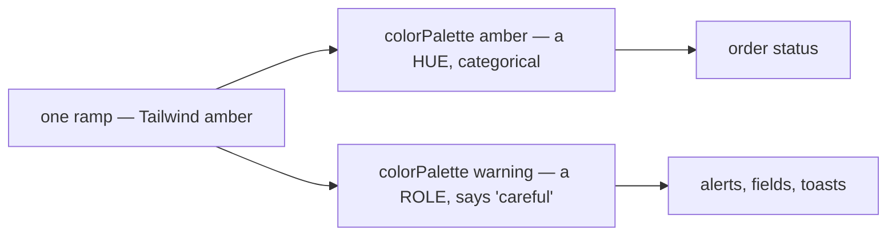

---

## one-context-per-column-and-never-three-lines

➡ **Moved** to [frontend/context_decision.md](../../business/frontend/context_decision.md#one-context-per-column-and-never-three-lines) — a rule for every screen (owner, 2026-10-02: screen decisions live in `docs/business/frontend/`).

## the-row-shows-total-beli-and-total-mp

> Owner, in chat (2026-09-28): *"sistem lama total itu ada 2, total dari beli yang dimaksud adalah
> subtotal produk + biaya dan total dari mp"*.

⚠ **This REPLACES `an-order-total-is-goods-plus-fulfilment`.** That one read the earlier instruction
as *selling subtotal + fee* — a third figure that is neither of the owner's two totals, and the one a
margin cannot be taken from. There are **two** totals and they are opposite sides of the trade:

| | | in the contract |
| --- | --- | --- |
| **total beli** | `subtotal produk` (what the goods COST) `+ biaya` (the warehouse's fee) | `cogs` + a fee nothing carries |
| **total MP** | what the buyer paid the platform | `marketplace_total` |

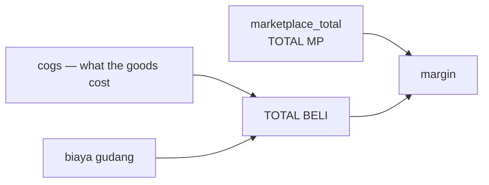

⚠ **`Order.total` is on neither side.** It is `subtotal + shipping_cost` — our own quote plus postage
— and the row never reads it. See [the contradiction](design_clarify.md#contradiction) for the four
sites that decision touched.

⚠ **The `biaya` half is a SAMPLE.** Nothing carries a warehouse fee per order: it is a liability row
keyed by `source_id = order id`, and `LiabilityLogListFilter` takes a counterparty and nothing else
(balance Q9). The cost half is real `cogs`; the fee is invented and the column carries a mark.

⚠ **A `cogs` of 0 makes the whole cell refuse.** It is UNKNOWN, not free (`order.proto`), so total
beli is an em-dash rather than a fee-only figure that would read as a suspiciously cheap order.

## the-margin-is-mp-minus-total-beli

> Owner, same message: *"persentase adalah dari margin ke harga mp, margin adalah harga mp - total
> beli"*.

```
margin     = harga MP − total beli
persentase = margin ÷ harga MP
```

**Three things follow, and each is a trap if it is missed:**

| | |
| --- | --- |
| the revenue is the PLATFORM's figure, not ours | dividing by our `subtotal` would flatter every discounted order |
| the fee is INSIDE the cost | leaving it out overstates every order by the whole warehouse bill |
| the percentage is of the REVENUE | `margin ÷ beli` is a mark-up — a different number that reads the same |

⚠ **It needs TWO facts, so it has TWO ways to be unknown** — and that broke the summary strip the
first time it was rendered. An order missing either one is unmeasurable, and the two absences are
unrelated: fixture 107 has no cost, 108 has no marketplace figure.

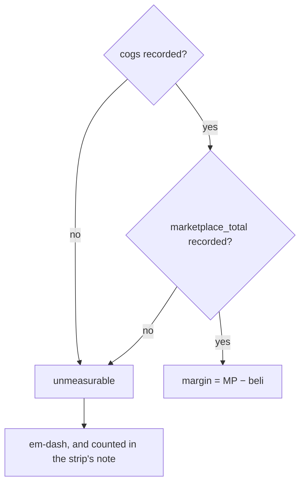

**What it changed, beyond the cell:**

| | |
| --- | --- |
| the strip's unknown marker | `cost_unknown` → **`margin_unknown`**: counting only the cost left the strip claiming **Rp 780.384** where the rows beneath summed to **Rp 599.980** |
| the census columns the strip needs | Σ `subtotal` → **Σ `marketplace_total`**, plus **Σ fees** |
| *nilai belanja* on the strip | now total beli (cost + fees), so the strip and the Beli column mean the same thing by the same word |

⚠ **It contradicts the proto's own margin** — `margin = total − cogs − shipping_cost`, which measures
our quote against our cost and never looks at what the platform paid. One formula lives in
`features/orders/margin.ts` and both the strip and the row read it, so they cannot disagree.

⚠ **The strip still lands ~11% above the sum of its rows, and that is now a documented limit rather
than a bug to tune.** The census gives the sample Σ `total` and a count, so an excluded order can only
be charged the pile's average size — and the excluded one here (#108) is the largest of the nine. Only
the server knows the size of what it left out, which is the argument for making these columns real.

## the-ongkir-is-the-warehouses-to-set

> Owner, same message: *"ongkir harusnya yang set adalah gudang, jadi di tampilan create tidak ada"*.

Shipping is priced by the building that ships it. Two consequences, both already visible:

1. **The order-create screen has no shipping field.** Its `shippingCost` pending entry was reasoned
   as *"nothing prices a shipment yet"*; the real reason is stronger — **it is not the seller's to
   price**, so the field would not belong there even once a courier catalogue exists.
2. **"Jadikan Dikirim" is the warehouse's action.** `OrderShip` takes the WAREHOUSE's team id and the
   handler finds the order by `(order_id, warehouse_id)`, so a seller pressing it calls on a team it
   is not a member of. Handing the parcel over and pricing its shipment are one side of the job.

## every-date-gets-its-own-column

> Owner, in chat (2026-09-28): *"tanggal bedakan saja columnnya"*.

⚠ **This REPLACES `two-dates-and-two-totals-with-ours-leading`.** The dates and the totals were stacked
two-to-a-cell with ours leading; three dates in one cell was the three-line row the owner rejected, and
each date answers a different question anyway.

| column | what it answers | real? |
| --- | --- | --- |
| **Dibuat** | when WE wrote the row — `created_at_unix`, and `oleh <nama>` under it | the date yes, the author no |
| **Tgl MP** | when the buyer ordered on the storefront | no field at all |
| **Tgl `<status>`** | when it entered the status being filtered | `OrderEvent` has the shape, the list never sends it |

**`oleh` stays paired with the created date** because it is the same event: who wrote it down, and when.
That is one fact read twice, which is exactly what the pairing rule allows.

⚠ **THE TWO ABSENCES ARE DIFFERENT, and the row must not conflate them:**

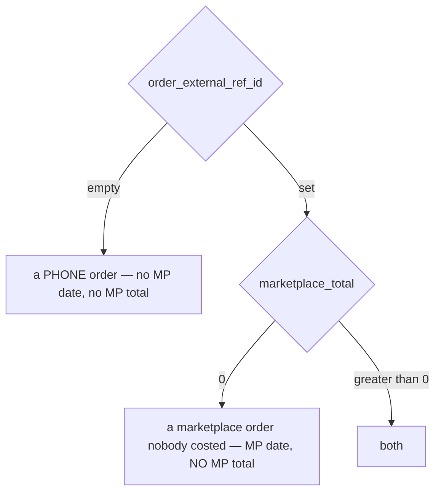

An empty reference means the order never came from a storefront; a `marketplace_total` of 0 means only
that nobody wrote down what the storefront took (`order.proto` — *0 = not recorded, not "sold for
nothing"*). Keying the DATE off the amount would hide a real order date on the strength of a missing
figure; fixture 108 is that case, kept deliberately.

## a-filtered-status-shows-its-own-date

> Owner: *"jika filter status aktif, akan ada tanggal sesuai perubannya kapan, misal saja dikirim
> selain 2 tanggal di atas ada juga tanggal dikirim"*.

A third line appears in the Dipesan cell **only while a status tab is selected**, reading
`<status> <date>`. "When did this ship" is a question you only ask while looking at shipped orders,
so carrying it on every tab would be a mostly-blank column.

⚠ **The shape exists and the list cannot read it.** `OrderEvent` is already `kind` + `at_unix`,
which is exactly this — but events are populated by `OrderDetail` only. The fix is not a new field,
it is the list carrying the one event the active filter asks about.

## harga-beli-team-and-gudang-are-on-the-row

> Owner, in chat (2026-09-27): *"harga beli, team dan gudang? … 3nya diputuskan untuk ada"*.

All three are on the row, and none of them took a column of its own:

| fact | where it landed |
| --- | --- |
| harga beli | headline of the **Beli · Margin** cell — it IS total beli (cost + fees); the margin and the percent are its second line |
| team | the **first cell's headline** for any reader who is not a SELLING team — a warehouse, root or admin. Only a selling team owns shops, so only there does a shop name tell two rows apart |
| gudang | **its own column**, withheld when it is the reader's own building |

⚠ **A crew does not need its own name twenty times.** A warehouse's rows all ship from itself, so the
whole Gudang COLUMN is absent for that reader — the same rule that puts Tim in the Toko position
there.

⚠ **The row's owner and the shop FILTER are two questions, and they had one answer.** The filter is
offered to anyone but a warehouse (a deliberate earlier call); the COLUMN now follows "is this a
selling team", so root and admin get Team instead of a Shop column that would be blank on every row.

⚠ **"root bisa liat team" is NOT BUILDABLE TODAY.** `scopedOrders` is
`(team_id = ? OR warehouse_id = ?)` with no root bypass, so a reader in the root team matches neither
and sees an empty list — the column would be correct and the table empty. That is a server change,
not a column; it is open in the clarify file.

## the-action-menu-is-a-table-keyed-by-status

> Owner, in chat (2026-09-28) — the per-status action list, given in the OLD status names.

The menu is a rendering of one table, so "what can I do to a returned order" is read rather than
traced through branches. Mapped onto the decided eight:

| stage | actions | built? |
| --- | --- | --- |
| pending | Batalkan Order · Edit Resi | cancel is real |
| processed | Edit Resi — **and at the handover step** — Jadikan Dikirim · Retur Barang · Selesaikan Order | ship is real, warehouse only |
| shipped | Retur Barang · Selesaikan Order | neither |
| completed | Edit Withdrawal | no |
| problem | Selesaikan Sengketa | no |
| return | Jadikan Lost · Selesaikan Order (only when `wd_total` is above zero) | neither, and no `wd_total` |
| lost · cancel | — | the owner listed none, and both are ends |

**Two of the owner's rows fold into one stage**, and this is the only judgement call:

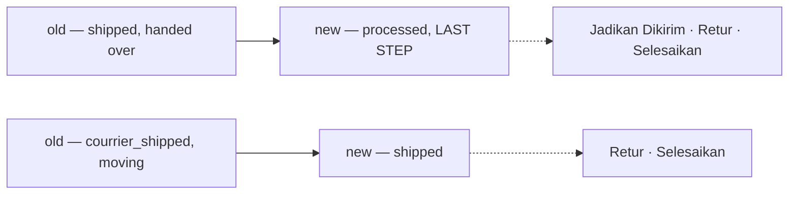

⚠ **The step it needs has no enum value**, so the gate falls back to `PACKED` — the last
representable step before handover. A packed order that has not yet been handed to the courier is
offered "Jadikan Dikirim" one step early until the enum lands. Same cause as the four dead tabs, so
it carries the same mark rather than a new one.

⚠ **Six of the nine items do nothing yet**, and each says so twice: the ⚠ on the item, and a toast
naming the reason when it is pressed. A menu item that silently does nothing reads as a broken app
rather than an unfinished one.

## a-deadline-is-loud-or-it-is-nothing

> Owner, in chat (2026-09-28): *"sama jika order punya deadline aku ingin dia mencolok"*.

A ship-by deadline is not a date to look up — it is the app telling somebody to act, so it is the one
thing on this table allowed to shout.

| band | when | how it reads |
| --- | --- | --- |
| **overdue** | past | SOLID error badge, **and the whole row is tinted** |
| **urgent** | within 6 hours | SOLID warning badge |
| **today** | within 24 hours | quiet warning badge |
| **later** | beyond that | plain text, in the gray of any other date |

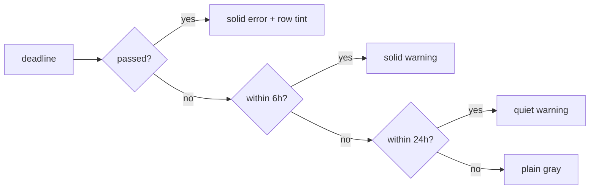

- **The row tint is the only whole-row colour on this table**, which is what keeps it meaning one
  specific thing. A badge in one column is visible; a tinted row is unmissable while scanning.
- **The colour is a ROLE, never a hue** — `error` / `warning`, so a palette change reaches it. This is
  also the one cell where those roles are earned: every other cell states a fact, this one raises an
  alarm.
- **It reads in hours under a day and days above it.** "4 hari lagi" is what somebody plans around;
  "97 jam lagi" is a number they would have to divide first.
- **A shipped, completed or cancelled order shows nothing.** The clock stops when the parcel leaves,
  and a column that stayed red on orders already out of the building is a column people learn to
  ignore.

⚠ **NOTHING CARRIES A DEADLINE.** Not `Order`, not `ShipmentChannel` (no lead time), and not
`OrderEvent`, which records what HAPPENED rather than what is due. The real thing this stands in for is
the marketplace's own ship-by clock, which is per storefront — so the field it needs is a deadline ON
the order, written when the order is imported.

⚠ **The two boundaries are a GUESS and should be the owner's** — 6 hours as "not for the next shift",
24 as "today's problem". They are named in one place (`deadlineMock`) so there is a single line to
change.

## the-preview-became-the-order-list

> Owner, in chat (2026-09-29): *"sudah bisa diterapkan ke order list aslinya"*.

The screen was built as `pages/orders-next/`, reachable only from Storybook, so it could be argued over
without touching the running app. It is now **`pages/orders/SellerOrders.tsx`**, on the `/orders` route
for a selling team, and the preview directory is deleted.

⚠ **A WAREHOUSE STILL GETS THE OLD LIST** — see [the-two-ends-are-two-screens](#the-two-ends-are-two-screens).

| | |
| --- | --- |
| moved | the page as `SellerOrders.tsx` · `components/*` · `pending.ts` · `stages.ts` · `rowActions.ts` · the three mocks |
| kept | the old page as `WarehouseOrders.tsx`, with its `OrderStatRow` — untouched |
| new | `index.tsx`, a picker: team type chooses which |

⚠ **THE OLD SCREEN'S TESTS CAME ACROSS, NOT ITS CODE.** Twenty-five `play()` rules already described
what an order list must do — a warehouse sees another team's order, a tab narrows the table but never
the counts, an empty search says *nothing matched* rather than *no orders*, the drafts tab leaves. Those
are facts about the screen, not about its markup, so they were re-pointed at the new one rather than
rewritten. Eight failed on the move and each failure named a real change:

| failed because | now |
| --- | --- |
| `orders-stat-*` | the strip is `order-summary-row-<stage>` |
| `orders-tab-count-placed` · `orders-tab-packed` · `orders-tab-cancelled` | the owner's eight: `pending` · `processed` · `cancel` |
| `orders-clear-filters` | the shared FilterBar's own `orders-filters-clear` |
| clicking the customer's name to open a row | Penerima is off the row — it clicks the date cell |

⚠ **AND ONE FAILURE WAS NOT A RENAME.** *"The status tab narrows to one stage of the crew's work"*
asserted that choosing Diproses hides the pending orders. It does not, and cannot: the owner folded four
steps into one status while `OrderListFilter.status` takes exactly one enum value. That became
`DiprosesCountsButOnlyAStepCanNarrow` — **the `statusSet` mark written as an assertion**, so the day a
single `PROCESSED` value lands it fails and the step filter's reason for existing is re-read.

⚠ It was written on the warehouse's stories and MOVED to the seller's when the warehouse list reverted.
Worth saying plainly: restoring a file quietly takes its tests with it, and this one was the only thing
holding that gap down.

⚠ **THE PENDING MARKS CAME WITH IT.** Fourteen entries in `pages/orders/pending.ts`, on a screen people
now actually use — which is the point: the marks exist so a live screen can say what it cannot do yet
rather than quietly lying about it.

## the-two-ends-are-two-screens

> Owner, in chat (2026-09-29): *"warehouse order list page kembalikan, aku belum mau menyentuh itu,
> konteksnya beda soalnya"*.

`/orders` is read from both ends (#151) and was one screen with a few columns swapped. It is now two,
chosen by team type in `pages/orders/index.tsx`.

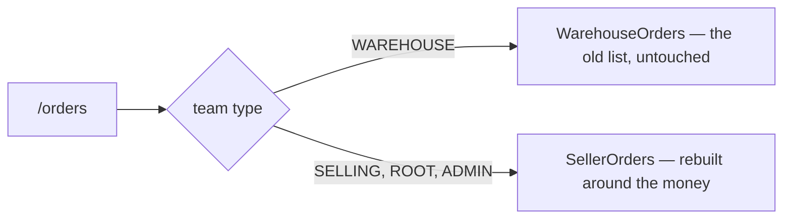

**And the context really is different**, which is why this is a split and not a flag:

| the seller's row | the warehouse's job |
| --- | --- |
| ID Order · Tgl MP · Total MP · Beli · Margin | what to pick, from which shelf, by when |
| what a shop is owed and what it earned | what a crew is holding |

⚠ **A WAREHOUSE SHOWING ANOTHER TEAM'S MARGIN IS SHOWING IT SOMEBODY ELSE'S BUSINESS.** The list already
spans sellers — a building sees orders from every team that ships through it — so the money columns are
not merely unhelpful there, they are a disclosure.

⚠ **IT IS A JS BRANCH, NOT CSS.** Same rule as the app shell (`layouts/Layout.tsx`): rendering both and
hiding one would mount two tables, two sets of queries and two of every `data-testid` the e2e reach for.

⚠ **THE TEAM TYPE, NOT A ROLE.** Who you are inside a team does not change which list this is — a
warehouse admin and a warehouse picker both read the building's queue. Root and admin fall through to
the seller's screen, which is where the Tim column lives.

⚠ **THE WAREHOUSE'S SCREEN IS NOT DESIGNED YET, only preserved.** It still carries the old stat row and
the old three columns; nothing on this page has been asked of it.

## the-order-detail-is-one-page-of-sections

> Owner, in chat (2026-09-29): *"oke detail aku setujui"* — approving the preview
> `Pages/Order/OrderDetailNextPage` after a round of changes.

The order detail is **one page of sections**, not the built page's three tabs, with a left navigation
that scrolls to each. The question it answers — *what happened with this order* — is usually answered by
two sections at once, and tabs put exactly those pairs on opposite sides of a click.

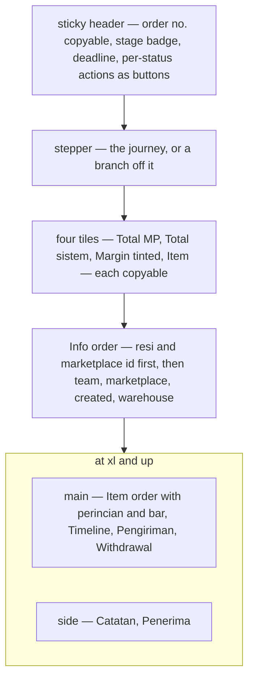

| part | the spec |
| --- | --- |
| **header** (sticky, one line) | `Pesanan #id` with the number copyable · stage badge · deadline badge · the list's per-status actions as **buttons**, folding into `⋯` only past three (never a `⋯` of one; destructive ones fold first) |
| **navigation** | left column on a desktop, chips inside the sticky block on a phone; short labels (`Withdrawal`), the card keeps its full title; the same icon on the card and the nav item; click scrolls the section just below the header; scrolling lights the section being read — in two columns, the main column only |
| **stepper** (not sticky) | Menunggu → Diproses → Dikirim → Selesai; an off-journey status is a branch in its own hue, cancel from Menunggu, the rest from Dikirim |
| **tiles** | Total MP · Total sistem · Margin (success/error by sign) · Item; each copies a plain number (`245000`, not `Rp 245.000`) |
| **Info order** | full width; the resi (courier + number) and the marketplace order id first and a size larger, both copyable; a return resi only when a return exists |
| **Catatan** | its own section: a list, newest first, of `system` and `user` notes; user notes editable, system notes never; `Order.note` is the first user note |
| **Item order** | per line: the marketplace's own title (as on the draft) above our product — image, name, SKU — then team, **harga beli**, qty, line total |
| **perincian** | full-width panel: total produk + biaya = total sistem, total MP, margin — and a bar across harga MP split into produk · biaya · margin (a loss draws as a red overflow; no bar without both facts) |
| **Timeline** | status changes on a dotted rail, newest first — the same rail as the courier trail |
| **Pengiriman** | two legs of one shape, side by side: order (courier · resi · deadline · trail) and return (only when there is one) |
| **Penerima** | name, address, and the phone as a copy button |
| **Withdrawal** | the owner's columns, invented rows — its home is still open (see the clarify file) |
| **WD summary** | under the withdrawal table: total WD · penyesuaian · bersih diterima · % of total MP — the per-order figures the old system reported, summed from the rows |
| **build marks** | every ⚠ sits BESIDE the label or title it belongs to, as on the order form and the list — never pushed to a card's far edge, where the withdrawal table's mark read as belonging to nothing. `EveryDeclaredGapIsMarkedOnScreen` fails if a declared gap has no badge on screen |

⚠ **Still a preview.** It is not routed; `/orders/:id` opens `pages/order-detail` until it is applied, the
way the order list was. Every invented figure keeps its ⚠ mark.

## the-order-detail-lines-are-priced-at-harga-beli

> Settled by approving the preview, which prices the lines at harga beli; was open as *is the order
> detail's "harga" what we PAID or what we CHARGED?*

The item table's price column is **what we paid** (`OrderItem.unit_cost`), and the perincian under it
sums those. That is what makes the detail's percentage the SAME as the list's: the list's margin is
`harga MP − (cogs + biaya)`, so the detail's total sistem has to be `cogs + biaya`.

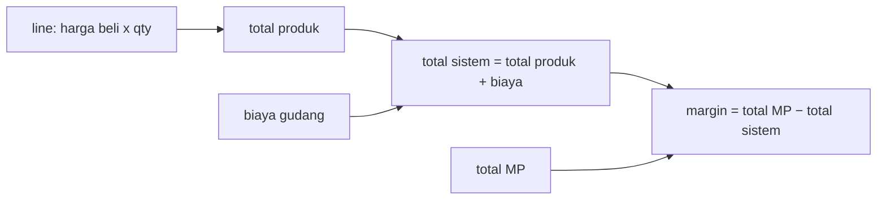

## the-detail-margin-is-mp-minus-system

> Settled by approving the preview; was open as *the subtraction is written the other way up — which is
> it?* The owner had written *"total sistem dikurangi lagi dengan total mp"*.

**`margin = total MP − total sistem`**, as a share of total MP — the list's formula
([the-margin-is-mp-minus-total-beli](#the-margin-is-mp-minus-total-beli)) read from the other end. The
written order was word order: taken literally it negates the margin and every healthy order reads as a
loss.

## the-detail-preview-became-the-order-detail

> Owner, in chat (2026-09-29): *"oh iya, terapkan dulu"* — apply the approved detail, as the list was
> applied in [the-preview-became-the-order-list](#the-preview-became-the-order-list).

`/orders/:orderId` opens the approved page of sections for every team that is not a warehouse. The
preview story is gone; its review stories now live in the page's own story file.

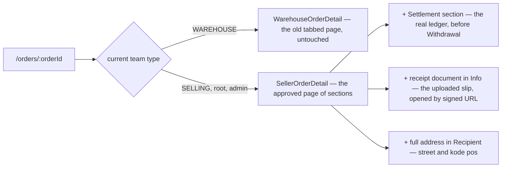

| | what | why |
| --- | --- | --- |
| warehouse | keeps the old tabbed detail | same argument as [the-two-ends-are-two-screens](#the-two-ends-are-two-screens): the seller page shows harga beli and margin, which a building fulfilling many sellers has no business reading |
| settlement | carried over as a SECTION, placed before Withdrawal | it is wired (reads `OrderSettlement`, posts entries); the preview had only the invented withdrawal table, so applying it bare would have removed a working feature. Whether *withdrawal & penyesuaian* IS this ledger stays open in [design_clarify.md](design_clarify.md) — now with both on screen |
| receipt document | carried over as a fact of Info | the uploaded PDF is real; only the resi CODE is sampled |
| address | full, never clamped | the preview's one-line region summary dropped the street — the one part a parcel cannot go without |
| not found / bad id | back button + message, as before | a dead end on a mistyped URL |

⚠ **The e2e now reads the seller page from the root seat**: the Pending stage (`data-stage="pending"`)
instead of the word "Placed", `order-action-cancel` instead of `order-cancel`, the `tile-mp` tile
instead of the old total line. The warehouse fulfilment test still reads the old page, tabs and all.

## settlement-replaces-withdrawal-on-the-order

> Owner, in chat (2026-09-30): *"untuk secara globalnya, wd mungkin diganti settlement"* — answering
> *is "withdrawal & penyesuaian" the settlement ledger?*

The order detail's money-back section is the **settlement ledger**. The invented withdrawal table, its
summary and its mock are gone. What arrives from the marketplace for this sale is a **payout** row in the
ledger, and a correction is a further row.

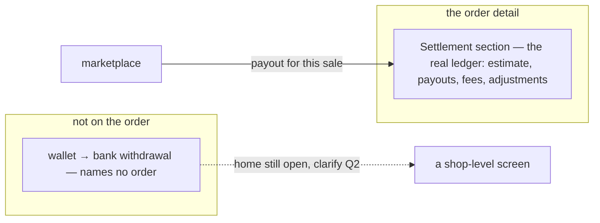

| | |
| --- | --- |
| on screen | the section keeps the ledger's summary and rows, with no card of its own inside the section card |
| still missing | nothing IMPORTS the marketplace's payouts yet, so a payout appears only when posted by hand. That is the `withdrawal` ⚠ on the section title, and Edit Withdrawal still has no RPC |
| not decided by this | where a wallet → bank withdrawal lives ([design_clarify.md](design_clarify.md#question) Q2). It names no order, so it was never going to fit on one |

⚠ The owner said *mungkin*. Built as decided because the recommendation was the same, and it can be
reversed by bringing a section back. The ledger itself is unchanged.

## the-phone-header-is-one-row

➡ **Moved** to [frontend/context_decision.md](../../business/frontend/context_decision.md#the-phone-header-is-one-row) — a rule for every screen (owner, 2026-10-02: screen decisions live in `docs/business/frontend/`).

## a-phone-reads-each-line-as-a-block

➡ **Moved** to [frontend/context_decision.md](../../business/frontend/context_decision.md#a-phone-reads-each-line-as-a-block) — a rule for every screen (owner, 2026-10-02: screen decisions live in `docs/business/frontend/`).

## the-draft-list-is-the-drafts-tab

> Owner, in chat (2026-09-30): *"sekarang draft sesuaikan dengan all, tapi jelas tidak selengkap di sana"* —
> the analysis was approved before building.

`/order-drafts` keeps its own route but reads as the **Drafts tab of the seller's order list**: the same heading,
the same stage strip with Drafts active, the same row grammar. It had been the old six-status strip, so clicking
Drafts swapped the whole strip under the reader.

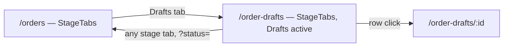

| order list column | on a draft | from |
| --- | --- | --- |
| ID Order + stage under it | reference (copyable) + **what is left** under it: `Ready` or the first gap, `+n` for the rest, all on the title | `external_id`, `draftGaps` |
| Resi | — | no field |
| Toko, badge under | Toko | `shop_id` |
| Dipesan + oleh | **Dibuat** + oleh, with a real author | `created_at_unix`, `author_user_id` |
| Tgl MP + deadline | **Diubah** | `updated_at_unix` |
| Beli · Total MP · Margin | — | a draft has no cost or MP figure, and the list returns no lines |
| *(draft only)* | Baris: `2`, or `1 of 3 unmapped` | `item_count`, `unmapped_item_count` |
| Aksi | kebab: Open · Delete (confirms) | Promote stays on the detail, which checks readiness |

- **Kept, draft only:** the checkbox and bulk delete — pruning is half this screen's job.
- **Dropped:** summary tiles, filter bar, Export and Import, the overdue tint. None has data on a draft.
- **No ⚠ on the row.** Every cell is a real field. The one mark on the page is the strip's `statusSet`.
- **The whole row opens the draft**; the checkbox, the copy button and the kebab stop the click.
- **A warehouse keeps the old strip here too**, matching its own unredesigned list.
- `listQuery` + `RefreshOverlay`, which the page had neither of.
- Moved to shared homes now that two pages use them: `CopyText` → `components/chrome/` (with a story), and
  `OrderRowCells`, `StageTabs`, `deadlineMock`, `rowMock` → `features/orders/`. `StageTabs` takes its ⚠ from the
  calling screen.

⚠ **Dropped from the row: the pushing app's name** (`source`), which sat under the reference. The readiness took
that line. See [design_clarify.md](design_clarify.md#question).

⚠ Found while analysing: the build lets a person draft and promotes on the server, against two business
decisions — recorded in
[the-build-lets-a-person-draft-and-promotes-on-the-server](../../business/order/context_clarify.md#the-build-lets-a-person-draft-and-promotes-on-the-server).

## the-draft-summary-is-three-cards

> Owner, in chat (2026-09-30): asked which statistics the existing data can carry, then *"3 teratas saja"*.

Three cards under the drafts page's tab strip, drawn like the order list's summary and, like it, controlling
nothing.

| card | value | source | real? |
| --- | --- | --- | --- |
| Draft | `2` | `page_info.total_items` | ✅ |
| Tertua | `2 hari` + the date | one row of `OrderDraftList` sorted `id` ASC — ids are issued in order | ✅ |
| Siap (halaman ini) | `1 dari 2` | `draftGaps` over the drafts on screen | ⚠ `readyCount` — the right rule, the wrong scope |

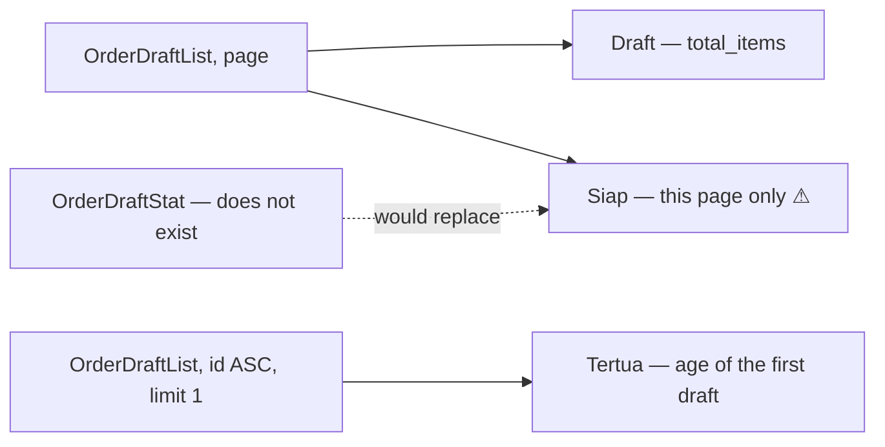

- **Not built, and why:** unmapped totals, missing shop/warehouse/customer counts and per-app counts — each needs a
  server aggregate, and a page-only count on a screen whose whole point is the backlog would read as the backlog.
- The stub transport now honours the list's sort, and the fixtures' draft ids follow their creation dates, so
  the oldest card is correct in Storybook as it is on the server.

## the-draft-cards-are-the-order-list-cards

> Owner, in chat (2026-09-30): *"gunakan referensi statistik dari list secara bentuk dan ukuran, biar kelihatan
> seragam"*.

The card and the strip are now ONE component, `features/orders/SummaryCard.tsx` (`SummaryCard` + `SUMMARY_GRID`),
drawn by both the order list's summary and the drafts page's. At 1440px a card is 145px wide on both.

| | before | after |
| --- | --- | --- |
| draft card | own copy: muted label, `lg` figure, cards stretched to fill the row | the list's card: bold `fg.label` label, `md` figure, quiet line |
| grid | draft `minChildWidth 10rem`, list `8.5rem`, both `auto-fit` | one grid, `auto-fill` of `8.5rem` |
| "this page" on Siap | in the label | on the card's own line, under `1 of 2` |

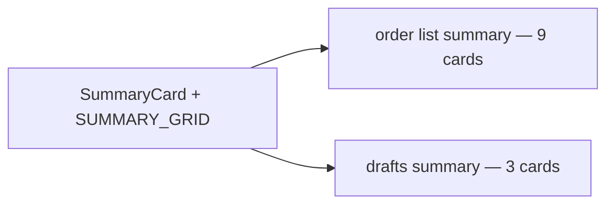

⚠ **`auto-fill`, not `auto-fit`, and it touches the order list too.** auto-fit collapses empty tracks and
stretches the cards, which is why three draft cards filled the width. With auto-fill the order list's nine
cards are unchanged at 1440px, but on a screen wide enough for more than nine tracks they no longer stretch
to the edge.

## the-summary-follows-the-tab

> Owner, in chat (2026-09-30): *"statistik untuk setiap status cuma ada di all status … ukuran statnya sebelumnya
> 9 bisa penuh 1 layar besar, sekarang kok jadi lebih kecil, kalau sudah masuk ke filter status kecuali draft,
> tampilkan statistiknya dengan nilai tx item dsb, jadi yang bawahnya bisa dihilangkan"*.

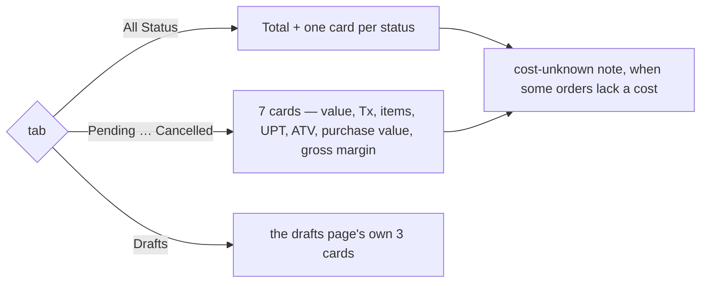

| | before | after |
| --- | --- | --- |
| All Status | 9 pile cards + a measure line for the total | 9 pile cards |
| a status tab | the same 9 pile cards + a measure line for that status | that status's 7 figures as cards |
| measure line | under the cards, always | **gone** — on a status tab its measures are the cards |
| grid | `auto-fill` (one round) — cards shrank on a large screen | `auto-fit` again — the cards fill the row |

- **It replaces** the rule the code carried as *"nothing appears or disappears when the tab changes"*. What made
  that rule matter — two different layouts — does not recur: both states draw the same `SummaryCard`.
- ⚠ **Reverses half of [the-draft-cards-are-the-order-list-cards](#the-draft-cards-are-the-order-list-cards).**
  With `auto-fit` the drafts page's three cards fill the row, so a draft card is no longer the width of an order
  card. The shape is shared; the width follows how many cards share the row, on every tab alike.
- The cost-unknown note stays, under whichever strip is showing.

## a-summary-card-is-at-most-a-fifth

➡ **Moved** to [frontend/context_decision.md](../../business/frontend/context_decision.md#a-summary-card-is-at-most-a-fifth) — a rule for every screen (owner, 2026-10-02: screen decisions live in `docs/business/frontend/`).

## a-phone-filters-from-a-sheet

➡ **Moved** to [frontend/context_decision.md](../../business/frontend/context_decision.md#a-phone-filters-from-a-sheet) — a rule for every screen (owner, 2026-10-02: screen decisions live in `docs/business/frontend/`).

## the-draft-keeps-its-own-page

> Owner, in chat (2026-09-30): *"kembalikan, tetap /:id"* — asked which part, answered **the old draft page**.

The draft was opened IN the order create form for one round (draft mode: seeded form, a picker per scraped row,
Save as Draft updating the draft, Create consuming it). The owner reverted it: `/order-drafts/:id` is the separate
draft page again — mapping table, Save, Promote — and the order create form is as it was.

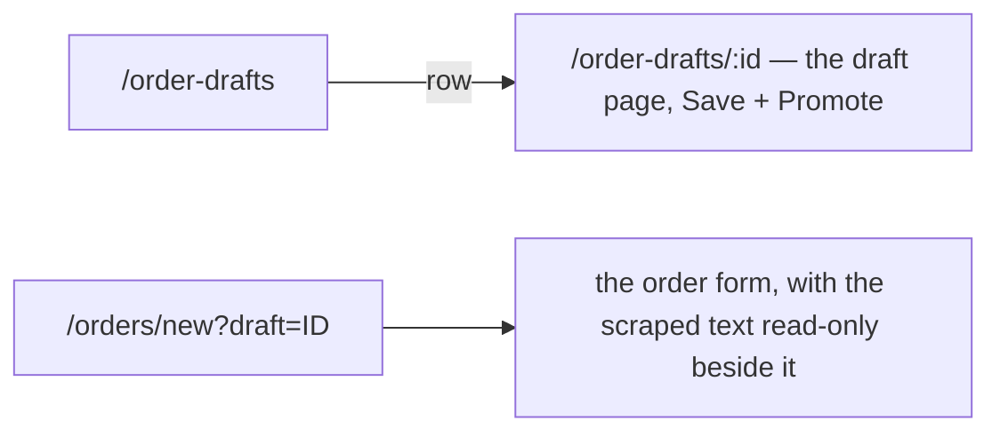

- Kept from that round: the order form's phone grid is `minmax(0, 1fr)`, so a wide lines table scrolls in its
  own box instead of pushing the page past the screen.
- The business contradiction (a person drafts, Promote finalizes on the server) stands, with a note that the
  form route was tried —
  [the-build-lets-a-person-draft-and-promotes-on-the-server](../../business/order/context_clarify.md#the-build-lets-a-person-draft-and-promotes-on-the-server).

## the-draft-page-wears-the-order-form

> Owner, in chat (2026-09-30): *"yang aku maksudkan sesuaikan itu secara ui dan form"* — then, while brainstorming:
> *"draft boleh saja tidak lengkap … tapi pasti error atau dibatasi sebelum promote to order"*, *"seperti biasa warning
> saja"*, *"aman, tidak masalah tidak disimpan"*, and the two-price columns.

The draft keeps its own page ([the-draft-keeps-its-own-page](#the-draft-keeps-its-own-page)), drawn with the order
create form's parts. Preview: `Pages/Order/OrderDraftNextPage` (`pages/order-draft-next/`), not routed yet.

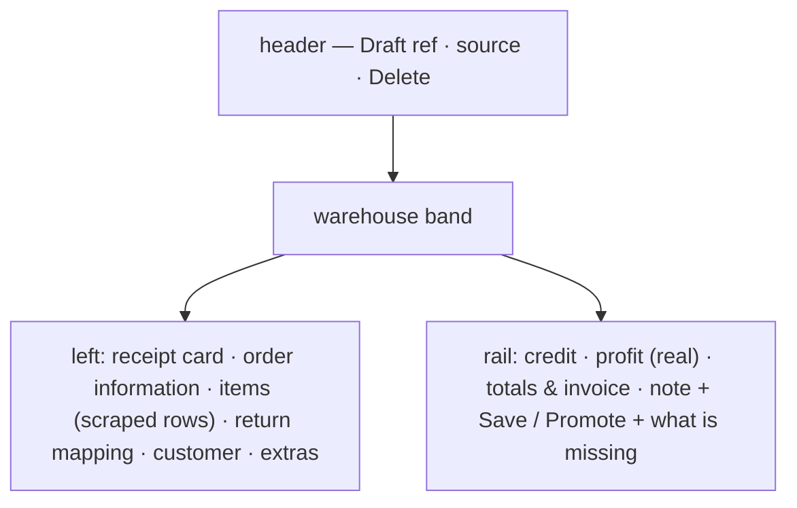

| | rule |
| --- | --- |
| layout | the create form's cards, in its order, and its sticky money rail |
| what a draft does not store | on screen with a ⚠ as usual — receipt, references, tracking number, note, dates, username (`draftKeeps`); the owner accepted they are not kept |
| Save | any state; only the changed fields are sent (each one becomes touched) |
| Promote | refused until the order could be placed — shop, warehouse, customer, every row mapped, stock, saved — then the create form's own checks: an error stops it, a warning can be overruled |
| prices | per row: HPP (from the warehouse, as on create) **and** the marketplace price (the draft's own, editable); the sell price is their sum and the profit estimate reads it — real, not typed |

- The create form's cards moved to `features/orders/form/` (with its `pending`, `checks`, `bundles` and samples), so both
  screens draw the same parts. Its invoice and credit rows are `form/money.ts`, used by both.

## a-draft-row-maps-to-a-product-a-bundle-or-a-split

> Owner, in chat (2026-09-30): *"items draft sebenarnya bisa antara produk atau bundle dan tiap bundle juga bisa
> dimapping"* — then: split allowed but suggest a bundle, bundle quantity like create, the package's price stays on
> the package row, and mappings are not remembered.

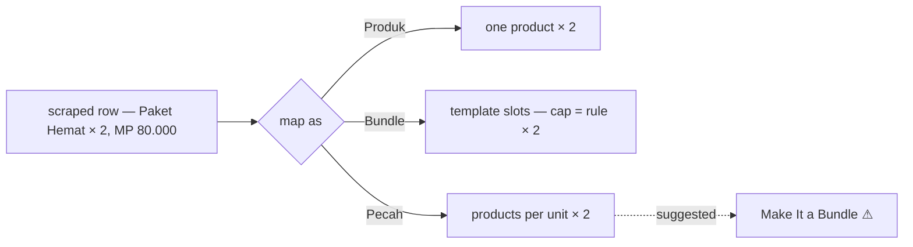

| | rule |
| --- | --- |
| three ways | a product; a bundle (its slots filled, each capped at rule × the row's quantity); a split into several products at a quantity per listing unit |
| split | allowed, because a bundle is optional; the row offers **Make It a Bundle** (⚠ `makeBundle` — templates are samples) |
| price | the marketplace price stays on the package row; HPP is the sum of what fills it |
| memory | a mapping is NOT remembered for the next draft |
| storing | only a product mapping is stored — a draft line holds one `product_id`. A bundle or split row is shown and counted, saved unmapped, and blocks Promote (⚠ `rowBundle`, `rowSplit`) until the contract can hold it ([design_clarify.md](design_clarify.md#question)) |

## the-draft-sell-price-starts-from-the-rows

> Owner, in chat (2026-09-30): *"sell price masih mungkin untuk diganti, bisa juga kita masuk di kontrak awal atau 0"*.

The draft page's sell price is a field again, as on the create form — not a read-only sum.

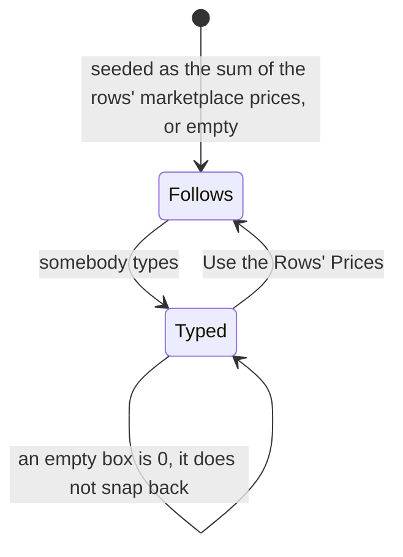

- It follows the rows while untouched; typing takes it over, down to 0; **Use the Rows' Prices** hands it back.
- ⚠ `sellPrice` — a draft has no sell price, so a typed one is not kept. It could arrive with the draft from the
  start ([design_clarify.md](design_clarify.md#question)).
- Refines [the-draft-page-wears-the-order-form](#the-draft-page-wears-the-order-form), whose price row said the sell
  price is the rows' sum.
- The split row's product picker keeps a product row's width instead of stretching across the row.

## the-listing-is-information-the-mapping-sets-the-count

> Owner, in chat (2026-09-30): *"harga cuma info, jumlah pun cuma info, tapi bisa jadi indicator warning jika
> jumlahnya tidak sesuai, di split, qty per satuannya luruskan dengan pilih produk"*.

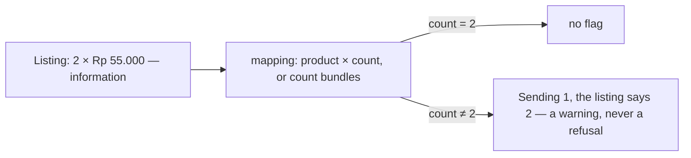

| | rule |
| --- | --- |
| the listing's quantity and price | shown under the scraped text, like the text itself; not editable |
| the count | set beside the product picker, or as the number of bundles; starts at the listing's quantity |
| a different count | flagged on the row, never refused — the buyer may have changed it, or the scrape misread it |
| split | parts are per listing unit × the listing's quantity, so a split has no count to differ; each part's picker and quantity sit on one line under column names given once |
| price | only the sell price is corrected, at the order level ([the-draft-sell-price-starts-from-the-rows](#the-draft-sell-price-starts-from-the-rows)) |

- ⚠ `listingQty` — a draft line holds one quantity, so a different count replaces the listing's on save, and the
  warning is gone the next time the draft opens. Refines
  [the-draft-page-wears-the-order-form](#the-draft-page-wears-the-order-form), whose price row had the marketplace
  price editable per row.

## the-draft-preview-became-the-draft-page

> Owner, in chat (2026-09-30): *"oke, sudah bagus"*, then *"pasang sekarang"*.

The preview replaced the built draft page at `/order-drafts/:id`; the route and its export name did not change.

```mermaid
flowchart LR
  P["pages/order-draft-next — the preview"] -->|"moved into"| D["pages/order-draft-detail — /order-drafts/:id"]
  O["the built page: mapping table, typed price, OrderTotals"] -->|"deleted"| X["gone"]
```

- `pages/order-draft-detail/` now holds the page, `rows.ts`, `pending.ts` and `components/DraftRowsCard.tsx`; its story is
  `Pages/Order/OrderDraftDetailPage` with the preview's stories.
- `features/orders/OrderTotals.tsx` is deleted — the built page was its only user.
- The e2e's draft-detail test needed no change: `draft-detail-page`, `draft-line-scraped-N`, `draft-line-unmapped-N`,
  `draft-promote`, `draft-gaps`, `draft-customer-name` and `draft-save` all carried over.

## the-warehouse-row-is-the-old-systems-columns

> Owner, in chat (2026-10-01): *"di sistem gudang lama header ada created by dengan user + team, toko mp + nama +
> orderid, awb isinya kurir + resi, buyer mungkin tidak perlu sekarang, qty, status, tanggal + ago, tanggal mp + ago"* —
> then *"dibuat tetap saja"*, shop, AWB and the rest as proposed, and the deadline *"jika ada"*.

The warehouse's order list (`/warehouse-orders`, the pick queue) carries the old system's row. Preview:
`Pages/Warehouse/PickQueueNextPage` (`pages/pick-queue-next/`), not routed yet. No money on the warehouse side.

```mermaid
flowchart LR
  R["one row"] --> A["Dibuat oleh: person / team"]
  R --> B["Toko MP: marketplace + shop / MP order id"]
  R --> C["AWB: courier / resi"]
  R --> D["Qty · Status"]
  R --> E["Tanggal: date / ago"]
  R --> F["Tanggal MP: date / deadline when there is one, else ago"]
```

| column | line 1 / line 2 | real? |
| --- | --- | --- |
| Dibuat oleh | person / team (the owner's order) | team real · person ⚠ `creator` |
| Toko MP | `[marketplace]` shop / MP order id, copyable | order id real · shop ⚠ `shop` — `ShopList` is scoped to the seller |
| AWB | courier / resi, copyable | courier real · resi ⚠ `receiptCode` |
| Qty | units | ⚠ `quantity` — a list carries no items |
| Status | the step badge | real |
| Tanggal | date / "2 days ago" | real |
| Tanggal MP | date / the **deadline** when the order has one (until shipped), else "ago" | ⚠ `mpDate`, `deadline` |

- The deadline reads as on the seller's list: quiet beyond 24 hours, amber under 24, solid amber under 6, solid red
  when late — and a late order tints its whole row.
- Buyer is left out for now. Ordering is left as it is for now.
- The tabs stay the pick queue's steps and gain counts; search and a date range filter; on a phone each order is a
  block, every invented fact keeping its ⚠ there.

## the-warehouse-tabs-are-the-processed-steps

> Owner, in chat (2026-10-01): *"di gudang tidak pakai status order itu, tapi pakai steps di status processed"* —
> then: a **Perlu konfirmasi** tab in front for orders waiting on the warehouse, and a **Semua** tab at the end.

The warehouse does not read the order's statuses (Menunggu, Diproses, Dikirim, …) — those are the seller's and the
buyer's. Inside the building an order is one of the steps of `processed`
([the-warehouse-steps-are-not-order-statuses](../../business/order/context_decision.md#the-warehouse-steps-are-not-order-statuses)).

```mermaid
flowchart LR
  A["Perlu konfirmasi — PLACED, default"] --> B["Dikonfirmasi — CONFIRMED"]
  B --> C["Diambil — PICKING"]
  C --> D["Dikemas — PACKED"]
  D --> E["Sudah diserahkan — no status yet ⚠, disabled"]
  S["Semua — no narrowing, to look an old order up"]
```

| | rule |
| --- | --- |
| the tabs | Perlu konfirmasi · Dikonfirmasi · Diambil · Dikemas · Sudah diserahkan · Semua |
| the four middle names | `PROCESSED_STEPS` — the same names as the seller's step filter under Diproses, so both ends say the same word for a step |
| Perlu konfirmasi | PLACED: the job the warehouse must accept first, so the screen opens on it |
| Sudah diserahkan | the warehouse's last step has no status in the contract — the tab is disabled and carries the ⚠, rather than narrowing nothing |
| Semua | not a status — every order, including shipped and cancelled, for looking one up |
| counts | each tab with a status carries its count; Semua counts every status |
| a row's status | the badge says the tab's word — "Perlu konfirmasi", not "Dibuat" — and an order the warehouse is done with keeps its order status's name (Dikirim, Batal). The colour stays the status's (`OrderStatusBadge` gained a `label`) |

- Replaces the pick queue's own tab names, and the last line of
  [the-warehouse-row-is-the-old-systems-columns](#the-warehouse-row-is-the-old-systems-columns), which said the
  tabs stay the pick queue's steps.
- Tried and reverted in the same pass: the seller's whole stage strip with the step filter under it. The owner's
  correction is that the warehouse does not use the order's statuses at all.

## the-confirmed-step-reads-dikonfirmasi

> Owner, in chat (2026-10-01): picked *"Ganti jadi 'Dikonfirmasi'"*.

The step for `CONFIRMED` was labelled **"Perlu konfirmasi"** ("To confirm") in the seller's step filter. A
CONFIRMED order has already been accepted by the warehouse; the order that needs confirming is PLACED. It reads
**"Dikonfirmasi"** (EN **"Confirmed"**) now — on the seller's step filter and on the warehouse's tab alike, since
both read `orders.step.confirm`.

```mermaid
flowchart LR
  P["PLACED — Menunggu (seller) · Perlu konfirmasi (warehouse)"] -->|"the warehouse accepts"| C["CONFIRMED — Dikonfirmasi"]
```

## the-warehouse-filters-by-team-marketplace-and-courier

> Owner, in chat (2026-10-01): *"filter yang ada adalah cari, filter type, status (bukan status order), status
> pengiriman (dalam perjalanan atau belum jalan), tanggal, team, marketplace dan jasa kirim"* — then *"oke"* to the
> recommendation below.

```mermaid
flowchart LR
  F["filter strip"] --> S["cari — real"]
  F --> D["tanggal dibuat — real"]
  F --> T["team (seller) ⚠"]
  F --> M["marketplace ⚠"]
  F --> C["jasa kirim ⚠"]
  F -->|"only on Semua / Sudah diserahkan"| P["status pengiriman: semua · belum jalan · dalam perjalanan ⚠"]
```

| filter | rule |
| --- | --- |
| cari | one box, looks everywhere — so no "filter type" choosing which field it searches. ⚠ It does not reach the MP order id or the resi yet ([design_clarify.md](design_clarify.md#question)) |
| status | not built: the warehouse's steps are already the tabs ([the-warehouse-tabs-are-the-processed-steps](#the-warehouse-tabs-are-the-processed-steps)) |
| tanggal | the date the order was written down — the marketplace date has no field |
| team · marketplace · jasa kirim | search selects (team, courier) and the marketplace list, each with a ⚠: `OrderListFilter` has none of the three, so they narrow nothing yet (`dropped`) |
| status pengiriman | a three-way switch shown only on the tabs a handed-over parcel can be listed under; leaving those tabs clears it. ⚠ It belongs to a shipment record that does not exist |

- On a phone everything but the search sits in the Filter sheet, as on the seller's list.
- **Assumed, not asked back:** "filter type" meant choosing the searched field, and "status (bukan status order)"
  meant the warehouse step. If either meant something else, it is a new filter, not a change to these.

## a-warehouse-step-moves-by-the-old-systems-table

> Owner, in chat (2026-10-01): the old system's table — *waiting: picking, picked, packing_completed · picking:
> picked, waiting, packing_completed · picked: packing_completed, waiting · packing_completed: completed, waiting ·
> completed: —* — then *"kalau belum ada bisa ditambahkan"* (the picked step) and *"warning cukup, tetapi pakai alasan
> terdengar masuk akal"* (moving back).

```mermaid
stateDiagram-v2
  [*] --> PerluKonfirmasi
  PerluKonfirmasi --> Dikonfirmasi
  Dikonfirmasi --> SedangDiambil
  Dikonfirmasi --> SudahDiambil
  Dikonfirmasi --> Dikemas
  SedangDiambil --> SudahDiambil
  SedangDiambil --> Dikemas
  SudahDiambil --> Dikemas
  Dikemas --> SudahDiserahkan
  SedangDiambil --> Dikonfirmasi: back with a reason
  SudahDiambil --> Dikonfirmasi: back with a reason
  Dikemas --> Dikonfirmasi: back with a reason
  SudahDiserahkan --> [*]
```

| old system | warehouse step | status in the build |
| --- | --- | --- |
| waiting | Dikonfirmasi | CONFIRMED |
| picking | Sedang diambil | PICKING |
| picked | **Sudah diambil** (new — [picked-is-a-warehouse-step](../../business/order/context_decision.md#picked-is-a-warehouse-step)) | none ⚠ |
| packing_completed | Dikemas | PACKED |
| completed | Sudah diserahkan | none — the build records it as SHIPPED |

- A skip forward is allowed (picked and packed in one go). Going back is only ever to Dikonfirmasi, behind a warning
  with a **required reason**; stock does not move, because the goods were counted out when the order was placed.
- The row menu and the bulk "Change Step" offer only allowed moves; the bulk one offers what EVERY selected order allows.
- ⚠ `stepMove`: the RPCs move one step forward each (confirm, pick, pack, ship). A skip, a move back or a move into
  Sudah diambil does nothing yet but say so. The table belongs on the server.
- The label "Diambil" became **"Sedang diambil"** and the new step is **"Sudah diambil"** — on the seller's step filter
  too, since both screens read `PROCESSED_STEPS`.

## scanning-is-the-crews-hands

> Owner, in chat (2026-10-01): the old page's features — change step, a validation scan while picking, a handover
> scan (only `packing_completed` → `completed`, with a mass option), finding a parcel by scan with no API, printing
> labels in bulk, export — then: a handheld **scanner**; the handover needs no proof; and the find-parcel purpose:
> *"paket yang sudah dikemas biasanya langsung masuk karung … buka dialog ini untuk order yang dicari, lalu scan paket
> di tumpukan sampai ada yang berbunyi cocok"*.

```mermaid
flowchart TB
  L["warehouse order list"] --> H["header: Scan Handover · Export ⚠"]
  L --> B["bulk bar while rows are selected: Change Step · Print Labels ⚠ · Hand Over · Export ⚠"]
  L --> R["row menu: allowed moves · Scan to Validate · Find Parcel · Print Label · Open Pick List"]
  H --> HD["handover dialog"]
  R --> VD["validation dialog"]
  R --> FD["find-parcel dialog"]
```

| scan | rules |
| --- | --- |
| **handover** | only a Dikemas parcel; another step is an error with the wrong sound; the same label twice is not added twice, only the fulfilled sound; *Ambil massal* off hands each good scan over at once, on collects them and one button — off while nothing is ready — hands them over; the end state is Sudah diserahkan; no manifest. ⚠ `resiLookup` (looks in the orders the screen loaded), `bulkHandover` (one call per parcel) |
| **find parcel** | opened for ONE order; every scan is compared with that order's resi, MP order id and id, on screen, with no API; a match is the fulfilled sound and a green answer, anything else the wrong sound |
| **validation** | for an order being picked: each item scan counts its line up to the ordered quantity; an unknown item or one too many is an error with the wrong sound; the step moves on only when every line is exact. ⚠ `barcode` — products have no barcode, so the SKU is matched |

- The scanner types the code and presses Enter; the field keeps focus and empties itself for the next one.
- Two sounds made by the browser — a short high "fulfilled" and a low "wrong" — failing silent where audio is unavailable.
- Labels: one prints through the receipt's signed URL; several at once need a merge (⚠ `printMerge`). Export ⚠ `exportFile`.
- Built in the preview `Pages/Warehouse/PickQueueNextPage`.

## the-bulk-actions-are-always-on-screen

> Owner, in chat (2026-10-01): *"aksi yang perlu centang apa tidak bisa muncul dari awal saja?"*

The warehouse list's action bar is on screen from the start, not only once a row is ticked.

```mermaid
flowchart LR
  N["nothing ticked"] --> H["Tick orders for bulk actions — Change Step, Print Labels, Hand Over off · Export All on"]
  T["one or more ticked"] --> A["n selected — every action on · Export n · Clear Selection"]
```

- An action that needs a selection is disabled, and the bar says why beside it rather than leaving a grey button
  to be guessed at.
- **Export never waits**: the selection when there is one, else every order the filters show. It moved off the
  header into the bar, so there is one Export, not two.
- Replaces the line in [scanning-is-the-crews-hands](#scanning-is-the-crews-hands) that had the bar appear only
  while rows are selected.
