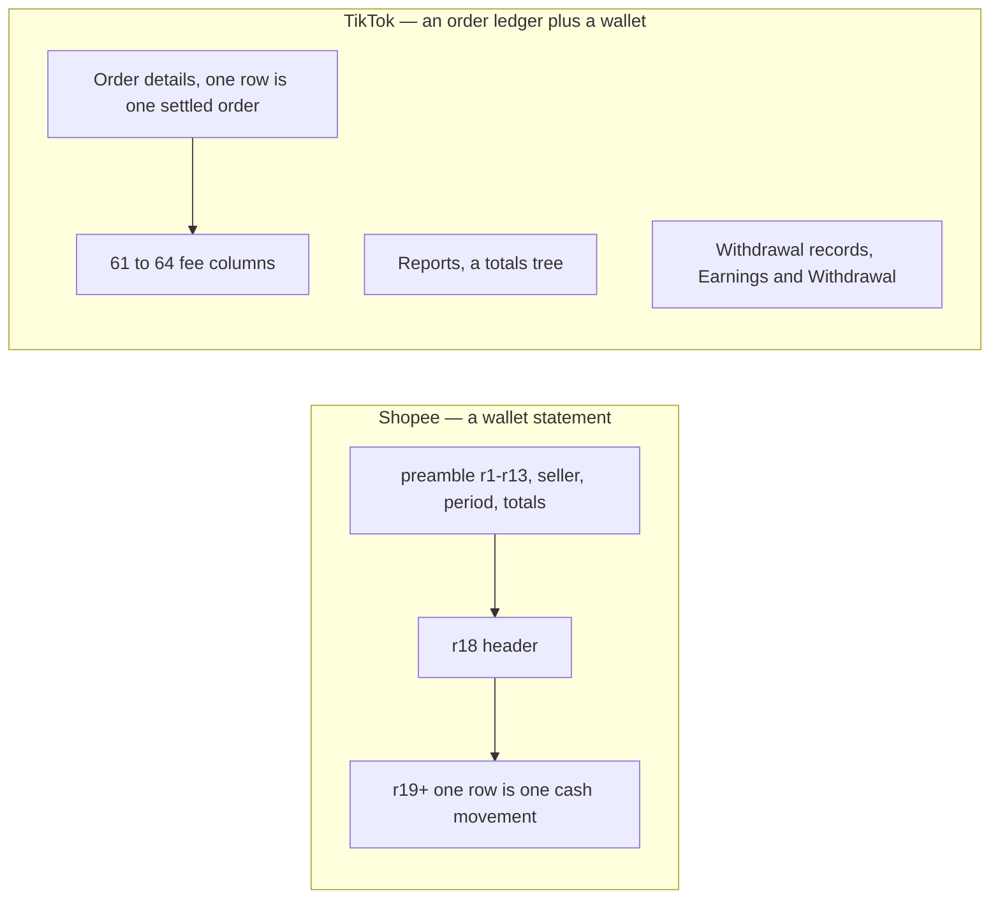
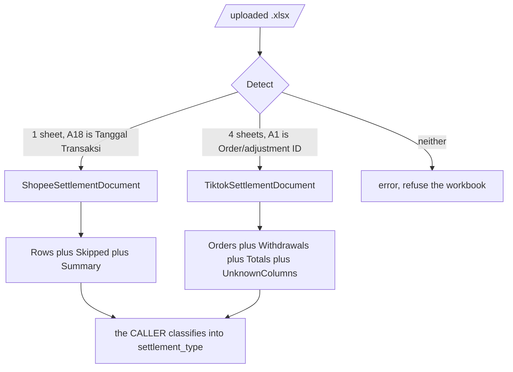
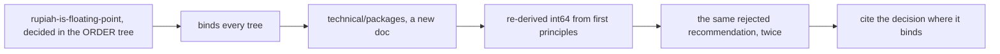
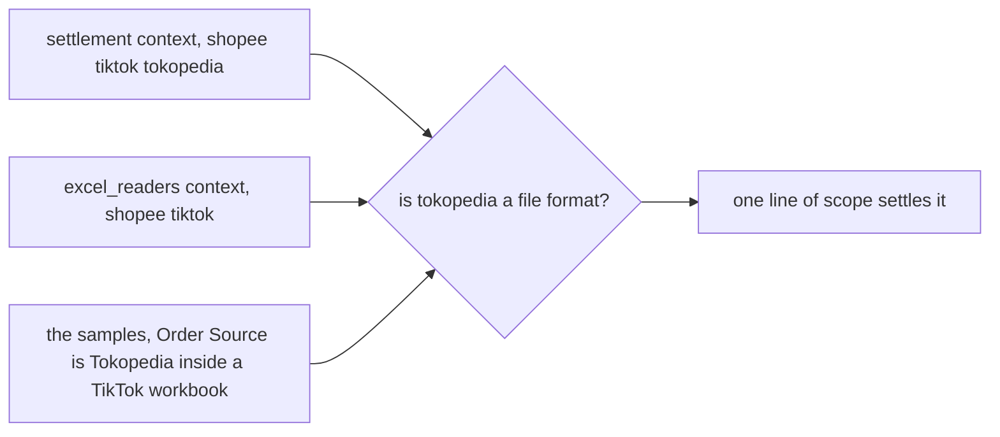

# Clarity — `excel_readers/context.md`

Critique, questions and warnings about [context.md](./context.md). That doc is yours; this one is
mine. Answered points are **deleted**, so this is always the current open set.

> **Everything below is measured, not assumed.** I parsed all **25 workbooks** in
> [`examples/settlement_samples/`](../../../../examples/settlement_samples/) — 12 Shopee, 13 TikTok —
> cell by cell, including the raw XML storage types. Every claim carries the file it came from.

---

# What the samples actually are

| | Shopee (12 files) | TikTok (13 files) |
| --- | --- | --- |
| sheets | **1** — `Transaction Report` | **4** — `Order details`, `Reports`, `Withdrawal records`, `Fees explanation` |
| grain | one **cash movement** on the seller wallet | one **settled order**, 61–64 fee columns wide, plus a separate withdrawal ledger |
| header row | always **18**, preamble in 1–13 | always **1** |
| period / currency | rows 7–8, `IDR` at r12 | `Reports` sheet — `Time period`, `Timezone UTC+7`, `Currency` |
| shop identity | ✅ `Username (Penjual)` at **B6** | ⛔ **nowhere in the file** |
| timestamp | `2025-12-30 08:37:10`, to the second | `2025/12/23` — **date only**, both created and settled |
| row identity | ⛔ **none** | `Order/adjustment ID`, **not unique** (see #5) |

**Shopee `Tipe Transaksi`** — 3555 `Penghasilan dari Pesanan`, 172 `Penarikan Dana`, 60 `Penyesuaian`,
1 `Program Ekspor Shopee FLEXI`. **Status** — 3786 `Transaksi Selesai`, **2 `Gagal`**.

**TikTok `Type`** — 2707 `Order`, 10 `GMV Payment for TikTok Ads`, 4 `Platform reimbursement`,
4 `Additional Campaign Package`, 3 `Logistics reimbursement`, 1 `Shipping insurance compensation`.
**Withdrawal `Type`** — `Earnings`, `Withdrawal`, `GMV Pay Deduction`.



⚠ **These are two different grains, not two dialects of one thing.** A Shopee row is money moving. A
TikTok row is an order decomposed into fees, and the money moving is on a *different sheet*. One
`SettlementRow` abstraction over both would be a union that neither side fills.

---

# Critique

| | Problem | → Recommend |
| --- | --- | --- |
| **1** | **TikTok's column set is not fixed — 3 layouts in 13 files.** 61 cols (`niko_lape`), 63 (`salah_tarik`, `shipping_issurance`), 64 (`gmv_mlongo`, `isna_negative`). Columns *appear* — `GMV Max ad fee`, `Article 22 Income Tax withheld`, `Platform special service fee`, `Distance item fee from Horizon+ Program` — **and disappear**: `Flat fee` and `Sales fee` are in the 61- and 63-col files and gone from the 64-col one. A positional or fixed-struct mapping is broken on arrival. | Map by **header text**, never by index. And **carry unknown columns** into an `Extra` map rather than dropping them — silently dropping a new fee column is how `Total Fees` stops reconciling with nobody noticing. |
| **2** | **Amounts are not always numbers.** 6 of 13 TikTok files — `gmv_mlongo`, `gmv_payment`, `isna_negative`, `overlapping_earning`, `pay_deduction`, `shipping_issurance` — store **every cell as a shared string**, with zero numeric cells in the sheet. And `awan_beban_return.xlsx` stores `"8400769.00"` as text while `awan_beban_return_simple.xlsx`, the same report re-saved through another spreadsheet tool, stores `-18923082` as `t="n"`. Both forms will arrive, from the same seller. | **Normalise to a number on the way in** — the cell's storage type is an accident of who last opened the file, and `GenerateUniqueID` is only stable because the value is parsed, never because it is passed through (#15). ⚠ **I had the second half of this wrong**: I recommended `int64` minor units, which contradicts a settled decision — see [Contradiction](#contradiction). `float64` is correct here. |
| **3** | **`Order/adjustment ID` is 18 digits — it must never touch a float.** `581595973617353910` is about 5.8e17, well past float64's exact-integer range of 9.0e15. Anything that round-trips it through a number corrupts the last digits, and the corruption looks like a platform mismatch rather than a parser bug. | The ID is a **`string`** in the returned type, start to finish. Same for Shopee's `No. Pesanan`. |
| **4** | **Rows are padded with blanks inside the used range.** `niko_lape.xlsx` has 219 `<row>` elements and **43** with data. `husen_campaign` 219 to 36. `salah_tarik` 220 to 59. A reader that trusts the sheet dimension emits about 180 empty records per file. | Stop at the first row whose key column is empty, or skip and count. Either way **report the number of skipped rows** — a silently-dropped row and a blank padding row are indistinguishable otherwise. |
| **5** | ✅ **SOLVED FOR SHOPEE by your `GenerateUniqueID`** — I tested it, it holds (#15). What remains is the **TikTok** half: `overlapping_earning.xlsx` carries order `581000262229460562` twice — `+104444` settled 11/06, then `−131698` settled 11/08 — and `pivan_fund_invalid.xlsx` does the same, so the `Order/adjustment ID` alone is not a key there either. | TikTok's contract needs the same treatment as Shopee's: a `GenerateUniqueID` over a field set that includes something separating the two settlements of one order. `Order settled time` does it in both samples. [Q3](#question) is now only about TikTok. |
| **6** | **Shopee hides the order reference in free text.** On `Penyesuaian` rows `No. Pesanan` is literally `-`, while `Deskripsi` reads `Penyesuaian Saldo Penjual untuk biaya premi Pesanan yang Gagal Terkirim: 2512126PQE3802` — the order ref is inside the sentence. 60 such rows in the samples. Without it, those adjustments cannot be attached to an order and all 60 land on `shop_id` instead. | Extract it, but **as a separate, visibly fallible field** — `OrderRef` plus a `FromDescription bool`. Never overwrite `No. Pesanan` with a guess. A regex over a platform's UI copy *will* break, and the caller has to be able to see that it was a guess. |
| **7** | **`NewShopeeSettlementDocument(r)` makes the caller already know the platform.** A person uploading a file knows the shop, not the workbook layout — and the layouts are trivially distinguishable by sheet count and by `A18` vs `A1`. Leaving detection to every caller means every caller writes it differently. | Add `Detect` and an `Open` that dispatches. Keep the per-platform constructors — they stay useful when the platform is already known. |
| **8** | **`io.Reader` cannot be read twice, and xlsx needs random access.** A zip is read from its trailing central directory, so any reader buffers the whole file first. 830 rows by 63 cols is nothing, but the signature *is* the API and it fixes the memory behaviour for a file ten times that size. | Take **`io.ReaderAt` plus size**, which is what `zip.NewReader` actually wants, and return rows as an **iterator** (`iter.Seq2`, Go 1.25) rather than a slice. `NewX(io.Reader)` can stay as a convenience that buffers, clearly labelled. |
| **9** | **The doc names the file layout but not the failure model** — and half the sample filenames are failure cases: `mb_erna_err`, `shopee_wd_tidak_cocok`, `pivan_fund_invalid`, `salah_tarik`. A library whose whole job is reading other people's files needs its errors in the contract. | Say which of the three a bad file is: **refuse the workbook** (wrong platform, no header), **skip the row and report** (unparseable amount), or **accept and flag** (unknown column, unknown type). My recommendation: only the first is an `error`, the other two are fields on the returned document. |
| **10** | ⚠ **`examples/` is untracked and NOT gitignored — it will be committed to a PUBLIC repo.** The workbooks carry real seller usernames (`arunastyleootd`, `keyvara_outfit`, `seluna_co`, `zafa.wear`, `aloochic`, `mikioutfit`, `klipsa.outfit`, `stars_otd`, `auramodis`), real order IDs, real daily revenue and masked bank-account tails. | Decide before the first commit: scrub the identifying cells, or gitignore `examples/` and keep the fixtures out of the repo. This is not a design point — it is the public-repo rule in [CLAUDE.md](../../../../CLAUDE.md), and it bites once. |
| **11** | **`examples/shipped_samples/` exists and is empty**, and the doc does not mention it. | Either say what it is for here, or delete it — an empty directory in a spec's example tree reads as unfinished scope. |

| **12** | ⛔ **`Jenis Transaksi` is a CATEGORY, not the sign — and a failed withdrawal is TWO rows, not a flag.** In `awan_wdgagal.xlsx`, r107 is `Penarikan Dana · Transaksi Keluar · −5899085 · status **Gagal**` and r59, a day later, is `Penarikan Dana · Transaksi Keluar · **+5899085** · status **Transaksi Selesai**`. Same category, opposite signs. `luxy_wdgagal.xlsx` r75/r42 is the identical pair at 3977187. **And the `Saldo Akhir` chain includes both** — the chain check passes with zero breaks on those files — so *both movements are real*. A reader that derives the sign from the category books the reversal backwards, and a caller that "skips `Gagal` rows" keeps the reversal, drops the withdrawal, and inflates the wallet by the full amount. | Take the sign from **`Jumlah` only**. Keep `Jenis Transaksi` as an opaque `Category` string — my earlier name for it, `Direction`, was wrong and is corrected in the design below. Expose `Reversal bool` where the two disagree, and **book `Gagal` rows at face value** — the status is metadata on a real movement, not an instruction to ignore it. Re-asked as [Q7](#question). |
| **13** | ⛔ **The summary block is WRONG whenever a withdrawal fails — Shopee's own arithmetic, not ours.** Totalled by category, `Total Saldo Masuk` matches the rows in all 12 files, but `Total Saldo Keluar` is out by **exactly twice the failed withdrawal** in both wdgagal files: `awan` −72492888 computed vs −84291058 claimed (2 × 5899085), `luxy` −22447100 vs −30401474 (2 × 3977187). The transaction *counts* are right; the money is not. Separately, `awan_beban_return_simple.xlsx` is a truncated re-save — 141 rows — that kept the original 1463-row header totals. | **Never validate rows against the summary.** Expose both and let the caller see them disagree: `Claimed()` is what the file asserts, `Computed()` is what the rows add up to. A reader that "checks" its parse against this block would reject two good files out of twelve. |
| **14** | ⛔ **One wallet's statement is split across separate downloads, and the balance chain proves it.** `shopee_malaysia_base.xlsx` has exactly one break in `Saldo Akhir`: r21 leaves 3019934 but r22 opens at 2870308 — a hole of 149626. The missing row is in the *other* file: `shopee_malaysia.xlsx` r19, `Program Ekspor Shopee FLEXI · MY-251202B89P47GJ · 149626 · saldo 3019934`. The cross-border/FLEXI transactions are filtered out of the main export. | **A file is a slice, not a statement.** Do not assume one upload is complete. The chain break is a cheap, exact detector for it — recommend `Gaps()`, which costs one subtraction per row and tells settlement that an import is missing money *before* it reconciles. It found this one in 1 of 12 files with no false positives. |

## On the new `### Shopee Contract`

✅ **`GenerateUniqueID` works. I tried to break it and could not.** Modelling your exact field set
(`At`, `Type`, `Description`, `OrderRefID`, `Amount`, `LastBalance`) as md5-over-JSON:

| test | result |
| --- | ---: |
| collisions across **all 3788 rows, 12 files** | **0** |
| the two duplicate-row pairs that defeat `hash(date + order_ref)` | **distinct** — `Description` and `Saldo Akhir` both differ |
| same rows re-exported through another tool (`awan_beban_return` vs `_simple`) | **141/141 stable** |

⚠ **And one of my own recommendations would have broken it.** I said to read every cell as its display
string. Hashing those raw strings scores **0/141** on that last test, because the re-save turns
`"8400769.00"` into `8400769`. Parsing to a number first is what makes the key stable — that is
load-bearing, not a style choice, and it is worth a sentence in `context.md` saying so.

| | Problem in the new contract | → Recommend |
| --- | --- | --- |
| **15** | ⛔ **`GenerateUniqueID` over `json.Marshal(s)` freezes the struct forever.** The hash is taken over *whatever fields the struct has that day*, so adding one — `Status`, a currency, anything in #17 — **changes every `unique_id` already stored**, and the next import re-inserts the entire history as new rows. The struct is one line of a future PR away from that, with no compile error and no test failure. | Hash an **explicit, ordered, versioned** string — `v1|At|Type|Description|OrderRefID|Amount|LastBalance` — not the struct. Adding a field then costs nothing, and changing the key becomes a deliberate `v2` with a migration, which is what it actually is. |
| **16** | ⛔ **`time.Time` in the hash carries its timezone.** `json.Marshal` of a `time.Time` emits RFC3339 *with the offset*, so the same cell parsed as `+07:00` on one machine and UTC on another produces a different `unique_id` — and the file states no timezone anywhere (TikTok does, on its `Reports` sheet; Shopee does not). This promotes [Q5](#question) from a modelling preference to **a correctness property of the key**. | Fix the zone in the contract — `Asia/Jakarta` — and hash a fixed layout (`2006-01-02 15:04:05`) rather than the `time.Time`. A fabricated offset is invisible until two importers disagree. |
| **17** | **`OrderRefID` takes `No. Pesanan` verbatim, and that cell is literally `"-"`.** 116 of 615 rows in `shopee_wd_tidak_cocok.xlsx`, 16 in `awan_beban_return.xlsx` — withdrawals and most adjustments. So `OrderRefID: "-"` reaches `settlement_logs` as an order reference. For 45 of those 116 the real ref is in `Deskripsi` (`… Gagal Terkirim: 251125PMAEX4JH`), and `Penyesuaian` *sometimes* does carry a real `No. Pesanan` — so neither cell can be trusted alone. | `"-"` becomes `""`. Keep the recovered ref in a **separate** field with a flag saying it was recovered, never written back over `OrderRefID`. ⚠ **Decide this before the first import runs** — normalising `"-"` to `""` changes the hash, so it is free today and a migration tomorrow. |
| **18** | **`Status` is dropped from the item.** The balance still comes out right, because the signs carry it (#12) — but a failed withdrawal and its reversal become two unexplained opposite rows, and nothing downstream can ever say which was which. | Either add `Status` **now** (it is free before any `unique_id` exists — see #15), or say in the doc that it is deliberately out of scope. |
| **19** | **`GetItems([]*ShopeeSettlementItem, error)` does not compile** — it is missing its parameter list. | `GetItems() ([]*ShopeeSettlementItem, error)`. Reporting rather than editing (HARD RULE 7b). |
| **20** | **`ShopeeSettlementType` is declared with no values**, which leaves [Q1](#question) open in the code rather than settling it. A named string type is a good middle ground — it documents intent without making an unseen value a parse failure. | Declare the four measured constants (`Penghasilan dari Pesanan`, `Penarikan Dana`, `Penyesuaian`, `Program Ekspor Shopee FLEXI`) and a `Known()` helper, keeping unknown values *parseable*. The fourth appears once in 3788 rows, so the list is demonstrably not closed. |

✅ **Shopee's layout is genuinely stable** — header at row 18, the same 8 columns, in all 12 files
including the Malaysia export. The variance is all on the TikTok side.

✅ **Measured across all 12 files:** every `Jumlah` and `Saldo Akhir` parses with a decimal parser
(zero failures), rows are **strictly newest-first** everywhere, and the `Saldo Akhir` chain is exact
except for the one documented gap in #14. `Penyesuaian` rows *sometimes* do carry a real `No. Pesanan`
(1, 2 and 4 rows in three files) — so it cannot be special-cased as always-empty.

✅ **TikTok's `Reports` sheet is a free reconciliation oracle.** It is a totals tree whose indent is
encoded by *which column the label sits in* (B is level 0, E is level 3), and its
`Total settlement amount` equals the sum of that column in `Order details`. Parsing it costs almost
nothing and turns "did we read the file correctly" into an assertion instead of a hope.
**→ Recommend the document expose it.**

---

# Proposed Design

A proposal *for* your doc — not written into it.

```go
package san_excel_readers

type Platform string // "shopee" | "tiktok"

// Detect reads only what it needs to identify the workbook.
func Detect(r io.ReaderAt, size int64) (Platform, error)

// RowRef is how a caller builds an idempotency key (#5).
type RowRef struct {
    Sheet string
    Row   int // 1-based, as the spreadsheet shows it
}

// SHOPEE — your contract, kept as written, plus the fields the samples force.
// Your six fields and GenerateUniqueID stand as they are (#15 tests them).

type ShopeeSettlementItem struct {
    At          time.Time            // A, fixed to Asia/Jakarta (#16)
    Type        ShopeeSettlementType // B
    Description string               // C
    OrderRefID  string               // D, "" not "-" (#17)
    Amount      float64              // F, signed — the decided money type
    LastBalance float64              // H

    // --- added, and each one earns its place ---
    Status       string    // G, or say it is out of scope (#18)
    Row          int       // 1-based, as the spreadsheet shows it — for error messages
    RecoveredRef string    // the ref dug out of Description when OrderRefID is "" (#6)
    RefFrom      RefSource // Column | Description | None
    Reversal     bool      // "Transaksi Keluar" with a positive Amount (#12)
}

// ⚠ Anything added here AFTER the first import changes every stored unique_id (#15).

type ShopeeSettlementDocument interface {
    GetShopUsername() (string, error) // B6
    GetItems() ([]*ShopeeSettlementItem, error) // #19

    // --- added ---
    GetPeriod() (from, to civil.Date, err error) // B7 / B8
    GetClaimedSummary() (ShopeeSummary, error)   // r12 / r13, what the file ASSERTS
    GetComputedSummary() (ShopeeSummary, error)  // what the items add up to (#13)
    GetGaps() ([]Gap, error)                     // breaks in the Saldo Akhir chain (#14)
    GetSkipped() ([]SkippedRow, error)           // never silent (#4)
}

// Gap is a break in the Saldo Akhir chain: proof that rows are missing from THIS file.
type Gap struct {
    AfterRow, BeforeRow int
    Amount              float64 // how much the missing rows moved
}

type TiktokSettlementDocument interface {
    Period() (from, to time.Time)
    Timezone() string         // "UTC+7"
    Totals() map[string]int64 // the Reports tree, flattened
    Orders() iter.Seq2[TiktokOrderRow, error]
    Withdrawals() iter.Seq2[TiktokWithdrawalRow, error]
    UnknownColumns() []string // headers we had no field for (#1)
}

type TiktokOrderRow struct {
    Ref        RowRef
    ID         string     // 18 digits, string, always (#3)
    Type       string
    CreatedOn  civil.Date // date only, no time
    SettledOn  civil.Date
    Currency   string
    Settlement int64
    Revenue    int64
    Fees       map[string]int64 // keyed by header text, survives #1
    Extra      map[string]string
}
```



**The reader does not classify.** It returns what the file says, verbatim, plus the row's address.
Mapping `Penghasilan dari Pesanan` to `fund` and `Penyesuaian` to `marketplace_adjustment` is a
*settlement* decision that will change without the file format changing, so it belongs to the service
that owns [`settlement_type`](../../../business/settlement/context.md) — not to a parsing library.
That is also your standing rule that a shared library ships functions while the calling service keeps
the policy.

**File layout** — the doc's `[platform].go` will not hold this. Recommend:

```
backend/pkgs/san_excel_readers/
  detect.go            Detect + Open
  shopee.go            the document
  shopee_rows.go       the row mapping
  shopee_test.go       drives every examples/settlement_samples/shopee/*.xlsx
  tiktok.go
  tiktok_columns.go    header text -> field, all three layouts
  tiktok_test.go
```

---

# Question

1. **Do the transaction types stay verbatim strings, or become a Go enum?** The samples show 4 Shopee
   types and 7 TikTok ones, but `Program Ekspor Shopee FLEXI` appears exactly **once** in 3788 rows, so
   the list is clearly not closed. An enum makes an unseen type a parse failure; a string makes it the
   caller's problem. **→ I recommend verbatim strings plus a `Known(t) bool` helper** — a new platform
   fee should not fail an upload.
2. **Is `Tokopedia` a third reader, or a column value?** `Order Source` in the TikTok exports is
   `TikTok Shop` (2693 rows) and **`Tokopedia`** (22 rows) — same workbook, same layout. But
   [settlement's context](../../../business/settlement/context.md) lists `tokopedia` beside `shopee`
   and `tiktok` as a platform. If Tokopedia also exports its *own* settlement workbook, that is a third
   reader this doc does not scope. **→ I think it is only a column here and a Tokopedia-native export is
   a separate question** — confirm.
3. **What is `unique_id` for a TIKTOK row?** ✅ The Shopee half is **closed** by your
   `GenerateUniqueID` — 0 collisions in 3788 rows, stable across a re-save (#15). TikTok has no
   equivalent yet, and its `Order/adjustment ID` is **not** unique: `overlapping_earning.xlsx` and
   `pivan_fund_invalid.xlsx` each settle one order twice. **→ Recommend the same md5 shape over
   `ID + Order settled time + Total settlement amount`**, which separates both observed pairs. Worth
   telling [settlement](../../../business/settlement/context_clarify.md) that its
   `hash(date + order_ref_id)` best effort is superseded on both sides.
4. **Are `wderror` and `x` real platform values, or hand-edited fixtures?** `salah_tarik.xlsx` has one
   row with `Type = "wderror"` and one with `Order Source = "x"`. Both look typed in. If they are
   deliberate corruption fixtures, say so — they should then assert an *error path* rather than be
   parsed. If a platform really emits them, Q1 is already settled as "strings".
5. ⛔ **What timezone do we store? — now blocking, not cosmetic.** `GenerateUniqueID` hashes a
   `time.Time`, and `json.Marshal` writes the offset into it (#16), so the zone is **part of the
   idempotency key**. Shopee's file states no timezone; TikTok's `Reports` sheet says `UTC+7` and
   gives dates only. **→ Recommend fixing `Asia/Jakarta` in the contract and hashing a fixed layout
   string**, not the `time.Time`. Two importers disagreeing about the zone would duplicate every row,
   silently.
6. **Does this package read *only* settlement reports?** The name is `san_excel_readers` — plural,
   generic — but the contract is `…SettlementDocument`, and `examples/shipped_samples/` hints at a
   second report kind. **→ If shipping reports are coming the package name is right and the sub-scope
   belongs in the path (`shopee/settlement.go`). If not, name it `san_settlement_readers`.**
7. **Confirm that a `Gagal` row is still booked.** I had this backwards and the data corrected it (#12):
   both `Gagal` rows in the corpus are **failed withdrawals that already left the wallet**, each
   reversed by a *separate* `Transaksi Selesai` row a day later, and the `Saldo Akhir` chain counts
   both. **→ Recommend booking every row at face value and treating `Gagal` as metadata** — skipping
   them is what corrupts the balance, by the full withdrawal amount. It is your call because it
   decides whether `settlement_logs` carries failed movements at all; the reader returns them either
   way.

---

# Contradiction

## I recommended `int64` rupiah against a decision that had already settled `double`

> This clarify, critique #2 (as first written) — *"Amounts are whole rupiah in every sample —
> **`int64` minor units**, not `float64`."*
>
> [order/context_decision.md#rupiah-is-floating-point](../../../business/order/context_decision.md#rupiah-is-floating-point)
> — *"all rupiah using double or float"*, owner, 2026-09-17, recorded as system-wide and **against my
> recommendation at the time**.

**Mine was wrong**, and it is the same recommendation the owner already rejected once — re-made in a
new doc where the decision was not in front of me. Critique #2 is corrected above. Your
`Amount float64` / `LastBalance float64` are right.

**→ Recommend** the decision gets cited where a new doc would otherwise re-derive it. The pattern to
watch is that `rupiah-is-floating-point` lives in the *order* tree while binding *every* tree, so a
package doc in `technical/` has nothing local to check against.

⚠ **What does NOT follow from it**: the 18-digit `Order/adjustment ID` (#3). That is an identifier,
not an amount, and float64 loses its last digits. The decision covers rupiah.



## the platform list is three in one doc and two in another

> `docs/business/settlement/context.md` — *"we have many different marketplace platform outside,
> `shopee`, `tiktok`, `tokopedia` and etc."*
>
> `docs/technical/packages/excel_readers/context.md` — *"Supported Platform are: Shopee, Tiktok"*

Not necessarily wrong: the reader may simply be scoped narrower than the service. But it reads as a
gap rather than a decision, and the samples make it ambiguous, because Tokopedia orders arrive
**inside** the TikTok workbook — so "we support Tokopedia" is already half true. **→ Recommend one
line in `context.md` saying Tokopedia is out of scope as a *file format* and in scope as a *column
value*.** Asked as [Q2](#question).



---

# Awaiting

- **The `### Tiktok Contract` is still a stub.** Shopee now has a real contract and TikTok has `...` — everything in the TikTok half of this file is a proposal against an empty interface. The column-drift finding (#1) is the one that should shape it.
  Everything above is my reading of what those `...` have to contain to be usable by
  `settlement_service`. Replace them with yours and I will re-examine this file against it.
- **No word on file SIZE.** The largest sample is 830 rows. If a real month is 50k rows, the iterator
  in the Proposed Design stops being a style preference.
