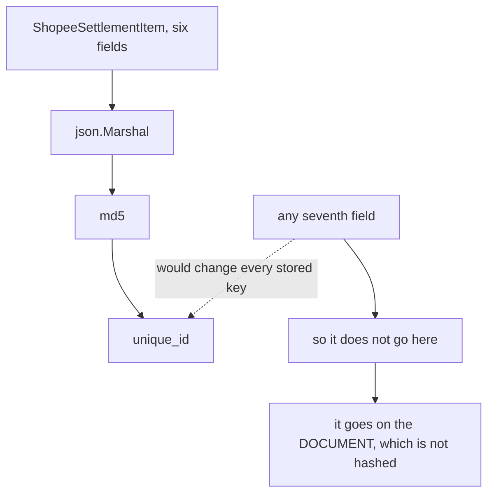

# Decisions — `excel_readers/context.md`

What the owner decided about [context.md](./context.md), recorded before it was acted on.
**Append-only.** Each entry carries what it decided and why.

| Decision | |
| --- | --- |
| [hash-the-whole-struct](#hash-the-whole-struct) | `GenerateUniqueID` is md5 over `json.Marshal(s)` — so the item carries its six fields and nothing else |
| [jakarta-is-the-clock](#jakarta-is-the-clock) | Every Shopee timestamp is read at UTC+7, and that offset is part of the key |
| [dash-is-not-a-reference](#dash-is-not-a-reference) | `No. Pesanan` of `"-"` becomes an empty `OrderRefID` |

---

## hash-the-whole-struct

> Owner (2026-09-24), asked as *"the hash covers every field, so diagnostics cannot be added — hash an
> explicit list, or keep it literal?"* — **"Literal: md5 of json.Marshal(s)"**, against my recommendation.

**The verdict.** `GenerateUniqueID` serialises the whole struct. The consequence is accepted
deliberately: **`ShopeeSettlementItem` stays at exactly the six fields in `context.md`**, and the
things I wanted to add — the spreadsheet row number, the order ref recovered from `Deskripsi`, a
reversal flag, `Status` — **are not fields on it**, because each would silently change every
`unique_id` already stored.

**The spec.**

- The item is the six fields of `context.md`, in that order, with **fixed json tags** so that renaming
  a Go field cannot change the key.
- Anything diagnostic lives on `ShopeeSettlementDocument` instead — the document is never hashed.
- ⚠ **A golden test pins the digest** of known fixture rows. Adding a field then fails a test loudly
  instead of re-importing history silently, which was the whole risk behind the rejected alternative.
- `Status` is therefore **not carried**. A failed withdrawal and its reversal are two rows with
  opposite signs and no label saying which is which — accepted, and the balance is still correct
  because the sign carries it.

## jakarta-is-the-clock

> Owner (2026-09-24): **"Timezone: Asia/Jakarta"** — accepted as recommended.

**The verdict.** A Shopee report states no timezone anywhere, so `2025-12-30 08:37:10` is read as
**UTC+7**. This is not cosmetic: `json.Marshal` of a `time.Time` writes the offset into the string it
hashes, so the zone is **part of the idempotency key** — two importers disagreeing about it would
duplicate every row.

**The spec.** `time.FixedZone("WIB", 7*3600)`, not `time.LoadLocation("Asia/Jakarta")`.

- They are the same offset for every date this system will ever see — Indonesia has had no DST since
  1964 — so both produce the identical `+07:00` in the marshalled key.
- `LoadLocation` needs the IANA database, which **is not present on a stock Windows machine**. It would
  fail at runtime on a developer box and succeed in CI, which is the worst shape a bug can have.

## dash-is-not-a-reference

> Owner (2026-09-24): *"Keep `OrderRefID` verbatim, incl. `-`"* was offered and **not selected**, so
> the stated alternative stands — normalise.

**The verdict.** Where `No. Pesanan` holds the literal string `"-"`, `OrderRefID` is `""`.

**Why it had to be settled now.** It changes the hash, so it is free today and a migration the moment
any `unique_id` is stored.

**The spec.** `"-"` and blank both become `""`. Measured: 116 of 615 rows in
`shopee_wd_tidak_cocok.xlsx`, 27 in `luxy_balance_sisa.xlsx`, 16 in `awan_beban_return.xlsx` — mostly
withdrawals, which genuinely have no order.

⚠ **This does not recover the ref hidden in `Deskripsi`** — for 45 of those 116 the order number is in
the sentence (`… Gagal Terkirim: 251125PMAEX4JH`). Recovering it would be a seventh field, which
[hash-the-whole-struct](#hash-the-whole-struct) forbids on the item. It stays open as a *document*-level
question in the clarify.
