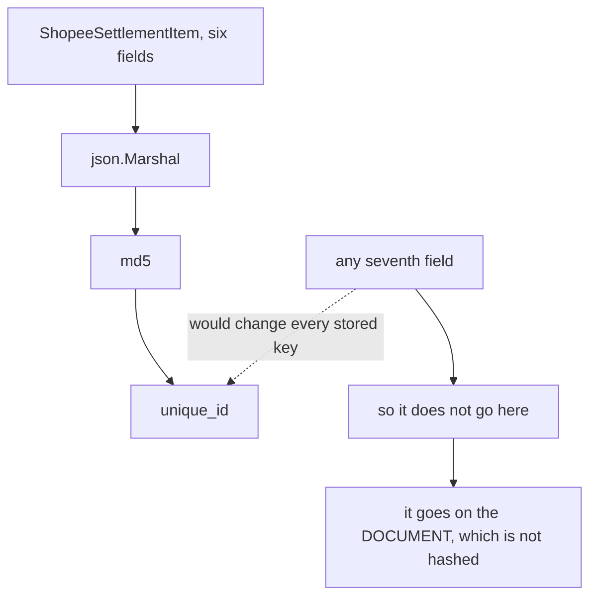
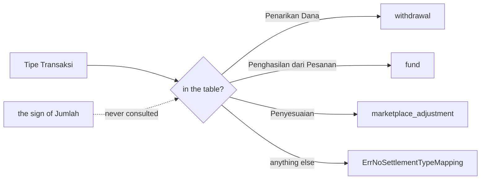
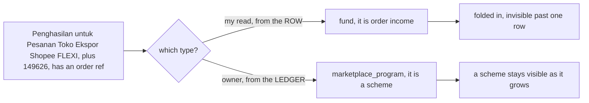
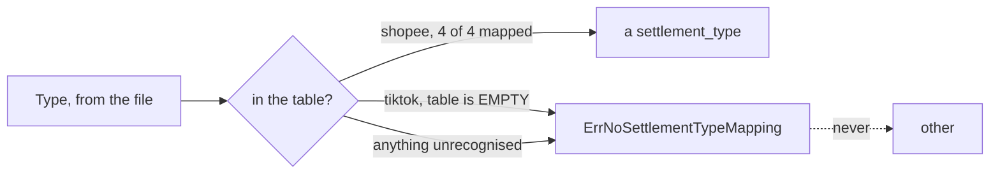
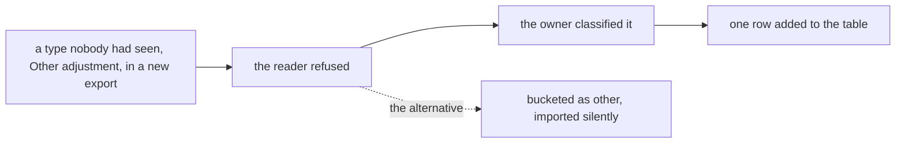
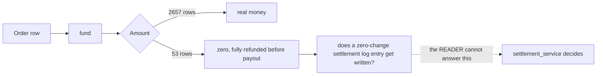
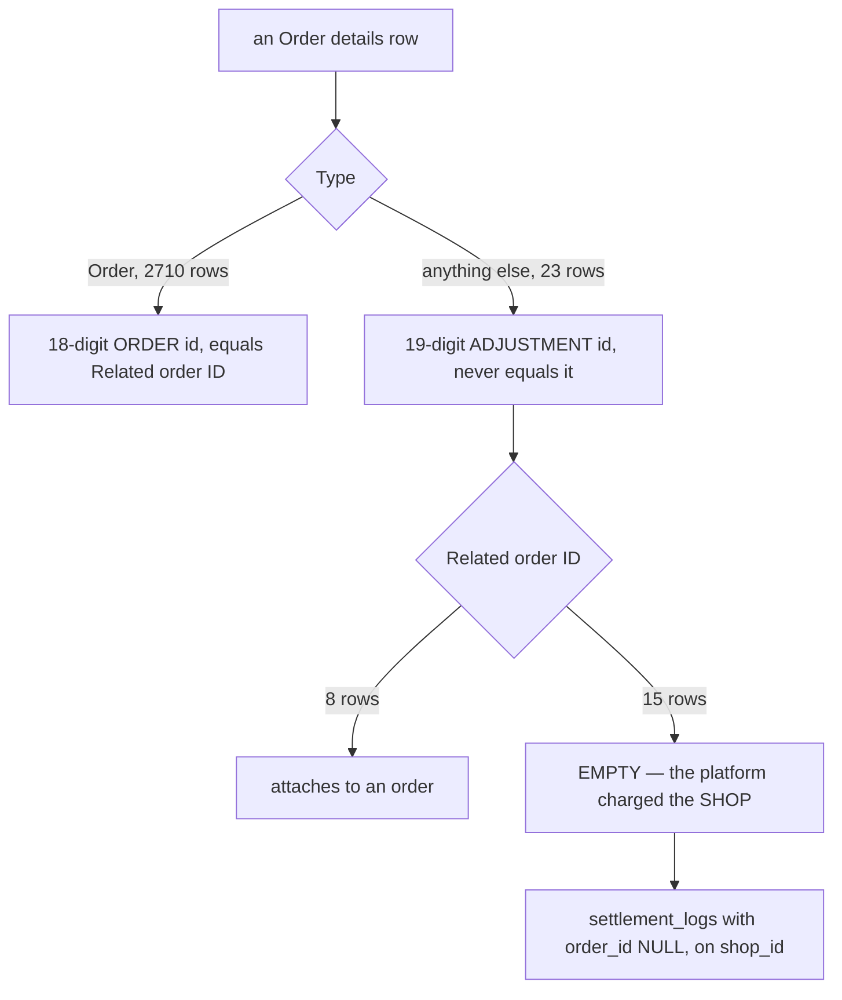

# Decisions — `excel_readers/context.md`

What the owner decided about [context.md](./context.md), recorded before it was acted on.
**Append-only.** Each entry carries what it decided and why.

| Decision | |
| --- | --- |
| [hash-the-whole-struct](#hash-the-whole-struct) | `GenerateUniqueID` is md5 over `json.Marshal(s)` — so the item carries its six fields and nothing else |
| [jakarta-is-the-clock](#jakarta-is-the-clock) | Every Shopee timestamp is read at UTC+7, and that offset is part of the key |
| [dash-is-not-a-reference](#dash-is-not-a-reference) | `No. Pesanan` of `"-"` becomes an empty `OrderRefID` |
| [shopee-maps-on-tipe-transaksi-alone](#shopee-maps-on-tipe-transaksi-alone) | `SettlementType()` is a lookup on `Tipe Transaksi` only, and an unmapped value is an ERROR, never `other` |
| [an-unmapped-type-is-an-error-on-both-platforms](#an-unmapped-type-is-an-error-on-both-platforms) | TikTok uses the same lookup against an EMPTY table — every row errors, nothing panics |
| [other-adjustment-is-a-marketplace-adjustment](#other-adjustment-is-a-marketplace-adjustment) | TikTok `Other adjustment` → `marketplace_adjustment` — the first type the refusal actually caught |
| [logistics-reimbursement-is-its-own-type](#logistics-reimbursement-is-its-own-type) | TikTok `Logistics reimbursement` → `logistic_reimbursement`, an ELEVENTH settlement type |
| [order-is-fund](#order-is-fund) | TikTok `Order` → `fund`, including the 53 sampled orders that settle ZERO |
| [flexi-is-a-marketplace-program](#flexi-is-a-marketplace-program) | FLEXI export income is `marketplace_program` — a TENTH settlement type, not yet in the owner's enum |

---

## hash-the-whole-struct

> Owner (2026-09-24), asked as *"the hash covers every field, so diagnostics cannot be added — hash an
> explicit list, or keep it literal?"* — **"Literal: md5 of json.Marshal(s)"**, against my recommendation.

**The verdict.** `GenerateUniqueID` serialises the whole struct. The consequence is accepted
deliberately: **`ShopeeSettlementItem` stays at exactly the six fields in `context.md`**, and the
things I wanted to add — the spreadsheet row number, the order ref recovered from `Deskripsi`, a
reversal flag, `Status` — **are not fields on it**, because each would silently change every
`unique_id` already stored.

**The spec.**

- The item is the six fields of `context.md`, in that order, with **fixed json tags** so that renaming
  a Go field cannot change the key.
- Anything diagnostic lives on `ShopeeSettlementDocument` instead — the document is never hashed.
- ⚠ **A golden test pins the digest** of known fixture rows. Adding a field then fails a test loudly
  instead of re-importing history silently, which was the whole risk behind the rejected alternative.
- `Status` is therefore **not carried**. A failed withdrawal and its reversal are two rows with
  opposite signs and no label saying which is which — accepted, and the balance is still correct
  because the sign carries it.

## jakarta-is-the-clock

> Owner (2026-09-24): **"Timezone: Asia/Jakarta"** — accepted as recommended.

**The verdict.** A Shopee report states no timezone anywhere, so `2025-12-30 08:37:10` is read as
**UTC+7**. This is not cosmetic: `json.Marshal` of a `time.Time` writes the offset into the string it
hashes, so the zone is **part of the idempotency key** — two importers disagreeing about it would
duplicate every row.

**The spec.** `time.FixedZone("WIB", 7*3600)`, not `time.LoadLocation("Asia/Jakarta")`.

- They are the same offset for every date this system will ever see — Indonesia has had no DST since
  1964 — so both produce the identical `+07:00` in the marshalled key.
- `LoadLocation` needs the IANA database, which **is not present on a stock Windows machine**. It would
  fail at runtime on a developer box and succeed in CI, which is the worst shape a bug can have.

## dash-is-not-a-reference

> Owner (2026-09-24): *"Keep `OrderRefID` verbatim, incl. `-`"* was offered and **not selected**, so
> the stated alternative stands — normalise.

**The verdict.** Where `No. Pesanan` holds the literal string `"-"`, `OrderRefID` is `""`.

**Why it had to be settled now.** It changes the hash, so it is free today and a migration the moment
any `unique_id` is stored.

**The spec.** `"-"` and blank both become `""`. Measured: 116 of 615 rows in
`shopee_wd_tidak_cocok.xlsx`, 27 in `luxy_balance_sisa.xlsx`, 16 in `awan_beban_return.xlsx` — mostly
withdrawals, which genuinely have no order.

⚠ **This does not recover the ref hidden in `Deskripsi`** — for 45 of those 116 the order number is in
the sentence (`… Gagal Terkirim: 251125PMAEX4JH`). Recovering it would be a seventh field, which
[hash-the-whole-struct](#hash-the-whole-struct) forbids on the item. It stays open as a *document*-level
question in the clarify.

## shopee-maps-on-tipe-transaksi-alone

> Owner (2026-09-24): **"if type `Penarikan Dana`, make it `withdrawal`"**, then
> **"else return error unknown"** — confirming the mapping table in `context.md` and how a value
> outside it behaves.

**The verdict.** `ShopeeSettlementItem.SettlementType()` is a lookup on **`Tipe Transaksi` alone**,
and a value not in the table is an **error**, never `other`.

| `Tipe Transaksi` | `SettlementType` | sampled |
| --- | --- | ---: |
| `Penghasilan dari Pesanan` | `fund` | 3555 |
| `Penarikan Dana` | `withdrawal` | 172 |
| `Penyesuaian` | `marketplace_adjustment` | 60 |
| `Program Ekspor Shopee FLEXI` | ⛔ errored — superseded by [flexi-is-a-marketplace-program](#flexi-is-a-marketplace-program) | 1 |

**Why an error and not `other`.** `other` is a real settlement type, so returning it for something
unrecognised makes a new platform behaviour indistinguishable from a deliberate classification —
and it would import silently for months. An error surfaces it on the first file that carries it.

**The sign is not part of the classification.** It rides on `change`. A withdrawal that FAILED is
refunded by a second `Penarikan Dana` row with a **positive** amount, and both are `withdrawal`:
the pair nets to zero because the changes do, not because the types differ. The 34 sampled
negative `Penghasilan dari Pesanan` rows work the same way. `TestShopeeSettlementTypeIgnoresTheSign`
pins it.

**Keying on the column, not the description**, is the other half of the decision. `Tipe Transaksi`
is a closed vocabulary the platform controls; `Deskripsi` is UI copy that changes without notice.
The cost is recorded as an open question — one sampled row is an AMS commission deduction typed
`Penyesuaian`, so it lands in `marketplace_adjustment`, and **no Shopee row ever produces
`external_ads_fee` or `affiliate_fee`.**

## flexi-is-a-marketplace-program

> Owner (2026-09-24): **"for `Program Ekspor Shopee FLEXI` its `marketplace_program`"** — against
> my recommendation of `fund`.

**The verdict.** `Program Ekspor Shopee FLEXI` maps to **`marketplace_program`**, a settlement type
of its own, not to `fund`.

⚠ **`marketplace_program` is a TENTH value.**
[what is `settlement_type`](../../../business/settlement/context.md#what-is-settlement_type) lists
nine and not this one. The constant exists in
[settlement_type.go](../../../../backend/pkgs/san_excel_readers/settlement_type.go) and is marked as
ahead of the doc — **the doc is yours to update** (HARD RULE 7b).

**Why it is better than my `fund`.** I argued from the row: `Penghasilan untuk Pesanan Toko Ekspor
Shopee FLEXI`, `Transaksi Masuk`, `+149626`, carrying an order ref — so, order income. That reads
the row and misses the ledger. Programme income and ordinary sale income arrive on different terms
and are worth separating *at the type*, because a type is what a report groups by. Folding it into
`fund` would have made the FLEXI scheme invisible the moment it grew past one row.

It also generalises: Shopee runs several such schemes, and a second one now has a home rather than
forcing this argument again.

**The result: every transaction type in every sample now maps** — there is no remaining gap, and
`TestShopeeSettlementTypeCoversTheSamples` asserts it with no exclusions.

| `Tipe Transaksi` | `SettlementType` | sampled |
| --- | --- | ---: |
| `Penghasilan dari Pesanan` | `fund` | 3555 |
| `Penarikan Dana` | `withdrawal` | 172 |
| `Penyesuaian` | `marketplace_adjustment` | 60 |
| `Program Ekspor Shopee FLEXI` | `marketplace_program` | 1 |

## an-unmapped-type-is-an-error-on-both-platforms

> Owner (2026-09-24): **"in tiktok make error unknown too"** — applying
> [shopee-maps-on-tipe-transaksi-alone](#shopee-maps-on-tipe-transaksi-alone)'s refusal to the
> TikTok side, which had been panicking.

**The verdict.** `TiktokSettlementItem.SettlementType()` is the same lookup as Shopee's, against a
table that is **empty**. Every row therefore returns `ErrNoSettlementTypeMapping` — not a panic, and
not `other`.

**What changed is the mechanism, not the outcome.** It returned an error before, then panicked as a
deliberate placeholder, and now errors again — but for a different reason: it is no longer *unwritten*,
it is *written against a table with no rows*. The difference matters, because the day `context.md`
gains a TikTok table, the only edit is filling the map.

**Nothing in the package panics any more.** `SettlementType` was the only one.

**The TikTok vocabulary**, re-measured across every sample including the September 2026 one. One row
is decided (see [other-adjustment-is-a-marketplace-adjustment](#other-adjustment-is-a-marketplace-adjustment));
*looks like* is NOT decided.

| `Type` | sampled | |
| --- | ---: | --- |
| `Order` | 2710 | ✅ `fund` — see [order-is-fund](#order-is-fund) |
| `GMV Payment for TikTok Ads` | 10 | looks like `external_ads_fee` |
| `Platform reimbursement` | 4 | looks like `marketplace_adjustment` |
| `Additional Campaign Package` | 4 | ⛔ ads fee or programme — genuinely unclear |
| `Logistics reimbursement` | 3 | ✅ `logistic_reimbursement` — see [logistics-reimbursement-is-its-own-type](#logistics-reimbursement-is-its-own-type) |
| `Other adjustment` | 1 | ✅ `marketplace_adjustment` |
| `Shipping insurance compensation` | 1 | looks like `marketplace_adjustment` |
| `wderror` | 1 | ⛔ probably a hand-edited fixture, not a real platform value |

⚠ **TikTok's fee detail is not a transaction type.** Unlike Shopee, TikTok puts affiliate and ads
charges in *columns* on the order row (`Affiliate Commission`, `Affiliate Shop Ads commission`,
`GMV Max ad fee`, …), not in separate rows. So a per-row `settlement_type` cannot express them at
all — whether those columns become their own settlement log entries is a **separate** question from
this table, and a bigger one.

## other-adjustment-is-a-marketplace-adjustment

> Owner (2026-09-24), hitting the refusal in a real run — *"no settlement type mapped for this
> transaction type: `Other adjustment`"* — **"its `marketplace_adjustment`"**.

**The verdict.** TikTok's `Other adjustment` maps to `marketplace_adjustment`.

**The refusal working as intended.** This is the first time
[an-unmapped-type-is-an-error-on-both-platforms](#an-unmapped-type-is-an-error-on-both-platforms)
actually fired, and it fired on a type **none of the original 13 samples contained** — `Other
adjustment` appears once, in `cannot_open.xlsx`, the September 2026 export. Had the reader bucketed
it into `other`, it would have imported as a deliberate classification and nobody would have
looked.

⚠ **Note the name trap:** the platform's `Other adjustment` is *not* settlement's `other`. It reads
like a match and is not one.

**The table is filled one decision at a time, and six are still open** — see the table under
[an-unmapped-type-is-an-error-on-both-platforms](#an-unmapped-type-is-an-error-on-both-platforms).
`TestTiktokSampleTransactionTypesAreAllKnown` walks every sample and fails on a type this package
has never seen, so the *set* is guarded even while the mapping is incomplete.

## order-is-fund

> Owner (2026-09-24), from a real run — **`"Order"` … its `fund`**.

**The verdict.** TikTok's `Order` maps to `fund`. It is **2710 of the 2734 sampled rows**, so this
one decision takes the table from 1 row of coverage to 99.2%.

| | rows | |
| --- | ---: | --- |
| mapped | 2711 | `Order` → `fund`, `Other adjustment` → `marketplace_adjustment` |
| still refusing | 23 | six types, listed under [an-unmapped-type-is-an-error-on-both-platforms](#an-unmapped-type-is-an-error-on-both-platforms) |

**⚠ 53 of those orders settle ZERO** — `Amount`, `Revenue` and `TotalFees` all `0`, which is the
shape of the item in the owner's own error line. They are sales refunded in full before paying out,
and TikTok still exports a row for each. They classify as `fund` like any other order.

**→ One question this raises for settlement, not for the reader:** is a settlement log entry with
`change = 0` worth writing? The reader returns the row either way — dropping it here would be the
reader deciding what the ledger contains. But a zero-change row moves no money and still consumes a
`unique_id`, so it is worth being deliberate about rather than discovering later.
`TestTiktokZeroSettlementIsStillAnOrder` pins that these classify rather than error.

## logistics-reimbursement-is-its-own-type

> Owner (2026-09-24), from a real run — **`"Logistics reimbursement"` … is `logistic_reimbursement`**.

**The verdict.** A dedicated settlement type, not `marketplace_adjustment`, which is what I had
guessed it "looks like".

⚠ **`logistic_reimbursement` is an ELEVENTH value**, after
[`marketplace_program`](#flexi-is-a-marketplace-program).
[what is `settlement_type`](../../../business/settlement/context.md#what-is-settlement_type) lists
nine — **the doc is yours to update** (HARD RULE 7b).

⚠ **Spelled `logistic`, singular**, where the TikTok column says `Logistics reimbursement`. Kept
verbatim as written. Worth one look before it is stored anywhere: an enum value is cheap to respell
today and a migration afterwards.

**The pattern this makes, and what it means for the four still open.** Two decisions in a row have
minted a *specific* type where I had guessed the generic bucket — FLEXI over `fund`,
this over `marketplace_adjustment`. So my remaining "looks like `marketplace_adjustment`" guesses
are probably wrong in the same direction:

| `Type` | rows | my guess | probably, given the pattern |
| --- | ---: | --- | --- |
| `GMV Payment for TikTok Ads` | 10 | `external_ads_fee` | likely right — the enum already has it |
| `Platform reimbursement` | 4 | `marketplace_adjustment` | more likely its own `platform_reimbursement` |
| `Additional Campaign Package` | 4 | ⛔ unclear | an ads/campaign charge — `external_ads_fee`, or its own |
| `Shipping insurance compensation` | 1 | `marketplace_adjustment` | more likely its own, beside logistic |

---

## ⚠ Found while testing this: 15 of 23 TikTok adjustments have NO order

Not a decision — a measurement, recorded because it lands on settlement's design.

- Only a row typed `Order` carries an **order** id — 18 digits, always equal to `Related order ID`.
- Every other type carries a 19-digit **adjustment** id that **never** equals it. A caller keying on
  `OrderRefID` alone files every reimbursement against an order that does not exist.
- **`RelatedOrderRefID` is empty on 15 of the 23** — the platform charged or paid the *shop*. That is
  settlement's *"settlement that have not `order_id`… addressed to `shop_id`"* arriving from the
  file, and it is the **common** case for adjustments, not an edge.

`TestTiktokAdjustmentsCarryAnAdjustmentID` pins all three. ⚠ I had first written this as "every
adjustment has a related order" and the test caught it on the first run.
