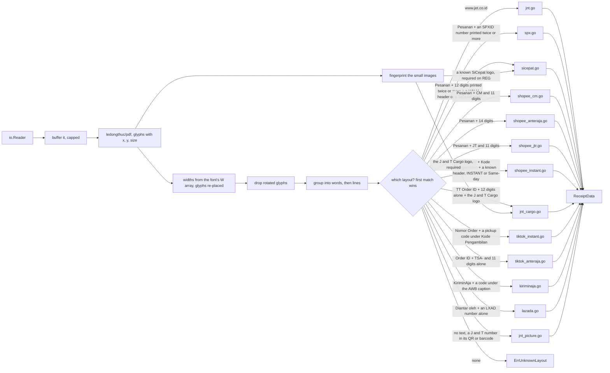
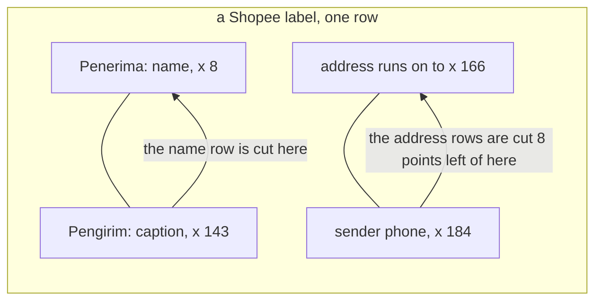
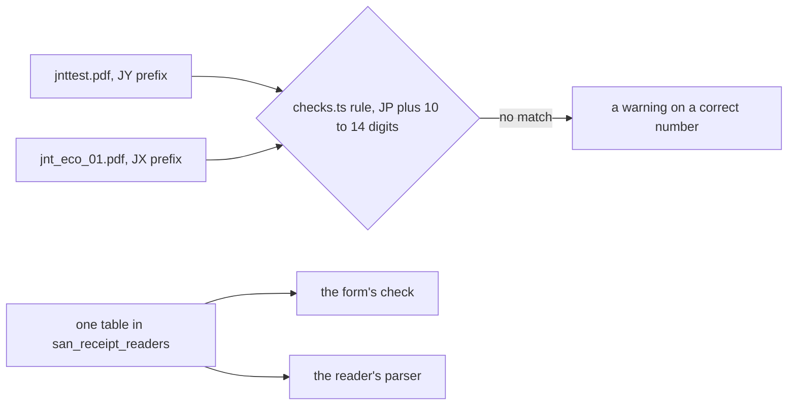

# Clarity — `receipt_readers/context.md`

Critique, questions and warnings about [context.md](./context.md). That doc is yours; this one is
mine. Answered points are **deleted**, so this is always the current open set. What you decided is in
[context_decision.md](./context_decision.md).

> **Measured, not assumed.** Every claim below comes from reading the samples in
> [`examples/receipt_file_samples/`](../../../../examples/receipt_file_samples/) with Go. That's forty-one
> files in this folder: thirty-eight labels (twenty-five Shopee, one printed as pictures; five TikTok; one KiriminAja; six Lazada; one J&T
> printed as a picture) and three that are not labels at all, so they prove the technique, not the coverage. All but `jnttest.pdf`
> came from your iterate tool: live receipts the package couldn't read until now.

---

# What the samples actually are

| | `jnttest.pdf` | `spx_01.pdf` | `spx_02.pdf` |
| --- | --- | --- | --- |
| courier | J&T Express, `ECO`, `COD` | **SPX**, Shopee `INSTANT / SAMEDAY`, cashless | **SPX**, Shopee `STD`, `COD` |
| ⚠ made by | `wkhtmltopdf` + `pdfcpu` | **`PDFium`**, printed from a browser | `PDFium` |
| fonts | Type0, every glyph placed one by one | Type0, **a whole word per text-show**, split at kerning pairs | the same |
| tracking number | `JY1234567890`, printed 5× | ⛔ **none, anywhere**: the text, the barcode AND the QR all say the order number. The receipt is the pickup code ([the-pickup-code-is-the-receipt](./context_decision.md#the-pickup-code-is-the-receipt)) | `SPXID01234567890A` after `No. Resi:`, printed ~16× |
| marketplace order id | `585600000000000001`, after `Order Id :` | `261002AB12CD34`, after `No. Pesanan:` | `261002EF56GH78`, after `No.Pesanan:`, no space |
| courier named by | `www.jet.co.id` in the text | ⚠ **only the SPX logo**, an image (68×27) | the `SPXID` prefix of its tracking number, and the logo (77×24) |
| also printed | weight, date, sender + phone, masked recipient, address, items | the same, plus a pickup code `Kode Pengambilan` | the same, plus sort codes `ANC-A-02`, `AF-87` |

**`shopee_sicepat_02.pdf`** is an **older** SiCepat REG print (April). It has **no strips repeating the number**,
which is printed once, in its `No. Resi:` box. SiCepat now falls back to that box, which is safe only because
12 digits cut short can't pass as 12. Its SiCepat logo is **145×40**, against 122×34 on the newer print.

**`shopee_sicepat_01.pdf`** is the same template for **SiCepat `REG`**. `REG` is also a JNE and a J&T service, so the
header proves nothing here, and the text never says SiCepat. Only the SiCepat logo (122×34) names it, and the
layout requires that logo or the `HALU` header.

**`shopee_grab_express_01.pdf`** is the instant template again, for **GrabExpress**: header `Same-day` rather
than `INSTANT / SAMEDAY`, a pickup code, no tracking number, and the courier only in its logo (127×29). A second
one (`shopee_grab_express_02.pdf`) read but failed your tool's receipt comparison: its order stores the pickup
code as the receipt, so all three instant labels now read it. The
instant layout now recognises a list of headers it has seen, and maps a table of known logos to couriers.

**`shopee_halu_01.pdf`** is the same Shopee template again, with service `HALU` and a 12-digit tracking
number printed 5×. Its text names no courier (see [a-shopee-resi-is-confirmed-by-its-barcode](./context_decision.md#a-shopee-resi-is-confirmed-by-its-barcode)).

**`spx_03.pdf`** is the same SPX template with service `ECO`. ⚠ Its Resi box is too narrow, so the number
**wraps** (`SPXID09876543210` / `A`), and the caption is `Resi:`, not `No. Resi:`. Anchoring on the caption read
nothing. The number is printed whole 7 more times, so it's now read as the `SPXID` token printed most often.

⚠ **The same SPX logo is a different image on the two SPX labels**: 68×27 on one, 77×24 on the other. A logo
compared byte for byte (as `spx_01` was matched) therefore can't name the courier reliably. Text can.

**Proven: Go reads all three.** `github.com/ledongthuc/pdf` (pure Go, BSD) returns the contract fields from
**bytes** in **7–9 ms**, and bad input comes back as an `error`, not a crash. The barcode and the QR were
decoded with `gozxing` in a throwaway module, only to learn what they hold. The package doesn't decode them.



What it took, measured on these samples:

- **The library can't lay the page out by itself.** `GetTextByRow` returned the whole page as ONE row. The
  package groups glyphs itself: sort by `y` then `x`, and break a word at a space glyph, a line change, or a
  gap. The result matches `pdftotext -layout` on both samples.
- ⚠ **It reads no widths from a Type0 font, and both labels use one.** On the SPX label a whole word is one
  text-show, so every glyph came back **at the same x**, and a word split at a kerning pair read as two:
  `INST ANT`, `SAMEDA Y`. Inside an alphanumeric order id, that same split gives a **truncated id with no
  error**. ✅ Fixed: the package reads each font's `W` array itself and re-places the glyphs. A synthetic
  test reproduces the split without the widths and proves it's gone with them.
- **PDFium draws a space as a GAP**, not always as a space glyph. A word break is therefore any gap over
  0.2 em: above kerning, below a space. At 0.5 em, `DKI JAKARTA` came out `DKIJAKARTA`.
- **Rotated text reports a size of cos 90°**: zero on the J&T label, but `3.7e-16` on spx_02's right edge,
  so its edge copies of the tracking number leaked into `Pengirim:`. ✅ Anything under 1 pt is now dropped,
  with a test that fails under the old `≤ 0` rule.
- **Joining glyphs naively is wrong.** Concatenating every glyph glued the tracking number onto the order id
  and "found" `JY12345678905856`. Only grouped lines are safe to match.
- **Once lines exist, every label sits beside its value** (`Order Id :585600000000000001`), so a layout is a
  handful of line regexes, not a geometry problem.

**`tiktok_tokped_jnt_cargo.pdf`** is a **TikTok / Tokopedia** label carried by **J&T Cargo**, made by the same
generator as `jnttest.pdf`. Its tracking number is printed once, alone under the barcode, and its order id
follows `TT Order ID：` with a **full-width** colon. The text never names J&T; only the logo does.

**`kirimin_aja_id_express_01.pdf`** is a **KiriminAja** label, an aggregator the seller books couriers through, here
for **ID Express**. Same generator as TikTok (`wkhtmltopdf`), its own layout: every value sits **under its caption**
(`AWB` over the tracking number), so the number is read by position, whichever courier KiriminAja books. No logo
gates it. Three things are new:

- ⚠ **Bold is faked by drawing the text twice**, 0.034 em apart, and every bold letter came out doubled
  (`NNOONN--CCOODD`), the recipient's name included. ✅ A glyph drawn again within 0.1 em of itself is dropped. A
  real double letter is a glyph's width on (`1200`, `OFF`), and a test pins both.
- **It prints the recipient's phone, in full.** The first sample that fills `Phone` ([Q8](#question)).
- It prints **no marketplace order id**, only KiriminAja's own booking number ([Q11](#question)).

**`lazada_lex_01.pdf`** is a **Lazada** label for its own courier, **LEX**, printed through `PDFium`. It read as an
**empty page**:

- ⚠ **The whole face is one Form XObject**, a drawing the page calls with `Do`, and the library never reads inside
  one. ✅ The package now runs its own copy of the library's text rules and follows `Do` into each form, with its
  matrix and resources. On every earlier sample it returns exactly the library's glyphs, and a test pins that.
- ⚠ **Its font is a subset (`AAAEKH+ArialMT`), and subset widths had never been found**: the widths were keyed by
  the full name, the glyphs by `ArialMT`. ✅ Fixed. Two subsets of one typeface (KiriminAja has both) are merged.
- **Its images can't be decoded**: the library doesn't implement their Flate predictor. No logo is read here, so
  the layout matches on text (`Diantar oleh`, and `LXAD-` with ten digits).
- The order id is printed **with no caption** (now settled: [a-lazada-receipt-is-its-tracking-number](./context_decision.md#a-lazada-receipt-is-its-tracking-number)), and no recipient phone is printed.

**`jnt_eco_01.pdf`** (2026-10-05) is the TikTok J&T Express template, service `ECO`, **printed as one picture**: a
1000×1000 image re-wrapped by `pdfcpu`, with **no text at all**. Nothing a PDF reader can read is on it.

- Its **QR code and its Code 128 both carry the tracking number**. ✅ A page with no text is now scanned for barcodes
  (`gozxing`, MIT, pure Go, 3 ms here), and a J&T-shaped code is the receipt. A page with text is never scanned.
- ⛔ **The order id, the name and the address are only pixels.** They come back `""` ([Q13](#question)).
- ~~A picture stored as JPEG would still fail: the PDF library implements no JPEG filter.~~ Read since
  `shopee_std_01.pdf`, below.

**`shopee_std_01.pdf`** (2026-10-05) is a Shopee **SPX `STD`** label printed through **Microsoft Print To PDF**. It has
**no fonts**: every word is drawn as outlines, so the page has no text. Each graphic is its own **JPEG**: the Shopee
logo, the SPX logo, a QR code and two Code 128s.

- Its **QR code and large Code 128 carry the tracking number, and the small Code 128 the order number.** ✅ The
  barcodes were in images **smaller than the Shopee logo**, so a page with no text now has **every** image scanned
  (up to 16), not only its largest.
- ⚠ **The PDF library has no JPEG filter, and no way to hand over a stream undecoded or say where it is.** ✅ The
  JPEG is found in the file's own bytes: data that starts as a JPEG, is exactly the `Length` its dictionary declares,
  is followed by `endstream`, and whose own header gives the image's size. Go's `image/jpeg` decodes it. Each image is
  guarded on its own, so one broken picture can't cost the others.
- ✅ **The first picture label that gives its order id**, from a barcode. A Shopee order number is read only beside an
  SPX number, because a SiCepat tracking number (twelve digits) has the order number's shape too.
- ⛔ The name and the address are outlines, and come back `""` ([Q13](#question)).

**`shopee_reguler_01.pdf`** (2026-10-05) is the standard Shopee template, service `Reguler`, with a tracking number
of a new shape: `CM` and eleven digits, printed **once**, in the `No. Resi:` box. The label names **no courier**:
no courier text, and its one small image is a "REGULAR SERVICE" badge. Probably JNE, which numbers its marketplace parcels
`CM…`. (Corrected 2026-10-05: I also cited the sort code's shape, but a SiCepat label prints the same shape, so it's
Shopee's.) Read by the exact shape, like the older
SiCepat print. The barcode beside the box decodes to the same number, which is new evidence for [a-shopee-resi-is-confirmed-by-its-barcode](./context_decision.md#a-shopee-resi-is-confirmed-by-its-barcode).

**`shopee_eco_01.pdf`** (2026-10-05) is the same template, service `ECO`, carried by **AnterAja** (its "PakEkoAja"
logo): a fifth Shopee number shape, fourteen digits, again printed once and confirmed by its barcode. Its address
first read as `HOME`: the buyer's address tag sits in a box above the address, in the address's own size, so the
size filter kept it, and the real first line, back at the margin, ended the block. ✅ A row holding only a tag
(`HOME`, `OFFICE`, `RUMAH`, `KANTOR`) is skipped before the address starts.

**`shopee_spx_01.pdf`** (2026-10-05) is an SPX `STD` label that reads cleanly: its number is printed eight times,
all the same. If your tool saved it for a receipt mismatch, the order stores something other than what's printed.

**`shopee_nextday_01.pdf`** (2026-10-05) is a Shopee `NEXT DAY` label carried by **SiCepat** (its `BEST` service): twelve
digits printed once, confirmed by the barcode. The only SiCepat evidence is a third SiCepat logo (40×40, `BEST`),
now in the logo table. A sixth round the barcode-confirmed mode ([a-shopee-resi-is-confirmed-by-its-barcode](./context_decision.md#a-shopee-resi-is-confirmed-by-its-barcode)) would have skipped.

**`shopee_spx_02.pdf`** (2026-10-05) is an SPX `ECO` label for a **reservation**, not an order: it prints `No.Reservasi:`
where every other Shopee label prints `No. Pesanan:`, and its recipient is an **SPX hub** ("… RDC - Pengiriman
Kilat"), not a buyer. Its number is printed eight times. Two things it took:

- The reservation number is 19 characters, and its box **wraps** it. The `Pesan:` line prints it whole in brackets,
  so it's read there, and only when the box's part is how it starts ([Q14](#question)).
- On this variant the region box sits at the address's margin, in the address's size. What sets it apart is
  spacing: 1.4 lines down, where the address lines are one apart. ✅ Once two lines have set the block's spacing,
  a line much further down ends it. One older synthetic fixture had spaced its lines unevenly, unlike any real
  label, and was corrected.

**`tiktok_tokped_jnt_01.pdf`** (2026-10-05) is the TikTok J&T Cargo template again, failing only on its logo: **680×156**,
where the first sample's was 683×157. Same logo, a size smaller, and an exact hash is per size, so it's now a second
row in the logo table. It's also the first label to run over **two pages**: page 2 continues the product list, matches
no layout, and so doesn't count as a second label.

**`lazada_lex_02.pdf`** (2026-10-05) reads without an error, so your tool saved it for a receipt mismatch. Its only
tracking-shaped value is its `LXAD-…` line. ⚠ What the order stores instead is needed to tell why.

**`shopee_sameday_01.pdf`** (2026-10-05) is the instant template carried by **GoSend**, with a third header wording,
`SAMEDAY` alone (after `INSTANT / SAMEDAY` and `Same-day`). Its pickup code sits on a row of its own, apart from the
order number, which the reader never depended on.

**`shopee_jtr_01.pdf`** (2026-10-05) is a Shopee label carried by **JNE Trucking** (`JTR`, its logo says "JNE TRUCKING"):
a `JT` and eleven-digit number, printed once and confirmed by the barcode. ⚠ `JT…` is JNE's here, not J&T's. Its
recipient's name ran into the `Pengirim:` caption with no gap (`(TOKO CEPengirim:`), which cut the name's last
letters. ✅ The part of that word before the caption now ends the name.

**`pdc_sample_01.pdf`** to **`pdc_sample_03.pdf`** (2026-10-05) are one file, byte for byte, attached to three orders, and **not a
receipt**: address labels designed in **Canva**,
captions and values (`Nama Penerima : …`), with no courier, no tracking number, no order id and **no image at all**.
You called them spam, so they're refused
([a-file-that-is-not-a-courier-label-is-refused](./context_decision.md#a-file-that-is-not-a-courier-label-is-refused)),
and `TestSamples` checks they stay refused. ✅ They're now refused as `ErrNotShippingLabel`, so your tool can skip them
([a-non-label-gets-its-own-error](./context_decision.md#a-non-label-gets-its-own-error)).

**`pdc_samples/`** (2026-10-05) is the folder you made for files that are not labels. Two of its three (`01.pdf`, `03.pdf`,
one file) are a **screenshot of a document**, a manual order's note saved through iLovePDF: no text, one image, no barcode.
It slipped past the no-image rule. ✅ No text and no readable code is now a non-label too
([a-picture-with-no-code-is-not-a-label](./context_decision.md#a-picture-with-no-code-is-not-a-label)), and
`TestNotShippingLabels` requires every file in that folder to be refused that way.
Its fourth file, `04.pdf`, is a cross-team order note designed in Canva over a full-page picture: text and an image, so neither
rule caught it. ✅ No barcode and no word shaped like a tracking number is a non-label too
([a-note-with-no-tracking-number-is-not-a-label](./context_decision.md#a-note-with-no-tracking-number-is-not-a-label)).
Your tool has since filed two more there itself, both refused on a live run: cross-team order notes again, one from Canva
and one from Word, with no image, no code and no tracking-shaped word. I checked both by hand: neither is a label.

**`tiktokshop_01.pdf`** (2026-10-05) is **TikTok Shop's instant / same-day** label, a template of its own: no tracking number,
a six-character pickup code printed large under `Kode Pengambilan`, the order id after `Nomor Order:` (not `TT Order ID`),
and the recipient as caption rows. Its one logo is TikTok Shop's own, so it names no courier. Its receipt is the
pickup code, carried over from [the-pickup-code-is-the-receipt](./context_decision.md#the-pickup-code-is-the-receipt)
as the default; your tool's receipt comparison will show whether TikTok orders store it too. ⚠ The name is printed in
full here, unlike TikTok's courier labels; the phone is still masked.

**`shopee_reg_01.pdf`** (2026-10-05) is a SiCepat `REG` label failing only on its logo: **140×40**, a third size of the
SiCepat logo after 122×34 and 145×40, now a row in the logo table. Another round only the logo gate cost ([a-shopee-resi-is-confirmed-by-its-barcode](./context_decision.md#a-shopee-resi-is-confirmed-by-its-barcode)).

**`lazada_lex_03.pdf`** (2026-10-05) is a Lazada label with a second tracking prefix, `JNAP-` and ten digits (service `TAP`),
where the others print `LXAD-`. Two prefixes of one shape, so the reader now checks the shape: four capitals, a dash,
ten digits. It runs to **two pages**, and page 2 captions page 1's uncaptioned 16-digit number as `Nomor Order :`,
which settled what was Q12.

**`shopee_cargo_01.pdf`** (2026-10-05) is a Shopee label carried by **J&T Cargo** (service `CARGO`): twelve digits, SiCepat's
shape, so it's told apart by J&T Cargo's logo, a third size of it. ⚠ Its order number is **cut short with an ellipsis**
(`260101ABCDEF…`, invented here), and the reader would have returned the stump as the order id with no error. ✅ A number ending in `…` is no
longer read; the whole one comes from the `Pesan:` line, when it starts with the stump.

**`shopee_std_02.pdf`** (2026-10-05) reads cleanly: one SPX number, printed eight times and the same in its barcode and QR.
If your tool saved it for a receipt mismatch, the order stores something else, like `lazada_lex_02.pdf` and
`shopee_spx_01.pdf` before it.

**`lazada_lex_04.pdf`** (2026-10-05) is a Lazada `TAP` label carried by J&T: its number is **J&T's own shape** (`JZ` and ten digits,
no dash), not the four-capitals-dash form. Lazada prints each partner courier's own format, so the reader now accepts
either shape, still only alone on its line.

**`tiktok_toped_anteraja_01.pdf`** (2026-10-05) is a TikTok / Tokopedia label (the "tokopedia | Shop" logo) carried by
AnterAja, by your file name: its text never says so. Its number is `TSA-` and eleven digits, alone on its line, and
its order id follows `Order ID：` without the `TT`, which the TikTok order-id rule now allows.

**`shopee_instant_01.pdf`** and **`shopee_halu_02.pdf`** (2026-10-05) read cleanly, so your tool saved them for a receipt
mismatch ([Q17](#question)). `halu_02` also cuts its order number short with `…`, and reads whole thanks to the
`Pesan:` fix.

**`shopee_instant_02.pdf`** (2026-10-05) is the Shopee instant template carried by GoSend with a fourth
header wording, `Instant` alone, now in the list.

**`shopee_id_01.pdf`** (2026-10-05) is a Shopee label carried by **ID Express**: `IDS` and thirteen digits, printed five times and
the same in its barcode, the shape of the KiriminAja ID Express label's `IDE…`. A seventh Shopee number shape, one more
round the barcode-confirmed mode ([a-shopee-resi-is-confirmed-by-its-barcode](./context_decision.md#a-shopee-resi-is-confirmed-by-its-barcode)) would have skipped.

**`shopee_reg_02.pdf`** (2026-10-05) is a Shopee `REG` label carried by **Pos Indonesia** (its "PosAja! | POS IND" logo): `SHPE` and
eighteen capitals and digits, an eighth Shopee shape, the same in its barcode. A hidden tag in another size sits over the
address's last line; the size filter leaves it out.

**`lazada_lex_05.pdf`** and **`lazada_lex_06.pdf`** (2026-10-05): you first said a Lazada receipt is its 16-digit order number, then
withdrew it: `lazada_lex_06`'s receipt is its J&T tracking number. The receipt is the courier's tracking number and the order
id the order number, as originally built
([a-lazada-receipt-is-its-tracking-number](./context_decision.md#a-lazada-receipt-is-its-tracking-number)).


**`shopee_reg_03.pdf`** (2026-10-05) is a SiCepat `REG` label printed on a larger page, so its SiCepat logo comes at a fourth size
(136×45), now in the logo table. The fifth SiCepat logo to cost a round ([a-shopee-resi-is-confirmed-by-its-barcode](./context_decision.md#a-shopee-resi-is-confirmed-by-its-barcode)).

---

# What the recipient block is

Measured on the twenty-two labels with text, for the recipient fields your contract added
([the-reader-reads-the-recipient](./context_decision.md#the-reader-reads-the-recipient)):

| | Shopee (15) | TikTok J&T Cargo | TikTok J&T (`jnttest`) | KiriminAja | Lazada | TikTok Shop instant |
| --- | --- | --- | --- | --- | --- | --- |
| layout | two columns: `Penerima:` (recipient) left, `Pengirim:` (sender) right | one column: sender block, then recipient block | one row: `Penerima :name phone` | two columns: `Penerima` left, `Dari` (sender) right | two columns: `Pengirim:` (sender) left, `Penerima:` **right** | caption rows: `Penerima :`, `Nomor Telepon :`, `Alamat :` |
| name | in full | masked `S** W**O` | masked `a**i` | in full | in full | in full |
| phone | ⛔ none: the one phone is the sender's | masked | masked | ✅ **in full** | ⛔ none | masked |
| address | in full, under `Penerima:` | in full, under the name | region line, then street, down to `Weight` | in full, cut where `Dari` starts | in full, the right column, ending at a gap | in full, under `Alamat :` |



What it took:

- **Two cuts, not one.** The `Pengirim:` caption sits **left** of the sender's own text, and the recipient's
  address runs past it. Cut at the caption, `RT 003 / RW 008` lost `/ RW`, and `sampai dusun` lost `dusun`.
  The address is cut where the sender's **phone** starts. A test reproduces the loss.
- **Glyphs of other sizes are filtered out.** The grey `COD` watermark runs through the address (`JAWA TIMUR`
  came out `JAWCA TIMUROD`), and a hidden element overlaps a SiCepat address glyph by glyph (`1S0uk0am2aJju`).
  Both are a different size, so each address row is rebuilt from the address's own size.
- **The block ends at the margin.** Address lines start at one x. The region boxes under them are centred, so
  the first row that doesn't start at the margin ends the address.

---

# Critique

| | Problem | → Recommend |
| --- | --- | --- |
| **1** | [context.md:12](./context.md) `OrderID sring`: a typo, and it won't compile. | `string`. |
| **2** | **`OrderID` reads as OUR order id.** In this system an order id is `orders.id`, a `uint64`. The marketplace's number is `order_external_ref_id` ([order context](../../../business/order/context.md)), and the sibling package already calls it `OrderRefID` ([excel_readers](../excel_readers/context.md)). | **`OrderRefID`.** One name for the marketplace's number across both readers. `Receipt` for the tracking number is fine: it matches `orders.receipt`. |
| **3** | **`CourierType` is declared, and nothing returns it.** Your contract dropped `Courier` from `ReceiptData` ([courier-is-not-read](./context_decision.md#courier-is-not-read)) and kept `type CourierType string`. A type the contract declares but never uses reads as a promise. | **Remove it from the contract**, unless a field will carry it later. The package keeps the type internally: it's what a logo maps to when a layout needs the logo to match. |
| **4** | **No errors are declared.** (Two are now exported, on your word: `ErrUnreadable` and `ErrNotShippingLabel`, which never overlap.) The caller has to tell "a label we don't know yet" (normal, show nothing) from "a broken file" (worth a message). One bare `error` can't say which. | Sentinel errors, checked with `errors.Is`: `ErrNotPDF`, `ErrTooLarge`, `ErrUnreadable`, `ErrUnknownLayout`, `ErrMultipleReceipts`. Now there is a caller that needs them: `ReceiptCheck`'s `MULTIPLE_LABELS` result can't be told apart from an unknown label until `ErrMultipleReceipts` is exported ([shipment](../../../business/shipment/context_clarify.md#receiptcheck)). |
| **5** | **One `ReceiptData` per file, but a marketplace's bulk print puts many labels in one PDF.** Reading page 1 silently would autofill another order's numbers into this one. | Keep the single return. It fits the only caller, the order form. A file with **more than one label** returns `ErrMultipleReceipts`, never page 1. A bulk reader can be added later as its own function. |
| **6** | **A field missing from a known layout isn't specified.** Error, or empty? | Empty string, no error. An empty field means "the label doesn't print it", the same meaning the order form's stand-in already gives `""` ([checks.ts:161](../../../../frontend/src/features/orders/form/checks.ts#L161)). |
| **7** | **`io.Reader` gets buffered whole, because a PDF is read from its END** (the xref table). Fine for a 60 KB label, but this sample allocates **12 MB per read**, about 200× its size, and the order form accepts 10 MB uploads. | Keep `io.Reader` (it matches excel_readers), and **cap the read at 2 MB** inside `Extract` (`ErrTooLarge`). A label is tens of KB, and the 10 MB form limit exists for photos. |
| **8** | **The library descends from `rsc.io/pdf`, which can panic on malformed files.** My four bad inputs didn't make it panic, but a hostile file can. | `Extract` recovers and returns `ErrUnreadable`. A receipt scan must never take down the server. |
| **9** | **A layout belongs to the app that GENERATED the file, not to the courier.** This J&T label came out of `wkhtmltopdf`. A J&T label printed from another app is a different layout with the same courier. | One file per layout, named for courier + generator once [Q1](#question) says how many generators there are. `Extract` tries each layout's marker (`www.jet.co.id` here) and takes the single match. |
| **10** | **A logo can confirm a courier, never deny one, and now it only GATES a layout.** The same logo comes in several sizes (SPX 68×27 / 77×24, SiCepat 122×34 / 145×40), and the J&T Cargo logo's colour data is solid black, its shape entirely in its alpha mask. So the fingerprint hashes pixels **and** mask (`courierLogos` in `images.go`). With `Courier` dropped, a logo no longer names anything the caller sees. It only decides whether the SiCepat REG and J&T Cargo layouts match. | Keep it exact: a hash match can't be a false positive, and a miss fails visibly. ✅ Settled for Shopee: a label no courier layout reads is read when its barcode confirms its Resi box ([a-shopee-resi-is-confirmed-by-its-barcode](./context_decision.md#a-shopee-resi-is-confirmed-by-its-barcode)), so a new logo size no longer blocks it. |

---

# Proposed Design

> **✅ Built to your contract, including its 2026-10-02 edit** (no `Courier`; `Phone`, `CustomerName`,
> `Address` added), in [`backend/packages/san_receipt_readers/`](../../../../backend/packages/san_receipt_readers/).
> `cd backend/packages/san_receipt_readers && go test -run TestSamples -v` reads every PDF in
> `examples/receipt_file_samples/` and logs all five fields. Critiques 2 and 4–8 are built **as the safe default,
> not decided**: the name stays `OrderID`, and the errors are unexported. The code below is the proposal that
> remains: your contract with those critiques applied.

```
backend/packages/san_receipt_readers/
  receipt.go       Extract: buffer + cap, recover, open, rows, pick the layout
  lines.go         glyphs → positioned words → rows (replaces the library's GetTextByRow)
  widths.go        Type0 glyph widths, which the library ignores
  images.go        logo fingerprints (pixels + alpha mask), the table of known logos
  recipient.go     the recipient block, per template
  jnt.go  jnt_cargo.go  tiktok.go  tiktok_instant.go  tiktok_anteraja.go   TikTok templates
  spx.go  sicepat.go  shopee_instant.go  shopee.go   Shopee templates
  shopee_cm.go     Shopee, a CM number (probably JNE)
  shopee_anteraja.go  Shopee, AnterAja's 14 digits
  shopee_jtr.go    Shopee, JNE Trucking's JT and 11 digits
  shopee_idexpress.go  Shopee, ID Express's ID, a capital and 13 digits
  shopee_pos.go    Shopee, Pos Indonesia's SHPE and 18 characters
  kiriminaja.go    KiriminAja, any courier it books
  lazada.go        Lazada LEX
  content.go       the text interpreter: the library's rules, plus forms
  jnt_picture.go   J&T printed as a picture: the receipt from its QR or barcode
  barcodes.go      decodes a text-less page's barcodes (gozxing)
```

```go
type ReceiptData struct {
    Receipt      string // the tracking number (orders.receipt)
    OrderRefID   string // the marketplace's order id (orders.order_external_ref_id) — critique 2
    Phone        string // the RECIPIENT's — only KiriminAja prints it so far (Q8)
    CustomerName string
    Address      string // printed lines joined by a space (Q10)
}
// "" = not printed, or masked (Q9). CourierType: removed from the contract (critique 3).

var (
    // ✅ decided and built (unreadable-and-not-a-label-are-two-errors): a file is never both
    ErrUnreadable       = errors.New("receipt_readers: the file could not be read") // not a PDF, over 2 MB, broken
    ErrNotShippingLabel = errors.New("receipt_readers: not a shipping label")       // read, and spam

    // still proposed (critique 4): today a caller sees them as "an error that is neither of the two"
    ErrUnknownLayout    = errors.New("receipt_readers: no known label layout")
    ErrMultipleReceipts = errors.New("receipt_readers: more than one label in the file")
)

func Extract(data io.Reader) (ReceiptData, error)
```

## The caller flow

➡ **Moved to shipment.** The caller is `ReceiptCheck` in `shipment_service`
([receipt-check-is-shipments](../../../business/shipment/context_decision.md#receipt-check-is-shipments)). It takes the file's
bytes beside the upload ([receipt-check-takes-the-file-bytes](../../../business/shipment/context_decision.md#receipt-check-takes-the-file-bytes)), returns
what `Extract` reads ([receipt-check-returns-what-the-library-reads](../../../business/shipment/context_decision.md#receipt-check-returns-what-the-library-reads)),
and needs a login ([receipt-check-needs-a-login](../../../business/shipment/context_decision.md#receipt-check-needs-a-login)). The proposed `result` enum, in
which an unknown label is not an error, is in [shipment's clarify](../../../business/shipment/context_clarify.md#receiptcheck). Photos stay [Q4](#question) here.

---

# Contradiction

## the-form-warns-on-a-real-jnt-number

**The example.** [checks.ts:51](../../../../frontend/src/features/orders/form/checks.ts#L51) says a J&T tracking
number is `^JP\d{10,14}$`. Neither real J&T Express label we have matches it: `jnttest.pdf` says
**`JY1234567890`**, and `jnt_eco_01.pdf` (2026-10-05) a **`JX`** number. The rule is the wrong one: it was written
from what had been seen, and neither was among it. Today an order carrying either correct number gets a
"doesn't look like J&T" warning.

**→ Recommend** one format table, kept **in this package**, since this package is what actually reads
real labels. The form's local copy follows it, and every new sample is checked against it by a test. Two
samples, two prefixes: J&T's prefix varies, so the table should say "two capitals and 10–14 digits" (what the
reader already accepts), not a list of prefixes.



---

# Question

> ✅ **Settled by your contract edit and deleted:** *is a Shopee `HALU` label SiCepat?* The courier is no longer
> returned ([courier-is-not-read](./context_decision.md#courier-is-not-read)), so the answer would never reach
> anyone. `HALU` still selects the SiCepat layout, which only decides the tracking number's shape.

1. **Which app produced `jnttest.pdf`?** → **Probably TikTok's own label printer.** `tiktok_tokped_jnt_cargo.pdf`
   is a TikTok / Tokopedia label with the same generator (`wkhtmltopdf` + `pdfcpu`) and the same fonts, and
   `jnttest.pdf`'s order id is a TikTok one. I recommend closing this as "TikTok, J&T Express". Confirm?

> ✅ **Answered and deleted: Q3**, *which service hosts the scan?* `shipment_service`, as `ReceiptCheck`
> ([receipt-check-is-shipments](../../../business/shipment/context_decision.md#receipt-check-is-shipments)).
> ➡ **Re-routed: Q2**, the caller flow, went to shipment as its Q4 and is answered there: the bytes, sent beside the
> upload ([receipt-check-takes-the-file-bytes](../../../business/shipment/context_decision.md#receipt-check-takes-the-file-bytes)).

4. **Do sellers upload photos of labels?** [document.proto:34](../../../../proto/warehouse/document/v1/document.proto#L34)
   accepts both. → I recommend **PDF only** for now: a photo needs OCR, which is a different package with a
   different cost. ⚠ A PDF can hold a photo too: `jnt_eco_01.pdf` is a label printed as a picture
   ([Q13](#question)), so "PDF only" doesn't mean "text only".
5. **Sample privacy.** Every sample carries a buyer's full street address, and now the package **returns**
   it. This repo is **public**, and the samples are untracked today. → I recommend that the PDFs **never get
   committed**: gitignore `examples/receipt_file_samples/`. CI doesn't need them, since the tests build
   synthetic labels.

> ✅ **Answered by your data and deleted: Q6**, *what is a Shopee Instant order's receipt?* It's the pickup code
> (`Kode Pengambilan`), which is what live orders store
> ([the-pickup-code-is-the-receipt](./context_decision.md#the-pickup-code-is-the-receipt)). The numbers below are
> kept as they were.
>
> ✅ **Answered and deleted: Q7**, *should a logo still decide whether a label is read?* Barcode-confirmed: a Shopee
> label no courier layout knows is read from its `Resi:` box when a barcode says the same
> ([a-shopee-resi-is-confirmed-by-its-barcode](./context_decision.md#a-shopee-resi-is-confirmed-by-its-barcode)).

8. **`Phone`: only one label prints the recipient's.** A Shopee label prints only the **sender's** phone, under
   `Pengirim:`, and a TikTok label masks the recipient's (`(+62)81*******00`). The KiriminAja label prints it in
   full, under the name. So `Phone` is filled on one label in thirty-seven.

   ```mermaid
   flowchart LR
     S["Shopee, 15 samples"] --> SP["one phone, the SENDER's"]
     T["TikTok, 3 samples"] --> TP["recipient's phone, masked"]
     K["KiriminAja, 1 sample"] --> KP["recipient's phone, in full"]
     SP --> E["Phone is empty"]
     TP --> E
     KP --> F["Phone is filled"]
   ```

   → I recommend **keeping the field as the recipient's phone**, as built: KiriminAja shows it's printed when the
   label's app has it. Never the sender's: it would autofill the seller's own number as the customer's. Or did
   you mean the sender's?
9. **A masked value: empty, or as printed?** TikTok's courier labels print the name as `a**i` and the phone as
   `(+62)81*******00` (its instant label prints the name in full, the phone still masked).
   Built: anything with a `*` comes back `""`, because autofilling `a**i` as a customer's name is worse than
   leaving the box empty. → I recommend **keeping that**. Do you want the masked form instead?
10. **The address: one string, wrapped words split.** The label's address box wraps **inside** words
    (`Gro` / `gol Sel`, `kelurahan b` / `enda`), and on these PDFs a wrap inside a word can't be told from a wrap
    between words. Built: lines joined by a space, so a split word stays split (`Gro gol Sel`) and is never glued
    to its neighbour (`KALIMANTANBARAT`). Separately, a Shopee label also prints the region in boxes
    (`KOTA JAKARTA BARAT | KEMBANGAN`), which match `order_addresses`' region columns.
    → I recommend **one string as built**, plus a later contract field for the region boxes if the order form
    wants them structured. Your call: it's a contract change.
11. **A KiriminAja label: is its booking number the order id?** It prints no marketplace order id. The only id
    on it is KiriminAja's own, `OID-…`, under `No. Trx KiriminAja`.

    | option | `OrderID` for this label | cost |
    | --- | --- | --- |
    | **a** ✅ | `""`: no marketplace order id is printed | the person types the order's reference, or it stays empty |
    | **b** | the `OID-…` booking number | an aggregator's number in the field every other label fills with the marketplace's |

    → I recommend **a** (built), **unless** your orders store the `OID-…` as their reference. Your iterate tool
    logs `ord.OrderRefID` beside the result, so the next KiriminAja order's log line answers it: if they match,
    switch to **b**.

> ✅ **Answered and deleted: Q12**, *a Lazada label's order id?* The 16-digit order number: the receipt is the courier's
> tracking number ([a-lazada-receipt-is-its-tracking-number](./context_decision.md#a-lazada-receipt-is-its-tracking-number)).

13. **A label printed as a picture: the receipt from its barcode, or OCR for the rest too?** `jnt_eco_01.pdf` has no
    text, only an image of the label. Its QR code and Code 128 carry the tracking number. Everything else is pixels.

    | option | reads | cost |
    | --- | --- | --- |
    | **a** ✅ | `Receipt` from the QR or Code 128, and `OrderID` when a barcode carries it (SPX, `shopee_std_01.pdf`). The recipient `""` | one pure-Go dependency (`gozxing`, MIT), 3 ms a label, 50 ms for five JPEGs |
    | **b** | **a**, plus OCR for the order id and the recipient | Tesseract through cgo (a native library in every server image) or a cloud OCR API (a cost per call, and the buyer's address leaves the system) |
    | **c** | nothing: an error, the person types it all | none, but the one field we can read for free is thrown away |

    ```mermaid
    flowchart LR
      P["a page with no text"] --> B["decode every image's QR and Code 128, JPEGs too"]
      B -->|"a J and T or SPX number, every copy agreeing"| R["Receipt"]
      B -->|"beside an SPX number, a Shopee order number"| OID["OrderID"]
      B -->|"nothing, or not that shape"| U["unknown layout"]
      P -.->|"option b only"| O["OCR: order id, name, address"]
    ```

    → I recommend **a** (built). The receipt is what your tool checks and what the order form needs most, and it's the
    one field that's machine-readable on purpose. Revisit **b** only if picture labels turn out common: your tool
    saves each one it can't read, so the samples folder will show how often they come. *(2026-10-05)* The second one,
    `shopee_std_01.pdf`, carries its order number in a barcode too, so **a** reads it. On that label, OCR would add only
    the recipient.
14. **A Shopee reservation label: is the reservation number the order id?** `shopee_spx_02.pdf` ships to an SPX hub,
    not a buyer, and prints `No.Reservasi:` (19 characters) where an order label prints `No. Pesanan:` (14).

    | option | `OrderID` for this label | cost |
    | --- | --- | --- |
    | **a** ✅ | the reservation number | the form's Shopee reference rule (12–14 characters) would warn on 19 |
    | **b** | `""` | the one Shopee reference on the label is thrown away |

    → I recommend **a** (built): it's Shopee's own number for this shipment, captioned where the order number would
    be. Your tool's log shows `ord.OrderRefID` beside it, which settles it. If they match, the form's rule needs a
    second shape. Related: its `CustomerName` is the hub's name, as printed, because the hub *is* the recipient.
    Does a reservation order belong in the warehouse's order list at all, or is it a stock transfer?

> ✅ **Answered and deleted: Q15**, *a label the seller made: read it or refuse it?* Refuse: it's spam
> ([a-file-that-is-not-a-courier-label-is-refused](./context_decision.md#a-file-that-is-not-a-courier-label-is-refused)).
>
> ✅ **Answered and deleted: Q16**, *a separate error for spam?* Yes: `ErrNotShippingLabel`, for a file that matches no
> layout and has no image ([a-non-label-gets-its-own-error](./context_decision.md#a-non-label-gets-its-own-error)).

17. **Five labels read cleanly, yet don't match what their orders store: what do the orders store?** Your tool saved
    each for a receipt mismatch. Each prints one value, many times, and its barcode agrees.

    | label | the reader returns | so the stored receipt is |
    | --- | --- | --- |
    | `shopee_instant_01.pdf` | its pickup code | ⚠ **not the pickup code**: this one tests [the-pickup-code-is-the-receipt](./context_decision.md#the-pickup-code-is-the-receipt) |
    | `shopee_halu_02.pdf`, `shopee_spx_01.pdf`, `shopee_std_02.pdf` | its tracking number, printed 5–8 times | something else |
    | `lazada_lex_02.pdf` | its `LXAD-…` tracking number (the order number explanation was withdrawn) | something else |

    ```mermaid
    flowchart LR
      L["the label: one value, printed many times"] --> R["Extract's Receipt"]
      O["the order: its stored receipt"] --> C{"equal?"}
      R --> C
      C -->|"no, on five orders"| Q["what does the order store, and why?"]
    ```

    → Please paste the `source` your tool logged on each `receipt not match` line. Three causes would each need a
    different fix: the stored value is **another format** of the same number (the reader can normalise), it was
    **typed by hand** before the label existed (the order is wrong, not the reader), or the parcel was **re-shipped**
    under a new label (the reader is right, and the order should be updated).

> ✅ **Answered and deleted: Q18**, *the submodule: its own Go module, in a new folder?* Yes, all six points as
> recommended: [the-reader-is-a-submodule-with-its-own-module](./context_decision.md#the-reader-is-a-submodule-with-its-own-module).
>
> Re-routed: *are SPX, GrabExpress, J&T Cargo, ID Express, LEX, AnterAja, GoSend and Pos Indonesia shipment channels?* → [shipment Q1](../../../business/shipment/context_clarify.md#question).
> No longer the reader's question, now that it returns no courier. It stands on its own: live orders ship by all eight.
