# Decisions — `receipt_readers/context.md`

What the owner decided about [context.md](./context.md), recorded before it is acted on. Append-only.
The open set is [context_clarify.md](./context_clarify.md).

| | |
| --- | --- |
| ~~[three-fields-only](#three-fields-only)~~ | ⛔ superseded by [the-reader-reads-the-recipient](#the-reader-reads-the-recipient) and [courier-is-not-read](#courier-is-not-read) |
| ~~[the-reader-finds-the-courier](#the-reader-finds-the-courier)~~ | ⛔ superseded by [courier-is-not-read](#courier-is-not-read). What stands: the caller hands over a file and nothing else |
| [a-logo-still-names-the-courier](#a-logo-still-names-the-courier) | Logos stay as courier evidence. The owner declined dropping them |
| [courier-is-not-read](#courier-is-not-read) | `Courier` is gone from `ReceiptData`: too hard to extract |
| [the-reader-reads-the-recipient](#the-reader-reads-the-recipient) | `ReceiptData` adds the recipient: `Phone`, `CustomerName`, `Address` |
| [the-pickup-code-is-the-receipt](#the-pickup-code-is-the-receipt) | An instant / same-day Shopee label's `Receipt` is its pickup code (`Kode Pengambilan`) |
| [a-file-that-is-not-a-courier-label-is-refused](#a-file-that-is-not-a-courier-label-is-refused) | A label the seller made (no courier, no tracking number) is refused, its recipient not read |
| [a-non-label-gets-its-own-error](#a-non-label-gets-its-own-error) | `ErrNotShippingLabel`: a file that is not a shipping label is told apart from a label not yet learned |
| [unreadable-and-not-a-label-are-two-errors](#unreadable-and-not-a-label-are-two-errors) | `ErrUnreadable` (could not read the file) and `ErrNotShippingLabel` (read it, and it is spam) never overlap |
| [a-picture-with-no-code-is-not-a-label](#a-picture-with-no-code-is-not-a-label) | A page with no text and no readable barcode or QR (a screenshot) is `ErrNotShippingLabel` too |
| [a-note-with-no-tracking-number-is-not-a-label](#a-note-with-no-tracking-number-is-not-a-label) | No barcode and no word shaped like a tracking number is `ErrNotShippingLabel` too |
| ~~[a-lazada-receipt-is-its-order-number](#a-lazada-receipt-is-its-order-number)~~ | ⛔ superseded by [a-lazada-receipt-is-its-tracking-number](#a-lazada-receipt-is-its-tracking-number): the owner withdrew the value it rested on |
| [a-shopee-resi-is-confirmed-by-its-barcode](#a-shopee-resi-is-confirmed-by-its-barcode) | A Shopee label no courier layout knows is read from its Resi box when a barcode says the same |
| [a-lazada-receipt-is-its-tracking-number](#a-lazada-receipt-is-its-tracking-number) | A Lazada label's `Receipt` is the courier's tracking number, its `OrderID` the 16-digit order number |
| [the-reader-is-a-submodule-with-its-own-module](#the-reader-is-a-submodule-with-its-own-module) | The package is the public repo `pdcgo/san_receipt_readers`, a submodule at `backend/packages/`, with its own `go.mod` |

---

## three-fields-only

> Owner (2026-10-02), in §Contracts: `ReceiptData { Courier CourierType, Receipt string, OrderID string }`.

**The verdict.** Three fields, the ones the order form fills and checks. The label prints more, and none of
it is read: the order has no column for it, and the buyer's details on it are masked anyway.

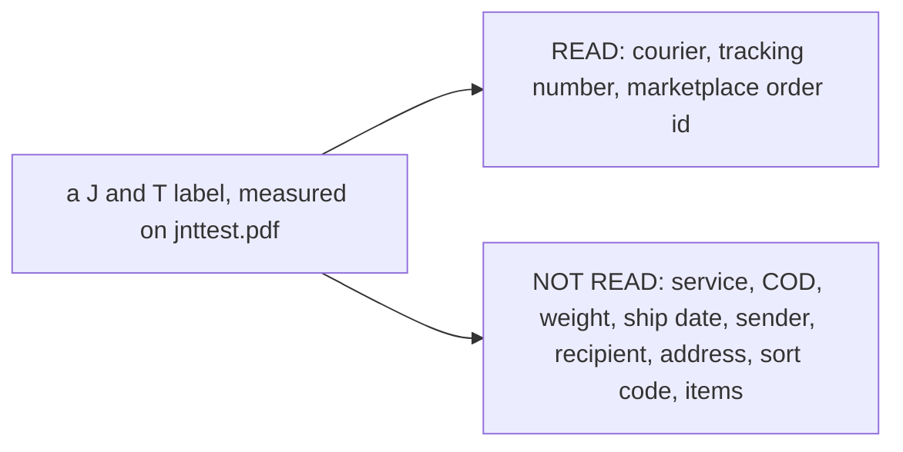

| field | what it is | where it lands |
| --- | --- | --- |
| `Courier` | which courier's label | `shipment_channel_id`, looked up by code |
| `Receipt` | the tracking number | `orders.receipt` |
| `OrderID` | the marketplace's order number | `orders.order_external_ref_id` |

⚠ The field NAME `OrderID` is still open: [critique 2](./context_clarify.md#critique) recommends `OrderRefID`.

---

## the-reader-finds-the-courier

> Owner (2026-10-02), in §Contracts: `func Extract(data io.Reader) (ReceiptData, error)`, with no courier
> argument.

**The verdict.** The caller doesn't say which courier the label is from. `Extract` recognises the layout and
reports the courier back, so a caller can ask about a file without knowing anything about it first.

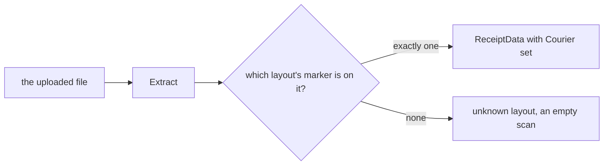

How a layout is recognised (one marker per layout, e.g. `www.jet.co.id`), and what "none" returns, is
proposed in [the clarify](./context_clarify.md#proposed-design) and is not decided yet.

---

## a-logo-still-names-the-courier

> Owner (2026-10-02), asked *"can we ignore logo?"* and then, to my recommendation to drop logos and read
> labels from unknown couriers with an empty courier: **"no"**.

**The verdict.** Logos stay. A known logo (`courierLogos`, matched byte for byte on pixels **and** alpha
mask) still confirms a courier where the label's text names none, and each new logo size is added when its
sample arrives. Read narrowly: the owner declined the bundle, so whether a label from an unknown courier
fails or is read without one stays open ([Q8](./context_clarify.md#question)).

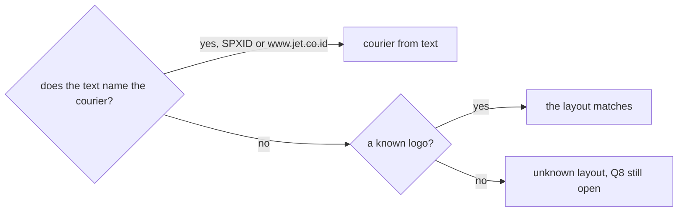

---

## courier-is-not-read

> Owner (2026-10-02), editing §Contracts: *"to hard to extract courier type"*. `Courier` was removed from
> `ReceiptData`. `type CourierType string` stays declared.

**The verdict.** `Extract` no longer reports a courier. It reverses
[the-reader-finds-the-courier](#the-reader-finds-the-courier) and drops one field of
[three-fields-only](#three-fields-only). The evidence agreed: of nine samples, five name their courier only in
a logo, and the same logo came in several sizes.

| | before | after |
| --- | --- | --- |
| `ReceiptData.Courier` | `jnt`, `spx`, `sicepat`, `grabexpress`, `jntcargo` | gone |
| logos | named the courier | only decide whether a layout **matches** (SiCepat REG, J&T Cargo) |
| Q7 *is HALU SiCepat?* | open | moot: the answer is never returned |

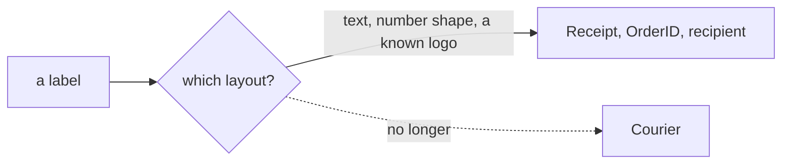

---

## the-reader-reads-the-recipient

> Owner (2026-10-02), editing §Contracts: `ReceiptData` gains `Phone`, `CustomerName`, `Address`.

**The verdict.** The reader also returns who the parcel goes to. Measured on all nine samples:

| field | Shopee (7) | TikTok (2) | built rule |
| --- | --- | --- | --- |
| `CustomerName` | in full, after `Penerima:` | masked: `a**i`, `S** W**O` | a masked value comes back `""` |
| `Phone` | ⛔ not printed: the only phone is the **sender's** | masked: `(+62)81*******00` | `""` on every sample |
| `Address` | in full, left column | in full | printed lines joined by a space |

How it's read is in the [clarify](./context_clarify.md#what-the-recipient-block-is), along with what's still
open about it.

---

## the-pickup-code-is-the-receipt

> Owner (2026-10-02), reporting `shopee_grab_express_02.pdf`, gave its order's stored receipt: a four-character
> code that is that label's `Kode Pengambilan`. Live orders store the pickup code as the order's receipt.
> This answers what was Q6, from the data.

**The verdict.** A Shopee instant / same-day label prints no tracking number, so its `Receipt` is the rider's
**pickup code**, printed beside the order number. That replaces the built `""` (Q6 option a), and was none of
the three options offered: the order number again (b) or a later fetch from Shopee (c).

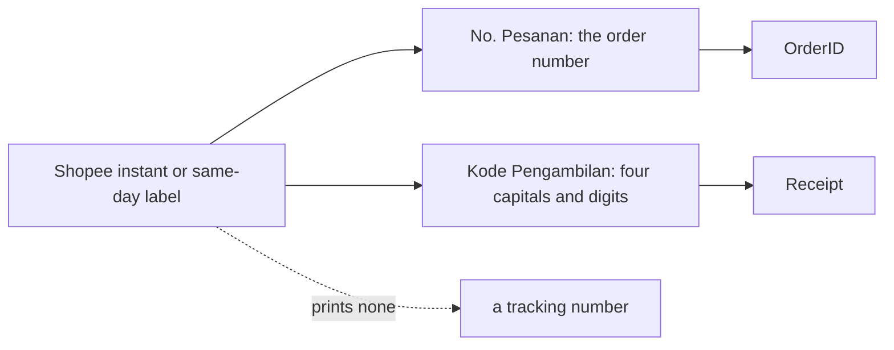

| | spec |
| --- | --- |
| applies to | the instant / same-day layout (`INSTANT / SAMEDAY`, `Same-day`): SPX and GrabExpress so far |
| reads | `Kode Pengambilan:` then exactly **four** `[0-9A-Z]`, ending at a non-alphanumeric or the line end |
| fused to the next word, another length, or two different codes | `""`: no guess |
| the order form | no SPX or GrabExpress format rule exists, so a four-character receipt raises no warning, and it never equals the order number, so `refs-distinct` holds |

---

## a-file-that-is-not-a-courier-label-is-refused

> Owner (2026-10-05), on `pdc_sample_01.pdf`: *"its not real receipt, like spam receipt"*. This answers what was
> Q15.

**The verdict.** A file is a receipt only when it matches a courier's layout. An address label the seller
designed (in Canva: captions and values, with no courier, no tracking number, no order id and no image) is
**refused** with an error, and its recipient is not read. The seller-made layout built the round before is
removed.

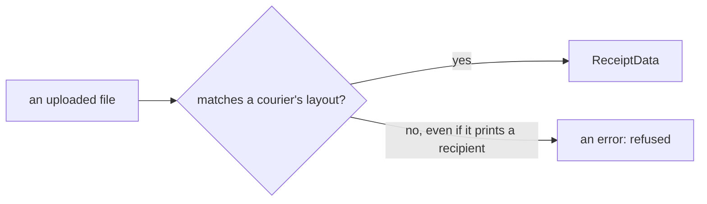

| | spec |
| --- | --- |
| a file matching no courier layout | `errUnknownLayout`, nothing read |
| the samples that prove it | `pdc_sample_01.pdf` and `pdc_sample_02.pdf`, listed in `TestSamples`' `notReceipts`: they must stay refused |
| still open | telling spam apart from a courier label we don't know yet, and whether image recognition helps: Q16 in the clarify |

---

## a-non-label-gets-its-own-error

> Owner (2026-10-05): *"can we have custom error for not shipping label ?"*, after asking whether tiny image
> recognition could spot the spam. This answers what was Q16.

**The verdict.** A file that is not a shipping label gets its own error, **`ErrNotShippingLabel`**, apart from
a courier label the package hasn't learned yet. It is recognised by a measured rule, not by image recognition:
every real label carries an image (a logo, a barcode or a QR), and the spam carries none.

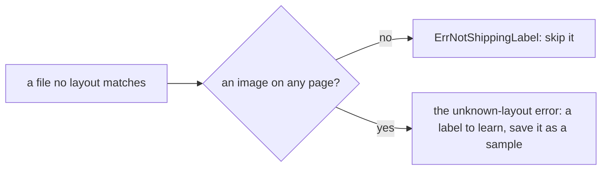

| | spec |
| --- | --- |
| the error | `ErrNotShippingLabel`, exported: the one error a caller can name today (the rest wait on critique 4) |
| when | no layout matched on any page, **and** no page has an image (its forms included, decodable or not) |
| compatibility | it also matches the unknown-layout error, so code that checks for that still treats it as refused |
| a caller | `errors.Is(err, san_receipt_readers.ErrNotShippingLabel)` to skip it |
| not built | image recognition: no pure-Go PDF renderer (it needs MuPDF or PDFium through cgo), a model and labelled data, and it would not catch a copied real label any better |
| known limit | a real label with no image at all would be called a non-label. None of the 23 real samples is one |
| tests | `TestAFileWithNoImageIsNotAShippingLabel`, `TestAnUnknownFileWithAnImageMayBeALabel`, and `TestSamples`' `notReceipts` |

---

## unreadable-and-not-a-label-are-two-errors

> Owner (2026-10-05): *"separate it with error cannot read with can read it but it pdc_sample"*.

**The verdict.** Two exported errors, and a file is never both. **`ErrUnreadable`**: the file could not be read
at all. **`ErrNotShippingLabel`**: it was read, and it is not a courier's label (the `pdc_sample` spam).

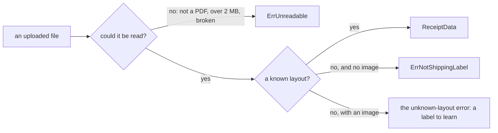

| `ErrUnreadable` covers | how |
| --- | --- |
| not a PDF (no `%PDF-` in the first 1024 bytes) | `errNotPDF` wraps it |
| over 2 MB | `errTooLarge` wraps it |
| a PDF the library can't parse, or a panic inside it | wrapped with the library's message |
| the caller's reader failing | wrapped with the reader's error |

The unknown-layout and more-than-one-label errors stay unexported: a caller tells them apart as "an error that
is neither of the two". `TestUnreadableAndNotAShippingLabelAreTwoErrors` checks that no case lands in both.

---

## a-picture-with-no-code-is-not-a-label

> Owner (2026-10-05): *"sample fail on 03.pdf"*, after filing three files in a new `pdc_samples/` folder as
> non-labels. Two of them (`01.pdf`, `03.pdf`, one file) are a **screenshot of a document**, a manual order's note
> saved through iLovePDF. It has an image, so the first rule
> ([a-non-label-gets-its-own-error](#a-non-label-gets-its-own-error)) let it through as an unknown label.

**The verdict.** `ErrNotShippingLabel` also covers a file that has **no text at all** and **no barcode or QR**
readable from its images. A label printed as a picture always carries one (both picture samples do), and a
screenshot of a document carries none.

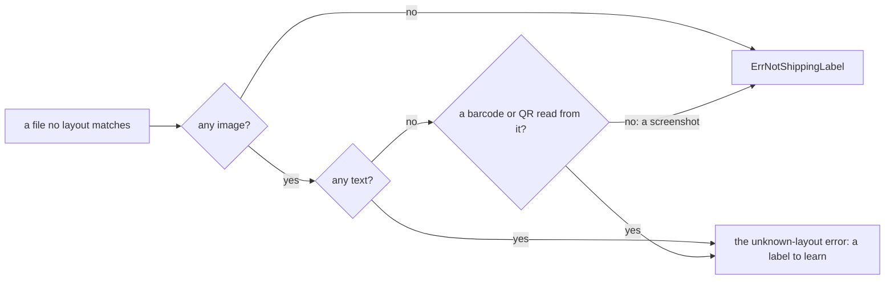

| | spec |
| --- | --- |
| not a shipping label | no layout matched, and either no image on any page, or no text on any page and no code read from any image |
| still an unknown label | text with images (a courier template not learned yet), or a picture whose barcode or QR reads but matches no layout |
| ⚠ known limit | a real label printed as a picture whose barcode **can't** be decoded (blurred, an image format the reader can't open) is now skipped as a non-label instead of saved as a sample. Neither picture sample is one |
| tests | `TestAPictureWithNoCodeIsNotAShippingLabel`, `TestAPictureWhoseCodeIsNotATrackingNumberIsUnknown`, and `TestNotShippingLabels`, which requires every file in `pdc_samples/` to be refused as `ErrNotShippingLabel` and never as `ErrUnreadable` |

---

## a-lazada-receipt-is-its-order-number

> Owner (2026-10-05): *"lazada_lex_05.pdf receipt should be …"*, followed by the label's 16-digit order
> number, not its `LXAD-…` tracking number. It also explains `lazada_lex_02.pdf`'s mismatch (Q17).

**The verdict.** For Lazada, the receipt an order stores is Lazada's **order number**: the sixteen digits printed
alone under the second barcode (and captioned `Nomor Order :` on a two-page label). The courier's tracking number
(`LXAD-…`, `JNAP-…`, `JZ…`) is still read, but only to recognise the layout.

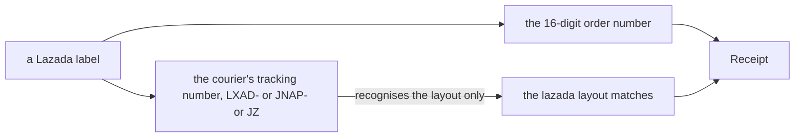

| | spec |
| --- | --- |
| `Receipt` | the only 16-digit line on the label; two different ones read as nothing |
| `OrderID` | `""` for now: the same value in both fields would trip the order form's check that the receipt and the reference differ. What Lazada orders store as their reference is Q12 |
| match | unchanged: the Lazada header, and a tracking number alone on its line |

---

## a-shopee-resi-is-confirmed-by-its-barcode

> Owner (2026-10-05), answering Q7 (*"how should the reader handle a Shopee label from a known template that fails
> only on a new logo size or number shape?"*): **barcode-confirmed**.

**The verdict.** A Shopee label that no courier layout reads is read from its `No. Resi:` box, **when a barcode on the
same page decodes to exactly that value**. If the box and the barcodes disagree, or no barcode can be read, the label
stays unknown, as before. The courier layouts stay, and are tried first; the barcode is decoded only when none of
them matched.

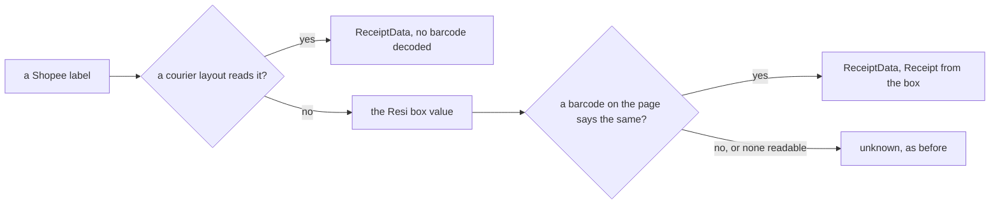

| | spec |
| --- | --- |
| layout | `shopeeBarcodeLayout` (`shopee_barcode.go`), the LAST in the list, on Shopee labels only |
| the box | `Resi:` then eight or more capitals and digits, with a digit in it; its shape is not trusted, the barcode is |
| the barcode | any QR or Code 128 decoded from the page's images (`pageCodes`), decoded only when this layout runs |
| safe against | a box that cut its number short (`spx_03`'s wraps: it disagrees with its barcode, and is not read this way) |
| measured | run alone on every Shopee sample with a Resi box, it returns the **same receipt and order id** as the courier layouts on all eighteen, including the eleven that each needed a round |
| not covered | instant / same-day labels (no Resi box: they print a pickup code), labels printed as pictures, TikTok and Lazada (TikTok draws its barcodes as shapes) |

---

## a-lazada-receipt-is-its-tracking-number

> Owner (2026-10-05): *"im misslead before"*, giving `lazada_lex_06.pdf`'s receipt as its J&T tracking number
> (`JZ…`), not its order number. This reverses
> [a-lazada-receipt-is-its-order-number](#a-lazada-receipt-is-its-order-number), and answers what was Q12.

**The verdict.** A Lazada label's `Receipt` is the **courier's tracking number**, alone on its line in its courier's
shape (`LXAD-…`, `JNAP-…`, `JZ…`). Its `OrderID` is the **16-digit order number**, alone on its line with no caption
on page 1, and captioned `Nomor Order :` on a two-page label's page 2, which confirms what it is.

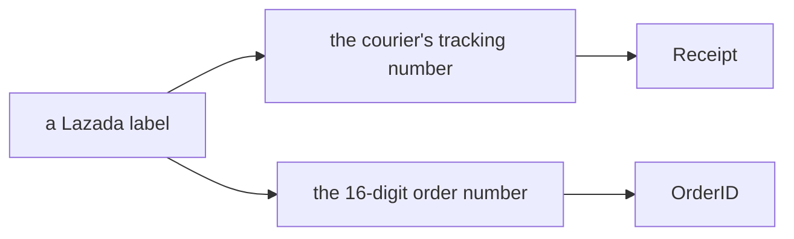

| | spec |
| --- | --- |
| `Receipt` | the only line in a Lazada courier's shape (`readLEXTracking`) |
| `OrderID` | the only 16-digit line (`readLazadaOrderID`) |
| what changed back | the reversed decision had put the order number in `Receipt` and left `OrderID` empty |
| still open | `lazada_lex_02.pdf`'s stored receipt differs from its tracking number again: Q17 |

---

## a-note-with-no-tracking-number-is-not-a-label

> Owner (2026-10-05): *"fails on pdc sample 04.pdf"*, a file filed in `pdc_samples/`, the folder of non-labels: a
> cross-team order note designed in Canva over a full-page background picture. It has text and an image, so neither
> earlier rule caught it.

**The verdict.** A file that no layout reads is also `ErrNotShippingLabel` when it has **no barcode or QR** and **no
word shaped like a tracking number**. Every real label prints its tracking number or encodes it; the note does
neither.

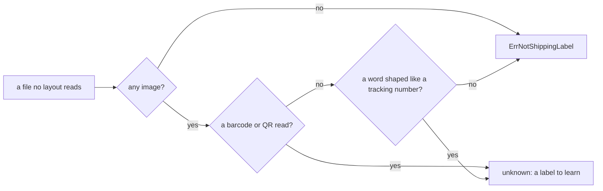

| | spec |
| --- | --- |
| a tracking-shaped word | capitals, digits and dashes, 10 to 30 long, with 10+ digits, or 6+ digits and a letter (`hasTrackingShape`) |
| not one | a date (`02102026`, `2026-09-28`), a sort code (`TTE-TTE024A-TA`) |
| errs toward "unknown" | a phone number written with dashes counts as shaped, so such a file is kept as a sample, never dropped |
| measured | every one of the 38 real labels has a shaped word or a readable code; the Canva address labels are caught by the no-image rule first |
| cost | a text page's barcodes are decoded only on the way to this error, never for a label a layout reads |
| tests | `TestANoteWithNoTrackingNumberIsNotAShippingLabel`, `TestATrackingShapeIsLongAndMostlyDigits`, `TestNotShippingLabels` |

---

## the-reader-is-a-submodule-with-its-own-module

> Owner (2026-10-05), [§General](./context.md): *"its have submodule repo `https://github.com/pdcgo/san_receipt_readers`
> live in `backend/packages/san_receipt_readers`"*. Then, on clarify Q18's recommendations: *"allow move push and
> commit all"*.

**The verdict.** The package is its own public repo, checked out here as a git submodule, and its own Go module.
This repo builds against the checkout, never a published tag.

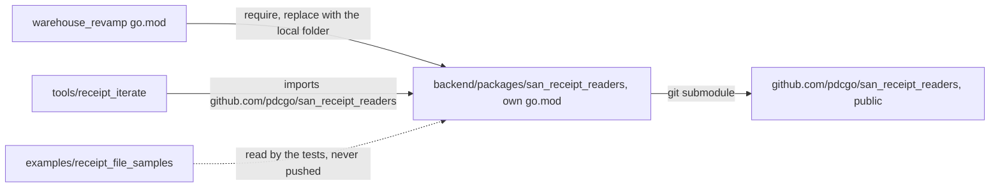

| | spec |
| --- | --- |
| module | `github.com/pdcgo/san_receipt_readers`, its own `go.mod` and `go.sum` |
| folder | `backend/packages/`, meaning "another repo, checked out here", beside `backend/pkgs/` (this repo's own packages) |
| wiring | the root `go.mod` requires it and `replace`s it with `./backend/packages/san_receipt_readers`, so an edit there is seen here at once |
| CI | both checkouts take `submodules: true` (every `go` command reads the replaced folder's `go.mod`), and a step runs `go vet` and `go test` inside each `backend/packages/*`, which the root's `./...` never enters |
| privacy | `*.pdf` is gitignored in the submodule. The real samples stay untracked in this repo's `examples/` ([Q5](./context_clarify.md#question)), and the tests build their labels in code |
| docs | stay here, in `docs/technical/packages/receipt_readers/`. The submodule's README links to them by URL |
| a change | is two commits: one in the submodule (pushed to its repo), then one here moving the submodule pointer |
