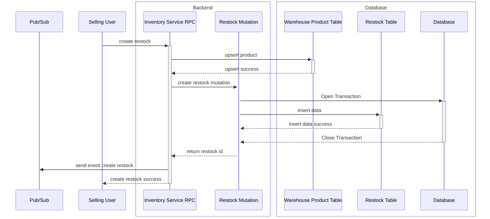
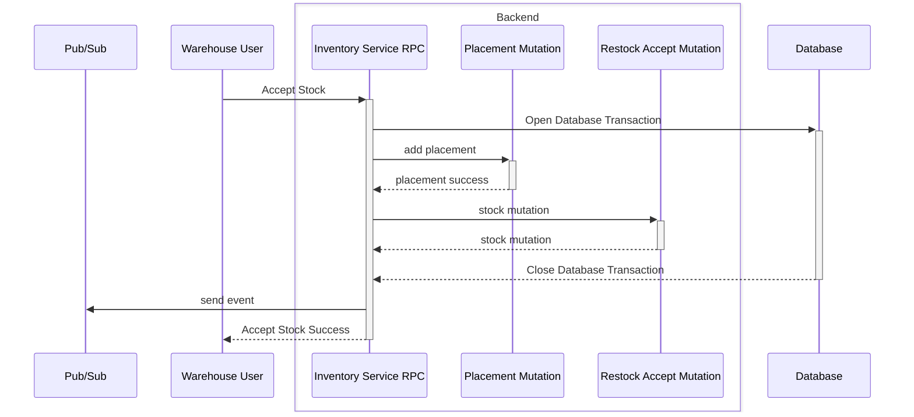
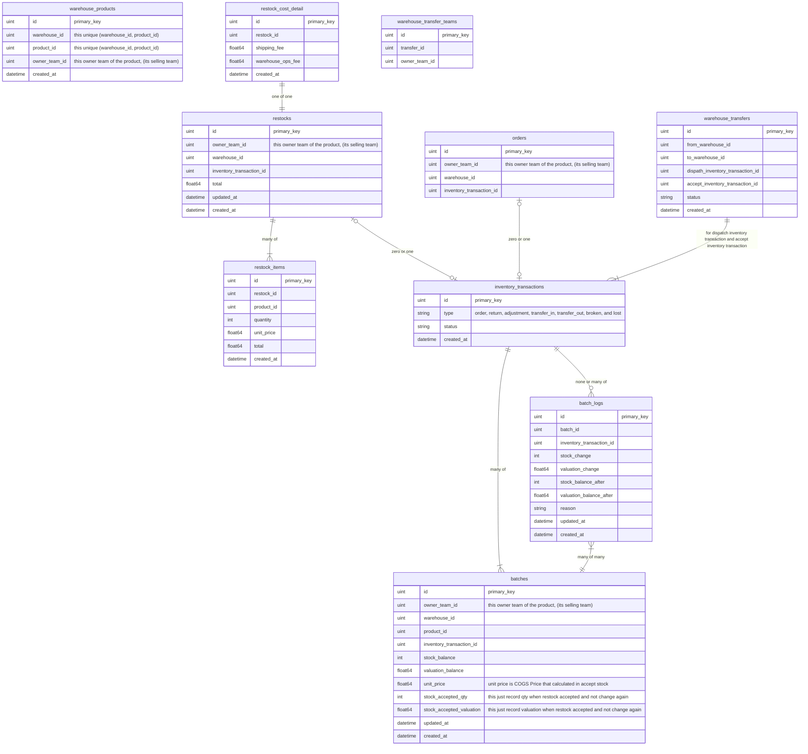
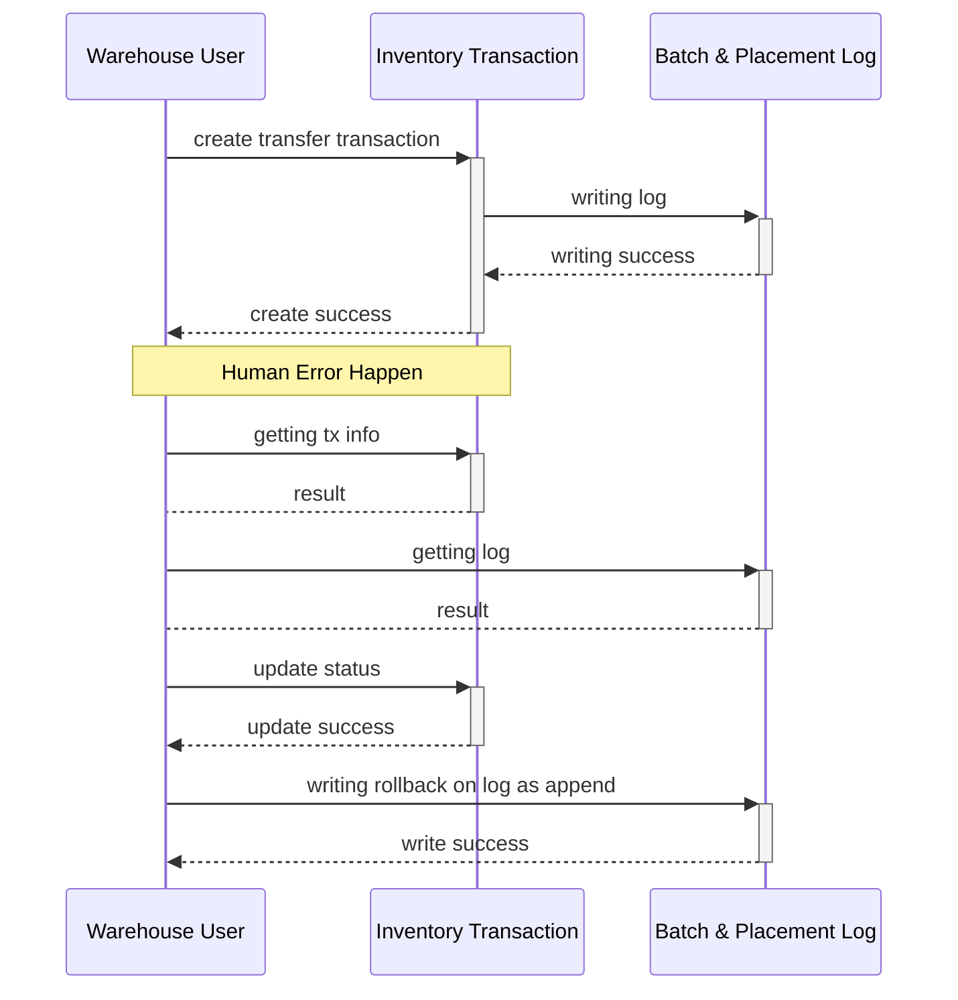
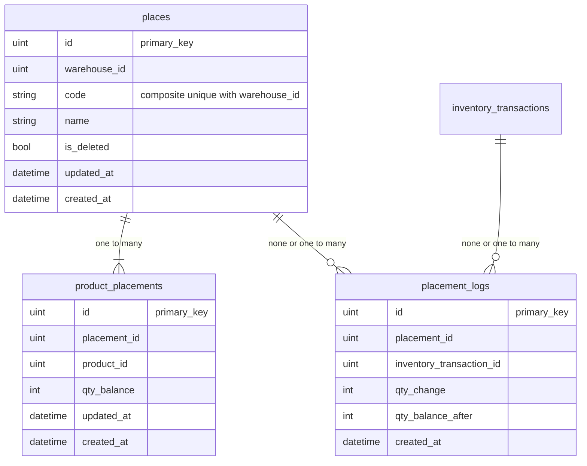
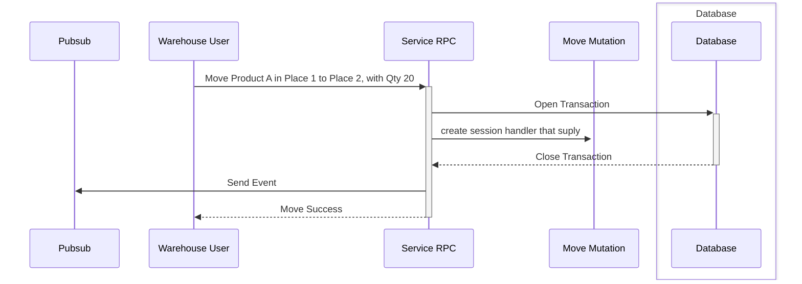

# Stock Design
**This is architectural design for stock related.**

## General Brief
1. In Stock there is 2 component that we track the movement.
    - stock quantity &rarr; that be `int`
    - stock valuation &rarr; that be `float64`
2. The reason valuation used `float64` is because later in [cogs Price](#cogs-price-of-stock) there is additional price that calculate and divided by quantity. for comparing between `float64` we use 4 digit precision.


## Implementing The Ledger from [Mutation & Ledger](../ledger/mutation_and_ledger.md) on Stocks.
1. Because we have 2 thing that be tracked. the `state` should be have:
    - stock_balance
    - valuation_balance
2. Because we have 2 thing that be tracked. the `ledger log` should be have:
    - stock_balance_after
    - valuation_balance_after
    - stock_change
    - valuation_change

4. smallest grain that we tracked is by `batch_id`
5. table `batches` is used of the ledger as `state` with field:
    - stock_balance
    - valuation_balance
6. for the `ledger log`, we table `batch_logs`.


## Flow Of Create Restock.
1. its okay upsert to `warehouse_products` without transaction. its not critical ops.



## Flow Of Accept Stock.
Guideline for accepting stock:
1. there is no unplaced goods, we enforce goods to be placed in placements. so when accepting we already decided where goods to be placed.



## COGS Price of Stock.
Component that COGS Price is Constructed.
- product unit price.
- shipping fee.
- warehouse_ops_fee.

So COGS is:
```math
COGSPrice = ProductUnitPrice + ((ShippingFee + WarehouseOpsFee) / ProductQtyCount)
```
This COGS price is using to unit price in `batches` table.


## Stock Entity Relationship.
1. `warehouse_transfer_teams` table is just dictionary. So we can query in `owner_team_id` side.


## Inventory Transaction Cancelation.
This is flow how transaction to be canceled. this is simplified, locking and open database not included. its just explain how writing data cancel accros table.




## Batch
Batch is usefull data table for how we provisioning stock later.

# Placements Design.
Placement is hold where quantity goods that have been places. For example this Product A placed in two rack, first `Rack A` with qty `90` and `Rack B` with qty `23`.

## General Brief
1. In Placement there is 1 component that we track the movement.
    - stock quantity product on rack &rarr; that be `int`

## Implementing The Ledger from [Mutation & Ledger](../ledger/mutation_and_ledger.md) on Placements.
1. Because we have qty that be tracked. the `state` should be have:
    - qty_balance
2. Because we have qty that be tracked. the `ledger log` should be have:
    - qty_balance_after
    - qty_change

3. for the state we use table `product_placements`.

4. smallest grain that we tracked is by `(placement_id, product_id)` and that must composite unique.
5. for the `ledger log`, we table `placement_logs`.


## Entity Relationship.
1. We stop using term `rack` we use new term `places`. In practical its same, its just physical rack inside warehouse building.
2. `inventory_transactions` table is same table on [Stock ERD](#stock-entity-relationship).
3. when placement deleted, `code` is updated to `[code]_[unix_timestamp_second]`



## How We Moving Goods Between Placements [incomplete].

