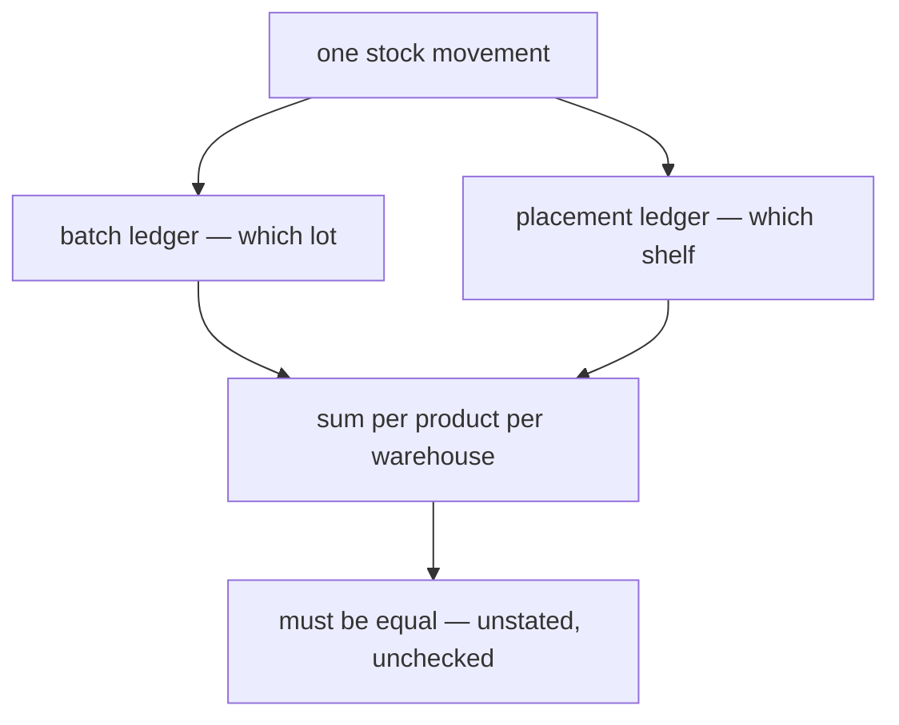

# Clarity — `stock_design.md`

Critique, questions and warnings about [stock_design.md](./design.md). That doc is yours; this one
is mine. Answered points are **deleted**, so this is always the current open set.

> **Full re-examination.** This file had grown to 4× the doc it tracks by appending on every save —
> the thing `disscuss/` is supposed to avoid. Rewritten tight. Nothing dropped that is still open.
>
> **Closed since last pass:** `inventory_transactions.status` exists · `warehouse_transfer_teams` is
> declared a query-side dictionary · deleted places mangle `code` so it can be reused · the Accept
> participant is now named `Restock Accept Mutation`.

---

# Contradiction

## `float64` is a worse answer to division, not a better one

> *"The reason valuation used `float64` is because later in cogs Price there is additional price that
> calculate and divided by quantity."* — `## General Brief` item 2

The premise is right and it is the strongest reason to **drop** float. Division by quantity produces a
non-terminating value, so **the remainder has to go somewhere.** Float does not solve that — it hides
where, and picks a binary approximation you cannot audit. A 1,000 shipping fee over 3 units:

| type | the three unit costs | × 3 |
| --- | --- | --- |
| `float64` | 333.33333333333331… | **999.99999999999989** ≠ 1000 |
| `numeric(_,2)`, remainder to the last | 333.33 · 333.33 · 333.34 | **1000.00** ✅ |
| `int64` rupiah, remainder to the last | 333 · 333 · 334 | **1000** ✅ |

Float is *also* inexact here — it just fails at the 13th decimal instead of the 2nd, and it fails
silently. **The 4-digit comparison rule fixes comparison and not the two things underneath it:**

- **`SUM()` over `float8` is not deterministic in Postgres.** Addition is not associative in floating
  point, and parallel aggregation accumulates partial sums in whatever order the workers finish. The
  same reconcile query over the same unchanged rows can return two different totals on two runs — so
  the value being compared is itself unstable, and a tolerance cannot fix an unstable input.
- **Drift accumulates, a fixed epsilon does not.** 1e-4 is comfortable for a hundred movements and not
  for ten million. The failure mode is that it holds for a year and then starts tripping, with no way
  to tell when the error entered — and the tempting fix is to widen the epsilon.

**→ `int64` rupiah.** Rupiah has no sub-unit in practice, so a fractional currency value is never a real
quantity, and four digits of precision are being spent compensating for an error the type introduced.
Integer division forces you to *state* where the remainder goes, which is auditable and reconciles to
the bank. If sub-rupiah unit costs are genuinely needed (a screw at 33.3), scale the integer — store
`unit_cost` in 1/100 rupiah, or store the line total and derive the unit.

**If float stays, that is your call — but then write the weaker guarantee down.** `## Ledger Log.` says
the log *is* the source of truth for state. With float it reproduces state *to within a tolerance*, so
the doc should say: the tolerance is 1e-4, reconcile compares within it, and a difference below it is
not evidence of a bug. Silence there is what makes a future discrepancy unarguable in both directions.

⚠ **The same reasoning covers all eight money columns** — `valuation_balance`, `unit_price`,
`stock_accepted_valuation`, `valuation_change`, `valuation_balance_after`, `restocks.total`,
`restock_items.total`, and both fees. Quantity as `int` is already right.

## In-transit goods have nowhere to be

`warehouse_transfers` has dispatch and accept transactions, so goods are on a truck for hours or days.
Accept guideline 1 says *"there is no unplaced goods."*

| mid-transit, the ledger says | |
| --- | --- |
| decrement source at dispatch, increment destination at accept | stock exists **nowhere** for the whole journey |
| move nothing until accept | source shows goods that are not on its shelves |
| **an in-transit place** | ✅ every rule still holds |

**→ The third — and the `rack` → `places` rename already paid for it.** Not every location is a rack; a
truck is one more non-rack place. Dispatch and accept become two ordinary placement movements, both
logged.

## The two ledgers must agree and nothing says so

`sum(batches.stock_balance) == sum(product_placements.qty_balance)`, per product per warehouse. Two
mutations, two grains, no constraint. Any operation that writes one and forgets the other drifts
silently — no error, and reconcile has no rule to check.

**→ State it, write both in one transaction (Accept already opens one), and check it nightly.** Both
logs now carry `inventory_transaction_id`, so the per-event form is available:
`sum(qty_change) == sum(stock_change)` for each transaction.

## A cancellation reuses the original transaction

*(Locking and the enclosing transaction are elided by the section's own note — nothing here is about
those.)* The flow gets the hard half right: append-only compensation, both ledgers. But it does
`update status` on the original and appends the reversal under it.

- `sum(stock_change)` for that transaction becomes **zero** — "moved 100" and "moved 100, gave it back"
  are indistinguishable, which is exactly the check above.
- The transaction is typed `restock` while half its rows are a reversal. `return` and `adjustment` are
  in the enum and go unused.
- Nothing links a reversal to what it reverses.

**→ Mint a new transaction typed `adjustment`, referencing the original, with `reverses_id` on the log
rows.** `update status` still makes sense as a flag, not as the record of the movement.

⚠ **Still unanswered, and not a locking question:** cancel a restock accept after 30 of its 100 units
sold and `−100` drives the batch negative. **Refuse once the batch has been touched** — the alternative
is a stocktake adjustment wearing a cancellation's name.

## The transaction type list is missing two values that now have flows

`type` is *"order, return, adjustment, transfer_in, transfer_out, broken, and lost"*. Two of this doc's
own flows have no type in it:

| flow | type it would use |
| --- | --- |
| `## Flow Of Create Restock.` / Accept — and `re \|o--o\| tx` says a restock points at a transaction | **`restock`** — none of the seven fit |
| `## How We Moving Goods Between Placements.` | **`move`** — it is not a transfer, which is between *warehouses* |

**→ Add both.** That list is the most valuable line in the ERD: it reads as the complete inventory of
things that move stock, so a gap in it is either a flow nobody typed or a flow nobody designed. It has
now been the second on two occasions.

## `orders` crosses a service boundary — and you already drew the fix

`ord |o--o| tx` is a real FK, but `order.go` lives in `selling_service/selling_service_models/` while
these tables live in `inventory_service/`. HARD RULE 3: *"a model belongs to exactly one service … that
is a contract question (an RPC)."*

**→ The placements ERD already shows the right pattern** — `tx[inventory_transactions]` drawn as a bare
entity with a note that it is defined elsewhere. Do that for `orders`, or if this row is inventory's own
record *about* an order (its columns suggest so), rename it — `orders` is selling's name for a different
thing.

## The template still says `Restock Create Mutation`

This doc now names its participant **`Restock Accept Mutation`** and puts `StockMutation` in Accept, not
Create. [mutation_and_ledger.md](../ledger/mutation_and_ledger.md) line 37 still teaches the opposite lifecycle,
and it is the doc every other service copies. **→ Rename it there.**

---

# Critique

| | Problem | → Recommend |
| --- | --- | --- |
| **2** | **The COGS formula has a 10× ambiguity and no rounding rule.** `(ShippingFee + WarehouseOpsFee) / ProductQtyCount` — if `ProductQtyCount` is *this line's* quantity, every product absorbs the whole freight and a 3-line restock books it three times. Both readings are grammatical. And the division does not terminate, so `unit_price × quantity` never sums back to what was paid. | Write it `TotalRestockQty` and say so in words — a wrong reading here is silent, the numbers just come out multiples too high. Round the **change**, never the unit cost, and give the remainder its own log row. |
| **2b** | **Apportioning freight by QUANTITY distorts cost.** 100 screws and 1 machine on one delivery each carry the same freight. Every downstream margin inherits it. | **By value** — `fee × (line total / goods total)`. Self-balancing, needs no weight data. If freight really tracks bulk, the honest basis is weight and that means a weight column. Whichever you pick *is* the definition of cost here. |
| **3** | **The publish fires after the transaction closes — in all THREE flows now.** Create, Accept, and Move all `Send Event` after `Close Transaction`, so it is the only step in the system that can succeed or vanish independently of the writes it describes. Crash in between and the stock moved while the stat never hears: no error, no retry, nothing detects it. Three sites means it is the shared write path's default, not an oversight in one diagram. | **Transactional outbox** — event row written inside the transaction, a relay publishes after commit. The transaction already exists in all three, so this is one insert. Fix it once in the shared path and every flow after inherits it. |
| **4** | **`places.is_deleted` can hide stock the ledger still counts.** Soft-delete a place holding 90 units and the shelf vanishes from every list while the 90 stays in the ledger — invisible, still in totals, unfindable by walking the warehouse. Mangling `code` on delete solves reuse, not this. | **Refuse the delete while any `product_placements` row under it is non-zero.** Goods must be moved off first, which is a real ledger movement and what should happen physically. |
| **5** | **`placement_logs` cannot say which product moved.** It has `placement_id` (→ `places`, per the edge) and no `product_id`, but state is keyed `(place, product)`. So a row reads "place 4, tx 91, −12" and cannot be joined to the state row it explains. | **Point it at the state row, as the batch side does** — `batch_logs.batch_id` → `batches`. Use `product_placement_id` → `product_placements`, edge `pst \|\|--o{ pllog`. Restores the product without a column and makes both ledgers structurally identical. |
| **6** | **`product_placements` does not declare its composite unique.** Item 4 says `(placement_id, product_id)` must be — `places` states its constraint inline, so this reads as an oversight. It is the ledger's `ON CONFLICT` target: without it two concurrent Accepts onto one shelf insert two rows and the balance splits in half, silently. | Declare it inline. This is the one constraint that cannot be added quietly later — once duplicates exist the migration that adds the index fails. |
| **7** | **No `warehouse_transfer_items`, so Accept has nothing to verify against.** The transfer says where from, where to and which teams — never *what*. A short delivery is not a discrepancy, it is whatever the receiver types. | `transfer_id`, `batch_id`, **`qty_dispatched` and `qty_accepted`**. The difference *is* the discrepancy, visible without a join, and `adjustment` / `lost` already exist to absorb it. |
| **8** | **`warehouse_transfers` details.** (a) **`dispath_…` is misspelled** — it becomes the struct field and the migration. (b) `accept_inventory_transaction_id` is non-nullable, but "dispatched, not yet arrived" is the normal state for the whole journey, so `0` stands in for "not yet". (c) `\|\|--\|{` says one-to-many where there are two distinct FKs. (d) `status` lists no values. | (a) `dispatch_…`. (b) `*uint`, null until received — that null **is** the in-transit state and is what an "awaiting receipt" screen filters on. (c) Two edges. (d) List them or use an enum. |
| **9** | **Both logs are unattributable.** No `actor_id` on `batch_logs` or `placement_logs`. With two people working one shelf, "which of us wrote this" is the first question a wrong count raises. | Add it to both. |
| **10** | **Three stored totals, no stated invariant** — `restock_items.total`, `restocks.total`, the two fees. Each is derivable from what is below it, so each can drift, and `restocks.total`'s scope is undefined (goods only, or goods + fees?). | Say what it includes, and assert the chain: `restocks.total` = `sum(items.total)` + fees = `sum(valuation_change)` across the batches minted. That catches #2 the day it happens. |
| **11** | **Smaller schema points.** (a) `batches` carries `warehouse_id` + `product_id`, the pair `warehouse_products` declares unique — two sources for one relationship. (b) `bclog }\|--\|\| bch` is correct but its label still reads `"many of many"`. (c) `batch_logs.updated_at` — `placement_logs` correctly omits it, so the two disagree about whether a log row is mutable. (d) `warehouse_transfer_teams` has no composite unique and no edge. | (a) `warehouse_product_id`. (b) `"has many"`. (c) Drop it — that column is the difference between an audit trail and a table. (d) Unique on `(transfer_id, owner_team_id)`, and say it is written in the same transaction as the contents: a scoping dictionary that drifts is an authorization bug, not a display one. |
| **12** | **Naming.** (a) `unit_price` is fixed at accept — its comment says so, but the comment stays in the doc while the name goes into the code, beside two columns that do move. (b) `place` is the verb this domain uses all day, and `places` is now a table. (c) `product_placements` / `placement_logs` do not pair the way `batches` / `batch_logs` do. | (a) `unit_cost_at_receipt`. (b) `locations` carries the same generality without colliding with the verb. (c) Pick one prefix. ⚠ The rename also reaches `RackSelect.tsx`, `features/racks/`, the `racks.select.unplaced` key and `rack.go` — a real cost to schedule, and a half-done rename leaves the UI saying "rack" while the ledger says "place". |
| **13** | **Loose ends.** (a) Neither flow draws an `alt` for commit vs rollback. (b) Create does not draw the `recost` insert, though `recost \|\|--\|\| re` makes it mandatory. (c) The `warehouse_products` upsert is fine outside the transaction, but must be `ON CONFLICT DO NOTHING` or two concurrent restocks for one product fail on the unique index. (d) `int` quantity needs its base unit stated — "3" of what. | Each is a line. (c) is the one that produces a user-visible error today. |
| **14** | **The per-measure rule lives in the instance, not the template.** You settled it here — one `change`/`after` pair per measure, twice over. [mutation_and_ledger.md](../ledger/mutation_and_ledger.md) still shows a single pair and never mentions measures, so the next service invents its own shape. | Promote it. |

---

# Question

1. **Where do in-transit goods live?** I recommend an in-transit place — it is the only option that keeps "no unplaced goods" true.
2. **Is cancellation refused once the batch has been touched?** I recommend yes.
3. **`ProductQtyCount` — this line, or the whole restock?** And by quantity or by value?
4. **Valuation type — `numeric` or integer rupiah?** I recommend `int64` rupiah.

---

# Awaiting

- **`## How We Moving Goods Between Placements.`** — the transaction is opened and closed with the work
  not yet between them, and `mut as Move Mutation` is declared but unused. One thing worth confirming
  when you fill it in, because it is the first operation that touches only **one** ledger: a move is
  **two placement entries under one transaction** (−20 at Place 1, +20 at Place 2) and **no batch entry
  at all** — the lot did not change, only where it sits. That is correct, and the cross-ledger invariant
  survives it: the placement side nets to zero, the batch side has no rows, and `0 == 0` holds. Worth
  saying explicitly in the doc, because "some transactions write only one ledger" is exactly the sort of
  exception that gets coded as a bug the first time someone asserts both must move.

- **`## Batch`** — still one line, saying what a batch is *for* but not what it *is*. Two things would
  close open points: whether a batch is per receipt or per product-per-supplier-per-cost (decides
  whether #2's rounding is one-time or recurring), and whether a batch can be **split or merged** — if
  yes, that is a ledger movement, not an edit.
- **`batch_logs.reason`** is new and unconstrained. If it is for adjustments, it may want the same enum
  treatment as `type`; if it is free text for a human, say so.
