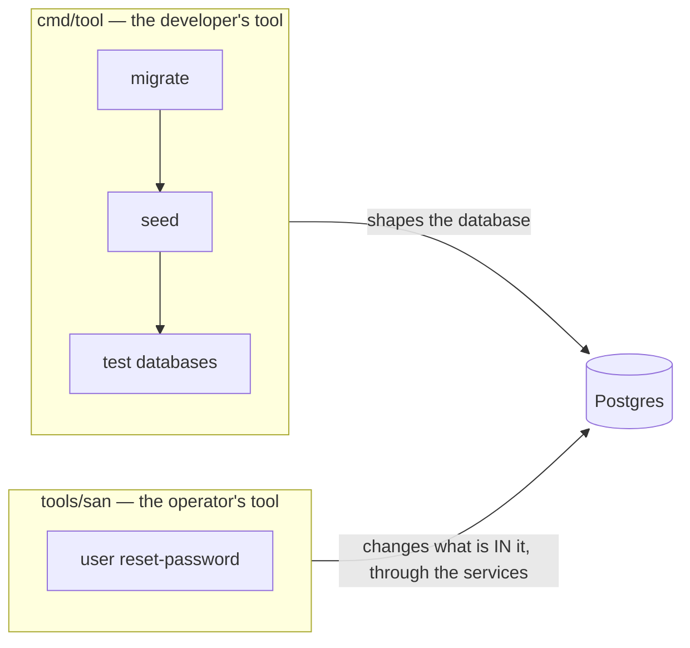
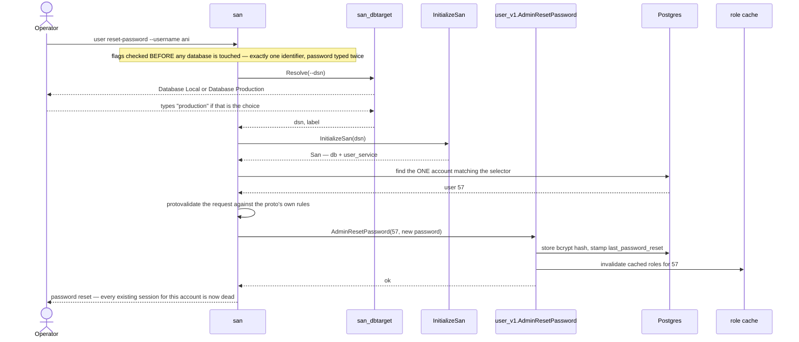
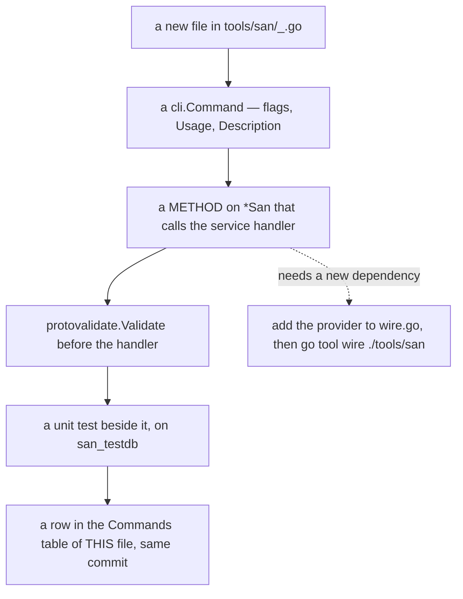

# `san` — the operations CLI

`san` is the tool for **acting on real data by hand**: the things an operator does to a running
system, not the things a developer does to a codebase. It lives at the **repository root** —
[tools/san/](../../tools/san/), not under `backend/`, because it is a tool of the repo rather than a
part of the server — and runs from there.

```sh
go run ./tools/san user reset-password --username ani
```

> ⚠ This tool can act on **production**. Every run picks a database first, and choosing Production
> makes you type the word `production` before anything happens.

---

## Two CLIs, two jobs

| | Owns | Examples |
| --- | --- | --- |
| [`cmd/tool`](../../backend/cmd/tool/) | the **schema** and **fixtures** | `migrate up`, `seed root`, `seed dev`, `db reset-test` |
| [`tools/san`](../../tools/san/) | **operations on real accounts and records** | `user reset-password` |



The split matters because the two are used at different moments by different people. A migration is
part of shipping. A password reset is part of a Tuesday afternoon when somebody cannot log in.

---

## Commands

| Command | What it does |
| --- | --- |
| [`user reset-password`](#user-reset-password) | Set a user's password without knowing the old one |

*(One command so far. Every new one is added to this table — see [Adding a command](#adding-a-command).)*

---

## Global options

| Flag | Env | Meaning |
| --- | --- | --- |
| `--dsn` | `DATABASE_URL` | Postgres DSN. **Skips the Local/Production prompt** — the non-interactive path for scripts and CI. |

It is a persistent flag, so it reads the same on either side of the subcommand:

```sh
go run ./tools/san --dsn "$DSN" user reset-password --username ani
go run ./tools/san user reset-password --username ani --dsn "$DSN"
```

With no `--dsn`, the tool asks:

```
Database:  ▸ Database Local          → POSTGRES_HOST/PORT/USER/PASSWORD/DB, defaults matching docker-compose
             Database Production     → PRODUCTION_DATABASE_URL, and you must type "production" to continue
```

Environment used when a command builds its services:

| Env | Default | Why it matters |
| --- | --- | --- |
| `REDIS_ADDR` | *(empty — in-process cache)* | ⚠ **Set it when acting on a deployment.** A reset evicts the user's cached roles; with no Redis the tool evicts a cache only it can see, and running servers keep serving that user's cached roles for up to ~1 minute. The password change itself is immediate either way. |
| `JWT_SECRET`, `TOKEN_TTL` | dev values | Build the signer. No command mints a token today. |
| `INTERNAL_BASE_URL` | `http://localhost:8080` | Where cross-service clients point. No command reaches that path today. |

---

## `user reset-password`

Sets a user's password **without knowing the old one** — the operator's equivalent of what an admin
does in the UI.

```sh
# interactive: pick the database, then type the password twice, hidden
go run ./tools/san user reset-password --username ani

# non-interactive (CI, scripts)
SAN_PASSWORD='…' go run ./tools/san user reset-password --user-id 57 --dsn "$DSN"
```

| Flag | Env | Notes |
| --- | --- | --- |
| `--username` | | |
| `--email` | | Matched case-insensitively, on `LOWER(email)` |
| `--user-id` | | The unambiguous selector |
| `--password` | `SAN_PASSWORD` | **Prompted (hidden, twice) when omitted** |

**Exactly one** of `--username` / `--email` / `--user-id` is required. Two is an error, not a
precedence rule — a script passing a stale `--username` beside a correct `--user-id` would
otherwise reset the wrong account in silence.

### What actually happens



**The reset is three things, not one.** That is the whole reason this command calls the RPC handler
instead of writing an `UPDATE`:

| Step | If it were skipped |
| --- | --- |
| bcrypt hash stored | — |
| `last_password_reset` stamped | The account's **existing tokens keep working**. An operator who "locked down" a compromised account would have changed nothing for whoever holds its session. |
| cached roles evicted | Stale authorization survives a security event. |

### Output

```
password reset: dev (id=57) on Database Local — every existing session for this account is now dead
```

The database label is always in the line, so the record of what happened says **where** it happened.

### Errors you should expect

| Message | Cause |
| --- | --- |
| `name the account: --username, --email or --user-id` | No identifier given |
| `give exactly ONE of --username, --email or --user-id` | More than one given |
| `no user matches username ani` | Typo, or the account is on another database |
| `more than one user matches … — select by --user-id` | Ambiguous data — select by id |
| `validation error: new_password: must be at least 8 characters` | The **proto's** rule, applied by the CLI |

---

## Adding a command



The rules, and why each exists:

| Rule | Why |
| --- | --- |
| **Drive the service, never the table.** A command calls an RPC handler through `*San`. | An operation is rarely one statement — a password reset is three. A hand-written `UPDATE` is a second copy of that sequence, free to fall behind the first. |
| **`protovalidate.Validate` the request first.** | A handler called directly gets **no validation interceptor**. Re-typing the constraint as an `if len(…) < 8` creates a second minimum that can drift from the proto. |
| **Wire, never hand-wiring** — [`wire.go`](../../tools/san/wire.go), then `go tool wire ./tools/san`. | Same rule as the server (HARD RULE 4). `wire_gen.go` is generated and never hand-edited. |
| **The DSN stays an injector parameter.** | Which database to act on is a per-invocation, guarded, interactive choice. A provider reading it from config would hide that. |
| **Resolve the target through `san_dbtarget`.** | The `type "production" to continue` guard is shared with `cmd/tool` so it cannot protect one CLI and not the other. |
| **A unit test beside the command**, on `san_testdb`. | Same bar as an RPC. Build the `San` directly in the test — Wire would open its own pool and escape the rollback. |
| **Document it here, in the same commit.** | A CLI whose commands are only discoverable by reading `main.go` is a CLI nobody uses. |

Prompt for anything destructive and irreversible, and prefer prompting for a secret over taking it
as a flag — an argument is recorded in shell history and readable from the process list.

---

## Where the code is

| File | |
| --- | --- |
| [`main.go`](../../tools/san/main.go) | the root command and `--dsn` |
| [`san.go`](../../tools/san/san.go) | `San` — what every command is handed — and `withSan` |
| [`wire.go`](../../tools/san/wire.go) | the composition root (`wire_gen.go` is generated) |
| [`deps.go`](../../tools/san/deps.go) | the providers: db, cache, signer, role resolver |
| [`config.go`](../../tools/san/config.go) | env/yaml configuration |
| [`user.go`](../../tools/san/user.go) | the `user` group and the account selector |
| [`user_reset_password.go`](../../tools/san/user_reset_password.go) | the command |
| [`pkgs/san_dbtarget`](../../backend/pkgs/san_dbtarget/) | the Local/Production choice, shared with `cmd/tool` |

A top-level directory can import `backend/…` because the **Go module is rooted at the repository**
(`module github.com/pdcgo/warehouse_revamp`) — one module covering both trees, so `san` needs no
`go.mod` and no `replace` of its own. The consequence to remember: `go build|vet|test ./...` belongs
at the root, since running it inside `backend/` skips this tool entirely.
