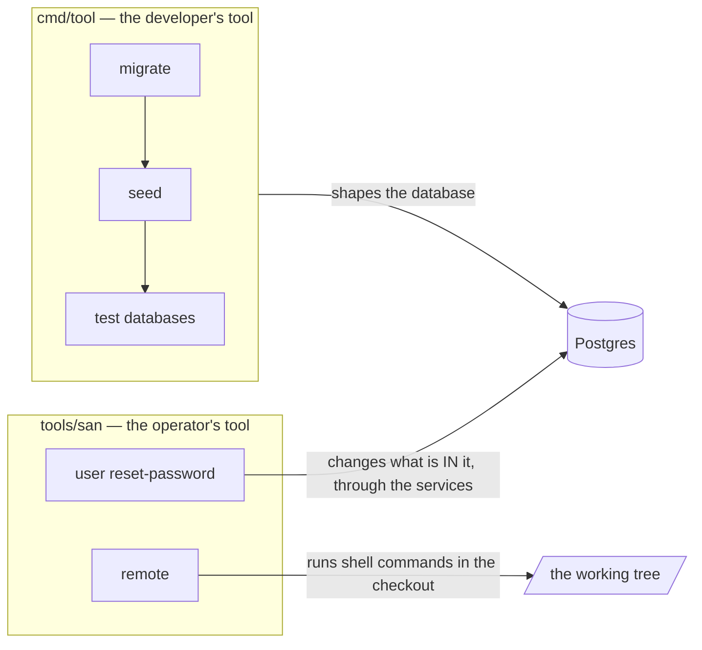
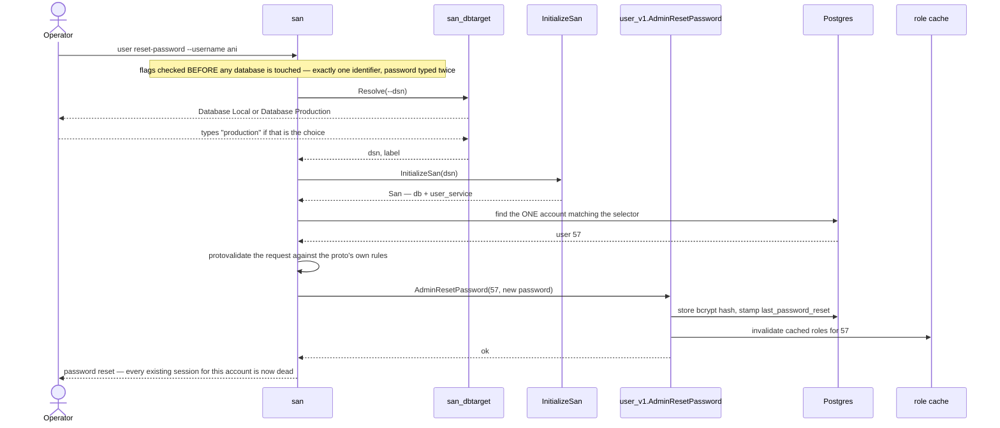
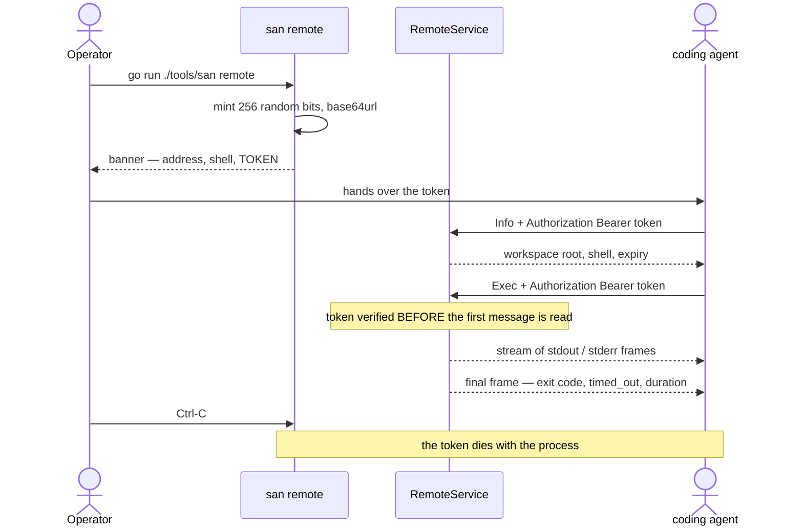
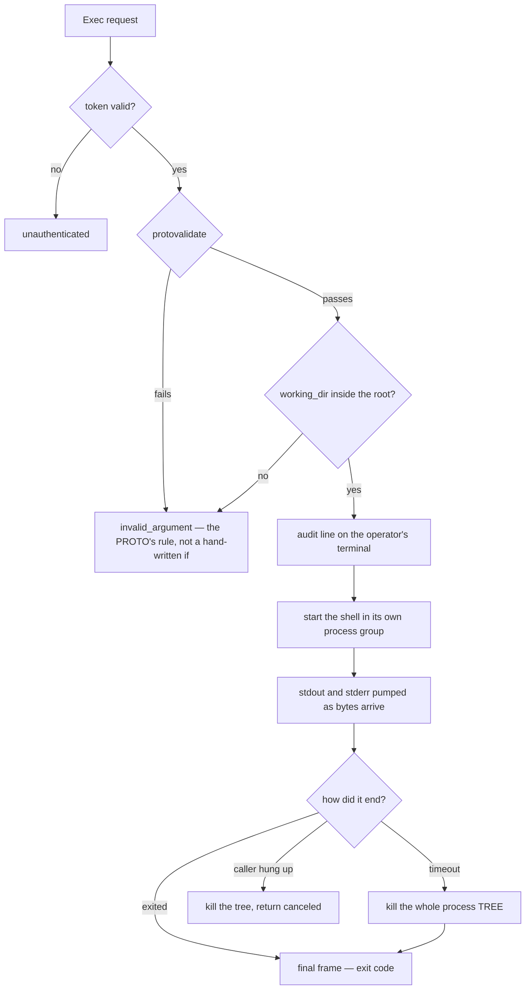
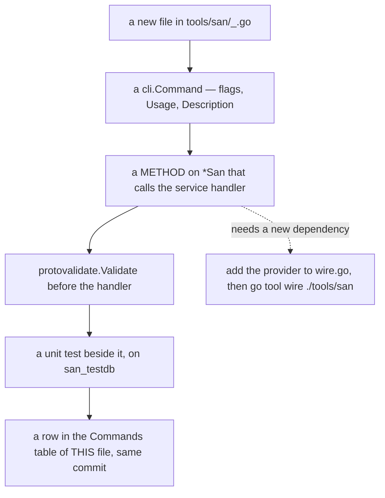

# `san` — the operations CLI

`san` is the tool for **acting on real data by hand**: the things an operator does to a running
system, not the things a developer does to a codebase. It lives at the **repository root** —
[tools/san/](../../tools/san/), not under `backend/`, because it is a tool of the repo rather than a
part of the server — and runs from there.

```sh
go run ./tools/san user reset-password --username ani
```

> ⚠ This tool can act on **production**. Every run picks a database first, and choosing Production
> makes you type the word `production` before anything happens.

---

## Two CLIs, two jobs

| | Owns | Examples |
| --- | --- | --- |
| [`cmd/tool`](../../backend/cmd/tool/) | the **schema** and **fixtures** | `migrate up`, `seed root`, `seed dev`, `db reset-test` |
| [`tools/san`](../../tools/san/) | **operations on a running system** | `user reset-password`, `remote` |



The split matters because the two are used at different moments by different people. A migration is
part of shipping. A password reset is part of a Tuesday afternoon when somebody cannot log in.

`remote` sits in the operator's half for the same reason: it is a thing a human does to a running
machine, not a step in a build.

---

## Commands

| Command | What it does |
| --- | --- |
| [`user reset-password`](#user-reset-password) | Set a user's password without knowing the old one |
| [`remote`](#remote) | Serve this checkout to a coding agent — shell commands, streamed, behind a per-run token |
| [`remote exec`](#remote-exec) | The client: run one command on a `remote` server and stream its output |

*(Every new one is added to this table — see [Adding a command](#adding-a-command).)*

**`remote` is the odd one out** and deliberately so: it is the only command that touches no
database, so it never asks Local/Production and needs no Postgres running. `--dsn` is meaningless
to it.

---

## Global options

| Flag | Env | Meaning |
| --- | --- | --- |
| `--dsn` | `DATABASE_URL` | Postgres DSN. **Skips the Local/Production prompt** — the non-interactive path for scripts and CI. |

It is a persistent flag, so it reads the same on either side of the subcommand:

```sh
go run ./tools/san --dsn "$DSN" user reset-password --username ani
go run ./tools/san user reset-password --username ani --dsn "$DSN"
```

With no `--dsn`, the tool asks:

```
Database:  ▸ Database Local          → POSTGRES_HOST/PORT/USER/PASSWORD/DB, defaults matching docker-compose
             Database Production     → PRODUCTION_DATABASE_URL, and you must type "production" to continue
```

Environment used when a command builds its services:

| Env | Default | Why it matters |
| --- | --- | --- |
| `REDIS_ADDR` | *(empty — in-process cache)* | ⚠ **Set it when acting on a deployment.** A reset evicts the user's cached roles; with no Redis the tool evicts a cache only it can see, and running servers keep serving that user's cached roles for up to ~1 minute. The password change itself is immediate either way. |
| `JWT_SECRET`, `TOKEN_TTL` | dev values | Build the signer. No command mints a token today. |
| `INTERNAL_BASE_URL` | `http://localhost:8080` | Where cross-service clients point. No command reaches that path today. |

---

## `user reset-password`

Sets a user's password **without knowing the old one** — the operator's equivalent of what an admin
does in the UI.

```sh
# interactive: pick the database, then type the password twice, hidden
go run ./tools/san user reset-password --username ani

# non-interactive (CI, scripts)
SAN_PASSWORD='…' go run ./tools/san user reset-password --user-id 57 --dsn "$DSN"
```

| Flag | Env | Notes |
| --- | --- | --- |
| `--username` | | |
| `--email` | | Matched case-insensitively, on `LOWER(email)` |
| `--user-id` | | The unambiguous selector |
| `--password` | `SAN_PASSWORD` | **Prompted (hidden, twice) when omitted** |

**Exactly one** of `--username` / `--email` / `--user-id` is required. Two is an error, not a
precedence rule — a script passing a stale `--username` beside a correct `--user-id` would
otherwise reset the wrong account in silence.

### What actually happens



**The reset is three things, not one.** That is the whole reason this command calls the RPC handler
instead of writing an `UPDATE`:

| Step | If it were skipped |
| --- | --- |
| bcrypt hash stored | — |
| `last_password_reset` stamped | The account's **existing tokens keep working**. An operator who "locked down" a compromised account would have changed nothing for whoever holds its session. |
| cached roles evicted | Stale authorization survives a security event. |

### Output

```
password reset: dev (id=57) on Database Local — every existing session for this account is now dead
```

The database label is always in the line, so the record of what happened says **where** it happened.

### Errors you should expect

| Message | Cause |
| --- | --- |
| `name the account: --username, --email or --user-id` | No identifier given |
| `give exactly ONE of --username, --email or --user-id` | More than one given |
| `no user matches username ani` | Typo, or the account is on another database |
| `more than one user matches … — select by --user-id` | Ambiguous data — select by id |
| `validation error: new_password: must be at least 8 characters` | The **proto's** rule, applied by the CLI |

---

## `remote`

Serves this checkout to an **AI coding agent working from somewhere else**: it runs shell commands
in the working tree and **streams the output as it is produced**, so the agent sees a build fail on
line 40 instead of waiting for the whole run to come back at once.

```sh
# from the repo root — serves the current directory on 127.0.0.1:8099
go run ./tools/san remote

# `serve` is the explicit spelling of the same thing
go run ./tools/san remote serve --root . --addr 127.0.0.1:8099
```

It prints a banner and then stays in the foreground:

```
san remote — serving D:\pdcgo\warehouse_revamp
  address    127.0.0.1:8099
  shell      pwsh -NoProfile -NonInteractive -Command
  token      cjcVOGn-sVONkQzIvgVRWzjcMjQl1q_QtJYxzKmZNG0
  expires    when this server stops

  try it:    go run ./tools/san remote exec --token cjcV… -- "go build ./..."
```

> ⚠ **This is not a sandbox.** Whoever holds the token can run whatever you can run — the workspace
> root stops a mistyped path, not a determined caller, because the command itself can `cd` anywhere.
> The protection is the **token** and the **bind address**. Every command that runs is printed on
> your terminal, which is the other half of the deal: you can watch what the agent does.

### Every run mints a token

There is no shared secret and no config file holding a credential. `san remote` generates **256 bits
of fresh randomness per run**, prints it once, and that token is the only thing that authorizes a
caller. Stop the server and the access is gone.



**Why not the warehouse's own token?** The caller is a program, not a person with roles in a team,
so there is no identity to carry and no role to look up — and minting a fake user would put a shell
behind the credential the login screen also accepts.

It is also what makes streaming work at all. The
[access interceptor](../../backend/services/user_service/access_interceptors/) **refuses every
streaming RPC**, because it reads its team scope from the request **body**, which has not arrived
when an interceptor runs. A bearer token is a **header** — it is there before the first message — so
`remote`'s own interceptor guards unary and streaming calls alike.

### Flags

| Flag | Env | Default | Notes |
| --- | --- | --- | --- |
| `--addr` | | `127.0.0.1:8099` | Anything that is not loopback prints a loud warning |
| `--root` | | the current directory | The workspace. Every `working_dir` resolves inside it |
| `--shell` | | `sh -c`, or PowerShell on Windows | e.g. `"bash -lc"`. Split on spaces |
| `--token` | `SAN_REMOTE_TOKEN` | *minted* | Supply your own instead of minting one |
| `--token-file` | | | Also write the token here, `0600` |
| `--token-ttl` | | *none* | Expire the token; default is "as long as the server" |
| `--exec-timeout` | | `10m` | Used when a request does not name one |
| `--max-exec-timeout` | | `1h` | The ceiling. A request asking for more is **capped, not refused** |

### The contract

[`proto/san/remote/v1/remote.proto`](../../proto/san/remote/v1/remote.proto) — package
`san.remote.v1`, deliberately **not** under `warehouse/`: it is a tool contract, and nothing the
warehouse serves belongs in it.

| RPC | |
| --- | --- |
| `Info` | The handshake — workspace root, the shell your command will be parsed by, when the token dies. Also the cheapest possible token check |
| `Exec` | Runs one command, `returns (stream ExecResponse)` |

`ExecResponse` follows [the long-running-task guideline](../../guidelines/code-implementation-guideline.md):
every frame carries a `message`, and the server's own narration is logged through `slog` bound to
the stream.

| Field | |
| --- | --- |
| `message` | The text of this frame. Forced to valid UTF-8 — proto3 strings must be, and command output is under no such obligation |
| `stream` | `STDOUT` / `STDERR` / `SYSTEM`. SYSTEM is the server talking about the run, not the command talking |
| `result` | **Final frame only** — `exit_code`, `timed_out`, `duration_ms`. Its arrival is how a caller knows the run is over rather than merely quiet |

**A non-zero exit is a RESULT, not an RPC error.** The run happened, and the output of a failing
command is the output a caller most needs. An error comes back only when *nothing ran* — a
`working_dir` outside the root (`invalid_argument`), a shell that will not start (`internal`), a bad
token (`unauthenticated`).

### What a run actually does



Three things in there are not obvious and each exists because the naive version is wrong:

| | |
| --- | --- |
| **The process TREE is killed, not the shell** | `sh -c "go build ./..."` is a shell whose *child* does the work. Killing the shell alone leaves the compiler running with nothing left to report to. Unix uses a process group, Windows `taskkill /T` |
| **Output is read in fixed-size chunks, not lines** | A `bufio.Scanner` waits for a newline, so a progress bar or a prompt would look frozen until the command finished. A rune the read cut in half is held back for the next one |
| **The deadline hangs off the REQUEST context** | So the command dies both when it overruns *and* when the caller hangs up. An agent that crashes mid-build does not leave the build running |

### Errors you should expect

| Message | Cause |
| --- | --- |
| `unauthenticated: remote: invalid token` | Wrong token, or none. Deliberately the same code for missing, wrong and expired |
| `invalid_argument: working_dir escapes the workspace root: "../.."` | A path climbing out of `--root` |
| `invalid_argument: … command: value length must be at least 1` | The **proto's** `min_len`, applied by the validation interceptor |
| `internal: exec: "sh": executable file not found` | `--shell` names something that is not installed |

---

## `remote exec`

The client — one command, streamed, **exiting with the remote command's own status**. It exists so
a server can be checked by hand, and as a reference consumer of the streaming contract: an agent
writing its own client can read [`remote_exec.go`](../../tools/san/remote_exec.go) and see exactly
which frames matter.

```sh
export SAN_REMOTE_TOKEN=…                       # the token the server printed

go run ./tools/san remote exec --info           # the handshake
go run ./tools/san remote exec -- "go build ./..."
go run ./tools/san remote exec --dir backend -- "go test ./..."
```

| Flag | Env | Default | |
| --- | --- | --- | --- |
| `--url` | | `http://127.0.0.1:8099` | Base URL of the server |
| `--token` | `SAN_REMOTE_TOKEN` | | Required |
| `--dir` | | the root | Relative to the server's workspace root |
| `--timeout` | | the server's own | |
| `--info` | | | Print `Info` and run nothing |

stdout goes to stdout, stderr to stderr, and the server's narration to stderr with a **`san:`**
prefix so a script parsing the output can never mistake it for the command's own. The exit status is
the remote command's, and **124** means it timed out — the same convention `timeout(1)` uses.

> ⚠ Under `go run` the status is masked: `go run` prints `exit status 7` and exits **1** itself.
> Build the binary if a script needs to branch on the code.

---

## Adding a command



The rules, and why each exists:

| Rule | Why |
| --- | --- |
| **Drive the service, never the table.** A command calls an RPC handler through `*San`. | An operation is rarely one statement — a password reset is three. A hand-written `UPDATE` is a second copy of that sequence, free to fall behind the first. |
| **`protovalidate.Validate` the request first.** | A handler called directly gets **no validation interceptor**. Re-typing the constraint as an `if len(…) < 8` creates a second minimum that can drift from the proto. |
| **Wire, never hand-wiring** — [`wire.go`](../../tools/san/wire.go), then `go tool wire ./tools/san`. | Same rule as the server (HARD RULE 4). `wire_gen.go` is generated and never hand-edited. |
| **The DSN stays an injector parameter.** | Which database to act on is a per-invocation, guarded, interactive choice. A provider reading it from config would hide that. |
| **Resolve the target through `san_dbtarget`.** | The `type "production" to continue` guard is shared with `cmd/tool` so it cannot protect one CLI and not the other. |
| **A unit test beside the command**, on `san_testdb`. | Same bar as an RPC. Build the `San` directly in the test — Wire would open its own pool and escape the rollback. |
| **Document it here, in the same commit.** | A CLI whose commands are only discoverable by reading `main.go` is a CLI nobody uses. |

Prompt for anything destructive and irreversible, and prefer prompting for a secret over taking it
as a flag — an argument is recorded in shell history and readable from the process list.

### Two shapes, and which rules apply

Those rules are about a command that **acts on data**. [`remote`](#remote) does not, and applying
them to it would be cargo cult — so be explicit about which shape a new command is:

| | a **data** command (`user reset-password`) | a **machine** command (`remote`) |
| --- | --- | --- |
| Picks a database | yes, through `san_dbtarget` | **no** — it would ask a question with no bearing on what happens |
| Goes through `withSan` / Wire | yes — the graph IS "the services for the chosen database" | no; its one dependency is a config built from flags |
| `protovalidate` | before calling the handler by hand | done by the **validation interceptor**, because it really is served over RPC |
| Test harness | `san_testdb`, per-test transaction | a real server + the generated client, so the interceptor is tested too |

What does **not** change either way: a unit test beside the file, and a row in the Commands table of
this document in the same commit.

---

## Where the code is

| File | |
| --- | --- |
| [`main.go`](../../tools/san/main.go) | the root command and `--dsn` |
| [`san.go`](../../tools/san/san.go) | `San` — what every command is handed — and `withSan` |
| [`wire.go`](../../tools/san/wire.go) | the composition root (`wire_gen.go` is generated) |
| [`deps.go`](../../tools/san/deps.go) | the providers: db, cache, signer, role resolver |
| [`config.go`](../../tools/san/config.go) | env/yaml configuration |
| [`user.go`](../../tools/san/user.go) | the `user` group and the account selector |
| [`user_reset_password.go`](../../tools/san/user_reset_password.go) | the command |
| [`remote.go`](../../tools/san/remote.go) | the `remote` group, the serve command, the token banner |
| [`remote_exec.go`](../../tools/san/remote_exec.go) | the `remote exec` client |
| [`remote/`](../../tools/san/remote/) | the service: `exec.go`, `info.go`, `auth.go`, `workspace.go`, `shell.go`, one test per file |
| [`pkgs/san_dbtarget`](../../backend/pkgs/san_dbtarget/) | the Local/Production choice, shared with `cmd/tool` |

**`remote/` is a Connect service that deliberately does NOT live in `backend/services/`.** Every
warehouse service does, and is mounted into the application mux by `service_api.go` — this one must
never be, because a shell belongs nowhere near the process serving customers. Keeping it inside the
operations tool makes that structural instead of a rule somebody has to remember: mounting it on the
app would take an import from `backend/` up into `tools/`, which is exactly the kind of line that
stops a reviewer.

A top-level directory can import `backend/…` because the **Go module is rooted at the repository**
(`module github.com/pdcgo/warehouse_revamp`) — one module covering both trees, so `san` needs no
`go.mod` and no `replace` of its own. The consequence to remember: `go build|vet|test ./...` belongs
at the root, since running it inside `backend/` skips this tool entirely.
