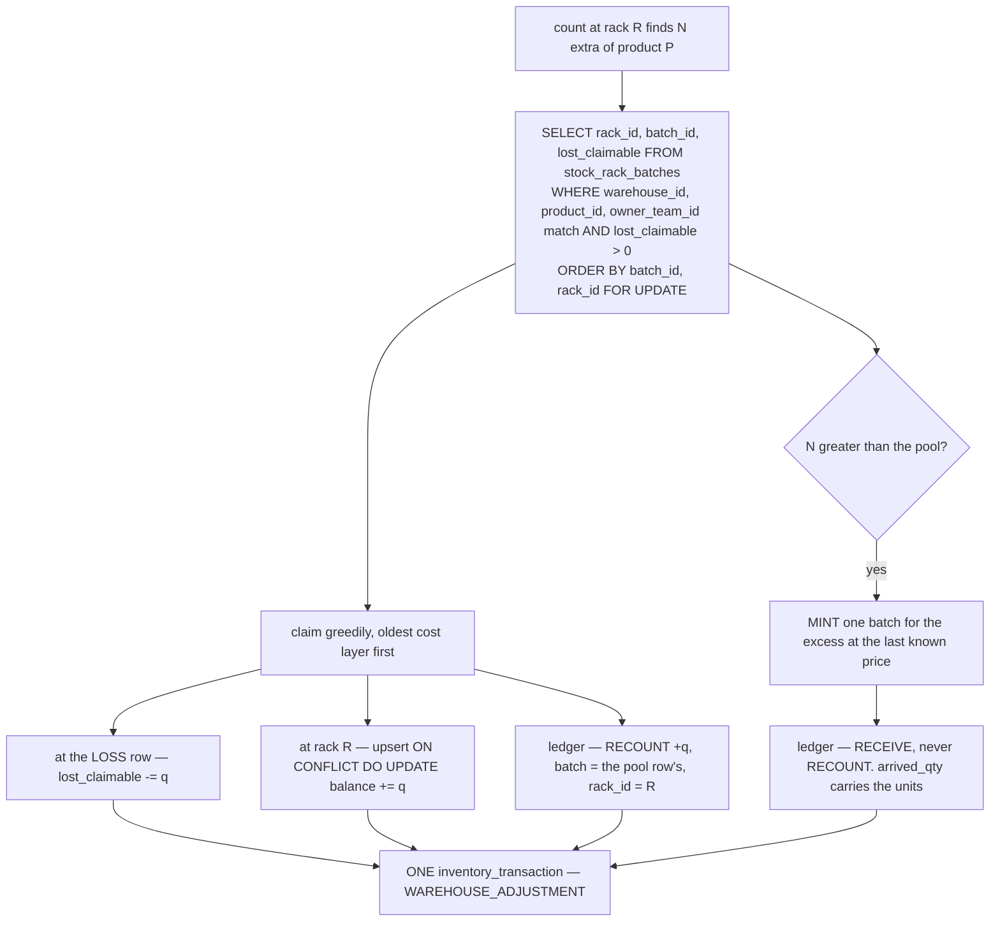
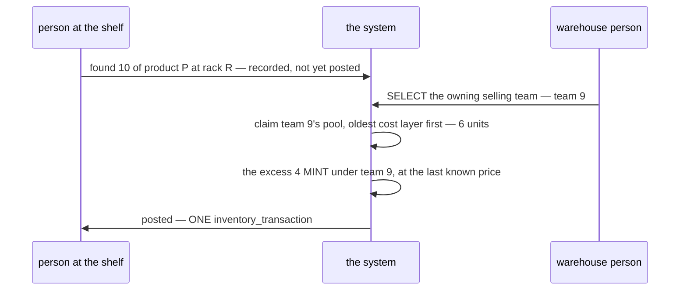
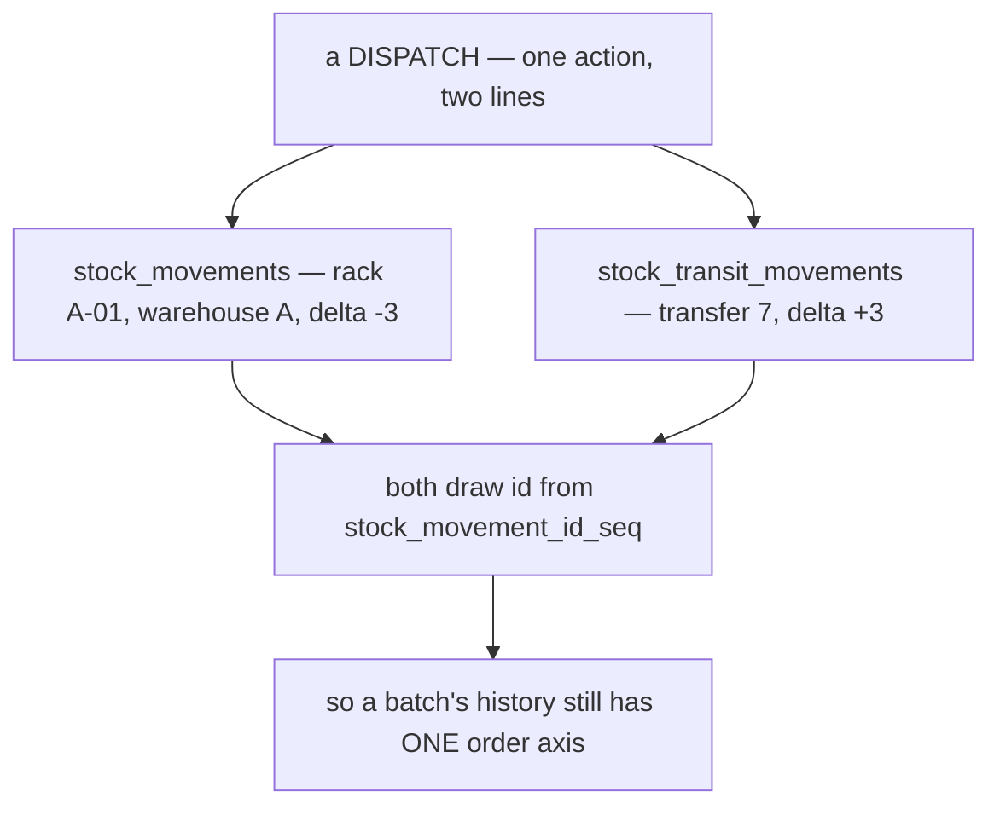

# Stock — the database schema

> ✅ **AUTHORITATIVE.** Build from this. Do not rewrite it without an explicit ask.
>
> Finalised 2026-08-05 from `disscuss/architecture/database/stock_design.md`, then **updated twice the
> same day** — the found-goods design ([the-claim-pool](#the-claim-pool)), and the ledger **split in two**
> so no place column is nullable ([the-ledger-is-two-tables](#the-ledger-is-two-tables)).
> `stock_design_open.md` is finalised and deleted with them: **nothing about this schema is open.**
> Anything reopened starts a new `disscuss/` doc.

**Eight tables.** The rule that draws the boundary: **this file owns what carries a QUANTITY OF RECORD** —
a `balance`, a `delta`, or the units a batch was born with — plus the two things those quantities need an
identity for (a place, and the action that moved them).

> ⚠ **`warehouse_products` is deliberately OUT.** *"Which products a warehouse handles"* is an
> **arrangement**, not a quantity — no `balance`, no `delta`, no batch. Named here so the omission reads
> as a decision rather than an oversight.

Behaviour lives elsewhere: [batch_selection](../../../disscuss/architecture/batch_selection.md) (which
batch) · [fifo](../../../disscuss/architecture/fifo.md) (how a draw walks) ·
[rack_selection](../../../disscuss/architecture/rack_selection.md) (which rack) ·
[stock_movement_log](../../../disscuss/architecture/stock_movement_log.md) (the write protocol, the
reconcile) · [stocktake](../../../disscuss/architecture/stocktake.md) (counting a shelf).

> ⚠ **Those are `disscuss/` docs and they PREDATE this file's two 2026-08-05 updates.**
> `stock_movement_log` still diagrams a single `stock_movements` with a nullable `rack_id`, and describes
> found goods by the reversed rule. **This file wins.** They are rewritten when next opened — until then,
> read them for the *argument*, never for the *shape*.

---

## The model

```mermaid
erDiagram
    RACKS ||--o{ STOCK_RACK_BATCHES : "holds — a unit on a shelf"
    RACKS ||--o{ STOCK_MOVEMENTS : "the place — ALWAYS a rack"
    STOCK_TRANSFERS ||--o{ STOCK_TRANSIT_BATCHES : "holds — a unit on the road"
    STOCK_TRANSFERS ||--o{ STOCK_TRANSIT_MOVEMENTS : "the place — ALWAYS a transfer"
    STOCK_TRANSFERS ||--o| INVENTORY_TRANSACTIONS : "dispatched · accepted · cancelled — one each"
    STOCK_BATCHES ||--o{ STOCK_RACK_BATCHES : "how much of this layer sits where"
    STOCK_BATCHES ||--o{ STOCK_TRANSIT_BATCHES : "how much of this layer is travelling"
    STOCK_BATCHES ||--o{ STOCK_MOVEMENTS : "every change to this layer, at a rack"
    STOCK_BATCHES ||--o{ STOCK_TRANSIT_MOVEMENTS : "every change to this layer, on the road"
    INVENTORY_TRANSACTIONS ||--|{ STOCK_MOVEMENTS : "ONE action, N rows"
    INVENTORY_TRANSACTIONS ||--o{ STOCK_TRANSIT_MOVEMENTS : "and its transit lines, if any"
    INVENTORY_TRANSACTIONS ||--o{ STOCK_BATCHES : "the batch-creating kinds"
    INVENTORY_TRANSACTIONS ||--o| INVENTORY_TRANSACTIONS : "reverses — the general UNDO link"

    RACKS {
        bigserial id PK
        bigint warehouse_id "opaque team_service id — NO FK, the service seam"
        text code "painted on the shelf. UNIQUE per warehouse while active"
        text name
        text description
        boolean deleted "soft delete — see the RackDelete note"
        timestamptz created_at
        timestamptz updated_at
    }

    INVENTORY_TRANSACTIONS {
        bigserial id PK "the USER ACTION — every stock change belongs to one"
        bigint warehouse_id "ONE building. A transfer is therefore THREE transactions over time"
        smallint kind "RESTOCK ORDER WAREHOUSE_ADJUSTMENT TRANSFER PICK MOVE RETURN"
        bigint reverses_transaction_id FK "the UNDO link — a RETURN, a cancel, an un-accept"
        text reason "WHY — one per action, never per row"
        bigint actor_user_id "WHO — 0 when the system acted"
        timestamptz created_at
    }

    STOCK_BATCHES {
        bigserial id PK "⚠ ALSO the FIFO order. ORDER BY id IS the algorithm"
        bigint inventory_transaction_id FK "the batch's ORIGIN"
        bigint warehouse_id "no FK. A batch NEVER leaves the warehouse it was minted in"
        bigint product_id "no FK — opaque product_service id"
        bigint owner_team_id "the SELLING team that owns these units. Frozen at mint"
        bigint unit_cost "NULLABLE — NULL is UNKNOWN, never 0. Whole rupiah"
        date expires_on "NULLABLE. Drives a BADGE and nothing else"
        bigint arrived_qty "what was ACCEPTED. Frozen"
        bigint damaged_qty "damage found AT ACCEPTANCE only"
        bigint created_by "0 when unknown"
        bigint accepted_by "0 when unknown"
        timestamptz created_at
        timestamptz accepted_at
    }

    STOCK_RACK_BATCHES {
        bigserial id PK "the ONLY on-hand snapshot"
        bigint rack_id FK "NOT NULL — all stock in a warehouse is on a rack"
        bigint batch_id FK "NOT NULL — there is no unit without a batch"
        bigint warehouse_id "a COPY of the batch's — for the read index"
        bigint product_id "a COPY of the batch's — for the read index"
        bigint owner_team_id "a COPY of the batch's — for the owner lens"
        bigint balance "CHECK >= 0 — the over-draw guard AND the row lock"
        bigint lost_claimable "units LOST from here that a find may still claim back"
        timestamptz updated_at
    }

    STOCK_TRANSIT_BATCHES {
        bigserial id PK "the FOURTH place — stock on the road"
        bigint stock_transfer_id FK "NOT NULL — which journey"
        bigint batch_id FK "NOT NULL — the SOURCE batch. Minting happens at ACCEPT"
        bigint product_id "no FK"
        bigint owner_team_id "a COPY of the batch's — a transit loss costs its true owner"
        bigint balance "CHECK >= 0. Must be 0 once the transfer is not DISPATCHED"
        timestamptz updated_at
    }

    STOCK_MOVEMENTS {
        bigint id PK "⚠ from the SHARED sequence — THE order axis across both ledgers"
        bigint inventory_transaction_id FK "NOT NULL — the action this row is a line of"
        bigint rack_id FK "NOT NULL — the place. No nullable place column exists"
        bigint batch_id FK "NOT NULL"
        bigint warehouse_id "NOT NULL — a COPY of the batch's"
        bigint product_id "a COPY of the batch's"
        bigint owner_team_id "a COPY of the batch's — an EVENT FACT, never rewritten"
        bigint delta "SIGNED, independent of kind"
        bigint after_balance "the balance of THIS rack, THIS batch, after this row"
        smallint kind "RECEIVE PICK MOVE TRANSFER_OUT TRANSFER_IN RETURN RECOUNT LOST BROKEN"
        timestamptz created_at "the ONLY time on the row"
    }

    STOCK_TRANSIT_MOVEMENTS {
        bigint id PK "⚠ the SAME sequence — so history interleaves correctly"
        bigint inventory_transaction_id FK "NOT NULL"
        bigint stock_transfer_id FK "NOT NULL — the place. In transit it is in NO warehouse"
        bigint batch_id FK "NOT NULL"
        bigint product_id "a COPY of the batch's"
        bigint owner_team_id "a COPY of the batch's"
        bigint delta "SIGNED"
        bigint after_balance "the balance of THIS transfer, THIS batch, after this row"
        smallint kind "TRANSFER_OUT TRANSFER_IN LOST_IN_TRANSIT"
        timestamptz created_at
    }

    STOCK_TRANSFERS {
        bigserial id PK "the DOCUMENT — warehouse ops. One truck, days on the road"
        bigint from_warehouse_id "no FK"
        bigint to_warehouse_id "no FK. CHECK it differs from from_warehouse_id"
        smallint state "DISPATCHED · ACCEPTED · CANCELLED"
        bigint dispatched_transaction_id FK "NOT NULL — the row is created AT dispatch"
        timestamptz dispatched_at
        bigint accepted_transaction_id FK "NULL until it arrives"
        timestamptz accepted_at
        bigint cancelled_transaction_id FK "NULL unless the goods came home"
        timestamptz cancelled_at
    }
```



---

## The tables

**Create in this order** — every FK target exists before the FK is written.

```sql
-- 1 ─────────────────────────────────────────────────────── racks · the address
CREATE TABLE racks (
    id           BIGSERIAL   PRIMARY KEY,
    warehouse_id BIGINT      NOT NULL,                 -- no FK — the service seam
    code         TEXT        NOT NULL,
    name         TEXT        NOT NULL DEFAULT '',
    description  TEXT        NOT NULL DEFAULT '',
    deleted      BOOLEAN     NOT NULL DEFAULT FALSE,
    created_at   TIMESTAMPTZ NOT NULL DEFAULT NOW(),
    updated_at   TIMESTAMPTZ NOT NULL DEFAULT NOW(),
    CONSTRAINT racks_code_present CHECK (code <> '')
);
-- a re-labelled shelf frees its code, and two warehouses may both have an 'A-01-3'
CREATE UNIQUE INDEX racks_warehouse_code_active_unique
    ON racks (warehouse_id, code) WHERE deleted = FALSE;
CREATE INDEX racks_warehouse_active_idx ON racks (warehouse_id) WHERE deleted = FALSE;

-- ⚠ `deleted` is a SOFT delete, so `ON DELETE RESTRICT` on the FKs below never fires.
--   A rack holding stock must be refused in CODE (RackDelete sums its balances first),
--   and the nightly reconcile re-checks it. See "Why not the obvious thing" §3.


-- 2 ──────────────────────────────────── inventory_transactions · the USER ACTION
CREATE TABLE inventory_transactions (
    id            BIGSERIAL PRIMARY KEY,
    warehouse_id  BIGINT   NOT NULL,                   -- no FK
    kind          SMALLINT NOT NULL,                   -- mirrors the proto enum number
    reverses_transaction_id BIGINT REFERENCES inventory_transactions (id),
    reason        TEXT     NOT NULL DEFAULT '',
    actor_user_id BIGINT   NOT NULL DEFAULT 0,
    created_at    TIMESTAMPTZ NOT NULL DEFAULT NOW()
);
-- ⚠ NO owner_team_id. An ACTION is not owned — one action may touch several selling
--   teams' goods, and each MOVEMENT names its own owner.


-- 3 ───────────────────────────────────────── stock_batches · the COST LAYER
CREATE TABLE stock_batches (
    id            BIGSERIAL PRIMARY KEY,               -- ⚠ FIFO reads this. Never reorder
    inventory_transaction_id BIGINT NOT NULL
                  REFERENCES inventory_transactions (id) ON DELETE RESTRICT,
    warehouse_id  BIGINT NOT NULL,                     -- no FK, and immutable
    product_id    BIGINT NOT NULL,                     -- no FK
    owner_team_id BIGINT NOT NULL CHECK (owner_team_id > 0),   -- a SELLING team
    unit_cost     BIGINT,                              -- ⚠ NULL = UNKNOWN, never 0
    expires_on    DATE,                                -- NULL = does not expire
    arrived_qty   BIGINT NOT NULL CHECK (arrived_qty >= 0),
    damaged_qty   BIGINT NOT NULL DEFAULT 0 CHECK (damaged_qty >= 0),
    created_by    BIGINT NOT NULL DEFAULT 0,           -- a USER id: 0 = nobody did the paperwork
    accepted_by   BIGINT NOT NULL DEFAULT 0,
    created_at    TIMESTAMPTZ NOT NULL DEFAULT NOW(),
    accepted_at   TIMESTAMPTZ NOT NULL DEFAULT NOW()
);
CREATE INDEX stock_batches_wh_product_idx ON stock_batches (warehouse_id, product_id, id);
CREATE INDEX stock_batches_owner_idx      ON stock_batches (owner_team_id, product_id, id);


-- 4 ──────────────────────────── stock_rack_batches · the ONLY on-hand snapshot
CREATE TABLE stock_rack_batches (
    id            BIGSERIAL PRIMARY KEY,
    rack_id       BIGINT NOT NULL REFERENCES racks (id)         ON DELETE RESTRICT,
    batch_id      BIGINT NOT NULL REFERENCES stock_batches (id) ON DELETE RESTRICT,
    warehouse_id  BIGINT NOT NULL,                     -- no FK — a copy of the batch's
    product_id    BIGINT NOT NULL,                     -- no FK — a copy of the batch's
    owner_team_id BIGINT NOT NULL CHECK (owner_team_id > 0),
    balance       BIGINT NOT NULL DEFAULT 0 CHECK (balance >= 0),

    -- units LOST from this (rack, batch) that a find may still claim back.
    -- ⚠ It is DERIVABLE from the ledger and stored anyway — see "Why not the obvious thing" §6.
    lost_claimable BIGINT NOT NULL DEFAULT 0 CHECK (lost_claimable >= 0),

    updated_at    TIMESTAMPTZ NOT NULL DEFAULT NOW(),
    UNIQUE (rack_id, batch_id)
);
CREATE INDEX stock_rack_batches_wh_product_idx ON stock_rack_batches (warehouse_id, product_id);
CREATE INDEX stock_rack_batches_rack_idx       ON stock_rack_batches (rack_id);
CREATE INDEX stock_rack_batches_owner_idx      ON stock_rack_batches (owner_team_id, warehouse_id, product_id);
-- the claim pool is walked warehouse-wide on every find. Losses are rare, so the
-- partial index stays tiny where the full one would scan every shelf holding the product.
CREATE INDEX stock_rack_batches_claim_pool_idx
    ON stock_rack_batches (warehouse_id, product_id, batch_id, rack_id) WHERE lost_claimable > 0;

-- ⚠ An emptied row is pruned, so the prune condition is `balance = 0 AND lost_claimable = 0`.
--   A rack that lost its whole stock keeps its row exactly as long as the loss is
--   still claimable — which is the row a find has to find.


-- 5 ─────────────────────────────────── stock_transfers · the JOURNEY document
CREATE TABLE stock_transfers (
    id                BIGSERIAL PRIMARY KEY,
    from_warehouse_id BIGINT   NOT NULL,               -- no FK
    to_warehouse_id   BIGINT   NOT NULL,
    state             SMALLINT NOT NULL,               -- DISPATCHED · ACCEPTED · CANCELLED

    -- ONE transaction FK per lifecycle transition, each PAIRED with its timestamp.
    -- Named for the EVENT, never the direction: a direction does not name a warehouse,
    -- because a cancel's inbound leg lands back in A.
    dispatched_transaction_id BIGINT NOT NULL UNIQUE
                      REFERENCES inventory_transactions (id) ON DELETE RESTRICT,
    dispatched_at     TIMESTAMPTZ NOT NULL,

    accepted_transaction_id   BIGINT UNIQUE
                      REFERENCES inventory_transactions (id) ON DELETE RESTRICT,
    accepted_at       TIMESTAMPTZ,

    cancelled_transaction_id  BIGINT UNIQUE
                      REFERENCES inventory_transactions (id) ON DELETE RESTRICT,
    cancelled_at      TIMESTAMPTZ,

    CHECK (from_warehouse_id <> to_warehouse_id),
    -- the fork: accepted or cancelled, never both
    CHECK (accepted_transaction_id IS NULL OR cancelled_transaction_id IS NULL),
    -- each timestamp travels with its transaction
    CHECK ((accepted_transaction_id  IS NULL) = (accepted_at  IS NULL)),
    CHECK ((cancelled_transaction_id IS NULL) = (cancelled_at IS NULL))
);
CREATE INDEX stock_transfers_incoming_idx ON stock_transfers (to_warehouse_id,   state, dispatched_at);
CREATE INDEX stock_transfers_outgoing_idx ON stock_transfers (from_warehouse_id, state, dispatched_at);

-- ⚠ NO owner_team_id. A transfer is a WAREHOUSE operation: one truck carries several
--   selling teams' goods, and each leg is ONE transaction covering all of them.


-- 6 ───────────────────────────── stock_transit_batches · the FOURTH place
CREATE TABLE stock_transit_batches (
    id                BIGSERIAL PRIMARY KEY,
    stock_transfer_id BIGINT NOT NULL REFERENCES stock_transfers (id) ON DELETE RESTRICT,
    batch_id          BIGINT NOT NULL REFERENCES stock_batches (id)   ON DELETE RESTRICT,
    -- ⚠ NO warehouse_id, on purpose. In transit it is in NO warehouse, and the
    --   transfer already names both ends. A column here could only lie about which.
    product_id        BIGINT NOT NULL,
    owner_team_id     BIGINT NOT NULL CHECK (owner_team_id > 0),
    balance           BIGINT NOT NULL DEFAULT 0 CHECK (balance >= 0),
    updated_at        TIMESTAMPTZ NOT NULL DEFAULT NOW(),
    UNIQUE (stock_transfer_id, batch_id)
);
CREATE INDEX stock_transit_batches_transfer_idx ON stock_transit_batches (stock_transfer_id);
CREATE INDEX stock_transit_batches_owner_idx    ON stock_transit_batches (owner_team_id, product_id);


-- ─── the SHARED order axis. Both ledgers draw from it, so ids interleave.
--     ⚠ Give either table its own BIGSERIAL and history stops being orderable.
CREATE SEQUENCE stock_movement_id_seq;


-- 7 ─────────────────── stock_movements · THE LEDGER at a RACK. Append-only.
CREATE TABLE stock_movements (
    id            BIGINT PRIMARY KEY DEFAULT nextval('stock_movement_id_seq'),
    inventory_transaction_id BIGINT NOT NULL
                  REFERENCES inventory_transactions (id) ON DELETE RESTRICT,

    rack_id       BIGINT NOT NULL REFERENCES racks (id)         ON DELETE RESTRICT,
    batch_id      BIGINT NOT NULL REFERENCES stock_batches (id) ON DELETE RESTRICT,

    warehouse_id  BIGINT NOT NULL,                     -- no FK — a copy of the batch's
    product_id    BIGINT NOT NULL,                     -- no FK — a copy of the batch's
    owner_team_id BIGINT NOT NULL CHECK (owner_team_id > 0),

    delta         BIGINT   NOT NULL CHECK (delta <> 0),
    after_balance BIGINT   NOT NULL CHECK (after_balance >= 0),
    kind          SMALLINT NOT NULL,
    created_at    TIMESTAMPTZ NOT NULL DEFAULT NOW()
);
CREATE INDEX stock_movements_wh_product_idx ON stock_movements (warehouse_id, product_id, id DESC);
CREATE INDEX stock_movements_rack_idx       ON stock_movements (rack_id,  id DESC);
CREATE INDEX stock_movements_batch_idx      ON stock_movements (batch_id, id DESC);
CREATE INDEX stock_movements_txn_idx        ON stock_movements (inventory_transaction_id);
CREATE INDEX stock_movements_owner_idx      ON stock_movements (owner_team_id, product_id, warehouse_id, id DESC);
-- retry safety: a replayed action cannot write its lines twice.
-- ⚠ This WORKS only because no column in the key is nullable — see "Why not the
--   obvious thing" §2. Postgres treats NULLs as DISTINCT, so a key containing one
--   can never collide, and a unique index over it rejects nothing.
CREATE UNIQUE INDEX stock_movements_txn_once
    ON stock_movements (inventory_transaction_id, rack_id, batch_id);


-- 8 ──────────── stock_transit_movements · THE LEDGER on the road. Append-only.
CREATE TABLE stock_transit_movements (
    id            BIGINT PRIMARY KEY DEFAULT nextval('stock_movement_id_seq'),
    inventory_transaction_id BIGINT NOT NULL
                  REFERENCES inventory_transactions (id) ON DELETE RESTRICT,

    stock_transfer_id BIGINT NOT NULL
                  REFERENCES stock_transfers (id) ON DELETE RESTRICT,
    batch_id      BIGINT NOT NULL REFERENCES stock_batches (id) ON DELETE RESTRICT,

    -- ⚠ NO warehouse_id, and no rack_id. In transit the goods are in NO warehouse,
    --   and the transfer already names both ends. Absence says it better than a
    --   NULL did — the same reasoning stock_transit_batches already uses.
    product_id    BIGINT NOT NULL,
    owner_team_id BIGINT NOT NULL CHECK (owner_team_id > 0),

    delta         BIGINT   NOT NULL CHECK (delta <> 0),
    after_balance BIGINT   NOT NULL CHECK (after_balance >= 0),
    kind          SMALLINT NOT NULL,
    created_at    TIMESTAMPTZ NOT NULL DEFAULT NOW()
);
CREATE INDEX stock_transit_movements_transfer_idx ON stock_transit_movements (stock_transfer_id, id DESC);
CREATE INDEX stock_transit_movements_batch_idx    ON stock_transit_movements (batch_id, id DESC);
CREATE INDEX stock_transit_movements_txn_idx      ON stock_transit_movements (inventory_transaction_id);
CREATE UNIQUE INDEX stock_transit_movements_txn_once
    ON stock_transit_movements (inventory_transaction_id, stock_transfer_id, batch_id);


-- ─── one batch's whole history, in order. The only place the two ledgers meet.
CREATE VIEW stock_ledger AS
    SELECT id, inventory_transaction_id, batch_id, product_id, owner_team_id,
           delta, after_balance, kind, created_at,
           rack_id, NULL::BIGINT AS stock_transfer_id, warehouse_id
      FROM stock_movements
    UNION ALL
    SELECT id, inventory_transaction_id, batch_id, product_id, owner_team_id,
           delta, after_balance, kind, created_at,
           NULL::BIGINT AS rack_id, stock_transfer_id, NULL::BIGINT AS warehouse_id
      FROM stock_transit_movements;
-- ⚠ The view is for READING history. Never write through it, and never let a
--   query that needs a rack read from it — that reintroduces the nullable column
--   the split exists to remove.
```

---

## The rules the schema depends on

Short statements only. Each is enforced by code, not by a constraint, and each has a reason that is easy
to undo by accident — so they are restated here rather than left to the behaviour docs.

| | |
| --- | --- |
| **ownership is a SELLING team** | `warehouse_id` is a **warehouse team** (it handles the goods and carries the access scope). `owner_team_id` is a **selling team** (it owns them and carries the money). They are both `team_service` ids and they are **not interchangeable** — ⚠ and nothing in this design ever needs the exception: **a warehouse never owns stock**, because [a person names the selling team](#the-owner-is-named-by-a-person) before any batch is created |
| **ownership is copied, not joined** | on all three tables that carry a quantity, and on **no** other. The batch is authoritative; the rest are copies the reconcile checks |
| **ownership is FROZEN at mint** | it is never corrected — like `unit_cost` and `arrived_qty`. A keying error is fixed by **reversing the acceptance and redoing it**, which is possible until the goods move. A genuine change of hands is a **handover event**, and that feature does not exist yet. ⚠ **Neither does the reversal** — see [debts](#debts) |
| **every unit is in a KNOWN place** | a rack, or a transfer in flight. There is no "somewhere" — and since [the ledger is two tables](#the-ledger-is-two-tables), no row can even express one |
| **`RackDelete` guards on `balance` ALONE** | ⚠ **never on `lost_claimable`.** A shelf can reach `balance = 0` while an open claim still points at it, and a claim only closes when someone finds the units — so guarding on it would make any shelf that ever lost stock **undeletable forever**. The claim belongs to the loss, not the furniture: it survives the rack, the pool walk never filters on rack state, and a find writes its row at the rack it was *found* at |
| **a batch never leaves its warehouse** | a transfer **mints** new batches at the destination, one per source layer, copying `unit_cost`, `expires_on` and `owner_team_id` verbatim |
| **a cancel returns what is LEFT in transit** | not what was dispatched — units may have been lost mid-flight. It names no racks and mints no batches |
| **found goods CLAIM a recorded loss** | a find draws down `lost_claimable` across the **whole warehouse** for that product — a mislaid unit turns up on a *different* shelf — oldest cost layer first (`ORDER BY batch_id, rack_id`). The units **rejoin the batches they were lost from**, so *"at the price they were lost at"* needs no rule of its own: the pool row **is** a batch row, and the batch carries `unit_cost` |
| **a claim closes at ZERO, and by nothing else** | there is **no expiry, no write-off and no clock**. A loss nobody ever finds stays claimable. ⚠ The accepted cost: after some years the pool is rarely empty, so a surplus almost always finds something to claim, and a *receiving* error can hide inside old shrinkage |
| **a find NEVER refuses — the excess MINTS** | more found than the pool can cover? Claim what it covers, then **mint ONE batch for the rest at the last known price** — the highest-id batch for that product in this warehouse with a non-`NULL` `unit_cost`. No priced batch exists → `unit_cost = NULL`. `expires_on` is always `NULL` — unknowable without a delivery |
| **a person NAMES the selling team, before anything is written** | the warehouse person picks it from a select. That one choice **scopes the claim pool AND owns whatever mints beyond it** — so there is no placeholder owner in this design. ⚠ Never inherited from the price batch, never resolved server-side — see [the-owner-is-named-by-a-person](#the-owner-is-named-by-a-person) |
| ⚠ **the minted units enter as `RECEIVE`, never `RECOUNT`** | the batch is born with `arrived_qty`, and `found` counts `RECOUNT⁺` — spelling the mint as a `RECOUNT` counts the same units on **both sides** of the per-batch invariant. It is also the honest reading: these units *arrived*, there is simply no paperwork |
| **`delta` is signed independently of `kind`** | `kind` says which ACTION, the sign says which direction. No `_IN` / `_OUT` pair is needed where a sign already carries it |
| **`kind` mirrors the proto enum number** | never a Postgres `ENUM`, never text — so no constraint here hardcodes a value that lives in the contract |

## Invariants

```
-- per (place, batch): the three must agree. ⚠ ONE LEDGER PER PLACE KIND — a rack
--    reconciles against stock_movements, a transfer against stock_transit_movements.
--    Neither check ever has to filter out the other's rows.
stock_rack_batches.balance    = after_balance at MAX(id) = Σ delta
                                -- over stock_movements         for that (rack, batch)
stock_transit_batches.balance = after_balance at MAX(id) = Σ delta
                                -- over stock_transit_movements for that (transfer, batch)

-- per batch: every place a unit can be
arrived + found = ready + in_transit + used + broken + lost + lost_in_transit + damaged_at_acceptance
    ready        = Σ stock_rack_batches.balance
    in_transit   = Σ stock_transit_batches.balance
    used         = Σ |delta| WHERE kind = PICK
    found        = Σ  delta  WHERE kind = RECOUNT AND delta > 0   -- CLAIMED units only.
                                                                 -- A mint is a RECEIVE and lands in `arrived`.

-- the claim pool: an EQUALITY, because a find is the only thing that moves it
-- ⚠ per BATCH, summed across racks — a find decrements at the rack the units were LOST
--    from while writing its ledger row at the rack they were FOUND at, so it does NOT
--    hold per (rack, batch)
Σ stock_rack_batches.lost_claimable = Σ |delta| WHERE kind = LOST − Σ delta WHERE kind = RECOUNT AND delta > 0

-- per transfer: it must close
SUM(stock_transit_batches.balance) = 0   for every transfer whose state <> DISPATCHED

-- the copies must still match their source
owner_team_id, product_id  on stock_rack_batches, stock_transit_batches,
                              stock_movements and stock_transit_movements  =  the batch's
warehouse_id               on stock_rack_batches and stock_movements       =  the batch's
                              -- the two transit tables carry none, by design
-- and a rack must be in the warehouse the row claims, and must not be soft-deleted
--    while it holds stock
```

⚠ **The reconcile is part of the design, not a nice-to-have.** Two stored numbers and several unenforceable
copies exist precisely so that nothing recomputes them — which is exactly why nothing would notice them
drifting.

---

## the-claim-pool

**Found goods are the UNDOING of a loss, not a receipt.** `lost_claimable` is the quantity a find may
claim back — it goes up on a `LOST`, and down on a find.



### a-find-is-the-only-drain

A claim closes when `lost_claimable` reaches **0**, and by nothing else. **This is what makes the pool an
equality rather than an inequality** — every movement of the counter has a ledger row behind it, so it is
exactly reproducible. Any write-off or expiry added later reopens that, and the reconcile check has to
weaken with it.

### the-owner-is-named-by-a-person

**A warehouse person selects the owning selling team, and they do it BEFORE anything is written.**



**One selection serves both halves.** The team scopes *which* pool is walked, and it owns *whatever*
mints beyond it. There is therefore **no placeholder owner anywhere in this design** — no house team, no
"unassigned" bucket, no warehouse-owned stock. `owner_team_id` always names a real selling team, so the
rule above never bends and `owner_team_id == warehouse_id` stays a reliable smell.

**The owner arrives in the request, and that is load-bearing.** The server validates
`owner_team_id > 0` and never resolves a team itself — no synchronous `team_service` call inside the
write transaction that holds the pool's row locks.

- ⚠ **The person naming the team is not the person counting.** A counter measures a shelf and cannot know
  whose units these are; the selection belongs to whoever reviews before posting.
- ⚠ **Scope the picker, and make it admin-only.** Someone who can assign found goods to any team can give
  stock away. Offer the selling teams that trade in this warehouse — ⚠ **no known relation supplies that
  list**, see [debts](#debts).
- ⚠ **The accepted consequence: there is no "decide later".** The action cannot proceed without a named
  team, so a person who does not know has to find out. That is deliberate — a placeholder owner is a
  question nobody ever comes back to.

### the-remainder-mints-at-last-price

`FOR UPDATE` on the pool rows is the whole concurrency story — the rows being decremented are the rows
being locked, so two simultaneous finds cannot read the same pool. The rows are locked in
`batch_id, rack_id` order, which is the same order every other draw takes.

⚠ **The control this removes:** a count can now create stock with no document behind it. The
`inventory_transaction` carries the actor and the reason, so it is attributable — but *"stock cannot be
conjured by counting"* was true before this and is not true now, and anything that leaned on that sentence
needs re-reading.

---

## the-ledger-is-two-tables

**A rack and a transfer-in-flight are different shapes, so they get different tables.** One row type
carries a rack and a warehouse; the other carries a transfer and no warehouse at all.



- ⚠ **The shared `SEQUENCE` is load-bearing.** *"`id` is THE order axis. Never order by a timestamp"*
  only survives because both tables draw from `stock_movement_id_seq`. Give either its own `BIGSERIAL`
  and the two logs can no longer be interleaved.
- **Read a batch's whole history through the `stock_ledger` view**, ordered by `id`. That view is the
  only place the two meet, it is **read-only**, and a query that needs a rack must go to
  `stock_movements` directly — reading racks through the view reintroduces the nullable column the split
  removed.
- ✅ **`warehouse_id` is simply absent on the transit table.** The earlier design needed a `CHECK` to force
  it `NULL` in transit, because a transit row claiming warehouse A made a dispatch's two legs net to zero
  and A's own history said nothing left the building. Absence needs no constraint.
- ✅ **`LOST_IN_TRANSIT` now has nowhere else to live**, and the claim pool cannot accidentally see it —
  the pool reads `stock_movements`, which has no transit rows to exclude.

---

## Why not the obvious thing

**Six decisions here look wrong at a glance. Each is right for a reason found by getting it wrong first.**
This section is the guard on them — do not "fix" one without reading its row.

| Looks wrong | Why it is not |
| --- | --- |
| **1 · `owner_team_id` COPIED onto an append-only ledger** | The natural fix is to join `stock_batches` instead. **It has no source to join from** — the batch's link to the restock (`restock_request_item_id`) was dropped when the transaction became the batch's origin, and a transfer-minted batch never had one. The column is also an **event fact** (*who owned these units when this happened*), not a cache — ownership is frozen, so it is never rewritten and the ledger stays append-only in the strong sense |
| **2 · TWO ledger tables for ONE ledger** | Splitting an append-only log looks like a normalisation mistake — and the obvious alternative, one table with a nullable `rack_id`/`stock_transfer_id` pair and an `XOR CHECK`, is what this design had until it produced **two bugs from the same cause**. ⚠ **`NULL` breaks equality**: `rack_id = NULL` is never true, so a plain `=` silently matched nothing and reported phantom *"insufficient stock"* for goods on the shelf — every read and lock then had to remember `IS NOT DISTINCT FROM`. ⚠ **`NULL` breaks uniqueness**: Postgres treats NULLs as DISTINCT, and the `XOR` guaranteed **every** row carried one, so the retry-safety unique index could never reject anything — a replayed action doubled its balances in silence. Two `NOT NULL` tables end both, structurally: the `XOR CHECK` disappears because "neither, or both" stops being expressible. See [the-ledger-is-two-tables](#the-ledger-is-two-tables) |
| **3 · `ON DELETE RESTRICT` on a SOFT-deleted `racks`** | The FK never fires, because a soft delete is an `UPDATE`. It is kept because a hard delete must still be refused, but **it is not the guard** — the guard is `RackDelete` summing balances, plus a reconcile check. Do not read the FK as protection |
| **4 · THREE transaction FKs on `stock_transfers`** | One column per lifecycle transition looks redundant against a single "current transaction". It is not: a **direction does not name a warehouse** — a cancel's inbound leg lands back in **A**, so a shared column would make the destination's "incoming" screen silently pick up the source's returns |
| **5 · no `owner_team_id` on `inventory_transactions`** | Every other quantity-bearing table has one, so its absence looks like an oversight. **An action is not owned** — one `LOST` on a shelf legitimately spans two selling teams, and forcing a single value there would either be a lie or split one action into several transactions |
| **6 · `lost_claimable` is DERIVABLE and stored anyway** | The invariants prove it is exactly `Σ\|LOST\| − Σ RECOUNT⁺`, so it reads like the cached `lost` / `broken` columns that were **rejected** for that very reason. The difference is what it is FOR: **it is the row a find LOCKS.** `SELECT … WHERE lost_claimable > 0 … FOR UPDATE` is the entire concurrency control, and an aggregate cannot be locked. ⚠ The rejected columns were cumulative — they never return to zero, so the row could never be pruned. This one drains, so it does |

⚠ **The pattern behind 1, 2 and 5: a fact was filed in the wrong bucket, and nothing re-checked it.**
The rule *"copy immutable facts, join mutable ones"* is correct — `owner_team_id` was simply misfiled as
mutable on the strength of one untested sentence, and every consequence followed from that.

⚠ **The pattern behind 2 and 4: a late decision met early rules.** Adding a fourth place (transit) did not
just add a table — it invalidated every rule phrased in terms of *racks*. **When a decision widens a
concept, grep for the OLD word, not the new one.**

---

## Corrections applied at promotion

⚠ Three defects were found in the final solidity pass and **fixed here**, with the fix stated above:

| | Fix |
| --- | --- |
| a dispatch netted to zero in the warehouse's own history | `stock_movements.warehouse_id` is **NULL in transit**, with a `CHECK` tying it to `rack_id` |
| a cancel failed after a transit loss (`CHECK (balance >= 0)`) | a cancel returns **what is left in transit**, not the dispatched amount |
| `after_balance` had no meaning on a transit row | its grain is **"that PLACE, that batch"**, and the reconcile runs over **both** state tables |

## The found-goods update — 2026-08-05

The design that was open at promotion is now here. What landed, and what it replaced:

| Landed | Replaced |
| --- | --- |
| `lost_claimable` on `stock_rack_batches`, plus its partial index and prune condition | a `recovers_movement_id` link on the ledger, and a 180-day recovery window — both withdrawn |
| [a-find-is-the-only-drain](#a-find-is-the-only-drain) — a claim closes at 0 | an expiry, whether by clock, by supervisor write-off, or by stocktake coverage |
| [the-remainder-mints-at-last-price](#the-remainder-mints-at-last-price) | ⚠ **a REVERSAL** — *"no prior loss → refused"* and *"stock cannot be conjured by counting"* were **both true here and are not any more** |
| the claim-pool **equality** in the invariants | an inequality, which only a write-off would have required |

## debts

**Claims this doc makes that are NOT built.**
⚠ **Two rules above describe a correction path the system does not have.** They are deferred, not
forgotten (owner, 2026-08-05) — and they are listed here because an authoritative doc asserting an
unbuilt behaviour is worse than one that stays quiet.

### restock-acceptance-has-no-undo

*"A keying error is fixed by reversing the acceptance and redoing it."* **No RPC does this.** Until one
exists, an acceptance keyed to the wrong selling team, price or quantity is **permanent in practice** —
the design says otherwise and the system does not agree with it.

**What it would be:** one `inventory_transaction` whose `reverses_transaction_id` names the acceptance,
carrying a negative `RECEIVE` line for every line the acceptance wrote. The batch **stays** — the ledger
is append-only, and a batch that existed for an hour is a fact — its balance returns to zero, and history
reads forwards as *"received, then un-received."*

| | |
| --- | --- |
| **the precondition** | *"no movement on any of the acceptance's batches other than its own `RECEIVE` rows"* — one SQL predicate, so the fix is enforced rather than trusted |
| ⚠ **not a generic `TransactionReverse`** | reversal means something different per kind — a transfer's undo is a cancel with its own leg, a pick's is a return. One RPC per reversible action |
| ⚠ **it cannot cover moved goods** | anything already picked or transferred needs the **handover**, which also does not exist |

### the-owner-picker-has-no-scope

[the-owner-is-named-by-a-person](#the-owner-is-named-by-a-person) says the picker should offer *"the
selling teams that trade in this warehouse."* ⚠ **No known relation supplies that list** — `warehouse_products`
is products ↔ warehouse, not teams ↔ warehouse, and whether `team_service` has one is unconfirmed.

**Until it is answered the picker is unscoped**, which means an admin can assign found goods to any team
in the company. That is the *only* control on a screen that creates stock out of a count, so it has to be
settled before the picker is built — not before the schema ships.

---

## The ledger split — 2026-08-05

⚠ **A defect in the promoted schema, not a preference.** `stock_movements_txn_once` was documented as
retry safety and **could never fire**: the `XOR CHECK` guaranteed every row had a NULL in the index key,
and Postgres treats NULLs as distinct. A replayed action wrote its lines twice, silently.

| Landed | Replaced |
| --- | --- |
| `stock_movements` — `rack_id` and `warehouse_id` **NOT NULL** | one table with a nullable place pair and an `XOR CHECK` |
| `stock_transit_movements` — `stock_transfer_id` **NOT NULL**, no `warehouse_id` at all | a `CHECK` forcing `warehouse_id` NULL in transit |
| `stock_movement_id_seq`, shared | one `BIGSERIAL` — the order axis is preserved deliberately, not by accident |
| two unique indexes with **no nullable column** | one that rejected nothing |
| the read-only `stock_ledger` view | `SELECT … FROM stock_movements` for a batch's whole history |
| ⚠ **`IS NOT DISTINCT FROM` is no longer needed anywhere** | a discipline every future query had to remember |

⚠ **Three rules in the table above are behaviour, not schema** — found goods, a cancel's return, and
*"a keying error is fixed by reversing the acceptance"*. They belong in the behaviour docs, but those are
all still in `disscuss/` and therefore not authoritative, so **moving them would demote them**. They stay
here until `batch_selection` and `stock_movement_log` are themselves promoted.

✅ **Nothing about the stock schema is open.** `stock_design_open.md` is finalised and deleted — its two
outstanding items are [debts](#debts) above, and the **handover** between selling teams is a feature,
not a schema gap.

⚠ **The reversals this file went through are in its own history, not in a parallel doc.** Both updates
above reversed a rule that had been promoted as final, and the guards those reversals produced are
attached to the things they protect: the `NULL`/uniqueness warning sits on
`stock_movements_txn_once`, the *"not interchangeable"* note sits on the ownership rule, and the
`RackDelete` guard sits in the rules table. **A guard beside its subject survives a doc being deleted;
a lesson in a separate record does not.**
