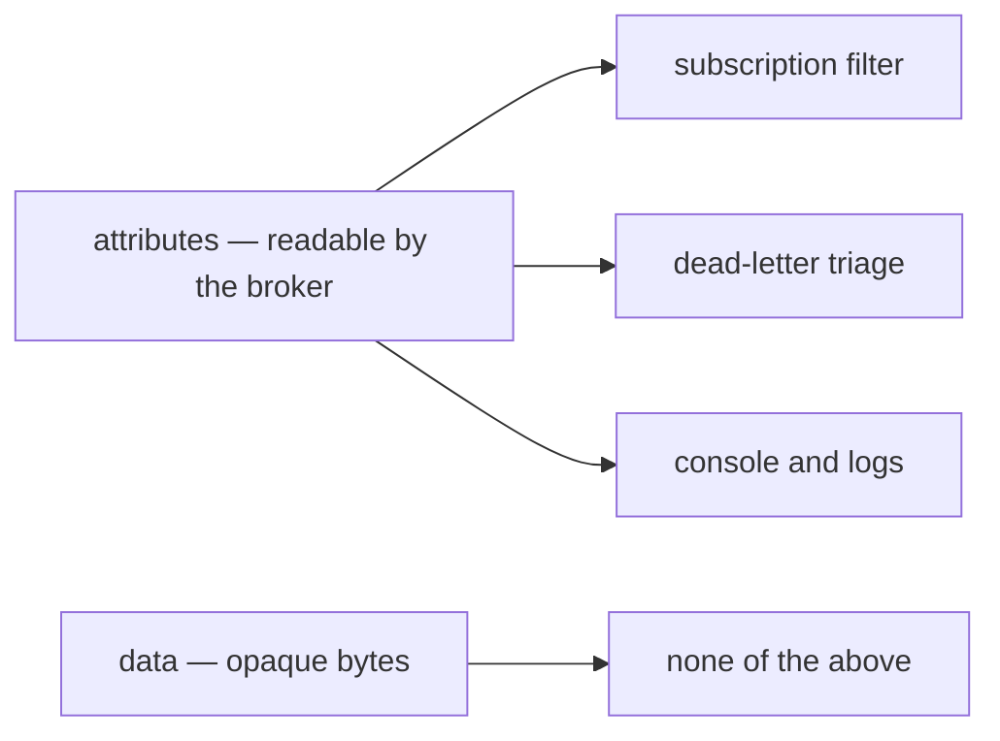
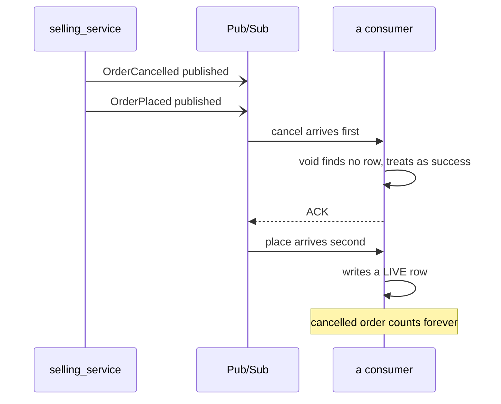

# Event Library — Protobuf over Pub/Sub

Authoritative. Build from this. Every event definition, publisher and subscriber follows it;
deviating requires a note in the commit saying which rule and why.

> **This doc DERIVES from [docs/technical/event_architecture/context.md](../../docs/technical/event_architecture/context.md)**,
> which is the owner's, and from the decisions recorded beside it. Where the two disagree, that one
> wins and this one is stale — see [§13](#13-what-changed-and-what-it-was), which records what was
> overridden rather than quietly deleting it.

Transport lives in [`backend/pkgs/event_source/`](../../backend/pkgs/event_source/) — clients, topics,
subscriptions, push/pull drivers, and the provisioning functions. Receiving, dedup and rejection live
in [`backend/pkgs/san_event/`](../../backend/pkgs/san_event/). The split is deliberate: a service
handler never sees a Pub/Sub type.

## Decided

| Decision | What it says |
| --- | --- |
| [one-envelope-for-everything](#one-envelope-for-everything) | ONE `warehouse.events.v1.Event`, every event a variant of it |
| [topic-per-variant](#topic-per-variant) | Each variant names its own topic, on itself |
| [the-oneof-is-required](#the-oneof-is-required) | An envelope with no variant set is rejected and recorded |
| [protojson-on-the-wire](#protojson-on-the-wire) | `protojson`, both ways — so the field NAME is the wire identity |
| [meta-at-one-payload-at-hundred](#meta-at-one-payload-at-hundred) | Typed fields 1–5, growth to 99, variants from 100 in a block per context |
| [reuse-event-config-50001](#reuse-event-config-50001) | The option keeps 50001, in `warehouse.events.v1` |
| [event-id-is-derived](#event-id-is-derived) | The dedup key is derived from the causing row, never a fresh ULID |
| [event-type-attribute-is-mandatory](#event-type-attribute-is-mandatory) | The variant's full name is always an attribute, and every subscription filters on it |
| [identity-is-a-record](#identity-is-a-record) | `Event.identity` says who caused the publish — no consumer authorises from it |
| [no-sequence-field](#no-sequence-field) | No per-aggregate sequence — filters make gaps meaningless |
| [reject-never-nacks](#reject-never-nacks) | What can never succeed is acked and recorded, not nacked |
| [filter-subset-portable](#filter-subset-portable) | Filters restricted to exact match and prefix on `event_type` |
| [breaking-against-head](#breaking-against-head) | `buf breaking` compares against `HEAD~1`, per commit |
| [no-published-sdk](#no-published-sdk) | One module, generated code committed — no artifact publish |

**Superseded, kept so the record and every link to it survive:**
[topic-per-context](#topic-per-context) · [envelope-per-context](#envelope-per-context) ·
[breaking-against-dev](#breaking-against-dev).

---

# 1. Core decisions

| | Rule |
| --- | --- |
| Format | Protobuf, **`protojson`** encoding |
| Envelope | ONE `warehouse.events.v1.Event` for the whole system |
| Topics | One topic per VARIANT, declared on the variant |
| Dispatch | Consumers switch on the `oneof`, never on strings and never on the subscription name |
| Routing | Topic comes from the proto option, never a caller argument |
| Filtering | Pub/Sub subscription filters on `event_type` — **mandatory**, and immutable |
| Delivery | At-least-once — every consumer is idempotent |

## one-envelope-for-everything

**One `warehouse.events.v1.Event`. Every event in the system is a variant of it.**

A consumer is handed the whole envelope and switches on the `oneof`. There is no per-context envelope
and no per-context event package.

What it costs, stated: every consumer compiles against every domain's variants. That is real, and it is
the price of one contract, one decoder, one dedup key and one provisioning walk. The
[filter](#event-type-attribute-is-mandatory) is what keeps a consumer from *receiving* what it does not
care about.

## topic-per-variant

**Each variant names its own topic, on itself:**

```protobuf
message OrderPlaced {
  option (event_config).topic = "order-placed";
  ...
}
```

The topic travels WITH the message, so a publisher never names one and cannot send an event to the
wrong one. `event_source.TopicName` unwraps the envelope's `oneof` and reads the SET variant's option;
a variant declaring none is an error at publish time, never a default.

Two variants MAY share a topic. The rule is one topic per variant, not one topic per event *kind* —
`order-placed` and `order-cancelled` are separate today because each names its own.

⚠ **Ordering is not what topics are for here.** The old rule (below) chose one topic per context so an
ordering key could sequence a context's events. No ordering key is set —
[ordering-is-each-services-job](../../docs/technical/event_architecture/context_decision.md#ordering-is-each-services-job) —
so **every consumer must tolerate any arrival order**, and a cancel arriving before its placement is a
case each handler answers for itself.

## the-oneof-is-required

```protobuf
oneof message {
  option (buf.validate.oneof).required = true;
  ...
}
```

**This is not decoration, and it is the one rule most easily read as such.** Events are
[`protojson`](#protojson-on-the-wire) and the decoder is lenient by design, so a variant a consumer has
not regenerated is DROPPED — leaving a perfectly valid envelope with **no body**. Without this rule
that is handled as nothing and silently acked.

With it, the read fails, [reject-never-nacks](#reject-never-nacks) records it, and a human has a row to
look at.

## protojson-on-the-wire

**`protojson`, both ways. There is no format tag on the payload, so this cannot be changed later.**

It won on LEGIBILITY, not size — binary is 3–5× smaller. Every failure path in this design ends with a
person reading a payload: a rejection row, a dead-letter message, a log line. `protojson` is readable in
the Pub/Sub console with no tooling and no message type to hand.

⚠ **The price is permanent and it is the field NAME.** Under binary a field's identity is its number and
a rename is free. Under `protojson` a rename orphans every message already published:

| the change | what a consumer reads afterwards |
| --- | --- |
| rename a scalar (`change` → `amount`) | **zero** — the decoder drops the old name, and a money report folds 0 |
| rename a `oneof` arm | **nothing** — the whole body is gone, and the envelope still decodes |

The compiler does not see this. It fails on your Go until you update it, then goes green while the wire
stays broken. [`buf breaking`](#breaking-against-head) is the only check that speaks about the wire.

---

# 2. Naming and versioning

- Every event lives in `warehouse.events.v1`, in `proto/warehouse/events/v1/`.
  ⚠ buf `STANDARD` lint enforces package == directory. This is not optional.
- **The version lives in the package name, never in a field.** A breaking change creates `v2`, a
  different type, so `v1` and `v2` coexist on the topic during migration.
- Variant names are past tense and carry no `Event` suffix — `OrderPlaced`, `OrderCancelled`. They are
  variants OF `Event`, so `Event.order_placed_event` would say it twice.
- `event_type` attribute values are the **fully-qualified variant name**:
  `warehouse.events.v1.OrderPlaced`. Never a friendly slug.
- ⚠ **A variant's field name is its wire identity** ([protojson-on-the-wire](#protojson-on-the-wire)).
  Choose it once.

---

# 3. Shared metadata

**The envelope carries the three fields the library READS as typed fields, plus the producer's own map.**

A string map cannot mark a key required: `metadata["eventId"]` compiles and reads `""`, so every event
after the first dedups as a duplicate and is acked — silently. The three keys the library reads are the
three whose absence fails without an error. Everything else it only carries, and a map suits that.

```protobuf
message Event {
  string event_id = 1 [(buf.validate.field).string.min_len = 1];
  google.protobuf.Timestamp occurred_at = 2 [(buf.validate.field).required = true];
  string aggregate_id = 3 [(buf.validate.field).string.min_len = 1];

  map<string, string> metadata = 4 [(buf.validate.field).map = {
    max_pairs: 100,
    keys: {string: {max_bytes: 256}},
    values: {string: {max_bytes: 1024}}
  }];

  warehouse.role_base.v1.Identity identity = 5;
  // 6–99 free for envelope growth
}
```

⚠ **`metadata` is copied VERBATIM into the message attributes.** One map, both places — so the caller
and the library share a key namespace, and a producer must not set a key the library sets
(`event_type`, and the trace). The `buf.validate` rules above ARE Pub/Sub's own attribute caps, so they
can never reject a message the broker would have accepted — they only move the failure from a nameless
broker rejection to a validation error that names the field.

## event-id-is-derived

**`event_id` is derived from the row that caused the event — `"order-placed:8891"` — never a fresh ULID
or UUID.**

A redelivery and a **replay** are the same logical fact and must collide, because that collision is the
only thing dedup can see. A freshly minted id per publish cannot collide with the original, so a
backfill re-records every event it touches and a consumer counts the same order twice.

The transport's own message id is a separate thing and is never the dedup key: a publisher retry after a
timed-out publish mints a new one for the same fact.

## identity-is-a-record

**`Event.identity` says who caused the PUBLISH. It is a record, never a credential.**

It is a parameter of the sender, not something read out of `ctx` — a `ctx` value is invisible in a
signature, so a call site that lost it would compile and publish an event saying nobody caused it. A
parameter cannot be omitted. A caller with no authenticated user passes
`event_source.SystemIdentity(agent)`, and the agent is required so "the system did it" is a statement
rather than a default.

| rule | why |
| --- | --- |
| no consumer authorises from it, and `san_auth.WithIdentity(event.Identity)` is **forbidden** | push routes are open, so anyone who reaches one can POST any identity. The `Identity` proto carries no role by construction — this rule just says so out loud |
| the sender clears `expired_at` | it is a TOKEN's expiry stamped on a fact that outlives it: a consumer that checks it rejects every replayed event as expired |
| a handler publishing a downstream event passes the INCOMING identity | otherwise the chain to the human breaks at the first consumer, and every downstream event says SYSTEM |

⚠ It is **not** a variant's own `actor_id`. That is read from the stored row and says who did the
*thing*; the identity says who caused *this publish*, which on a backfill is the operator. A consumer
folding the fact reads the variant's.

## no-sequence-field

There is **no `sequence`**. Per-aggregate gap detection contradicts
[filter-subset-portable](#filter-subset-portable) — a consumer filtered to one variant sees 3, 7, 11 and
cannot distinguish legitimate filtering from message loss. A field that looks like a safety net and
fires false alarms is worse than no field.

---

# 4. Envelope shape

```protobuf
// proto/warehouse/events/v1/event.proto
package warehouse.events.v1;

message Event {
  // ... the typed fields from §3 ...

  oneof message {
    option (buf.validate.oneof).required = true;

    OrderPlaced    order_placed    = 200;
    OrderCancelled order_cancelled = 201;
  }
}
```

## meta-at-one-payload-at-hundred

| Range | Holds |
| --- | --- |
| 1–5 | the typed envelope fields — `event_id`, `occurred_at`, `aggregate_id`, `metadata`, `identity` |
| 6–99 | reserved for envelope growth |
| 100+ | `oneof` variants, **in a block per context** — selling 200–299, settlement 300–399 |

⚠ This applies to the **envelope's** field numbers. Fields *inside* a variant are unconstrained.

- The option goes on the **variant**, never on the envelope. The envelope names no topic.
- A variant carries no `event_id` or `occurred_at` of its own. Two idempotency keys for one fact is how
  a double-count starts.
- Every removed variant gets a `reserved` line with a date comment. **Never reuse a number** — and
  under `protojson`, never reuse a NAME either.

---

# 5. The topic option

## reuse-event-config-50001

```protobuf
package warehouse.events.v1;

message EventConfig {
  string topic = 1;
}

extend google.protobuf.MessageOptions {
  EventConfig event_config = 50001;
}
```

**50001 is kept**, moved from the deleted `warehouse.event_base.v1`. Nothing had ever been published
under the old option, so the number was free to carry across — and it is the number CLAUDE.md's options
table already documents.

⚠ Two extensions of `MessageOptions` cannot share a number, so the move and the deletion are ONE change
or the build fails. That is why `event_base.v1` went in the same commit as the new package.

**Extension numbers in use — one register, never changed:**

| Number | Extends | Option |
| --- | --- | --- |
| 50001 | `MessageOptions` | `warehouse.events.v1.event_config` |
| 50002 | `MessageOptions` | `warehouse.role_base.v1.request_policy` |
| 50002 | `FieldOptions` | `warehouse.role_base.v1.use_scope` |

`topic` holds a **logical name** (`order-placed`), never a resource name (`projects/…/topics/…`). The
same binary runs in dev and production.

---

# 6. Publishing

A publisher takes the identity and the event, and nothing else.

```go
err := send(ctx, eventIdentity(ctx), &eventsv1.Event{
    EventId:     "order-placed:" + orderRef,
    OccurredAt:  timestamppb.New(order.CreatedAt),
    AggregateId: "order:" + orderRef,
    Message:     &eventsv1.Event_OrderPlaced{OrderPlaced: placed},
})
```

Everything else is derived:

| Derived | From | On absence |
| --- | --- | --- |
| topic | the SET variant's `topic` option | **error** — never a default |
| `event_type` attribute | the set variant's full name | always set |
| the trace | `ctx`, injected into `metadata` | always set |

**`nil` means the BROKER STORED IT**, not that the client accepted it. There is no outbox — the return
value is the whole delivery guarantee — so the sender waits for the server's acknowledgement on a
context detached from the caller's, bounded at the client's own 60s publish timeout.

**A send error after the commit never fails the RPC.** The row exists; answering "failed" makes the
person at the shelf tap again. Log it once with the `event_id` and never retry in a loop — the client
already retried for 60 seconds. The repair is a backfill from the row, which collides on `event_id` in
every consumer.

## event-type-attribute-is-mandatory

`event_type` is always set, from the variant's full name, and **every subscription filters on it**.

```
event_type:   warehouse.events.v1.OrderPlaced
```

⚠ **The filter is not optional any more.** With [the-oneof-is-required](#the-oneof-is-required), a
variant a consumer has not regenerated arrives as a *recorded rejection* — noise on every message of a
new kind. The filter is what stops it arriving. And a subscription's filter is **immutable**, so it has
to be right when the subscription is created.

**Pub/Sub filters cannot see inside the payload.** Everything in `data` is opaque to the broker — no
filtering, no ordering key, no console read, no dead-letter triage:



Attributes are a **routing index, never the source of truth**. Every one is a copy of something in
`data`, so a mismatch is a bug rather than an ambiguity.

⚠ Never accept a topic name as a function argument. Never define topic string constants.

---

# 7. Consuming

- One **narrow subscription per consumer**, filtered server-side. Filters are **immutable** — changing
  one means creating a new subscription with a new id.
- **Dispatch on the VARIANT, never on the subscription name.** A real push carries the full
  subscription path (`projects/…/subscriptions/…`), so a handler matching short constants falls to its
  default branch on every message and acks the lot.

```go
switch variant := event.GetMessage().(type) {
case *eventsv1.Event_OrderPlaced:
    return h.onPlaced(ctx, event, variant.OrderPlaced)
case *eventsv1.Event_OrderCancelled:
    return h.onCancelled(ctx, event, variant.OrderCancelled)
default:
    return nil // ACK — a variant this build does not handle
}
```

- Enable the `exhaustive` linter — a Go type switch has no compiler exhaustiveness check.
- **A handler is handed ONE event and no transaction.** It opens its own and claims `event_id` inside
  it, beside its write, via `san_event.EventDedup.Claim`. Claimed apart from the write, a crash between
  them either suppresses work that never committed or repeats work that did.
- **Every consumer tolerates any arrival order.** Nothing orders delivery.
- Every subscription has a **dead-letter topic**, max 5 delivery attempts, created by
  `go run ./tools/san pubsub ensure` — and by nothing else.

## reject-never-nacks

Nacking a message that can never succeed builds an infinite redelivery loop that costs money and buries
real failures. `san_event` classifies before any handler is reached:

| Outcome | Meaning | Action |
| --- | --- | --- |
| `Undecodable` | the bytes are not an `Event` | record, then **ACK** |
| `Invalid` | decoded, failed protovalidate — **including an unset `oneof`** | record, then **ACK** |
| `RepeatedFailure` | past the attempt threshold — our code is broken | record, then **ACK** |
| unknown variant | envelope parsed, variant not handled here | return nil, **ACK** |
| handler error | transient — the DB is down | **NACK** → retry → DLQ |

⚠ **Record before ack.** A rejection ACKs, so the broker is finished with that message forever.
`Rejection.Message` is the only surviving copy — write it and commit before the driver acks.

## filter-subset-portable

Filters are restricted to **exact match and prefix on `event_type`**:

```
attributes.event_type = "warehouse.events.v1.OrderPlaced"
hasPrefix(attributes.event_type, "warehouse.events.v1.Order")
```

⚠ **The original reason for this cap is GONE** — it was that a sqlite dev broker had to implement the
same grammar, and no such broker exists: dev runs the Pub/Sub emulator. The cap is kept on a narrower
argument: a filter is immutable, so a clever one is a mistake you cannot take back, and every filter
this design needs is a match on `event_type`. Widen it only with a case.

---

# 8. Evolution

⚠ **This table matters more under `protojson` than it did under binary**, because a rename is now a
data change rather than a cosmetic one.

| Change | Allowed? |
| --- | --- |
| Add a field with a new tag number | ✅ |
| Add a `oneof` variant with a new tag number | ✅ — but see below |
| Remove a field/variant **and** add `reserved` | ✅ |
| **Rename a field or a variant** | ❌ — under `protojson` the name IS the wire identity |
| Change a field's type | ❌ new `vN+1` |
| Reuse a retired tag number, or a retired NAME | ❌ never |
| Renumber an existing field | ❌ never |

**Adding a variant is safe, with one operational caveat.** Consumers that have not regenerated will
RECORD a rejection for it (the `oneof` is required) rather than ignoring it — unless their subscription
filters on `event_type`, which is why [that filter is mandatory](#event-type-attribute-is-mandatory).

Protobuf fails **silently** when these are broken — you get garbage that decodes "successfully", not a
parse error. Tooling catches it, not review.

---

# 9. CI

## breaking-against-head

```sh
buf breaking proto --against '.git#ref=HEAD~1,subdir=proto'
```

**Per commit, from the repo ROOT.** It is the only check that compares the proto to its previous self:
`buf lint` passes on a rename, the generated-drift check passes because proto and generated code move
together, and `go build` fails only until the Go is updated — which goes green while every message
already published still carries the old name.

Two things it needs, both easy to get wrong:

| | |
| --- | --- |
| run it from the **repo root** | not `working-directory: proto` — `.git` resolves against the working directory, and `proto/.git` does not exist |
| `fetch-depth: 2` on the checkout | the default shallow clone has no `HEAD~1` |

It runs **last** in the build job. A deliberate breaking change fails this step, and a step that fails
early short-circuits everything after it — so putting it first hides `go vet` and the frontend behind an
expected failure.

A descriptor-set test fails when:

- any variant of `Event` lacks the `(warehouse.events.v1.event_config)` option, or declares an empty
  topic — `event_source.DeclaredTopics` returns the error, and `TestEveryVariantDeclaresATopic` asserts
  it;
- the envelope's `oneof` is not marked required.

## no-published-sdk

**No versioned SDK artifacts, no schema registry, no submodule.** This is one buf module; `buf generate`
emits Go and TypeScript together and both are committed to `backend/gen/` and `frontend/src/gen/`. The
equivalent guarantee is the **generated-drift check** already in CI — a publish step in the middle of
the design loop buys nothing here and costs a release per contract edit.

---

# 10. Never do

- ❌ `bytes payload` or `google.protobuf.Any` inside the envelope — keeps the coupling, loses schema
  validation and readable `protojson`.
- ❌ A `version` field inside the message — forces a decode before you can route.
- ❌ Dispatching on the SUBSCRIPTION NAME. A real push sends the full path.
- ❌ Detecting message type by trial-and-error parsing. Protobuf will "succeed" on the wrong type and
  hand you garbage.
- ❌ Fully-qualified Pub/Sub resource names inside a `.proto`.
- ❌ Nacking an unrecognised event type, or anything else that can never succeed.
- ❌ A fresh ULID/UUID as `event_id` — see [event-id-is-derived](#event-id-is-derived).
- ❌ Authorising from `Event.identity`, or passing it to `san_auth.WithIdentity`.
- ❌ Creating a subscription without a filter on `event_type`. It cannot be added later.
- ❌ Renaming a field or a variant. Add a new one and reserve the old.
- ❌ `dynamicpb` or custom registries in a business service. That machinery is for infrastructure
  consumers only (§11).

---

# 11. Infrastructure consumers — later, not day one

Consumers that must handle *every* event and cannot be recompiled per new type — audit sinks, data-lake
loaders, DLQ inspectors — load schemas as **data**:

1. Publish a `FileDescriptorSet`, or read Pub/Sub's own Schema API.
2. Build a private registry with `protodesc.NewFiles` + `dynamicpb`. Recurse into nested messages —
   `fd.Messages()` does not include them.
3. Pass it as `Resolver` on `proto.UnmarshalOptions` / `protojson.MarshalOptions`. **Never** register
   into `protoregistry.GlobalTypes`.
4. Swap registries with `atomic.Pointer`; treat each as immutable after construction.
5. Compare descriptors by `FullName()`, never by pointer — identity is per-registry.

⚠ Custom options arrive as **unknown fields** on dynamic descriptors unless `md.Options()` is re-parsed
with a resolver that knows the extension type. `proto.HasExtension` silently returns false and it reads
as a logic error.

Build descriptor sets with `--include_imports` (buf does this by default).

✅ The CLI that prints any message as `protojson` — once "the highest-value tool here" — is no longer
needed. The payload already IS `protojson`, which is most of why that encoding was chosen.

---

# 12. What this changes in the code

✅ **Done.** The envelope, the option move, the one decoder and both services landed together — see
[§13](#13-what-changed-and-what-it-was) for what each replaced.

What a NEW consumer does today:

1. declare its subscriptions beside its handler, each with an `event_type` filter;
2. write one handler, `func(ctx, *eventsv1.Event) error`, dispatching on the variant;
3. open its own transaction and `Claim(event_id)` inside it, beside its write;
4. add its subscriptions to `declaredSubscriptions()` in [`tools/san/pubsub.go`](../../tools/san/pubsub.go);
5. run `go run ./tools/san pubsub ensure`.

---

# 13. What changed, and what it was

Recorded rather than deleted (HARD RULE 11). Each superseded rule keeps its anchor so every link to it
still lands.

| this doc said | now | why |
| --- | --- | --- |
| one envelope per context, *"never a global `WarehouseEvent`"* | [one-envelope-for-everything](#one-envelope-for-everything) | the owner's design. One contract, one decoder, one provisioning walk |
| one topic per context, for ordering | [topic-per-variant](#topic-per-variant) | no ordering key is set at all — ordering is each service's problem |
| binary encoding | [protojson-on-the-wire](#protojson-on-the-wire) | legibility beat size, and the failure story ends with a human reading a payload |
| `EventMetadata` nested at `meta = 1` | typed fields at 1–5 on the envelope | a nested message is one more nil to reject; typed fields cannot be absent |
| `string actor = 5` | a typed `Identity` at 5 | the number survived, the type and the home did not |
| `ordering_key_field` on the option | not added | no key is set |
| the option lives in `warehouse.event_base.v1` | `warehouse.events.v1`, still at 50001 | that package is deleted |
| the sqlite dev broker justifies the filter cap | the emulator, and the cap keeps a narrower reason | no sqlite broker was ever built |
| `buf breaking --against dev` | [breaking-against-head](#breaking-against-head) | `main` lags `dev` permanently, so a `main` or `dev` baseline is red for the whole gap between a change and a promotion |
| a CI test that `event_topic` is in *"the list Terraform creates"* | the topic set is walked from the proto | there is no Terraform, and provisioning is a function |
| `san_event.Event` becomes `GetMeta()` | the interface is gone | with one envelope there is nothing to be generic over |
| migration by dual-publishing | a straight cutover | nothing had been published, so no compatibility was owed |

## topic-per-context

> ⛔ **SUPERSEDED by [topic-per-variant](#topic-per-variant).** Its reason was ordering: one topic plus
> an ordering key makes a cancel-before-placement impossible. **No ordering key is set**, so the
> sequence is possible and every consumer must tolerate any arrival order. Kept for the record, and
> because that failure is still real:



**→ What replaces the protection:** the handler. A fold that sums the same in any order, or a later
state recorded so an earlier event checks for it. That is each service's call, and it belongs in the
service's own doc.

## envelope-per-context

> ⛔ **SUPERSEDED by [one-envelope-for-everything](#one-envelope-for-everything).** This section said
> *"Never a global `WarehouseEvent`. It makes every consumer depend on every domain."* That cost is
> real and was accepted knowingly — the filter is what keeps a consumer from receiving what it does not
> care about, and one contract is what makes one decoder, one dedup rule and one provisioning walk
> possible.

## breaking-against-dev

> ⛔ **SUPERSEDED by [breaking-against-head](#breaking-against-head).** This said to compare against
> `dev` rather than `main`, because `main` lags. True — but `dev` is where the work lands, so a `dev`
> baseline goes red the moment a breaking change is committed and stays red until it is promoted.
> Measured on this repo, `--against main` was already failing on an unrelated RPC migration. `HEAD~1`
> is a per-commit tripwire: it trips on the commit that renames something and clears on the next.
