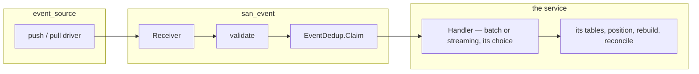
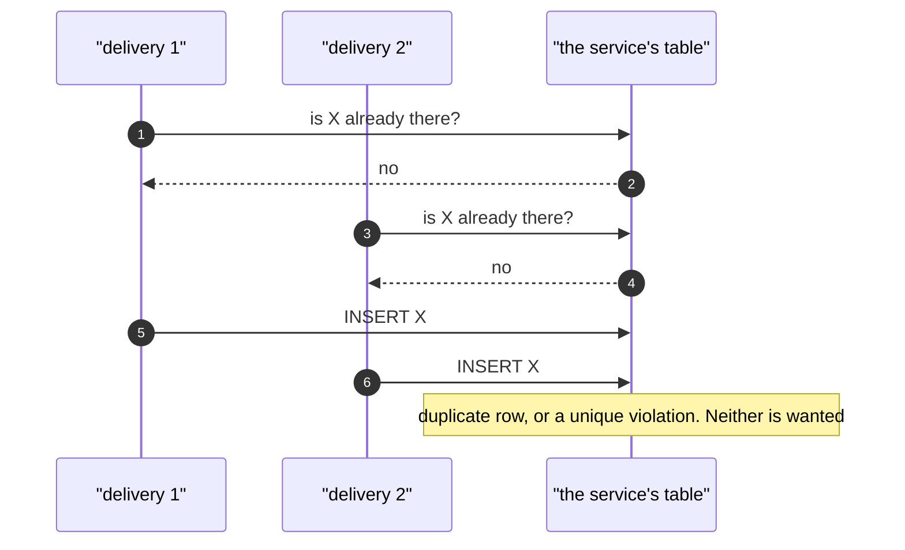
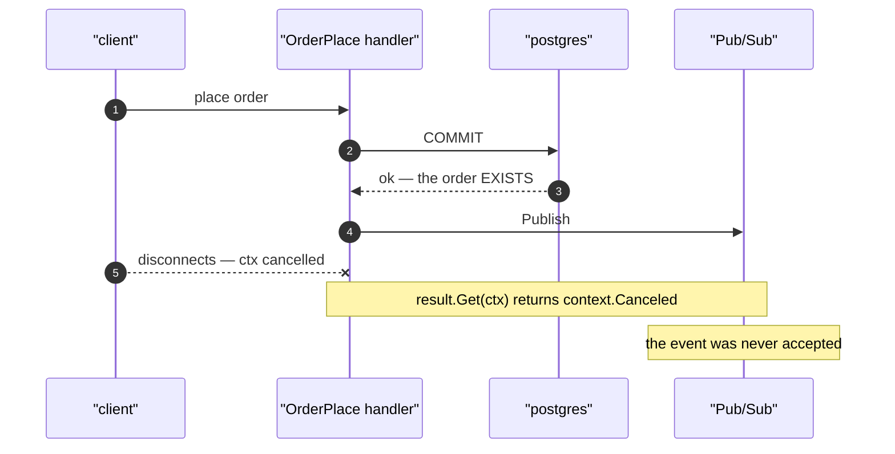

# `san_event` Architecture.

**The library provides the interfaces a service implements to RECEIVE and DEDUP events. Nothing else.**

How a service then *processes* those events — batch, streaming, whatever fits — is the service's own scope,
along with its tables, migrations, retention, position tracking, rebuild and reconcile. The library has no
opinion and no machinery there.

Transport stays in `event_source` (clients, topics, subscriptions, push/pull drivers). Pipeline design lives in
[data_pipeline.md](data_pipeline.md) — the **pipeline rules** worked out here, which moved there when this plan
was called final. The wider pipeline design is still being argued out in `disscuss/` and is not authoritative.

**Status: FINAL.** Decisions below are settled — reopen one deliberately, not by drifting.



---

# 1. The event contract

```go
type Event interface {
    proto.Message
    GetEventId() string          // logical id — the dedup key
    GetOccurredAtUnix() int64    // business time — what a consumer buckets by
}
```

```proto
string event_id         = 98 [(buf.validate.field).string.min_len = 1];
int64  occurred_at_unix = 99 [(buf.validate.field).int64.gt = 0];
```

**Getters are free.** `buf.gen.yaml` sets no `api_level`, so generated code is the open API: a getter per
field, no setters (`grep -c "func (x *OrderPlacedEvent) Set"` → 0). Adding the proto field **is** the whole
implementation, and taking `Event` rather than `proto.Message` makes a missing field a **compile error**.

**Two guarantees, both needed:** the interface proves the field *exists* (compile time); `buf.validate` proves
it is *filled* (validation time). `events.proto` has no validate rules today, so the validator already runs
with nothing to enforce — these annotations cost one line each.

**No setter.** If anything could stamp `occurred_at_unix` on an empty event, "must be filled" is decorative — a
default turns a loud failure into a silent wrong day at month end. Only the publisher writes it.

**`event_id` is deterministic, not a UUID.** A fresh id per publish defeats dedup for the exact case dedup
exists for: a redelivery and a replay are the same logical fact and must collide. Derive it from whatever row
caused it — `"stock-moved:<movement_id>"`.

**`occurred_at_unix` is when the fact HAPPENED, from one authoritative clock.** The library only requires that
the same fact always carries the same value. Two clocks for one fact put a boundary row in different days
depending on who reads it.

The name is doing real work, and was chosen over `transaction_time` deliberately: a **mandatory field gets
filled with whatever is nearest**, and what is nearest is the clock. `transaction_time` reads as a clock
reading, so callers would pass "now" — which is *recording* time. For most events the two coincide; they
diverge wherever a person supplies the date, and those are exactly the events where getting it wrong is
invisible. Naming is the only mechanism that gets the right value into a required field.

It stays a **timestamp, not a date**. Which day it belongs to is the consumer's decision — a stored date would
freeze that choice into every event ever published, and the timezone question belongs in
[data_pipeline.md](data_pipeline.md), not in the contract.

The `_unix` suffix follows the repo's existing convention for int64 instants (`last_restock_unix`,
`oldest_pending_unix`), which is what signals "not a `google.protobuf.Timestamp`" at a glance.

## Encoding — the library owns the codec

Services marshal and unmarshal events through the library, never directly:

```go
func Marshal(e Event) ([]byte, error)
func Unmarshal[T Event](data []byte) (T, error)   // DiscardUnknown, then protovalidate
```

One place decides the format, the decode options, and that validation happens — so twelve services cannot pick
differently or drift apart, and **nothing downstream can ever hold an invalid event**, on the receive path or
on a replay.

It also makes a coupling enforceable rather than documented. `DiscardUnknown` is permissive, so a payload of
the **wrong type** on a subscription decodes into a mostly-empty message instead of failing. Strict decoding
would catch that for free; this gives it up, and `protovalidate` is what catches it instead — `event_id` empty
and `occurred_at_unix` zero, so it becomes `Rejected`. Because one function does both, they cannot be
separated by someone tuning one of them later.

⚠ **This makes the loosen-only rule below MANDATORY, not advisory.** Validating on read is safe exactly as long as
an event that validated when published still validates today. Tighten a rule and every stored event that no
longer passes becomes **unreadable** — and it fails during a rebuild, in production, which is the worst
possible moment to discover it.

The two decisions hold each other up: validating on read is only sound under loosen-only, and validating on
read is what makes a violation of loosen-only *loud* instead of silent.

**One thing to measure rather than assume:** `protovalidate` is reflection-based, so validating every row of a
long rebuild is not free. If it ever matters, measure before adding a bypass — a second unvalidated entry point
is exactly the split this design just removed.

### No format tag — decided

The payload is the bytes, with nothing in front of them. **One format, chosen once, for the life of the
system.**

This is a now-or-never call rather than a deferrable one: a tag only works if it is on the *first* row, because
retrofitting leaves the older rows untagged and you are back to sniffing to tell tagged from untagged. So the
cost of "no" is stated plainly rather than discovered later:

| | |
| --- | --- |
| **if the format never changes** | we paid nothing, and carry no dead byte |
| **if it ever does** | every stored row is in the old format — a **migration rewrites them all**, per service, over its own table |

That migration is bounded and mechanical, and it may never be needed. A tag would have turned it into a branch
in `Unmarshal`; we are declining to pay a certain small cost against an uncertain large one.

⚠ **The consequence is that the codec is not a free choice later — so it had to be deliberate.**

**The format is `protojson`. Decided, and permanent.** It is what the sender already uses, so nothing has to be
converted. The reason it beat binary is not size — binary wins that 3–5×, and the loss is real once a service
retains events for years. It is that **the whole failure story in this plan ends with a human reading a
payload**: a `RejectHandler` row, a DLQ message, a log line. protojson is readable in the Pub/Sub console with
no tooling and no message type to hand; binary is opaque bytes at exactly the moment someone is trying to work
out what went wrong.

A service that stores events long-term and finds the size hurts can re-encode **in its own table** — storage is
its scope. The wire format is the one that has to stay legible.

## The event is a long-lived contract

An event message is a contract for as long as **any** consumer retains it — and the library cannot know how
long that is, because retention belongs to each service.

⚠ **The failure is not a crash — it is a rebuild that succeeds and disagrees.** A wire-level break is loud and
gets fixed. The dangerous edits are the ones where the replay *works*:

| Edit | What a stored event does on read | Loud? |
| --- | --- | --- |
| field removed | `DiscardUnknown` skips it — the value is gone | ❌ **rebuild produces different numbers** |
| tag renumbered, old number reused | old bytes read as the *new* field | ❌ silent garbage when types are compatible |
| field repurposed — same tag, type, new meaning | reads perfectly, means something else | ❌ **undetectable by any tool** |
| enum value removed | the old number survives and hits `default:` | ❌ silently mis-handled |
| validation tightened | fails `protovalidate` on read (plan §1) | ✅ loud — but mid-rebuild, in production |
| type changed incompatibly | decode error | ✅ loud |

`qty` is the sharpest: *units* in 2026, *cases* in 2028. Every historical event reads twelve times wrong, the
data is structurally valid, and nothing can tell.

**Care is not the answer, because the cost lands where the person making the change cannot see it.** The proto
belongs to the publishing service; retention belongs to each consumer. Someone deletes a field that "nothing
reads any more" — right about the code, wrong about three archives they have never opened.

### So it is mechanical, in three parts

**1. `buf breaking` in CI.** `proto/buf.yaml` already declares `breaking: use: FILE` — the strictest category —
and [ci.yml](../../.github/workflows/ci.yml) runs `buf lint` and the drift check but **never invokes it**. It
is configured and inert.

```yaml
- name: buf breaking
  working-directory: proto
  run: buf breaking --against 'https://github.com/pdcgo/warehouse_revamp.git#branch=main,subdir=proto'
```

One step, and four of the six rows above become a failed build. It is the cheapest correctness win available —
already paid for.

**2. An authoring guide that makes meaning STRUCTURAL**, so the tool can police it. Belongs in `guidelines/`,
which is already programmer-authoritative and already governs proto shape:

- **`reserved` on every removal — number AND name.** Tag reuse becomes impossible rather than discouraged.
  `role_base.v1` already does this for `ROLE_WAREHOUSE_LEADER`.
- **Put the unit and the meaning in the field name.** `qty` can be silently repurposed; **`qty_units` cannot** —
  changing it to cases requires a rename, and a rename is structural, so §1 catches it. This is what closes the
  undetectable row. The repo already leans this way: `last_restock_unix`, `oldest_pending_unix`.
- **Events carry facts, never references to mutable data.** Already this repo's doctrine in `events.proto` —
  *"FROZEN AT ORDER TIME … a product moved to another team next month must not rewrite who was owed"* — and it
  is the same failure in a different costume: meaning that drifts because the thing it points at changed.

**3. A conservative check for the residual.** `buf breaking` cannot see a tightened `buf.validate` constraint —
same tag, same name, same type. Diffing the validate options and **failing on any change to an existing
field's constraints** is easy; deciding whether a change is a tightening is not. So flag every one and let a
human confirm it is a loosening. Loosening is rare, so the false-positive cost is close to nothing.

> **The rule the three enforce:** fields may be **ADDED**, never removed, renumbered or repurposed — `reserved`
> them instead. **Validation rules may LOOSEN, never tighten.**

The second half matters more than it looks, because `Unmarshal` validates on every read: tighten a rule and
every older stored event becomes **unreadable**, discovered mid-rebuild.

## An event carries CHANGE, never a level

`delta`, never `balance`. This is a **contract** rule rather than a processing one, and it is precisely what
makes "batch or streaming, the service's choice" a free choice:

| | Order-sensitive? | So a service may… |
| --- | --- | --- |
| a level on the event | ❌ yes | only process in order — streaming needs sequencing, batches need sorting |
| a delta on the event | ✅ no | **process however it likes** — addition commutes |

A level would push ordering requirements out of the library and into every consumer, and the library would have
no way to enforce them. A delta makes the question disappear, which is what lets the library stop at the
contract.

⚠ **The trade:** an absolute self-corrects, a delta does not. A missing delta skews every later total forever,
where a level would have healed at the next event. That is the cost of order-independence, and it is why a
consumer that drops an event needs to know it did.

---

# 2. Receiving

Drivers live in `event_source`; the library's inbound edge is the normalised form they produce.

```go
type IncomingMessage struct {
    Subscription    string
    Data            []byte
    Attributes      map[string]string
    MessageID       string  // TRANSPORT id — logging only, NEVER the dedup key
    DeliveryAttempt int
}

type Receiver interface {
    Receive(ctx context.Context, msg IncomingMessage) error
}
```

The library decodes, validates, dispatches by subscription to the registered handler, and gets out of the way:

```go
Register[T Event](subscription string, h Handler[T])

type Handler[T Event] func(ctx context.Context, tx *gorm.DB, events []T) error
```

Typed registration means the consumer's own type is known, so nothing resolves through `protoregistry` and
`dynamicpb` never appears. The slice is a slice because a driver may deliver one message or many — **whether a
handler treats that as a batch or as a stream of one is the service's decision.**

## Outcomes, not errors

```go
type Result int

const (
    Handled   Result = iota // the handler took it
    Duplicate               // Claim said no
    Rejected                // will never succeed — recorded, and acknowledged
)
```

Pub/Sub offers **no third option**: you ACK (or return 200) and it is gone, or you do not and it comes back.
There is no way to say "I failed, do not retry". So the mapping is:

| Result | Driver does | Because |
| --- | --- | --- |
| `Handled` | Ack / 200 | done |
| `Duplicate` | Ack / 200 | already done |
| `Rejected` | **Ack / 200** | a retry fails identically — a NACK buys nothing and costs a redelivery storm |
| `error` | Nack / non-2xx | transient. A retry might work |

**`err` means try again; a `Result` means done.** A database being down is an error. An event that can never be
decoded is `Rejected`.

## Rejections — the library detects, the service decides

Only the library knows a rejection happened: it occurs *before* any handler is reached. Where it goes is the
service's:

```go
type RejectReason int

const (
    Undecodable      RejectReason = iota // not the type this subscription expects
    Invalid                              // failed protovalidate
    RepeatedFailure                      // DeliveryAttempt exceeded the threshold
)

type Rejection struct {
    Reason       RejectReason
    Err          error
    Subscription string
    EventID      string           // EMPTY when decoding failed before it could be read
    Message      IncomingMessage  // the raw payload — see below
    Attempt      int
}

type RejectHandler interface {
    Reject(ctx context.Context, tx *gorm.DB, r Rejection) error
}
```

⚠ **`Message` is the only surviving copy.** Because a rejection ACKs, the broker is finished with that event
forever — it will never be redelivered and cannot be retrieved later. Two rules follow:

- **Record before ACK.** Write the rejection, commit, *then* let the driver ack. A crash in between means a
  redelivery, which rejects and records again — harmless.
- **If `Reject` returns an error, NACK.** Never acknowledge an event you failed to record. This is the one
  place where "it will fail identically next time" is the wrong reasoning: the failure is ours, not the
  event's.

⚠ **`EventID` can be empty, so a rejection record cannot always dedup on it.** Use `MessageID` instead — and
note it is *correct* here for the same reason it is wrong for event dedup: Pub/Sub keeps one id per message
across redeliveries, so repeated rejections of the same delivery collapse. A genuinely republished message
gets a new id and is a new occurrence, which is what you want in a rejection log.

## Three layers, and the DLQ is the last

| | Trigger | Action | Payload ends up |
| --- | --- | --- | --- |
| 1 | undecodable / fails validation | `Rejected` → ACK | the service's `RejectHandler` |
| 2 | `DeliveryAttempt` over the threshold | `Rejected` → ACK | the service's `RejectHandler` |
| 3 | we never ran at all — panic, OOM, evicted pod | NACK → dead-letter | the DLQ topic |

Layer 2 is why `DeliveryAttempt` is on `IncomingMessage`: it catches "our code is broken on this message"
*inside our own tooling*, where the payload and the reason are visible.

**Pub/Sub owns layer 3 entirely** — a `deadLetterPolicy` on the subscription, `maxDeliveryAttempts` 5–100. We
implement nothing. Three notes that are still ours:

- ⚠ **Without the IAM grants it silently does nothing.** The policy needs the Pub/Sub service account to hold
  `publisher` on the dead-letter topic and `subscriber` on the source subscription. Missing them, the policy is
  accepted, looks correct, and never dead-letters.
- **The dead-letter topic needs its own subscription**, or messages expire at retention and "we have a DLQ"
  quietly means "we lose them a week later".
- **Set layer 2's threshold BELOW `maxDeliveryAttempts`.** Then our handling always fires first, and the DLQ
  stops being a queue and becomes a **detector**: anything arriving there means our code died before it could
  even check, which is a different and more useful signal than "bad message".

⚠ **The DLQ is not where bad data goes** — bad data is ACKed into the `RejectHandler`. The DLQ collects
infrastructure and process failures. Worth stating because the assumption is universal and here it is
backwards: someone hunting a missing event will check the DLQ, find it empty, and conclude it was never
published.

Set `maxDeliveryAttempts` **high** (near 100) rather than the default-ish 5. A low count is tuned for poison
messages, and here a NACK only ever means *transient* — so 5 attempts can dead-letter perfectly good events
during a short database blip.

---

# 3. Dedup

```go
type EventDedup interface {
    // isNew=false means already seen.
    // Decided BY the INSERT, in the caller's transaction — never by a prior read.
    Claim(ctx context.Context, tx *gorm.DB, e Event) (isNew bool, err error)
}
```

⚠ **Dedup IS the write, never a predicate before it.** An `IsDuplicate(event) bool` evaluated first has a
check-then-act race, because redelivery happens while the first attempt is still running:



So it is `INSERT … ON CONFLICT DO NOTHING` with rows-affected as the answer. Note the redundancy in the
alternative: a separate check is only safe if a unique index exists — and once one does, the check has nothing
left to do.

**The service owns the table**, its migration, its retention, and its columns. The library ships a **default
implementation** over a minimal shape — `event_id` plus a unique index — because twelve hand-written
`ON CONFLICT` statements is a lot of surface for SQL with several easy mistakes in it (`DO NOTHING` vs
`DO UPDATE`, rows-affected vs returned row, naming the right conflict target).

```go
dedup := san_event.NewDedup("inventory_daily_events")  // table bound here, and nowhere else
```

⚠ **Bind the table at construction, never per call.** The table *is* the dedup scope, so a misrouted write
fails **silently**: `ON CONFLICT DO NOTHING` swallows it, the driver ACKs, and the intended consumer is
permanently short. Without dedup you would get a visible duplicate; with it, a clean no-op.

A service substitutes its own implementation when it genuinely differs — typed columns, or a natural-key
conflict target.

## Schema validation

The default implementation has a schema expectation, so the library checks it **at startup and refuses to
boot**:

```go
san_event.ValidateSchema(db, "inventory_daily_events")
```

| | |
| --- | --- |
| **what it requires** | `event_id`, a unique index on it, and whatever the default `Claim` writes |
| **what it does not touch** | every other column. Retention, partitioning, typed payloads — the service's |

Same pattern as `ValidateDescriptors()`, which already refuses to start on a bad `use_scope` tag. Failing on
deploy beats failing on the first insert of the night — and because the service writes the migration by hand,
this is the only thing standing between a typo and a silent runtime failure.

### The validator binds the DEFAULT, not the interface — decided

**A service that substitutes its own `EventDedup` is not validated.** It has its own shape by definition, and
the library cannot know it.

The alternative was a `SchemaRequirements()` method on `EventDedup`, so a custom implementation could declare
what it needs and be checked the same way. Rejected as designing for a case that has not happened — **no
consumer exists yet**, and an interface can grow a method far more easily than it can lose one. If someone
substitutes and then wants checking, adding it costs nothing at that point.

What a substituting service gets instead is the primitive rather than the policy — the same column check the
default validator is built from, callable with its own list. No declarative schema description is forced on
anyone for the library's benefit.

⚠ **The accepted gap:** a service that substitutes has *no* boot-time protection, so a typo in its migration
surfaces at the first insert. That is the trade it took by substituting — it opted into owning its own shape.

⚠ **Requirements stay additive.** The validator makes a new required column a boot failure for every service
that has not migrated, so a library bump would become a coordinated deploy. Add optional columns; a service
that has not caught up loses a capability rather than the ability to start.

---

# 4. What the service owns

Everything past `Claim`:

| | |
| --- | --- |
| **processing model** | batch, streaming, per-event — its choice, made safe by the delta rule |
| **its tables** | the dedup table, any event storage, the stat tables. Schema and `.sql` migration |
| **position tracking** | a cursor, a flag column, or the broker's ack — whatever its model needs |
| **retention** | which also decides how far back it can ever rebuild |
| **rebuild and reconcile** | including whether to have them |
| **quarantine** | what to do with an event its handler cannot process |

The library's job ends when a validated, deduped, typed event reaches the handler.

---

# Nothing open

Every critique and every question raised in this discussion is now decided in the plan above, or recorded as
out of scope below. What is left is not critique but **work**:

| | Action | Where |
| --- | --- | --- |
| 1 | Run `buf breaking` against `main` | `.github/workflows/ci.yml` — the config already exists and nothing invokes it |
| 2 | ✅ **Done** — the event-authoring guide | [event-guideline.md](../event-guideline.md) |
| 3 | Diff `buf.validate` constraints, flagging any change on an existing field | CI, custom check |
| 4 | ✅ **Decided** — the codec is `protojson`, permanently (see *No format tag*) | `san_event.Marshal` |

---

# Out of scope — recorded so it is not lost

Findings that belong to `event_source` / `selling_service`, not here.

## A publish can be cancelled by its own request context

Both publishers pass the handler's `ctx` — [order_place.go:238](../../backend/services/selling_service/selling_v1/order_place.go#L238)
and [order_cancel.go:87](../../backend/services/selling_service/selling_v1/order_cancel.go#L87) — and
`result.Get(ctx)` blocks on it. So a client that disconnects between commit and durability kills the publish of
an **already-committed** order.



⚠ **This is the plan's own blind spot arriving in concrete form.** §5 says neither detector sees a silent
upstream, and this is how one happens: the event **never existed**. Dedup has nothing to collide with, the
consumer's own event table has nothing to replay, and reconcile compares two sides that agree about an event
neither ever saw. Every recovery mechanism in this plan begins *after* a successful publish — so this is the
hole `san_event` is architecturally unable to cover, not an unrelated tidy-up.

Worse, the failure is **biased toward the bad case**: a slow network lengthens the publish *and* raises the
chance of a disconnect during it.

### The fix goes in `NewPubsubEventSender`, not at the call sites

```go
ctx, cancel := context.WithTimeout(context.WithoutCancel(ctx), publishTimeout)
defer cancel()
```

| | |
| --- | --- |
| **why `WithoutCancel`, not `Background`** | it keeps context **values**, and the sender injects trace propagation from them — `Background` would silently break the publisher→consumer span link |
| **why a timeout is not optional** | `WithoutCancel` drops the deadline with the cancellation. `result.Get` blocks the request synchronously, so on its own it trades a cancelled publish for a **hung handler** |
| **why in the sender** | two call sites today and more later, and forgetting it is silent. No caller legitimately wants to cancel a publish — it is post-commit and non-fatal by design — so an uncancellable sender withholds nothing anyone wants |

## The dev loopback exercises no broker behaviour

Synchronous, ordered, exactly-once — see [event_sender.go](../../backend/cmd/app_development/event_sender.go).
Two decisions in this plan closed the divergences that counted:

| Divergence | Status |
| --- | --- |
| `MessageID` is the constant `"loopback"` | ✅ moot — dedup keys on `event_id`, so dev dedups correctly |
| ordered where production is not | ⚠ **partly** moot — the delta rule makes *summation* order-independent, not *entity lifecycle*. A void overtaking the row it voids still needs each handler to tolerate it, and dev will never say it doesn't |
| exactly-once | ⚠ residual — `Claim` defends a race dev cannot produce |
| no NACK, redelivery or DLQ | ⚠ layers 2 and 3 never fire locally |

**The residual belongs in a test, not the dev server.** Two concurrent transactions calling `Claim` on one
`event_id`, against real Postgres through `san_testdb`, proves the `ON CONFLICT` path — deterministic, and it
runs in CI, where requiring every developer to boot the emulator does neither.
