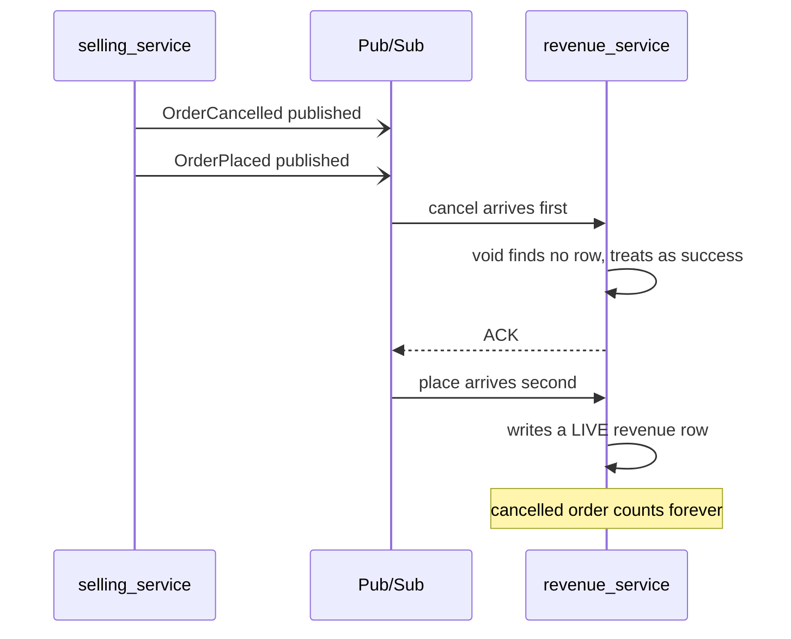
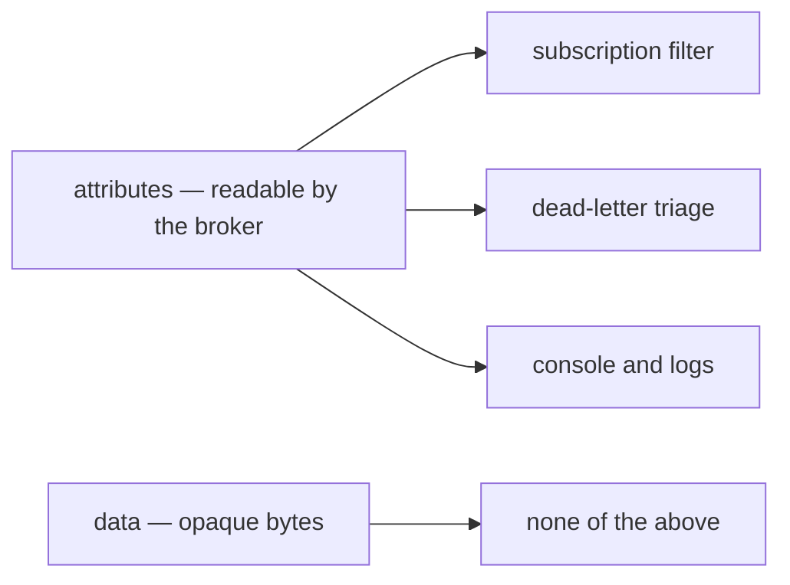
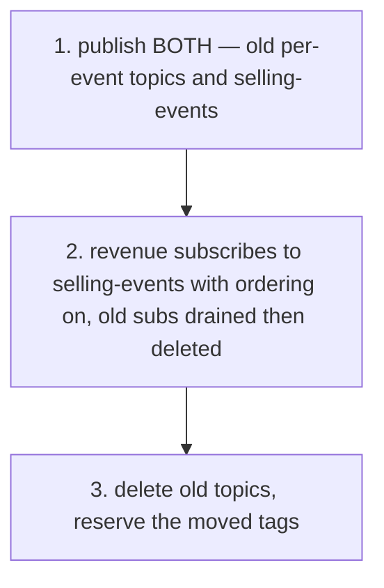

# Event Library — Protobuf over Pub/Sub

Authoritative. Build from this. Every event definition, publisher and subscriber follows it;
deviating requires a note in the commit saying which rule and why.

Transport lives in [`backend/pkgs/event_source/`](../../backend/pkgs/event_source/) — clients,
topics, subscriptions, push/pull drivers. Receiving, dedup and rejection live in
[`backend/pkgs/san_event/`](../../backend/pkgs/san_event/). The split is deliberate: a service
handler never sees a Pub/Sub type.

## Decided

| Decision | What it says |
| --- | --- |
| [topic-per-context](#topic-per-context) | One topic per bounded context, not per event type |
| [envelope-per-context](#envelope-per-context) | One `oneof` envelope per context, `<Context>Event` |
| [meta-at-one-payload-at-hundred](#meta-at-one-payload-at-hundred) | Metadata in 1–15, `oneof` variants from 100 |
| [reuse-event-config-50001](#reuse-event-config-50001) | Extend the existing option, never mint a second |
| [event-id-is-derived](#event-id-is-derived) | The dedup key is derived from the causing row, never a fresh ULID |
| [event-type-attribute-is-mandatory](#event-type-attribute-is-mandatory) | The inner variant's full name is always a Pub/Sub attribute |
| [no-sequence-field](#no-sequence-field) | No per-aggregate sequence — filters make gaps meaningless |
| [reject-never-nacks](#reject-never-nacks) | What can never succeed is acked and recorded, not nacked |
| [filter-subset-portable](#filter-subset-portable) | Filters restricted to what the dev broker can also do |
| [breaking-against-dev](#breaking-against-dev) | `buf breaking` compares against `dev`, not `main` |
| [no-published-sdk](#no-published-sdk) | One module, generated code committed — no artifact publish |

---

# 1. Core decisions

| | Rule |
| --- | --- |
| Format | Protobuf, binary encoding |
| Envelope | One `oneof` envelope per bounded context |
| Topics | One topic per bounded context |
| Dispatch | Consumers switch on the `oneof`, never on strings |
| Routing | Topic comes from the proto option, never a caller argument |
| Filtering | Pub/Sub subscription filters, on attributes |
| Delivery | At-least-once — every consumer is idempotent |

## topic-per-context

One topic per bounded context — `selling-events`, not `order-placed` + `order-cancelled`.

The reason is **ordering**, and it is not theoretical. Separate topics cannot be ordered relative
to each other, so a cancel can be delivered before the placement it cancels:



One topic plus an ordering key makes that sequence impossible. It also means adding an event type
costs a `oneof` variant instead of a topic, a Terraform change and a subscription.

## envelope-per-context

Envelope name is `<Context>Event` — `SellingEvent`, `InventoryEvent`.

**Scope test — who must agree before a new event type is added?**

| Answer | Verdict |
| --- | --- |
| The one team owning the aggregate | envelope is correctly sized |
| A cross-team review board | too wide — split it |

Never a global `WarehouseEvent`. It makes every consumer depend on every domain.

**When to skip it.** A context with 2–3 events and no shared lifecycle may use standalone messages
that each embed `EventMetadata`, dispatched on the attribute. The envelope's value scales with
variant count. Selling does *not* qualify — placed and cancelled share a lifecycle, which is
exactly why they need ordering.

---

# 2. Naming and versioning

- Package `warehouse.<context>.v<N>`, in `proto/warehouse/<context>/v<N>/`.
  ⚠ buf `STANDARD` lint enforces package == directory. This is not optional.
- **The version lives in the package name, never in a field.** A breaking change creates `v2`, a
  different type, so `v1` and `v2` coexist on the topic during migration.
- Variant names are past tense — `OrderPlacedEvent`, `OrderCancelledEvent`.
- `event_type` attribute values are the **fully-qualified inner type name**:
  `warehouse.selling.v1.OrderPlacedEvent`. Never a friendly slug.

---

# 3. Shared metadata

Lives in `warehouse.event_base.v1` — the event-contract package that already owns the option.
Not `warehouse.common.v1`, which holds RPC pagination primitives and has nothing to do with events.

```protobuf
// proto/warehouse/event_base/v1/metadata.proto
package warehouse.event_base.v1;

message EventMetadata {
  // The dedup key. DERIVED, never random — see event-id-is-derived.
  string event_id = 1 [(buf.validate.field).string.min_len = 1];

  // When the fact HAPPENED. Not the publish time, not the retry time.
  google.protobuf.Timestamp occurred_at = 2 [(buf.validate.field).required = true];

  // What the events of one stream are ordered BY. "order:8891".
  string aggregate_id = 3 [(buf.validate.field).string.min_len = 1];

  string trace_id = 4;
  string actor    = 5;
}
```

## event-id-is-derived

**`event_id` is derived from the row that caused the event — `"order-placed:8891"` — never a fresh
ULID or UUID.**

This overrides the ULID rule, and it is a money bug rather than a preference. A redelivery and a
**replay** are the same logical fact and must collide, because that collision is the only thing
dedup can see. A freshly minted id per publish cannot collide with the original, so a backfill
re-records every event it touches and `revenue_service` counts the same order twice.

The transport's own message id is a separate thing and is never the dedup key: a publisher retry
after a timed-out publish mints a new one for the same fact.

## no-sequence-field

There is **no `sequence`**. Per-aggregate gap detection contradicts
[filter-subset-portable](#filter-subset-portable) — a consumer filtered to one variant sees 3, 7,
11 and cannot distinguish legitimate filtering from message loss. A field that looks like a safety
net and fires false alarms is worse than no field.

---

# 4. Envelope shape

```protobuf
// proto/warehouse/selling/v1/events.proto
package warehouse.selling.v1;

message SellingEvent {
  option (warehouse.event_base.v1.event_config) = {
    event_topic: "selling-events"                 // LOGICAL name only
    ordering_key_field: "meta.aggregate_id"
  };

  warehouse.event_base.v1.EventMetadata meta = 1
      [(buf.validate.field).required = true];

  oneof payload {
    OrderPlacedEvent    placed    = 100;
    OrderCancelledEvent cancelled = 101;
  }
}
```

## meta-at-one-payload-at-hundred

| Range | Holds |
| --- | --- |
| 1–15 | metadata — single-byte tags, paid on every message |
| 16–99 | reserved for metadata growth |
| 100+ | `oneof` payload variants |

⚠ This applies to the **envelope's** field numbers. Fields *inside* a variant message are
unconstrained — `OrderPlacedEvent` keeps its domain fields at 1–8.

- The option goes on the **envelope**, never on the inner variants. Nothing reads an inner type's
  options at publish time.
- Every removed variant gets a `reserved` line with a date comment. **Never reuse a number.**

**The envelope owns the metadata; the variants must not.** An inner variant carrying its own
`event_id` gives one fact two idempotency keys, which is how a double-count starts. Variants that
previously carried them reserve the tags:

```protobuf
message OrderPlacedEvent {
  reserved 98, 99;  // was event_id / occurred_at_unix — moved to SellingEvent.meta, 2026-08
  ...
}
```

---

# 5. The topic option

`event_config = 50001` **already exists** in
[`event.proto`](../../proto/warehouse/event_base/v1/event.proto) and is extended, not replaced.

## reuse-event-config-50001

```protobuf
extend google.protobuf.MessageOptions {
  MessageEventConfig event_config = 50001;   // UNCHANGED
}

message MessageEventConfig {
  string event_topic        = 1;   // existing
  string ordering_key_field = 2;   // new
  bool   pii                = 3;   // new
}
```

Minting a second `MessageOptions` extension at 50001 is a **link-time failure** — the number is
taken. Adding fields to the existing nested message satisfies the same intent (nested message, not
a bare string) with no collision and no migration.

**Extension numbers in use — one register, never changed:**

| Number | Extends | Option |
| --- | --- | --- |
| 50001 | `MessageOptions` | `warehouse.event_base.v1.event_config` |
| 50002 | `MessageOptions` | `warehouse.role_base.v1.request_policy` |
| 50002 | `FieldOptions` | `warehouse.role_base.v1.use_scope` |

`event_topic` holds a **logical name** (`selling-events`), never a resource name
(`projects/…/topics/…`). The same binary runs in dev and production, and a runtime resolver applies
the project and environment prefix.

---

# 6. Publishing

A publisher takes the event and nothing else.

```go
bus.Publish(ctx, &sellingv1.SellingEvent{
    Meta:    meta,
    Payload: &sellingv1.SellingEvent_Placed{Placed: placed},
})
```

Everything else is derived by reflection:

| Derived | From | On absence |
| --- | --- | --- |
| topic | `event_topic` option | **error** — never a default |
| ordering key | the field named by `ordering_key_field` | error |
| attributes | the envelope | always set, see below |

## event-type-attribute-is-mandatory

Three attributes, always:

```
event_type:   warehouse.selling.v1.OrderPlacedEvent   # the INNER variant's full name
event_id:     order-placed:8891
aggregate_id: order:8891
```

**Pub/Sub filters cannot see inside the payload.** Everything in `data` is opaque to the broker —
no filtering, no ordering key, no console read, no dead-letter triage:



Attributes are a **routing index, never the source of truth**. Every one is a copy of something in
`data`, so a mismatch is a bug rather than an ambiguity.

⚠ Never accept a topic name as a function argument. Never define topic string constants.

---

# 7. Consuming

- One **narrow subscription per consumer**, filtered server-side. Subscription filters are
  **immutable** — changing one means creating a new subscription.
- Dispatch with a typed switch. No registry, no reflection, no `dynamicpb`:

```go
switch p := evt.Payload.(type) {
case *sellingv1.SellingEvent_Placed:
    return h.onPlaced(ctx, evt.Meta, p.Placed)
case *sellingv1.SellingEvent_Cancelled:
    return h.onCancelled(ctx, evt.Meta, p.Cancelled)
default:
    unknownVariant.WithLabelValues(name).Inc()
    return nil // ACK
}
```

- Enable the `exhaustive` linter — a Go type switch has no compiler exhaustiveness check.
- Every consumer is **idempotent on `meta.event_id`**, via `san_event.EventDedup.Claim`, **in the
  same transaction as the handler's work**. Delivery is at-least-once; this is not optional.
- Every subscription has a **dead-letter topic**, max 5 delivery attempts.

## reject-never-nacks

Nacking a message that can never succeed builds an infinite redelivery loop that costs money and
buries real failures. `san_event` classifies before any handler is reached:

| Outcome | Meaning | Action |
| --- | --- | --- |
| `Undecodable` | bytes are not the expected type | record, then **ACK** |
| `Invalid` | decoded, failed protovalidate | record, then **ACK** |
| `RepeatedFailure` | past the attempt threshold — our code is broken | record, then **ACK** |
| unknown variant | envelope parsed, variant not handled here | counter, then **ACK** |
| handler error | transient — the DB is down | **NACK** → retry → DLQ |

⚠ **Record before ack.** A rejection ACKs, so the broker is finished with that message forever.
`Rejection.Message` is the only surviving copy — write it and commit before the driver acks.

## filter-subset-portable

Filters are restricted to **exact match and prefix on `event_type`**:

```
attributes.event_type = "warehouse.selling.v1.OrderPlacedEvent"
hasPrefix(attributes.event_type, "warehouse.selling.")
```

That is the whole permitted grammar, because the **sqlite dev broker must implement the same
filter**. A dev environment with no server-side filtering delivers events production never would,
so a consumer works locally and starves — or drowns — in production. The filter is part of the
subscription contract in code, not a setting typed into a console.

---

# 8. Evolution

| Change | Allowed? |
| --- | --- |
| Add a field with a new tag number | ✅ |
| Add a `oneof` variant with a new tag number | ✅ |
| Remove a field/variant **and** add `reserved` | ✅ |
| Rename a field — wire-compatible, breaks JSON | ⚠ needs review |
| Change a field's type | ❌ new `vN+1` |
| Reuse a retired tag number | ❌ never |
| Renumber an existing field | ❌ never |

Protobuf fails **silently** when these are broken — you get garbage that decodes "successfully",
not a parse error. Tooling catches it, not review.

---

# 9. CI

## breaking-against-dev

```sh
buf lint
buf breaking --against '.git#branch=dev'
```

Against **`dev`**, not `main`. Work lives on a long-lived `dev` branch and `main` lags until the
owner asks for a promotion — comparing to `main` would greenlight a change that breaks something
added on `dev` since the last one.

A descriptor-set test fails when:

- any `*Event` envelope lacks the `(warehouse.event_base.v1.event_config)` option;
- any `event_topic` value is not in the list Terraform actually creates;
- any envelope's `meta` field is absent or not at tag 1.

## no-published-sdk

**No versioned SDK artifacts, no schema registry, no submodule.** This is one buf module; `buf
generate` emits Go and TypeScript together and both are committed to `backend/gen/` and
`frontend/src/gen/`. The equivalent guarantee is the **generated-drift check** already in CI — a
publish step in the middle of the design loop buys nothing here and costs a release per contract
edit.

---

# 10. Never do

- ❌ A global `WarehouseEvent` covering every domain.
- ❌ `bytes payload` or `google.protobuf.Any` inside the envelope — keeps the coupling, loses schema
  validation, BigQuery subscriptions and readable `protojson`.
- ❌ A `version` field inside the message — forces a decode before you can route.
- ❌ Detecting message type by trial-and-error parsing. Protobuf will "succeed" on the wrong type
  and hand you garbage.
- ❌ Fully-qualified Pub/Sub resource names inside a `.proto`.
- ❌ Nacking an unrecognised event type, or anything else that can never succeed.
- ❌ A fresh ULID/UUID as `event_id` — see [event-id-is-derived](#event-id-is-derived).
- ❌ `dynamicpb` or custom registries in a business service. That machinery is for infrastructure
  consumers only (§11).

---

# 11. Infrastructure consumers — later, not day one

Consumers that must handle *every* event and cannot be recompiled per new type — audit sinks,
data-lake loaders, DLQ inspectors — load schemas as **data**:

1. Publish a `FileDescriptorSet`, or read Pub/Sub's own Schema API.
2. Build a private registry with `protodesc.NewFiles` + `dynamicpb`. Recurse into nested messages —
   `fd.Messages()` does not include them.
3. Pass it as `Resolver` on `proto.UnmarshalOptions` / `protojson.MarshalOptions`. **Never** register
   into `protoregistry.GlobalTypes`.
4. Swap registries with `atomic.Pointer`; treat each as immutable after construction.
5. Compare descriptors by `FullName()`, never by pointer — identity is per-registry.

⚠ Custom options arrive as **unknown fields** on dynamic descriptors unless `md.Options()` is
re-parsed with a resolver that knows the extension type. This is the same class of bug as the
linking one: `proto.HasExtension` silently returns false and it reads as a logic error.

Build descriptor sets with `--include_imports` (buf does this by default).

The highest-value tool here is a CLI that prints any message as `protojson`. Build that first —
on-call will use it constantly.

---

# 12. What this changes in the code

The envelope is new, so nothing is renumbered — but three things move.

**`san_event.Event` becomes metadata-shaped.** The interface currently proves `GetEventId()` and
`GetOccurredAtUnix()` exist on the message itself; with metadata nested it proves `GetMeta()`:

```go
type Event interface {
	proto.Message
	GetMeta() *event_basev1.EventMetadata
}
```

⚠ **A nil `meta` must be rejected, loudly.** `GetMeta()` on an unset field returns nil, and
`GetEventId()` on nil returns `""` — so an empty metadata block would dedup every event in the
system against the key `""`. `(buf.validate.field).required` on `meta` and `min_len = 1` on
`event_id` are both load-bearing, and the receiver treats an empty `event_id` as `Invalid`.

**Migration is dual-publish, in three steps:**



**The ordering bug is not fixed by this doc alone.** During step 1 the old topics are still
unordered, and `RevenueVoid` treats a missing row as success — so a cancel that overtakes its
placement leaves a live revenue row forever. That needs its own fix (a voided tombstone keyed on
`order_id`, so the later record collides with it), tracked separately from this guideline.
